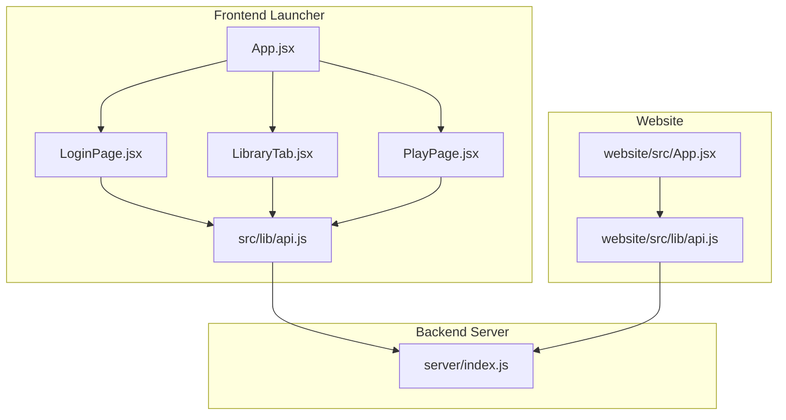
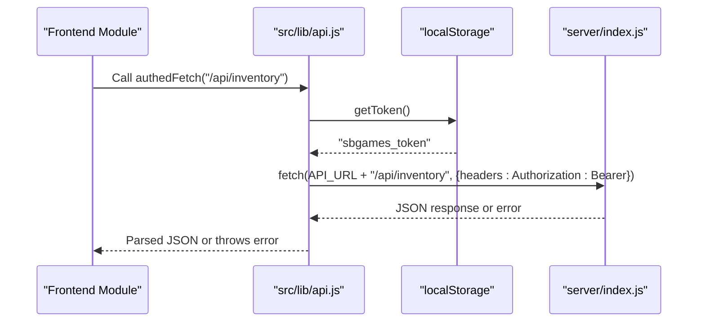
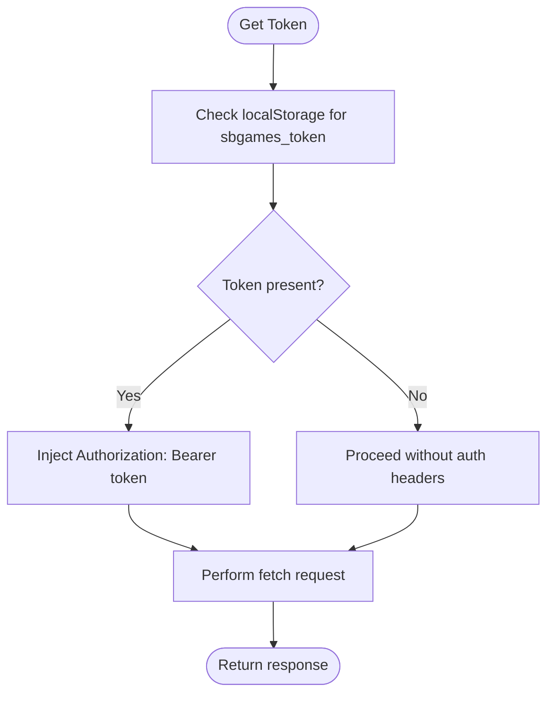
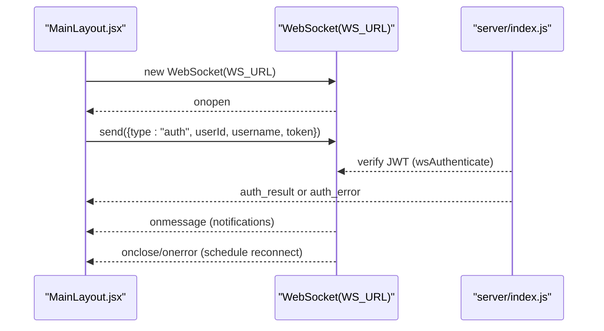
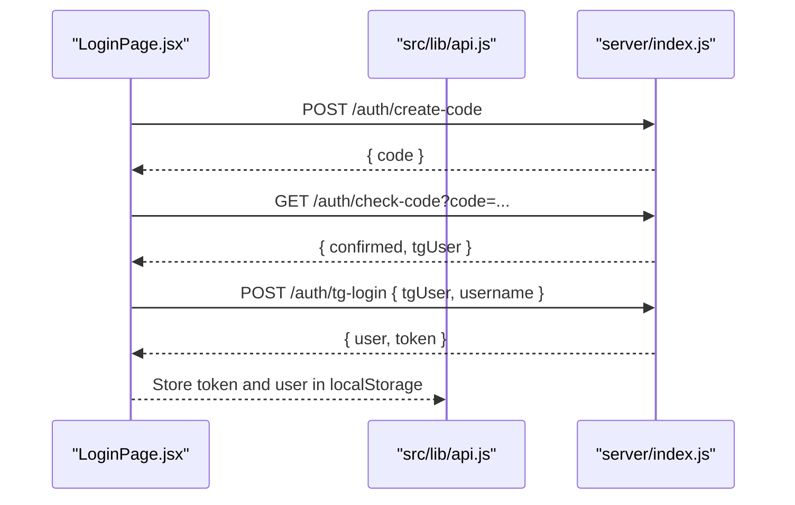
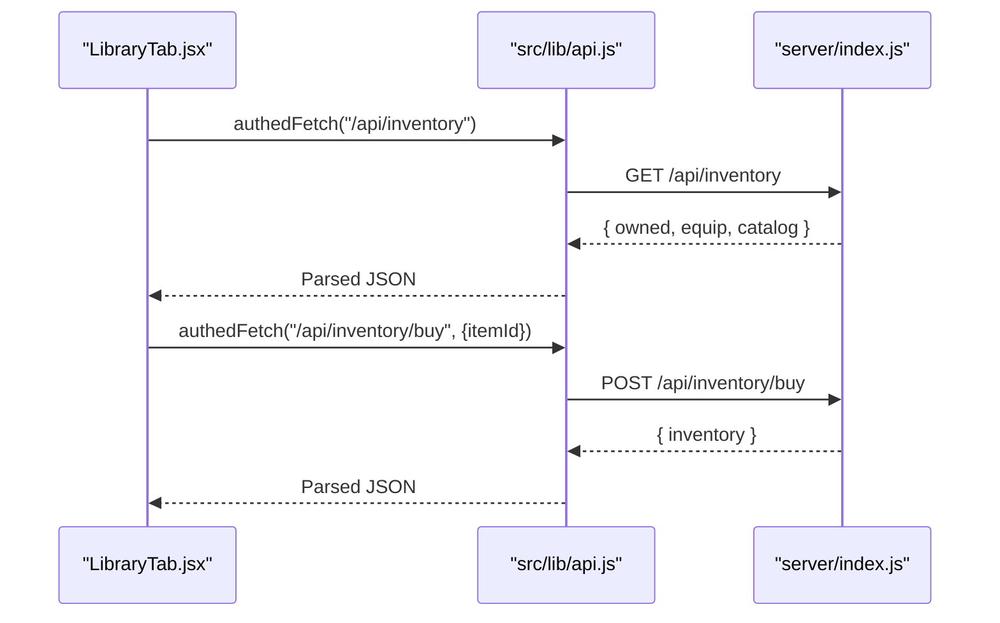
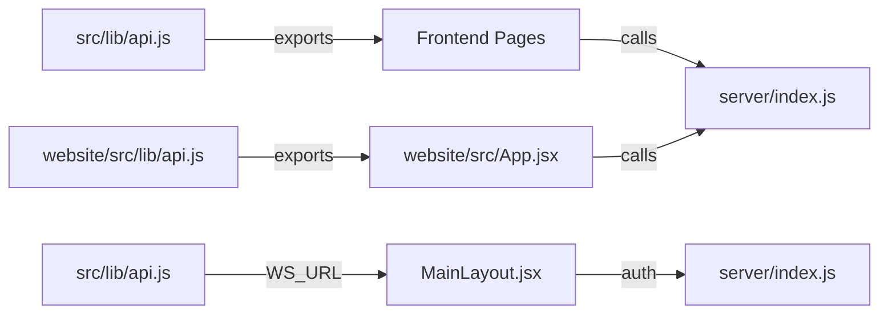

# API Communication Layer

<cite>
**Referenced Files in This Document**
- [api.js](file://src/lib/api.js)
- [api.js](file://website/src/lib/api.js)
- [App.jsx](file://src/App.jsx)
- [MainLayout.jsx](file://src/pages/MainLayout.jsx)
- [PlayPage.jsx](file://src/pages/PlayPage.jsx)
- [LibraryTab.jsx](file://src/pages/LibraryTab.jsx)
- [LoginPage.jsx](file://src/pages/LoginPage.jsx)
- [index.js](file://server/index.js)
</cite>

## Table of Contents
1. [Introduction](#introduction)
2. [Project Structure](#project-structure)
3. [Core Components](#core-components)
4. [Architecture Overview](#architecture-overview)
5. [Detailed Component Analysis](#detailed-component-analysis)
6. [Dependency Analysis](#dependency-analysis)
7. [Performance Considerations](#performance-considerations)
8. [Troubleshooting Guide](#troubleshooting-guide)
9. [Conclusion](#conclusion)

## Introduction
This document describes the API communication layer that handles all frontend-backend interactions for the SBGames launcher and website. It focuses on two primary functions: `authFetch` and `authedFetch`, which manage authentication tokens and HTTP requests, and the constants `API_URL` and `WS_URL` that define HTTPS and WebSocket endpoints. The documentation covers token management using localStorage with Bearer token authentication, practical examples of API calls for user authentication, game data retrieval, and launch operations, as well as error handling patterns and response validation.

## Project Structure
The API communication layer spans three main areas:
- Frontend launcher (React): Centralized in `src/lib/api.js` with usage across pages like Login, Library, and Play.
- Website (React): Has its own API module (`website/src/lib/api.js`) for authentication and user refresh logic.
- Backend server (Node.js/Express): Implements REST endpoints and WebSocket authentication used by the launcher.

**Diagram sources**
- [App.jsx:1-41](file://src/App.jsx#L1-L41)
- [LoginPage.jsx:1-453](file://src/pages/LoginPage.jsx#L1-L453)
- [LibraryTab.jsx:1-1042](file://src/pages/LibraryTab.jsx#L1-L1042)
- [PlayPage.jsx:1-746](file://src/pages/PlayPage.jsx#L1-L746)
- [api.js:1-50](file://src/lib/api.js#L1-L50)
- [App.jsx:1-60](file://website/src/App.jsx#L1-L60)
- [api.js:1-33](file://website/src/lib/api.js#L1-L33)
- [index.js:1-800](file://server/index.js#L1-L800)

**Section sources**
- [api.js:1-50](file://src/lib/api.js#L1-L50)
- [api.js:1-33](file://website/src/lib/api.js#L1-L33)
- [App.jsx:1-41](file://src/App.jsx#L1-L41)
- [App.jsx:1-60](file://website/src/App.jsx#L1-L60)

## Core Components
This section documents the core API communication functions and constants used throughout the application.

- Constants
  - `API_URL`: HTTPS base URL for REST API calls.
  - `WS_URL`: WebSocket base URL for real-time notifications.

- Token Management
  - `getToken()`: Retrieves the stored Bearer token from localStorage.

- Functions
  - `authFetch(path, options)`: Performs authenticated fetch with automatic Bearer token injection.
  - `authedFetch(path, options)`: Performs authenticated fetch with robust error handling and JSON parsing.

Key behaviors:
- Automatic Authorization header injection when a token exists.
- Comprehensive error handling for non-JSON responses, HTML responses, and network errors.
- JSON validation and structured error reporting.

**Section sources**
- [api.js:1-50](file://src/lib/api.js#L1-L50)

## Architecture Overview
The API communication layer follows a consistent pattern:
- Frontend modules import `API_URL`, `WS_URL`, and token helpers from `src/lib/api.js`.
- Authentication is handled via Bearer tokens stored in localStorage.
- REST endpoints are called using `authedFetch` for validated JSON responses.
- WebSocket connections use `WS_URL` with JWT-based authentication during the handshake.

**Diagram sources**
- [api.js:8-49](file://src/lib/api.js#L8-L49)
- [LibraryTab.jsx:639-667](file://src/pages/LibraryTab.jsx#L639-L667)
- [index.js:344-350](file://server/index.js#L344-L350)

**Section sources**
- [api.js:1-50](file://src/lib/api.js#L1-L50)
- [LibraryTab.jsx:639-667](file://src/pages/LibraryTab.jsx#L639-L667)
- [index.js:344-350](file://server/index.js#L344-L350)

## Detailed Component Analysis

### Token Management and Bearer Authentication
- Storage: Tokens and user data are persisted in localStorage under keys like `sbgames_token` and `sbgames_user`.
- Retrieval: `getToken()` reads the token for inclusion in Authorization headers.
- Refresh: The website module includes a `refreshUser()` function that validates the token against `/auth/me` and updates local state accordingly.

**Diagram sources**
- [api.js:4-6](file://src/lib/api.js#L4-L6)
- [api.js:16-32](file://website/src/lib/api.js#L16-L32)

**Section sources**
- [api.js:4-6](file://src/lib/api.js#L4-L6)
- [api.js:16-32](file://website/src/lib/api.js#L16-L32)

### authFetch Function
Purpose:
- Wraps fetch with automatic Bearer token injection and JSON content-type headers.
- Intended for scenarios where the caller handles response validation and error extraction.

Behavior highlights:
- Merges provided headers with default JSON content type.
- Adds Authorization header only if a token exists.
- Returns the raw Response object for downstream handling.

Usage examples:
- Login page performs direct fetch calls to `/auth/create-code`, `/auth/check-code`, and `/auth/tg-login` without using `authedFetch`.

**Section sources**
- [api.js:8-17](file://src/lib/api.js#L8-L17)
- [LoginPage.jsx:53-80](file://src/pages/LoginPage.jsx#L53-L80)
- [LoginPage.jsx:82-97](file://src/pages/LoginPage.jsx#L82-L97)
- [LoginPage.jsx:99-137](file://src/pages/LoginPage.jsx#L99-L137)

### authedFetch Function
Purpose:
- Provides authenticated fetch with robust error handling and JSON parsing.

Key steps:
- Injects Authorization header if token exists.
- Validates response status and extracts meaningful error messages.
- Handles HTML responses (common for server errors) and attempts JSON parsing.
- Ensures non-empty, non-HTML JSON responses; otherwise throws descriptive errors.

Error handling patterns:
- Non-2xx responses: Extracts text, detects HTML, parses JSON error messages, or falls back to generic status text.
- Empty or HTML responses: Throws explicit errors indicating server issues or invalid responses.
- JSON parse failures: Throws descriptive errors.

Usage examples:
- Library inventory loading: Calls `authedFetch("/api/inventory")` and updates state with owned items and equipment.
- Purchase and equip operations: Uses `authedFetch` for `/api/inventory/buy` and `/api/inventory/equip` with POST bodies.

**Section sources**
- [api.js:20-49](file://src/lib/api.js#L20-L49)
- [LibraryTab.jsx:639-667](file://src/pages/LibraryTab.jsx#L639-L667)
- [LibraryTab.jsx:682-700](file://src/pages/LibraryTab.jsx#L682-L700)
- [LibraryTab.jsx:702-720](file://src/pages/LibraryTab.jsx#L702-L720)

### WebSocket Integration
- URL: `WS_URL` constant defines the secure WebSocket endpoint.
- Authentication: Clients send an `auth` message containing `userId`, `username`, and `token` after connecting.
- Reconnection: The launcher implements a simple exponential-backoff-like reconnect mechanism.

**Diagram sources**
- [MainLayout.jsx:46-99](file://src/pages/MainLayout.jsx#L46-L99)
- [api.js:1-2](file://src/lib/api.js#L1-L2)
- [index.js:761-800](file://server/index.js#L761-L800)

**Section sources**
- [MainLayout.jsx:46-99](file://src/pages/MainLayout.jsx#L46-L99)
- [api.js:1-2](file://src/lib/api.js#L1-L2)
- [index.js:761-800](file://server/index.js#L761-L800)

### Practical API Call Examples

#### User Authentication Flow (Launcher)
- Step 1: Create auth code
  - Endpoint: `POST /auth/create-code`
  - Example call: `fetch(API_URL + "/auth/create-code", { method: "POST" })`
- Step 2: Poll for confirmation
  - Endpoint: `GET /auth/check-code?code=<value>`
  - Example call: `fetch(API_URL + "/auth/check-code?code=" + code)`
- Step 3: Complete login with Telegram user and optional nickname
  - Endpoint: `POST /auth/tg-login`
  - Example call: `fetch(API_URL + "/auth/tg-login", { method: "POST", body: JSON.stringify({ tgUser, username }) })`

**Diagram sources**
- [LoginPage.jsx:99-137](file://src/pages/LoginPage.jsx#L99-L137)
- [LoginPage.jsx:155-180](file://src/pages/LoginPage.jsx#L155-L180)
- [index.js:184-200](file://server/index.js#L184-L200)
- [index.js:140-176](file://server/index.js#L140-L176)

**Section sources**
- [LoginPage.jsx:99-137](file://src/pages/LoginPage.jsx#L99-L137)
- [LoginPage.jsx:155-180](file://src/pages/LoginPage.jsx#L155-L180)
- [index.js:184-200](file://server/index.js#L184-L200)
- [index.js:140-176](file://server/index.js#L140-L176)

#### Game Data Retrieval (Library)
- Load inventory and equipment:
  - Endpoint: `GET /api/inventory`
  - Example call: `authedFetch("/api/inventory")`
- Purchase item:
  - Endpoint: `POST /api/inventory/buy`
  - Example call: `authedFetch("/api/inventory/buy", { method: "POST", body: JSON.stringify({ itemId }) })`
- Equip item:
  - Endpoint: `POST /api/inventory/equip`
  - Example call: `authedFetch("/api/inventory/equip", { method: "POST", body: JSON.stringify({ itemId }) })`
- Unequip item:
  - Endpoint: `POST /api/inventory/unequip`
  - Example call: `authedFetch("/api/inventory/unequip", { method: "POST", body: JSON.stringify({ type }) })`

**Diagram sources**
- [LibraryTab.jsx:639-667](file://src/pages/LibraryTab.jsx#L639-L667)
- [LibraryTab.jsx:682-700](file://src/pages/LibraryTab.jsx#L682-L700)
- [LibraryTab.jsx:702-720](file://src/pages/LibraryTab.jsx#L702-L720)
- [index.js:344-350](file://server/index.js#L344-L350)
- [index.js:352-366](file://server/index.js#L352-L366)
- [index.js:368-379](file://server/index.js#L368-L379)
- [index.js:381-391](file://server/index.js#L381-L391)

**Section sources**
- [LibraryTab.jsx:639-667](file://src/pages/LibraryTab.jsx#L639-L667)
- [LibraryTab.jsx:682-700](file://src/pages/LibraryTab.jsx#L682-L700)
- [LibraryTab.jsx:702-720](file://src/pages/LibraryTab.jsx#L702-L720)
- [index.js:344-350](file://server/index.js#L344-L350)
- [index.js:352-366](file://server/index.js#L352-L366)
- [index.js:368-379](file://server/index.js#L368-L379)
- [index.js:381-391](file://server/index.js#L381-L391)

#### Launch Operations (Play Page)
- Activity reporting:
  - Endpoint: `POST /api/activity`
  - Example call: `fetch(API_URL + "/api/activity", { method: "POST", headers: { Authorization: Bearer token }, body: JSON.stringify({ serverId, startedAt, endedAt, durationSec }) })`

Note: The launcher invokes native commands via Tauri for actual game launch; the HTTP call here is for reporting session statistics.

**Section sources**
- [PlayPage.jsx:177-188](file://src/pages/PlayPage.jsx#L177-L188)
- [index.js:412-422](file://server/index.js#L412-L422)

## Dependency Analysis
The API communication layer exhibits clear separation of concerns:
- Frontend modules depend on `src/lib/api.js` for shared HTTP and WebSocket utilities.
- The website module maintains its own token refresh logic in `website/src/lib/api.js`.
- Backend endpoints are defined in `server/index.js` and protected by JWT middleware.

**Diagram sources**
- [api.js:1-50](file://src/lib/api.js#L1-L50)
- [MainLayout.jsx:46-99](file://src/pages/MainLayout.jsx#L46-L99)
- [api.js:1-33](file://website/src/lib/api.js#L1-L33)
- [App.jsx:1-60](file://website/src/App.jsx#L1-L60)
- [index.js:1-800](file://server/index.js#L1-L800)

**Section sources**
- [api.js:1-50](file://src/lib/api.js#L1-L50)
- [api.js:1-33](file://website/src/lib/api.js#L1-L33)
- [MainLayout.jsx:46-99](file://src/pages/MainLayout.jsx#L46-L99)
- [App.jsx:1-60](file://website/src/App.jsx#L1-L60)
- [index.js:1-800](file://server/index.js#L1-L800)

## Performance Considerations
- Token injection overhead is minimal; performed per request.
- `authedFetch` adds validation and parsing costs but improves reliability.
- WebSocket reconnection uses a simple timer; consider jitter for high-load scenarios.
- Rate limiting on the backend protects against abuse; frontend should implement backoff strategies for retries.

## Troubleshooting Guide
Common issues and resolutions:
- Invalid or missing token
  - Symptom: 401 Unauthorized on protected endpoints.
  - Resolution: Clear localStorage tokens and force re-authentication.
- HTML responses instead of JSON
  - Symptom: Errors indicating HTML responses or empty payloads.
  - Resolution: Verify server health and endpoint correctness.
- Network errors or timeouts
  - Symptom: Thrown errors during fetch.
  - Resolution: Implement retry logic with exponential backoff and notify users.
- JSON parse failures
  - Symptom: Errors stating the response is not valid JSON.
  - Resolution: Log raw response text and confirm server-side serialization.

**Section sources**
- [api.js:20-49](file://src/lib/api.js#L20-L49)
- [LibraryTab.jsx:639-667](file://src/pages/LibraryTab.jsx#L639-L667)

## Conclusion
The API communication layer provides a consistent, secure, and resilient foundation for frontend-backend interactions. By centralizing token management and HTTP utilities in `src/lib/api.js`, the system ensures uniform authentication, robust error handling, and maintainable integration patterns. The combination of REST endpoints and WebSocket channels enables real-time updates and reliable session management across the launcher and website.