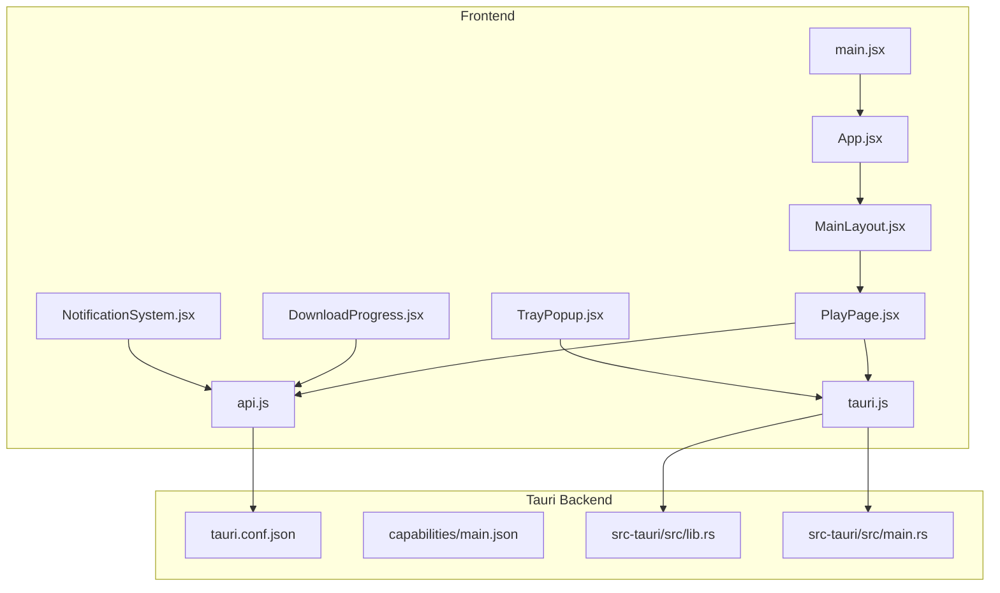
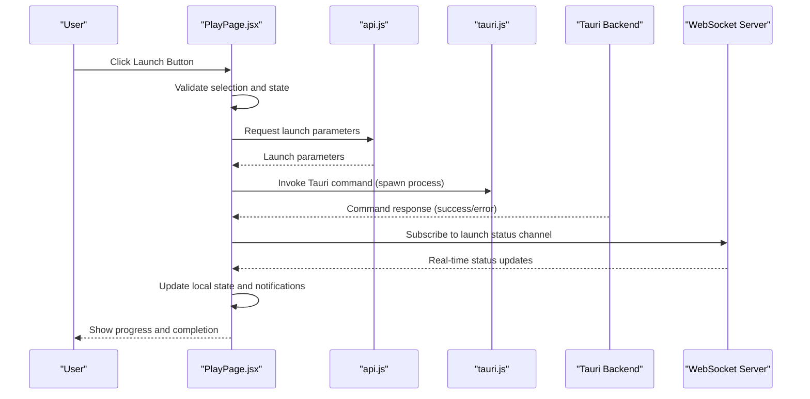
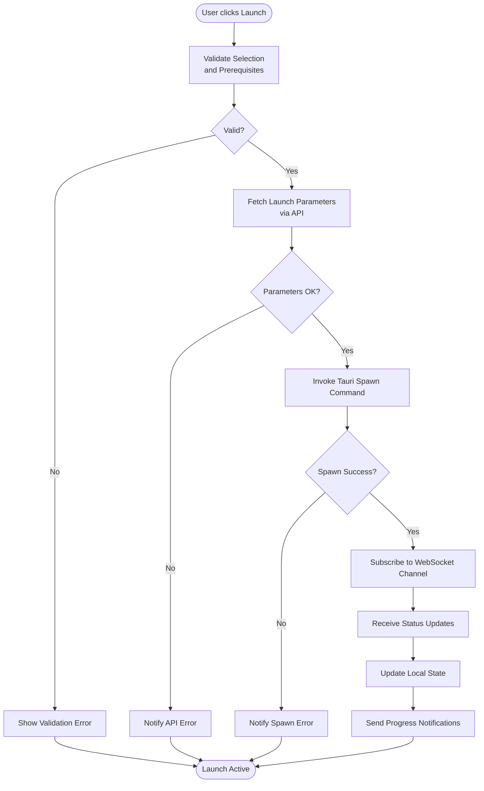
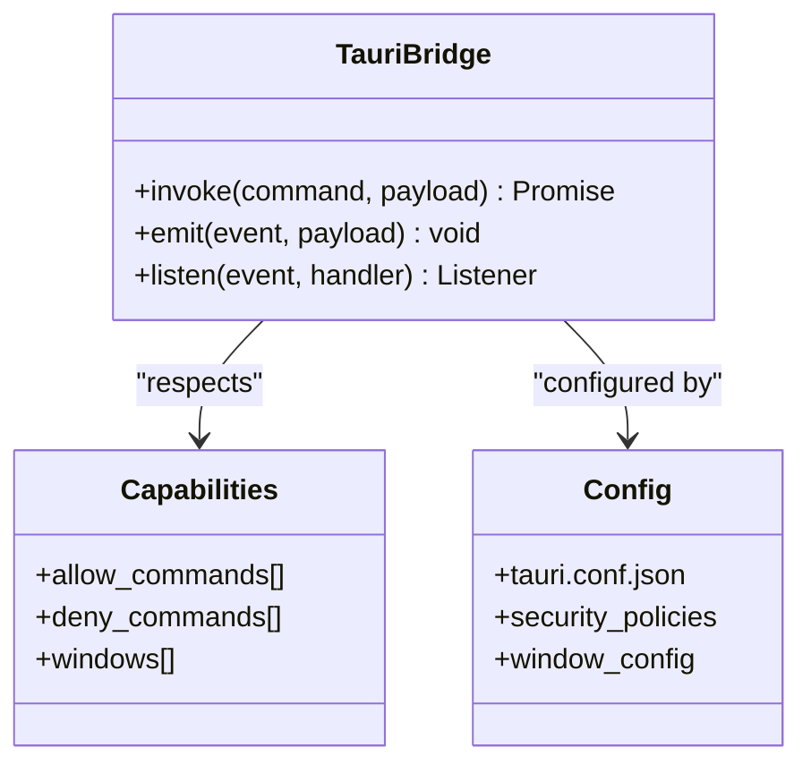
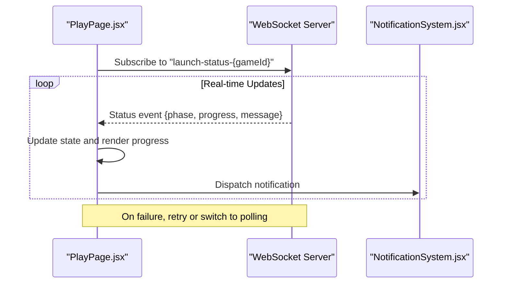
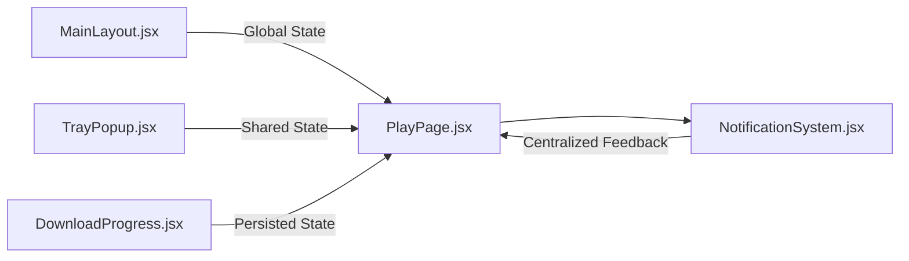
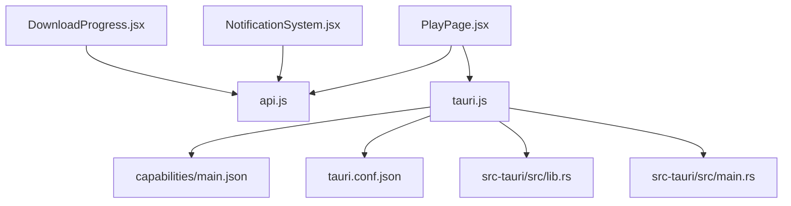

# Frontend-Backend Integration

<cite>
**Referenced Files in This Document**
- [tauri.js](file://src/lib/tauri.js)
- [api.js](file://src/lib/api.js)
- [PlayPage.jsx](file://src/pages/PlayPage.jsx)
- [MainLayout.jsx](file://src/pages/MainLayout.jsx)
- [TrayPopup.jsx](file://src/pages/TrayPopup.jsx)
- [DownloadProgress.jsx](file://src/components/DownloadProgress.jsx)
- [NotificationSystem.jsx](file://src/components/NotificationSystem.jsx)
- [main.jsx](file://src/main.jsx)
- [App.jsx](file://src/App.jsx)
- [lib.rs](file://src-tauri/src/lib.rs)
- [main.rs](file://src-tauri/src/main.rs)
- [tauri.conf.json](file://src-tauri/tauri.conf.json)
- [capabilities.json](file://src-tauri/capabilities/main.json)
</cite>

## Table of Contents
1. [Introduction](#introduction)
2. [Project Structure](#project-structure)
3. [Core Components](#core-components)
4. [Architecture Overview](#architecture-overview)
5. [Detailed Component Analysis](#detailed-component-analysis)
6. [Dependency Analysis](#dependency-analysis)
7. [Performance Considerations](#performance-considerations)
8. [Troubleshooting Guide](#troubleshooting-guide)
9. [Conclusion](#conclusion)

## Introduction
This document explains how the frontend React application integrates with the Tauri backend to enable game launching workflows. It covers API communication patterns, data flow between components, state management during launch operations, and the role of the tauri.js bridge for native system access. It also documents WebSocket-based real-time status updates, offline fallback mechanisms, and cross-page coordination for shared launch state.

## Project Structure
The integration spans three primary areas:
- Frontend React application under src/
- Tauri backend under src-tauri/
- Shared libraries for API and Tauri bridge under src/lib/

Key frontend files involved in game launching:
- Play page orchestrating launch actions
- Main layout coordinating navigation and global state
- Tray popup for system tray interactions
- Download progress component for update workflows
- Notification system for user feedback
- API client and Tauri bridge utilities

Tauri backend files:
- Rust entry points and service wiring
- Configuration and capability declarations

**Diagram sources**
- [PlayPage.jsx](file://src/pages/PlayPage.jsx)
- [MainLayout.jsx](file://src/pages/MainLayout.jsx)
- [TrayPopup.jsx](file://src/pages/TrayPopup.jsx)
- [DownloadProgress.jsx](file://src/components/DownloadProgress.jsx)
- [NotificationSystem.jsx](file://src/components/NotificationSystem.jsx)
- [api.js](file://src/lib/api.js)
- [tauri.js](file://src/lib/tauri.js)
- [App.jsx](file://src/App.jsx)
- [main.jsx](file://src/main.jsx)
- [tauri.conf.json](file://src-tauri/tauri.conf.json)
- [capabilities.json](file://src-tauri/capabilities/main.json)
- [lib.rs](file://src-tauri/src/lib.rs)
- [main.rs](file://src-tauri/src/main.rs)

**Section sources**
- [PlayPage.jsx](file://src/pages/PlayPage.jsx)
- [MainLayout.jsx](file://src/pages/MainLayout.jsx)
- [TrayPopup.jsx](file://src/pages/TrayPopup.jsx)
- [DownloadProgress.jsx](file://src/components/DownloadProgress.jsx)
- [NotificationSystem.jsx](file://src/components/NotificationSystem.jsx)
- [api.js](file://src/lib/api.js)
- [tauri.js](file://src/lib/tauri.js)
- [App.jsx](file://src/App.jsx)
- [main.jsx](file://src/main.jsx)
- [tauri.conf.json](file://src-tauri/tauri.conf.json)
- [capabilities.json](file://src-tauri/capabilities/main.json)
- [lib.rs](file://src-tauri/src/lib.rs)
- [main.rs](file://src-tauri/src/main.rs)

## Core Components
This section outlines the primary components participating in the game launch integration and their responsibilities.

- PlayPage.jsx: Orchestrates launch actions, coordinates with API and Tauri bridge, manages local state for launch progress, and triggers notifications.
- MainLayout.jsx: Provides navigation and maintains global state that may influence launch behavior (e.g., user session, selected game).
- TrayPopup.jsx: Handles tray-triggered launch actions and communicates via Tauri bridge.
- DownloadProgress.jsx: Manages update/download progress and interacts with the API for status polling or WebSocket updates.
- NotificationSystem.jsx: Centralized notification delivery for launch outcomes, errors, and progress events.
- api.js: Frontend HTTP client abstraction for server-side endpoints related to game metadata, downloads, and launch orchestration.
- tauri.js: Bridge exposing Tauri commands to the frontend for native operations (e.g., process spawning, file system access, system dialogs).

**Section sources**
- [PlayPage.jsx](file://src/pages/PlayPage.jsx)
- [MainLayout.jsx](file://src/pages/MainLayout.jsx)
- [TrayPopup.jsx](file://src/pages/TrayPopup.jsx)
- [DownloadProgress.jsx](file://src/components/DownloadProgress.jsx)
- [NotificationSystem.jsx](file://src/components/NotificationSystem.jsx)
- [api.js](file://src/lib/api.js)
- [tauri.js](file://src/lib/tauri.js)

## Architecture Overview
The frontend-backend architecture follows a hybrid model:
- Frontend React components handle UI, state, and user interactions.
- Tauri bridge exposes native capabilities to the frontend.
- API client communicates with backend services for metadata, downloads, and launch orchestration.
- WebSocket connections provide real-time launch status updates.
- Offline fallback ensures graceful degradation when network connectivity is unavailable.

**Diagram sources**
- [PlayPage.jsx](file://src/pages/PlayPage.jsx)
- [api.js](file://src/lib/api.js)
- [tauri.js](file://src/lib/tauri.js)
- [lib.rs](file://src-tauri/src/lib.rs)
- [main.rs](file://src-tauri/src/main.rs)

## Detailed Component Analysis

### Play Page Launch Workflow
The Play page coordinates the end-to-end launch process:
- Validates current game selection and prerequisites
- Requests launch parameters from the API
- Invokes Tauri bridge to initiate native launch
- Subscribes to WebSocket channels for real-time status
- Updates local state and triggers notifications
- Implements offline fallback when WebSocket/API is unavailable

**Diagram sources**
- [PlayPage.jsx](file://src/pages/PlayPage.jsx)
- [api.js](file://src/lib/api.js)
- [tauri.js](file://src/lib/tauri.js)

**Section sources**
- [PlayPage.jsx](file://src/pages/PlayPage.jsx)
- [api.js](file://src/lib/api.js)
- [tauri.js](file://src/lib/tauri.js)

### Tauri Bridge Integration
The tauri.js bridge enables secure access to native system capabilities from the frontend:
- Exposes Tauri commands for process spawning, file operations, and system dialogs
- Enforces capability policies defined in capabilities/main.json
- Integrates with tauri.conf.json for window management and security policies

**Diagram sources**
- [tauri.js](file://src/lib/tauri.js)
- [capabilities.json](file://src-tauri/capabilities/main.json)
- [tauri.conf.json](file://src-tauri/tauri.conf.json)

**Section sources**
- [tauri.js](file://src/lib/tauri.js)
- [capabilities.json](file://src-tauri/capabilities/main.json)
- [tauri.conf.json](file://src-tauri/tauri.conf.json)

### WebSocket Real-Time Updates
Real-time launch status updates are delivered via WebSocket connections:
- Play page subscribes to a dedicated channel upon successful spawn
- Server publishes incremental status messages (download progress, launch phase, completion)
- Frontend updates progress bars and notifications dynamically
- Fallback mechanisms activate when WebSocket is unavailable

**Diagram sources**
- [PlayPage.jsx](file://src/pages/PlayPage.jsx)
- [NotificationSystem.jsx](file://src/components/NotificationSystem.jsx)

**Section sources**
- [PlayPage.jsx](file://src/pages/PlayPage.jsx)
- [NotificationSystem.jsx](file://src/components/NotificationSystem.jsx)

### Cross-Page State Coordination
State is coordinated across pages to maintain a consistent launch experience:
- MainLayout.jsx holds global state (selected game, user session) influencing launch behavior
- TrayPopup.jsx shares state with Play page for tray-initiated launches
- DownloadProgress.jsx persists and reflects download state across navigation
- NotificationSystem.jsx centralizes user feedback regardless of current page

**Diagram sources**
- [MainLayout.jsx](file://src/pages/MainLayout.jsx)
- [PlayPage.jsx](file://src/pages/PlayPage.jsx)
- [TrayPopup.jsx](file://src/pages/TrayPopup.jsx)
- [DownloadProgress.jsx](file://src/components/DownloadProgress.jsx)
- [NotificationSystem.jsx](file://src/components/NotificationSystem.jsx)

**Section sources**
- [MainLayout.jsx](file://src/pages/MainLayout.jsx)
- [PlayPage.jsx](file://src/pages/PlayPage.jsx)
- [TrayPopup.jsx](file://src/pages/TrayPopup.jsx)
- [DownloadProgress.jsx](file://src/components/DownloadProgress.jsx)
- [NotificationSystem.jsx](file://src/components/NotificationSystem.jsx)

## Dependency Analysis
The integration relies on explicit dependencies between frontend components and backend services:
- PlayPage.jsx depends on api.js for orchestration and tauri.js for native operations
- NotificationSystem.jsx depends on api.js for contextual messaging
- DownloadProgress.jsx depends on api.js for progress retrieval and WebSocket for live updates
- Tauri bridge depends on capabilities/main.json and tauri.conf.json for policy enforcement
- Tauri backend (Rust) exposes commands consumed by the bridge

**Diagram sources**
- [PlayPage.jsx](file://src/pages/PlayPage.jsx)
- [api.js](file://src/lib/api.js)
- [tauri.js](file://src/lib/tauri.js)
- [capabilities.json](file://src-tauri/capabilities/main.json)
- [tauri.conf.json](file://src-tauri/tauri.conf.json)
- [lib.rs](file://src-tauri/src/lib.rs)
- [main.rs](file://src-tauri/src/main.rs)

**Section sources**
- [PlayPage.jsx](file://src/pages/PlayPage.jsx)
- [api.js](file://src/lib/api.js)
- [tauri.js](file://src/lib/tauri.js)
- [capabilities.json](file://src-tauri/capabilities/main.json)
- [tauri.conf.json](file://src-tauri/tauri.conf.json)
- [lib.rs](file://src-tauri/src/lib.rs)
- [main.rs](file://src-tauri/src/main.rs)

## Performance Considerations
- Minimize redundant API calls by caching launch parameters and metadata
- Debounce WebSocket subscription requests to avoid connection thrashing
- Use efficient state updates in PlayPage.jsx to prevent unnecessary re-renders
- Batch notification updates to reduce UI churn during rapid status changes
- Implement exponential backoff for WebSocket reconnect attempts

## Troubleshooting Guide
Common issues and resolutions:
- Launch fails immediately after spawn: Verify Tauri command permissions in capabilities/main.json and tauri.conf.json
- WebSocket disconnects frequently: Implement retry logic and fallback to polling mode
- Progress not updating: Confirm WebSocket channel subscription and event handlers in PlayPage.jsx
- Notifications not appearing: Check NotificationSystem.jsx integration with the API and user permission prompts
- Tray launch inconsistent: Ensure TrayPopup.jsx shares state consistently with PlayPage.jsx

**Section sources**
- [capabilities.json](file://src-tauri/capabilities/main.json)
- [tauri.conf.json](file://src-tauri/tauri.conf.json)
- [PlayPage.jsx](file://src/pages/PlayPage.jsx)
- [NotificationSystem.jsx](file://src/components/NotificationSystem.jsx)
- [TrayPopup.jsx](file://src/pages/TrayPopup.jsx)

## Conclusion
The frontend-backend integration leverages a clean separation of concerns: React components manage UI and state, the Tauri bridge provides controlled native access, and the API/WebSocket stack delivers orchestration and real-time updates. By coordinating state across pages and implementing robust fallbacks, the system achieves a reliable and responsive game launching experience.