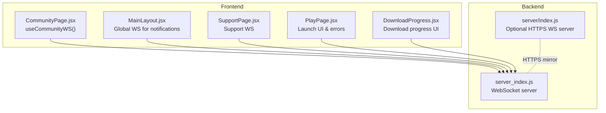
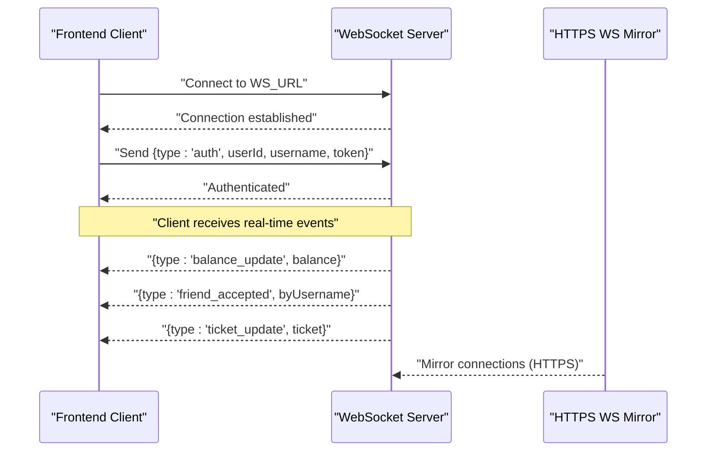
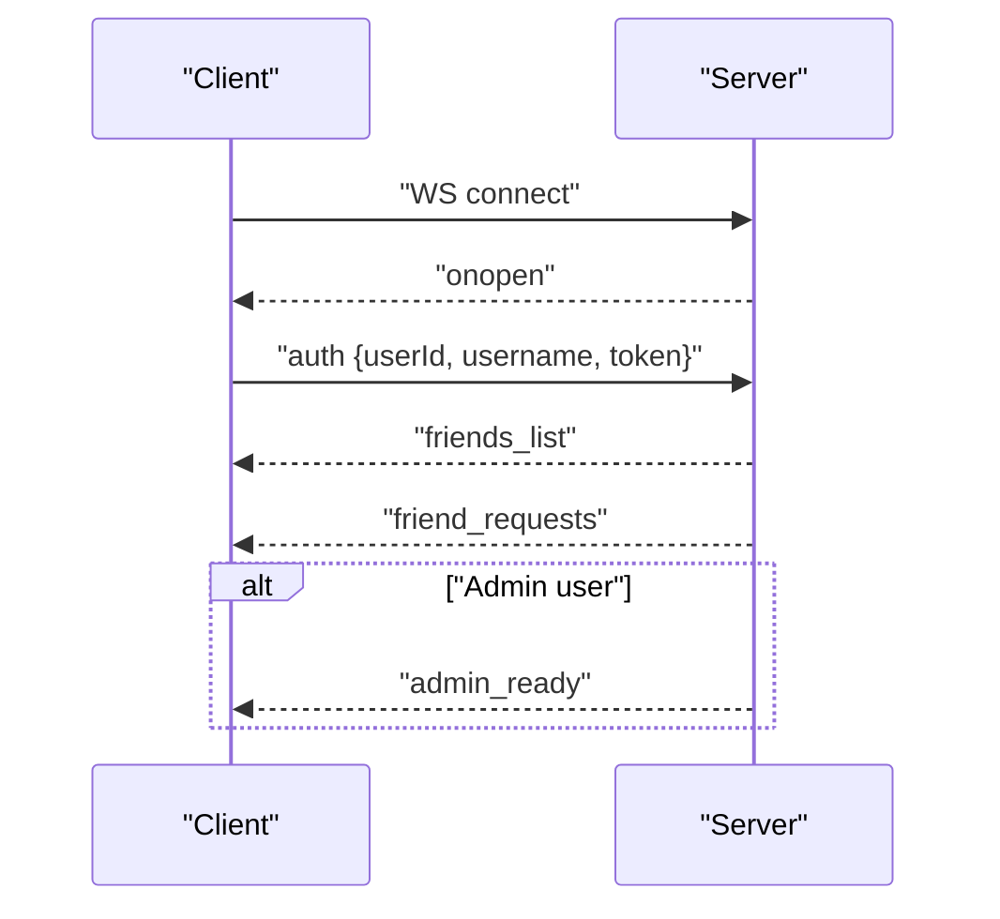
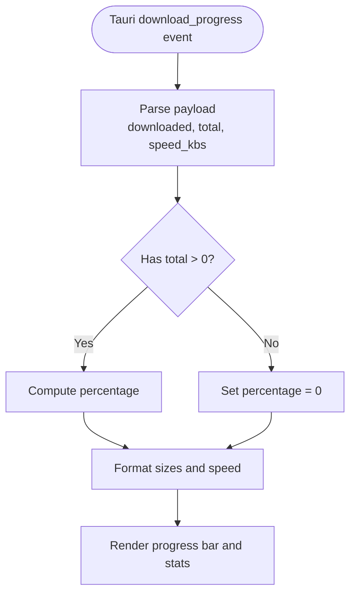
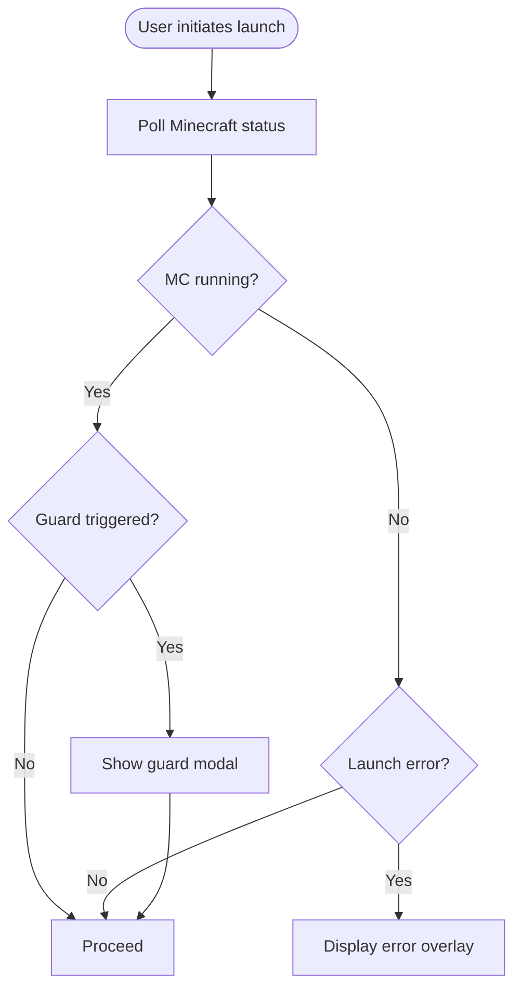
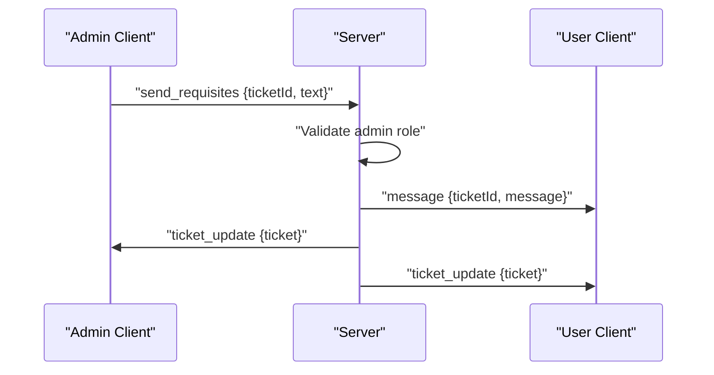
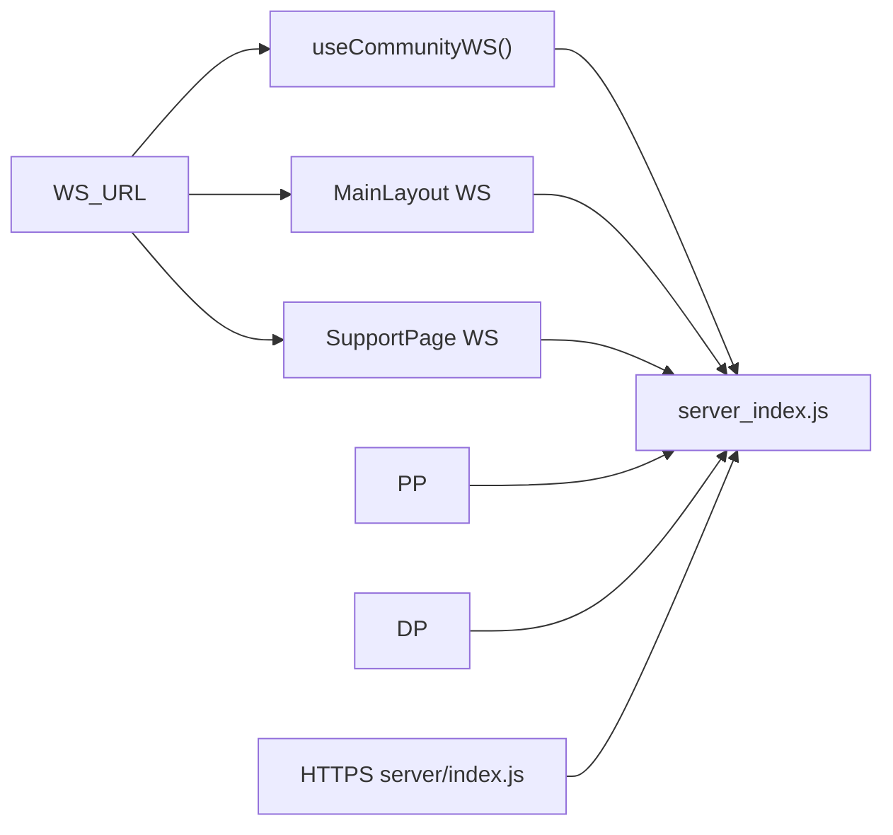
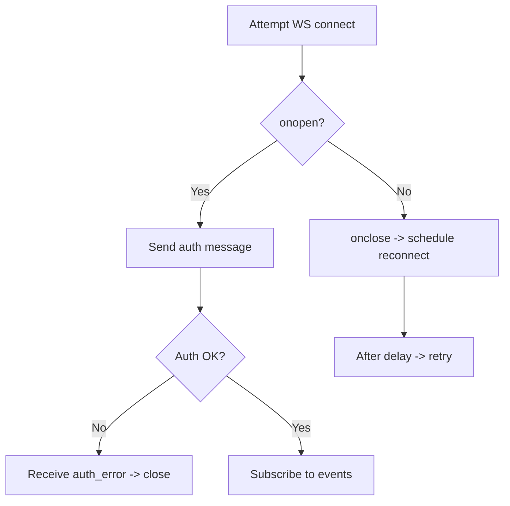

# Real-time Launch Status Updates

<cite>
**Referenced Files in This Document**
- [CommunityPage.jsx](file://src/pages/CommunityPage.jsx)
- [MainLayout.jsx](file://src/pages/MainLayout.jsx)
- [SupportPage.jsx](file://src/pages/SupportPage.jsx)
- [PlayPage.jsx](file://src/pages/PlayPage.jsx)
- [DownloadProgress.jsx](file://src/components/DownloadProgress.jsx)
- [server_index.js](file://server_index.js)
- [index.js](file://server/index.js)
</cite>

## Table of Contents
1. [Introduction](#introduction)
2. [Project Structure](#project-structure)
3. [Core Components](#core-components)
4. [Architecture Overview](#architecture-overview)
5. [Detailed Component Analysis](#detailed-component-analysis)
6. [Dependency Analysis](#dependency-analysis)
7. [Performance Considerations](#performance-considerations)
8. [Troubleshooting Guide](#troubleshooting-guide)
9. [Conclusion](#conclusion)

## Introduction
This document explains the WebSocket-based real-time status updates during game launches. It covers the WS_URL configuration, WebSocket connection establishment from the frontend, message formats and event types used for launch progress tracking, and the coordination between frontend components and WebSocket events for displaying download progress, launch status, and error conditions. It also describes reconnection logic and fallback mechanisms for offline scenarios, and outlines the integration with the backend server for real-time launch monitoring.

## Project Structure
The real-time launch status system spans frontend React components and backend WebSocket servers:
- Frontend: WebSocket connections are established in page components and shared hooks, with dedicated components for rendering download progress.
- Backend: WebSocket servers handle connections, authentication, and broadcasting of real-time events.

**Diagram sources**
- [CommunityPage.jsx:32-121](file://src/pages/CommunityPage.jsx#L32-L121)
- [MainLayout.jsx:29-124](file://src/pages/MainLayout.jsx#L29-L124)
- [SupportPage.jsx:35-74](file://src/pages/SupportPage.jsx#L35-L74)
- [PlayPage.jsx:48-462](file://src/pages/PlayPage.jsx#L48-L462)
- [DownloadProgress.jsx:1-36](file://src/components/DownloadProgress.jsx#L1-L36)
- [server_index.js:954-1153](file://server_index.js#L954-L1153)
- [index.js:1453-1476](file://server/index.js#L1453-L1476)

**Section sources**
- [CommunityPage.jsx:32-121](file://src/pages/CommunityPage.jsx#L32-L121)
- [MainLayout.jsx:29-124](file://src/pages/MainLayout.jsx#L29-L124)
- [SupportPage.jsx:35-74](file://src/pages/SupportPage.jsx#L35-L74)
- [PlayPage.jsx:48-462](file://src/pages/PlayPage.jsx#L48-L462)
- [DownloadProgress.jsx:1-36](file://src/components/DownloadProgress.jsx#L1-L36)
- [server_index.js:954-1153](file://server_index.js#L954-L1153)
- [index.js:1453-1476](file://server/index.js#L1453-L1476)

## Core Components
- WebSocket URL configuration: The frontend uses a global WS_URL constant to connect to the WebSocket server. This constant is referenced across multiple components and hooks.
- Authentication handshake: After connecting, clients send an authentication message containing user identity and token.
- Event-driven UI updates: Components subscribe to specific event types to update the UI for balances, friend notifications, support tickets, and download progress.
- Reconnection strategy: Components implement exponential or fixed-delay reconnection with cleanup to prevent leaks and race conditions.
- Offline fallback: When WebSocket is unavailable, components continue to rely on periodic polling and local state to maintain usability.

Key implementation references:
- WS_URL usage and authentication in shared hooks and page components.
- Event handling for balance updates, friend notifications, and support ticket messages.
- Download progress UI listening to Tauri events for local download metrics.

**Section sources**
- [CommunityPage.jsx:32-121](file://src/pages/CommunityPage.jsx#L32-L121)
- [MainLayout.jsx:41-99](file://src/pages/MainLayout.jsx#L41-L99)
- [SupportPage.jsx:35-74](file://src/pages/SupportPage.jsx#L35-L74)
- [PlayPage.jsx:48-462](file://src/pages/PlayPage.jsx#L48-L462)
- [DownloadProgress.jsx:1-36](file://src/components/DownloadProgress.jsx#L1-L36)

## Architecture Overview
The system integrates frontend WebSocket clients with a backend WebSocket server. Clients authenticate upon connection and receive targeted events for real-time updates. The backend supports both HTTP and HTTPS WebSocket servers, ensuring compatibility across environments.

**Diagram sources**
- [CommunityPage.jsx:50-72](file://src/pages/CommunityPage.jsx#L50-L72)
- [MainLayout.jsx:46-79](file://src/pages/MainLayout.jsx#L46-L79)
- [SupportPage.jsx:41-56](file://src/pages/SupportPage.jsx#L41-L56)
- [server_index.js:954-978](file://server_index.js#L954-L978)
- [index.js:1453-1476](file://server/index.js#L1453-L1476)

## Detailed Component Analysis

### WebSocket URL and Connection Establishment
- WS_URL is referenced when creating WebSocket instances in multiple components and hooks.
- Connections are initiated after user authentication is confirmed, preventing unnecessary connections for anonymous users.
- Authentication messages include user ID, username, and token to establish session context on the server.

Implementation highlights:
- Connection creation and delayed startup to avoid React StrictMode pitfalls.
- Cleanup on unmount to close sockets and cancel timers.

**Section sources**
- [CommunityPage.jsx:42-110](file://src/pages/CommunityPage.jsx#L42-L110)
- [MainLayout.jsx:46-99](file://src/pages/MainLayout.jsx#L46-L99)
- [SupportPage.jsx:35-67](file://src/pages/SupportPage.jsx#L35-L67)

### Authentication and Handshake
- Upon connection, clients send an authentication message with user identity and token.
- The server validates credentials and responds with user-specific data (e.g., friend lists, pending requests).
- Role-based events are sent to administrators (e.g., admin readiness and open ticket counts).

**Diagram sources**
- [CommunityPage.jsx:66-72](file://src/pages/CommunityPage.jsx#L66-L72)
- [MainLayout.jsx:53-58](file://src/pages/MainLayout.jsx#L53-L58)
- [server_index.js:954-978](file://server_index.js#L954-L978)

**Section sources**
- [CommunityPage.jsx:66-72](file://src/pages/CommunityPage.jsx#L66-L72)
- [MainLayout.jsx:53-58](file://src/pages/MainLayout.jsx#L53-L58)
- [server_index.js:954-978](file://server_index.js#L954-L978)

### Message Formats and Event Types
- Authentication: `{ type: "auth", userId, username, token }`
- Balance updates: `{ type: "balance_update", balance }`
- Friend notifications: `{ type: "friend_accepted", byUsername }`
- Support tickets: `{ type: "ticket_update", ticket }`, `{ type: "new_ticket", ticket }`, `{ type: "message", ticketId, message }`, `{ type: "ticket_messages", messages }`
- Admin readiness: `{ type: "admin_ready", openTickets }`
- Errors: `{ type: "auth_error", message }`, `{ type: "error", text }`

These event types drive UI updates across components for notifications, ticket management, and user balance changes.

**Section sources**
- [MainLayout.jsx:61-79](file://src/pages/MainLayout.jsx#L61-L79)
- [server_index.js:954-978](file://server_index.js#L954-L978)
- [server_index.js:1116-1153](file://server_index.js#L1116-L1153)

### Download Progress Tracking
- The DownloadProgress component listens for Tauri events to render download progress, speed, and totals.
- It formats bytes and kilobytes per second for display and calculates completion percentage based on downloaded and total bytes.
- This component operates independently of WebSocket events and relies on local Tauri event channels.

**Diagram sources**
- [DownloadProgress.jsx:8-36](file://src/components/DownloadProgress.jsx#L8-L36)

**Section sources**
- [DownloadProgress.jsx:1-36](file://src/components/DownloadProgress.jsx#L1-L36)

### Launch Status and Error Handling
- The PlayPage component manages the launch UI, including error display for failed launches.
- It polls the Minecraft running state to detect guard modal triggers and single-launch locks.
- Launch errors are shown in an animated overlay with a dismiss action.

**Diagram sources**
- [PlayPage.jsx:56-72](file://src/pages/PlayPage.jsx#L56-L72)
- [PlayPage.jsx:443-462](file://src/pages/PlayPage.jsx#L443-L462)

**Section sources**
- [PlayPage.jsx:56-72](file://src/pages/PlayPage.jsx#L56-L72)
- [PlayPage.jsx:443-462](file://src/pages/PlayPage.jsx#L443-L462)

### Backend Integration and Broadcasting
- The backend WebSocket server handles authentication, maintains client sessions, and broadcasts events to subscribed users.
- It mirrors connections over HTTPS for environments requiring secure WebSocket transport.
- Administrative actions (e.g., sending requisites, closing tickets) trigger targeted broadcasts to admins and affected users.

**Diagram sources**
- [server_index.js:1064-1078](file://server_index.js#L1064-L1078)
- [index.js:1453-1476](file://server/index.js#L1453-L1476)

**Section sources**
- [server_index.js:1064-1078](file://server_index.js#L1064-L1078)
- [index.js:1453-1476](file://server/index.js#L1453-L1476)

## Dependency Analysis
- Frontend components depend on WS_URL for establishing connections and on shared hooks for authentication and reconnection logic.
- The backend depends on client authentication to route events and manage subscriptions.
- HTTPS WebSocket server mirrors connections to the primary server for secure environments.

**Diagram sources**
- [CommunityPage.jsx:50-50](file://src/pages/CommunityPage.jsx#L50-L50)
- [MainLayout.jsx:48-48](file://src/pages/MainLayout.jsx#L48-L48)
- [SupportPage.jsx:41-41](file://src/pages/SupportPage.jsx#L41-L41)
- [server_index.js:954-1153](file://server_index.js#L954-L1153)
- [index.js:1453-1476](file://server/index.js#L1453-L1476)

**Section sources**
- [CommunityPage.jsx:50-50](file://src/pages/CommunityPage.jsx#L50-L50)
- [MainLayout.jsx:48-48](file://src/pages/MainLayout.jsx#L48-L48)
- [SupportPage.jsx:41-41](file://src/pages/SupportPage.jsx#L41-L41)
- [server_index.js:954-1153](file://server_index.js#L954-L1153)
- [index.js:1453-1476](file://server/index.js#L1453-L1476)

## Performance Considerations
- Reconnection delays: Components use fixed delays (e.g., 3–4 seconds) to avoid rapid reconnect loops and reduce server load.
- StrictMode safety: Connections are delayed slightly to prevent React StrictMode from closing sockets prematurely.
- Local fallbacks: Download progress UI relies on Tauri events, minimizing reliance on network latency for progress rendering.
- Minimal payload: Authentication and event payloads are kept small to reduce bandwidth usage.

[No sources needed since this section provides general guidance]

## Troubleshooting Guide
Common issues and resolutions:
- Connection drops: Components automatically schedule reconnection after close events. Ensure timers are cleared on unmount to prevent leaks.
- Authentication failures: On auth errors, clients receive explicit error messages and close the connection cleanly.
- Offline scenarios: While WebSocket is unavailable, components continue to function using local state and polling where applicable.
- HTTPS connectivity: If HTTPS is enabled, mirrored connections ensure secure transport availability.

**Diagram sources**
- [CommunityPage.jsx:81-95](file://src/pages/CommunityPage.jsx#L81-L95)
- [MainLayout.jsx:81-87](file://src/pages/MainLayout.jsx#L81-L87)
- [SupportPage.jsx:55-56](file://src/pages/SupportPage.jsx#L55-L56)
- [server_index.js:954-962](file://server_index.js#L954-L962)

**Section sources**
- [CommunityPage.jsx:81-95](file://src/pages/CommunityPage.jsx#L81-L95)
- [MainLayout.jsx:81-87](file://src/pages/MainLayout.jsx#L81-L87)
- [SupportPage.jsx:55-56](file://src/pages/SupportPage.jsx#L55-L56)
- [server_index.js:954-962](file://server_index.js#L954-L962)

## Conclusion
The WebSocket-based real-time status updates system combines robust frontend connection management with a secure backend server. WS_URL centralizes endpoint configuration, while authentication ensures secure, user-scoped event delivery. Components coordinate to present download progress, launch status, and error conditions, with resilient reconnection logic and practical offline fallbacks. The backend mirrors HTTPS connections and broadcasts targeted events to keep the UI synchronized with server-side state.