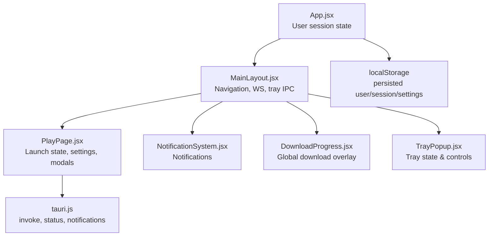
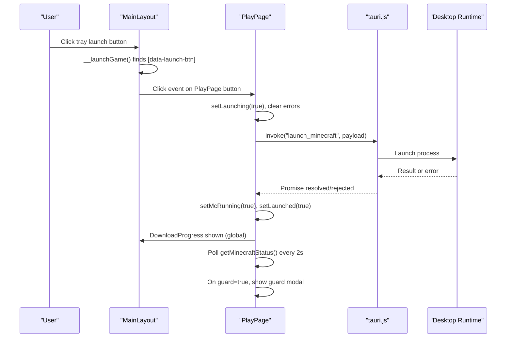
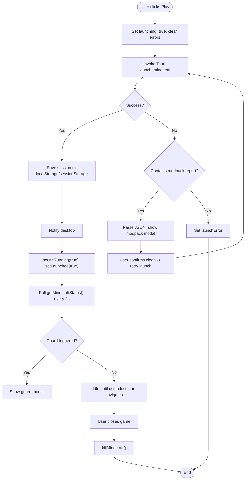
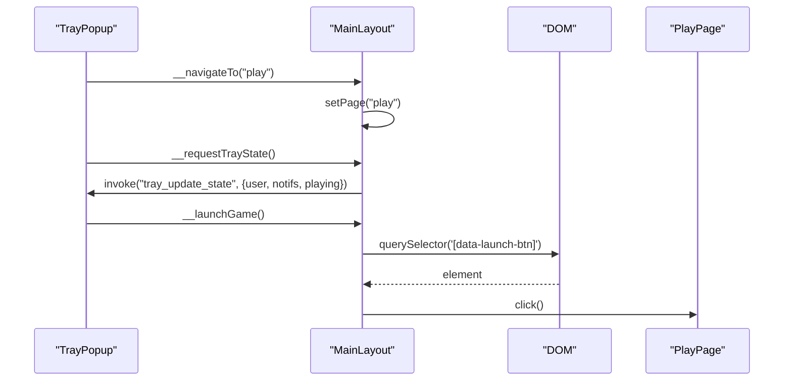
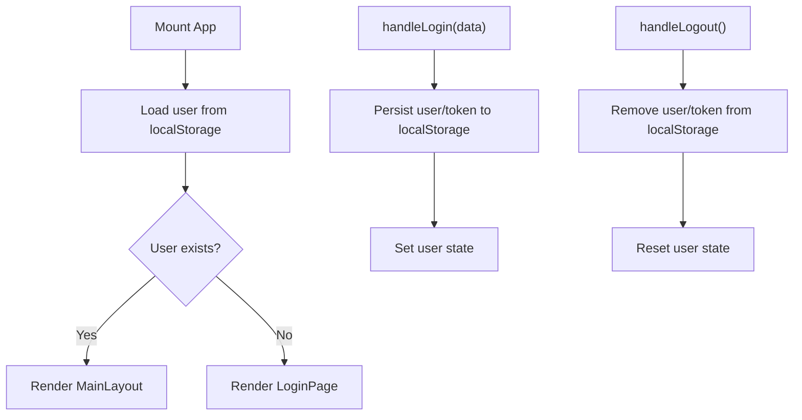
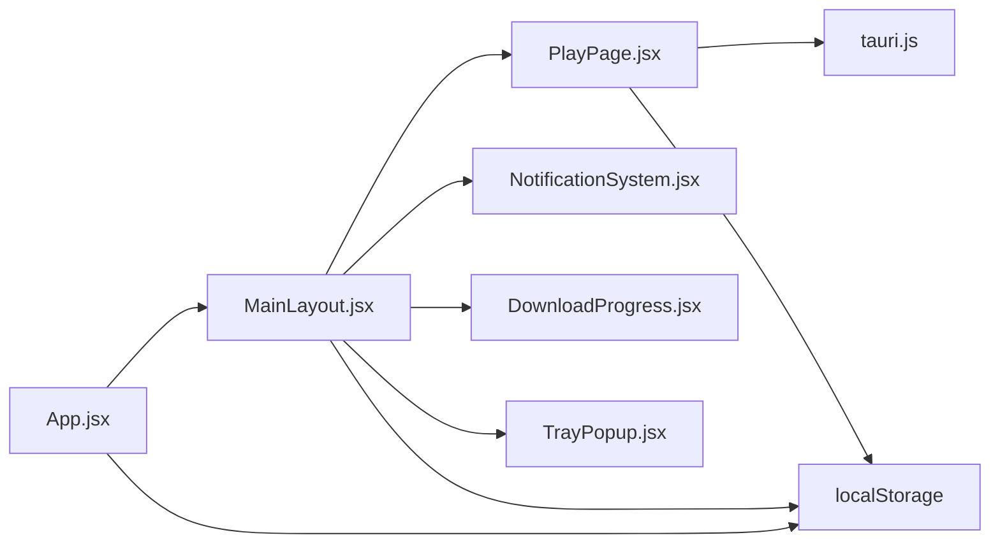

# State Management & Coordination

<cite>
**Referenced Files in This Document**
- [App.jsx](file://src/App.jsx)
- [MainLayout.jsx](file://src/pages/MainLayout.jsx)
- [PlayPage.jsx](file://src/pages/PlayPage.jsx)
- [DownloadProgress.jsx](file://src/components/DownloadProgress.jsx)
- [NotificationSystem.jsx](file://src/components/NotificationSystem.jsx)
- [tauri.js](file://src/lib/tauri.js)
- [api.js](file://src/lib/api.js)
- [TrayPopup.jsx](file://src/pages/TrayPopup.jsx)
</cite>

## Table of Contents
1. [Introduction](#introduction)
2. [Project Structure](#project-structure)
3. [Core Components](#core-components)
4. [Architecture Overview](#architecture-overview)
5. [Detailed Component Analysis](#detailed-component-analysis)
6. [Dependency Analysis](#dependency-analysis)
7. [Performance Considerations](#performance-considerations)
8. [Troubleshooting Guide](#troubleshooting-guide)
9. [Conclusion](#conclusion)

## Introduction
This document explains the state management patterns used across frontend components to coordinate game launch operations. It focuses on how launch state is maintained and shared between PlayPage, MainLayout, and supporting components, including React state patterns, local storage persistence, inter-component communication, and coordination with the desktop runtime via Tauri. It also covers concurrency handling, state consistency across navigation, and cleanup procedures.

## Project Structure
The launcher consists of:
- App: Root component managing user session state and routing between Login and MainLayout.
- MainLayout: Central layout orchestrating navigation, notifications, WebSocket updates, tray integration, and rendering the current page (including PlayPage).
- PlayPage: Dedicated launch workflow component maintaining launch state, settings, and modpack/security prompts.
- Supporting components: NotificationSystem, DownloadProgress, and TrayPopup integrate with the launch workflow.

**Diagram sources**
- [App.jsx:1-41](file://src/App.jsx#L1-L41)
- [MainLayout.jsx:1-354](file://src/pages/MainLayout.jsx#L1-L354)
- [PlayPage.jsx:1-746](file://src/pages/PlayPage.jsx#L1-L746)
- [DownloadProgress.jsx](file://src/components/DownloadProgress.jsx)
- [NotificationSystem.jsx](file://src/components/NotificationSystem.jsx)
- [TrayPopup.jsx](file://src/pages/TrayPopup.jsx)
- [tauri.js](file://src/lib/tauri.js)
- [api.js](file://src/lib/api.js)

**Section sources**
- [App.jsx:1-41](file://src/App.jsx#L1-L41)
- [MainLayout.jsx:1-354](file://src/pages/MainLayout.jsx#L1-L354)
- [PlayPage.jsx:1-746](file://src/pages/PlayPage.jsx#L1-L746)

## Core Components
- App manages user login/logout and persists credentials to localStorage. It conditionally renders either LoginPage or MainLayout.
- MainLayout centralizes navigation, WebSocket-based real-time updates, tray IPC hooks, and page composition. It passes user props to child pages and coordinates global UI overlays.
- PlayPage encapsulates the launch workflow: selection state, launch flags, error reporting, modpack security prompts, and Minecraft process monitoring.

Key state patterns:
- React local state for UI and workflow state (selected server, launching flags, settings).
- localStorage for persisted preferences and session history.
- sessionStorage for ephemeral session timing.
- Window event dispatch for cross-component signaling.
- Tauri IPC for process control and status polling.

**Section sources**
- [App.jsx:8-26](file://src/App.jsx#L8-L26)
- [MainLayout.jsx:72-214](file://src/pages/MainLayout.jsx#L72-L214)
- [PlayPage.jsx:19-88](file://src/pages/PlayPage.jsx#L19-L88)

## Architecture Overview
The launch workflow spans PlayPage, MainLayout, and the desktop runtime. MainLayout exposes tray IPC handlers and routes to PlayPage. PlayPage triggers Tauri launch, polls process status, and surfaces modpack/security warnings. Notifications and download progress are coordinated globally.

**Diagram sources**
- [MainLayout.jsx:169-196](file://src/pages/MainLayout.jsx#L169-L196)
- [PlayPage.jsx:109-149](file://src/pages/PlayPage.jsx#L109-L149)
- [PlayPage.jsx:50-72](file://src/pages/PlayPage.jsx#L50-L72)
- [tauri.js](file://src/lib/tauri.js)

## Detailed Component Analysis

### PlayPage: Launch State and Security Workflows
Responsibilities:
- Maintains selection, launch flags, and error state.
- Persists launch settings to localStorage and session info to sessionStorage.
- Polls Minecraft status via Tauri and updates running state.
- Handles modpack security reports and anti-cheat guard modal.
- Integrates with Discord presence and desktop notifications.

State management highlights:
- Selection and launch flags: selected, launching, launched, mcRunning.
- Settings persistence: ramGb, javaPath, showSettings, showModpackModal, guardModal.
- Security modals: modpackReport with rejected/removed/missing lists.
- Session tracking: sbgames_sessions, sbg_last_session.

Concurrency and cleanup:
- Status polling interval created and cleared in a single effect.
- Window events dispatched on selection change and unmount.
- Cleanup removes last session and kills process on close.

**Diagram sources**
- [PlayPage.jsx:109-149](file://src/pages/PlayPage.jsx#L109-L149)
- [PlayPage.jsx:166-192](file://src/pages/PlayPage.jsx#L166-L192)
- [PlayPage.jsx:50-88](file://src/pages/PlayPage.jsx#L50-L88)
- [tauri.js](file://src/lib/tauri.js)

**Section sources**
- [PlayPage.jsx:19-46](file://src/pages/PlayPage.jsx#L19-L46)
- [PlayPage.jsx:50-88](file://src/pages/PlayPage.jsx#L50-L88)
- [PlayPage.jsx:109-149](file://src/pages/PlayPage.jsx#L109-L149)
- [PlayPage.jsx:166-201](file://src/pages/PlayPage.jsx#L166-L201)

### MainLayout: Navigation, Tray IPC, and Global State
Responsibilities:
- Manages current page state and renders only the active page with animations.
- Establishes WebSocket connection for real-time notifications and balance updates.
- Exposes tray IPC handlers (__navigateTo, __requestTrayState, __launchGame, __logout).
- Provides global notification bell and download progress overlay.
- Passes user and callback props to PlayPage.

State and effects:
- Page state: page, showCommunity, viewUserId, friendBadge, balance.
- WebSocket lifecycle: connect/disconnect with reconnect logic.
- Tray integration: pushes state to tray and triggers launch via DOM query.
- Notification sync: invokes tray update on inbox changes.

**Diagram sources**
- [MainLayout.jsx:169-196](file://src/pages/MainLayout.jsx#L169-L196)
- [MainLayout.jsx:198-202](file://src/pages/MainLayout.jsx#L198-L202)
- [PlayPage.jsx:398-400](file://src/pages/PlayPage.jsx#L398-L400)

**Section sources**
- [MainLayout.jsx:72-214](file://src/pages/MainLayout.jsx#L72-L214)
- [MainLayout.jsx:169-202](file://src/pages/MainLayout.jsx#L169-L202)

### App: User Session and Routing
Responsibilities:
- Loads user from localStorage on mount.
- Provides login handler that persists user/token and sets state.
- Provides logout handler that clears persisted data.
- Renders LoginPage when no user, otherwise MainLayout.

**Diagram sources**
- [App.jsx:8-26](file://src/App.jsx#L8-L26)

**Section sources**
- [App.jsx:8-26](file://src/App.jsx#L8-L26)

### Supporting Components and Utilities
- DownloadProgress: Global overlay synchronized by MainLayout’s page visibility and PlayPage’s launch actions.
- NotificationSystem: Provides notification bell and inbox; MainLayout invokes tray update on inbox changes.
- tauri.js: Exposes invoke, getMinecraftStatus, killMinecraft, notifyDesktop, setDiscordPresence, clearDiscordPresence.
- api.js: Provides WS_URL and getToken for WebSocket authentication.

**Section sources**
- [MainLayout.jsx:15-18](file://src/pages/MainLayout.jsx#L15-L18)
- [tauri.js](file://src/lib/tauri.js)
- [api.js](file://src/lib/api.js)

## Dependency Analysis
- App depends on localStorage for user persistence and controls routing.
- MainLayout depends on App’s user state, NotificationSystem, DownloadProgress, and TrayPopup.
- PlayPage depends on MainLayout for user prop and on tauri.js for process control/status.
- TrayPopup integrates with MainLayout via IPC handlers exposed by MainLayout.

**Diagram sources**
- [App.jsx:1-41](file://src/App.jsx#L1-L41)
- [MainLayout.jsx:1-354](file://src/pages/MainLayout.jsx#L1-L354)
- [PlayPage.jsx:1-746](file://src/pages/PlayPage.jsx#L1-L746)
- [tauri.js](file://src/lib/tauri.js)

**Section sources**
- [App.jsx:1-41](file://src/App.jsx#L1-L41)
- [MainLayout.jsx:1-354](file://src/pages/MainLayout.jsx#L1-L354)
- [PlayPage.jsx:1-746](file://src/pages/PlayPage.jsx#L1-L746)

## Performance Considerations
- Status polling: PlayPage polls every 2 seconds; keep interval reasonable to avoid overhead.
- WebSocket: Reconnect with exponential backoff-like delay; ensure cleanup on unmount.
- Local storage writes: Debounce frequent writes (already handled for settings).
- Rendering: MainLayout animates page transitions; avoid heavy computations in render functions.
- IPC calls: Batch tray updates and minimize repeated invocations.

## Troubleshooting Guide
Common issues and resolutions:
- Launch stuck on "launching": Verify Tauri invoke succeeded; check error propagation and modpack report handling.
- Modpack security modal not appearing: Ensure error message contains the special marker and JSON parsing succeeds.
- Guard modal appears unexpectedly: Confirm getMinecraftStatus guard flag and modal persistence logic.
- Tray launch does nothing: Verify __launchGame handler and presence of [data-launch-btn].
- Session not recorded: Confirm localStorage write and sessionStorage removal after activity push.
- WebSocket disconnects frequently: Check reconnect timer and strict mode double-invocation timing.

Cleanup procedures:
- Clear intervals and timers in effects.
- Remove window event listeners and IPC hooks on unmount.
- Reset Discord presence and clear local state on logout.

**Section sources**
- [PlayPage.jsx:109-149](file://src/pages/PlayPage.jsx#L109-L149)
- [PlayPage.jsx:166-192](file://src/pages/PlayPage.jsx#L166-L192)
- [PlayPage.jsx:50-88](file://src/pages/PlayPage.jsx#L50-L88)
- [MainLayout.jsx:169-196](file://src/pages/MainLayout.jsx#L169-L196)
- [App.jsx:22-26](file://src/App.jsx#L22-L26)

## Conclusion
The launcher employs a layered state management approach:
- App maintains user session state and routing.
- MainLayout coordinates navigation, real-time updates, tray IPC, and global UI overlays.
- PlayPage encapsulates the launch workflow with robust error handling, security modals, and process monitoring.
- localStorage and sessionStorage persist user preferences, session history, and transient UI state.
- IPC and WebSocket bridges enable seamless desktop integration and real-time updates.

This design ensures consistent state across navigation, handles concurrent operations safely, and provides clear pathways for diagnostics and cleanup.