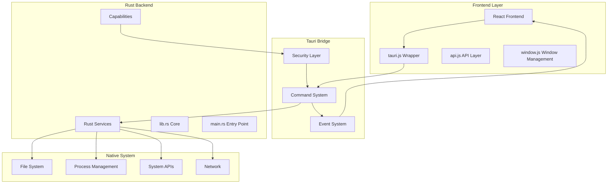
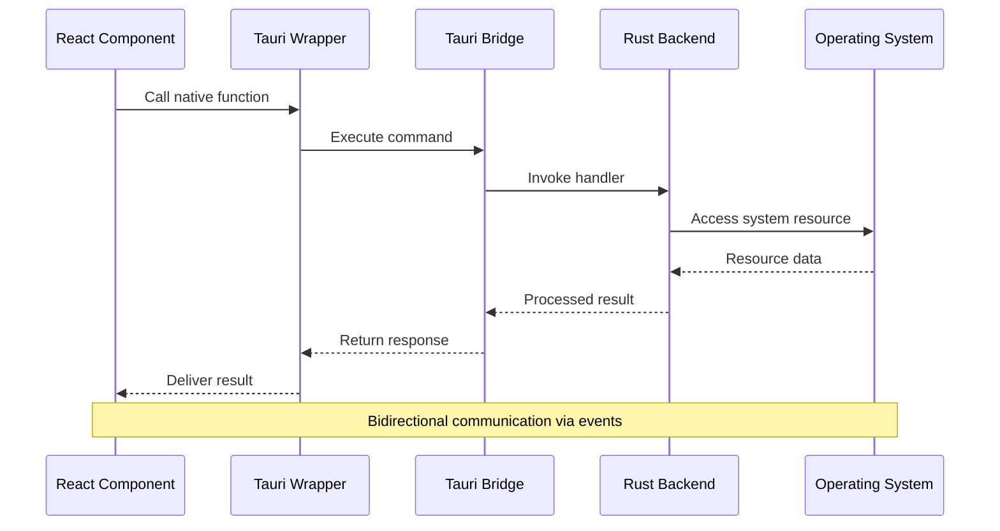
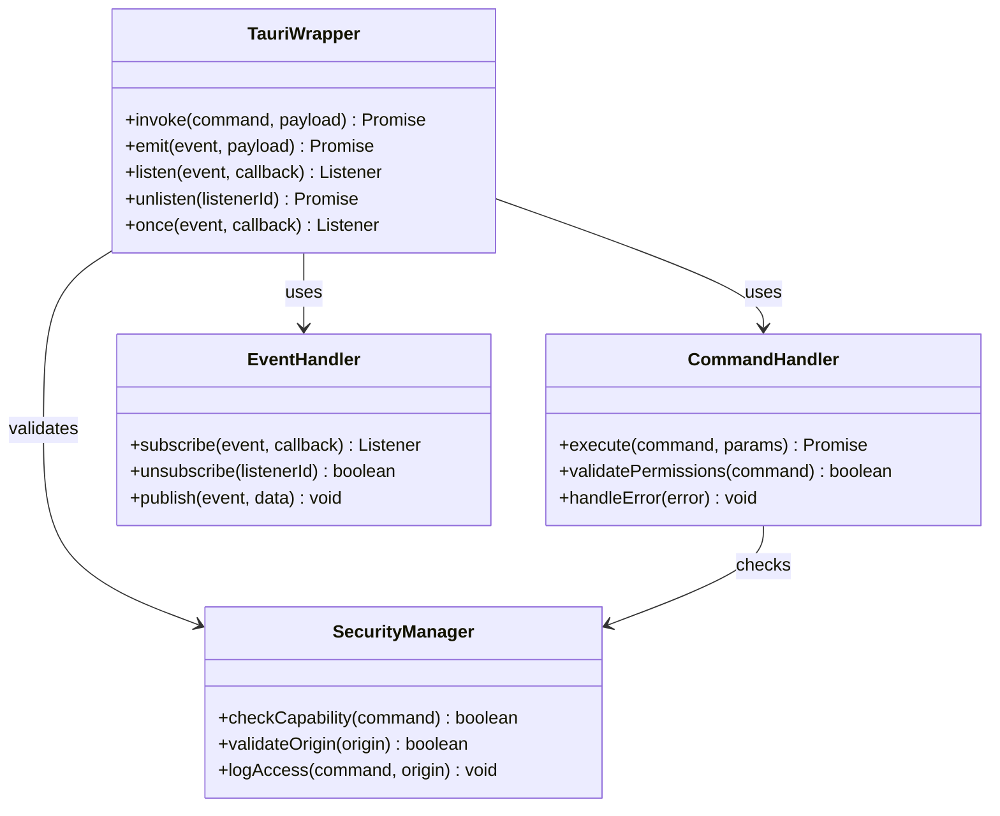
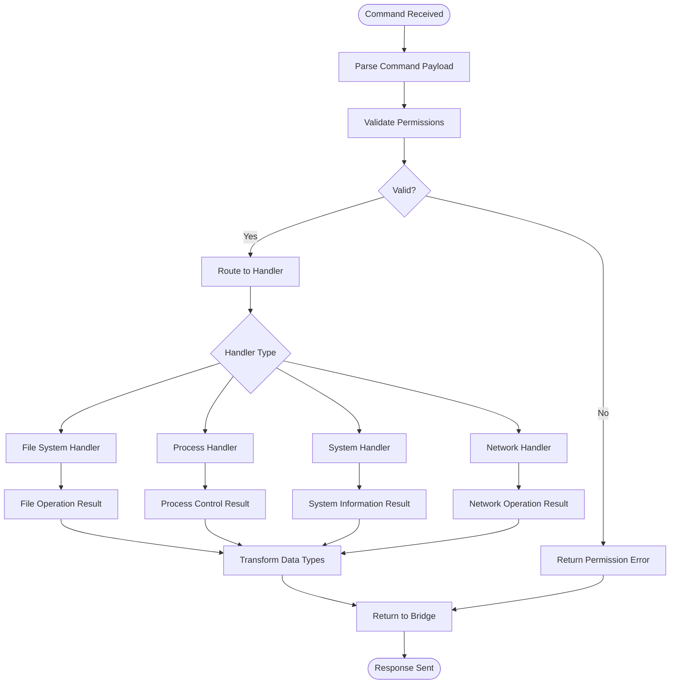
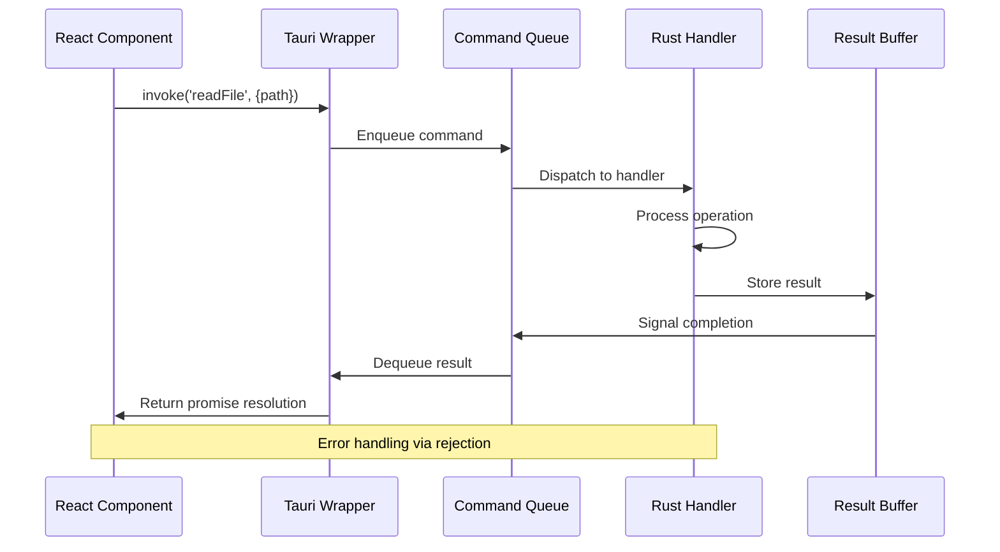
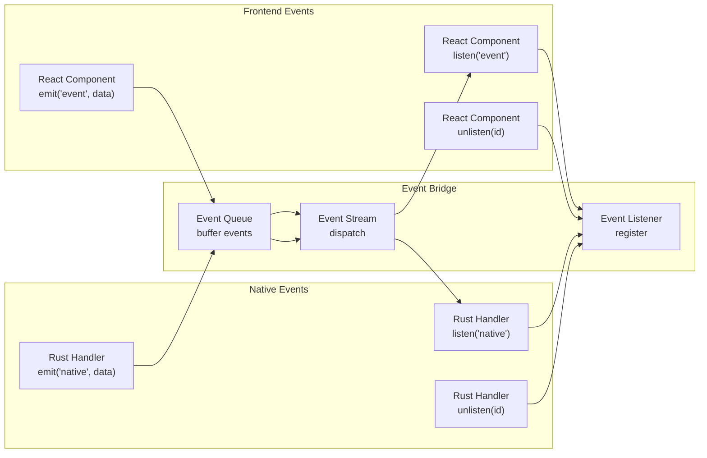
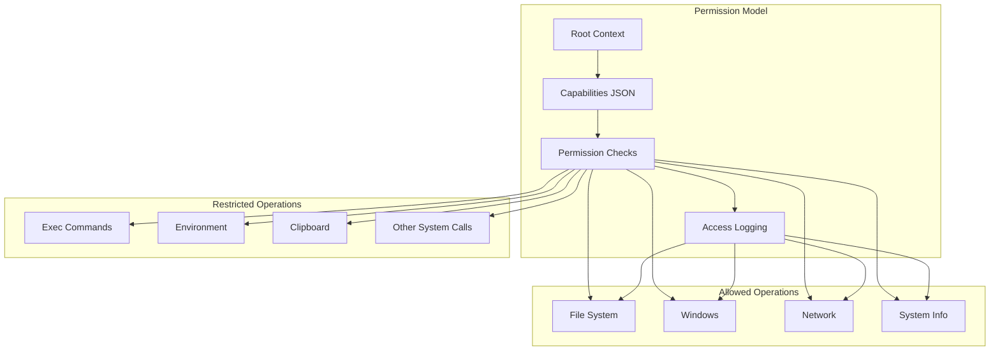
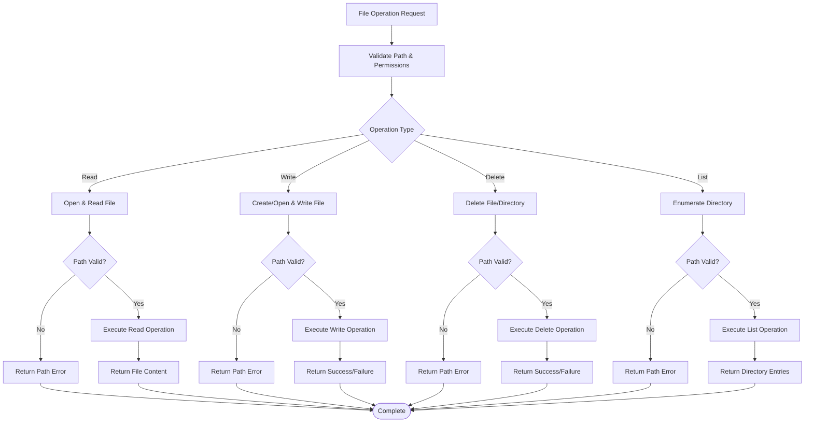
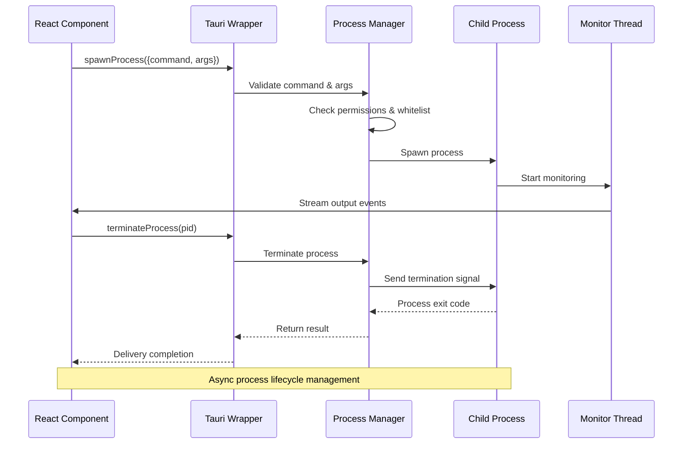
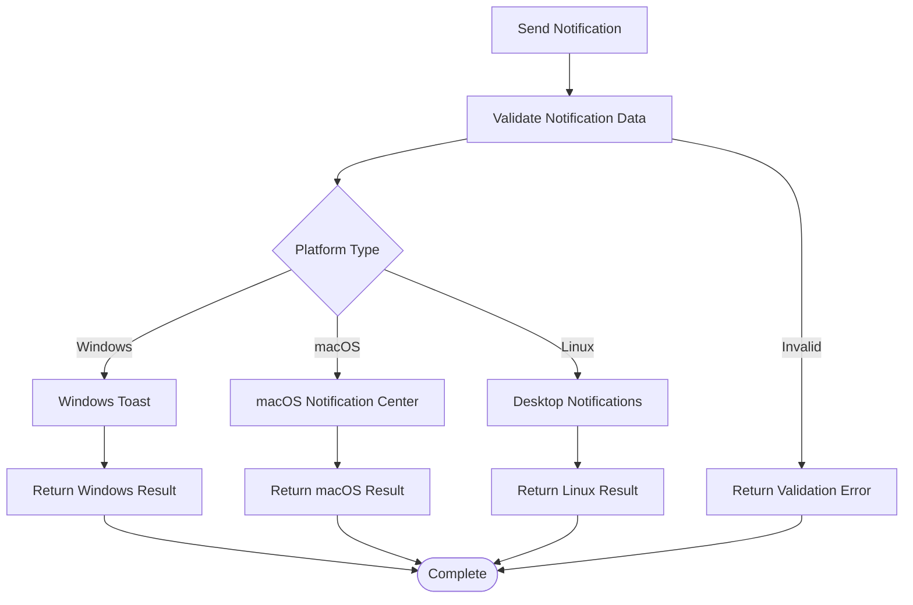

# Tauri Native Integration

<cite>
**Referenced Files in This Document**
- [tauri.js](file://src/lib/tauri.js)
- [api.js](file://src/lib/api.js)
- [window.js](file://src/lib/window.js)
- [lib.rs](file://src-tauri/src/lib.rs)
- [main.rs](file://src-tauri/src/main.rs)
- [Cargo.toml](file://src-tauri/Cargo.toml)
- [tauri.conf.json](file://src-tauri/tauri.conf.json)
- [main.json](file://src-tauri/capabilities/main.json)
- [notification.html](file://public/notification.html)
- [tray.html](file://dist-tray/tray.html)
</cite>

## Table of Contents
1. [Introduction](#introduction)
2. [Project Structure](#project-structure)
3. [Core Components](#core-components)
4. [Architecture Overview](#architecture-overview)
5. [Detailed Component Analysis](#detailed-component-analysis)
6. [Command System](#command-system)
7. [Event System](#event-system)
8. [Security Model](#security-model)
9. [Native Operations](#native-operations)
10. [Performance Considerations](#performance-considerations)
11. [Troubleshooting Guide](#troubleshooting-guide)
12. [Conclusion](#conclusion)

## Introduction

This document provides comprehensive documentation for the Tauri bridge that enables native system access from the React frontend in the SBGames application. The Tauri framework serves as a cross-platform runtime that allows web technologies (React/JavaScript) to communicate with native system capabilities through a secure bridge architecture.

The bridge consists of three primary layers: the JavaScript frontend wrapper functions, the Tauri command system, and the Rust backend services. This architecture enables controlled access to native system resources while maintaining security boundaries between the web application and the operating system.

## Project Structure

The Tauri integration is organized across multiple directories and files that work together to provide seamless native system access:

**Diagram sources**
- [tauri.js](file://src/lib/tauri.js)
- [api.js](file://src/lib/api.js)
- [lib.rs](file://src-tauri/src/lib.rs)
- [main.rs](file://src-tauri/src/main.rs)

**Section sources**
- [tauri.js](file://src/lib/tauri.js)
- [api.js](file://src/lib/api.js)
- [window.js](file://src/lib/window.js)

## Core Components

### Tauri JavaScript Wrapper

The `tauri.js` file serves as the primary interface between the React frontend and the Tauri backend. It provides a clean abstraction layer that handles command execution, event management, and type safety for native operations.

Key responsibilities include:
- Command invocation with proper error handling
- Event subscription and unsubscription
- Type conversion between JavaScript and Rust types
- Promise-based asynchronous operation support

### API Layer

The `api.js` file extends the Tauri wrapper with application-specific functionality. It provides higher-level abstractions for common operations like file management, system notifications, and resource access.

### Window Management

The `window.js` file handles window lifecycle events, focus management, and inter-window communication. It bridges React components with native window system capabilities.

**Section sources**
- [tauri.js](file://src/lib/tauri.js)
- [api.js](file://src/lib/api.js)
- [window.js](file://src/lib/window.js)

## Architecture Overview

The Tauri bridge follows a layered architecture pattern that ensures separation of concerns and maintainable code organization:

**Diagram sources**
- [tauri.js](file://src/lib/tauri.js)
- [lib.rs](file://src-tauri/src/lib.rs)

The architecture enforces strict boundaries between the frontend JavaScript layer and the native Rust backend, ensuring security and stability.

## Detailed Component Analysis

### Tauri Wrapper Implementation

The Tauri wrapper provides essential functions for native system access:

**Diagram sources**
- [tauri.js](file://src/lib/tauri.js)
- [lib.rs](file://src-tauri/src/lib.rs)

### Rust Backend Services

The Rust backend implements the core native functionality:

**Diagram sources**
- [lib.rs](file://src-tauri/src/lib.rs)
- [main.rs](file://src-tauri/src/main.rs)

**Section sources**
- [lib.rs](file://src-tauri/src/lib.rs)
- [main.rs](file://src-tauri/src/main.rs)

## Command System

The command system enables synchronous and asynchronous communication between the React frontend and Rust backend. Commands are defined in the Rust backend and invoked from JavaScript using the Tauri wrapper.

### Command Execution Flow

**Diagram sources**
- [tauri.js](file://src/lib/tauri.js)
- [lib.rs](file://src-tauri/src/lib.rs)

### Supported Command Categories

The command system supports several categories of native operations:

1. **File System Operations**: Read, write, delete, and manage files and directories
2. **Process Management**: Launch, monitor, and control external processes
3. **System Information**: Retrieve hardware, network, and system metrics
4. **Window Management**: Control application windows and UI elements
5. **Notification System**: Send system notifications and alerts

**Section sources**
- [tauri.js](file://src/lib/tauri.js)
- [lib.rs](file://src-tauri/src/lib.rs)

## Event System

The event system provides bidirectional communication between the frontend and native layers, enabling real-time updates and reactive programming patterns.

### Event Flow Architecture

**Diagram sources**
- [tauri.js](file://src/lib/tauri.js)
- [lib.rs](file://src-tauri/src/lib.rs)

### Event Types and Handlers

Common event categories include:
- **System Events**: Application lifecycle, window focus, system shutdown
- **File Events**: File system changes, watch notifications
- **Process Events**: Process start/stop, output streams
- **Custom Events**: Application-specific notifications

**Section sources**
- [tauri.js](file://src/lib/tauri.js)
- [lib.rs](file://src-tauri/src/lib.rs)

## Security Model

Tauri implements a comprehensive security model that protects users from malicious code while enabling legitimate native functionality.

### Capability-Based Permissions

**Diagram sources**
- [main.json](file://src-tauri/capabilities/main.json)
- [tauri.conf.json](file://src-tauri/tauri.conf.json)

### Security Features

1. **Origin Validation**: Ensures commands originate from trusted sources
2. **Permission Boundaries**: Restricts access to explicitly declared capabilities
3. **Type Safety**: Validates data types between JavaScript and Rust
4. **Memory Protection**: Prevents buffer overflows and memory corruption
5. **Audit Logging**: Tracks all native operations for security monitoring

**Section sources**
- [main.json](file://src-tauri/capabilities/main.json)
- [tauri.conf.json](file://src-tauri/tauri.conf.json)

## Native Operations

### File System Access

The file system operations provide controlled access to the local file system with appropriate permission checking:

**Diagram sources**
- [lib.rs](file://src-tauri/src/lib.rs)
- [tauri.js](file://src/lib/tauri.js)

### Process Management

External process execution is handled securely with proper isolation and resource management:

**Diagram sources**
- [lib.rs](file://src-tauri/src/lib.rs)
- [tauri.js](file://src/lib/tauri.js)

### System Notifications

The notification system provides cross-platform alert capabilities:

**Diagram sources**
- [lib.rs](file://src-tauri/src/lib.rs)
- [notification.html](file://public/notification.html)

**Section sources**
- [lib.rs](file://src-tauri/src/lib.rs)
- [tauri.js](file://src/lib/tauri.js)

## Performance Considerations

### Memory Management

The Tauri bridge implements efficient memory management strategies:

1. **Zero-Cost Abstractions**: Rust's compile-time optimizations eliminate runtime overhead
2. **Borrowing & Lifetimes**: Prevent memory leaks through Rust's ownership system
3. **Buffer Reuse**: Minimize allocations through careful buffer management
4. **Async Operations**: Non-blocking I/O prevents UI thread blocking

### Command Optimization

1. **Batch Operations**: Group related commands to reduce IPC overhead
2. **Caching Strategies**: Cache frequently accessed data to reduce system calls
3. **Lazy Loading**: Load native functionality only when needed
4. **Connection Pooling**: Reuse connections for repeated operations

### Event System Efficiency

1. **Event Coalescing**: Combine rapid successive events to reduce processing load
2. **Selective Listening**: Allow components to listen only to relevant events
3. **Debouncing**: Prevent excessive event firing for rapidly changing data
4. **Memory Cleanup**: Automatic cleanup of unused event listeners

## Troubleshooting Guide

### Common Issues and Solutions

#### Command Execution Failures

**Symptoms**: Commands return errors or timeouts
**Causes**: 
- Insufficient permissions
- Invalid command parameters
- Native handler crashes
- Memory allocation failures

**Solutions**:
1. Verify capability declarations in configuration
2. Check command parameter validation
3. Review Rust handler error handling
4. Monitor memory usage patterns

#### Event Communication Problems

**Symptoms**: Events not received or duplicated
**Causes**:
- Listener registration issues
- Event queue overflow
- Serialization problems
- Threading conflicts

**Solutions**:
1. Ensure proper listener cleanup
2. Implement event buffering strategies
3. Validate data serialization
4. Check thread safety of event handlers

#### Performance Degradation

**Symptoms**: Slow response times or memory leaks
**Causes**:
- Excessive native calls
- Poor event handling
- Memory leaks in handlers
- Blocking operations on main thread

**Solutions**:
1. Optimize command batching
2. Implement async event processing
3. Add memory leak detection
4. Move heavy operations to worker threads

**Section sources**
- [lib.rs](file://src-tauri/src/lib.rs)
- [tauri.js](file://src/lib/tauri.js)

## Conclusion

The Tauri bridge in SBGames provides a robust, secure, and efficient pathway for React applications to access native system capabilities. Through careful architecture design, comprehensive security measures, and optimized performance characteristics, it enables developers to leverage system resources while maintaining user safety and application stability.

The layered approach ensures maintainability and extensibility, while the capability-based permission system provides granular control over native access. The event-driven communication model enables responsive user interfaces, and the comprehensive error handling ensures reliable operation across different platforms and scenarios.

Future enhancements could include expanded capability declarations, additional platform-specific features, and advanced monitoring and analytics capabilities to further improve the developer and user experience.