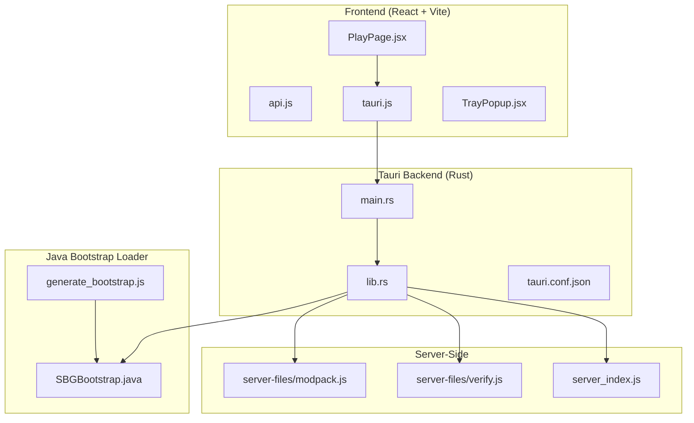
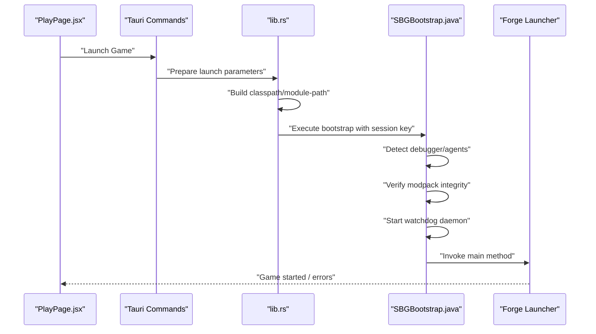
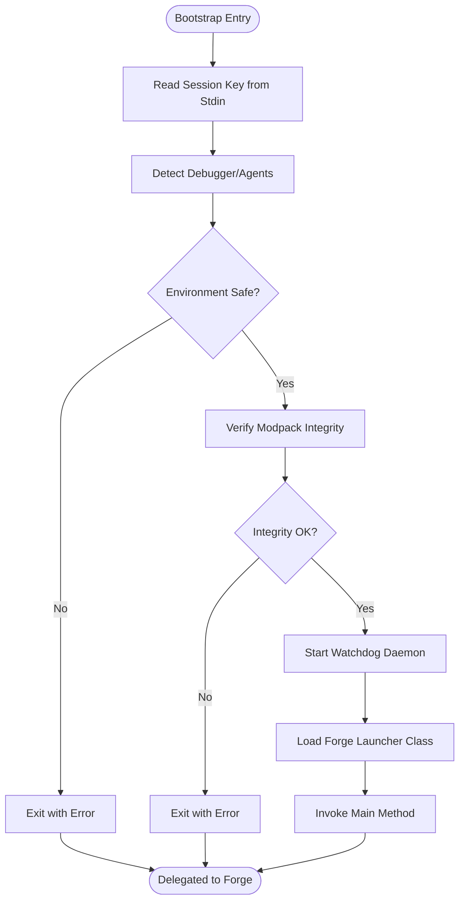
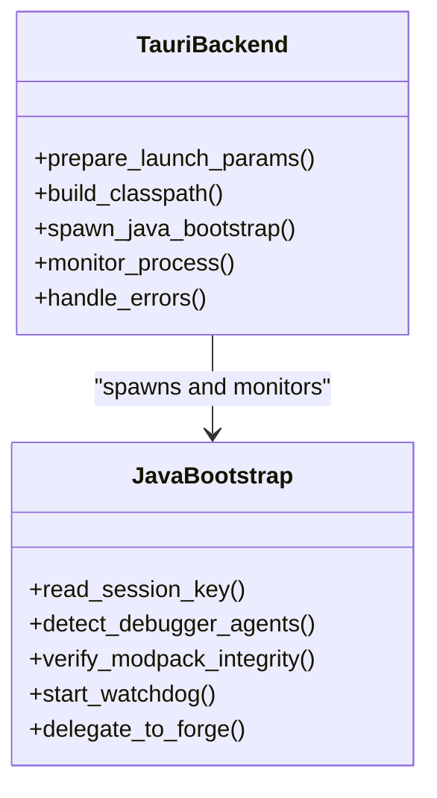
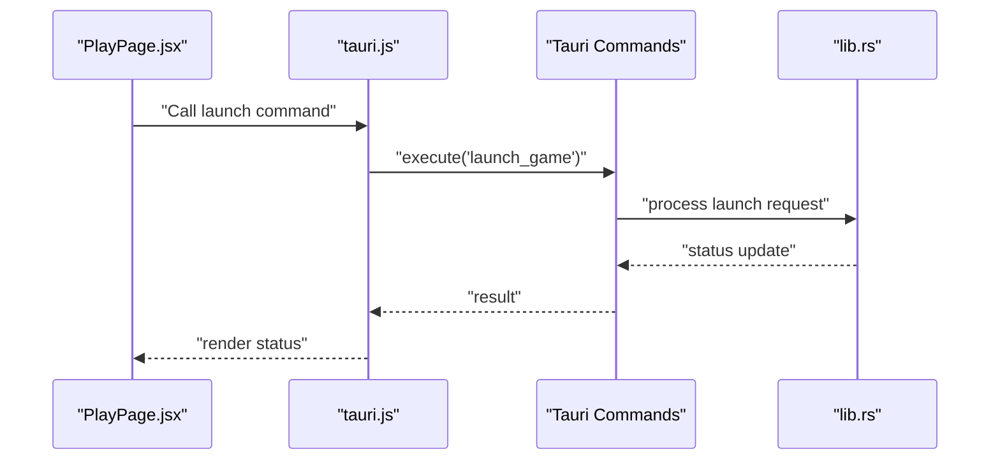
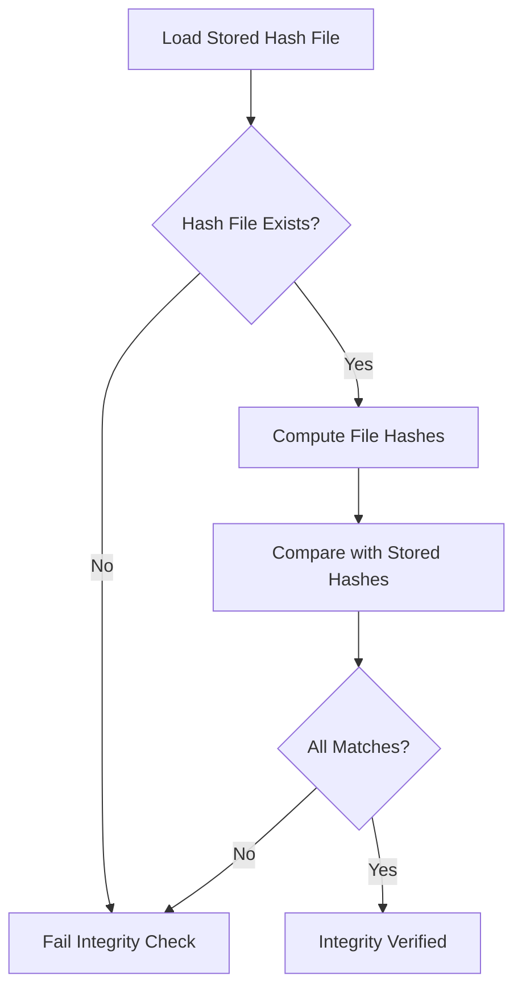
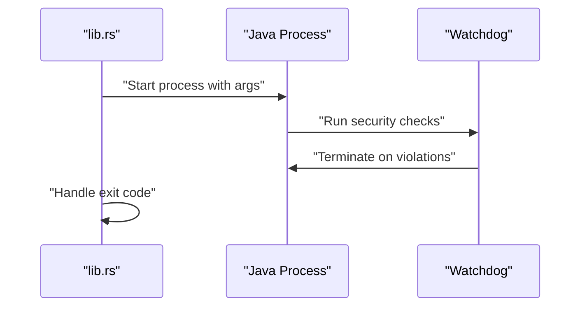
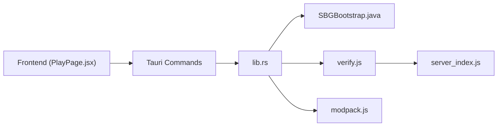

# Game Launching & Management

<cite>
**Referenced Files in This Document**
- [SBGBootstrap.java](file://src-java/com/sbgames/bootstrap/SBGBootstrap.java)
- [generate_bootstrap.js](file://scratch/generate_bootstrap.js)
- [lib.rs](file://src-tauri/src/lib.rs)
- [main.rs](file://src-tauri/src/main.rs)
- [tauri.conf.json](file://src-tauri/tauri.conf.json)
- [api.js](file://src/lib/api.js)
- [tauri.js](file://src/lib/tauri.js)
- [PlayPage.jsx](file://src/pages/PlayPage.jsx)
- [TrayPopup.jsx](file://src/pages/TrayPopup.jsx)
- [modpack.js](file://server-files/modpack.js)
- [verify.js](file://server-files/verify.js)
- [server_index.js](file://server_index.js)
</cite>

## Table of Contents
1. [Introduction](#introduction)
2. [Project Structure](#project-structure)
3. [Core Components](#core-components)
4. [Architecture Overview](#architecture-overview)
5. [Detailed Component Analysis](#detailed-component-analysis)
6. [Dependency Analysis](#dependency-analysis)
7. [Performance Considerations](#performance-considerations)
8. [Troubleshooting Guide](#troubleshooting-guide)
9. [Conclusion](#conclusion)

## Introduction
This document describes the Minecraft game launching and management system implemented in the repository. It focuses on the Java bootstrap loader architecture, including XOR encoding, integrity verification, and security validation processes. It also explains the multi-layered security approach combining Java verification with Tauri native integration, game process management, launch parameters, real-time monitoring, and the verification system ensuring game file integrity. The document outlines the relationship between frontend React components, Tauri backend services, and Java bootstrap verification, and provides guidance on error handling, recovery mechanisms, performance considerations, and integration with external tools.

## Project Structure
The project combines:
- A React-based frontend (Vite) with Tauri integration for native capabilities
- A Rust-based Tauri backend orchestrating game launches and process management
- A Java bootstrap loader responsible for pre-launch security checks and delegation
- Server-side verification and modpack management utilities

**Diagram sources**
- [PlayPage.jsx](file://src/pages/PlayPage.jsx)
- [tauri.js](file://src/lib/tauri.js)
- [main.rs](file://src-tauri/src/main.rs)
- [lib.rs](file://src-tauri/src/lib.rs)
- [tauri.conf.json](file://src-tauri/tauri.conf.json)
- [SBGBootstrap.java](file://src-java/com/sbgames/bootstrap/SBGBootstrap.java)
- [generate_bootstrap.js](file://scratch/generate_bootstrap.js)
- [modpack.js](file://server-files/modpack.js)
- [verify.js](file://server-files/verify.js)
- [server_index.js](file://server_index.js)

**Section sources**
- [PlayPage.jsx](file://src/pages/PlayPage.jsx)
- [tauri.js](file://src/lib/tauri.js)
- [main.rs](file://src-tauri/src/main.rs)
- [lib.rs](file://src-tauri/src/lib.rs)
- [tauri.conf.json](file://src-tauri/tauri.conf.json)
- [SBGBootstrap.java](file://src-java/com/sbgames/bootstrap/SBGBootstrap.java)
- [generate_bootstrap.js](file://scratch/generate_bootstrap.js)
- [modpack.js](file://server-files/modpack.js)
- [verify.js](file://server-files/verify.js)
- [server_index.js](file://server_index.js)

## Core Components
- Java Bootstrap Loader: Performs environment checks, integrity verification, watchdog monitoring, and delegates to the Forge launcher. It uses encoded method/class names and constants to avoid static analysis and includes XOR-like decoding helpers.
- Tauri Backend: Manages game process lifecycle, constructs JVM/classpath/module-path arguments, handles native permissions, and integrates with the frontend via Tauri commands.
- Frontend React Components: Provide user controls for launching games, tray interactions, and notifications. They communicate with Tauri to trigger launch actions and receive status updates.
- Server-Side Verification: Validates modpack integrity and manages distribution metadata to prevent tampering.

**Section sources**
- [SBGBootstrap.java](file://src-java/com/sbgames/bootstrap/SBGBootstrap.java)
- [lib.rs](file://src-tauri/src/lib.rs)
- [PlayPage.jsx](file://src/pages/PlayPage.jsx)
- [TrayPopup.jsx](file://src/pages/TrayPopup.jsx)
- [verify.js](file://server-files/verify.js)

## Architecture Overview
The system follows a layered architecture:
- Frontend triggers a launch action via Tauri commands.
- Tauri backend validates configuration, prepares JVM/classpath/module-path arguments, and spawns the Java bootstrap loader.
- The Java bootstrap loader performs security checks, verifies modpack integrity, starts a watchdog, and delegates to the Forge launcher.
- Real-time monitoring tracks the game process and reports outcomes to the frontend.

**Diagram sources**
- [PlayPage.jsx](file://src/pages/PlayPage.jsx)
- [lib.rs](file://src-tauri/src/lib.rs)
- [SBGBootstrap.java](file://src-java/com/sbgames/bootstrap/SBGBootstrap.java)

## Detailed Component Analysis

### Java Bootstrap Loader
The Java bootstrap loader enforces multi-layered security and integrity checks before delegating to the Forge launcher. It:
- Reads an ephemeral session key from stdin to initialize runtime state.
- Detects debugger or agent presence by scanning JVM input arguments and environment variables.
- Verifies modpack integrity against a stored checksum file.
- Starts a watchdog thread that continuously monitors for suspicious activity.
- Delegates to the Forge BootstrapLauncher using dynamically resolved class/method names.

**Diagram sources**
- [SBGBootstrap.java](file://src-java/com/sbgames/bootstrap/SBGBootstrap.java)
- [generate_bootstrap.js](file://scratch/generate_bootstrap.js)

**Section sources**
- [SBGBootstrap.java](file://src-java/com/sbgames/bootstrap/SBGBootstrap.java)
- [generate_bootstrap.js](file://scratch/generate_bootstrap.js)

### Tauri Backend Services
The Tauri backend:
- Constructs JVM arguments, separating Forge boot modules (for module-path) from regular libraries (for classpath).
- Integrates with Tauri configuration to enable necessary capabilities and permissions.
- Spawns the Java bootstrap loader with a secure session key and captures process output for monitoring.

**Diagram sources**
- [lib.rs](file://src-tauri/src/lib.rs)
- [tauri.conf.json](file://src-tauri/tauri.conf.json)
- [SBGBootstrap.java](file://src-java/com/sbgames/bootstrap/SBGBootstrap.java)

**Section sources**
- [lib.rs](file://src-tauri/src/lib.rs)
- [tauri.conf.json](file://src-tauri/tauri.conf.json)

### Frontend React Components and Tauri Integration
Frontend components:
- PlayPage.jsx provides the primary launch interface and interacts with Tauri commands to initiate game launches.
- TrayPopup.jsx handles tray-related interactions and notifications.
- tauri.js exposes Tauri command wrappers for the frontend.
- api.js encapsulates API communication with the server for modpack and verification data.

**Diagram sources**
- [PlayPage.jsx](file://src/pages/PlayPage.jsx)
- [tauri.js](file://src/lib/tauri.js)
- [lib.rs](file://src-tauri/src/lib.rs)

**Section sources**
- [PlayPage.jsx](file://src/pages/PlayPage.jsx)
- [TrayPopup.jsx](file://src/pages/TrayPopup.jsx)
- [tauri.js](file://src/lib/tauri.js)
- [api.js](file://src/lib/api.js)

### Verification System and Integrity Checks
The verification system ensures game file integrity and prevents cheating by:
- Maintaining a checksum file for the modpack.
- Comparing computed hashes against stored values during bootstrap.
- Rejecting launch attempts if integrity checks fail.

**Diagram sources**
- [SBGBootstrap.java](file://src-java/com/sbgames/bootstrap/SBGBootstrap.java)
- [verify.js](file://server-files/verify.js)

**Section sources**
- [SBGBootstrap.java](file://src-java/com/sbgames/bootstrap/SBGBootstrap.java)
- [verify.js](file://server-files/verify.js)

### Game Process Management and Monitoring
The backend manages the game process lifecycle:
- Builds appropriate JVM arguments (module-path for boot modules, classpath for others).
- Spawns the Java bootstrap loader and streams/processes output for real-time monitoring.
- Handles process termination, exit codes, and recovery mechanisms.

**Diagram sources**
- [lib.rs](file://src-tauri/src/lib.rs)
- [SBGBootstrap.java](file://src-java/com/sbgames/bootstrap/SBGBootstrap.java)

**Section sources**
- [lib.rs](file://src-tauri/src/lib.rs)
- [SBGBootstrap.java](file://src-java/com/sbgames/bootstrap/SBGBootstrap.java)

## Dependency Analysis
The system exhibits clear separation of concerns:
- Frontend depends on Tauri command wrappers and API modules.
- Tauri backend depends on the Java bootstrap loader and server-side verification utilities.
- Java bootstrap loader depends on integrity verification and watchdog logic.
- Server-side utilities depend on modpack metadata and verification routines.

**Diagram sources**
- [PlayPage.jsx](file://src/pages/PlayPage.jsx)
- [lib.rs](file://src-tauri/src/lib.rs)
- [SBGBootstrap.java](file://src-java/com/sbgames/bootstrap/SBGBootstrap.java)
- [verify.js](file://server-files/verify.js)
- [modpack.js](file://server-files/modpack.js)
- [server_index.js](file://server_index.js)

**Section sources**
- [PlayPage.jsx](file://src/pages/PlayPage.jsx)
- [lib.rs](file://src-tauri/src/lib.rs)
- [SBGBootstrap.java](file://src-java/com/sbgames/bootstrap/SBGBootstrap.java)
- [verify.js](file://server-files/verify.js)
- [modpack.js](file://server-files/modpack.js)
- [server_index.js](file://server_index.js)

## Performance Considerations
- Minimize classpath overhead by isolating Forge boot modules into module-path and keeping the rest in classpath to avoid reflection penalties.
- Use daemon threads for watchdogs to reduce resource footprint.
- Stream process output to avoid memory accumulation during long sessions.
- Cache computed hashes and modpack metadata to reduce repeated I/O.
- Limit the frequency of integrity checks to balance security and startup latency.

## Troubleshooting Guide
Common issues and remedies:
- Launch fails immediately after bootstrap: Indicates environment checks detected debugger/agent or integrity verification failed. Review JVM arguments and environment variables, and confirm modpack integrity.
- Process terminates unexpectedly: Watchdog likely detected suspicious activity. Inspect logs and disable conflicting tools or agents.
- Incorrect classpath/module-path: Ensure boot modules are placed in module-path and vanilla/client JARs in classpath.
- Permission denied errors: Verify Tauri capabilities and entitlements in configuration.
- Recovery mechanisms: On failure, the system exits with error codes; the frontend should display actionable messages and offer retry or diagnostic options.

**Section sources**
- [SBGBootstrap.java](file://src-java/com/sbgames/bootstrap/SBGBootstrap.java)
- [lib.rs](file://src-tauri/src/lib.rs)
- [tauri.conf.json](file://src-tauri/tauri.conf.json)

## Conclusion
The system employs a robust, multi-layered approach to secure Minecraft launching. The Java bootstrap loader enforces environment safety and integrity checks, while the Tauri backend orchestrates process management and native integration. The frontend provides intuitive controls and real-time feedback. Together, these components deliver a secure, reliable, and maintainable game launching pipeline suitable for production environments.