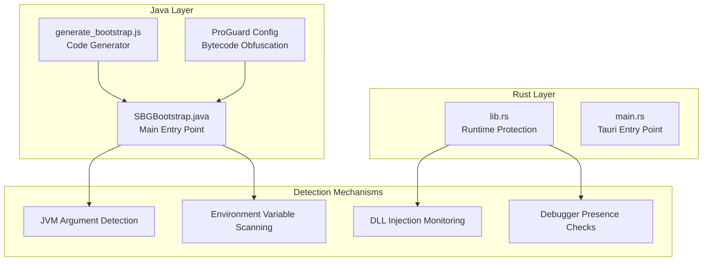
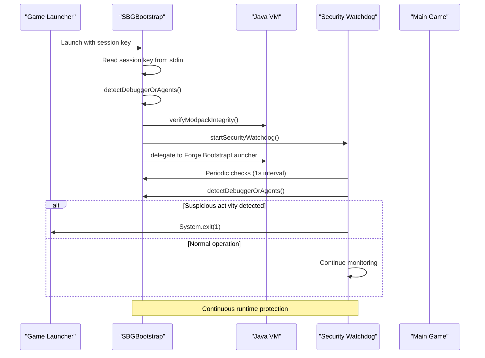
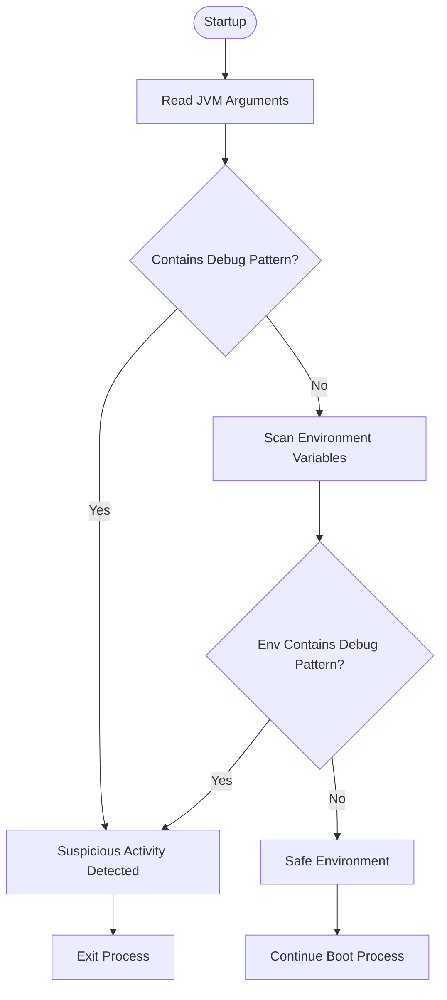
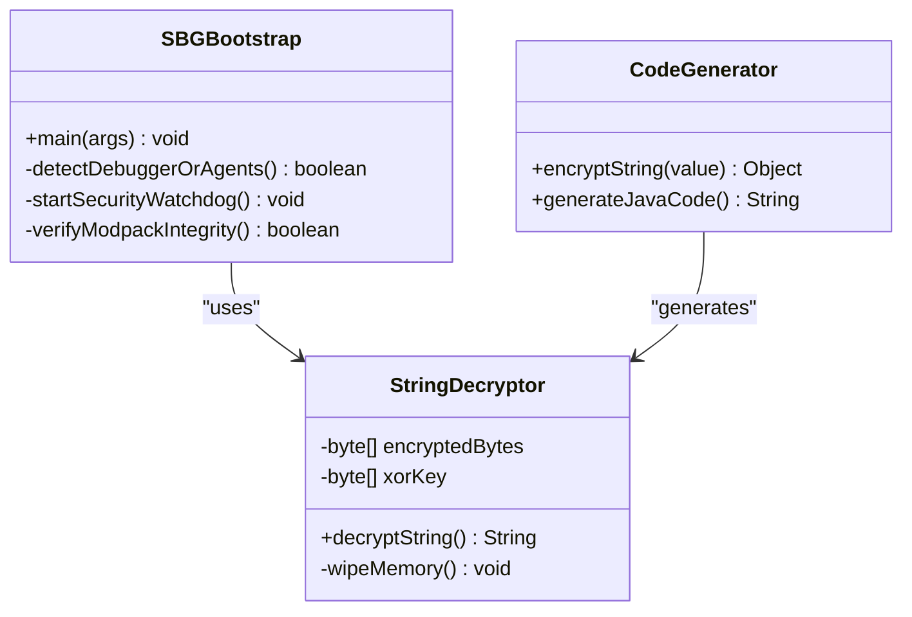
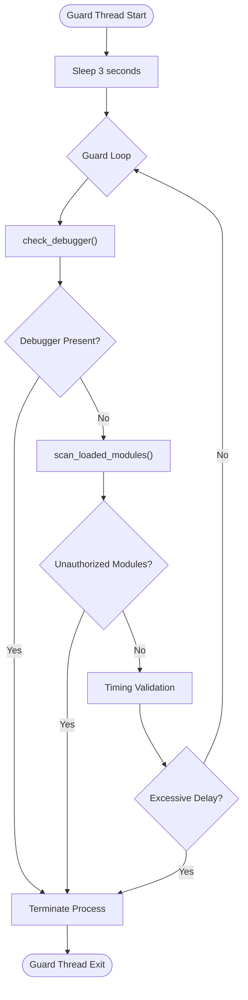
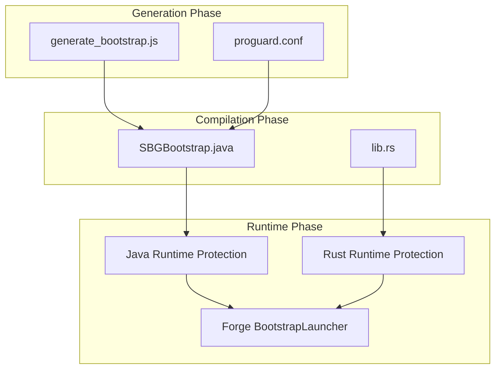

# Anti-Debug & Environment Protection

<cite>
**Referenced Files in This Document**
- [SBGBootstrap.java](file://src-java/com/sbgames/bootstrap/SBGBootstrap.java)
- [generate_bootstrap.js](file://scratch/generate_bootstrap.js)
- [proguard.conf](file://scratch/proguard.conf)
- [lib.rs](file://src-tauri/src/lib.rs)
- [main.rs](file://src-tauri/src/main.rs)
</cite>

## Table of Contents
1. [Introduction](#introduction)
2. [Project Structure](#project-structure)
3. [Core Components](#core-components)
4. [Architecture Overview](#architecture-overview)
5. [Detailed Component Analysis](#detailed-component-analysis)
6. [Dependency Analysis](#dependency-analysis)
7. [Performance Considerations](#performance-considerations)
8. [Troubleshooting Guide](#troubleshooting-guide)
9. [Conclusion](#conclusion)

## Introduction
This document provides comprehensive analysis of the anti-debug and environment protection mechanisms implemented in the SBGames project. The protection system consists of two primary layers: a Java-based bootstrap component that detects debugging agents and suspicious JVM configurations, and a Rust-based Tauri launcher that provides runtime monitoring and DLL injection detection. The system employs sophisticated obfuscation techniques to protect sensitive detection logic and implements multiple detection vectors to prevent tampering and unauthorized analysis.

## Project Structure
The anti-debug protection spans multiple components across different technologies:

**Diagram sources**
- [SBGBootstrap.java:207-237](file://src-java/com/sbgames/bootstrap/SBGBootstrap.java#L207-L237)
- [lib.rs:17-133](file://src-tauri/src/lib.rs#L17-L133)

**Section sources**
- [SBGBootstrap.java:1-372](file://src-java/com/sbgames/bootstrap/SBGBootstrap.java#L1-L372)
- [lib.rs:1-200](file://src-tauri/src/lib.rs#L1-L200)

## Core Components
The anti-debug system comprises several interconnected components that work together to provide comprehensive protection:

### Java Bootstrap Protection
The primary Java component serves as the initial security gate, performing environment checks before delegating to the main application logic. It implements sophisticated string obfuscation and runtime detection mechanisms.

### Rust Runtime Protection
The Tauri-based protection layer provides continuous monitoring of the running process, detecting debugger presence and unauthorized DLL injections during gameplay.

### Code Generation and Obfuscation
A specialized code generator creates the obfuscated Java code with randomized method names and XOR-encoded strings, making static analysis significantly more difficult.

**Section sources**
- [generate_bootstrap.js:71-80](file://scratch/generate_bootstrap.js#L71-L80)
- [SBGBootstrap.java:12-24](file://src-java/com/sbgames/bootstrap/SBGBootstrap.java#L12-L24)

## Architecture Overview
The anti-debug architecture implements a multi-layered defense strategy:

**Diagram sources**
- [SBGBootstrap.java:207-237](file://src-java/com/sbgames/bootstrap/SBGBootstrap.java#L207-L237)
- [SBGBootstrap.java:275-291](file://src-java/com/sbgames/bootstrap/SBGBootstrap.java#L275-L291)

The architecture implements several key security principles:
- **Early Detection**: Anti-debug checks occur before main game logic initialization
- **Continuous Monitoring**: A dedicated watchdog thread performs periodic checks
- **Multi-vector Detection**: Multiple detection mechanisms reduce evasion effectiveness
- **Process Isolation**: Separate protection layers for different attack vectors

## Detailed Component Analysis

### JVM Argument Detection Engine
The core detection mechanism focuses on identifying suspicious JVM arguments and environment configurations that indicate debugging or profiling activities.

#### Detection Patterns
The system monitors for specific JVM agent patterns:
- **Java Agent Detection**: `-javaagent` arguments for instrumentation
- **Agent Library Detection**: `-agentlib` for native agent loading
- **Agent Path Detection**: `-agentpath` for custom agent paths
- **XDebug Detection**: XDebug protocol indicators
- **JDWP Detection**: Java Debug Wire Protocol markers

#### Environment Variable Scanning
Beyond JVM arguments, the system scans critical environment variables:
- `JAVA_TOOL_OPTIONS`: Global JVM options
- `_JAVA_OPTIONS`: Standard Java options
- `JDK_JAVA_OPTIONS`: JDK-specific options

**Diagram sources**
- [SBGBootstrap.java:239-273](file://src-java/com/sbgames/bootstrap/SBGBootstrap.java#L239-L273)

**Section sources**
- [SBGBootstrap.java:239-273](file://src-java/com/sbgames/bootstrap/SBGBootstrap.java#L239-L273)
- [generate_bootstrap.js:18-32](file://scratch/generate_bootstrap.js#L18-L32)

### Encoded String Constants and XOR Decryption
The system employs sophisticated obfuscation to protect detection logic from static analysis.

#### XOR-Based String Encoding
Each target string is encoded using a random XOR key:
- **Random Key Generation**: Multi-byte keys generated per string
- **Byte Array Storage**: Encrypted bytes stored as compile-time constants
- **Runtime Decryption**: XOR decryption performed at runtime
- **Memory Wiping**: Automatic cleanup of sensitive data

#### Decryption Process
The decryption mechanism follows a consistent pattern:
1. Load encrypted byte array
2. Generate or load corresponding XOR key
3. Apply XOR operation to each byte
4. Convert to UTF-8 string
5. Clear sensitive memory arrays

**Diagram sources**
- [SBGBootstrap.java:12-24](file://src-java/com/sbgames/bootstrap/SBGBootstrap.java#L12-L24)
- [generate_bootstrap.js:35-69](file://scratch/generate_bootstrap.js#L35-L69)

**Section sources**
- [SBGBootstrap.java:12-204](file://src-java/com/sbgames/bootstrap/SBGBootstrap.java#L12-L204)
- [generate_bootstrap.js:35-69](file://scratch/generate_bootstrap.js#L35-L69)

### Runtime Security Watchdog
A dedicated monitoring thread continuously validates the runtime environment:

#### Watchdog Implementation
- **Daemon Thread**: Non-blocking monitoring that doesn't prevent shutdown
- **Periodic Checks**: 1-second intervals for efficient resource usage
- **Graceful Degradation**: Continues monitoring even if individual checks fail
- **Process Termination**: Immediate exit on detection of suspicious activity

#### Watchdog Activation
The watchdog starts after successful environment verification and continues throughout the application lifecycle.

**Section sources**
- [SBGBootstrap.java:275-291](file://src-java/com/sbgames/bootstrap/SBGBootstrap.java#L275-L291)

### Rust-Based Runtime Protection
The Tauri layer provides additional protection vectors:

#### Windows-Specific Protections
- **DLL Directory Restriction**: Limits DLL search paths to trusted locations
- **Process Mitigation Policies**: Enables various Windows security mitigations
- **Loaded Module Enumeration**: Monitors for unauthorized DLL injections
- **Debugger Detection**: Uses Windows API functions for presence checks

#### Cross-Platform Detection
- **Linux Tracer Detection**: Reads `/proc/self/status` for tracer process detection
- **LD_PRELOAD Monitoring**: Detects library preloading attacks
- **Memory Mapping Analysis**: Scans `/proc/self/maps` for suspicious entries

**Diagram sources**
- [lib.rs:123-133](file://src-tauri/src/lib.rs#L123-L133)

**Section sources**
- [lib.rs:17-133](file://src-tauri/src/lib.rs#L17-L133)

## Dependency Analysis
The anti-debug system exhibits layered dependencies that enhance overall security effectiveness:

**Diagram sources**
- [generate_bootstrap.js:71-80](file://scratch/generate_bootstrap.js#L71-L80)
- [proguard.conf:16-18](file://scratch/proguard.conf#L16-L18)

### Code Generation Dependencies
The code generation process creates dependencies between:
- **Target Strings**: Hardcoded detection patterns
- **Obfuscation Functions**: Randomized method names
- **Replacement Mapping**: Dynamic string resolution

### Runtime Dependencies
The runtime protection depends on:
- **Java Management API**: For JVM argument and environment inspection
- **Windows APIs**: For advanced debugger and DLL detection
- **File System Access**: For modpack integrity verification

**Section sources**
- [generate_bootstrap.js:71-80](file://scratch/generate_bootstrap.js#L71-L80)
- [proguard.conf:1-20](file://scratch/proguard.conf#L1-L20)

## Performance Considerations
The anti-debug system is designed with performance optimization in mind:

### Memory Management
- **Automatic Cleanup**: Sensitive data arrays are cleared immediately after use
- **Efficient String Handling**: Minimal string allocations during runtime
- **Garbage Collection Friendly**: No persistent references to decrypted strings

### CPU Usage Optimization
- **Minimal Overhead**: Single daemon thread with 1-second intervals
- **Lazy Evaluation**: String decryption occurs only when needed
- **Efficient Pattern Matching**: Early termination on first match

### Resource Utilization
- **Low Memory Footprint**: Each decryption routine uses minimal heap space
- **Thread Safety**: Watchdog thread operates independently without shared state
- **Graceful Degradation**: System continues functioning even if monitoring fails

## Troubleshooting Guide

### Common Detection Scenarios
Several legitimate configurations may trigger false positives:

#### Legitimate Debugging Environments
- **Development Tools**: IDE debuggers and development frameworks
- **Profiling Tools**: Performance analysis and monitoring tools
- **Development Libraries**: Testing frameworks and development utilities

#### Environment Configuration Issues
- **Global JVM Options**: System-wide Java configuration
- **IDE Integration**: Integrated development environment settings
- **Build Systems**: Automated build and deployment tools

### Bypass Attempts and Countermeasures
The system implements several countermeasures against common evasion techniques:

#### Obfuscation Resistance
- **Randomized Method Names**: Generated with mixed character sets
- **Unicode Obfuscation**: Invisible characters in class names
- **Dictionary-Based Obfuscation**: Large dictionaries for name generation

#### Detection Evasion Prevention
- **Multiple Detection Vectors**: JVM arguments AND environment variables
- **Runtime Decryption**: Strings only revealed during execution
- **Memory Wiping**: Sensitive data automatically cleared

### Security Implications
The anti-debug protections provide significant security benefits:
- **Tamper Detection**: Unauthorized modifications to game files
- **Execution Integrity**: Prevention of injected malicious code
- **Development Tool Blocking**: Protection against reverse engineering
- **Runtime Attack Prevention**: Detection of active exploitation attempts

**Section sources**
- [SBGBootstrap.java:217-225](file://src-java/com/sbgames/bootstrap/SBGBootstrap.java#L217-L225)
- [lib.rs:1007-1181](file://src-tauri/src/lib.rs#L1007-L1181)

## Conclusion
The SBGames anti-debug protection system implements a comprehensive, multi-layered defense strategy that effectively protects against various forms of tampering and reverse engineering. The combination of Java-based JVM argument detection, Rust-based runtime monitoring, and sophisticated obfuscation techniques creates a robust security framework that is difficult to bypass while maintaining acceptable performance characteristics.

The system's strength lies in its layered approach, where multiple detection vectors work together to minimize the possibility of successful evasion. The use of dynamic string decryption and randomized method names makes static analysis extremely challenging, while the continuous monitoring ensures that any attempt to circumvent the protection is detected promptly.

For developers implementing similar systems, the SBGames approach demonstrates effective balance between security effectiveness and performance impact, providing a solid foundation for protecting commercial game applications from unauthorized analysis and modification.