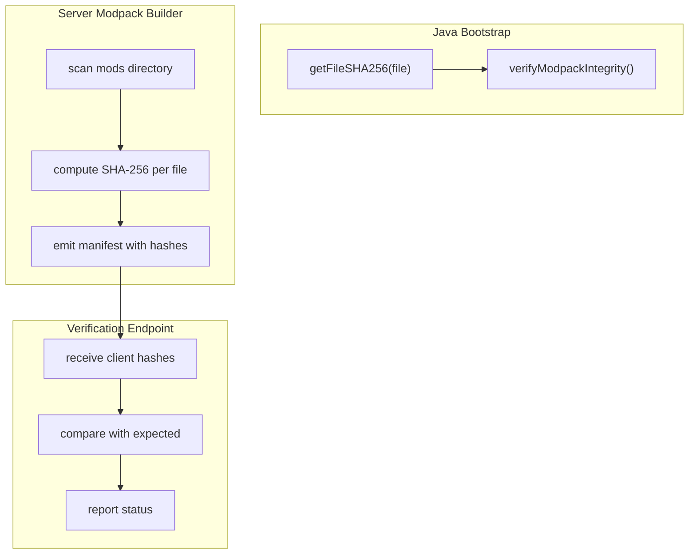
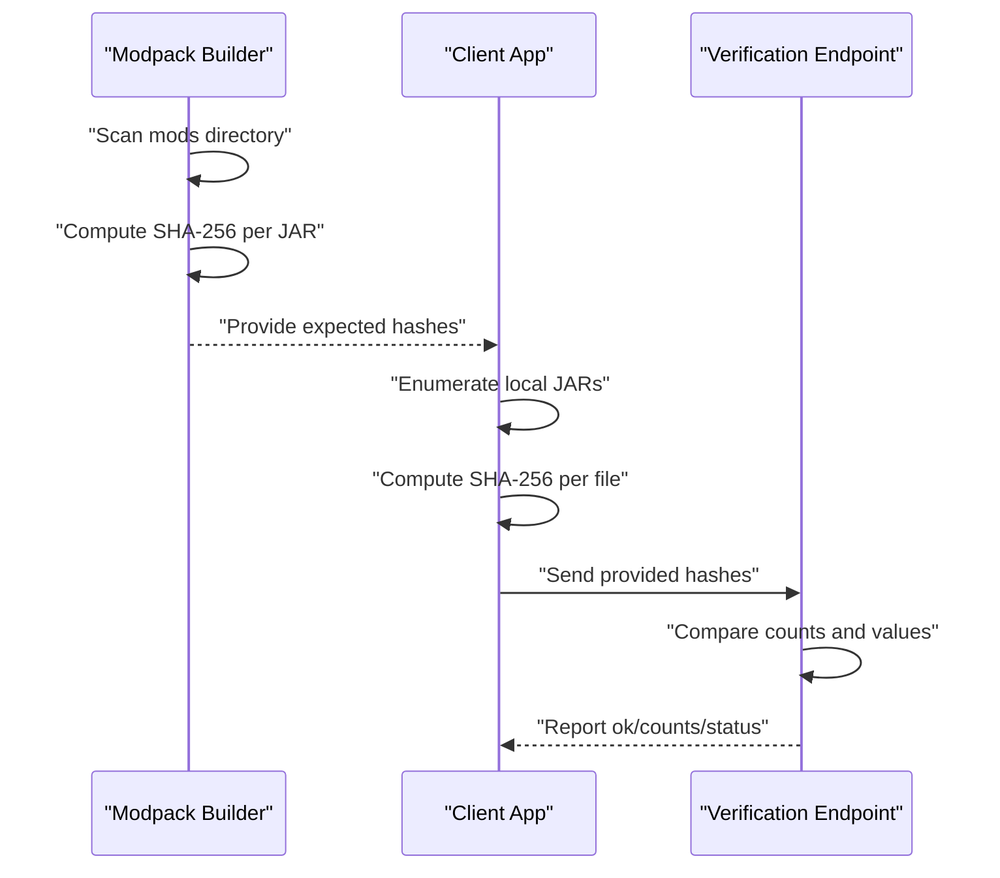
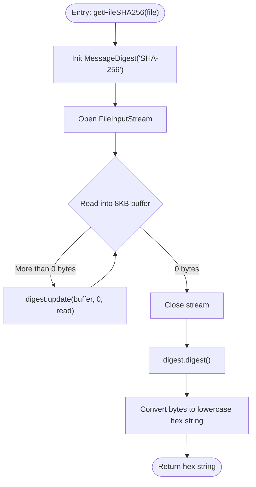
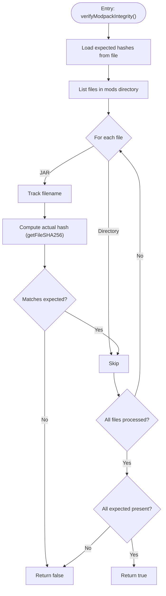
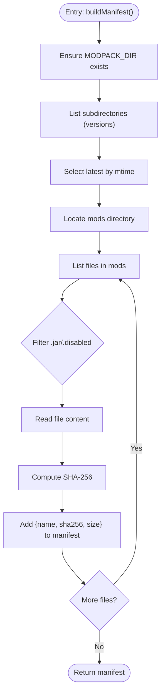
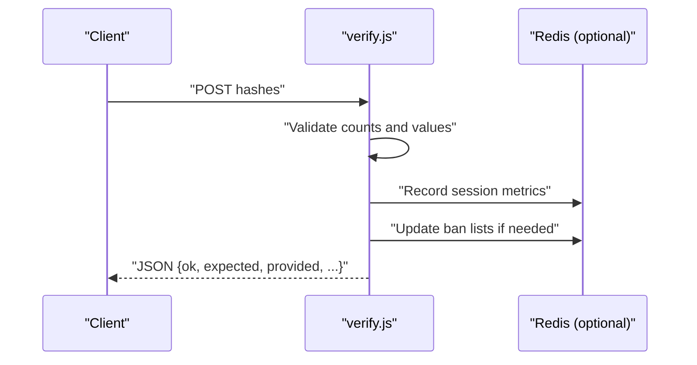
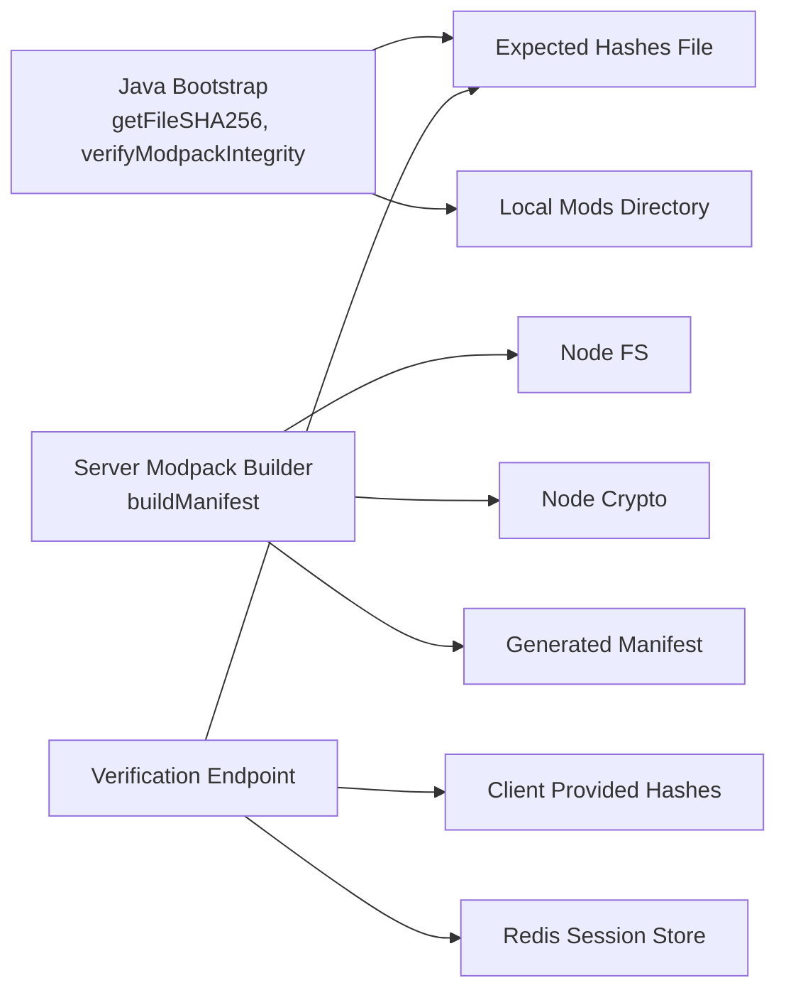

# Hash Calculation & File Processing

<cite>
**Referenced Files in This Document**
- [SBGBootstrap.java](file://src-java/com/sbgames/bootstrap/SBGBootstrap.java)
- [modpack.js](file://server-files/modpack.js)
- [verify.js](file://server-files/verify.js)
- [generate_bootstrap.js](file://scratch/generate_bootstrap.js)
</cite>

## Table of Contents
1. [Introduction](#introduction)
2. [Project Structure](#project-structure)
3. [Core Components](#core-components)
4. [Architecture Overview](#architecture-overview)
5. [Detailed Component Analysis](#detailed-component-analysis)
6. [Dependency Analysis](#dependency-analysis)
7. [Performance Considerations](#performance-considerations)
8. [Troubleshooting Guide](#troubleshooting-guide)
9. [Conclusion](#conclusion)

## Introduction
This document explains the SHA-256 hash calculation system used to verify file integrity in the SBGames project. It focuses on the Java implementation of the getFileSHA256 method, detailing how MessageDigest processes files in chunks, streams data efficiently, and converts raw bytes to hexadecimal strings. It also covers the workflow for computing hashes across a modpack directory, comparing computed vs. expected values, and outlines performance characteristics and optimization strategies for large modpacks.

## Project Structure
The hash calculation system spans three primary areas:
- Java bootstrap: computes SHA-256 for individual files and verifies a modpack against expected hashes
- Server-side modpack builder: scans a modpack directory and generates per-file SHA-256 digests
- Verification endpoint: compares client-provided hashes against expected ones and reports discrepancies

**Diagram sources**
- [SBGBootstrap.java:300-370](file://src-java/com/sbgames/bootstrap/SBGBootstrap.java#L300-L370)
- [modpack.js:25-54](file://server-files/modpack.js#L25-L54)
- [verify.js:81-113](file://server-files/verify.js#L81-L113)

**Section sources**
- [SBGBootstrap.java:300-370](file://src-java/com/sbgames/bootstrap/SBGBootstrap.java#L300-L370)
- [modpack.js:25-54](file://server-files/modpack.js#L25-L54)
- [verify.js:81-113](file://server-files/verify.js#L81-L113)

## Core Components
- getFileSHA256(file): Computes the SHA-256 digest of a single file using MessageDigest, streaming bytes in 8 KB chunks and converting the final digest to lowercase hexadecimal.
- verifyModpackIntegrity(): Reads expected hashes from a file, enumerates JAR files in a directory, computes actual hashes, and ensures all expected files are present and matched.
- Server-side modpack builder: Scans a modpack directory, reads each JAR file, computes SHA-256, and emits a manifest with entries for each file.
- Verification endpoint: Receives client-provided hashes, compares counts and values against expected, and reports totals and status.

**Section sources**
- [SBGBootstrap.java:300-370](file://src-java/com/sbgames/bootstrap/SBGBootstrap.java#L300-L370)
- [modpack.js:25-54](file://server-files/modpack.js#L25-L54)
- [verify.js:81-113](file://server-files/verify.js#L81-L113)

## Architecture Overview
The system supports a client-server integrity workflow:
- Server builds a manifest of expected hashes for a given modpack version
- Client computes hashes for local files and sends them to the verification endpoint
- Server compares received hashes with expected ones and reports pass/fail along with counts

**Diagram sources**
- [modpack.js:25-54](file://server-files/modpack.js#L25-L54)
- [SBGBootstrap.java:300-370](file://src-java/com/sbgames/bootstrap/SBGBootstrap.java#L300-L370)
- [verify.js:81-113](file://server-files/verify.js#L81-L113)

## Detailed Component Analysis

### getFileSHA256 Method Implementation
The method performs:
- MessageDigest initialization with SHA-256
- Buffered streaming with an 8 KB buffer
- Repeated digest.update calls with the actual number of bytes read
- Final digest computation and hexadecimal conversion to a lowercase string

**Diagram sources**
- [SBGBootstrap.java:355-370](file://src-java/com/sbgames/bootstrap/SBGBootstrap.java#L355-L370)

**Section sources**
- [SBGBootstrap.java:355-370](file://src-java/com/sbgames/bootstrap/SBGBootstrap.java#L355-L370)

### verifyModpackIntegrity Workflow
The verification process:
- Loads expected hashes from a file mapping filenames to SHA-256 values
- Enumerates JAR files under a configured mods directory
- Skips directories and non-JAR files
- Tracks processed filenames and compares against expected entries
- Computes actual hash per file using getFileSHA256 and compares with expected
- Returns true only if all expected files are present and hashes match

**Diagram sources**
- [SBGBootstrap.java:300-370](file://src-java/com/sbgames/bootstrap/SBGBootstrap.java#L300-L370)

**Section sources**
- [SBGBootstrap.java:300-370](file://src-java/com/sbgames/bootstrap/SBGBootstrap.java#L300-L370)

### Server-Side Modpack Hash Generation
The server scans a modpack directory and computes SHA-256 for each JAR file:
- Reads the mods directory
- Filters for .jar and .disabled files
- Reads entire file content into memory
- Computes SHA-256 and records name, size, and hash
- Emits a manifest containing these entries

**Diagram sources**
- [modpack.js:25-54](file://server-files/modpack.js#L25-L54)

**Section sources**
- [modpack.js:25-54](file://server-files/modpack.js#L25-L54)

### Verification Endpoint Behavior
The verification endpoint:
- Receives expected hashes and client-provided hashes
- Compares counts and values
- Records session metrics and ban lists when appropriate
- Responds with a JSON summary including totals and pass/fail status

**Diagram sources**
- [verify.js:81-113](file://server-files/verify.js#L81-L113)

**Section sources**
- [verify.js:81-113](file://server-files/verify.js#L81-L113)

## Dependency Analysis
- Java bootstrap depends on:
  - Standard Java Cryptography APIs for SHA-256
  - File I/O for reading files and parsing expected hash files
- Server-side modpack builder depends on:
  - Node.js filesystem APIs for scanning directories and reading files
  - Node.js crypto for SHA-256 computation
- Verification endpoint depends on:
  - Express-style routing and optional Redis for session storage

**Diagram sources**
- [SBGBootstrap.java:300-370](file://src-java/com/sbgames/bootstrap/SBGBootstrap.java#L300-L370)
- [modpack.js:25-54](file://server-files/modpack.js#L25-L54)
- [verify.js:81-113](file://server-files/verify.js#L81-L113)

**Section sources**
- [SBGBootstrap.java:300-370](file://src-java/com/sbgames/bootstrap/SBGBootstrap.java#L300-L370)
- [modpack.js:25-54](file://server-files/modpack.js#L25-L54)
- [verify.js:81-113](file://server-files/verify.js#L81-L113)

## Performance Considerations
- 8 KB buffer optimization:
  - Reduces memory overhead by avoiding loading entire files into RAM
  - Provides efficient streaming updates to the digest
- Memory efficiency:
  - Java implementation streams bytes and avoids storing full file contents
  - Server-side generator reads entire files for hashing; consider streaming for very large files if needed
- Scalability for large modpacks:
  - Parallelization opportunities exist for computing hashes across many files
  - Consider batching and limiting concurrency to avoid I/O saturation
- Network and storage:
  - Verification endpoint should minimize unnecessary I/O and leverage caching where applicable

[No sources needed since this section provides general guidance]

## Troubleshooting Guide
- Hash mismatch:
  - Verify the expected hash file contains lowercase hex values and correct filename-to-hash mapping
  - Confirm the mods directory path and file extensions (.jar)
- Missing files:
  - Ensure all expected filenames are present in the mods directory
  - Check for typos or case sensitivity issues
- Large file handling:
  - Confirm the 8 KB buffer is sufficient for typical hardware; adjust if necessary
  - Monitor I/O throughput when processing many large files concurrently
- Server-side manifest generation:
  - Ensure the modpack directory structure is correct and readable
  - Validate that only JAR files are being hashed; disabled files are filtered appropriately

**Section sources**
- [SBGBootstrap.java:300-370](file://src-java/com/sbgames/bootstrap/SBGBootstrap.java#L300-L370)
- [modpack.js:25-54](file://server-files/modpack.js#L25-L54)
- [verify.js:81-113](file://server-files/verify.js#L81-L113)

## Conclusion
The SHA-256 hash calculation system combines a robust Java implementation for file hashing with a server-side modpack builder and verification endpoint. The 8 KB buffer ensures efficient memory usage during hashing, while the verification workflow guarantees integrity checks across large modpacks. For optimal performance, consider parallelizing hash computations and tuning I/O limits when processing extensive file sets.