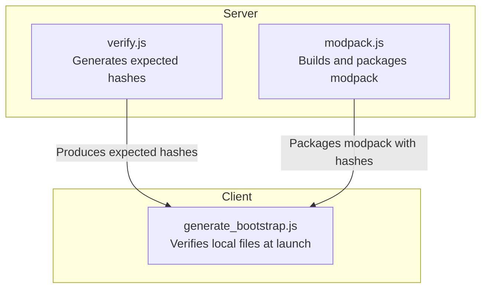
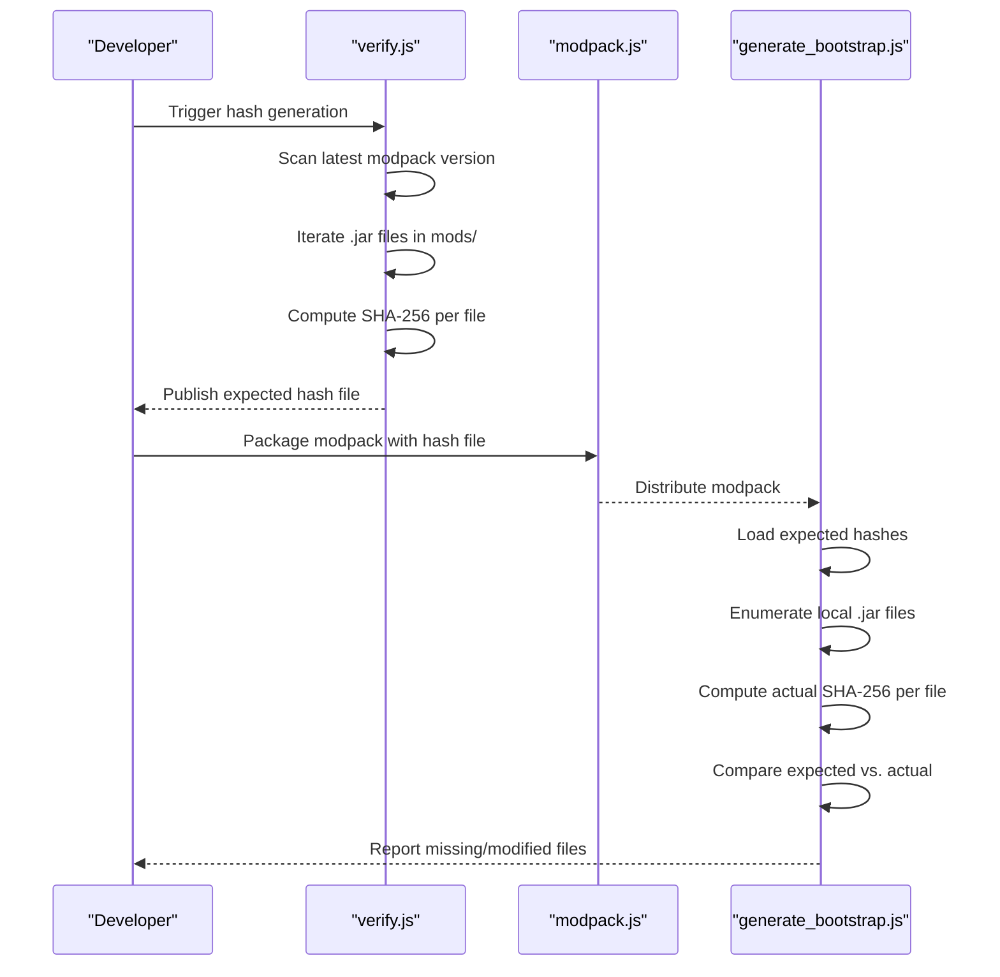
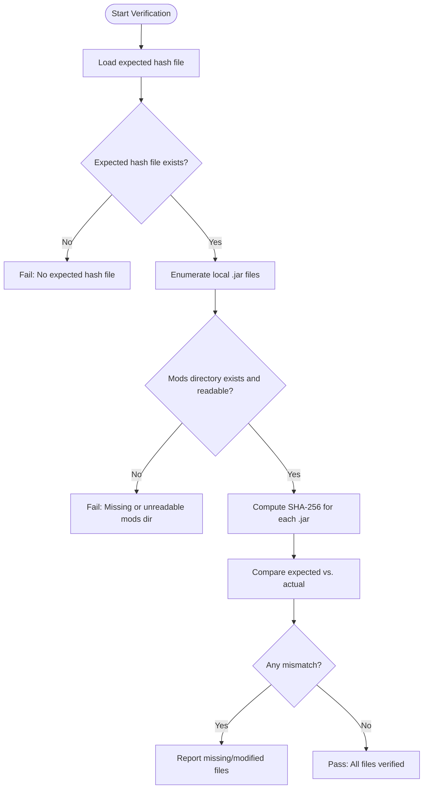
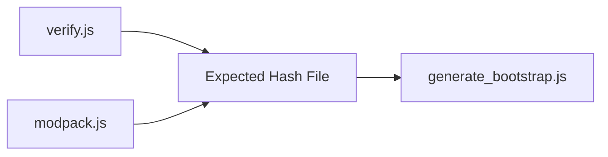

# Integrity Verification & Validation

<cite>
**Referenced Files in This Document**
- [verify.js](file://server-files/verify.js)
- [modpack.js](file://server-files/modpack.js)
- [generate_bootstrap.js](file://scratch/generate_bootstrap.js)
</cite>

## Table of Contents
1. [Introduction](#introduction)
2. [Project Structure](#project-structure)
3. [Core Components](#core-components)
4. [Architecture Overview](#architecture-overview)
5. [Detailed Component Analysis](#detailed-component-analysis)
6. [Dependency Analysis](#dependency-analysis)
7. [Performance Considerations](#performance-considerations)
8. [Troubleshooting Guide](#troubleshooting-guide)
9. [Conclusion](#conclusion)

## Introduction
This document explains the modpack integrity verification system used to validate game files and prevent tampering. It covers the SHA-256 hashing mechanism, the hash file format, expected versus actual hash comparison logic, handling of missing or modified files, the verification process during game launch, and the relationship between server-side generation and client-side validation. It also includes examples of hash calculation, file enumeration, validation error scenarios, and performance considerations for large modpacks.

## Project Structure
The integrity verification spans two primary areas:
- Server-side generation and distribution of expected hashes
- Client-side validation against local files

**Diagram sources**
- [verify.js](file://server-files/verify.js)
- [modpack.js](file://server-files/modpack.js)
- [generate_bootstrap.js](file://scratch/generate_bootstrap.js)

**Section sources**
- [verify.js](file://server-files/verify.js)
- [modpack.js](file://server-files/modpack.js)
- [generate_bootstrap.js](file://scratch/generate_bootstrap.js)

## Core Components
- Expected hash generator: Reads the latest modpack version and computes SHA-256 digests for each .jar file in the mods directory.
- Hash file format: Lines of the form "<sha256>:<filename>".
- Client verifier: Loads the expected hash file, enumerates local .jar files, computes actual SHA-256, compares with expected, and reports discrepancies.

Key responsibilities:
- Enumerate and filter .jar files
- Compute SHA-256 per file
- Compare expected vs. actual hashes
- Report missing or modified files
- Fail-safe behavior when directories are absent or unreadable

**Section sources**
- [verify.js](file://server-files/verify.js)
- [generate_bootstrap.js](file://scratch/generate_bootstrap.js)

## Architecture Overview
The system operates in two stages:
1. Server-side: Build script generates expected hashes for the current modpack version and stores them in a hash file.
2. Client-side: Bootstrap verifies local files against the expected hash file before allowing gameplay.

**Diagram sources**
- [verify.js](file://server-files/verify.js)
- [modpack.js](file://server-files/modpack.js)
- [generate_bootstrap.js](file://scratch/generate_bootstrap.js)

## Detailed Component Analysis

### Server-Side Hash Generation (verify.js)
Responsibilities:
- Determine the latest modpack version by scanning the modpack directory and selecting the most recent subdirectory by modification time.
- Enumerate .jar files in the mods subdirectory of the selected version.
- Read each .jar file and compute its SHA-256 digest.
- Record each file’s name and its SHA-256 digest along with size metadata.

Processing logic highlights:
- Directory traversal and filtering by extension
- SHA-256 computation per file
- Aggregation of results for distribution

Validation and error handling:
- Gracefully handles missing directories or unreadable files by skipping them and continuing.
- Returns structured data containing the latest version identifier and the computed hashes.

Example references:
- Latest version selection and directory existence checks
- Iteration over .jar files and SHA-256 computation
- Returning version and hashes for packaging

**Section sources**
- [verify.js](file://server-files/verify.js)

### Hash File Format
The expected hash file is a text file where each line contains:
- A SHA-256 digest (lowercase hexadecimal)
- A colon separator
- The filename (e.g., a .jar file)

Example format:
- <sha256>:<filename>
- Example line: abc123...def456:my-mod.jar

This format enables fast parsing and straightforward expected vs. actual comparisons.

**Section sources**
- [verify.js](file://server-files/verify.js)

### Client-Side Verification (generate_bootstrap.js)
Responsibilities:
- Load the expected hash file
- Enumerate local .jar files in the mods directory
- Compute the actual SHA-256 for each discovered .jar
- Compare expected vs. actual hash
- Track missing or modified files

Verification logic:
- Parse expected hash file into a map of filename to expected SHA-256
- List local .jar files and filter by extension
- For each local file, compute SHA-256 and compare with expected
- Produce a report of mismatches and missing files

Error handling:
- If the expected hash file is missing, treat as failure to verify
- If the mods directory is missing or not a directory, treat as failure to verify
- Skip unreadable or inaccessible files gracefully

Validation outcomes:
- All files match: pass
- Some files differ or are missing: fail with details

**Section sources**
- [generate_bootstrap.js](file://scratch/generate_bootstrap.js)

### Validation Workflow Sequence

**Diagram sources**
- [generate_bootstrap.js](file://scratch/generate_bootstrap.js)

## Dependency Analysis
- Server-side depends on filesystem enumeration and cryptographic hashing to produce expected values.
- Client-side depends on the presence of the expected hash file and local .jar files to perform validation.
- The modpack packaging step ensures the expected hash file is bundled with the client distribution.

**Diagram sources**
- [verify.js](file://server-files/verify.js)
- [modpack.js](file://server-files/modpack.js)
- [generate_bootstrap.js](file://scratch/generate_bootstrap.js)

**Section sources**
- [verify.js](file://server-files/verify.js)
- [modpack.js](file://server-files/modpack.js)
- [generate_bootstrap.js](file://scratch/generate_bootstrap.js)

## Performance Considerations
- Large modpacks: SHA-256 computation scales linearly with the number of .jar files. Consider:
  - Parallelizing hashing for independent files
  - Streaming reads to reduce memory pressure
  - Caching expected hashes to avoid recomputation
- I/O overhead: Directory traversal and file reads dominate runtime. Optimize by:
  - Using efficient directory enumeration
  - Avoiding redundant stat calls
- Network considerations: If distributing the expected hash file, minimize payload size and leverage compression.

## Troubleshooting Guide
Common scenarios and resolutions:
- Missing expected hash file:
  - Cause: Packaging step did not include the hash file
  - Resolution: Rebuild and repack the modpack with the expected hash file
- Missing mods directory:
  - Cause: Game installation incomplete
  - Resolution: Reinstall or repair the game installation
- Modified or missing .jar files:
  - Cause: Manual edits or third-party tools
  - Resolution: Restore original .jar files or reinstall the modpack
- Permission errors:
  - Cause: Insufficient permissions to read files or directories
  - Resolution: Adjust file permissions or run with elevated privileges
- Unexpected file types:
  - Cause: Non-.jar files in mods directory
  - Resolution: Remove non-.jar files or adjust filtering logic

Operational checks:
- Confirm the expected hash file exists and is readable
- Confirm the mods directory exists and contains .jar files
- Verify SHA-256 computation succeeds for all files
- Log and report differences for diagnostics

**Section sources**
- [generate_bootstrap.js](file://scratch/generate_bootstrap.js)

## Conclusion
The integrity verification system uses SHA-256 to ensure modpack authenticity and prevent tampering. Server-side generation produces expected hashes for the latest modpack version, packaged with the client. At launch, the client validates local .jar files against the expected hash file, reporting missing or modified files. Proper packaging, robust error handling, and performance optimizations enable reliable and scalable verification for large modpacks.