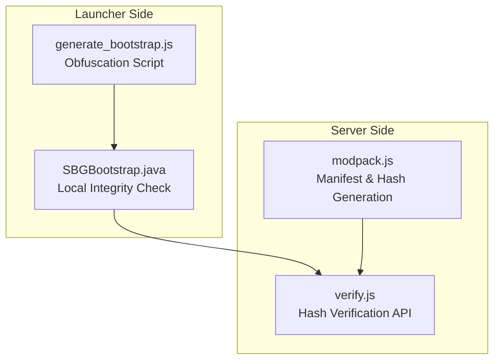
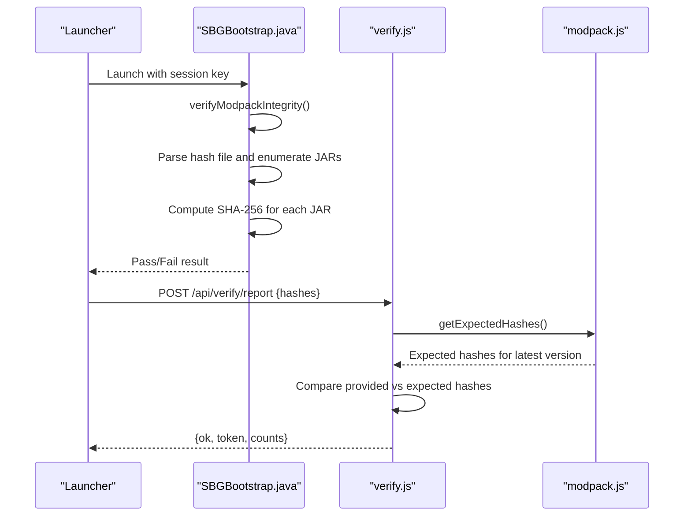
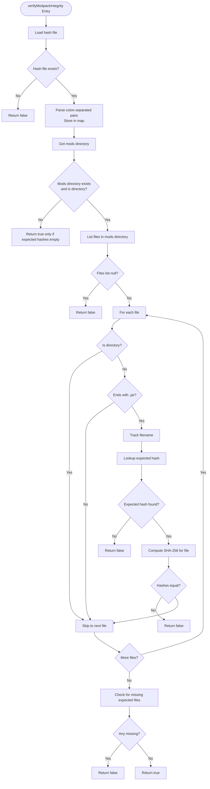
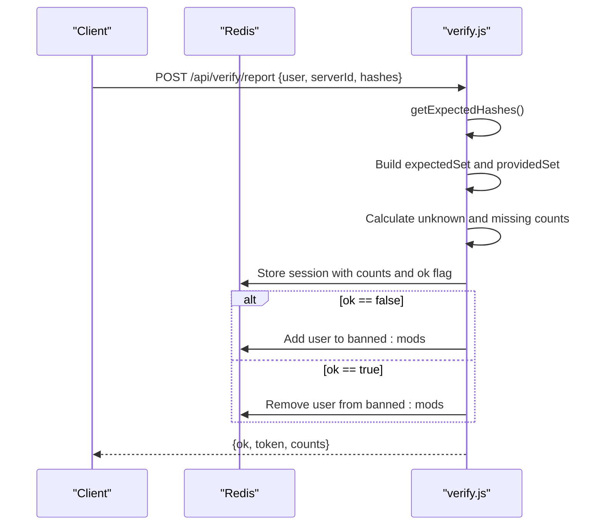
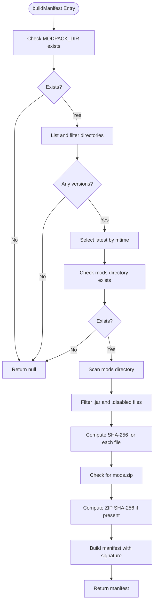
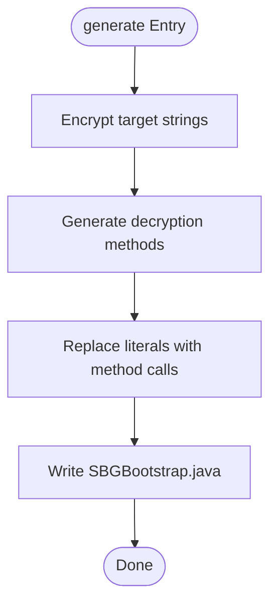
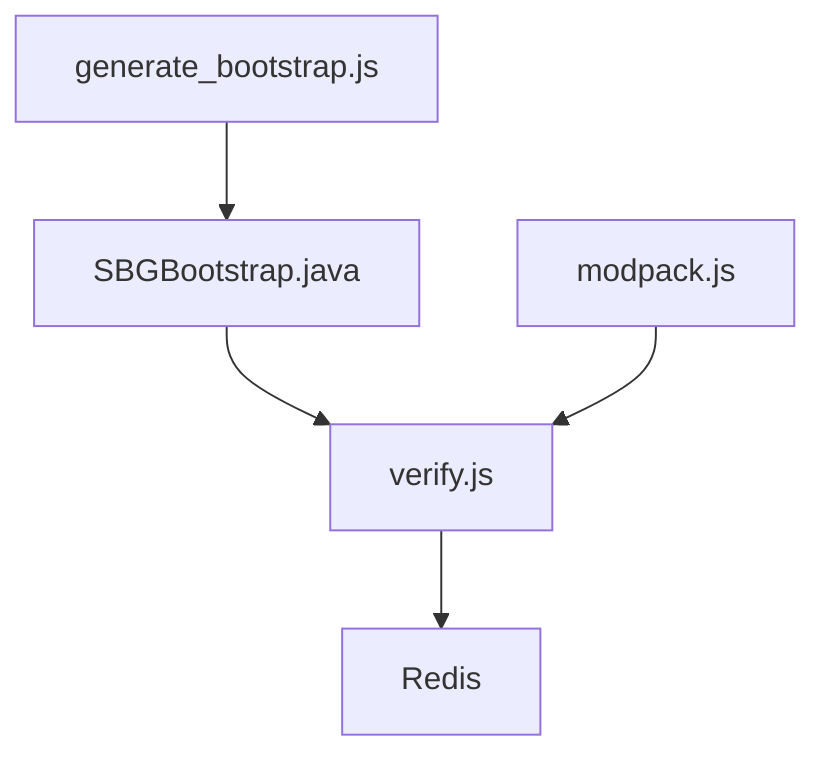

# Modpack Validation Logic

<cite>
**Referenced Files in This Document**
- [verify.js](file://server-files/verify.js)
- [modpack.js](file://server-files/modpack.js)
- [SBGBootstrap.java](file://src-java/com/sbgames/bootstrap/SBGBootstrap.java)
- [generate_bootstrap.js](file://scratch/generate_bootstrap.js)
</cite>

## Table of Contents
1. [Introduction](#introduction)
2. [Project Structure](#project-structure)
3. [Core Components](#core-components)
4. [Architecture Overview](#architecture-overview)
5. [Detailed Component Analysis](#detailed-component-analysis)
6. [Dependency Analysis](#dependency-analysis)
7. [Performance Considerations](#performance-considerations)
8. [Troubleshooting Guide](#troubleshooting-guide)
9. [Conclusion](#conclusion)

## Introduction
This document provides comprehensive documentation for the modpack validation system used in the SBGames Minecraft launcher. It focuses on the `verifyModpackIntegrity` method, detailing hash file parsing, expected versus actual hash comparison, and validation failure scenarios. The documentation covers the hash file format (colon-separated hash-value pairs), file enumeration logic, and JAR file filtering. It also explains the validation workflow from hash file loading to final integrity assessment, including examples of valid and invalid configurations, missing files detection, and modified file handling. Edge cases such as empty directories, corrupted hash files, and permission-related errors are addressed, along with the relationship between expected hashes and actual file verification.

## Project Structure
The modpack validation system spans multiple components:
- A Java bootstrap that performs local integrity checks during launch
- A Node.js server module that validates uploaded hashes against expected values
- A manifest builder that generates SHA-256 hashes for mod files
- An obfuscation script that generates the Java bootstrap with encoded constants

**Diagram sources**
- [SBGBootstrap.java:293-353](file://src-java/com/sbgames/bootstrap/SBGBootstrap.java#L293-L353)
- [generate_bootstrap.js:71-266](file://scratch/generate_bootstrap.js#L71-L266)
- [verify.js:36-55](file://server-files/verify.js#L36-L55)
- [modpack.js:26-81](file://server-files/modpack.js#L26-L81)

**Section sources**
- [verify.js:1-139](file://server-files/verify.js#L1-L139)
- [modpack.js:1-153](file://server-files/modpack.js#L1-L153)
- [SBGBootstrap.java:1-372](file://src-java/com/sbgames/bootstrap/SBGBootstrap.java#L1-L372)
- [generate_bootstrap.js:1-266](file://scratch/generate_bootstrap.js#L1-L266)

## Core Components
This section outlines the primary components involved in modpack validation and their roles:
- Local integrity checker: Reads a hash file and verifies each JAR in the mods directory against expected hashes.
- Server-side verification: Compares launcher-provided hashes against expected hashes and maintains a ban list for unauthorized or missing mods.
- Manifest generator: Builds a manifest containing SHA-256 hashes for all JAR files in the latest modpack version.

Key responsibilities:
- Hash file parsing and expected hash storage
- Enumeration of JAR files in the mods directory
- SHA-256 computation for actual file verification
- Comparison of expected vs. actual hashes
- Detection of missing or extra files
- Failure handling for corrupted or inaccessible files

**Section sources**
- [SBGBootstrap.java:293-353](file://src-java/com/sbgames/bootstrap/SBGBootstrap.java#L293-L353)
- [verify.js:36-55](file://server-files/verify.js#L36-L55)
- [modpack.js:26-81](file://server-files/modpack.js#L26-L81)

## Architecture Overview
The validation architecture consists of three layers:
- Launcher integrity check: Performed locally before launching the game
- Server verification: Validates uploaded hashes against expected values
- Manifest generation: Produces expected hashes for the current modpack version

**Diagram sources**
- [SBGBootstrap.java:293-353](file://src-java/com/sbgames/bootstrap/SBGBootstrap.java#L293-L353)
- [verify.js:61-113](file://server-files/verify.js#L61-L113)
- [modpack.js:26-81](file://server-files/modpack.js#L26-L81)

## Detailed Component Analysis

### Local Integrity Checker (`verifyModpackIntegrity`)
The local integrity checker performs the following steps:
1. Load the hash file and parse expected hashes
2. Enumerate JAR files in the mods directory
3. Compute SHA-256 for each JAR and compare with expected hashes
4. Detect missing or extra files
5. Return pass/fail result

Hash file format:
- Each line contains a colon-separated pair: `<hash>:<filename>`
- Lines are trimmed and empty lines are skipped
- Hash values are converted to lowercase for comparison

JAR file filtering:
- Only files ending with `.jar` are considered
- Directories are ignored
- Each processed JAR is tracked to detect missing entries in the expected set

Validation logic:
- If the hash file does not exist, validation fails
- If the mods directory does not exist or is not a directory, validation passes only if expected hashes are empty
- For each JAR, if the expected hash is missing or mismatches, validation fails
- If any expected hash is not processed, validation fails

**Diagram sources**
- [SBGBootstrap.java:293-353](file://src-java/com/sbgames/bootstrap/SBGBootstrap.java#L293-L353)

**Section sources**
- [SBGBootstrap.java:293-353](file://src-java/com/sbgames/bootstrap/SBGBootstrap.java#L293-L353)

### Server-Side Verification (`verify.js`)
The server-side verification compares launcher-provided hashes against expected hashes:
- Loads expected hashes from the latest modpack version
- Computes sets of expected and provided hashes
- Identifies unknown and missing mods
- Generates a session token and updates Redis with validation results
- Maintains a ban list for users with unauthorized or missing mods

Key routes:
- POST `/api/verify/report`: Accepts launcher-provided hashes and returns validation results
- GET `/api/verify/check`: Retrieves session data for external verification
- GET `/api/verify/expected`: Returns expected hashes for testing
- GET `/api/verify/banlist`: Lists users on the ban list

**Diagram sources**
- [verify.js:61-113](file://server-files/verify.js#L61-L113)

**Section sources**
- [verify.js:36-55](file://server-files/verify.js#L36-L55)
- [verify.js:61-113](file://server-files/verify.js#L61-L113)
- [verify.js:115-124](file://server-files/verify.js#L115-L124)
- [verify.js:127-136](file://server-files/verify.js#L127-L136)

### Manifest Generator (`modpack.js`)
The manifest generator builds a manifest containing SHA-256 hashes for all JAR files in the latest modpack version:
- Scans the modpack directory for versions sorted by modification time
- Enumerates JAR and disabled files in the mods directory
- Computes SHA-256 for each file and records size
- Optionally computes a ZIP hash if a prebuilt ZIP exists
- Generates an HMAC signature for the manifest

**Diagram sources**
- [modpack.js:26-81](file://server-files/modpack.js#L26-L81)

**Section sources**
- [modpack.js:26-81](file://server-files/modpack.js#L26-L81)

### Obfuscation Script (`generate_bootstrap.js`)
The obfuscation script generates the Java bootstrap with encoded constants for sensitive strings such as file paths and class names. It creates decryption methods for each target string and injects them into the generated Java code.

**Diagram sources**
- [generate_bootstrap.js:71-266](file://scratch/generate_bootstrap.js#L71-L266)

**Section sources**
- [generate_bootstrap.js:71-266](file://scratch/generate_bootstrap.js#L71-L266)

## Dependency Analysis
The modpack validation system exhibits the following dependencies:
- The launcher integrity checker depends on the presence of a hash file and the mods directory
- The server-side verification depends on the manifest generator for expected hashes
- Redis is used for session storage and ban list management
- The obfuscation script generates the Java bootstrap with encoded constants

**Diagram sources**
- [generate_bootstrap.js:71-266](file://scratch/generate_bootstrap.js#L71-L266)
- [SBGBootstrap.java:293-353](file://src-java/com/sbgames/bootstrap/SBGBootstrap.java#L293-L353)
- [verify.js:36-55](file://server-files/verify.js#L36-L55)
- [modpack.js:26-81](file://server-files/modpack.js#L26-L81)

**Section sources**
- [verify.js:28-33](file://server-files/verify.js#L28-L33)
- [modpack.js:22-23](file://server-files/modpack.js#L22-L23)

## Performance Considerations
- Hash computation: SHA-256 computation is performed per JAR file. For large modpacks, this can be I/O bound.
- File enumeration: Directory scanning and file reading are linear in the number of files.
- Memory usage: Hash maps and sets scale with the number of expected and processed files.
- Network overhead: Server-side verification involves Redis operations and JSON serialization.

Optimization recommendations:
- Precompute and cache expected hashes on the server
- Use streaming SHA-256 for very large files
- Implement parallel processing for hash computation if acceptable in the launcher context
- Minimize Redis round trips by batching operations

## Troubleshooting Guide
Common validation failures and their causes:
- Missing hash file: The integrity checker returns false when the hash file is absent
- Missing mods directory: Validation passes only if expected hashes are empty; otherwise it fails
- Corrupted hash file: Empty lines and malformed entries are skipped; ensure proper colon separation
- Permission errors: File reading failures during hash computation lead to validation failure
- Modified files: SHA-256 mismatch triggers failure
- Missing files: Presence of expected hashes without corresponding files leads to failure
- Extra files: Not applicable in the local integrity checker; server-side verification handles unknown mods

Edge cases:
- Empty directories: No JAR files processed; validation depends on expected hashes being empty
- Empty hash file: No expected hashes; validation passes only if no mods are present
- Case sensitivity: Hash comparisons are case-insensitive due to lowercase conversion
- Non-JAR files: Ignored by the integrity checker; server-side verification filters by extension

**Section sources**
- [SBGBootstrap.java:293-353](file://src-java/com/sbgames/bootstrap/SBGBootstrap.java#L293-L353)
- [verify.js:61-113](file://server-files/verify.js#L61-L113)

## Conclusion
The modpack validation system combines local integrity checking with server-side verification to ensure mod authenticity and completeness. The local integrity checker enforces strict adherence to expected hashes, while the server-side component provides broader oversight and ban management. The manifest generator ensures expected hashes are accurate and up-to-date. Together, these components form a robust validation pipeline that detects tampering, missing files, and unauthorized modifications.