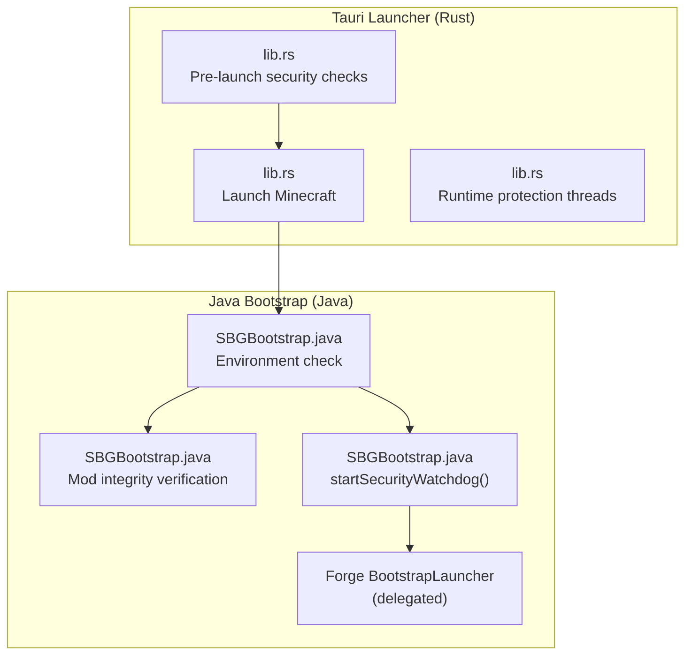
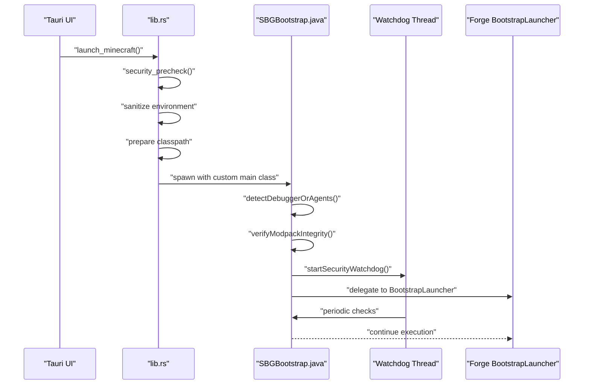
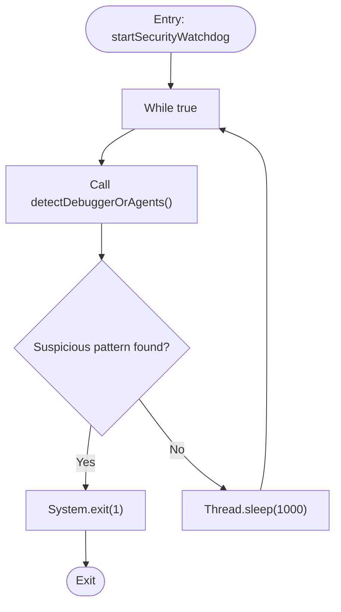
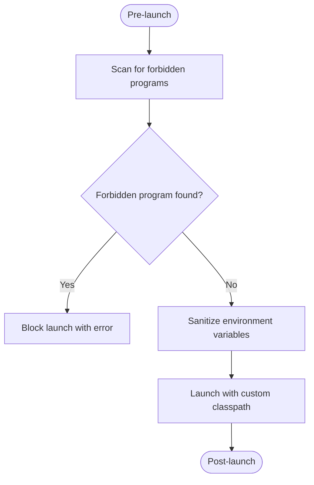
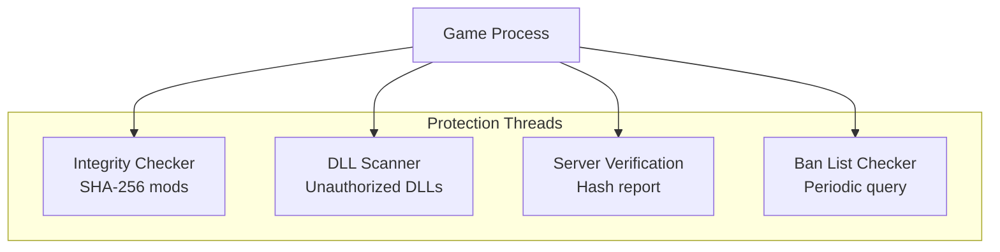
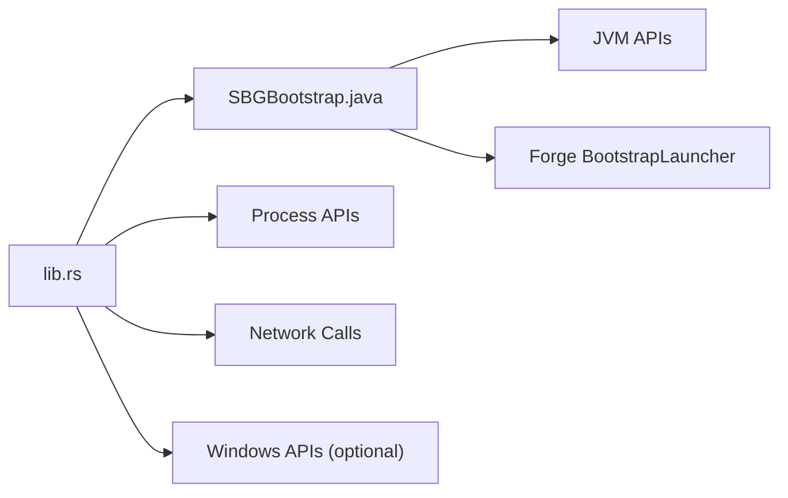

# Security Watchdog & Runtime Protection

<cite>
**Referenced Files in This Document**
- [SBGBootstrap.java](file://src-java/com/sbgames/bootstrap/SBGBootstrap.java)
- [generate_bootstrap.js](file://scratch/generate_bootstrap.js)
- [lib.rs](file://src-tauri/src/lib.rs)
- [main.rs](file://src-tauri/src/main.rs)
</cite>

## Table of Contents
1. [Introduction](#introduction)
2. [Project Structure](#project-structure)
3. [Core Components](#core-components)
4. [Architecture Overview](#architecture-overview)
5. [Detailed Component Analysis](#detailed-component-analysis)
6. [Dependency Analysis](#dependency-analysis)
7. [Performance Considerations](#performance-considerations)
8. [Troubleshooting Guide](#troubleshooting-guide)
9. [Conclusion](#conclusion)

## Introduction
This document explains the runtime security monitoring system implemented through the `startSecurityWatchdog` method. It covers the continuous monitoring loop that detects debugger attachment and suspicious JVM arguments, the watchdog thread implementation (daemon configuration, sleep intervals, exception handling), detection mechanisms for debugging agents, profiling tools, and development environments, examples of detected suspicious patterns and their corresponding exit conditions, the relationship between watchdog monitoring and game launch prevention, and performance impact considerations for production environments.

## Project Structure
The security watchdog spans two primary areas:
- A Java bootstrap component that validates the environment, verifies mod integrity, starts the watchdog, and delegates to the Forge launcher.
- A Tauri Rust launcher that performs pre-launch checks, sanitizes the environment, launches the game with a custom bootstrap, and maintains runtime protection.

**Diagram sources**
- [lib.rs:342-950](file://src-tauri/src/lib.rs#L342-L950)
- [SBGBootstrap.java:207-291](file://src-java/com/sbgames/bootstrap/SBGBootstrap.java#L207-L291)

**Section sources**
- [lib.rs:342-950](file://src-tauri/src/lib.rs#L342-L950)
- [SBGBootstrap.java:207-291](file://src-java/com/sbgames/bootstrap/SBGBootstrap.java#L207-L291)

## Core Components
- Java Bootstrap (`SBGBootstrap.java`):
  - Validates environment by scanning JVM input arguments and environment variables for suspicious patterns.
  - Verifies modpack integrity against a SHA-256 manifest.
  - Starts a daemon watchdog thread that continuously monitors for debugger attachment and suspicious JVM arguments.
  - Delegates to the Forge BootstrapLauncher after successful checks.

- Tauri Launcher (`lib.rs`):
  - Performs pre-launch checks to detect forbidden programs and loaded DLLs.
  - Sanitizes environment variables that could inject unwanted JVM options.
  - Launches the game with a custom classpath pointing to the Java bootstrap and a wrapped classpath.
  - Spawns runtime protection threads to monitor the child process for integrity violations and DLL injection.

**Section sources**
- [SBGBootstrap.java:207-291](file://src-java/com/sbgames/bootstrap/SBGBootstrap.java#L207-L291)
- [lib.rs:342-950](file://src-tauri/src/lib.rs#L342-L950)

## Architecture Overview
The security architecture combines pre-launch validation, environment sanitization, and continuous runtime monitoring:

**Diagram sources**
- [lib.rs:342-950](file://src-tauri/src/lib.rs#L342-L950)
- [SBGBootstrap.java:207-291](file://src-java/com/sbgames/bootstrap/SBGBootstrap.java#L207-L291)

## Detailed Component Analysis

### Java Bootstrap: Environment Detection and Watchdog
The Java bootstrap performs three critical steps before delegating to Forge:
1. Reads a session key from stdin.
2. Detects debugger attachment and suspicious JVM arguments.
3. Verifies modpack integrity against a manifest.
4. Starts the security watchdog daemon thread.
5. Delegates to the Forge BootstrapLauncher.

Detection logic scans:
- JVM input arguments for patterns indicating debuggers or profiling tools.
- Environment variables that may inject JVM options.

Watchdog thread:
- Runs continuously in a loop.
- Sleep interval is approximately 1 second.
- On detection of suspicious patterns or exceptions, exits the process.

**Diagram sources**
- [SBGBootstrap.java:275-291](file://src-java/com/sbgames/bootstrap/SBGBootstrap.java#L275-L291)
- [SBGBootstrap.java:239-273](file://src-java/com/sbgames/bootstrap/SBGBootstrap.java#L239-L273)

**Section sources**
- [SBGBootstrap.java:207-291](file://src-java/com/sbgames/bootstrap/SBGBootstrap.java#L207-L291)

### Tauri Pre-Launch Security Checks
The Tauri launcher enforces additional protections before launching the game:
- Scans for forbidden programs (debuggers, disassemblers, network proxies).
- Sanitizes environment variables that could inject JVM options.
- Launches the game with a custom classpath and a secure bootstrap.

**Diagram sources**
- [lib.rs:342-410](file://src-tauri/src/lib.rs#L342-L410)
- [lib.rs:1779-1826](file://src-tauri/src/lib.rs#L1779-L1826)

**Section sources**
- [lib.rs:342-410](file://src-tauri/src/lib.rs#L342-L410)
- [lib.rs:1779-1826](file://src-tauri/src/lib.rs#L1779-L1826)

### Runtime Protection Threads
After launching the game, the Tauri launcher spawns several protection threads:
- Integrity checker: periodically validates mod SHA-256 hashes and counts.
- DLL scanner: enumerates loaded DLLs and flags unauthorized additions.
- Server verification: reports mod hashes to the server and blocks invalid configurations.
- Ban list checker: periodically queries a ban list and terminates the game if the user is banned.

**Diagram sources**
- [lib.rs:1007-1211](file://src-tauri/src/lib.rs#L1007-L1211)
- [lib.rs:1240-1362](file://src-tauri/src/lib.rs#L1240-L1362)

**Section sources**
- [lib.rs:1007-1211](file://src-tauri/src/lib.rs#L1007-L1211)
- [lib.rs:1240-1362](file://src-tauri/src/lib.rs#L1240-L1362)

## Dependency Analysis
The security system depends on:
- Java runtime APIs for argument inspection and environment variable access.
- Tauri process spawning and environment manipulation.
- Windows-specific APIs for DLL enumeration and process termination.
- Network calls to server endpoints for verification and ban checking.

**Diagram sources**
- [SBGBootstrap.java:207-291](file://src-java/com/sbgames/bootstrap/SBGBootstrap.java#L207-L291)
- [lib.rs:342-950](file://src-tauri/src/lib.rs#L342-L950)

**Section sources**
- [SBGBootstrap.java:207-291](file://src-java/com/sbgames/bootstrap/SBGBootstrap.java#L207-L291)
- [lib.rs:342-950](file://src-tauri/src/lib.rs#L342-L950)

## Performance Considerations
- Watchdog thread sleeps for approximately 1 second between checks, minimizing CPU overhead.
- Integrity checks and DLL scans operate on a periodic basis, with optimized polling intervals.
- Environment sanitization occurs once during pre-launch.
- Network calls are bounded by timeouts and executed asynchronously where appropriate.

Optimization strategies for production:
- Tune sleep intervals based on threat model and acceptable latency.
- Batch integrity checks to reduce filesystem I/O.
- Cache allowed DLL baselines to avoid repeated enumeration.
- Use asynchronous verification to prevent blocking the launcher UI.

[No sources needed since this section provides general guidance]

## Troubleshooting Guide
Common issues and resolutions:
- Launch blocked by pre-launch checks:
  - Close forbidden programs (debuggers, disassemblers, network proxies).
  - Clear environment variables that inject JVM options.
- Watchdog triggers exit:
  - Remove suspicious JVM arguments or environment variables.
  - Ensure no external debuggers or profilers are attached.
- Integrity violations:
  - Restore official mod files or update to a compliant modpack.
  - Verify mod counts and hashes match the whitelist.
- DLL injection detected:
  - Remove unauthorized DLLs from the game directory or Java runtime paths.
  - Reinstall trusted Java runtime and system libraries.

**Section sources**
- [lib.rs:1779-1826](file://src-tauri/src/lib.rs#L1779-L1826)
- [lib.rs:1007-1211](file://src-tauri/src/lib.rs#L1007-L1211)
- [SBGBootstrap.java:239-291](file://src-java/com/sbgames/bootstrap/SBGBootstrap.java#L239-L291)

## Conclusion
The security watchdog and runtime protection system combine pre-launch validation, environment sanitization, and continuous monitoring to prevent tampering and unauthorized debugging. The Java bootstrap ensures a clean environment and delegates to Forge, while the Tauri launcher enforces broader protections and monitors the child process. Together, these components provide robust defense-in-depth suitable for production deployment with tunable performance characteristics.