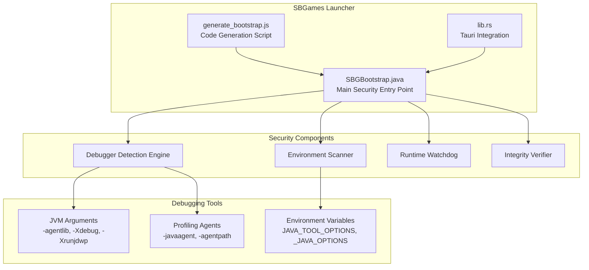
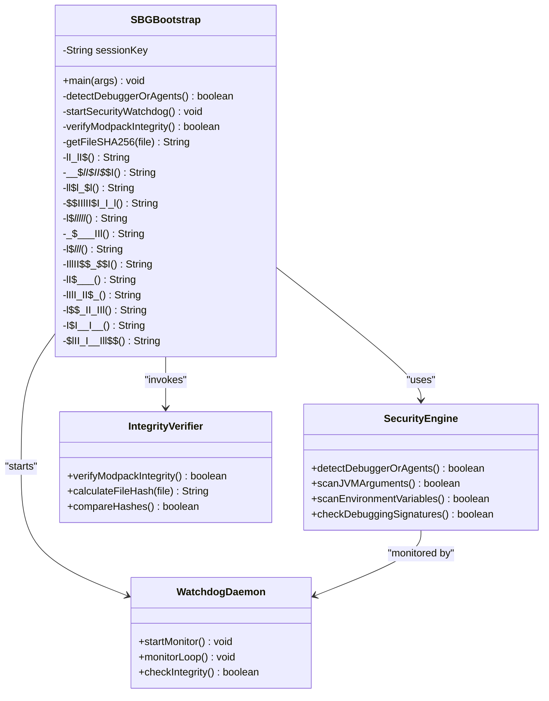
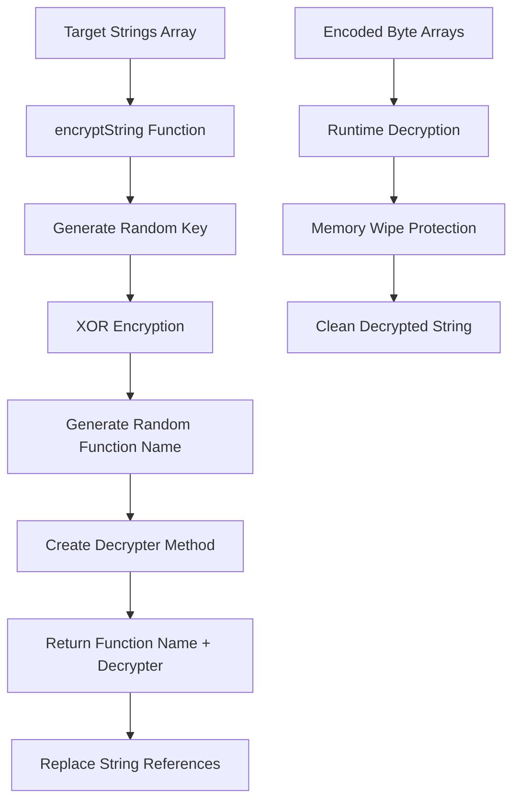
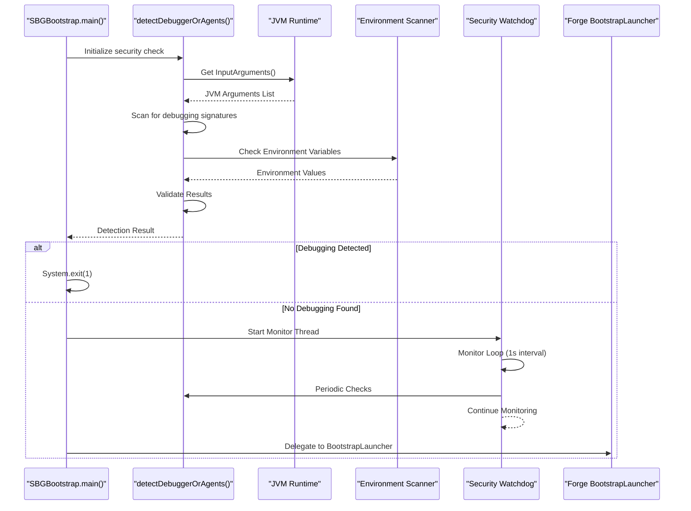
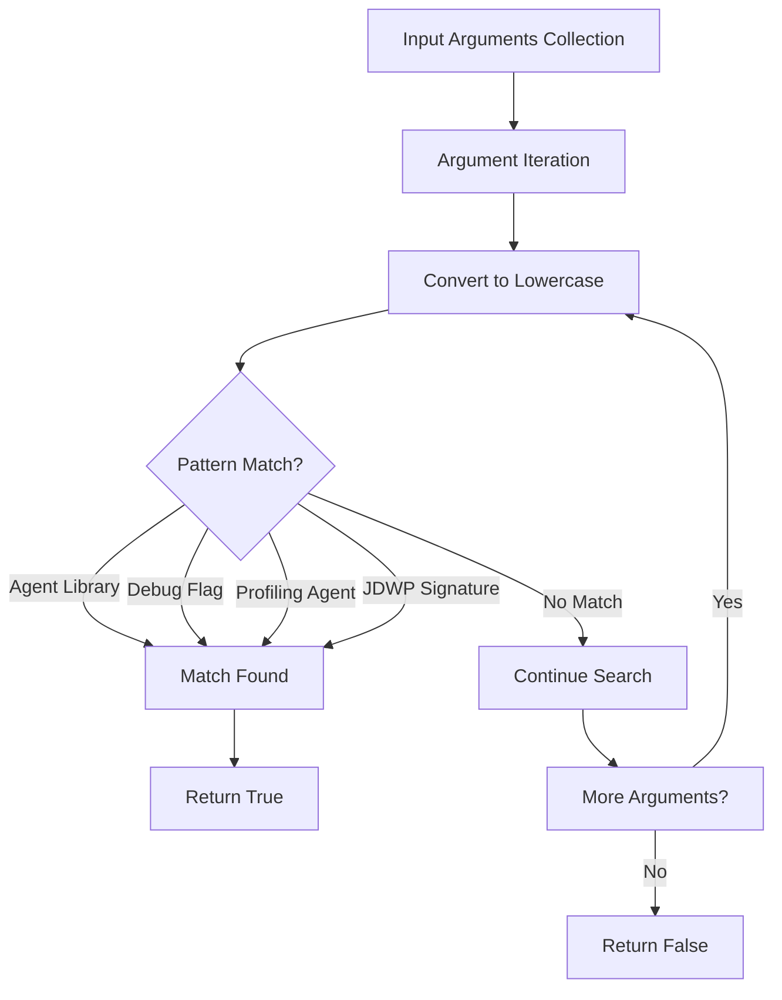
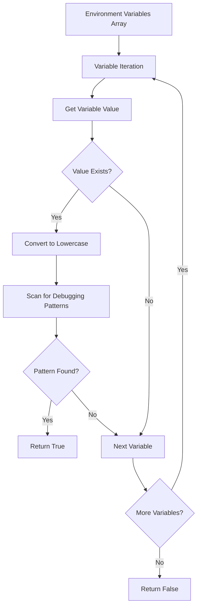
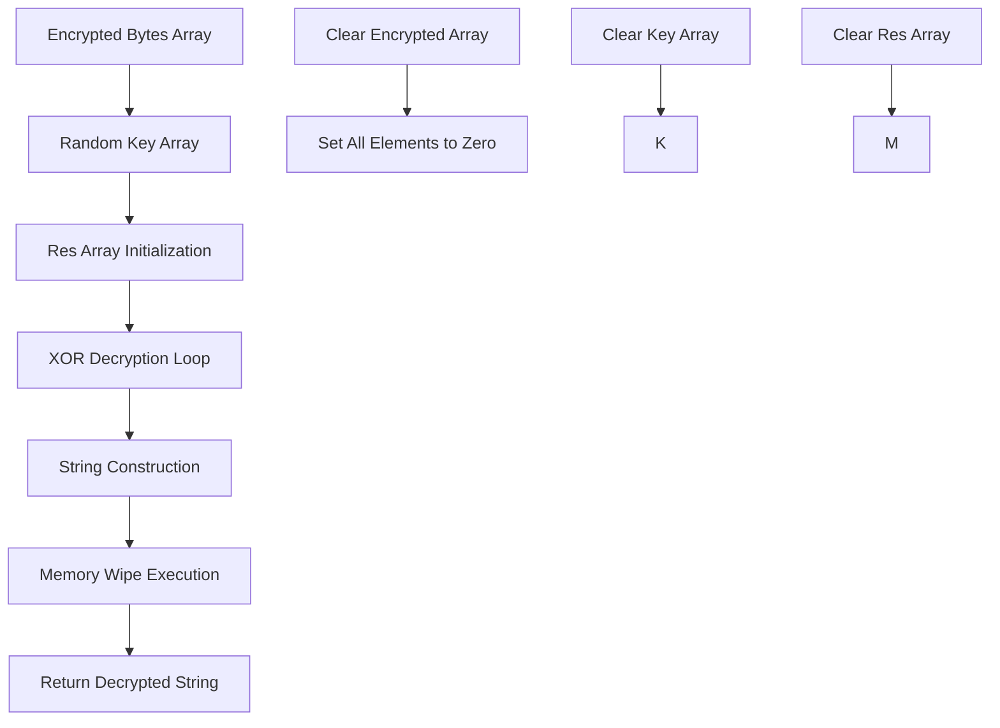
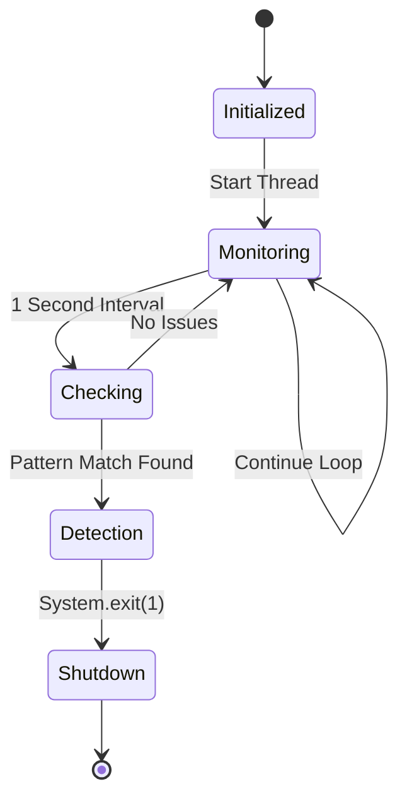
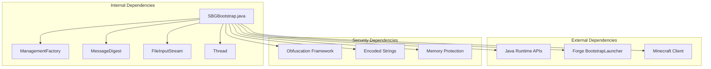

# Debugger Detection System

<cite>
**Referenced Files in This Document**
- [SBGBootstrap.java](file://src-java/com/sbgames/bootstrap/SBGBootstrap.java)
- [generate_bootstrap.js](file://scratch/generate_bootstrap.js)
- [lib.rs](file://src-tauri/src/lib.rs)
</cite>

## Table of Contents
1. [Introduction](#introduction)
2. [Project Structure](#project-structure)
3. [Core Components](#core-components)
4. [Architecture Overview](#architecture-overview)
5. [Detailed Component Analysis](#detailed-component-analysis)
6. [Dependency Analysis](#dependency-analysis)
7. [Performance Considerations](#performance-considerations)
8. [Troubleshooting Guide](#troubleshooting-guide)
9. [Conclusion](#conclusion)

## Introduction

The SBGBootstrap class implements a comprehensive debugger detection system designed to prevent unauthorized debugging and reverse engineering of the SBGames Minecraft launcher. This system employs multiple detection mechanisms including JVM argument monitoring, environment variable scanning, and runtime security monitoring to identify and block debugging attempts.

The detection system is built around a sophisticated obfuscation framework that protects sensitive detection logic from static analysis while maintaining effective signature-based detection of debugging tools and profiling agents.

## Project Structure

The debugger detection system is implemented within the Java bootstrap component of the SBGames launcher, which serves as the primary entry point for the Minecraft client startup process.

**Diagram sources**
- [SBGBootstrap.java:1-372](file://src-java/com/sbgames/bootstrap/SBGBootstrap.java#L1-L372)
- [generate_bootstrap.js:1-266](file://scratch/generate_bootstrap.js#L1-L266)
- [lib.rs:848-874](file://src-tauri/src/lib.rs#L848-L874)

**Section sources**
- [SBGBootstrap.java:1-372](file://src-java/com/sbgames/bootstrap/SBGBootstrap.java#L1-L372)
- [generate_bootstrap.js:1-266](file://scratch/generate_bootstrap.js#L1-L266)
- [lib.rs:848-874](file://src-tauri/src/lib.rs#L848-L874)

## Core Components

The debugger detection system consists of several interconnected components that work together to provide comprehensive protection against debugging attempts.

### Main Security Entry Point

The SBGBootstrap class serves as the primary security checkpoint for the launcher, implementing a multi-layered detection approach:

**Diagram sources**
- [SBGBootstrap.java:8-372](file://src-java/com/sbgames/bootstrap/SBGBootstrap.java#L8-L372)

### Obfuscation Framework

The system employs a sophisticated obfuscation mechanism that generates randomized decryption functions for each target string:

**Diagram sources**
- [generate_bootstrap.js:35-69](file://scratch/generate_bootstrap.js#L35-L69)

**Section sources**
- [SBGBootstrap.java:8-372](file://src-java/com/sbgames/bootstrap/SBGBootstrap.java#L8-L372)
- [generate_bootstrap.js:17-32](file://scratch/generate_bootstrap.js#L17-L32)

## Architecture Overview

The debugger detection system follows a layered architecture that combines static analysis with dynamic runtime monitoring to provide comprehensive protection against debugging attempts.

**Diagram sources**
- [SBGBootstrap.java:207-237](file://src-java/com/sbgames/bootstrap/SBGBootstrap.java#L207-L237)
- [SBGBootstrap.java:239-273](file://src-java/com/sbgames/bootstrap/SBGBootstrap.java#L239-L273)
- [SBGBootstrap.java:275-291](file://src-java/com/sbgames/bootstrap/SBGBootstrap.java#L275-L291)

## Detailed Component Analysis

### JVM Argument Monitoring System

The JVM argument monitoring component performs comprehensive analysis of command-line arguments passed to the Java Virtual Machine to detect debugging and profiling tools.

#### Detection Patterns

The system monitors for specific debugging signatures using case-insensitive pattern matching:

| Pattern Type | Detection Signatures | Purpose |
|--------------|---------------------|---------|
| Agent Libraries | `-agentlib`, `-agentpath` | Detects JDWP and custom debug agents |
| Debugging Flags | `-Xdebug`, `-Xrunjdwp` | Identifies traditional Java debugging |
| Profiling Tools | `-javaagent`, `jdwp` | Catches profiling and monitoring agents |

#### Implementation Details

**Diagram sources**
- [SBGBootstrap.java:240-251](file://src-java/com/sbgames/bootstrap/SBGBootstrap.java#L240-L251)

#### Specific Detection Mechanisms

The detection logic examines each JVM argument for the presence of debugging-related substrings:

1. **Agent Library Detection**: Scans for `-agentlib` and `-agentpath` prefixes
2. **Debug Flag Recognition**: Identifies `-Xdebug` and `-Xrunjdwp` parameters
3. **Profiling Agent Detection**: Looks for `-javaagent` and `jdwp` signatures
4. **Case-Insensitive Matching**: Converts all arguments to lowercase for comparison

**Section sources**
- [SBGBootstrap.java:239-273](file://src-java/com/sbgames/bootstrap/SBGBootstrap.java#L239-L273)

### Environment Variable Scanning Mechanism

The environment variable scanner extends detection capabilities beyond command-line arguments to include environment-based debugging configurations.

#### Environment Variables Monitored

| Variable Name | Purpose | Detection Scope |
|---------------|---------|-----------------|
| `JAVA_TOOL_OPTIONS` | Global JVM options | Comprehensive debugging detection |
| `_JAVA_OPTIONS` | Legacy JVM options | Backward compatibility |
| `JDK_JAVA_OPTIONS` | JDK-specific options | Modern JDK environments |

#### Scanning Logic

**Diagram sources**
- [SBGBootstrap.java:253-272](file://src-java/com/sbgames/bootstrap/SBGBootstrap.java#L253-L272)

**Section sources**
- [SBGBootstrap.java:253-272](file://src-java/com/sbgames/bootstrap/SBGBootstrap.java#L253-L272)

### Encoded String System

The obfuscation framework generates randomized decryption functions for each target string, making static analysis extremely difficult.

#### Encryption Process

Each target string undergoes the following transformation:

1. **Byte Array Generation**: Convert string to UTF-8 byte representation
2. **Random Key Generation**: Create random byte array of same length
3. **XOR Encryption**: Apply XOR operation between bytes and key
4. **Random Function Naming**: Generate randomized method names
5. **Decryption Function Creation**: Build runtime decryption method

#### Memory Protection

The decryption functions implement comprehensive memory wiping to prevent string recovery:

**Diagram sources**
- [generate_bootstrap.js:35-69](file://scratch/generate_bootstrap.js#L35-L69)

**Section sources**
- [generate_bootstrap.js:35-69](file://scratch/generate_bootstrap.js#L35-L69)

### Security Watchdog Daemon

The watchdog daemon provides continuous runtime monitoring of the security system:

**Diagram sources**
- [SBGBootstrap.java:275-291](file://src-java/com/sbgames/bootstrap/SBGBootstrap.java#L275-L291)

**Section sources**
- [SBGBootstrap.java:275-291](file://src-java/com/sbgames/bootstrap/SBGBootstrap.java#L275-L291)

## Dependency Analysis

The debugger detection system has minimal external dependencies, relying primarily on standard Java runtime APIs for its functionality.

**Diagram sources**
- [SBGBootstrap.java:3-6](file://src-java/com/sbgames/bootstrap/SBGBootstrap.java#L3-L6)

### Integration Points

The system integrates with the broader launcher architecture through several key integration points:

1. **Tauri Integration**: The Rust-based Tauri application launches the Java bootstrap component
2. **Forge Integration**: The system delegates to the official Forge BootstrapLauncher
3. **File System Integration**: Validates modpack integrity using SHA-256 hashing
4. **Process Management**: Implements watchdog monitoring through daemon threads

**Section sources**
- [lib.rs:848-874](file://src-tauri/src/lib.rs#L848-L874)

## Performance Considerations

The debugger detection system is designed for minimal performance impact while maintaining robust security coverage.

### Runtime Performance Characteristics

| Operation | Complexity | Impact |
|-----------|------------|--------|
| JVM Argument Collection | O(n) | Minimal overhead |
| Environment Variable Access | O(m) | Negligible impact |
| String Comparison | O(k) per argument | Very low cost |
| Hash Calculation | O(p) per file | Moderate for large files |
| Watchdog Monitoring | O(1) loop | Constant overhead |

### Optimization Strategies

1. **Early Termination**: Detection returns immediately upon finding any suspicious pattern
2. **Case-Insensitive Optimization**: Single conversion to lowercase per argument
3. **Memory Management**: Automatic garbage collection of temporary strings
4. **Daemon Thread Efficiency**: Low-priority monitoring thread with 1-second intervals

## Troubleshooting Guide

### Common Detection Issues

#### False Positives
- **Cause**: Legitimate debugging tools in development environments
- **Solution**: Ensure production builds don't include debugging flags
- **Prevention**: Use build scripts to strip debugging parameters

#### Performance Degradation
- **Cause**: Excessive file verification operations
- **Solution**: Optimize hash calculation frequency
- **Monitoring**: Use watchdog thread to track system performance

#### Environment Variable Conflicts
- **Cause**: Third-party environment configurations
- **Solution**: Review and modify environment variable settings
- **Diagnostic**: Check JAVA_TOOL_OPTIONS, _JAVA_OPTIONS, JDK_JAVA_OPTIONS

### Debugging the Detection System

#### Verification Steps
1. **Check JVM Arguments**: Verify no debugging flags are present
2. **Inspect Environment**: Confirm environment variables are clean
3. **Monitor Watchdog**: Ensure daemon thread is running
4. **Validate Integrity**: Check modpack hash verification

#### Log Analysis
- **Startup Logs**: Monitor SBGBootstrap initialization
- **Watchdog Logs**: Track periodic detection checks
- **Error Messages**: Look for exit code 1 indicating detection failure

**Section sources**
- [SBGBootstrap.java:216-237](file://src-java/com/sbgames/bootstrap/SBGBootstrap.java#L216-L237)

## Conclusion

The SBGBootstrap debugger detection system represents a sophisticated approach to protecting Minecraft launchers from unauthorized debugging and reverse engineering attempts. Through its multi-layered detection approach, comprehensive obfuscation framework, and continuous monitoring capabilities, it provides robust protection against both casual and determined attackers.

### Key Strengths

1. **Multi-Faceted Detection**: Combines JVM argument monitoring, environment scanning, and runtime watching
2. **Advanced Obfuscation**: Uses randomized encryption and memory protection techniques
3. **Minimal Performance Impact**: Optimized for production deployment scenarios
4. **Comprehensive Coverage**: Addresses various debugging and profiling tool categories

### Limitations and Countermeasures

While the system provides strong protection, sophisticated attackers may employ several bypass techniques:

1. **Obfuscation Evasion**: Advanced static analysis tools may still uncover patterns
2. **Timing Attacks**: Careful timing of debugging sessions to avoid detection
3. **Environment Manipulation**: Sophisticated environment variable masking
4. **Code Injection**: Advanced injection techniques targeting the watchdog thread

### Recommendations

For enhanced security, consider implementing additional protective measures such as:

- Regular updates to detection signatures
- Integration with anti-debugging libraries
- Enhanced memory protection mechanisms
- Additional runtime integrity checks
- Network-based detection systems

The current implementation provides a solid foundation for launcher security while maintaining compatibility with legitimate development and testing workflows.