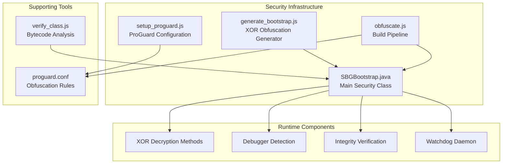
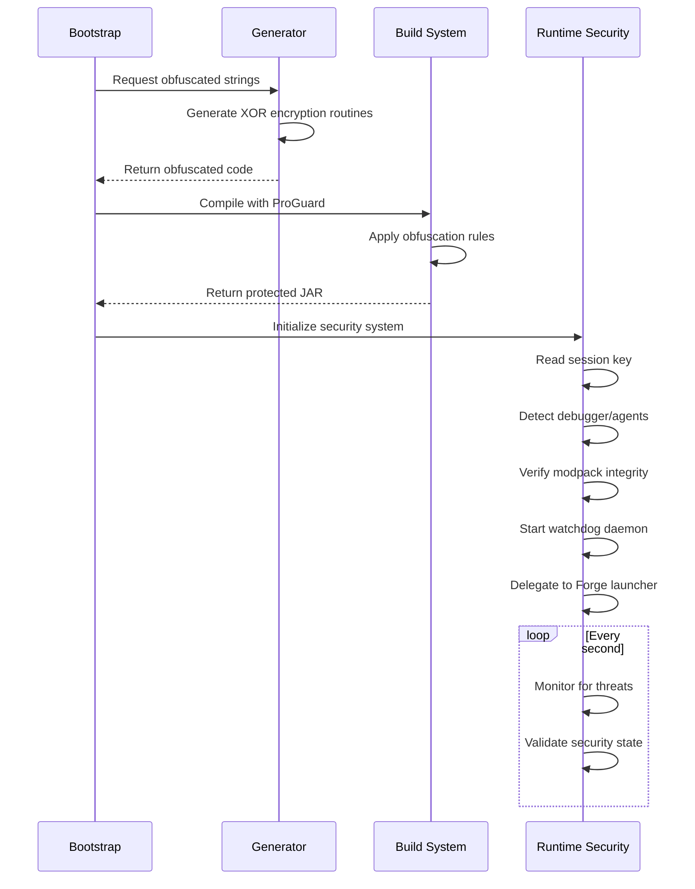
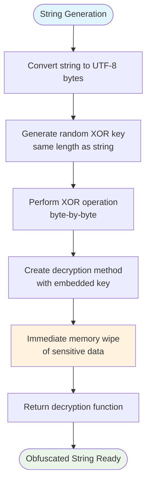
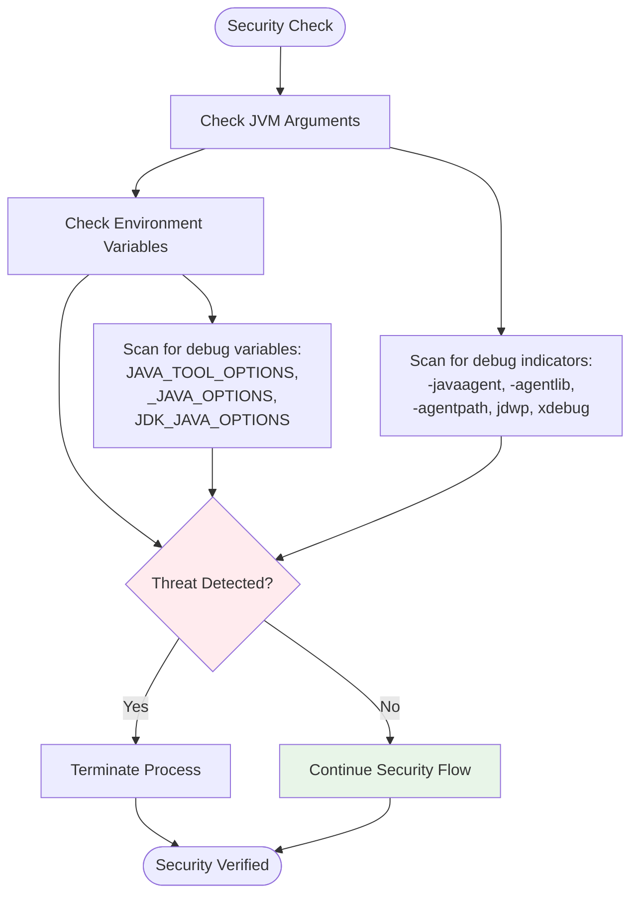
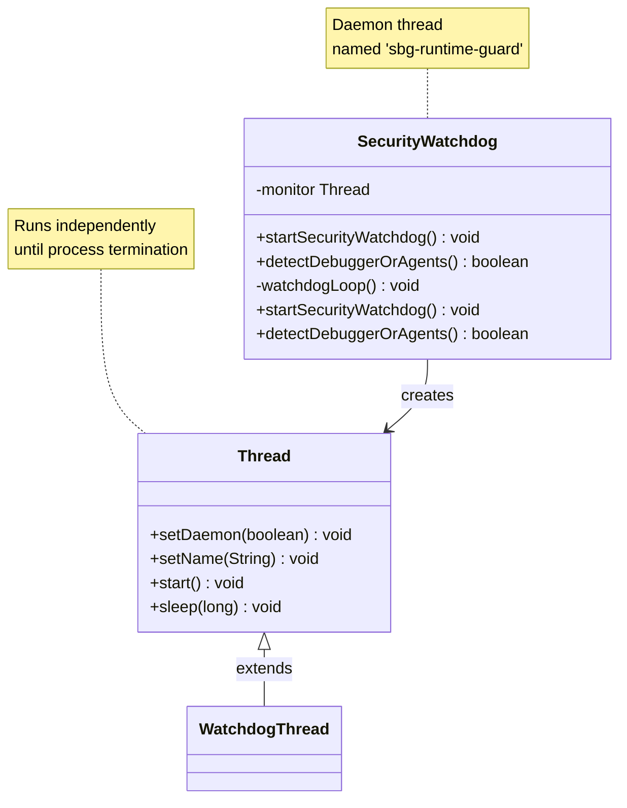
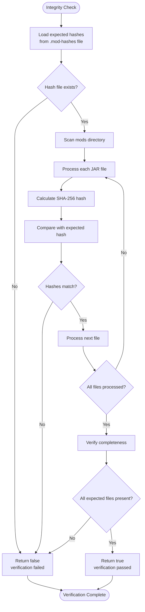
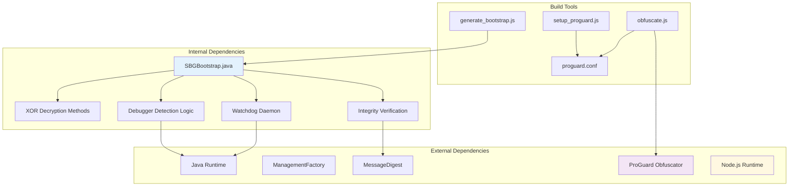

# Java Bootstrap Security Implementation

<cite>
**Referenced Files in This Document**
- [SBGBootstrap.java](file://src-java/com/sbgames/bootstrap/SBGBootstrap.java)
- [generate_bootstrap.js](file://scratch/generate_bootstrap.js)
- [obfuscate.js](file://scratch/obfuscate.js)
- [setup_proguard.js](file://scratch/setup_proguard.js)
- [proguard.conf](file://scratch/proguard.conf)
- [verify_class.js](file://scratch/verify_class.js)
</cite>

## Table of Contents
1. [Introduction](#introduction)
2. [Project Structure](#project-structure)
3. [Core Components](#core-components)
4. [Architecture Overview](#architecture-overview)
5. [Detailed Component Analysis](#detailed-component-analysis)
6. [Dependency Analysis](#dependency-analysis)
7. [Performance Considerations](#performance-considerations)
8. [Troubleshooting Guide](#troubleshooting-guide)
9. [Conclusion](#conclusion)

## Introduction
This document provides comprehensive documentation for the Java bootstrap security system implemented in the SBGames project. The system employs a multi-layered security approach designed to protect the game's launch process from tampering, debugging, and unauthorized modification. The security measures include:

- XOR-based string obfuscation for critical identifiers
- Runtime debugger and agent detection
- Environment variable scanning for debugging indicators
- Modpack integrity verification using SHA-256 hashes
- Active security watchdog daemon monitoring

The implementation demonstrates a practical approach to securing Java applications by combining runtime checks, cryptographic verification, and defensive obfuscation techniques.

## Project Structure
The security implementation spans several key components within the project:

**Diagram sources**
- [SBGBootstrap.java:1-372](file://src-java/com/sbgames/bootstrap/SBGBootstrap.java#L1-L372)
- [generate_bootstrap.js:1-266](file://scratch/generate_bootstrap.js#L1-L266)
- [setup_proguard.js:1-77](file://scratch/setup_proguard.js#L1-L77)

**Section sources**
- [SBGBootstrap.java:1-372](file://src-java/com/sbgames/bootstrap/SBGBootstrap.java#L1-L372)
- [generate_bootstrap.js:1-266](file://scratch/generate_bootstrap.js#L1-L266)

## Core Components
The security system consists of four primary components working in concert to provide comprehensive protection:

### XOR-Based String Obfuscation
The system generates randomized XOR decryption methods for all critical strings at build time. Each obfuscated string is accompanied by a unique decryption routine that performs in-memory XOR operations and immediately wipes sensitive data from memory.

### Debugger and Agent Detection
Runtime monitoring of JVM arguments and environment variables for debugging indicators including JDWP, Java agents, and debug-related configurations.

### Modpack Integrity Verification
Cryptographic verification of mod files using SHA-256 hashing to prevent tampering and ensure authenticity.

### Active Watchdog Daemon
Continuous monitoring thread that periodically validates the security posture and terminates the process if threats are detected.

**Section sources**
- [SBGBootstrap.java:12-190](file://src-java/com/sbgames/bootstrap/SBGBootstrap.java#L12-L190)
- [SBGBootstrap.java:239-291](file://src-java/com/sbgames/bootstrap/SBGBootstrap.java#L239-L291)

## Architecture Overview
The security system follows a layered defense approach with initialization, validation, and continuous monitoring phases:

**Diagram sources**
- [generate_bootstrap.js:71-266](file://scratch/generate_bootstrap.js#L71-L266)
- [SBGBootstrap.java:207-237](file://src-java/com/sbgames/bootstrap/SBGBootstrap.java#L207-L237)

## Detailed Component Analysis

### XOR Encoding Mechanism
The obfuscation system generates unique decryption methods for each target string:

**Diagram sources**
- [generate_bootstrap.js:35-69](file://scratch/generate_bootstrap.js#L35-L69)

Each decryption method follows a consistent pattern:
- Creates byte arrays for the encrypted string and XOR key
- Performs XOR operation to reconstruct the original string
- Immediately wipes all sensitive data from memory
- Returns the decrypted string for runtime use

**Section sources**
- [generate_bootstrap.js:35-69](file://scratch/generate_bootstrap.js#L35-L69)
- [SBGBootstrap.java:12-24](file://src-java/com/sbgames/bootstrap/SBGBootstrap.java#L12-L24)

### Multi-Layered Security Detection
The system implements comprehensive threat detection across multiple vectors:

**Diagram sources**
- [SBGBootstrap.java:239-273](file://src-java/com/sbgames/bootstrap/SBGBootstrap.java#L239-L273)
- [generate_bootstrap.js:125-159](file://scratch/generate_bootstrap.js#L125-L159)

The detection logic examines:
- JVM input arguments for debugging agent indicators
- Environment variables for debug-related configurations
- Immediate termination upon threat detection

**Section sources**
- [SBGBootstrap.java:239-273](file://src-java/com/sbgames/bootstrap/SBGBootstrap.java#L239-L273)
- [generate_bootstrap.js:125-159](file://scratch/generate_bootstrap.js#L125-L159)

### Security Watchdog Implementation
The watchdog daemon provides continuous monitoring with daemon thread characteristics:

**Diagram sources**
- [SBGBootstrap.java:275-291](file://src-java/com/sbgames/bootstrap/SBGBootstrap.java#L275-L291)
- [generate_bootstrap.js:161-177](file://scratch/generate_bootstrap.js#L161-L177)

The watchdog features:
- Daemon thread execution (no impact on JVM shutdown)
- 1-second polling interval for efficient monitoring
- Named thread "sbg-runtime-guard" for easy identification
- Automatic process termination upon threat detection

**Section sources**
- [SBGBootstrap.java:275-291](file://src-java/com/sbgames/bootstrap/SBGBootstrap.java#L275-L291)
- [generate_bootstrap.js:161-177](file://scratch/generate_bootstrap.js#L161-L177)

### Modpack Integrity Verification
The system implements cryptographic verification of mod files:

**Diagram sources**
- [SBGBootstrap.java:293-353](file://src-java/com/sbgames/bootstrap/SBGBootstrap.java#L293-L353)
- [generate_bootstrap.js:179-239](file://scratch/generate_bootstrap.js#L179-L239)

The verification process ensures:
- All expected mod files are present
- Each file maintains its cryptographic hash
- No unexpected modifications to the modpack

**Section sources**
- [SBGBootstrap.java:293-353](file://src-java/com/sbgames/bootstrap/SBGBootstrap.java#L293-L353)
- [generate_bootstrap.js:179-239](file://scratch/generate_bootstrap.js#L179-L239)

## Dependency Analysis
The security system relies on several key dependencies and external tools:

**Diagram sources**
- [SBGBootstrap.java:1-372](file://src-java/com/sbgames/bootstrap/SBGBootstrap.java#L1-L372)
- [generate_bootstrap.js:1-266](file://scratch/generate_bootstrap.js#L1-L266)
- [setup_proguard.js:1-77](file://scratch/setup_proguard.js#L1-L77)

**Section sources**
- [SBGBootstrap.java:1-372](file://src-java/com/sbgames/bootstrap/SBGBootstrap.java#L1-L372)
- [generate_bootstrap.js:1-266](file://scratch/generate_bootstrap.js#L1-L266)

## Performance Considerations
The security implementation balances effectiveness with performance impact:

### Runtime Performance Impact
- **XOR Decryption**: Minimal overhead during single execution
- **Debugger Detection**: Low-cost JVM argument and environment scanning
- **Integrity Verification**: Linear-time file system operations proportional to mod count
- **Watchdog Monitoring**: 1-second intervals minimize CPU usage

### Memory Management
- All sensitive data is immediately wiped from memory after use
- No persistent storage of decrypted strings
- Efficient garbage collection of temporary objects

### Scalability Factors
- Modpack verification scales linearly with file count
- Watchdog monitoring remains constant regardless of modpack size
- XOR operations are O(n) where n equals string length

## Troubleshooting Guide

### Common Security Issues
1. **False Positive Debugger Detection**
   - Verify JVM arguments don't contain debugging indicators
   - Check environment variables for debug configurations
   - Review process startup parameters

2. **Integrity Verification Failures**
   - Confirm .mod-hashes file exists and is readable
   - Verify all mod files are present in mods directory
   - Check file permissions and accessibility

3. **Watchdog Daemon Problems**
   - Ensure sufficient privileges for thread creation
   - Verify daemon thread execution isn't blocked
   - Check for thread interruption exceptions

### Debugging Security Components
The system provides several diagnostic approaches:
- Monitor watchdog thread named "sbg-runtime-guard"
- Examine XOR decryption method names for obfuscation verification
- Verify SHA-256 hash calculations for integrity checks
- Trace JVM argument and environment variable processing

**Section sources**
- [SBGBootstrap.java:275-291](file://src-java/com/sbgames/bootstrap/SBGBootstrap.java#L275-L291)
- [verify_class.js:1-37](file://scratch/verify_class.js#L1-L37)

## Conclusion
The Java bootstrap security system demonstrates a comprehensive approach to protecting game launch processes through multiple defensive layers. The implementation successfully combines:

- **Effective Obfuscation**: Build-time XOR encoding prevents static analysis
- **Runtime Detection**: Comprehensive monitoring of debugging attempts
- **Cryptographic Verification**: SHA-256 integrity checking for mod files
- **Continuous Monitoring**: Daemon-based watchdog for ongoing security

While the system provides robust protection against casual tampering and debugging, it's important to recognize that sophisticated attackers with adequate resources can potentially bypass these protections. The security measures serve as a strong deterrent and provide reasonable protection for typical use cases while maintaining system performance and reliability.

The modular design allows for easy maintenance and updates to security measures as new threats emerge. Regular review and updating of the obfuscation patterns, detection signatures, and verification mechanisms will help maintain the system's effectiveness over time.