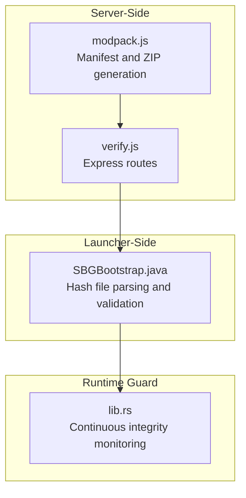
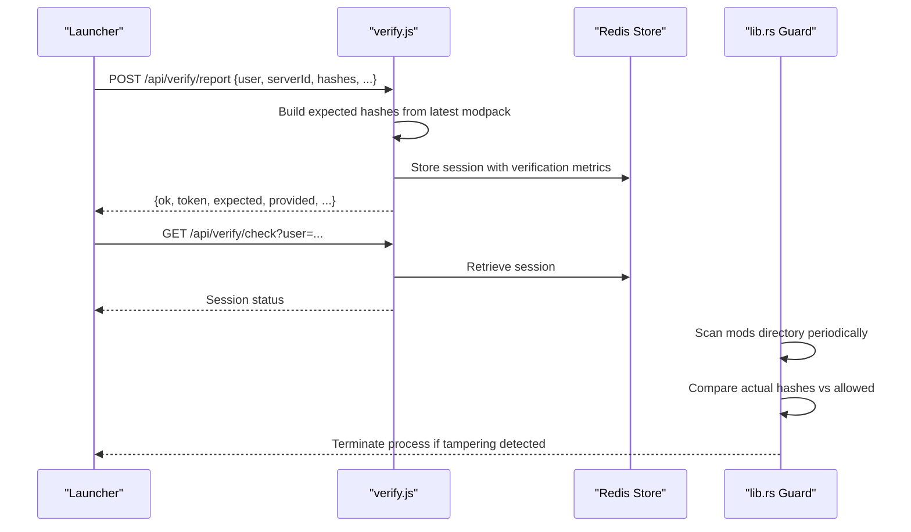
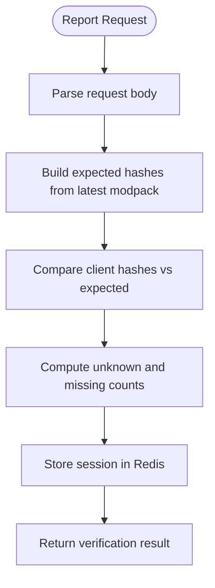
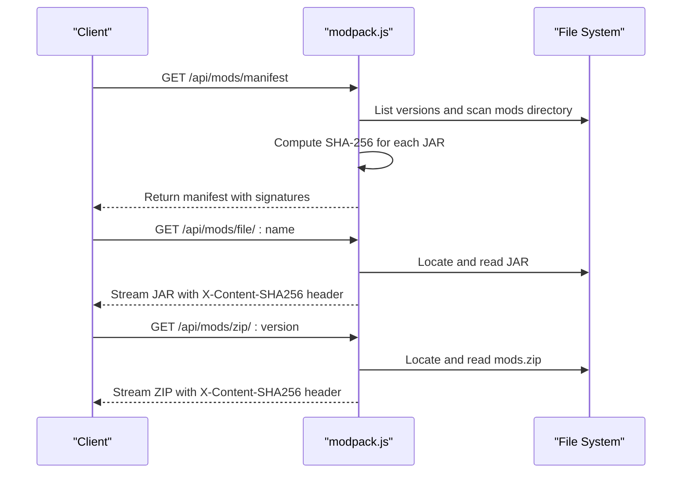
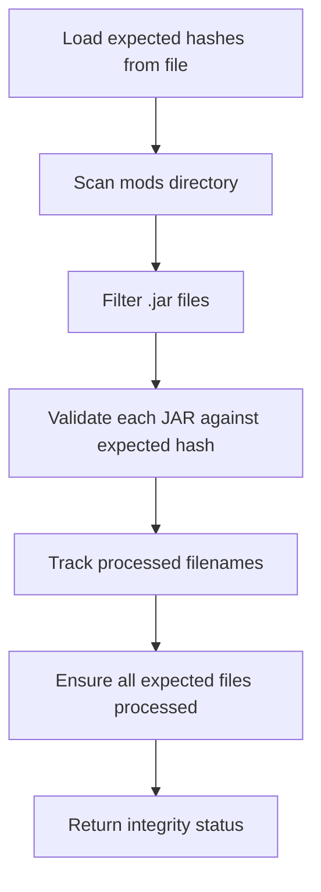
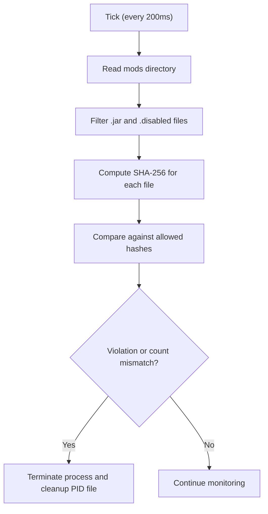
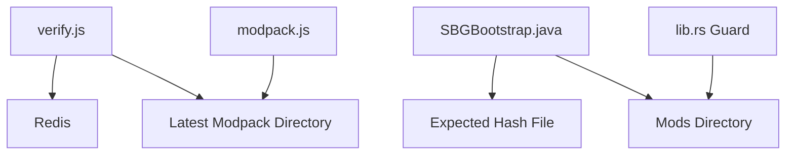

# Modpack Integrity Verification

<cite>
**Referenced Files in This Document**
- [verify.js](file://server-files/verify.js)
- [modpack.js](file://server-files/modpack.js)
- [SBGBootstrap.java](file://src-java/com/sbgames/bootstrap/SBGBootstrap.java)
- [lib.rs](file://src-tauri/src/lib.rs)
</cite>

## Table of Contents
1. [Introduction](#introduction)
2. [Project Structure](#project-structure)
3. [Core Components](#core-components)
4. [Architecture Overview](#architecture-overview)
5. [Detailed Component Analysis](#detailed-component-analysis)
6. [Dependency Analysis](#dependency-analysis)
7. [Performance Considerations](#performance-considerations)
8. [Troubleshooting Guide](#troubleshooting-guide)
9. [Conclusion](#conclusion)

## Introduction
This document describes the modpack integrity verification system used to ensure that all mod files in a Minecraft modpack remain unmodified and authentic. The system employs SHA-256 cryptographic hashing to validate each mod against expected checksums, preventing tampering and unauthorized modifications to the game environment. The verification process operates across multiple layers: a server-side API that maintains expected hashes, a launcher-side bootstrap that validates local files, and a continuous monitoring guard that detects runtime tampering.

## Project Structure
The integrity verification spans three primary areas:
- Server-side API endpoints for reporting and checking modpack integrity
- Launcher-side bootstrap that parses expected hashes and validates local JAR files
- Runtime guard that continuously monitors the mods directory for tampering

**Diagram sources**
- [verify.js:16-139](file://server-files/verify.js#L16-L139)
- [modpack.js:14-153](file://server-files/modpack.js#L14-L153)
- [SBGBootstrap.java:293-371](file://src-java/com/sbgames/bootstrap/SBGBootstrap.java#L293-L371)
- [lib.rs:1137-1157](file://src-tauri/src/lib.rs#L1137-L1157)

**Section sources**
- [verify.js:16-139](file://server-files/verify.js#L16-L139)
- [modpack.js:14-153](file://server-files/modpack.js#L14-L153)
- [SBGBootstrap.java:293-371](file://src-java/com/sbgames/bootstrap/SBGBootstrap.java#L293-L371)
- [lib.rs:1137-1157](file://src-tauri/src/lib.rs#L1137-L1157)

## Core Components
This section outlines the primary components responsible for integrity verification.

- Server-side verification API
  - Maintains expected SHA-256 hashes for all mods in the latest modpack version
  - Provides endpoints to report client-provided hashes and check session status
  - Stores verification results in Redis for downstream systems

- Modpack manifest and ZIP generation
  - Scans the latest modpack directory and computes SHA-256 for each JAR file
  - Supports serving individual mod files and the complete mods ZIP with integrity headers

- Launcher-side bootstrap validation
  - Reads an expected hash file mapping filenames to SHA-256 hashes
  - Traverses the mods directory, validating each JAR against expected hashes
  - Ensures all expected files are present and no unexpected files exist

- Runtime guard monitoring
  - Periodically scans the mods directory for integrity violations
  - Compares actual hashes against allowed sets and enforces expected counts

**Section sources**
- [verify.js:36-55](file://server-files/verify.js#L36-L55)
- [verify.js:59-113](file://server-files/verify.js#L59-L113)
- [modpack.js:26-81](file://server-files/modpack.js#L26-L81)
- [modpack.js:85-152](file://server-files/modpack.js#L85-L152)
- [SBGBootstrap.java:293-371](file://src-java/com/sbgames/bootstrap/SBGBootstrap.java#L293-L371)
- [lib.rs:1137-1157](file://src-tauri/src/lib.rs#L1137-L1157)

## Architecture Overview
The integrity verification system follows a layered approach:
- Manifest generation builds a trusted baseline of expected hashes
- The launcher reports client-side hashes and receives a verification result
- A runtime guard continuously monitors for tampering

**Diagram sources**
- [verify.js:59-113](file://server-files/verify.js#L59-L113)
- [verify.js:115-124](file://server-files/verify.js#L115-L124)
- [lib.rs:1137-1157](file://src-tauri/src/lib.rs#L1137-L1157)

## Detailed Component Analysis

### Server-Side Verification API
The verification API manages integrity checks by:
- Building expected hashes from the latest modpack directory
- Comparing client-provided hashes against expected ones
- Recording unknown and missing mods to maintain audit trails
- Storing verification sessions in Redis for external systems

Key behaviors:
- Expected hash computation scans the latest modpack version and computes SHA-256 for each JAR file
- Reporting endpoint validates incoming hashes and updates Redis with session data
- Checking endpoint retrieves stored session data for external systems
- Banlist endpoint exposes users flagged for integrity violations

**Diagram sources**
- [verify.js:59-113](file://server-files/verify.js#L59-L113)

**Section sources**
- [verify.js:36-55](file://server-files/verify.js#L36-L55)
- [verify.js:59-113](file://server-files/verify.js#L59-L113)
- [verify.js:115-124](file://server-files/verify.js#L115-L124)
- [verify.js:131-136](file://server-files/verify.js#L131-L136)

### Modpack Manifest and ZIP Generation
The modpack service:
- Scans the configured modpack directory for the latest version
- Computes SHA-256 for each JAR file and constructs a manifest
- Serves individual mod files and the complete mods ZIP with integrity headers
- Supports signature verification for manifests

**Diagram sources**
- [modpack.js:26-81](file://server-files/modpack.js#L26-L81)
- [modpack.js:85-152](file://server-files/modpack.js#L85-L152)

**Section sources**
- [modpack.js:26-81](file://server-files/modpack.js#L26-L81)
- [modpack.js:85-152](file://server-files/modpack.js#L85-L152)

### Launcher-Side Bootstrap Validation
The launcher-side validation:
- Parses an expected hash file mapping filename to SHA-256
- Traverses the mods directory, validating each JAR against expected hashes
- Ensures all expected files are present and no unexpected files exist
- Uses streaming SHA-256 computation for efficient validation

**Diagram sources**
- [SBGBootstrap.java:293-371](file://src-java/com/sbgames/bootstrap/SBGBootstrap.java#L293-L371)

**Section sources**
- [SBGBootstrap.java:293-371](file://src-java/com/sbgames/bootstrap/SBGBootstrap.java#L293-L371)

### Runtime Guard Monitoring
The runtime guard:
- Periodically scans the mods directory for integrity violations
- Compares actual hashes against allowed sets and enforces expected counts
- Terminates the process if tampering is detected

**Diagram sources**
- [lib.rs:1137-1157](file://src-tauri/src/lib.rs#L1137-L1157)

**Section sources**
- [lib.rs:1137-1157](file://src-tauri/src/lib.rs#L1137-L1157)

## Dependency Analysis
The integrity verification system exhibits clear separation of concerns:
- Server-side API depends on Redis for session storage and the modpack directory for expected hashes
- Modpack service depends on filesystem scanning and cryptographic hashing
- Launcher-side validation depends on the expected hash file and filesystem access
- Runtime guard depends on periodic polling and filesystem access

**Diagram sources**
- [verify.js:28-33](file://server-files/verify.js#L28-L33)
- [modpack.js:22-23](file://server-files/modpack.js#L22-L23)
- [SBGBootstrap.java:295-318](file://src-java/com/sbgames/bootstrap/SBGBootstrap.java#L295-L318)
- [lib.rs:1137-1157](file://src-tauri/src/lib.rs#L1137-L1157)

**Section sources**
- [verify.js:28-33](file://server-files/verify.js#L28-L33)
- [modpack.js:22-23](file://server-files/modpack.js#L22-L23)
- [SBGBootstrap.java:295-318](file://src-java/com/sbgames/bootstrap/SBGBootstrap.java#L295-L318)
- [lib.rs:1137-1157](file://src-tauri/src/lib.rs#L1137-L1157)

## Performance Considerations
- Streaming SHA-256 computation reduces memory overhead when hashing large JAR files
- Periodic scanning intervals balance detection latency with CPU usage
- Redis caching minimizes repeated filesystem scans for verification sessions
- Efficient filtering ensures only relevant files are processed

## Troubleshooting Guide
Common issues and resolutions:
- Missing expected hash file: Ensure the hash file exists and is readable by the launcher
- Directory permissions: Verify the launcher has read access to the mods directory
- Hash mismatches: Confirm the expected hash file corresponds to the correct modpack version
- Redis connectivity: Ensure Redis is reachable and credentials are configured correctly
- Tamper detection: Investigate runtime guard logs for specific file violations

**Section sources**
- [verify.js:28-33](file://server-files/verify.js#L28-L33)
- [SBGBootstrap.java:293-371](file://src-java/com/sbgames/bootstrap/SBGBootstrap.java#L293-L371)
- [lib.rs:1137-1157](file://src-tauri/src/lib.rs#L1137-L1157)

## Conclusion
The modpack integrity verification system provides robust protection against tampered mod files and unauthorized modifications. By combining server-side expected hash management, launcher-side validation, and runtime monitoring, it creates a comprehensive defense mechanism that maintains the integrity of the game environment. The use of SHA-256 hashing, combined with continuous monitoring and Redis-backed session storage, ensures both authenticity and availability of the modpack ecosystem.