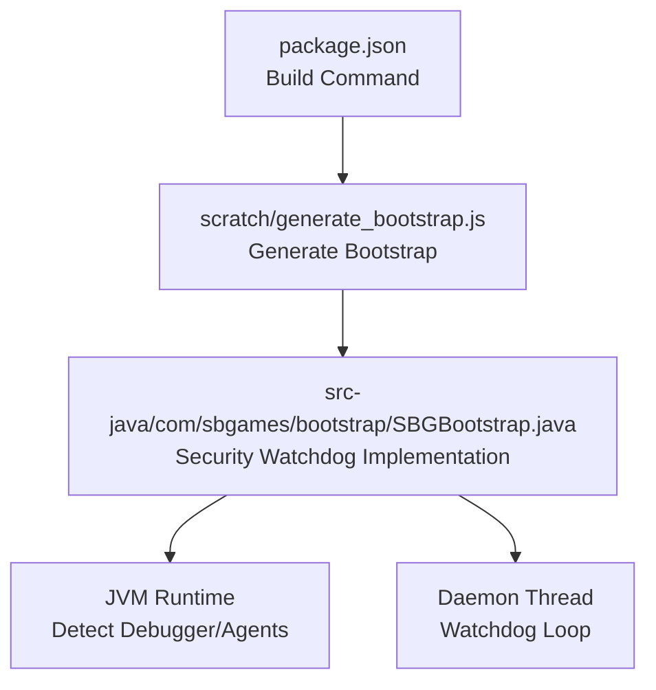
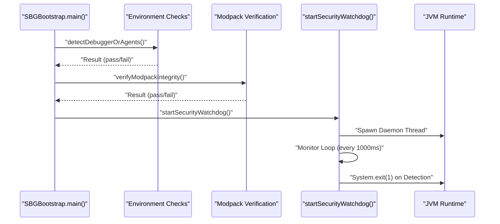
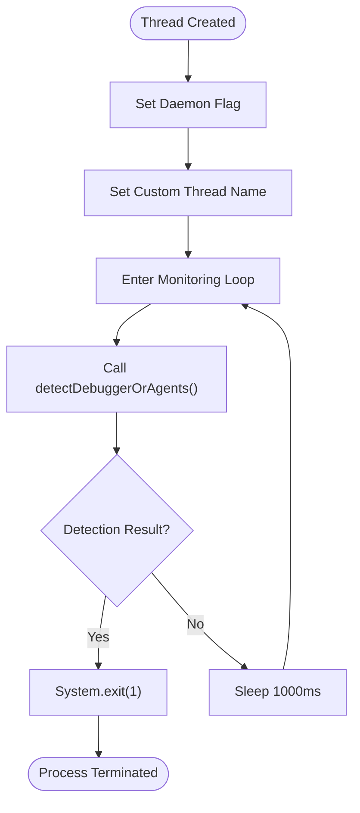
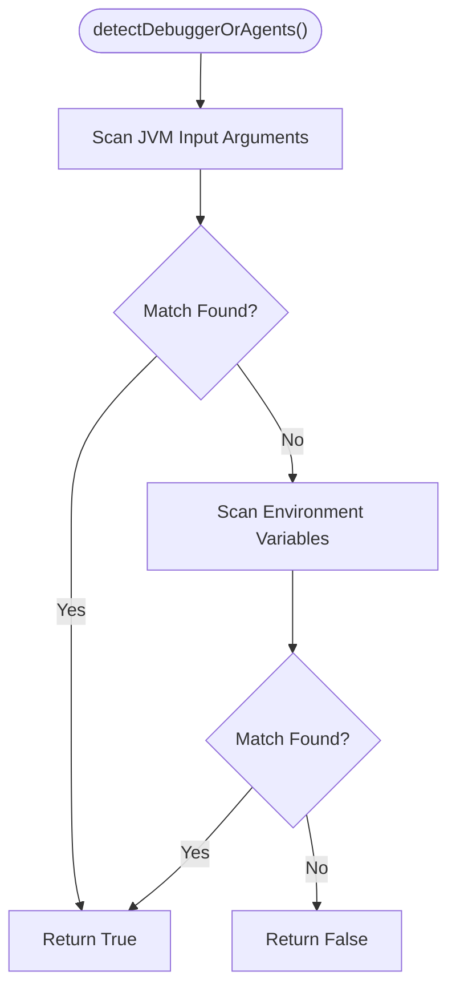
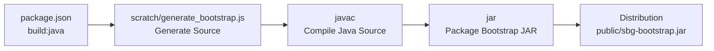
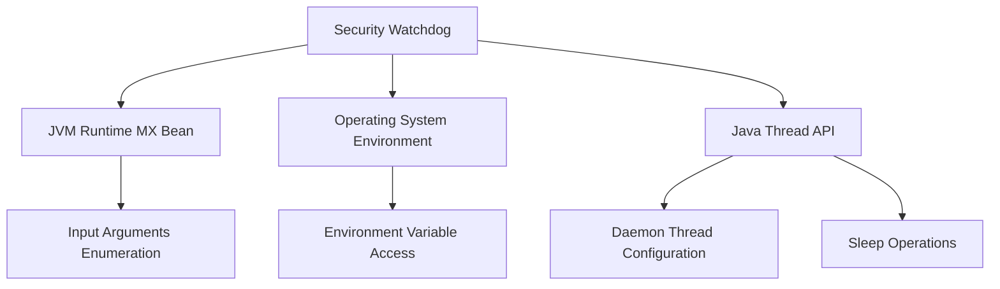

# Security Watchdog Implementation

<cite>
**Referenced Files in This Document**
- [SBGBootstrap.java](file://src-java/com/sbgames/bootstrap/SBGBootstrap.java)
- [generate_bootstrap.js](file://scratch/generate_bootstrap.js)
- [package.json](file://package.json)
</cite>

## Table of Contents
1. [Introduction](#introduction)
2. [Project Structure](#project-structure)
3. [Core Components](#core-components)
4. [Architecture Overview](#architecture-overview)
5. [Detailed Component Analysis](#detailed-component-analysis)
6. [Dependency Analysis](#dependency-analysis)
7. [Performance Considerations](#performance-considerations)
8. [Troubleshooting Guide](#troubleshooting-guide)
9. [Conclusion](#conclusion)

## Introduction
This document provides comprehensive technical documentation for the security watchdog daemon implementation used in the SBGames project. It explains how the `startSecurityWatchdog()` method initializes a background monitoring thread that continuously checks for debugging attempts and agent injection during application runtime. The watchdog operates as a daemon thread with a custom thread name derived from encoded strings, performs periodic checks every second, and terminates the process immediately upon detecting suspicious activity. This mechanism is part of a layered security architecture designed to maintain runtime protection throughout the application lifecycle.

## Project Structure
The security watchdog resides within the Java bootstrap module and is integrated into the build pipeline via a generation script. The relevant components are organized as follows:
- Java bootstrap implementation: [SBGBootstrap.java](file://src-java/com/sbgames/bootstrap/SBGBootstrap.java)
- Build-time generation script: [generate_bootstrap.js](file://scratch/generate_bootstrap.js)
- Build command integration: [package.json](file://package.json)

**Diagram sources**
- [package.json:7](file://package.json#L7)
- [generate_bootstrap.js](file://scratch/generate_bootstrap.js)
- [SBGBootstrap.java](file://src-java/com/sbgames/bootstrap/SBGBootstrap.java)

**Section sources**
- [package.json:7](file://package.json#L7)
- [generate_bootstrap.js](file://scratch/generate_bootstrap.js)
- [SBGBootstrap.java](file://src-java/com/sbgames/bootstrap/SBGBootstrap.java)

## Core Components
The security watchdog implementation consists of two primary components:
- Detection routine: Scans JVM input arguments and environment variables for debugger or agent indicators.
- Daemon thread: Runs a continuous monitoring loop that invokes the detection routine every second and exits the process upon detection.

Key characteristics:
- Daemon thread nature: Ensures the watchdog does not prevent JVM shutdown.
- Custom thread naming: Uses an encoded string for the thread name to obscure its purpose.
- Periodic monitoring: Executes detection checks every 1000 milliseconds.
- Immediate termination: Exits the process with failure status when suspicious activity is detected.

**Section sources**
- [SBGBootstrap.java:125-177](file://src-java/com/sbgames/bootstrap/SBGBootstrap.java#L125-L177)

## Architecture Overview
The security watchdog integrates into the application lifecycle as follows:
- Initialization: The bootstrap reads a session key from standard input, validates it, and performs environment checks.
- Integrity verification: Modpack integrity is verified before launching the game.
- Watchdog activation: The security watchdog daemon is started after successful preconditions.
- Delegation: Control is delegated to the Forge bootstrap launcher.

**Diagram sources**
- [SBGBootstrap.java:93-123](file://src-java/com/sbgames/bootstrap/SBGBootstrap.java#L93-L123)
- [SBGBootstrap.java:161-177](file://src-java/com/sbgames/bootstrap/SBGBootstrap.java#L161-L177)

## Detailed Component Analysis

### Security Watchdog Thread Lifecycle
The watchdog thread is created and configured within the `startSecurityWatchdog()` method:
- Thread creation: A new thread is instantiated with a lambda target containing the monitoring loop.
- Daemon configuration: The thread is marked as a daemon to avoid blocking JVM termination.
- Naming: The thread is assigned a custom name derived from an encoded string.
- Startup: The thread is started and begins monitoring immediately.

Monitoring loop behavior:
- Continuous execution: The loop runs indefinitely until the process terminates.
- Detection invocation: On each iteration, the `detectDebuggerOrAgents()` method is called.
- Conditional exit: If detection returns true, the process exits with failure status.
- Timing control: The thread sleeps for 1000 milliseconds between iterations.
- Exception safety: Any exceptions thrown during the loop cause immediate process termination.

**Diagram sources**
- [SBGBootstrap.java:161-177](file://src-java/com/sbgames/bootstrap/SBGBootstrap.java#L161-L177)

**Section sources**
- [SBGBootstrap.java:161-177](file://src-java/com/sbgames/bootstrap/SBGBootstrap.java#L161-L177)

### Detection Mechanism
The `detectDebuggerOrAgents()` method performs two-tier detection:
- JVM input arguments scan: Iterates through JVM input arguments and checks for debugger or agent-related substrings.
- Environment variable scan: Reads specific environment variables and scans for the same substrings.
- Case-insensitive comparison: All comparisons are performed in lowercase to increase reliability.
- Early return: Returns true upon first match; otherwise returns false after scanning all inputs.

**Diagram sources**
- [SBGBootstrap.java:125-159](file://src-java/com/sbgames/bootstrap/SBGBootstrap.java#L125-L159)

**Section sources**
- [SBGBootstrap.java:125-159](file://src-java/com/sbgames/bootstrap/SBGBootstrap.java#L125-L159)

### Integration with Build Pipeline
The watchdog implementation is generated and compiled as part of the build process:
- Build command: The `build:java` script orchestrates generation, compilation, packaging, and obfuscation.
- Generation step: The generation script produces the final bootstrap class with embedded configurations.
- Compilation: The Java compiler compiles the generated class into a JAR artifact.
- Packaging: The compiled class files are packaged into a bootstrap JAR for distribution.

**Diagram sources**
- [package.json:7](file://package.json#L7)
- [generate_bootstrap.js](file://scratch/generate_bootstrap.js)

**Section sources**
- [package.json:7](file://package.json#L7)
- [generate_bootstrap.js](file://scratch/generate_bootstrap.js)

## Dependency Analysis
The security watchdog depends on the following runtime elements:
- JVM runtime: Uses runtime MX bean to enumerate input arguments.
- Operating system environment: Reads environment variables for debugger indicators.
- Thread management: Leverages Java threading primitives for daemon thread creation and sleep scheduling.

**Diagram sources**
- [SBGBootstrap.java:125-177](file://src-java/com/sbgames/bootstrap/SBGBootstrap.java#L125-L177)

**Section sources**
- [SBGBootstrap.java:125-177](file://src-java/com/sbgames/bootstrap/SBGBootstrap.java#L125-L177)

## Performance Considerations
- Monitoring interval: The 1000-millisecond sleep ensures minimal CPU overhead while maintaining responsive detection.
- Detection cost: Argument and environment scanning operations are lightweight and executed infrequently.
- Memory footprint: The watchdog thread is a minimal background thread with negligible memory usage.
- Impact on startup: Detection occurs before watchdog activation, minimizing impact on runtime performance.

## Troubleshooting Guide
Common scenarios and resolutions:
- Process termination without clear logs: Verify that the watchdog was started successfully and that detection thresholds are appropriate for the environment.
- False positives: Review JVM input arguments and environment variables for legitimate presence of debugger-related substrings.
- Thread visibility: Confirm that the daemon thread is visible in thread dumps under the configured custom name.
- Build integration issues: Ensure the generation script completes successfully and the resulting JAR contains the expected bootstrap class.

**Section sources**
- [SBGBootstrap.java:161-177](file://src-java/com/sbgames/bootstrap/SBGBootstrap.java#L161-L177)

## Conclusion
The security watchdog daemon provides a robust runtime protection mechanism by continuously monitoring for debugging attempts and agent injection. Its daemon thread nature, periodic monitoring cadence, and immediate termination strategy ensure effective defense against tampering while maintaining minimal performance impact. Integrated into the build pipeline, the watchdog is deployed as part of the bootstrap JAR, forming a critical component of the application's security architecture throughout its lifecycle.