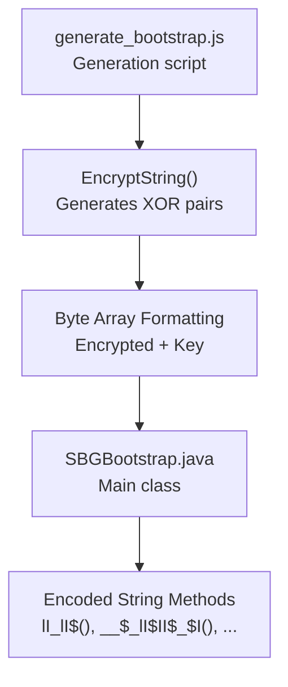
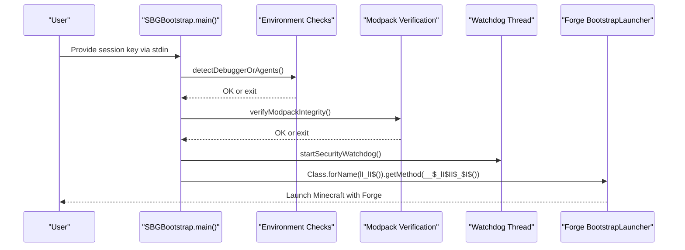
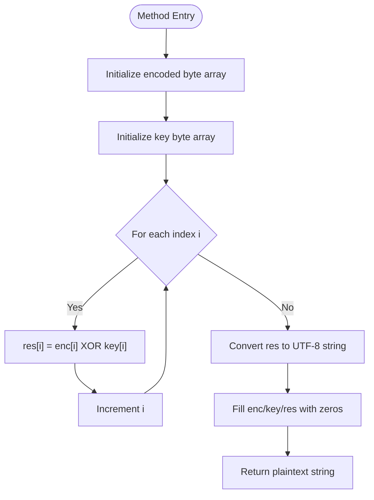
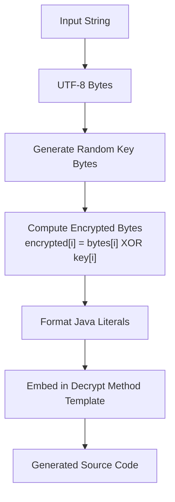
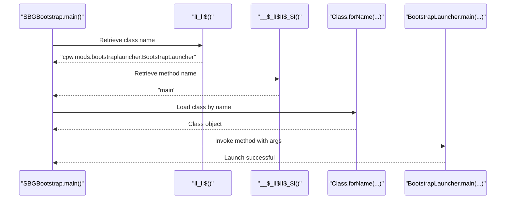
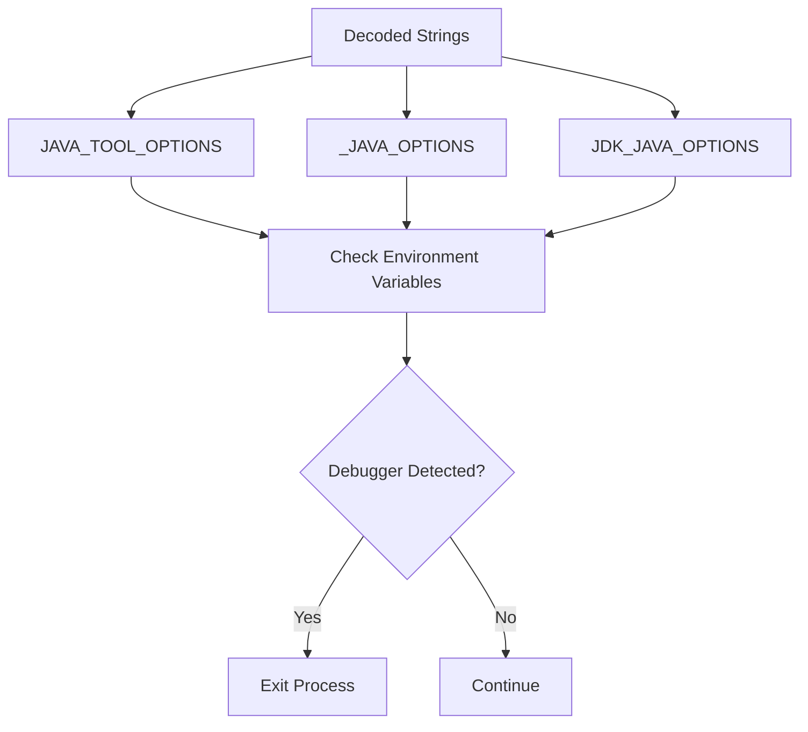
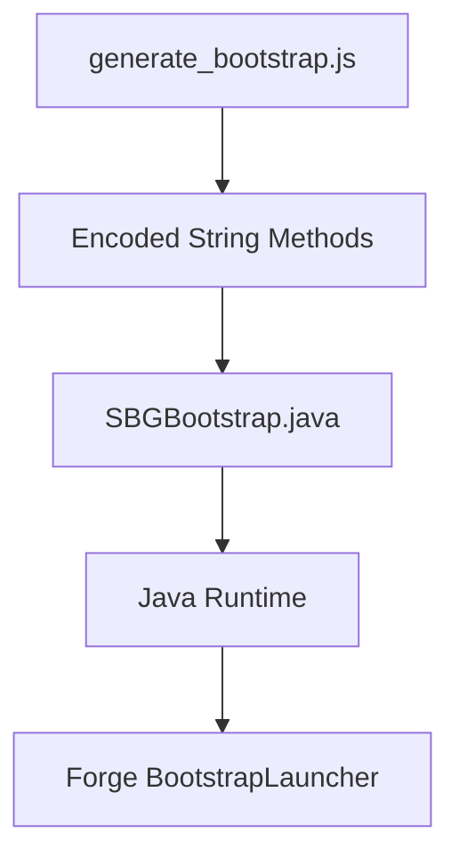

# XOR Encoding Mechanism

<cite>
**Referenced Files in This Document**
- [SBGBootstrap.java](file://src-java/com/sbgames/bootstrap/SBGBootstrap.java)
- [generate_bootstrap.js](file://scratch/generate_bootstrap.js)
</cite>

## Table of Contents
1. [Introduction](#introduction)
2. [Project Structure](#project-structure)
3. [Core Components](#core-components)
4. [Architecture Overview](#architecture-overview)
5. [Detailed Component Analysis](#detailed-component-analysis)
6. [Dependency Analysis](#dependency-analysis)
7. [Performance Considerations](#performance-considerations)
8. [Troubleshooting Guide](#troubleshooting-guide)
9. [Conclusion](#conclusion)

## Introduction
This document explains the XOR encoding mechanism used in the SBGBootstrap security system. The mechanism employs a simple yet effective technique: each sensitive string is stored as an obfuscated byte array and decrypted at runtime using a corresponding key array. The decryption routine performs a bitwise XOR operation between the encoded bytes and the key, then converts the resulting byte array to a UTF-8 string. The implementation includes memory sanitization to overwrite sensitive arrays after use, reducing exposure during runtime.

## Project Structure
The XOR encoding is implemented in the SBGBootstrap Java class, with supporting generation logic in a Node.js script. The class defines multiple private static methods, each responsible for decoding a single obfuscated string. These methods follow a consistent pattern: initialize encoded and key byte arrays, XOR them element-wise, convert to a string, sanitize memory, and return the plaintext.

**Diagram sources**
- [SBGBootstrap.java:12-174](file://src-java/com/sbgames/bootstrap/SBGBootstrap.java#L12-L174)
- [generate_bootstrap.js:35-69](file://scratch/generate_bootstrap.js#L35-L69)

**Section sources**
- [SBGBootstrap.java:1-372](file://src-java/com/sbgames/bootstrap/SBGBootstrap.java#L1-L372)
- [generate_bootstrap.js:1-266](file://scratch/generate_bootstrap.js#L1-L266)

## Core Components
- Encoded string methods: Each method encapsulates a fixed-length byte array representing the obfuscated string and a corresponding key array of equal length. The method iterates over both arrays, XORing elements to reconstruct the original string.
- Memory sanitization: After constructing the plaintext string, the method overwrites the encoded, key, and result arrays with zeros to minimize the risk of sensitive data remaining in memory.
- Runtime usage: The main method and other security routines call these methods to retrieve strings such as class names, method names, file paths, and environment variable names used for integrity checks and watchdog operations.

Example method structure:
- Initialize byte arrays for encoded data and key
- Iterate over indices and XOR encoded[i] with key[i]
- Convert the result to a UTF-8 string
- Fill arrays with zeros
- Return the plaintext string

**Section sources**
- [SBGBootstrap.java:12-24](file://src-java/com/sbgames/bootstrap/SBGBootstrap.java#L12-L24)
- [SBGBootstrap.java:27-39](file://src-java/com/sbgames/bootstrap/SBGBootstrap.java#L27-L39)
- [SBGBootstrap.java:42-54](file://src-java/com/sbgames/bootstrap/SBGBootstrap.java#L42-L54)
- [SBGBootstrap.java:57-69](file://src-java/com/sbgames/bootstrap/SBGBootstrap.java#L57-L69)

## Architecture Overview
The SBGBootstrap class orchestrates the startup sequence and security checks. It retrieves an ephemeral session key from stdin, validates the environment, verifies modpack integrity, starts a watchdog thread, and finally delegates to the Forge BootstrapLauncher using the decoded class name and method name.

**Diagram sources**
- [SBGBootstrap.java:207-237](file://src-java/com/sbgames/bootstrap/SBGBootstrap.java#L207-L237)
- [SBGBootstrap.java:239-273](file://src-java/com/sbgames/bootstrap/SBGBootstrap.java#L239-L273)
- [SBGBootstrap.java:275-291](file://src-java/com/sbgames/bootstrap/SBGBootstrap.java#L275-L291)
- [SBGBootstrap.java:293-353](file://src-java/com/sbgames/bootstrap/SBGBootstrap.java#L293-L353)

## Detailed Component Analysis

### XOR Decryption Pattern
Each encoded string method follows a consistent pattern:
- Byte array initialization: The encoded byte array holds the obfuscated representation of the target string.
- Key array initialization: A separate byte array serves as the XOR key.
- Element-wise XOR: The method iterates over indices, XORing encoded[i] with key[i] to recover plaintext bytes.
- UTF-8 conversion: The resulting byte array is converted to a UTF-8 string.
- Memory cleanup: All sensitive arrays are overwritten with zeros before returning.

**Diagram sources**
- [SBGBootstrap.java:12-24](file://src-java/com/sbgames/bootstrap/SBGBootstrap.java#L12-L24)
- [SBGBootstrap.java:27-39](file://src-java/com/sbgames/bootstrap/SBGBootstrap.java#L27-L39)
- [SBGBootstrap.java:42-54](file://src-java/com/sbgames/bootstrap/SBGBootstrap.java#L42-L54)

**Section sources**
- [SBGBootstrap.java:12-174](file://src-java/com/sbgames/bootstrap/SBGBootstrap.java#L12-L174)

### Generation Script Details
The generation script demonstrates how the XOR pairs are produced:
- Input string is converted to UTF-8 bytes.
- A random key byte is generated for each input byte.
- The encrypted byte is computed as input byte XOR key byte.
- Arrays are formatted as Java literals and embedded into a decryption method template.
- The script generates multiple methods, each returning a different decoded string.

**Diagram sources**
- [generate_bootstrap.js:35-69](file://scratch/generate_bootstrap.js#L35-L69)

**Section sources**
- [generate_bootstrap.js:35-69](file://scratch/generate_bootstrap.js#L35-L69)

### Example: Class Name Decryption
The main method uses two decoded strings:
- Class name: Retrieved from a method that decodes a class name string.
- Method name: Retrieved from another method that decodes the main method name.

These decoded values are used to locate and invoke the Forge BootstrapLauncher entry point.

**Diagram sources**
- [SBGBootstrap.java:207-237](file://src-java/com/sbgames/bootstrap/SBGBootstrap.java#L207-L237)
- [SBGBootstrap.java:12-24](file://src-java/com/sbgames/bootstrap/SBGBootstrap.java#L12-L24)
- [SBGBootstrap.java:27-39](file://src-java/com/sbgames/bootstrap/SBGBootstrap.java#L27-L39)

**Section sources**
- [SBGBootstrap.java:207-237](file://src-java/com/sbgames/bootstrap/SBGBootstrap.java#L207-L237)

### Example: Environment Variable Names
The environment variable names used for security checks are also XOR-encoded. The watchdog thread reads these names from decoded methods and checks for the presence of debugger-related variables.

**Diagram sources**
- [SBGBootstrap.java:254-271](file://src-java/com/sbgames/bootstrap/SBGBootstrap.java#L254-L271)
- [SBGBootstrap.java:177-189](file://src-java/com/sbgames/bootstrap/SBGBootstrap.java#L177-L189)
- [SBGBootstrap.java:192-204](file://src-java/com/sbgames/bootstrap/SBGBootstrap.java#L192-L204)

**Section sources**
- [SBGBootstrap.java:254-271](file://src-java/com/sbgames/bootstrap/SBGBootstrap.java#L254-L271)

## Dependency Analysis
The SBGBootstrap class depends on:
- Standard Java libraries for I/O, reflection, and hashing.
- The decoded strings to construct runtime behavior, such as class loading and method invocation.
- The generation script to produce the encoded methods and maintain consistency across builds.

**Diagram sources**
- [generate_bootstrap.js:71-79](file://scratch/generate_bootstrap.js#L71-L79)
- [SBGBootstrap.java:88-91](file://src-java/com/sbgames/bootstrap/SBGBootstrap.java#L88-L91)

**Section sources**
- [generate_bootstrap.js:71-79](file://scratch/generate_bootstrap.js#L71-L79)
- [SBGBootstrap.java:88-91](file://src-java/com/sbgames/bootstrap/SBGBootstrap.java#L88-L91)

## Performance Considerations
- Computational cost: XOR decoding is O(n) with minimal overhead per string.
- Memory footprint: Each method allocates three byte arrays (encoded, key, result) plus the final string. Memory is reclaimed quickly after sanitization.
- Startup impact: The number of encoded strings is moderate; the decoding cost is negligible compared to JVM initialization and modpack verification.

## Troubleshooting Guide
Common issues and remedies:
- Runtime errors during decoding: Ensure the encoded and key arrays remain intact and properly sized. Verify that UTF-8 conversion succeeds.
- Memory leaks: Confirm that arrays are filled with zeros after use. Monitor for accidental retention of decoded strings.
- Build inconsistencies: When regenerating encoded methods, ensure the generation script produces matching key lengths and preserves formatting.

**Section sources**
- [SBGBootstrap.java:12-24](file://src-java/com/sbgames/bootstrap/SBGBootstrap.java#L12-L24)
- [SBGBootstrap.java:27-39](file://src-java/com/sbgames/bootstrap/SBGBootstrap.java#L27-L39)

## Conclusion
The XOR encoding mechanism in SBGBootstrap provides a lightweight, deterministic way to hide sensitive strings at build time while decrypting them at runtime. Combined with memory sanitization and layered runtime protections, it contributes to a defense-in-depth strategy. While XOR alone does not provide cryptographic strength, it effectively obscures strings from casual inspection and integrates seamlessly with the broader security architecture.