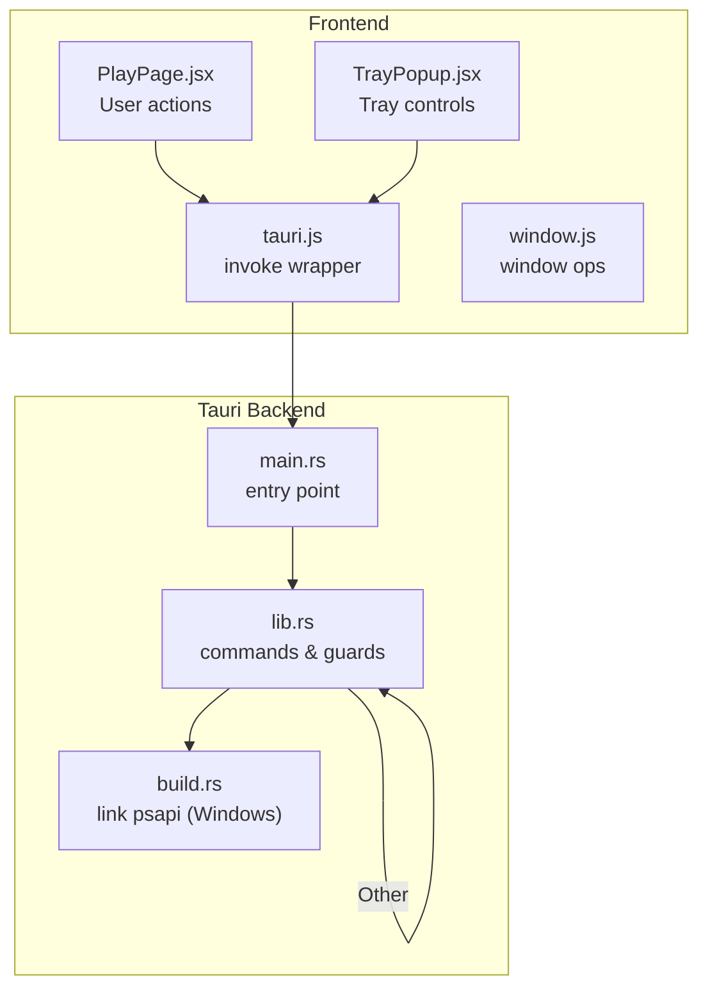
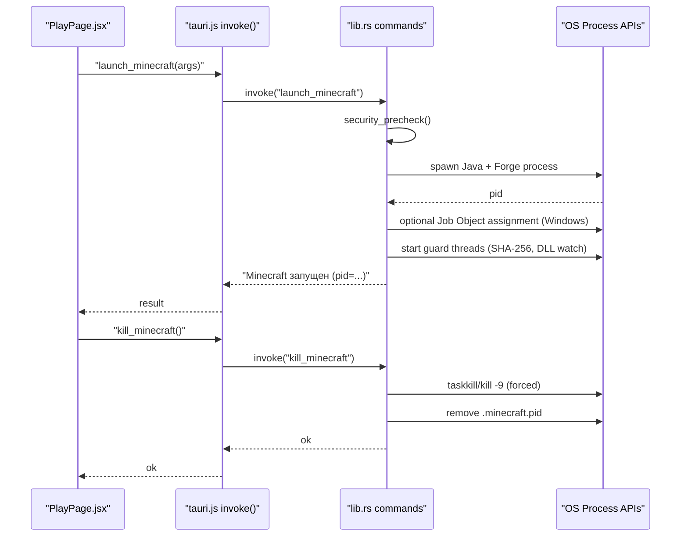
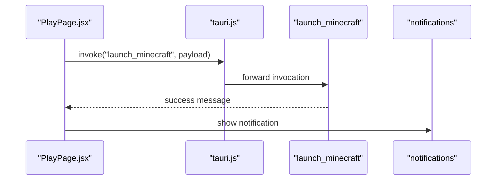
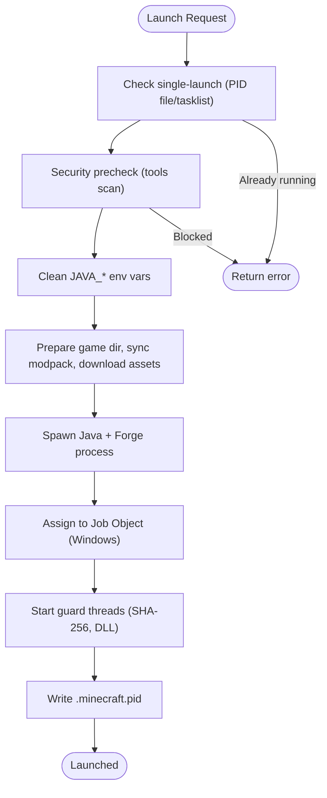
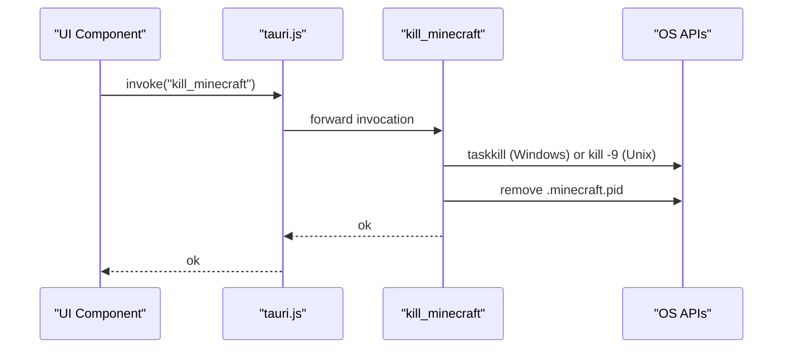
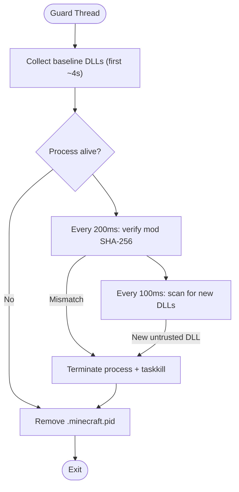
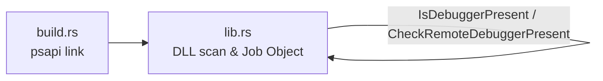
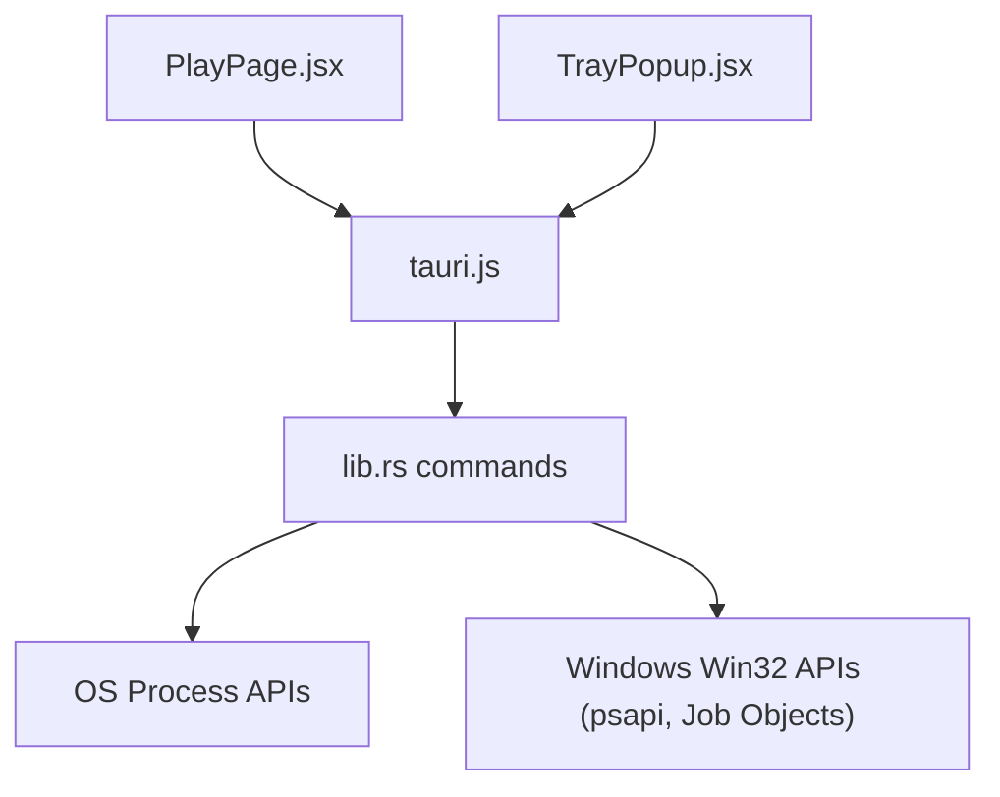

# Process Control & Termination

<cite>
**Referenced Files in This Document**
- [lib.rs](file://src-tauri/src/lib.rs)
- [main.rs](file://src-tauri/src/main.rs)
- [tauri.js](file://src/lib/tauri.js)
- [PlayPage.jsx](file://src/pages/PlayPage.jsx)
- [TrayPopup.jsx](file://src/pages/TrayPopup.jsx)
- [window.js](file://src/lib/window.js)
- [build.rs](file://src-tauri/build.rs)
</cite>

## Table of Contents
1. [Introduction](#introduction)
2. [Project Structure](#project-structure)
3. [Core Components](#core-components)
4. [Architecture Overview](#architecture-overview)
5. [Detailed Component Analysis](#detailed-component-analysis)
6. [Dependency Analysis](#dependency-analysis)
7. [Performance Considerations](#performance-considerations)
8. [Troubleshooting Guide](#troubleshooting-guide)
9. [Conclusion](#conclusion)

## Introduction
This document explains the process control and graceful termination mechanisms for the Minecraft client launched by the SB Games launcher. It covers how the Tauri backend manages the lifecycle of the external Minecraft process, how the frontend triggers actions, and how the system handles both normal shutdown and emergency termination. It also documents the runtime protection that monitors for unauthorized modifications and injection attempts, and describes cleanup procedures for temporary files and zombie processes.

## Project Structure
The process control functionality spans three layers:
- Frontend React components that expose user controls and invoke Tauri commands
- Tauri command handlers that orchestrate process lifecycle and security checks
- Native OS integrations for process termination, process tree management, and runtime monitoring

**Diagram sources**
- [PlayPage.jsx:109-149](file://src/pages/PlayPage.jsx#L109-L149)
- [TrayPopup.jsx:61-78](file://src/pages/TrayPopup.jsx#L61-L78)
- [tauri.js:1-36](file://src/lib/tauri.js#L1-L36)
- [window.js:1-16](file://src/lib/window.js#L1-L16)
- [main.rs:1-7](file://src-tauri/src/main.rs#L1-L7)
- [lib.rs:2546-2588](file://src-tauri/src/lib.rs#L2546-L2588)
- [build.rs:1-7](file://src-tauri/build.rs#L1-L7)

**Section sources**
- [PlayPage.jsx:109-149](file://src/pages/PlayPage.jsx#L109-L149)
- [TrayPopup.jsx:61-78](file://src/pages/TrayPopup.jsx#L61-L78)
- [tauri.js:1-36](file://src/lib/tauri.js#L1-L36)
- [window.js:1-16](file://src/lib/window.js#L1-L16)
- [main.rs:1-7](file://src-tauri/src/main.rs#L1-L7)
- [lib.rs:2546-2588](file://src-tauri/src/lib.rs#L2546-L2588)
- [build.rs:1-7](file://src-tauri/build.rs#L1-L7)

## Core Components
- Tauri commands for process control:
  - Launch Minecraft with environment hygiene and security prechecks
  - Check Minecraft status (including guard-trigger reasons)
  - Force-terminate Minecraft with OS-specific signals
- Runtime protection:
  - Integrity verification and anti-debug checks
  - Mod integrity enforcement via SHA-256
  - DLL injection detection on Windows
  - Process tree management via Job Objects on Windows
- Cleanup and zombie handling:
  - PID file management
  - Guard-trigger signaling for termination reasons
  - OS-specific termination commands

**Section sources**
- [lib.rs:341-1473](file://src-tauri/src/lib.rs#L341-L1473)
- [lib.rs:1775-1826](file://src-tauri/src/lib.rs#L1775-L1826)
- [lib.rs:1398-1429](file://src-tauri/src/lib.rs#L1398-L1429)
- [lib.rs:1431-1473](file://src-tauri/src/lib.rs#L1431-L1473)

## Architecture Overview
The frontend triggers Tauri commands that operate on the Minecraft process. The backend enforces security, spawns the process, and starts protective watchers. Termination can be initiated gracefully or forcibly, with cleanup and logging.

**Diagram sources**
- [PlayPage.jsx:109-149](file://src/pages/PlayPage.jsx#L109-L149)
- [tauri.js:1-36](file://src/lib/tauri.js#L1-L36)
- [lib.rs:341-1473](file://src-tauri/src/lib.rs#L341-L1473)

## Detailed Component Analysis

### Frontend Integration and Controls
- PlayPage.jsx invokes the launch command with user credentials and runtime options, sets Discord presence, and displays notifications upon success.
- TrayPopup.jsx integrates with tray commands and can trigger game launch from the tray.
- tauri.js provides a safe invoke wrapper around @tauri-apps/api/core.
- window.js exposes window operations for minimize/maximize/close.

**Diagram sources**
- [PlayPage.jsx:109-149](file://src/pages/PlayPage.jsx#L109-L149)
- [tauri.js:1-36](file://src/lib/tauri.js#L1-L36)

**Section sources**
- [PlayPage.jsx:109-149](file://src/pages/PlayPage.jsx#L109-L149)
- [TrayPopup.jsx:61-78](file://src/pages/TrayPopup.jsx#L61-L78)
- [tauri.js:1-36](file://src/lib/tauri.js#L1-L36)
- [window.js:1-16](file://src/lib/window.js#L1-L16)

### Launch Command and Security Prechecks
- Single-launch protection prevents multiple instances by checking a PID file and tasklist/process existence.
- Security precheck scans for known cheating/debugging tools via tasklist (Windows) or equivalent checks (other OS).
- Environment hygiene removes potentially harmful Java environment variables.
- The launcher prepares the game directory, synchronizes the modpack whitelist, and downloads required assets and libraries.
- It spawns the Java process with Forge, writes a session key to stdin, and records the PID to a file.
- On Windows, the process is placed into a Job Object to enable controlled termination and UI restrictions.
- Guard threads monitor for:
  - SHA-256 mismatches in mods
  - Unauthorized DLL injections (Windows)
  - Unexpected termination of the process

**Diagram sources**
- [lib.rs:341-1473](file://src-tauri/src/lib.rs#L341-L1473)
- [lib.rs:1775-1826](file://src-tauri/src/lib.rs#L1775-L1826)
- [lib.rs:1398-1429](file://src-tauri/src/lib.rs#L1398-L1429)

**Section sources**
- [lib.rs:341-1473](file://src-tauri/src/lib.rs#L341-L1473)
- [lib.rs:1775-1826](file://src-tauri/src/lib.rs#L1775-L1826)
- [lib.rs:1398-1429](file://src-tauri/src/lib.rs#L1398-L1429)

### Status and Kill Commands
- get_minecraft_status reads the PID file, validates process existence, and surfaces guard-trigger messages if the process was terminated by the runtime protection.
- kill_minecraft force-terminates the process using OS-specific commands and cleans up the PID file.

**Diagram sources**
- [lib.rs:1431-1473](file://src-tauri/src/lib.rs#L1431-L1473)

**Section sources**
- [lib.rs:1431-1473](file://src-tauri/src/lib.rs#L1431-L1473)

### Runtime Protection and Safety Mechanisms
- Integrity and anti-debug checks run at startup and periodically during runtime.
- Mod integrity:
  - Maintains a whitelist of SHA-256 hashes for allowed mods.
  - Periodically recomputes hashes and compares against the whitelist.
  - Terminates the process immediately if violations are detected.
- DLL injection detection (Windows):
  - Builds a baseline of loaded DLL paths during the first few seconds.
  - Detects newly loaded DLLs outside trusted paths and terminates the process.
- Process tree management (Windows):
  - Uses Job Objects to group the Java process and terminate the entire tree when needed.

**Diagram sources**
- [lib.rs:1007-1210](file://src-tauri/src/lib.rs#L1007-L1210)

**Section sources**
- [lib.rs:1007-1210](file://src-tauri/src/lib.rs#L1007-L1210)

### Windows-Specific Integrations
- Linking psapi in build.rs enables EnumProcessModulesEx for DLL scanning.
- Job Objects restrict UI operations and enable subtree termination.
- Debugger checks and DLL protection mitigate tampering.

**Diagram sources**
- [build.rs:1-7](file://src-tauri/build.rs#L1-L7)
- [lib.rs:1-140](file://src-tauri/src/lib.rs#L1-L140)

**Section sources**
- [build.rs:1-7](file://src-tauri/build.rs#L1-L7)
- [lib.rs:1-140](file://src-tauri/src/lib.rs#L1-L140)

## Dependency Analysis
- Frontend depends on tauri.js for invoking backend commands.
- The Tauri builder registers commands and wires them to the frontend.
- The backend relies on OS process APIs and, on Windows, Win32 APIs for process and DLL inspection.

**Diagram sources**
- [PlayPage.jsx:109-149](file://src/pages/PlayPage.jsx#L109-L149)
- [TrayPopup.jsx:61-78](file://src/pages/TrayPopup.jsx#L61-L78)
- [tauri.js:1-36](file://src/lib/tauri.js#L1-L36)
- [lib.rs:2546-2588](file://src-tauri/src/lib.rs#L2546-L2588)

**Section sources**
- [PlayPage.jsx:109-149](file://src/pages/PlayPage.jsx#L109-L149)
- [TrayPopup.jsx:61-78](file://src/pages/TrayPopup.jsx#L61-L78)
- [tauri.js:1-36](file://src/lib/tauri.js#L1-L36)
- [lib.rs:2546-2588](file://src-tauri/src/lib.rs#L2546-L2588)

## Performance Considerations
- Guard thread polling intervals are tuned to balance responsiveness and overhead (100 ms for DLL scan, 200 ms for mod integrity).
- Baseline collection duration is minimized to reduce early termination risk while ensuring coverage of native libraries.
- Process spawning and file I/O for logs and manifests are performed once during launch to avoid repeated overhead.

## Troubleshooting Guide
Common scenarios and resolutions:
- Controlled shutdown
  - Use the frontend “Play” flow which invokes the launch command and sets Discord presence. After launching, the backend writes a PID file and starts guard threads. To shut down normally, exit the Minecraft client; the PID file is cleaned up automatically when the process exits.
  - Verify status with get_minecraft_status to confirm whether the client is running or if a guard-trigger reason is present.
- Emergency termination
  - If the client becomes unresponsive, call kill_minecraft to force-terminate the process using OS-specific commands. The PID file is removed afterward.
- Termination failures
  - If kill_minecraft does not terminate the process, ensure no antivirus or security product is blocking the termination command. Retry after closing conflicting applications.
  - On Windows, verify that the process is still tracked by tasklist; if not, the PID file may have been removed by the runtime protection or previous termination attempts.
- Zombie processes
  - The runtime protection removes the PID file when the process exits. If a stale PID file remains, manually remove .minecraft.pid from the game directory.
- Temporary files and cleanup
  - Logs (java-stdout.log, java-stderr.log) are created in the game directory and can be reviewed for errors.
  - The launcher writes .mod-hashes and .modpack-whitelist.json; these are managed automatically during launch and mod synchronization.
  - On Windows, mods/ may be marked read-only to prevent accidental deletion; removal of the read-only attribute is handled by the launcher when necessary.

**Section sources**
- [lib.rs:1431-1473](file://src-tauri/src/lib.rs#L1431-L1473)
- [lib.rs:1398-1429](file://src-tauri/src/lib.rs#L1398-L1429)
- [lib.rs:872-894](file://src-tauri/src/lib.rs#L872-L894)

## Conclusion
The SB Games launcher implements robust process control for the Minecraft client through Tauri commands, OS-native integrations, and runtime protection. Frontend controls trigger backend operations that enforce security, manage process lifecycle, and ensure cleanup. The system supports both graceful shutdown and emergency termination, with safeguards against tampering and injection, and mechanisms to handle zombie processes and residual artifacts.