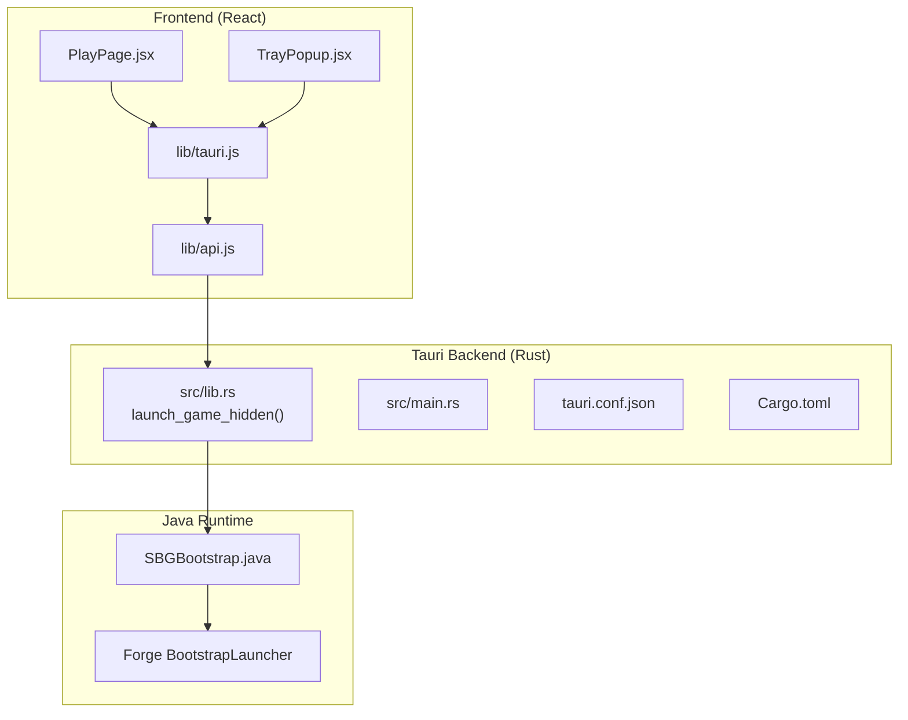
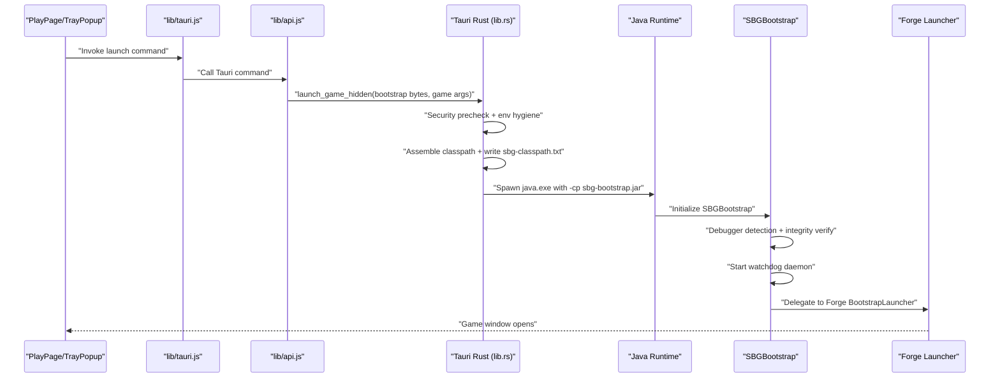
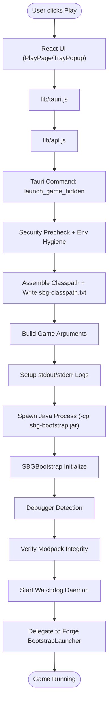
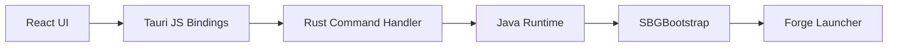

# Process Launching & Initialization

<cite>
**Referenced Files in This Document**
- [lib.rs](file://src-tauri/src/lib.rs)
- [main.rs](file://src-tauri/src/main.rs)
- [SBGBootstrap.java](file://src-java/com/sbgames/bootstrap/SBGBootstrap.java)
- [tauri.conf.json](file://src-tauri/tauri.conf.json)
- [Cargo.toml](file://src-tauri/Cargo.toml)
- [lib.rs (React)](file://src/lib/tauri.js)
- [PlayPage.jsx](file://src/pages/PlayPage.jsx)
- [TrayPopup.jsx](file://src/pages/TrayPopup.jsx)
- [api.js](file://src/lib/api.js)
- [index.js (server)](file://server/index.js)
</cite>

## Table of Contents
1. [Introduction](#introduction)
2. [Project Structure](#project-structure)
3. [Core Components](#core-components)
4. [Architecture Overview](#architecture-overview)
5. [Detailed Component Analysis](#detailed-component-analysis)
6. [Dependency Analysis](#dependency-analysis)
7. [Performance Considerations](#performance-considerations)
8. [Troubleshooting Guide](#troubleshooting-guide)
9. [Conclusion](#conclusion)

## Introduction
This document explains the secure game process launching mechanism used by the application. It covers how the React frontend triggers Tauri commands, how the Tauri backend configures and validates launch parameters, and how the Java bootstrap initializes the Minecraft process with strict security controls. It also documents argument passing, environment variable configuration, working directory setup, integrity verification, and error handling/recovery strategies.

## Project Structure
The launch pipeline spans three layers:
- Frontend (React): Initiates launch via Tauri commands and UI events.
- Tauri Backend (Rust): Validates security preconditions, constructs JVM command lines, manages environment variables, writes diagnostic logs, and spawns the Java process.
- Java Bootstrap (SBGBootstrap): Performs runtime checks, integrity verification, watchdog activation, and delegates to Forge’s launcher.

**Diagram sources**
- [lib.rs:2210-2627](file://src-tauri/src/lib.rs#L2210-L2627)
- [main.rs:1-50](file://src-tauri/src/main.rs#L1-L50)
- [SBGBootstrap.java:217-251](file://src-java/com/sbgames/bootstrap/SBGBootstrap.java#L217-L251)
- [PlayPage.jsx:1-100](file://src/pages/PlayPage.jsx#L1-L100)
- [TrayPopup.jsx:1-100](file://src/pages/TrayPopup.jsx#L1-L100)
- [lib.rs (React):1-100](file://src/lib/tauri.js#L1-L100)
- [api.js:1-100](file://src/lib/api.js#L1-L100)
- [tauri.conf.json:1-100](file://src-tauri/tauri.conf.json#L1-L100)
- [Cargo.toml:1-50](file://src-tauri/Cargo.toml#L1-L50)

**Section sources**
- [lib.rs:2210-2627](file://src-tauri/src/lib.rs#L2210-L2627)
- [main.rs:1-50](file://src-tauri/src/main.rs#L1-L50)
- [SBGBootstrap.java:217-251](file://src-java/com/sbgames/bootstrap/SBGBootstrap.java#L217-L251)
- [PlayPage.jsx:1-100](file://src/pages/PlayPage.jsx#L1-L100)
- [TrayPopup.jsx:1-100](file://src/pages/TrayPopup.jsx#L1-L100)
- [lib.rs (React):1-100](file://src/lib/tauri.js#L1-L100)
- [api.js:1-100](file://src/lib/api.js#L1-L100)
- [tauri.conf.json:1-100](file://src-tauri/tauri.conf.json#L1-L100)
- [Cargo.toml:1-50](file://src-tauri/Cargo.toml#L1-L50)

## Core Components
- Tauri command handler: launch_game_hidden orchestrates security checks, environment sanitization, classpath assembly, argument construction, and process spawning.
- Java bootstrap: SBGBootstrap performs debugger detection, modpack integrity verification, watchdog startup, and delegates to Forge.
- Frontend triggers: PlayPage and TrayPopup components call Tauri APIs to initiate launch sequences.

Key responsibilities:
- Security prechecks and environment hygiene in Rust.
- Argument assembly and logging redirection in Rust.
- Integrity verification and watchdog in Java.
- UI-driven command invocation from React.

**Section sources**
- [lib.rs:352-916](file://src-tauri/src/lib.rs#L352-L916)
- [SBGBootstrap.java:217-251](file://src-java/com/sbgames/bootstrap/SBGBootstrap.java#L217-L251)
- [PlayPage.jsx:1-100](file://src/pages/PlayPage.jsx#L1-L100)
- [TrayPopup.jsx:1-100](file://src/pages/TrayPopup.jsx#L1-L100)

## Architecture Overview
The launch sequence begins in the React UI, proceeds through Tauri commands to Rust, and finally invokes the Java bootstrap.

**Diagram sources**
- [lib.rs:352-916](file://src-tauri/src/lib.rs#L352-L916)
- [SBGBootstrap.java:217-251](file://src-java/com/sbgames/bootstrap/SBGBootstrap.java#L217-L251)
- [lib.rs (React):1-100](file://src/lib/tauri.js#L1-L100)
- [api.js:1-100](file://src/lib/api.js#L1-L100)
- [PlayPage.jsx:1-100](file://src/pages/PlayPage.jsx#L1-L100)
- [TrayPopup.jsx:1-100](file://src/pages/TrayPopup.jsx#L1-L100)

## Detailed Component Analysis

### Tauri Command Handler: launch_game_hidden
Responsibilities:
- Single-launch protection: prevents multiple Minecraft instances.
- Security precheck: blocks suspicious environments and debuggers.
- Environment hygiene: removes potentially harmful JAVA_* variables.
- Classpath assembly: reads Forge profile, collects library JARs, writes sbg-classpath.txt, and sets -cp to sbg-bootstrap.jar and sbg-classpath.jar.
- Argument construction: builds standardized Minecraft arguments (username, version, gameDir, assetsDir, assetIndex, uuid, accessToken, userType, versionType, launchTarget, and FML metadata).
- Logging: redirects stdout/stderr to java-stdout.log/java-stderr.log with classpath dump.
- Process spawning: sets current working directory to Minecraft dir, spawns Java with constructed arguments, and emits progress events.

Security measures:
- Debugger presence checks on Windows.
- Removal of JAVA_TOOL_OPTIONS/_JAVA_OPTIONS/JAVA_OPTIONS/CLASSPATH.
- Integrity manifest generation for mod JARs (.mod-hashes).

Error handling:
- Early returns with descriptive errors on precheck failure.
- Detailed error messages for spawn failures.
- Logging to files for diagnostics.

**Section sources**
- [lib.rs:352-916](file://src-tauri/src/lib.rs#L352-L916)
- [lib.rs:2615-2627](file://src-tauri/src/lib.rs#L2615-L2627)

### Java Bootstrap: SBGBootstrap
Responsibilities:
- Runtime debugger detection by scanning JVM input arguments.
- Modpack integrity verification against .mod-hashes.
- Watchdog daemon startup for continuous monitoring.
- Delegation to Forge BootstrapLauncher with sanitized arguments.

Security measures:
- Immediate termination on debugger detection.
- Failure-safe integrity checks before proceeding.

**Section sources**
- [SBGBootstrap.java:217-251](file://src-java/com/sbgames/bootstrap/SBGBootstrap.java#L217-L251)

### Frontend Integration: React Components
- PlayPage and TrayPopup trigger launch actions.
- lib/tauri.js exposes Tauri command bindings.
- lib/api.js wraps command invocations for UI components.

Launch flow:
- User initiates play from UI.
- Tauri command is invoked with bootstrap JAR bytes and game arguments.
- Progress updates are emitted and rendered in the UI.

**Section sources**
- [PlayPage.jsx:1-100](file://src/pages/PlayPage.jsx#L1-L100)
- [TrayPopup.jsx:1-100](file://src/pages/TrayPopup.jsx#L1-L100)
- [lib.rs (React):1-100](file://src/lib/tauri.js#L1-L100)
- [api.js:1-100](file://src/lib/api.js#L1-L100)

### Argument Passing System
Assembly and validation:
- Classpath: sbg-bootstrap.jar + sbg-classpath.jar; sbg-classpath.txt lists resolved library JARs.
- JVM main class: com.sbgames.bootstrap.SBGBootstrap.
- Game arguments include username, version, gameDir, assetsDir, assetIndex, uuid, accessToken, userType, versionType, launchTarget, and FML metadata.
- Working directory: set to Minecraft directory for all IO operations.

Validation:
- Precheck ensures single instance and safe environment.
- Integrity manifest written for mod JARs; verified by Java bootstrap.

**Section sources**
- [lib.rs:707-852](file://src-tauri/src/lib.rs#L707-L852)
- [lib.rs:821-847](file://src-tauri/src/lib.rs#L821-L847)

### Environment Variable Configuration
- Toxic variables removed: JAVA_TOOL_OPTIONS, _JAVA_OPTIONS, JAVA_OPTIONS, CLASSPATH.
- Current working directory set to Minecraft directory before spawning.
- Logging redirected to dedicated files for diagnostics.

**Section sources**
- [lib.rs:366-371](file://src-tauri/src/lib.rs#L366-L371)
- [lib.rs:891-894](file://src-tauri/src/lib.rs#L891-L894)

### Startup Parameter Validation
- Single-instance enforcement via PID file.
- Security precheck including debugger detection.
- Integrity manifest generation and verification.
- Robust error propagation with descriptive messages.

**Section sources**
- [lib.rs:352-358](file://src-tauri/src/lib.rs#L352-L358)
- [lib.rs:901-912](file://src-tauri/src/lib.rs#L901-L912)
- [lib.rs:821-847](file://src-tauri/src/lib.rs#L821-L847)

### Launch Sequence from Frontend to Java Execution

**Diagram sources**
- [lib.rs:352-916](file://src-tauri/src/lib.rs#L352-L916)
- [SBGBootstrap.java:217-251](file://src-java/com/sbgames/bootstrap/SBGBootstrap.java#L217-L251)
- [PlayPage.jsx:1-100](file://src/pages/PlayPage.jsx#L1-L100)
- [TrayPopup.jsx:1-100](file://src/pages/TrayPopup.jsx#L1-L100)
- [lib.rs (React):1-100](file://src/lib/tauri.js#L1-L100)
- [api.js:1-100](file://src/lib/api.js#L1-L100)

## Dependency Analysis
- Rust backend depends on:
  - Standard library for process spawning and filesystem operations.
  - SHA-2 hashing for integrity verification.
  - Windows-specific APIs for debugger detection.
- Java bootstrap depends on:
  - JVM runtime for reflection and class loading.
  - Forge BootstrapLauncher for game initialization.
- Frontend depends on:
  - Tauri JS bindings and API wrappers for command invocation.

**Diagram sources**
- [lib.rs:2210-2627](file://src-tauri/src/lib.rs#L2210-L2627)
- [SBGBootstrap.java:217-251](file://src-java/com/sbgames/bootstrap/SBGBootstrap.java#L217-L251)
- [lib.rs (React):1-100](file://src/lib/tauri.js#L1-L100)
- [api.js:1-100](file://src/lib/api.js#L1-L100)

**Section sources**
- [lib.rs:2210-2627](file://src-tauri/src/lib.rs#L2210-L2627)
- [SBGBootstrap.java:217-251](file://src-java/com/sbgames/bootstrap/SBGBootstrap.java#L217-L251)
- [lib.rs (React):1-100](file://src/lib/tauri.js#L1-L100)
- [api.js:1-100](file://src/lib/api.js#L1-L100)

## Performance Considerations
- Classpath assembly scans libraries and writes a consolidated manifest to avoid JVM classpath overhead.
- Logging to files avoids blocking UI threads.
- Asynchronous progress emission keeps the UI responsive during launch.
- Integrity verification runs once per launch; cache-friendly if repeated launches reuse the same mod set.

## Troubleshooting Guide
Common issues and remedies:
- Debugger detected: The launcher aborts to prevent tampering. Close debuggers and retry.
- JVM not found: Ensure jvm.dll/libjvm.so/libjvm.dylib exists under runtime/. Reinstall or repair the runtime.
- Single instance running: Close existing Minecraft process or terminate the running instance.
- Classpath missing JARs: Verify sbg-classpath.txt entries and library availability under libraries/.
- Integrity mismatch: Review .mod-hashes and ensure mod JARs are unmodified.
- Spawn failures: Check java-stdout.log and java-stderr.log for detailed error messages.

Recovery mechanisms:
- Emit progress events to inform the UI.
- Write diagnostic logs to files for later inspection.
- Fail-fast on security violations to prevent unsafe execution.

**Section sources**
- [lib.rs:2601-2627](file://src-tauri/src/lib.rs#L2601-L2627)
- [lib.rs:352-358](file://src-tauri/src/lib.rs#L352-L358)
- [lib.rs:901-912](file://src-tauri/src/lib.rs#L901-L912)
- [lib.rs:872-894](file://src-tauri/src/lib.rs#L872-L894)

## Conclusion
The launch mechanism integrates React UI, Tauri backend, and Java bootstrap to securely initialize the Minecraft process. It enforces single-instance execution, cleans the environment, validates integrity, and spawns the JVM with a hardened classpath and arguments. Diagnostic logging and robust error handling ensure reliable operation and easy troubleshooting.