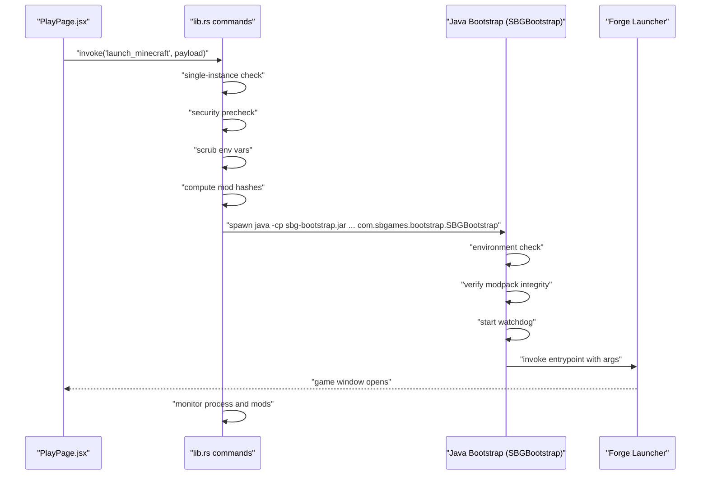
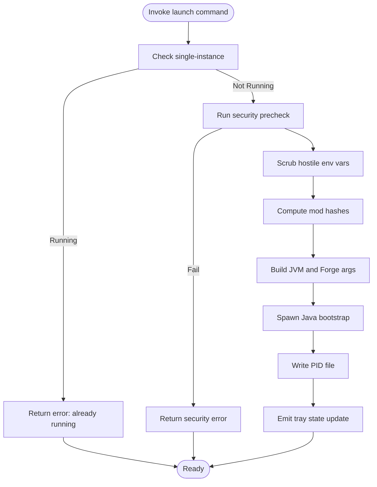
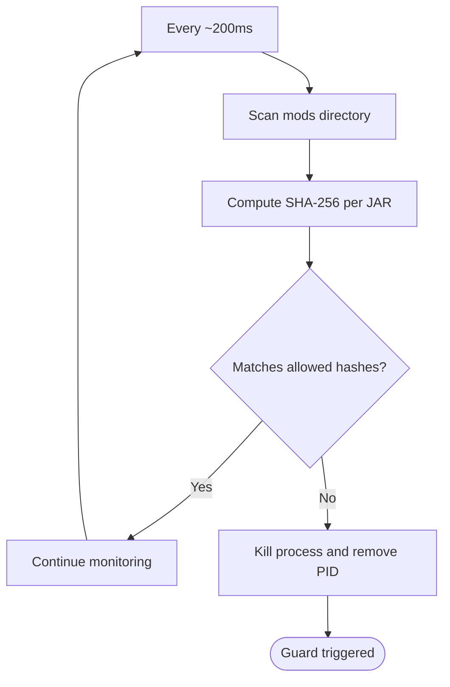
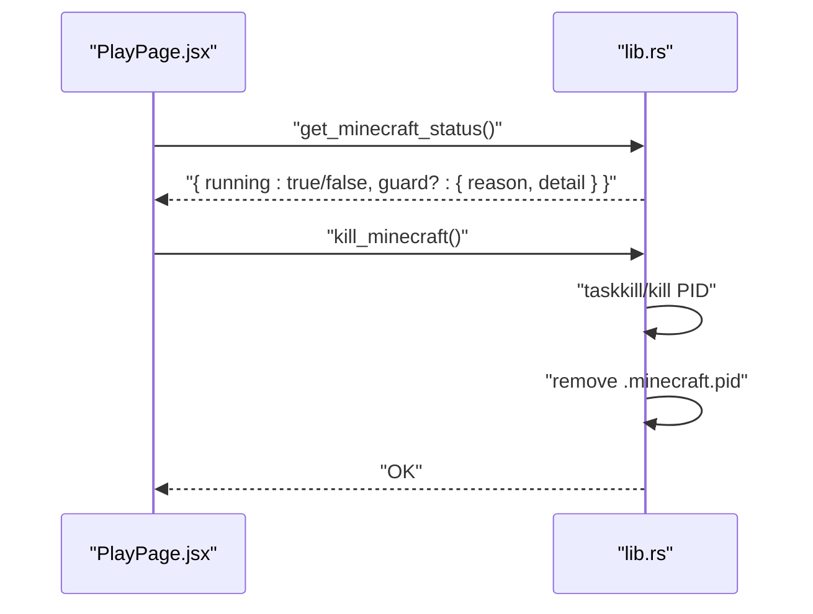
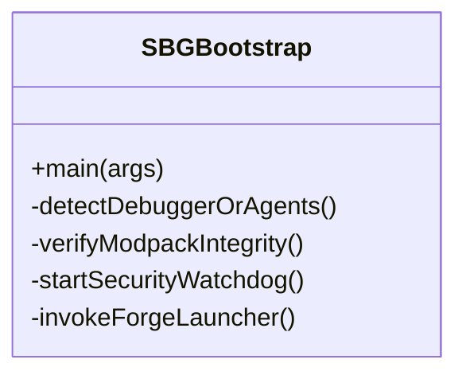
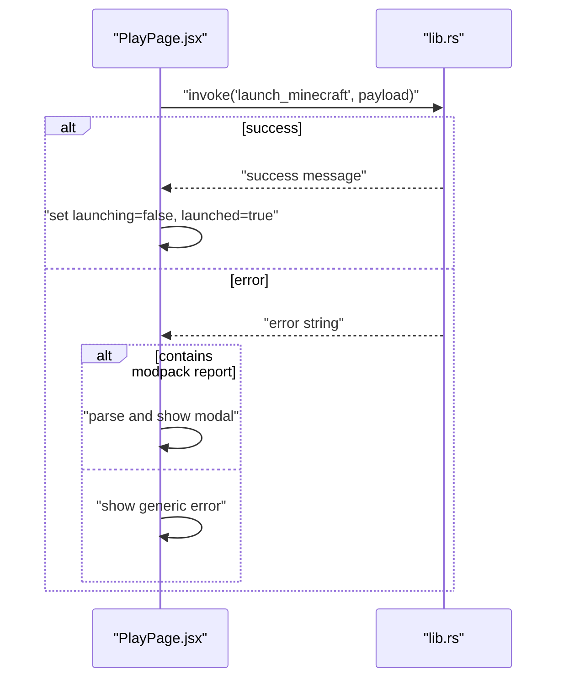
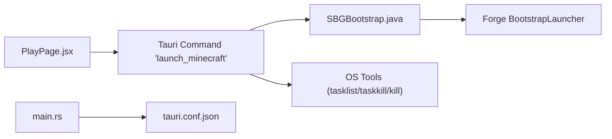

# Process Management & Monitoring

<cite>
**Referenced Files in This Document**
- [lib.rs](file://src-tauri/src/lib.rs)
- [main.rs](file://src-tauri/src/main.rs)
- [SBGBootstrap.java](file://src-java/com/sbgames/bootstrap/SBGBootstrap.java)
- [PlayPage.jsx](file://src/pages/PlayPage.jsx)
- [tauri.conf.json](file://src-tauri/tauri.conf.json)
- [Cargo.toml](file://src-tauri/Cargo.toml)
- [generate_bootstrap.js](file://scratch/generate_bootstrap.js)
</cite>

## Table of Contents
1. [Introduction](#introduction)
2. [Project Structure](#project-structure)
3. [Core Components](#core-components)
4. [Architecture Overview](#architecture-overview)
5. [Detailed Component Analysis](#detailed-component-analysis)
6. [Dependency Analysis](#dependency-analysis)
7. [Performance Considerations](#performance-considerations)
8. [Troubleshooting Guide](#troubleshooting-guide)
9. [Conclusion](#conclusion)

## Introduction
This document explains the game process management system that launches and monitors Minecraft via a Tauri-backed Rust backend and a Java-based bootstrap. It covers the integration between the frontend React components and the Tauri backend commands, the lifecycle of launching, monitoring, and terminating the game process, and the security and integrity checks performed during launch. It also documents communication channels, error handling, recovery mechanisms, and performance considerations for process monitoring.

## Project Structure
The process management spans three primary areas:
- Frontend React page that triggers the launch and displays status.
- Tauri backend Rust module implementing commands and process orchestration.
- Java bootstrap that performs environment checks, integrity verification, and delegates to the Forge launcher.

```mermaid
graph TB
subgraph "Frontend"
PP["PlayPage.jsx<br/>User action and UI state"]
end
subgraph "Tauri Backend"
TR["main.rs<br/>entrypoint"]
LR["lib.rs<br/>commands and process orchestration"]
CFG["tauri.conf.json<br/>capabilities and permissions"]
end
subgraph "Java Bootstrap"
JB["SBGBootstrap.java<br/>security checks and delegation"]
GEN["generate_bootstrap.js<br/>generated bootstrap code"]
end
PP --> |invoke('launch_minecraft')| LR
LR --> |spawn process| JB
JB --> |"Forge BootstrapLauncher"| MC["Minecraft Process"]
LR --|"monitor and control"| MC
TR --> CFG
```

**Diagram sources**
- [PlayPage.jsx:109-149](file://src/pages/PlayPage.jsx#L109-L149)
- [lib.rs:352-1473](file://src-tauri/src/lib.rs#L352-L1473)
- [main.rs:2590-2599](file://src-tauri/src/main.rs#L2590-L2599)
- [tauri.conf.json](file://src-tauri/tauri.conf.json)
- [SBGBootstrap.java:1-251](file://src-java/com/sbgames/bootstrap/SBGBootstrap.java#L1-L251)
- [generate_bootstrap.js:88-123](file://scratch/generate_bootstrap.js#L88-L123)

**Section sources**
- [lib.rs:352-1473](file://src-tauri/src/lib.rs#L352-L1473)
- [PlayPage.jsx:109-149](file://src/pages/PlayPage.jsx#L109-L149)
- [SBGBootstrap.java:1-251](file://src-java/com/sbgames/bootstrap/SBGBootstrap.java#L1-L251)

## Core Components
- Tauri commands for process control:
  - Launch command that validates environment, writes integrity manifests, constructs JVM arguments, and spawns the Java bootstrap.
  - Status command that reports whether Minecraft is running and any guard-trigger reasons.
  - Kill command that forcibly terminates the running process and clears state.
- Java bootstrap:
  - Performs environment checks (e.g., debugger detection), verifies modpack integrity, starts a watchdog, and invokes the Forge launcher entrypoint.
- Frontend integration:
  - Invokes the Tauri launch command, updates UI state, and handles errors returned by the backend, including structured modpack reports.

**Section sources**
- [lib.rs:352-1473](file://src-tauri/src/lib.rs#L352-L1473)
- [lib.rs:818-873](file://src-tauri/src/lib.rs#L818-L873)
- [lib.rs:1137-1157](file://src-tauri/src/lib.rs#L1137-L1157)
- [lib.rs:1398-1429](file://src-tauri/src/lib.rs#L1398-L1429)
- [lib.rs:1431-1451](file://src-tauri/src/lib.rs#L1431-L1451)
- [lib.rs:1453-1473](file://src-tauri/src/lib.rs#L1453-L1473)
- [SBGBootstrap.java:217-237](file://src-java/com/sbgames/bootstrap/SBGBootstrap.java#L217-L237)
- [PlayPage.jsx:109-149](file://src/pages/PlayPage.jsx#L109-L149)

## Architecture Overview
The system orchestrates a secure, monitored launch of Minecraft:
- The frontend triggers a Tauri command to launch the game.
- The backend enforces single-instance protection, runs security prechecks, scrubs hostile environment variables, computes mod hashes, and spawns the Java bootstrap with Forge-compatible arguments.
- The Java bootstrap performs integrity checks and watchdog activation before delegating to the Forge launcher.
- The backend continuously monitors the process, detects tampering, and exposes commands to query status and terminate the process.



**Diagram sources**
- [PlayPage.jsx:109-149](file://src/pages/PlayPage.jsx#L109-L149)
- [lib.rs:352-1473](file://src-tauri/src/lib.rs#L352-L1473)
- [lib.rs:818-873](file://src-tauri/src/lib.rs#L818-L873)
- [SBGBootstrap.java:217-237](file://src-java/com/sbgames/bootstrap/SBGBootstrap.java#L217-L237)

## Detailed Component Analysis

### Tauri Launch Command and Lifecycle
- Single-instance enforcement prevents concurrent Minecraft processes by checking a PID file and validating process presence.
- Security precheck blocks launches if suspicious tools or debuggers are detected.
- Environment hygiene removes potentially harmful variables that could alter JVM behavior.
- Integrity manifest generation computes SHA-256 for all JARs in the mods directory and writes a manifest for later verification.
- JVM argument construction includes Forge-specific parameters and logging targets for diagnostics.
- Process spawning occurs in a dedicated thread; upon successful spawn, the backend writes a PID file and emits a tray state update indicating the game is running.



**Diagram sources**
- [lib.rs:352-371](file://src-tauri/src/lib.rs#L352-L371)
- [lib.rs:818-873](file://src-tauri/src/lib.rs#L818-L873)
- [lib.rs:1387-1396](file://src-tauri/src/lib.rs#L1387-L1396)

**Section sources**
- [lib.rs:352-371](file://src-tauri/src/lib.rs#L352-L371)
- [lib.rs:818-873](file://src-tauri/src/lib.rs#L818-L873)
- [lib.rs:1387-1396](file://src-tauri/src/lib.rs#L1387-L1396)

### Process Monitoring and Tamper Detection
- Periodic integrity checks scan the mods directory every 200 ms and compare computed SHA-256 hashes against the allowed set.
- If a file is missing, modified, or unexpected count is observed, the backend kills the process and clears the PID file.
- The monitoring loop ensures the game remains untampered during runtime.



**Diagram sources**
- [lib.rs:1137-1157](file://src-tauri/src/lib.rs#L1137-L1157)

**Section sources**
- [lib.rs:1137-1157](file://src-tauri/src/lib.rs#L1137-L1157)

### Status and Termination Commands
- Status command reads the PID file and checks process liveness; if the guard previously terminated the process, it surfaces the reason and detail.
- Terminate command forcibly ends the process and clears the PID file.



**Diagram sources**
- [lib.rs:1431-1451](file://src-tauri/src/lib.rs#L1431-L1451)
- [lib.rs:1453-1473](file://src-tauri/src/lib.rs#L1453-L1473)

**Section sources**
- [lib.rs:1431-1451](file://src-tauri/src/lib.rs#L1431-L1451)
- [lib.rs:1453-1473](file://src-tauri/src/lib.rs#L1453-L1473)

### Java Bootstrap Integration
- The Java bootstrap performs:
  - Session key ingestion from stdin.
  - Environment checks to detect debuggers or agents.
  - Modpack integrity verification.
  - Watchdog daemon start.
  - Delegation to the Forge BootstrapLauncher entrypoint.
- The generated bootstrap code replaces placeholders with dynamic values during build-time generation.



**Diagram sources**
- [SBGBootstrap.java:217-237](file://src-java/com/sbgames/bootstrap/SBGBootstrap.java#L217-L237)
- [generate_bootstrap.js:88-123](file://scratch/generate_bootstrap.js#L88-L123)

**Section sources**
- [SBGBootstrap.java:217-237](file://src-java/com/sbgames/bootstrap/SBGBootstrap.java#L217-L237)
- [generate_bootstrap.js:88-123](file://scratch/generate_bootstrap.js#L88-L123)

### Frontend Integration and Error Handling
- The Play page invokes the Tauri launch command with server ID, username, token, RAM allocation, and Java path.
- On success, it updates UI state, persists session metadata, notifies the user, and sets a flag indicating the game is running.
- On failure, it parses structured modpack reports embedded in the error string and renders a modal with details, otherwise shows a generic error.



**Diagram sources**
- [PlayPage.jsx:109-149](file://src/pages/PlayPage.jsx#L109-L149)

**Section sources**
- [PlayPage.jsx:109-149](file://src/pages/PlayPage.jsx#L109-L149)

## Dependency Analysis
- Frontend-to-backend:
  - The Play page uses Tauri’s invoke mechanism to call the Rust command for launching Minecraft.
- Backend-to-frontend:
  - The backend emits tray state updates to reflect the current game state.
- Backend-to-Java:
  - The Rust backend spawns the Java bootstrap with a strict classpath and Forge-compatible arguments.
- External tools:
  - Windows: tasklist/taskkill; Unix: kill.
- Capabilities and permissions:
  - Tauri configuration defines capabilities and schema for desktop access.



**Diagram sources**
- [PlayPage.jsx:109-149](file://src/pages/PlayPage.jsx#L109-L149)
- [lib.rs:352-1473](file://src-tauri/src/lib.rs#L352-L1473)
- [SBGBootstrap.java:217-237](file://src-java/com/sbgames/bootstrap/SBGBootstrap.java#L217-L237)
- [main.rs:2590-2599](file://src-tauri/src/main.rs#L2590-L2599)
- [tauri.conf.json](file://src-tauri/tauri.conf.json)

**Section sources**
- [lib.rs:352-1473](file://src-tauri/src/lib.rs#L352-L1473)
- [PlayPage.jsx:109-149](file://src/pages/PlayPage.jsx#L109-L149)
- [main.rs:2590-2599](file://src-tauri/src/main.rs#L2590-L2599)
- [tauri.conf.json](file://src-tauri/tauri.conf.json)

## Performance Considerations
- Monitoring frequency:
  - The 200 ms interval strikes a balance between responsiveness and CPU overhead; reducing it further increases polling cost.
- Hash computation:
  - SHA-256 computation is I/O bound; hashing large modsets may impact startup time. Consider caching allowed hashes and incremental checks.
- Process spawning:
  - Spawning occurs on a separate thread to avoid blocking the UI; ensure the JVM DLL lookup and argument assembly are efficient.
- Logging:
  - Writing logs to files avoids console overhead but requires periodic cleanup to manage disk usage.
- Resource management:
  - Monitor memory usage via external tools and consider passing JVM flags for heap sizing from the frontend payload.

[No sources needed since this section provides general guidance]

## Troubleshooting Guide
- Launch fails immediately:
  - Check single-instance enforcement and security precheck outcomes; resolve conflicts with debuggers or injected tools.
- Launch succeeds but game exits quickly:
  - Review guard-trigger file for the reason and detail; tampered mods or missing files will cause termination.
- Cannot terminate stuck process:
  - Use the kill command; it forcibly terminates the process and clears the PID file.
- Error reporting:
  - The backend may return structured modpack reports; parse and present them to the user for remediation.

**Section sources**
- [lib.rs:352-371](file://src-tauri/src/lib.rs#L352-L371)
- [lib.rs:1431-1451](file://src-tauri/src/lib.rs#L1431-L1451)
- [lib.rs:1453-1473](file://src-tauri/src/lib.rs#L1453-L1473)

## Conclusion
The system provides a robust, secure, and observable pipeline for launching and monitoring Minecraft. The Tauri backend enforces safety and integrity, the Java bootstrap adds runtime checks and delegation, and the frontend offers a responsive control surface. The monitoring loop and explicit termination controls help maintain stability and recover from tampering or hangs.