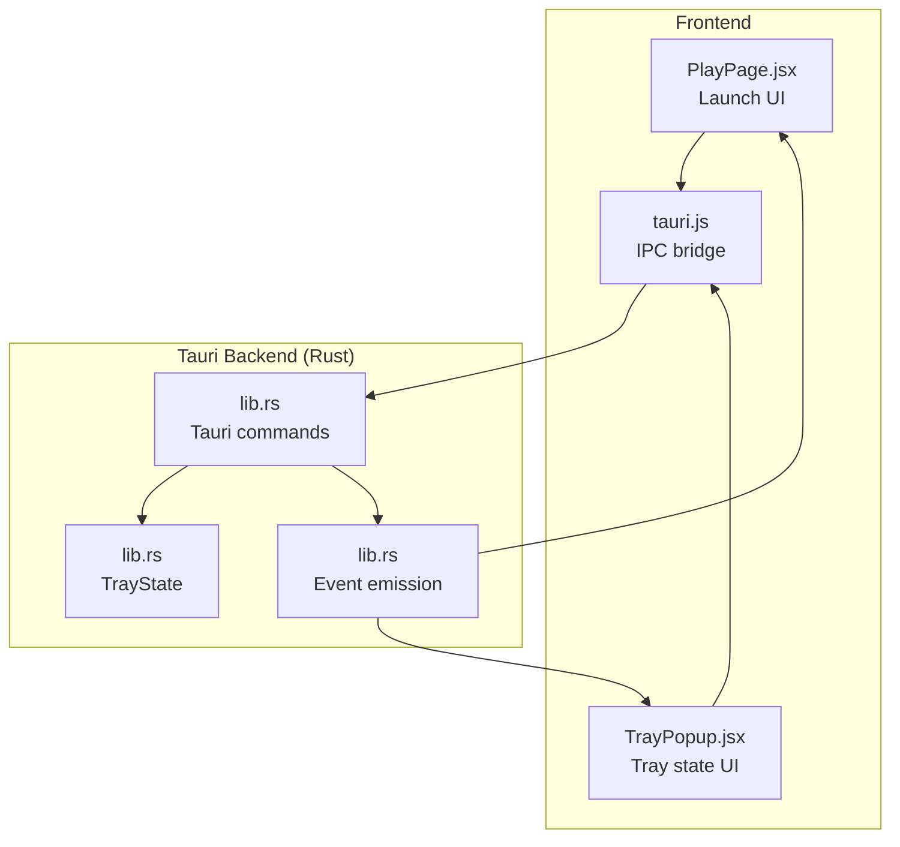
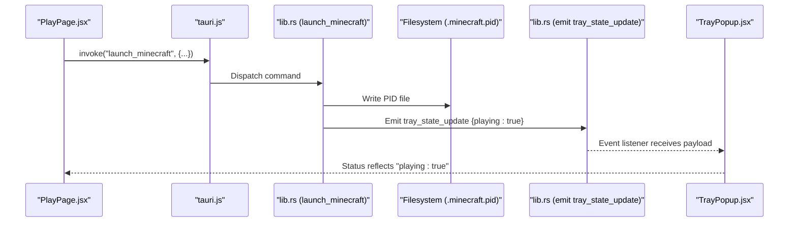
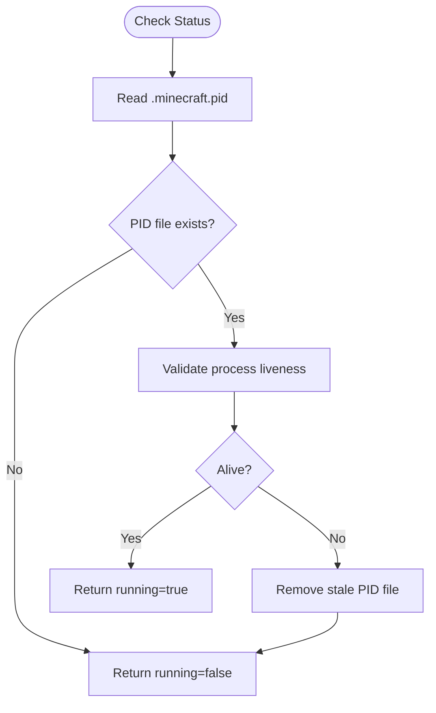
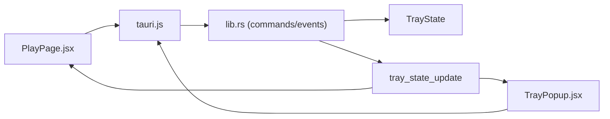

# Process Monitoring & State Tracking

<cite>
**Referenced Files in This Document**
- [lib.rs](file://src-tauri/src/lib.rs)
- [main.rs](file://src-tauri/src/main.rs)
- [PlayPage.jsx](file://src/pages/PlayPage.jsx)
- [TrayPopup.jsx](file://src/pages/TrayPopup.jsx)
- [tauri.js](file://src/lib/tauri.js)
- [main.jsx](file://src/main.jsx)
</cite>

## Table of Contents
1. [Introduction](#introduction)
2. [Project Structure](#project-structure)
3. [Core Components](#core-components)
4. [Architecture Overview](#architecture-overview)
5. [Detailed Component Analysis](#detailed-component-analysis)
6. [Dependency Analysis](#dependency-analysis)
7. [Performance Considerations](#performance-considerations)
8. [Troubleshooting Guide](#troubleshooting-guide)
9. [Conclusion](#conclusion)

## Introduction
This document explains the process monitoring system for Minecraft launcher integration within the SBGames application. It covers how the Tauri backend tracks Minecraft process status, manages runtime state, and communicates with the frontend via Tauri commands and events. The system supports launching Minecraft, detecting whether it is running, force-killing stuck processes, and broadcasting state updates to the tray popup and main UI. Desktop notifications are integrated for process-related events.

## Project Structure
The monitoring system spans three primary layers:
- Tauri backend (Rust): process lifecycle management, state updates, and event emission
- Frontend (React): UI triggers, state synchronization, and event listeners
- IPC bridge: Tauri command invocation and event subscription

**Diagram sources**
- [lib.rs](file://src-tauri/src/lib.rs)
- [PlayPage.jsx](file://src/pages/PlayPage.jsx)
- [TrayPopup.jsx](file://src/pages/TrayPopup.jsx)
- [tauri.js](file://src/lib/tauri.js)

**Section sources**
- [lib.rs](file://src-tauri/src/lib.rs)
- [PlayPage.jsx](file://src/pages/PlayPage.jsx)
- [TrayPopup.jsx](file://src/pages/TrayPopup.jsx)
- [tauri.js](file://src/lib/tauri.js)

## Core Components
- Process lifecycle commands:
  - Launch Minecraft with optional RAM and Java path parameters
  - Check current Minecraft status (running/not running)
  - Kill Minecraft process by PID
- State management:
  - TrayState maintained in backend state
  - Broadcast tray_state_update events to frontend
- Desktop notifications:
  - show_notification command for OS-level alerts

Key implementation references:
- Launch command and process tracking: [lib.rs](file://src-tauri/src/lib.rs)
- Status detection and guard-trigger handling: [lib.rs](file://src-tauri/src/lib.rs)
- Tray state update and event emission: [lib.rs](file://src-tauri/src/lib.rs)
- Frontend invocation and event listening: [PlayPage.jsx](file://src/pages/PlayPage.jsx), [TrayPopup.jsx](file://src/pages/TrayPopup.jsx), [tauri.js](file://src/lib/tauri.js)

**Section sources**
- [lib.rs](file://src-tauri/src/lib.rs)
- [PlayPage.jsx](file://src/pages/PlayPage.jsx)
- [TrayPopup.jsx](file://src/pages/TrayPopup.jsx)
- [tauri.js](file://src/lib/tauri.js)

## Architecture Overview
The monitoring architecture is event-driven and IPC-centric:
- Frontend invokes Tauri commands to launch or query Minecraft status
- Backend spawns the Minecraft process, writes a PID file, and emits tray_state_update events
- TrayPopup listens for tray_state_update to reflect live state
- Desktop notifications are triggered upon successful launch

**Diagram sources**
- [lib.rs](file://src-tauri/src/lib.rs)
- [PlayPage.jsx](file://src/pages/PlayPage.jsx)
- [TrayPopup.jsx](file://src/pages/TrayPopup.jsx)
- [tauri.js](file://src/lib/tauri.js)

## Detailed Component Analysis

### Process Lifecycle Commands
- launch_minecraft:
  - Validates single-launch constraints
  - Resolves Java runtime and launcher profiles
  - Spawns the Minecraft process and writes PID to .minecraft.pid
  - Emits tray_state_update with playing=true
  - Returns human-readable success message
- get_minecraft_status:
  - Reads PID file and validates process liveness per platform
  - Detects guard-trigger messages indicating termination reasons
- kill_minecraft:
  - Force-kills the process by PID and removes stale PID file

Implementation references:
- Launch flow and PID management: [lib.rs](file://src-tauri/src/lib.rs)
- Status detection and guard-trigger: [lib.rs](file://src-tauri/src/lib.rs)
- Kill command: [lib.rs](file://src-tauri/src/lib.rs)

**Section sources**
- [lib.rs](file://src-tauri/src/lib.rs)

### State Management and Events
- TrayState:
  - Maintains user, notifications, and playing flag
  - Updated via tray_update_state command
- Event emission:
  - tray_state_update broadcast carries user, notifs, and playing
- Frontend consumption:
  - TrayPopup listens for tray_state_update and updates UI
  - PlayPage sets launching state and displays desktop notifications after launch

Implementation references:
- TrayState and tray_update_state: [lib.rs](file://src-tauri/src/lib.rs)
- Tray event listener: [TrayPopup.jsx](file://src/pages/TrayPopup.jsx)
- Launch-side desktop notification: [PlayPage.jsx](file://src/pages/PlayPage.jsx)

**Section sources**
- [lib.rs](file://src-tauri/src/lib.rs)
- [TrayPopup.jsx](file://src/pages/TrayPopup.jsx)
- [PlayPage.jsx](file://src/pages/PlayPage.jsx)

### Frontend Integration
- PlayPage.jsx:
  - Invokes launch_minecraft with serverId, username, token, ramGb, javaPath
  - Handles modpack error reporting and sets UI state
  - Triggers desktop notification on success
- TrayPopup.jsx:
  - Retrieves initial tray state via invoke("tray_get_state")
  - Subscribes to tray_state_update events
  - Updates user, notifications, and playing flags reactively

Implementation references:
- Launch invocation and error handling: [PlayPage.jsx](file://src/pages/PlayPage.jsx)
- Tray state retrieval and event subscription: [TrayPopup.jsx](file://src/pages/TrayPopup.jsx)
- IPC bridge: [tauri.js](file://src/lib/tauri.js)

**Section sources**
- [PlayPage.jsx](file://src/pages/PlayPage.jsx)
- [TrayPopup.jsx](file://src/pages/TrayPopup.jsx)
- [tauri.js](file://src/lib/tauri.js)

### Memory Usage and Runtime Metrics
- Current implementation focuses on process presence and basic status:
  - get_system_ram_gb reports total system RAM for guidance
  - No periodic memory sampling or runtime metrics collection is present in the referenced code
- Recommendations for future enhancement:
  - Periodic polling of process memory (platform-specific APIs)
  - Structured metrics emission via events for UI dashboards

**Section sources**
- [lib.rs](file://src-tauri/src/lib.rs)

### Monitoring Intervals and Real-Time Updates
- Process liveness checks:
  - get_minecraft_status reads PID file and validates process existence
  - On Windows, uses tasklist; on Unix-like systems, uses kill -0
- Real-time state propagation:
  - Immediate tray_state_update emission upon launch
  - TrayPopup reacts instantly to state changes

**Diagram sources**
- [lib.rs](file://src-tauri/src/lib.rs)

**Section sources**
- [lib.rs](file://src-tauri/src/lib.rs)

### Desktop Notifications Integration
- show_notification command:
  - Uses tauri_plugin_notification to display OS-native alerts
- Frontend usage:
  - PlayPage triggers notification after successful launch
  - TrayPopup can also leverage notifications for state changes

**Section sources**
- [lib.rs](file://src-tauri/src/lib.rs)
- [PlayPage.jsx](file://src/pages/PlayPage.jsx)

## Dependency Analysis
- Backend-to-frontend dependencies:
  - Tauri commands invoked by frontend via tauri.js
  - Event listeners subscribed in TrayPopup.jsx for tray_state_update
- Internal dependencies:
  - TrayState managed centrally and mutated via tray_update_state
  - Event emission coordinated through app.emit

**Diagram sources**
- [lib.rs](file://src-tauri/src/lib.rs)
- [PlayPage.jsx](file://src/pages/PlayPage.jsx)
- [TrayPopup.jsx](file://src/pages/TrayPopup.jsx)
- [tauri.js](file://src/lib/tauri.js)

**Section sources**
- [lib.rs](file://src-tauri/src/lib.rs)
- [PlayPage.jsx](file://src/pages/PlayPage.jsx)
- [TrayPopup.jsx](file://src/pages/TrayPopup.jsx)
- [tauri.js](file://src/lib/tauri.js)

## Performance Considerations
- Process validation frequency:
  - Status checks rely on PID file and platform-specific liveness probes
  - Avoid excessive polling; integrate with UI refresh cycles
- Event-driven updates:
  - Use tray_state_update to minimize redundant status queries
- Resource footprint:
  - Keep event listeners scoped to components that need updates
  - Dispose listeners on component unmount to prevent leaks

## Troubleshooting Guide
Common issues and resolutions:
- Stuck process:
  - Use kill_minecraft to terminate by PID and clean stale PID file
- False positives for running:
  - Verify PID file validity and process liveness via get_minecraft_status
- Missing tray updates:
  - Ensure TrayPopup subscribes to tray_state_update and that tray_update_state is invoked from main window
- Desktop notifications not appearing:
  - Confirm tauri_plugin_notification initialization and permissions

**Section sources**
- [lib.rs](file://src-tauri/src/lib.rs)
- [TrayPopup.jsx](file://src/pages/TrayPopup.jsx)

## Conclusion
The SBGames process monitoring system provides reliable Minecraft lifecycle management through Tauri commands and event-driven state updates. While current implementation emphasizes process presence and immediate state propagation, future enhancements can introduce periodic memory/runtime metrics and structured telemetry for richer monitoring dashboards.