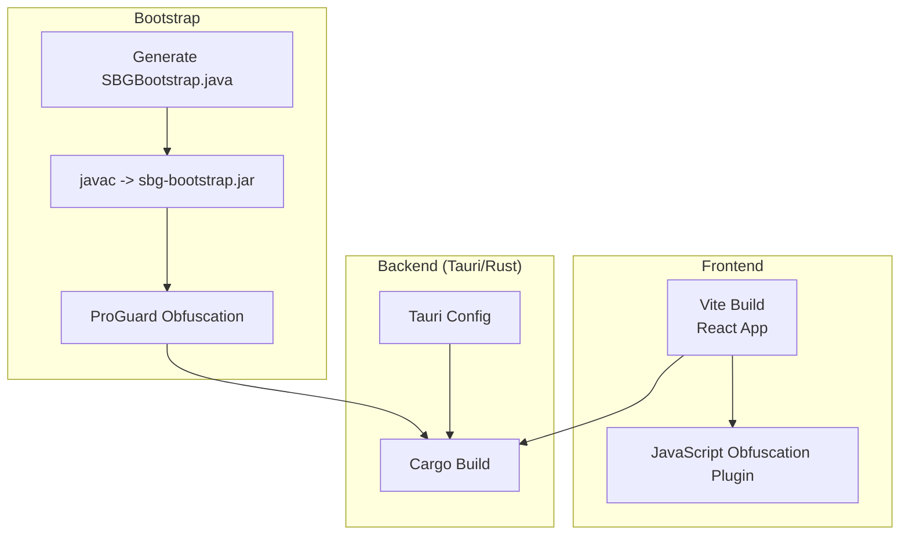
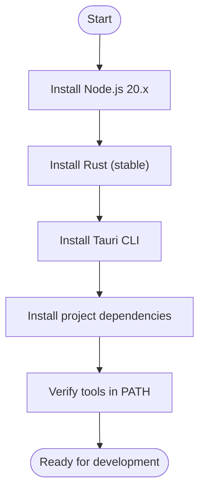
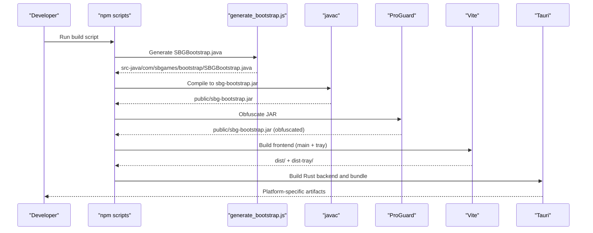
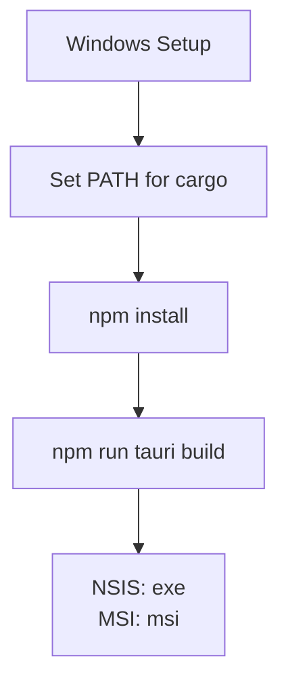
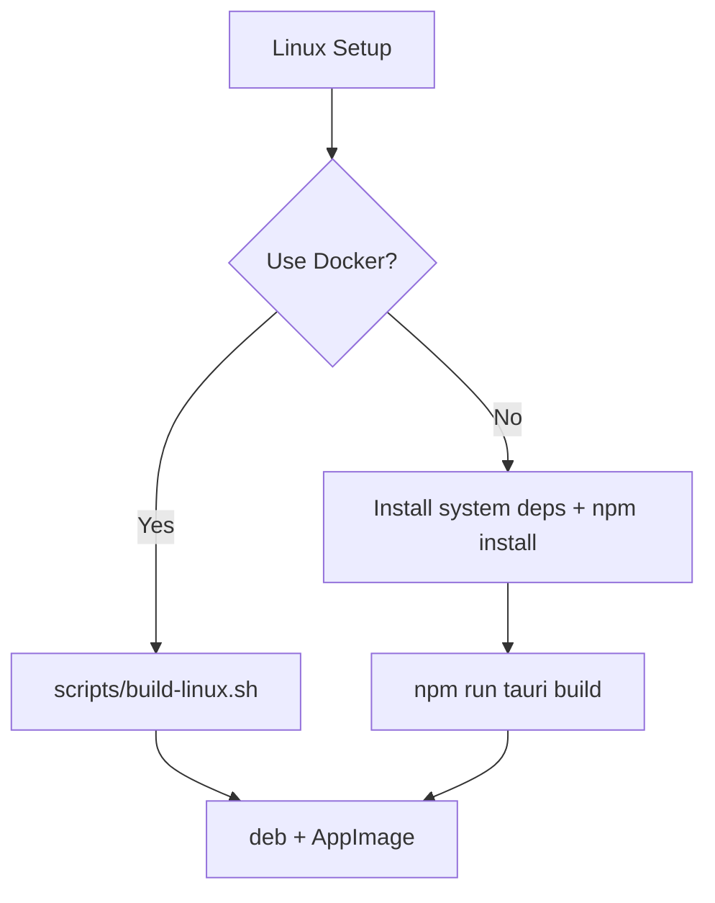
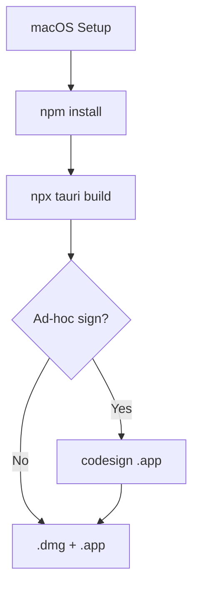

# Getting Started

<cite>
**Referenced Files in This Document**
- [package.json](file://package.json)
- [vite.config.js](file://vite.config.js)
- [src-tauri/Cargo.toml](file://src-tauri/Cargo.toml)
- [src-tauri/tauri.conf.json](file://src-tauri/tauri.conf.json)
- [scratch/generate_bootstrap.js](file://scratch/generate_bootstrap.js)
- [scratch/obfuscate.js](file://scratch/obfuscate.js)
- [scratch/setup_proguard.js](file://scratch/setup_proguard.js)
- [scratch/proguard.conf](file://scratch/proguard.conf)
- [src-java/com/sbgames/bootstrap/SBGBootstrap.java](file://src-java/com/sbgames/bootstrap/SBGBootstrap.java)
- [scripts/build-all.sh](file://scripts/build-all.sh)
- [scripts/build-linux.sh](file://scripts/build-linux.sh)
- [scripts/Dockerfile.linux](file://scripts/Dockerfile.linux)
- [BUILD.md](file://BUILD.md)
</cite>

## Table of Contents
1. [Introduction](#introduction)
2. [Project Structure](#project-structure)
3. [Prerequisites](#prerequisites)
4. [Installation and Setup](#installation-and-setup)
5. [Build Commands](#build-commands)
6. [Multi-Stage Build Process](#multi-stage-build-process)
7. [Platform-Specific Instructions](#platform-specific-instructions)
8. [Verification Steps](#verification-steps)
9. [Troubleshooting Guide](#troubleshooting-guide)
10. [Conclusion](#conclusion)

## Introduction
This guide helps you set up a complete development environment for SBGames, covering frontend (React/Vite), backend (Rust/Tauri), and Java bootstrap components. It explains the multi-stage build pipeline, platform-specific considerations, and provides verification steps to ensure everything works correctly on both Windows and Linux.

## Project Structure
The project combines:
- Frontend: React application built with Vite and obfuscated during production builds
- Backend: Tauri application written in Rust with tray support and cross-platform bundling
- Bootstrap: Java component that validates the modpack and launches the game entrypoint

**Diagram sources**
- [vite.config.js:62-96](file://vite.config.js#L62-L96)
- [package.json:6-13](file://package.json#L6-L13)
- [scratch/generate_bootstrap.js:71-266](file://scratch/generate_bootstrap.js#L71-L266)
- [scratch/obfuscate.js:5-46](file://scratch/obfuscate.js#L5-L46)
- [src-tauri/Cargo.toml:1-57](file://src-tauri/Cargo.toml#L1-L57)
- [src-tauri/tauri.conf.json:1-89](file://src-tauri/tauri.conf.json#L1-L89)

**Section sources**
- [package.json:6-13](file://package.json#L6-L13)
- [vite.config.js:62-96](file://vite.config.js#L62-L96)
- [src-tauri/tauri.conf.json:1-89](file://src-tauri/tauri.conf.json#L1-L89)

## Prerequisites
Ensure the following tools are installed and available in your PATH:

- Node.js 20.x
- npm (comes with Node.js)
- Rust toolchain (stable)
- Tauri CLI
- Java JDK (for generating and obfuscating the bootstrap JAR)
- Platform-specific system dependencies (see Platform-Specific Instructions below)

Notes:
- Tauri requires system libraries for each platform (WebKitGTK on Linux, etc.). The Dockerfile and scripts install these automatically for Linux builds.
- On Windows, ensure your PATH includes Rust’s cargo binaries.

**Section sources**
- [scripts/Dockerfile.linux:22-34](file://scripts/Dockerfile.linux#L22-L34)
- [BUILD.md:3-8](file://BUILD.md#L3-L8)

## Installation and Setup
Follow these steps to prepare your development environment:

1. Install Node.js 20.x and npm
2. Install Rust toolchain (stable) and configure your shell profile to include cargo binaries in PATH
3. Install Tauri CLI globally or use npx
4. Install project dependencies
5. Verify Node, npm, Rust, and Tauri CLI are accessible from your terminal

**Diagram sources**
- [BUILD.md:3-8](file://BUILD.md#L3-L8)
- [scripts/Dockerfile.linux:22-34](file://scripts/Dockerfile.linux#L22-L34)

**Section sources**
- [BUILD.md:3-8](file://BUILD.md#L3-L8)
- [scripts/Dockerfile.linux:22-34](file://scripts/Dockerfile.linux#L22-L34)

## Build Commands
The project defines several npm scripts to orchestrate the build pipeline. Choose the appropriate script for your workflow:

- Development
  - Run the React/Vite dev server locally
  - Command: [package.json:7](file://package.json#L7)

- Full build (Java bootstrap + Vite frontend + Tray build)
  - Generates the bootstrap JAR, obfuscates it, builds the main frontend, builds the tray frontend, merges outputs
  - Command: [package.json:9](file://package.json#L9)

- Main build only
  - Builds the bootstrap JAR and frontend, skips tray build
  - Command: [package.json:10](file://package.json#L10)

- Tray build only
  - Builds the tray frontend into a separate output directory
  - Command: [package.json:11](file://package.json#L11)

- Preview
  - Serves the built frontend locally
  - Command: [package.json:12](file://package.json#L12)

- Tauri CLI
  - Invokes Tauri commands
  - Command: [package.json:13](file://package.json#L13)

**Section sources**
- [package.json:6-13](file://package.json#L6-L13)

## Multi-Stage Build Process
The build pipeline executes in stages:

1. Generate Java bootstrap source
   - Purpose: Create SBGBootstrap.java with obfuscated constants
   - Script: [scratch/generate_bootstrap.js:71-266](file://scratch/generate_bootstrap.js#L71-L266)
   - Output: src-java/com/sbgames/bootstrap/SBGBootstrap.java

2. Compile Java bootstrap
   - Purpose: Compile the generated Java source into a JAR
   - Script: [package.json:8](file://package.json#L8)
   - Output: public/sbg-bootstrap.jar

3. Obfuscate Java bootstrap
   - Purpose: Apply ProGuard obfuscation to the JAR
   - Scripts:
     - [scratch/obfuscate.js:5-46](file://scratch/obfuscate.js#L5-L46)
     - [scratch/setup_proguard.js:33-76](file://scratch/setup_proguard.js#L33-L76)
     - [scratch/proguard.conf:1-20](file://scratch/proguard.conf#L1-L20)
   - Output: public/sbg-bootstrap.jar (overwritten with obfuscated version)

4. Build Vite frontend
   - Purpose: Bundle the React application
   - Script: [package.json:9](file://package.json#L9)
   - Behavior:
     - Normal build: [vite.config.js:79-96](file://vite.config.js#L79-L96)
     - Tray build: [vite.config.js:62-78](file://vite.config.js#L62-L78)

5. Build Tauri backend
   - Purpose: Compile Rust backend and bundle artifacts
   - Configuration: [src-tauri/tauri.conf.json:1-89](file://src-tauri/tauri.conf.json#L1-L89)
   - Dependencies: [src-tauri/Cargo.toml:1-57](file://src-tauri/Cargo.toml#L1-L57)

**Diagram sources**
- [package.json:8-13](file://package.json#L8-L13)
- [scratch/generate_bootstrap.js:71-266](file://scratch/generate_bootstrap.js#L71-L266)
- [scratch/obfuscate.js:5-46](file://scratch/obfuscate.js#L5-L46)
- [scratch/setup_proguard.js:33-76](file://scratch/setup_proguard.js#L33-L76)
- [scratch/proguard.conf:1-20](file://scratch/proguard.conf#L1-L20)
- [vite.config.js:62-96](file://vite.config.js#L62-L96)
- [src-tauri/tauri.conf.json:1-89](file://src-tauri/tauri.conf.json#L1-L89)
- [src-tauri/Cargo.toml:1-57](file://src-tauri/Cargo.toml#L1-L57)

**Section sources**
- [package.json:8-13](file://package.json#L8-L13)
- [scratch/generate_bootstrap.js:71-266](file://scratch/generate_bootstrap.js#L71-L266)
- [scratch/obfuscate.js:5-46](file://scratch/obfuscate.js#L5-L46)
- [scratch/setup_proguard.js:33-76](file://scratch/setup_proguard.js#L33-L76)
- [scratch/proguard.conf:1-20](file://scratch/proguard.conf#L1-L20)
- [vite.config.js:62-96](file://vite.config.js#L62-L96)
- [src-tauri/tauri.conf.json:1-89](file://src-tauri/tauri.conf.json#L1-L89)
- [src-tauri/Cargo.toml:1-57](file://src-tauri/Cargo.toml#L1-L57)

## Platform-Specific Instructions

### Windows
- Requirements:
  - Node.js 20.x
  - Rust toolchain (stable)
  - Tauri CLI
  - Java JDK (for bootstrap generation and obfuscation)
- Build steps:
  - Ensure cargo binaries are in PATH
  - Install dependencies
  - Build using Tauri CLI
- Artifacts:
  - NSIS installer (.exe) and MSI installer (.msi)

**Diagram sources**
- [BUILD.md:3-8](file://BUILD.md#L3-L8)

**Section sources**
- [BUILD.md:3-8](file://BUILD.md#L3-L8)

### Linux
- Requirements:
  - Node.js 20.x
  - Rust toolchain (stable)
  - System libraries for Tauri/WebKit
- Build options:
  - Local build: install system dependencies and run Tauri build
  - Docker build: automated via provided Dockerfile and scripts
- Artifacts:
  - deb package, rpm package, AppImage

**Diagram sources**
- [scripts/build-all.sh:62-73](file://scripts/build-all.sh#L62-L73)
- [scripts/build-linux.sh:1-30](file://scripts/build-linux.sh#L1-L30)
- [scripts/Dockerfile.linux:6-34](file://scripts/Dockerfile.linux#L6-L34)

**Section sources**
- [scripts/build-all.sh:62-73](file://scripts/build-all.sh#L62-L73)
- [scripts/build-linux.sh:1-30](file://scripts/build-linux.sh#L1-L30)
- [scripts/Dockerfile.linux:6-34](file://scripts/Dockerfile.linux#L6-L34)
- [BUILD.md:29-33](file://BUILD.md#L29-L33)

### macOS
- Requirements:
  - macOS host
  - Node.js 20.x
  - Rust toolchain (stable)
  - Tauri CLI
- Build steps:
  - Run the macOS build script
  - Optional ad-hoc signing for Gatekeeper compatibility
- Artifacts:
  - .dmg and .app bundles

**Diagram sources**
- [scripts/build-all.sh:75-98](file://scripts/build-all.sh#L75-L98)
- [BUILD.md:11-16](file://BUILD.md#L11-L16)

**Section sources**
- [scripts/build-all.sh:75-98](file://scripts/build-all.sh#L75-L98)
- [BUILD.md:11-16](file://BUILD.md#L11-L16)

## Verification Steps
After completing setup and build:

- Confirm frontend dev server starts:
  - Command: [package.json:7](file://package.json#L7)
- Verify Vite build completes:
  - Command: [package.json:9](file://package.json#L9)
- Verify Tauri build produces artifacts:
  - Windows: NSIS (.exe) and MSI (.msi)
  - Linux: deb, rpm, AppImage
  - macOS: dmg and app bundle
- Validate Java bootstrap:
  - Ensure sbg-bootstrap.jar exists and is obfuscated
  - Confirm obfuscation configuration is generated
- Check tray build:
  - Verify dist-tray output is generated when using tray build script

**Section sources**
- [package.json:7-13](file://package.json#L7-L13)
- [BUILD.md:3-33](file://BUILD.md#L3-L33)
- [scratch/obfuscate.js:5-46](file://scratch/obfuscate.js#L5-L46)
- [scratch/setup_proguard.js:33-76](file://scratch/setup_proguard.js#L33-L76)

## Troubleshooting Guide
Common issues and resolutions:

- Tauri build fails on Linux due to missing system dependencies
  - Resolution: Install required packages or use the Docker build script
  - Reference: [scripts/Dockerfile.linux:6-34](file://scripts/Dockerfile.linux#L6-L34), [scripts/build-all.sh:62-73](file://scripts/build-all.sh#L62-L73)

- ProGuard execution fails on Windows
  - Cause: Missing JAVA_HOME or java.base.jmod
  - Resolution: Ensure JAVA_HOME points to a JDK installation; the setup script attempts to auto-detect
  - Reference: [scratch/obfuscate.js:24-30](file://scratch/obfuscate.js#L24-L30), [scratch/setup_proguard.js:33-42](file://scratch/setup_proguard.js#L33-L42)

- macOS Gatekeeper blocks .app
  - Resolution: Ad-hoc sign the app or clear extended attributes
  - Reference: [scripts/build-all.sh:85-97](file://scripts/build-all.sh#L85-L97)

- Vite obfuscation plugin warnings
  - Cause: Obfuscator unavailable or incompatible
  - Resolution: Ensure dependencies are installed; the plugin gracefully skips when unavailable
  - Reference: [vite.config.js:42-60](file://vite.config.js#L42-L60)

- Tauri dev server conflicts
  - Cause: Port already in use
  - Resolution: Adjust server.port in Vite config or close conflicting processes
  - Reference: [vite.config.js:82-87](file://vite.config.js#L82-L87)

**Section sources**
- [scripts/Dockerfile.linux:6-34](file://scripts/Dockerfile.linux#L6-L34)
- [scripts/build-all.sh:62-73](file://scripts/build-all.sh#L62-L73)
- [scratch/obfuscate.js:24-30](file://scratch/obfuscate.js#L24-L30)
- [scratch/setup_proguard.js:33-42](file://scratch/setup_proguard.js#L33-L42)
- [scripts/build-all.sh:85-97](file://scripts/build-all.sh#L85-L97)
- [vite.config.js:42-60](file://vite.config.js#L42-L60)
- [vite.config.js:82-87](file://vite.config.js#L82-L87)

## Conclusion
You now have a complete understanding of the SBGames development environment, prerequisites, and the multi-stage build pipeline. Use the platform-specific instructions to set up your environment, run the appropriate build scripts, and verify the outputs. Refer to the troubleshooting section if you encounter platform-specific issues.