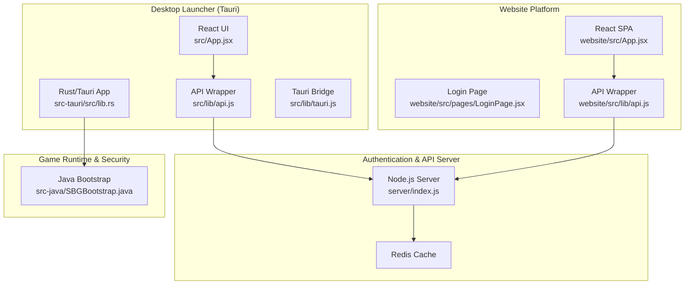
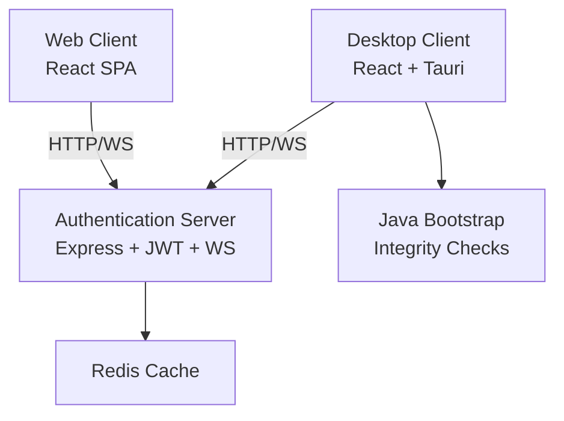
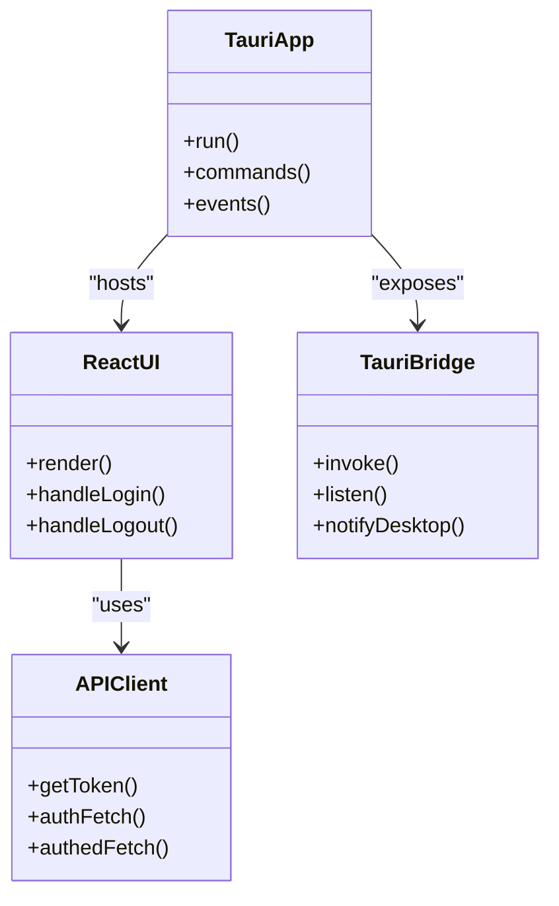
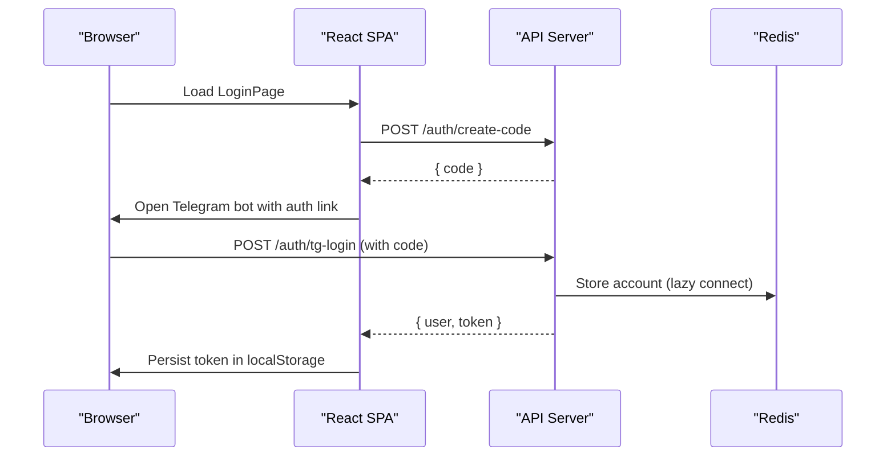
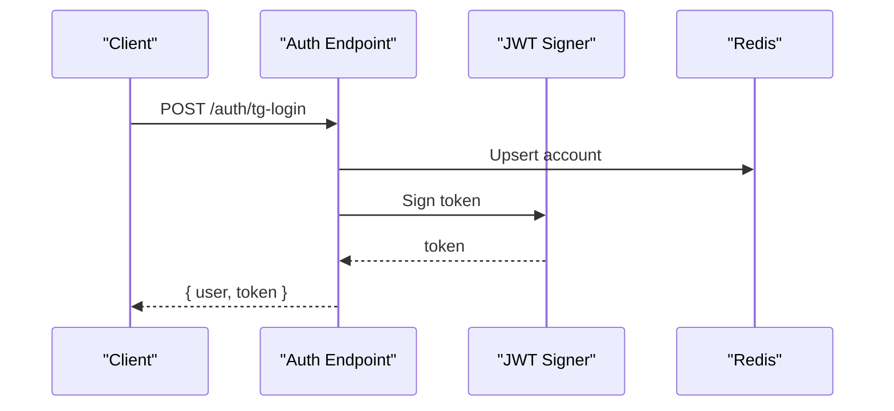
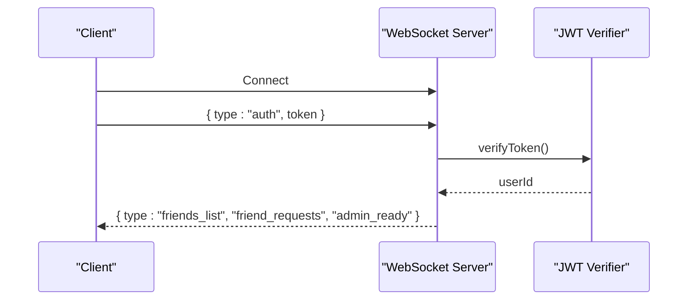
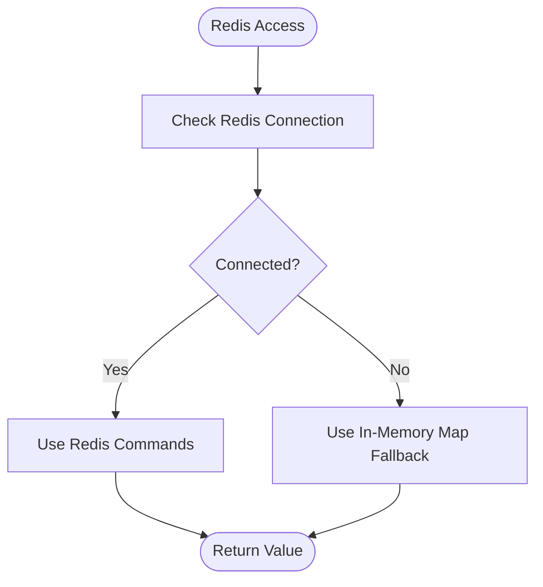
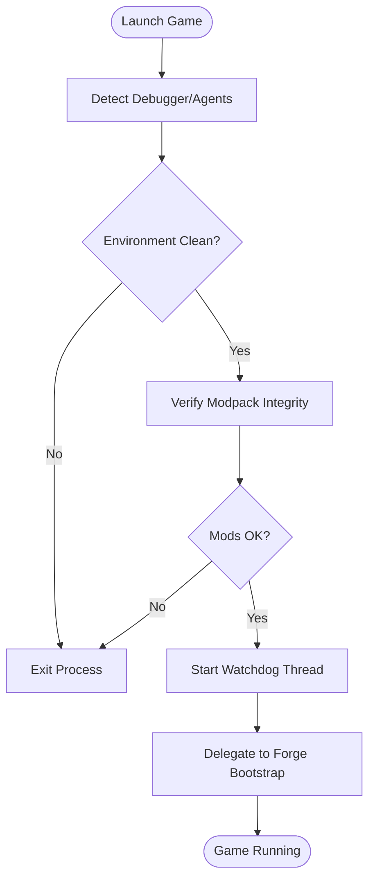
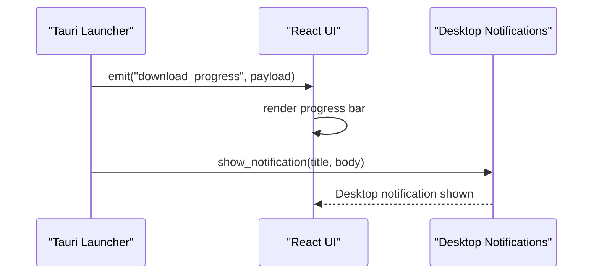
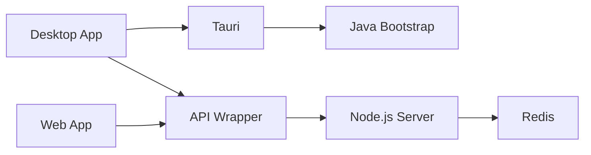

# Architecture Overview

<cite>
**Referenced Files in This Document**
- [main.rs](file://src-tauri/src/main.rs)
- [Cargo.toml](file://src-tauri/Cargo.toml)
- [lib.rs](file://src-tauri/src/lib.rs)
- [index.js](file://server/index.js)
- [App.jsx](file://src/App.jsx)
- [website/App.jsx](file://website/src/App.jsx)
- [api.js](file://src/lib/api.js)
- [website/api.js](file://website/src/lib/api.js)
- [LoginPage.jsx](file://src/pages/LoginPage.jsx)
- [website/LoginPage.jsx](file://website/src/pages/LoginPage.jsx)
- [NotificationSystem.jsx](file://src/components/NotificationSystem.jsx)
- [DownloadProgress.jsx](file://src/components/DownloadProgress.jsx)
- [tauri.js](file://src/lib/tauri.js)
- [SBGBootstrap.java](file://src-java/com/sbgames/bootstrap/SBGBootstrap.java)
</cite>

## Table of Contents
1. [Introduction](#introduction)
2. [Project Structure](#project-structure)
3. [Core Components](#core-components)
4. [Architecture Overview](#architecture-overview)
5. [Detailed Component Analysis](#detailed-component-analysis)
6. [Dependency Analysis](#dependency-analysis)
7. [Performance Considerations](#performance-considerations)
8. [Troubleshooting Guide](#troubleshooting-guide)
9. [Conclusion](#conclusion)

## Introduction
This document describes the hybrid desktop/web architecture of SBGames, focusing on how the Tauri-based desktop launcher integrates with the Node.js authentication and API server, the website platform, and the Java bootstrap security system. The system follows a layered architecture:
- Presentation Layer: React-based desktop app (Tauri) and web app (Vite/React)
- Business Logic Layer: Node.js REST/WS API server
- Data Access Layer: Redis cache and persistent storage
- Security Layer: JWT token management, Java bootstrap verification, and anti-cheat protections

The document also covers system boundaries, integration patterns, communication protocols, real-time features, file operations, and notifications.

## Project Structure
The repository is organized into distinct modules:
- Desktop launcher: Rust/Tauri application with React frontend
- Website: Vite/React single-page application
- Authentication/API server: Node.js service with Express, Redis, and WebSocket
- Java bootstrap: Security verification and integrity checks for the Minecraft runtime
- Shared utilities: API wrappers and Tauri command bindings

**Diagram sources**
- [lib.rs:1-200](file://src-tauri/src/lib.rs#L1-L200)
- [App.jsx:1-41](file://src/App.jsx#L1-L41)
- [website/App.jsx:1-60](file://website/src/App.jsx#L1-L60)
- [api.js:1-50](file://src/lib/api.js#L1-L50)
- [website/api.js:1-33](file://website/src/lib/api.js#L1-L33)
- [index.js:1-120](file://server/index.js#L1-L120)
- [SBGBootstrap.java:1-120](file://src-java/com/sbgames/bootstrap/SBGBootstrap.java#L1-L120)

**Section sources**
- [main.rs:1-7](file://src-tauri/src/main.rs#L1-L7)
- [Cargo.toml:1-57](file://src-tauri/Cargo.toml#L1-L57)

## Core Components
- Tauri Desktop App: Rust-based desktop shell hosting React UI, exposing system-level commands, notifications, and file operations.
- Website Platform: React SPA with routing and authentication flows, sharing the same API surface as the desktop app.
- Node.js Authentication Server: REST endpoints for authentication, JWT issuance, user profiles, inventory, marketplace, groups, support tickets, and WebSocket chat with rate limiting and admin features.
- Redis Cache: Fast in-memory storage for user accounts with Redis-backed persistence and in-memory fallback.
- Java Bootstrap: Integrity checks, debugger detection, and watchdog enforcement for the Minecraft runtime.

**Section sources**
- [lib.rs:1-200](file://src-tauri/src/lib.rs#L1-L200)
- [index.js:1-120](file://server/index.js#L1-L120)
- [api.js:1-50](file://src/lib/api.js#L1-L50)
- [website/api.js:1-33](file://website/src/lib/api.js#L1-L33)

## Architecture Overview
The system is designed around a hybrid model:
- Desktop and web clients share identical REST/WS endpoints behind a single Node.js API server.
- Desktop app extends functionality via Tauri commands for system-level tasks (notifications, file operations, launching Minecraft).
- Authentication uses Telegram widgets/bot flows and JWT bearer tokens; WebSocket requires token-based authentication.
- Security is enforced at multiple layers: Tauri anti-debugging, Java bootstrap integrity checks, and server-side moderation/admin controls.

**Diagram sources**
- [index.js:1-120](file://server/index.js#L1-L120)
- [lib.rs:1-200](file://src-tauri/src/lib.rs#L1-L200)
- [SBGBootstrap.java:1-120](file://src-java/com/sbgames/bootstrap/SBGBootstrap.java#L1-L120)

## Detailed Component Analysis

### Desktop Launcher (Tauri) Architecture
The desktop launcher is a Rust/Tauri application that:
- Initializes the Tauri runtime and exposes commands for system operations.
- Provides a React UI for login and main application views.
- Integrates with the Node.js server for authentication and game-related operations.
- Manages local notifications and download progress events.

**Diagram sources**
- [lib.rs:1-200](file://src-tauri/src/lib.rs#L1-L200)
- [App.jsx:1-41](file://src/App.jsx#L1-L41)
- [api.js:1-50](file://src/lib/api.js#L1-L50)
- [tauri.js:1-36](file://src/lib/tauri.js#L1-L36)

**Section sources**
- [lib.rs:1-200](file://src-tauri/src/lib.rs#L1-L200)
- [App.jsx:1-41](file://src/App.jsx#L1-L41)
- [api.js:1-50](file://src/lib/api.js#L1-L50)
- [tauri.js:1-36](file://src/lib/tauri.js#L1-L36)

### Website Platform Architecture
The website is a React SPA that:
- Shares the same API surface as the desktop app.
- Implements Telegram login via widget and code-based flows.
- Uses local storage for JWT and user state synchronization with the server.

**Diagram sources**
- [website/LoginPage.jsx:1-120](file://website/src/pages/LoginPage.jsx#L1-L120)
- [website/api.js:1-33](file://website/src/lib/api.js#L1-L33)
- [index.js:180-210](file://server/index.js#L180-L210)

**Section sources**
- [website/LoginPage.jsx:1-120](file://website/src/pages/LoginPage.jsx#L1-L120)
- [website/api.js:1-33](file://website/src/lib/api.js#L1-L33)
- [index.js:180-210](file://server/index.js#L180-L210)

### Authentication and Token Management
Both desktop and web clients authenticate against the Node.js server:
- Desktop login uses QR/code flows and polling to confirm Telegram authorization.
- Web login supports widget and code-based flows.
- JWT tokens are stored in localStorage and attached to all authenticated requests.
- WebSocket connections require a valid JWT token during authentication.

**Diagram sources**
- [LoginPage.jsx:50-90](file://src/pages/LoginPage.jsx#L50-L90)
- [website/LoginPage.jsx:20-50](file://website/src/pages/LoginPage.jsx#L20-L50)
- [index.js:140-176](file://server/index.js#L140-L176)

**Section sources**
- [LoginPage.jsx:50-90](file://src/pages/LoginPage.jsx#L50-L90)
- [website/LoginPage.jsx:20-50](file://website/src/pages/LoginPage.jsx#L20-L50)
- [index.js:140-176](file://server/index.js#L140-L176)

### Real-Time Communication (WebSocket)
The server provides a WebSocket service for chat and notifications:
- Clients authenticate with a JWT token.
- Rate limits and per-IP connection limits protect the service.
- Online presence and friend lists are broadcast to connected clients.

**Diagram sources**
- [index.js:761-793](file://server/index.js#L761-L793)

**Section sources**
- [index.js:761-793](file://server/index.js#L761-L793)

### Data Access Layer (Redis and Fallback)
The server uses Redis for fast account storage with an in-memory fallback:
- Lazy Redis connection with graceful degradation to Map.
- Account CRUD and caching operations are abstracted behind helper methods.

**Diagram sources**
- [index.js:26-36](file://server/index.js#L26-L36)

**Section sources**
- [index.js:26-36](file://server/index.js#L26-L36)

### Java Bootstrap Security System
The Java bootstrap enforces integrity and anti-cheat:
- Detects debugger presence and suspicious environment variables.
- Verifies modpack integrity against a whitelist.
- Starts a watchdog thread to continuously monitor for tampering.
- Delegates to Forge’s bootstrap launcher after passing checks.

**Diagram sources**
- [SBGBootstrap.java:217-251](file://src-java/com/sbgames/bootstrap/SBGBootstrap.java#L217-L251)
- [lib.rs:1137-1160](file://src-tauri/src/lib.rs#L1137-L1160)

**Section sources**
- [SBGBootstrap.java:217-251](file://src-java/com/sbgames/bootstrap/SBGBootstrap.java#L217-L251)
- [lib.rs:1137-1160](file://src-tauri/src/lib.rs#L1137-L1160)

### Cross-Cutting Concerns
- Notifications: Desktop notifications are handled via Tauri plugin and a custom notification window.
- Download Progress: Tauri emits progress events consumed by the React UI.
- File Operations: Secure file handling with path validation and base64 encoding for screenshots.

**Diagram sources**
- [DownloadProgress.jsx:1-36](file://src/components/DownloadProgress.jsx#L1-L36)
- [NotificationSystem.jsx:23-57](file://src/components/NotificationSystem.jsx#L23-L57)
- [tauri.js:19-36](file://src/lib/tauri.js#L19-L36)

**Section sources**
- [DownloadProgress.jsx:1-36](file://src/components/DownloadProgress.jsx#L1-L36)
- [NotificationSystem.jsx:23-57](file://src/components/NotificationSystem.jsx#L23-L57)
- [tauri.js:19-36](file://src/lib/tauri.js#L19-L36)

## Dependency Analysis
- Desktop app depends on Tauri for system integration and Rust for security-critical operations.
- Both clients depend on shared API wrappers for HTTP/WS communication.
- Server depends on Redis for caching and Express for REST/WS endpoints.
- Java bootstrap depends on Forge runtime and system-level checks.

**Diagram sources**
- [Cargo.toml:17-35](file://src-tauri/Cargo.toml#L17-L35)
- [api.js:1-50](file://src/lib/api.js#L1-L50)
- [website/api.js:1-33](file://website/src/lib/api.js#L1-L33)
- [index.js:1-120](file://server/index.js#L1-L120)

**Section sources**
- [Cargo.toml:17-35](file://src-tauri/Cargo.toml#L17-L35)
- [api.js:1-50](file://src/lib/api.js#L1-L50)
- [website/api.js:1-33](file://website/src/lib/api.js#L1-L33)
- [index.js:1-120](file://server/index.js#L1-L120)

## Performance Considerations
- Desktop app uses optimized Rust code for integrity checks and file operations, minimizing overhead.
- WebSocket rate limiting and per-IP caps prevent abuse and maintain responsiveness.
- Redis lazy connection ensures graceful degradation when cache is unavailable.
- Client-side caching via localStorage reduces redundant network calls.

## Troubleshooting Guide
- Authentication failures: Verify JWT token presence and expiration; ensure CORS allows both desktop and web origins.
- WebSocket auth errors: Confirm token validity and that clients send the auth message promptly.
- Redis connectivity: Monitor fallback behavior and ensure account data persists across restarts.
- Desktop notifications: Check Tauri permissions and notification plugin configuration.
- Java bootstrap issues: Review watchdog logs and modpack verification reports.

**Section sources**
- [index.js:761-793](file://server/index.js#L761-L793)
- [index.js:26-36](file://server/index.js#L26-L36)
- [tauri.js:19-36](file://src/lib/tauri.js#L19-L36)
- [lib.rs:1137-1160](file://src-tauri/src/lib.rs#L1137-L1160)

## Conclusion
SBGames employs a robust hybrid architecture combining a Tauri desktop launcher, a React web platform, and a Node.js API server backed by Redis. Security is enforced through JWT-based authentication, WebSocket token verification, Tauri anti-debugging, and a Java bootstrap integrity checker. The layered design promotes separation of concerns, scalability, and strong security guarantees across both desktop and web experiences.