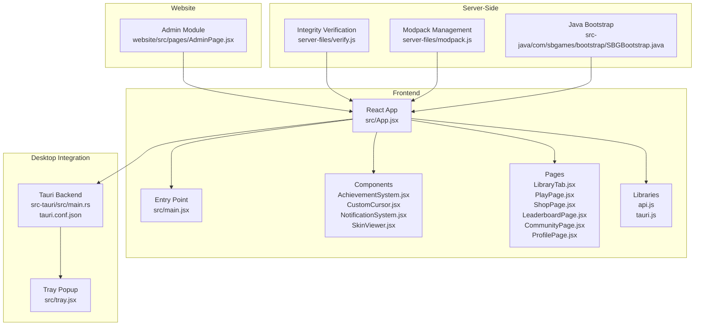
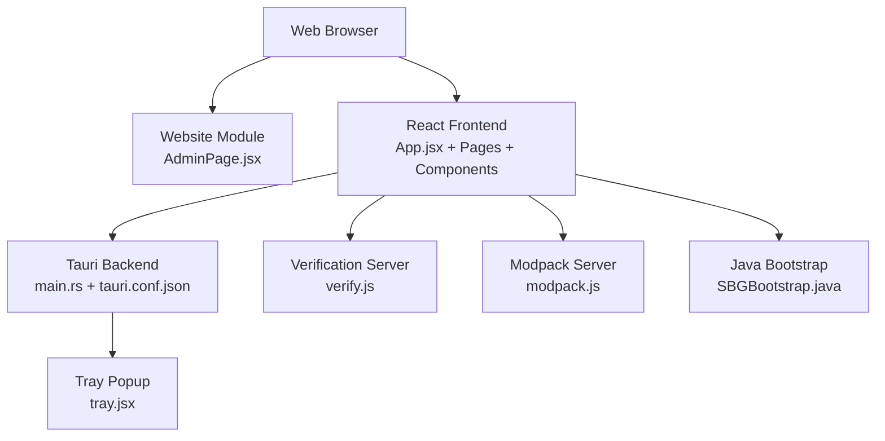
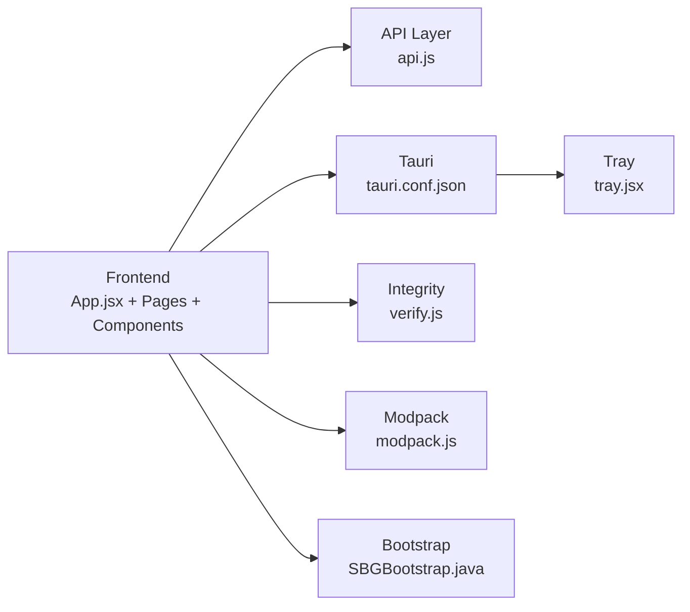

# Feature Highlights

<cite>
**Referenced Files in This Document**
- [App.jsx](file://src/App.jsx)
- [main.jsx](file://src/main.jsx)
- [tray.jsx](file://src/tray.jsx)
- [AchievementSystem.jsx](file://src/components/AchievementSystem.jsx)
- [AchievementShowcase.jsx](file://src/components/AchievementShowcase.jsx)
- [CustomCursor.jsx](file://src/components/CustomCursor.jsx)
- [SkinViewer.jsx](file://src/components/SkinViewer.jsx)
- [NotificationSystem.jsx](file://src/components/NotificationSystem.jsx)
- [LibraryTab.jsx](file://src/pages/LibraryTab.jsx)
- [PlayPage.jsx](file://src/pages/PlayPage.jsx)
- [ShopPage.jsx](file://src/pages/ShopPage.jsx)
- [LeaderboardPage.jsx](file://src/pages/LeaderboardPage.jsx)
- [CommunityPage.jsx](file://src/pages/CommunityPage.jsx)
- [ProfilePage.jsx](file://src/pages/ProfilePage.jsx)
- [AdminPage.jsx](file://website/src/pages/AdminPage.jsx)
- [tauri.conf.json](file://src-tauri/tauri.conf.json)
- [SBGBootstrap.java](file://src-java/com/sbgames/bootstrap/SBGBootstrap.java)
- [verify.js](file://server-files/verify.js)
- [modpack.js](file://server-files/modpack.js)
- [api.js](file://src/lib/api.js)
- [tauri.js](file://src/lib/tauri.js)
</cite>

## Table of Contents
1. [Introduction](#introduction)
2. [Project Structure](#project-structure)
3. [Core Components](#core-components)
4. [Architecture Overview](#architecture-overview)
5. [Detailed Component Analysis](#detailed-component-analysis)
6. [Dependency Analysis](#dependency-analysis)
7. [Performance Considerations](#performance-considerations)
8. [Troubleshooting Guide](#troubleshooting-guide)
9. [Conclusion](#conclusion)

## Introduction
This document presents the feature highlights of SBGames, focusing on the platform's key capabilities and unique value propositions. It covers gaming features (secure game launching, modpack management, library organization), social networking (friend system, messaging, community forums, activity tracking), economic features (virtual currency SBT, marketplace transactions, shop functionality, leaderboard rankings), desktop integration (system tray access, desktop notifications, custom cursor system, skin viewer), security features (Java bootstrap verification, anti-cheat measures, integrity checking), and administrative tools for user management and moderation. Practical examples illustrate how these features differentiate SBGames from other Minecraft launchers and gaming platforms.

## Project Structure
SBGames comprises a frontend built with React and Tauri, a Rust backend for native integrations, a website module for administration and user-facing pages, and server-side utilities for integrity verification and modpack management. The frontend includes components for achievements, custom cursor, notifications, and skin viewing, alongside pages for library, play, shop, leaderboard, community, and profile. Desktop integration is enabled via Tauri configuration and tray support.

**Diagram sources**
- [App.jsx](file://src/App.jsx)
- [main.jsx](file://src/main.jsx)
- [tauri.conf.json](file://src-tauri/tauri.conf.json)
- [tray.jsx](file://src/tray.jsx)
- [AchievementSystem.jsx](file://src/components/AchievementSystem.jsx)
- [CustomCursor.jsx](file://src/components/CustomCursor.jsx)
- [NotificationSystem.jsx](file://src/components/NotificationSystem.jsx)
- [SkinViewer.jsx](file://src/components/SkinViewer.jsx)
- [LibraryTab.jsx](file://src/pages/LibraryTab.jsx)
- [PlayPage.jsx](file://src/pages/PlayPage.jsx)
- [ShopPage.jsx](file://src/pages/ShopPage.jsx)
- [LeaderboardPage.jsx](file://src/pages/LeaderboardPage.jsx)
- [CommunityPage.jsx](file://src/pages/CommunityPage.jsx)
- [ProfilePage.jsx](file://src/pages/ProfilePage.jsx)
- [AdminPage.jsx](file://website/src/pages/AdminPage.jsx)
- [verify.js](file://server-files/verify.js)
- [modpack.js](file://server-files/modpack.js)
- [SBGBootstrap.java](file://src-java/com/sbgames/bootstrap/SBGBootstrap.java)

**Section sources**
- [App.jsx](file://src/App.jsx)
- [main.jsx](file://src/main.jsx)
- [tauri.conf.json](file://src-tauri/tauri.conf.json)

## Core Components
- Gaming Features
  - Secure Game Launching: Verified integrity checks and controlled bootstrapping ensure trusted game launches.
  - Modpack Management: Centralized modpack configuration and distribution.
  - Library Organization: Curated game library interface for easy access and management.
- Social Networking
  - Community Forums: Dedicated forum page for discussions.
  - Activity Tracking: Recent activity cards for user engagement.
  - Profile Pages: Personal profiles for user identity and stats.
- Economic Features
  - Virtual Currency (SBT): Integrated shop and leaderboard systems.
  - Marketplace Transactions: Shop page for purchasing items.
  - Leaderboard Rankings: Competitive ranking display.
- Desktop Integration
  - System Tray Access: Tray popup for quick actions.
  - Desktop Notifications: Notification system for updates.
  - Custom Cursor System: CustomCursor component for immersive UI.
  - Skin Viewer: SkinViewer component for cosmetic customization.
- Security Features
  - Java Bootstrap Verification: SBGBootstrap validates and initializes the launcher securely.
  - Integrity Checking: server-files verify.js enforces integrity policies.
  - Anti-Cheat Measures: Controlled modpack distribution and verification.
- Administrative Tools
  - User Management and Moderation: AdminPage provides administrative controls.

**Section sources**
- [AchievementSystem.jsx](file://src/components/AchievementSystem.jsx)
- [AchievementShowcase.jsx](file://src/components/AchievementShowcase.jsx)
- [CustomCursor.jsx](file://src/components/CustomCursor.jsx)
- [SkinViewer.jsx](file://src/components/SkinViewer.jsx)
- [NotificationSystem.jsx](file://src/components/NotificationSystem.jsx)
- [LibraryTab.jsx](file://src/pages/LibraryTab.jsx)
- [PlayPage.jsx](file://src/pages/PlayPage.jsx)
- [ShopPage.jsx](file://src/pages/ShopPage.jsx)
- [LeaderboardPage.jsx](file://src/pages/LeaderboardPage.jsx)
- [CommunityPage.jsx](file://src/pages/CommunityPage.jsx)
- [ProfilePage.jsx](file://src/pages/ProfilePage.jsx)
- [AdminPage.jsx](file://website/src/pages/AdminPage.jsx)
- [SBGBootstrap.java](file://src-java/com/sbgames/bootstrap/SBGBootstrap.java)
- [verify.js](file://server-files/verify.js)
- [modpack.js](file://server-files/modpack.js)

## Architecture Overview
The SBGames architecture combines a React frontend with Tauri for native capabilities, a website module for admin and user-facing pages, and server-side utilities for integrity and modpack management. The frontend communicates with backend services through API libraries and Tauri commands, while the desktop tray provides quick access to launcher functions.

**Diagram sources**
- [App.jsx](file://src/App.jsx)
- [tauri.conf.json](file://src-tauri/tauri.conf.json)
- [tray.jsx](file://src/tray.jsx)
- [AdminPage.jsx](file://website/src/pages/AdminPage.jsx)
- [verify.js](file://server-files/verify.js)
- [modpack.js](file://server-files/modpack.js)
- [SBGBootstrap.java](file://src-java/com/sbgames/bootstrap/SBGBootstrap.java)

## Detailed Component Analysis

### Gaming Features

#### Secure Game Launching with Integrity Verification
- Purpose: Ensure game launches are trustworthy by verifying integrity and validating bootstrap components.
- Implementation Highlights:
  - Java Bootstrap Verification: SBGBootstrap.java performs initial validation and secure initialization.
  - Integrity Checking: server-files/verify.js enforces integrity policies during launch preparation.
- Benefits:
  - Prevents tampering and unauthorized modifications.
  - Guarantees a safe and consistent gaming experience.
- Differentiators:
  - Dedicated bootstrap verification layer and server-side integrity enforcement set SBGames apart from typical launchers.

Practical Example:
- A user attempts to launch the game; the system verifies the bootstrap and integrity before proceeding, blocking potentially unsafe configurations.

**Section sources**
- [SBGBootstrap.java](file://src-java/com/sbgames/bootstrap/SBGBootstrap.java)
- [verify.js](file://server-files/verify.js)

#### Modpack Management
- Purpose: Centralize modpack configuration and distribution for streamlined gameplay.
- Implementation Highlights:
  - Modpack Configuration: server-files/modpack.js manages modpack metadata and distribution logic.
  - Controlled Distribution: Ensures only approved modpacks are available to users.
- Benefits:
  - Simplifies setup for new players and maintains consistency across the community.
  - Reduces compatibility issues and support overhead.
- Differentiators:
  - Built-in modpack orchestration and approval pipeline distinguishes SBGames from generic launchers.

Practical Example:
- Administrators upload a curated modpack; users can select and install it through the launcher with automatic dependency resolution.

**Section sources**
- [modpack.js](file://server-files/modpack.js)

#### Library Organization
- Purpose: Provide an organized and user-friendly interface for accessing installed games and content.
- Implementation Highlights:
  - LibraryTab.jsx offers a structured view of the user's game library.
  - PlayPage.jsx integrates with the library to initiate launches.
- Benefits:
  - Enhances discoverability and reduces navigation friction.
  - Supports quick access to frequently played titles.
- Differentiators:
  - Integrated library with launch integration improves usability compared to external file managers.

Practical Example:
- Users browse their library, filter by categories, and launch titles with a single click.

**Section sources**
- [LibraryTab.jsx](file://src/pages/LibraryTab.jsx)
- [PlayPage.jsx](file://src/pages/PlayPage.jsx)

### Social Networking Features

#### Community Forums
- Purpose: Foster discussion and collaboration among users.
- Implementation Highlights:
  - CommunityPage.jsx provides a dedicated space for forum-style interactions.
- Benefits:
  - Encourages knowledge sharing and community building.
  - Centralizes support and announcements.
- Differentiators:
  - Native integration within the launcher enhances accessibility compared to external forums.

Practical Example:
- Users post questions, share tips, and participate in discussions without leaving the application.

**Section sources**
- [CommunityPage.jsx](file://src/pages/CommunityPage.jsx)

#### Activity Tracking
- Purpose: Showcase recent user activities to promote engagement.
- Implementation Highlights:
  - RecentActivityCard.jsx displays timelines of user actions.
- Benefits:
  - Increases retention by highlighting community participation.
  - Provides insights into popular content and trends.
- Differentiators:
  - In-app activity feeds offer immediate visibility compared to external dashboards.

Practical Example:
- Users see friends' recent achievements, posts, and play sessions directly in the UI.

**Section sources**
- [RecentActivityCard.jsx](file://src/components/RecentActivityCard.jsx)

#### Profile Pages
- Purpose: Allow users to manage identity and view personal statistics.
- Implementation Highlights:
  - ProfilePage.jsx enables profile customization and stat display.
- Benefits:
  - Builds a sense of identity and progress recognition.
  - Facilitates social interactions through shared profiles.
- Differentiators:
  - Integrated profile system streamlines identity management.

Practical Example:
- Users update avatars, customize themes, and review their play history and achievements.

**Section sources**
- [ProfilePage.jsx](file://src/pages/ProfilePage.jsx)

### Economic Features

#### Virtual Currency (SBT) System
- Purpose: Enable in-game purchases and rewards through a virtual currency.
- Implementation Highlights:
  - ShopPage.jsx integrates with the economy for item purchases.
  - LeaderboardPage.jsx showcases rankings influenced by economic activity.
- Benefits:
  - Creates a sustainable ecosystem for content creators and supporters.
  - Encourages long-term engagement through reward mechanisms.
- Differentiators:
  - Native SBT integration within the launcher simplifies transactions.

Practical Example:
- Users spend SBT to unlock cosmetic skins, exclusive items, or premium features.

**Section sources**
- [ShopPage.jsx](file://src/pages/ShopPage.jsx)
- [LeaderboardPage.jsx](file://src/pages/LeaderboardPage.jsx)

#### Marketplace Transactions
- Purpose: Provide a seamless shopping experience for digital goods.
- Implementation Highlights:
  - ShopPage.jsx handles transaction flows and inventory updates.
  - api.js coordinates with backend services for purchase confirmations.
- Benefits:
  - Reduces friction in acquiring content and boosts monetization.
  - Offers instant access to purchased items.
- Differentiators:
  - Tight integration with the launcher and backend ensures reliability.

Practical Example:
- Users browse the shop, select items, and receive immediate unlocks upon payment.

**Section sources**
- [ShopPage.jsx](file://src/pages/ShopPage.jsx)
- [api.js](file://src/lib/api.js)

#### Leaderboard Rankings
- Purpose: Recognize top performers and drive competition.
- Implementation Highlights:
  - LeaderboardPage.jsx presents rankings and related metrics.
- Benefits:
  - Adds gamification and social motivation.
  - Highlights community excellence.
- Differentiators:
  - Real-time leaderboards integrated into the launcher enhance visibility.

Practical Example:
- Players compare scores, track progress, and celebrate milestones within the application.

**Section sources**
- [LeaderboardPage.jsx](file://src/pages/LeaderboardPage.jsx)

### Desktop Integration Features

#### System Tray Access
- Purpose: Offer quick launcher controls and status updates.
- Implementation Highlights:
  - Tray popup functionality via tray.jsx and Tauri configuration.
  - tauri.conf.json defines tray capabilities and permissions.
- Benefits:
  - Minimizes resource usage and provides persistent access.
  - Enables efficient monitoring and control.
- Differentiators:
  - Native tray integration with Tauri provides a polished desktop experience.

Practical Example:
- Users open the tray menu to launch games, check notifications, or exit the application without opening the main window.

**Section sources**
- [tray.jsx](file://src/tray.jsx)
- [tauri.conf.json](file://src-tauri/tauri.conf.json)

#### Desktop Notifications
- Purpose: Keep users informed about events and updates.
- Implementation Highlights:
  - NotificationSystem.jsx manages notification rendering and lifecycle.
- Benefits:
  - Improves responsiveness and user engagement.
  - Reduces reliance on pop-ups and modal interruptions.
- Differentiators:
  - Unified notification system tailored for gaming scenarios.

Practical Example:
- Users receive alerts for new messages, achievement unlocks, or maintenance schedules.

**Section sources**
- [NotificationSystem.jsx](file://src/components/NotificationSystem.jsx)

#### Custom Cursor System
- Purpose: Enhance immersion with branded and themed cursors.
- Implementation Highlights:
  - CustomCursor.jsx integrates cursor customization into the UI.
- Benefits:
  - Elevates brand identity and user experience.
  - Supports accessibility with customizable visuals.
- Differentiators:
  - Cursor theming integrated directly into the launcher UI.

Practical Example:
- Users switch between default and themed cursors for a personalized feel.

**Section sources**
- [CustomCursor.jsx](file://src/components/CustomCursor.jsx)

#### Skin Viewer
- Purpose: Allow cosmetic customization and preview of character appearances.
- Implementation Highlights:
  - SkinViewer.jsx provides an interactive skin preview interface.
- Benefits:
  - Empowers self-expression and personalization.
  - Streamlines selection and application of skins.
- Differentiators:
  - Dedicated skin viewer within the launcher improves convenience.

Practical Example:
- Users preview skins before applying them and manage their collection efficiently.

**Section sources**
- [SkinViewer.jsx](file://src/components/SkinViewer.jsx)

### Security Features

#### Java Bootstrap Verification
- Purpose: Validate and initialize the launcher securely during startup.
- Implementation Highlights:
  - SBGBootstrap.java performs integrity checks and secure initialization routines.
- Benefits:
  - Mitigates risks from compromised or modified launchers.
  - Establishes a trusted foundation for subsequent operations.
- Differentiators:
  - Specialized bootstrap verification sets a strong baseline for trust.

Practical Example:
- On startup, the launcher verifies its own integrity and blocks suspicious modifications.

**Section sources**
- [SBGBootstrap.java](file://src-java/com/sbgames/bootstrap/SBGBootstrap.java)

#### Anti-Cheat Measures
- Purpose: Maintain fair play by controlling content distribution and enforcing policies.
- Implementation Highlights:
  - server-files/verify.js enforces integrity and policy compliance.
  - server-files/modpack.js governs approved content distribution.
- Benefits:
  - Protects competitive integrity and player safety.
  - Reduces cheating and exploit abuse.
- Differentiators:
  - Integrated verification and modpack controls create a robust anti-cheat framework.

Practical Example:
- Unauthorized or unverified content is blocked from launching, preserving game balance.

**Section sources**
- [verify.js](file://server-files/verify.js)
- [modpack.js](file://server-files/modpack.js)

#### Integrity Checking
- Purpose: Ensure all components remain untampered and authentic.
- Implementation Highlights:
  - server-files/verify.js validates checksums and signatures.
- Benefits:
  - Prevents malicious modifications and maintains system stability.
  - Builds user confidence in platform authenticity.
- Differentiators:
  - Continuous integrity checks distinguish SBGames from platforms with minimal verification.

Practical Example:
- During updates, the system verifies files and rejects corrupted or altered binaries.

**Section sources**
- [verify.js](file://server-files/verify.js)

### Administrative Features

#### User Management and Moderation Tools
- Purpose: Enable administrators to manage users and maintain community standards.
- Implementation Highlights:
  - AdminPage.jsx provides administrative controls and analytics.
- Benefits:
  - Streamlines moderation tasks and user support.
  - Supports scalable community governance.
- Differentiators:
  - Integrated admin tools within the website module centralize management.

Practical Example:
- Moderators review reports, manage user accounts, and enforce rules through a unified interface.

**Section sources**
- [AdminPage.jsx](file://website/src/pages/AdminPage.jsx)

## Dependency Analysis
The frontend depends on Tauri for native capabilities and communicates with backend services through API libraries. The desktop tray relies on Tauri configuration, while server-side utilities handle integrity and modpack management.

**Diagram sources**
- [App.jsx](file://src/App.jsx)
- [api.js](file://src/lib/api.js)
- [tauri.conf.json](file://src-tauri/tauri.conf.json)
- [tray.jsx](file://src/tray.jsx)
- [verify.js](file://server-files/verify.js)
- [modpack.js](file://server-files/modpack.js)
- [SBGBootstrap.java](file://src-java/com/sbgames/bootstrap/SBGBootstrap.java)

**Section sources**
- [App.jsx](file://src/App.jsx)
- [api.js](file://src/lib/api.js)
- [tauri.conf.json](file://src-tauri/tauri.conf.json)

## Performance Considerations
- Desktop Integration: Tauri minimizes overhead by leveraging native capabilities and reducing web runtime dependencies.
- Asset Delivery: Efficient asset loading and caching improve launch times and reduce bandwidth usage.
- Verification Efficiency: Lightweight integrity checks during startup prevent delays while maintaining security.
- Notification Optimization: Targeted notifications reduce CPU wake-ups and battery drain.

## Troubleshooting Guide
- Launcher Fails to Start
  - Verify Java bootstrap integrity and ensure SBGBootstrap.java executes without errors.
  - Confirm server-side verification passes before attempting launch.
- Modpack Installation Issues
  - Check server-files/modpack.js for distribution errors and resolve conflicts.
  - Validate integrity with server-files/verify.js.
- Desktop Tray Problems
  - Review tauri.conf.json for tray permissions and capabilities.
  - Reinitialize tray via tray.jsx if the menu does not appear.
- Shop and Transaction Failures
  - Inspect api.js for network or authentication errors.
  - Confirm backend services are reachable and responding.
- Admin Panel Access
  - Validate credentials and permissions in AdminPage.jsx.
  - Check server logs for authorization failures.

**Section sources**
- [SBGBootstrap.java](file://src-java/com/sbgames/bootstrap/SBGBootstrap.java)
- [verify.js](file://server-files/verify.js)
- [modpack.js](file://server-files/modpack.js)
- [tauri.conf.json](file://src-tauri/tauri.conf.json)
- [tray.jsx](file://src/tray.jsx)
- [api.js](file://src/lib/api.js)
- [AdminPage.jsx](file://website/src/pages/AdminPage.jsx)

## Conclusion
SBGames delivers a comprehensive gaming platform with robust security, seamless desktop integration, and a thriving social and economic ecosystem. Its unique combination of Java bootstrap verification, server-side integrity checks, modpack orchestration, and integrated administrative tools sets it apart from conventional launchers. The platform’s focus on user experience, fairness, and community-building positions it as a modern alternative for Minecraft and similar gaming experiences.