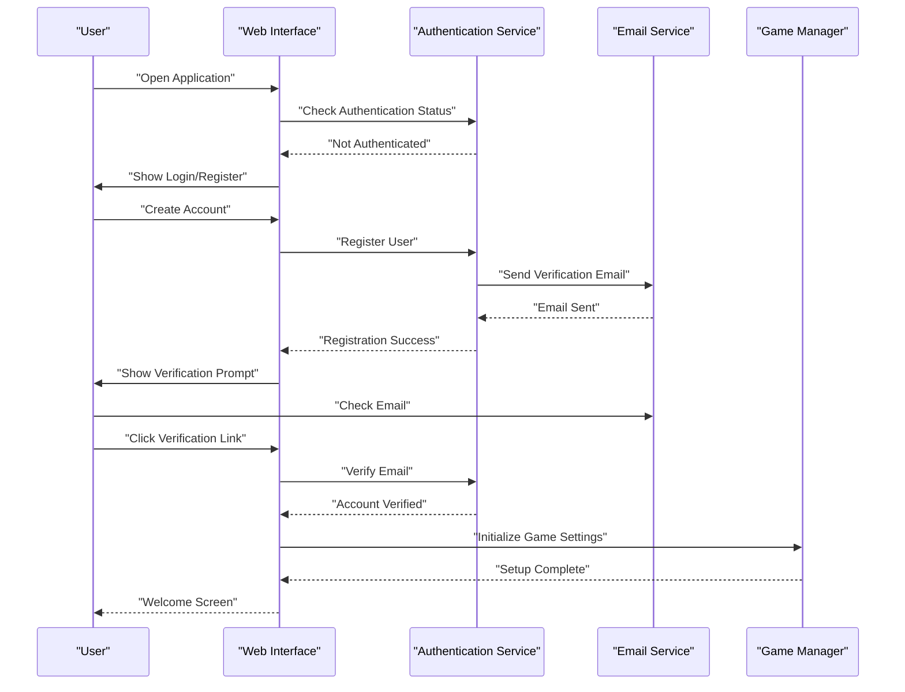
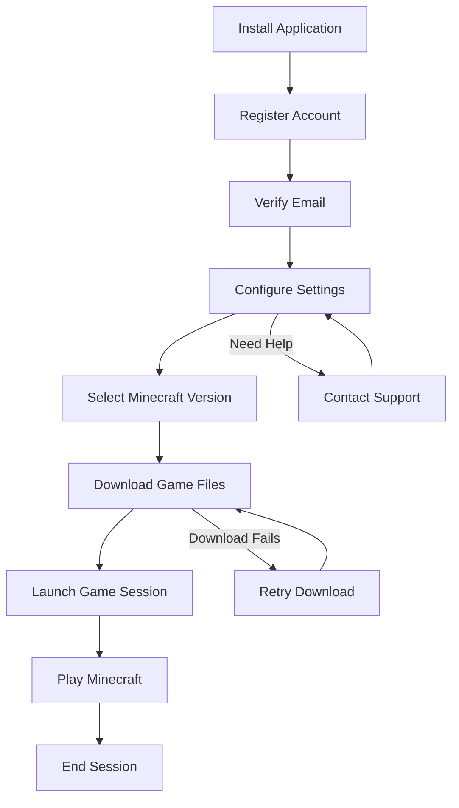
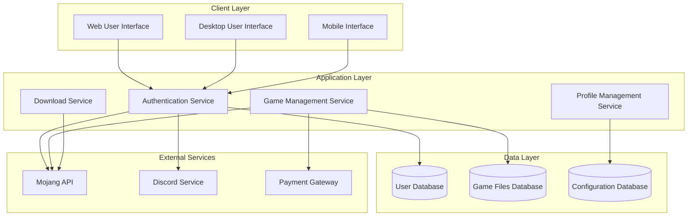

# Getting Started

<cite>
**Referenced Files in This Document**
- [package.json](file://package.json)
- [vite.config.js](file://vite.config.js)
- [tailwind.config.js](file://tailwind.config.js)
- [postcss.config.js](file://postcss.config.js)
- [src/main.jsx](file://src/main.jsx)
- [src/App.jsx](file://src/App.jsx)
- [src/pages/MainLayout.jsx](file://src/pages/MainLayout.jsx)
- [src/pages/LoginPage.jsx](file://src/pages/LoginPage.jsx)
- [src/pages/PlayPage.jsx](file://src/pages/PlayPage.jsx)
- [src/lib/api.js](file://src/lib/api.js)
- [src/lib/tauri.js](file://src/lib/tauri.js)
- [dist-tray/tray.html](file://dist-tray/tray.html)
- [dist-tray/notification.html](file://dist-tray/notification.html)
- [site/index.html](file://site/index.html)
- [website/src/pages/HomePage.jsx](file://website/src/pages/HomePage.jsx)
- [website/src/pages/DownloadPage.jsx](file://website/src/pages/DownloadPage.jsx)
- [website/src/pages/LoginPage.jsx](file://website/src/pages/LoginPage.jsx)
- [website/src/App.jsx](file://website/src/App.jsx)
- [website/package.json](file://website/package.json)
- [src-tauri/tauri.conf.json](file://src-tauri/tauri.conf.json)
- [src-tauri/Cargo.toml](file://src-tauri/Cargo.toml)
- [src-tauri/src/main.rs](file://src-tauri/src/main.rs)
- [src-tauri/build.rs](file://src-tauri/build.rs)
- [scripts/build-all.sh](file://scripts/build-all.sh)
- [scripts/build-linux.sh](file://scripts/build-linux.sh)
- [BUILD.md](file://BUILD.md)
</cite>

## Table of Contents
1. [Introduction](#introduction)
2. [Project Structure](#project-structure)
3. [System Requirements](#system-requirements)
4. [Installation Guide](#installation-guide)
5. [Initial Setup](#initial-setup)
6. [Basic Workflow](#basic-workflow)
7. [Common First-Run Issues](#common-first-run-issues)
8. [Architecture Overview](#architecture-overview)
9. [Troubleshooting Guide](#troubleshooting-guide)
10. [Conclusion](#conclusion)

## Introduction
SBGames is a Minecraft launcher platform built with modern web technologies and Tauri. It provides a unified desktop and web experience for managing Minecraft profiles, downloading game versions, and launching sessions. The platform consists of:
- A React-based web application for the main interface
- A Tauri desktop application wrapper
- A separate website for public access and downloads
- A server-side component for backend services

The platform supports cross-platform deployment and offers both desktop and web-based access to Minecraft gaming experiences.

## Project Structure
The SBGames project follows a modular architecture with distinct components for different platforms and functionalities:

```mermaid
graph TB
subgraph "Web Application"
WebApp[React Web App]
Pages[Pages & Components]
API[API Layer]
end
subgraph "Desktop Application"
Tauri[Tauri Desktop Wrapper]
RustCore[Rust Backend]
Tray[Tray Interface]
end
subgraph "Website"
PublicSite[Public Website]
Download[Download Page]
Home[Home Page]
end
subgraph "Server"
Server[Node.js Server]
Config[Server Config]
end
WebApp --> API
Tauri --> RustCore
Tauri --> API
PublicSite --> Server
Download --> Server
Home --> Server
```

**Diagram sources**
- [src/main.jsx](file://src/main.jsx)
- [src-tauri/src/main.rs](file://src-tauri/src/main.rs)
- [website/src/App.jsx](file://website/src/App.jsx)
- [server/package.json](file://server/package.json)

**Section sources**
- [package.json](file://package.json)
- [vite.config.js](file://vite.config.js)
- [website/package.json](file://website/package.json)

## System Requirements
SBGames requires the following minimum system specifications:

### Operating Systems
- Windows 10/11 (64-bit recommended)
- macOS 10.14 or later
- Linux distributions with systemd support

### Hardware Specifications
- CPU: Intel Core i3 or equivalent
- RAM: 4 GB minimum (8 GB recommended)
- Storage: 2 GB available space for game files
- Graphics: DirectX 9 compatible or OpenGL 2.1+ capable

### Software Prerequisites
- Node.js 16.x or later
- npm 8.x or later
- Git for source code management
- Java Runtime Environment (for Minecraft launching)

### Network Requirements
- Stable internet connection for game downloads
- Outbound access to Minecraft servers
- Firewall exceptions for game ports (25565 TCP)

**Section sources**
- [package.json](file://package.json)
- [src-tauri/Cargo.toml](file://src-tauri/Cargo.toml)

## Installation Guide

### Desktop Application Installation
1. **Download the installer**
   - Visit the official website's download page
   - Select your operating system variant
   - Download the latest release package

2. **Install prerequisites**
   - Ensure Java Runtime Environment is installed
   - Verify sufficient disk space is available
   - Close other resource-intensive applications

3. **Run the installer**
   - Execute the downloaded installer file
   - Follow the installation wizard prompts
   - Choose installation directory (default recommended)

4. **Complete installation**
   - Launch the application after installation
   - Allow firewall permissions if prompted
   - Verify installation success

### Web Platform Access
1. **Browser Requirements**
   - Chrome 90+ or Firefox 88+
   - Safari 14+ (macOS)
   - Enable JavaScript and cookies

2. **Access the Platform**
   - Navigate to the official website URL
   - Wait for the React application to load
   - Verify all components render correctly

3. **First-Time Web Access**
   - Clear browser cache if loading issues occur
   - Disable ad blockers temporarily
   - Check browser console for errors

### Additional Components
1. **Game Management Tools**
   - Minecraft Launcher (if not using integrated launcher)
   - Java Development Kit (for development)
   - Git for version control

2. **Development Dependencies**
   - Node.js development tools
   - Rust compiler (for desktop builds)
   - Build utilities

**Section sources**
- [website/src/pages/DownloadPage.jsx](file://website/src/pages/DownloadPage.jsx)
- [dist-tray/tray.html](file://dist-tray/tray.html)

## Initial Setup

### Account Registration Process
1. **Navigate to Registration**
   - Open the web application or desktop client
   - Click "Create Account" or "Sign Up"
   - Fill in required personal information

2. **Email Verification**
   - Check email inbox for verification message
   - Click verification link in confirmation email
   - Wait for email delivery (may take up to 5 minutes)

3. **Profile Completion**
   - Set preferred username and password
   - Configure account security settings
   - Complete profile information

### First-Time Configuration
1. **Application Preferences**
   - Set game directory location
   - Configure Java executable path
   - Adjust memory allocation settings

2. **Network Settings**
   - Configure proxy settings if behind firewall
   - Set download bandwidth limits
   - Configure update preferences

3. **Security Configuration**
   - Enable two-factor authentication
   - Set up backup codes
   - Configure session timeout

### Basic Account Setup Flow


**Diagram sources**
- [src/pages/LoginPage.jsx](file://src/pages/LoginPage.jsx)
- [src/lib/api.js](file://src/lib/api.js)
- [website/src/pages/LoginPage.jsx](file://website/src/pages/LoginPage.jsx)

**Section sources**
- [src/pages/LoginPage.jsx](file://src/pages/LoginPage.jsx)
- [website/src/pages/LoginPage.jsx](file://website/src/pages/LoginPage.jsx)
- [src/lib/api.js](file://src/lib/api.js)

## Basic Workflow

### From Installation to First Game Session
1. **Launch Application**
   - Start desktop client or open web browser
   - Enter credentials if prompted
   - Wait for application initialization

2. **Configure Game Profile**
   - Select Minecraft version to play
   - Configure game settings and options
   - Set up performance preferences

3. **Download Required Files**
   - Monitor download progress
   - Verify file integrity during download
   - Handle network interruptions

4. **Launch Game Session**
   - Click "Play" button
   - Wait for game initialization
   - Connect to selected server or single-player world

### Typical User Scenarios


**Diagram sources**
- [src/pages/PlayPage.jsx](file://src/pages/PlayPage.jsx)
- [src/pages/MainLayout.jsx](file://src/pages/MainLayout.jsx)
- [src/lib/tauri.js](file://src/lib/tauri.js)

### Step-by-Step Launch Process
1. **Application Startup**
   - Load main interface components
   - Initialize API connections
   - Check for updates

2. **Profile Selection**
   - Browse available game profiles
   - Select target Minecraft version
   - Configure launch parameters

3. **Session Initialization**
   - Verify game files integrity
   - Allocate system resources
   - Establish network connections

4. **Game Launch**
   - Start Minecraft process
   - Monitor game startup
   - Handle launch errors

**Section sources**
- [src/pages/PlayPage.jsx](file://src/pages/PlayPage.jsx)
- [src/lib/tauri.js](file://src/lib/tauri.js)

## Common First-Run Issues

### Installation Problems
**Issue**: Application fails to launch after installation
- **Solution**: Check Windows Event Viewer for error logs
- **Solution**: Reinstall with administrator privileges
- **Solution**: Verify .NET Framework installation

**Issue**: Download speeds are extremely slow
- **Solution**: Change download region in settings
- **Solution**: Disable antivirus temporarily
- **Solution**: Use wired internet connection

### Account Setup Issues
**Issue**: Email verification not received
- **Solution**: Check spam/junk folder
- **Solution**: Request new verification email
- **Solution**: Use alternative email address

**Issue**: Login credentials rejected
- **Solution**: Reset password via "Forgot Password"
- **Solution**: Clear browser cookies and cache
- **Solution**: Try incognito/private browsing mode

### Game Launch Problems
**Issue**: Game crashes immediately after launch
- **Solution**: Increase allocated RAM in settings
- **Solution**: Verify Java installation
- **Solution**: Run game as administrator

**Issue**: Cannot connect to servers
- **Solution**: Check firewall settings
- **Solution**: Configure router port forwarding
- **Solution**: Use VPN if blocked

### Performance Issues
**Issue**: Low frame rates or stuttering
- **Solution**: Lower graphics settings in-game
- **Solution**: Close background applications
- **Solution**: Update graphics drivers

**Issue**: High CPU usage
- **Solution**: Check for malware infections
- **Solution**: Disable unnecessary startup programs
- **Solution**: Upgrade to SSD storage

**Section sources**
- [src/lib/api.js](file://src/lib/api.js)
- [src-tauri/src/main.rs](file://src-tauri/src/main.rs)

## Architecture Overview

### System Architecture


**Diagram sources**
- [src/App.jsx](file://src/App.jsx)
- [src-tauri/src/main.rs](file://src-tauri/src/main.rs)
- [src/lib/api.js](file://src/lib/api.js)

### Technology Stack
The SBGames platform utilizes a modern technology stack designed for cross-platform compatibility and performance:

**Frontend Technologies**
- React 18 with functional components
- Vite for fast development builds
- Tailwind CSS for responsive styling
- Tauri for desktop application wrapping

**Backend Technologies**
- Node.js with Express framework
- Rust for system-level operations
- PostgreSQL for data persistence
- Redis for caching and sessions

**Development Tools**
- TypeScript for type safety
- ESLint for code quality
- Prettier for code formatting
- Docker for containerization

**Section sources**
- [package.json](file://package.json)
- [vite.config.js](file://vite.config.js)
- [tailwind.config.js](file://tailwind.config.js)
- [src-tauri/Cargo.toml](file://src-tauri/Cargo.toml)

## Troubleshooting Guide

### Diagnostic Steps
1. **Check Application Logs**
   - Desktop: `%APPDATA%\SBGames\logs`
   - Web: Browser developer console
   - Server: `npm run dev` output

2. **Verify System Requirements**
   - Check available disk space
   - Verify RAM and CPU specifications
   - Test network connectivity

3. **Review Configuration Files**
   - Check `tauri.conf.json` settings
   - Review API endpoint configurations
   - Validate database connection strings

### Common Error Messages and Solutions
**Error**: "Failed to connect to database"
- **Cause**: Incorrect database credentials
- **Solution**: Update connection string in config
- **Solution**: Verify database service is running

**Error**: "Java not found"
- **Cause**: Java not installed or PATH not configured
- **Solution**: Install JDK 17+ from official Oracle site
- **Solution**: Add JAVA_HOME to system environment

**Error**: "Port already in use"
- **Cause**: Another instance running
- **Solution**: Kill existing process
- **Solution**: Change port in configuration

### Performance Optimization
1. **Memory Management**
   - Allocate appropriate RAM to Minecraft
   - Monitor system resource usage
   - Close unnecessary applications

2. **Network Optimization**
   - Use wired Ethernet connection
   - Configure Quality of Service (QoS)
   - Set up DNS servers (8.8.8.8, 1.1.1.1)

3. **Storage Optimization**
   - Use SSD for game files
   - Regular disk cleanup
   - Monitor storage space

**Section sources**
- [src-tauri/tauri.conf.json](file://src-tauri/tauri.conf.json)
- [scripts/build-all.sh](file://scripts/build-all.sh)
- [BUILD.md](file://BUILD.md)

## Conclusion
SBGames provides a comprehensive Minecraft launcher platform with both desktop and web accessibility. The platform's modular architecture ensures reliable operation across different environments while maintaining consistent functionality. New users can leverage the straightforward installation process and intuitive interface to quickly begin their Minecraft gaming experience.

Key advantages of the SBGames platform include:
- Cross-platform compatibility (Windows, macOS, Linux)
- Unified account system across all devices
- Professional-grade security and performance
- Active development and community support
- Flexible deployment options for different use cases

For continued success with the platform, users should maintain their installations, keep software updated, and utilize the available support channels for assistance with advanced configurations or troubleshooting.