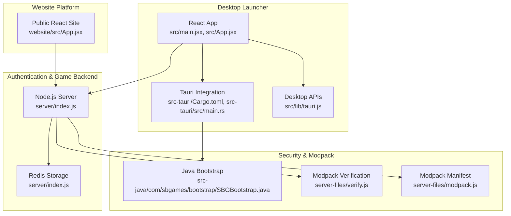
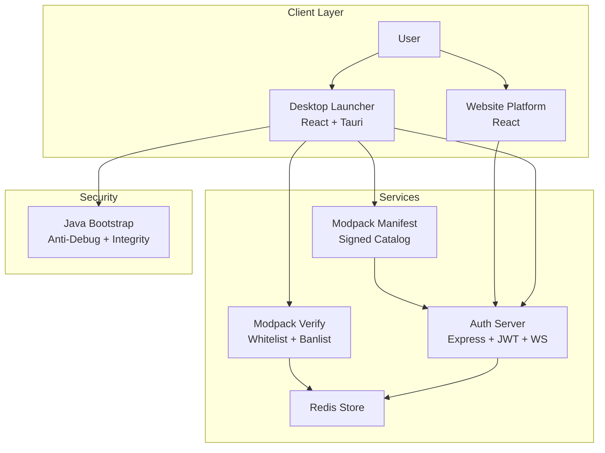
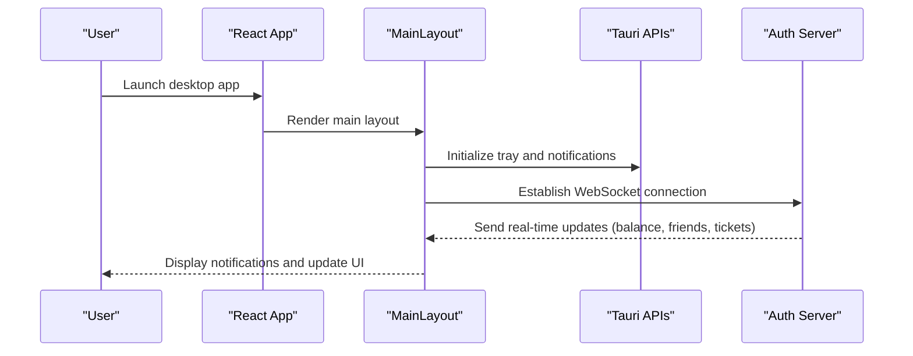
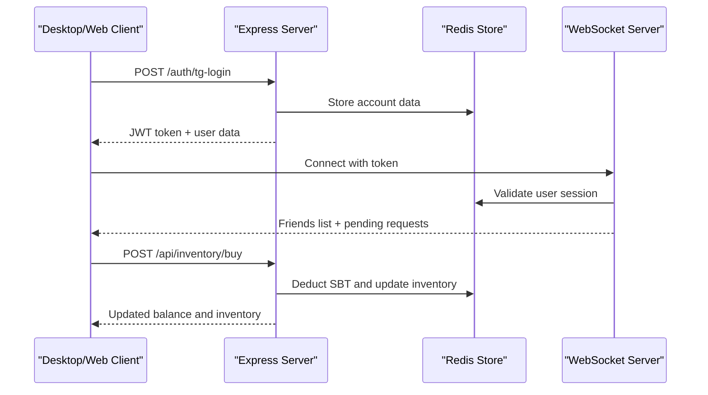
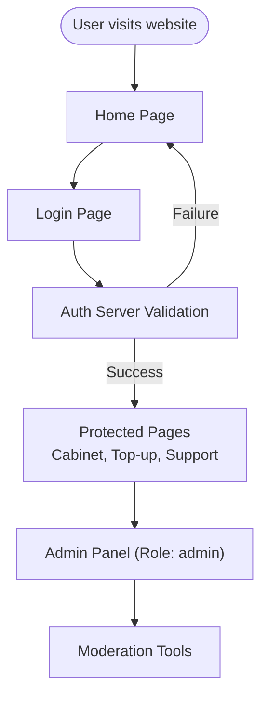
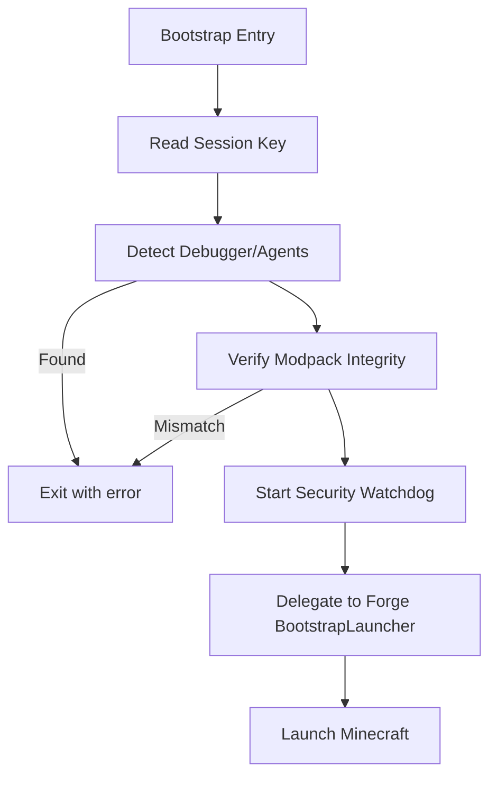
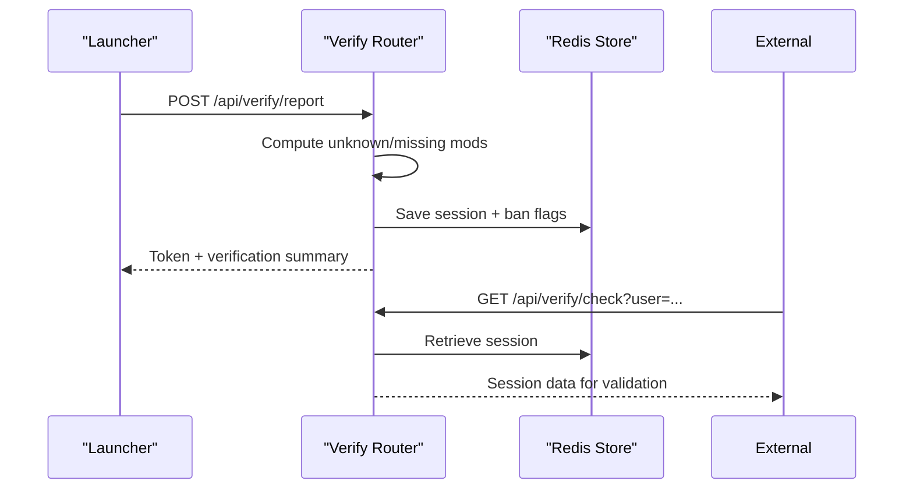
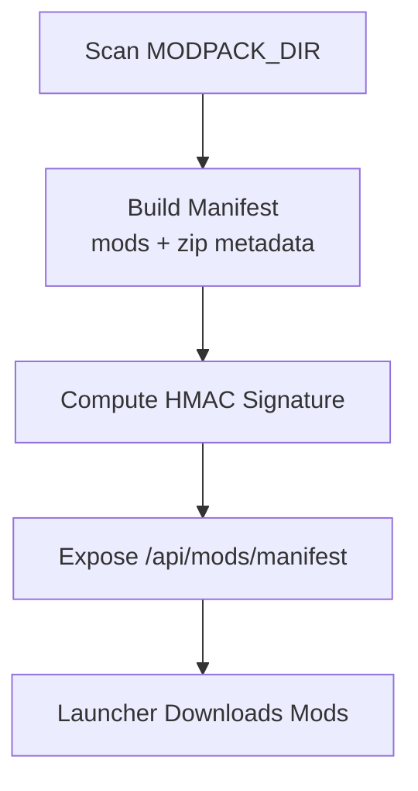
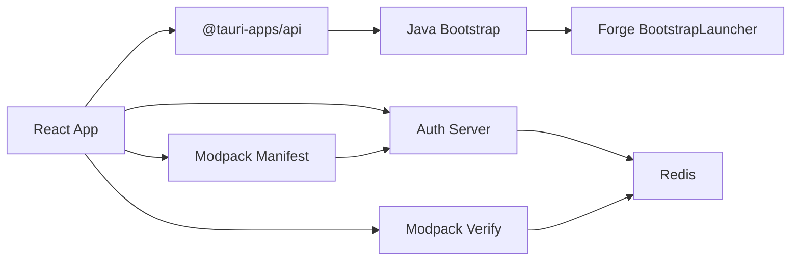

# Project Overview

<cite>
**Referenced Files in This Document**
- [package.json](file://package.json)
- [src/App.jsx](file://src/App.jsx)
- [src/main.jsx](file://src/main.jsx)
- [src/pages/MainLayout.jsx](file://src/pages/MainLayout.jsx)
- [src/lib/tauri.js](file://src/lib/tauri.js)
- [src-tauri/Cargo.toml](file://src-tauri/Cargo.toml)
- [src-tauri/src/main.rs](file://src-tauri/src/main.rs)
- [server/package.json](file://server/package.json)
- [server/index.js](file://server/index.js)
- [server-files/verify.js](file://server-files/verify.js)
- [server-files/modpack.js](file://server-files/modpack.js)
- [website/package.json](file://website/package.json)
- [website/src/App.jsx](file://website/src/App.jsx)
- [src-java/com/sbgames/bootstrap/SBGBootstrap.java](file://src-java/com/sbgames/bootstrap/SBGBootstrap.java)
- [BUILD.md](file://BUILD.md)
</cite>

## Table of Contents
1. [Introduction](#introduction)
2. [Project Structure](#project-structure)
3. [Core Components](#core-components)
4. [Architecture Overview](#architecture-overview)
5. [Detailed Component Analysis](#detailed-component-analysis)
6. [Dependency Analysis](#dependency-analysis)
7. [Performance Considerations](#performance-considerations)
8. [Troubleshooting Guide](#troubleshooting-guide)
9. [Conclusion](#conclusion)

## Introduction
SBGames is a full-stack desktop application designed as a Minecraft launcher and gaming platform. It combines a Tauri-based native desktop interface with web-based features to deliver a seamless experience for launching Minecraft, managing modpacks, trading virtual goods, and interacting with the community. The platform introduces SBT currency for in-game purchases and marketplace transactions, and implements robust security verification to protect against tampering and unauthorized modifications.

Key goals:
- Provide a secure and efficient way to launch Minecraft with verified modpacks
- Enable players to manage profiles, inventory, and marketplace trades using SBT currency
- Offer real-time communication via WebSocket for social features and notifications
- Deliver a modern, responsive web presence alongside the desktop launcher

## Project Structure
The repository is organized into distinct modules that serve different parts of the system:
- Desktop launcher (React + Tauri): The primary user interface and native integration
- Authentication and game backend (Node.js): REST APIs, WebSocket server, and Redis-backed storage
- Website platform (React): Public pages, user cabinet, and administrative tools
- Java bootstrap security system: Integrity checks and anti-debugging for modpacks
- Server-side modpack verification: Whitelist-based integrity validation and ban enforcement
- Build and deployment: Cross-platform packaging and CI/CD support

**Diagram sources**
- [src/main.jsx:1-11](file://src/main.jsx#L1-L11)
- [src/App.jsx:1-41](file://src/App.jsx#L1-L41)
- [src-tauri/Cargo.toml:1-57](file://src-tauri/Cargo.toml#L1-L57)
- [src-tauri/src/main.rs:1-7](file://src-tauri/src/main.rs#L1-L7)
- [server/index.js:1-1469](file://server/index.js#L1-L1469)
- [website/src/App.jsx:1-60](file://website/src/App.jsx#L1-L60)
- [src-java/com/sbgames/bootstrap/SBGBootstrap.java:1-372](file://src-java/com/sbgames/bootstrap/SBGBootstrap.java#L1-L372)
- [server-files/verify.js:1-139](file://server-files/verify.js#L1-L139)
- [server-files/modpack.js:1-153](file://server-files/modpack.js#L1-L153)

**Section sources**
- [package.json:1-43](file://package.json#L1-L43)
- [BUILD.md:1-61](file://BUILD.md#L1-L61)

## Core Components
- Desktop launcher (React + Tauri)
  - Entry point initializes the React app and renders the main layout
  - Provides navigation, notifications, and integration with native OS features
  - Uses Tauri APIs for desktop-specific operations and tray integration
- Authentication and game backend (Node.js)
  - Express server with CORS, rate limiting, and JWT-based authentication
  - WebSocket server for real-time chat, friend requests, and notifications
  - Redis-backed persistence for accounts, sessions, and marketplace listings
- Website platform (React)
  - Public-facing pages for news, rules, downloads, and user cabinet
  - Administrative tools for moderation and content management
- Java bootstrap security system
  - Anti-debug detection, environment checks, and modpack integrity verification
  - Delegates to Forge’s BootstrapLauncher after validation
- Server-side modpack verification
  - Whitelist-based integrity checks and ban enforcement
  - Signed manifests for modpack distribution and download

**Section sources**
- [src/main.jsx:1-11](file://src/main.jsx#L1-L11)
- [src/App.jsx:1-41](file://src/App.jsx#L1-L41)
- [src/pages/MainLayout.jsx:1-313](file://src/pages/MainLayout.jsx#L1-L313)
- [src/lib/tauri.js:1-101](file://src/lib/tauri.js#L1-L101)
- [server/index.js:1-1469](file://server/index.js#L1-L1469)
- [website/src/App.jsx:1-60](file://website/src/App.jsx#L1-L60)
- [src-java/com/sbgames/bootstrap/SBGBootstrap.java:1-372](file://src-java/com/sbgames/bootstrap/SBGBootstrap.java#L1-L372)
- [server-files/verify.js:1-139](file://server-files/verify.js#L1-L139)
- [server-files/modpack.js:1-153](file://server-files/modpack.js#L1-L153)

## Architecture Overview
SBGames employs a hybrid architecture:
- Desktop application built with React and Tauri for native capabilities
- Web-based authentication and marketplace services powered by Node.js
- Real-time communication via WebSocket for social features
- Security verification handled by a Java bootstrap and server-side integrity checks
- Public website for marketing, downloads, and administrative tasks

**Diagram sources**
- [src/pages/MainLayout.jsx:1-313](file://src/pages/MainLayout.jsx#L1-L313)
- [server/index.js:1-1469](file://server/index.js#L1-L1469)
- [server-files/verify.js:1-139](file://server-files/verify.js#L1-L139)
- [server-files/modpack.js:1-153](file://server-files/modpack.js#L1-L153)
- [src-java/com/sbgames/bootstrap/SBGBootstrap.java:1-372](file://src-java/com/sbgames/bootstrap/SBGBootstrap.java#L1-L372)

## Detailed Component Analysis

### Desktop Launcher (React + Tauri)
The desktop launcher is a React application integrated with Tauri for native OS features. It manages user sessions, navigation, notifications, and tray interactions. The main layout coordinates multiple functional areas including gameplay, profile management, leaderboards, shop, news, and support.

**Diagram sources**
- [src/App.jsx:1-41](file://src/App.jsx#L1-L41)
- [src/pages/MainLayout.jsx:1-313](file://src/pages/MainLayout.jsx#L1-L313)
- [src/lib/tauri.js:1-101](file://src/lib/tauri.js#L1-L101)
- [server/index.js:752-796](file://server/index.js#L752-L796)

**Section sources**
- [src/main.jsx:1-11](file://src/main.jsx#L1-L11)
- [src/App.jsx:1-41](file://src/App.jsx#L1-L41)
- [src/pages/MainLayout.jsx:1-313](file://src/pages/MainLayout.jsx#L1-L313)
- [src/lib/tauri.js:1-101](file://src/lib/tauri.js#L1-L101)

### Authentication and Game Backend (Node.js)
The Node.js server provides REST endpoints for authentication, inventory management, marketplace operations, and activity tracking. It also maintains a WebSocket server for real-time communication, including friend requests, group messaging, and admin notifications. Redis is used for caching and storing user data, sessions, and marketplace listings.

**Diagram sources**
- [server/index.js:140-176](file://server/index.js#L140-L176)
- [server/index.js:752-796](file://server/index.js#L752-L796)
- [server/index.js:344-371](file://server/index.js#L344-L371)

**Section sources**
- [server/package.json:1-20](file://server/package.json#L1-L20)
- [server/index.js:1-1469](file://server/index.js#L1-L1469)

### Website Platform (React)
The website serves as the public face of SBGames, offering pages for rules, downloads, how-to-play guides, and user cabinet access. It integrates with the authentication server to provide protected routes and synchronized user roles.

**Diagram sources**
- [website/src/App.jsx:1-60](file://website/src/App.jsx#L1-L60)
- [server/index.js:289-301](file://server/index.js#L289-L301)

**Section sources**
- [website/package.json:1-29](file://website/package.json#L1-L29)
- [website/src/App.jsx:1-60](file://website/src/App.jsx#L1-L60)

### Java Bootstrap Security System
The Java bootstrap performs runtime checks to prevent tampering and ensures modpack integrity. It detects debuggers and suspicious JVM arguments, verifies SHA-256 hashes of mod JAR files against a whitelist, and starts a watchdog thread to continuously monitor the environment.

**Diagram sources**
- [src-java/com/sbgames/bootstrap/SBGBootstrap.java:207-237](file://src-java/com/sbgames/bootstrap/SBGBootstrap.java#L207-L237)
- [src-java/com/sbgames/bootstrap/SBGBootstrap.java:239-273](file://src-java/com/sbgames/bootstrap/SBGBootstrap.java#L239-L273)
- [src-java/com/sbgames/bootstrap/SBGBootstrap.java:293-353](file://src-java/com/sbgames/bootstrap/SBGBootstrap.java#L293-L353)

**Section sources**
- [src-java/com/sbgames/bootstrap/SBGBootstrap.java:1-372](file://src-java/com/sbgames/bootstrap/SBGBootstrap.java#L1-L372)

### Server-Side Modpack Verification
The modpack verification service enforces integrity by comparing client-provided mod hashes against a server-side whitelist. It records discrepancies, bans users with unknown or missing mods, and exposes endpoints for external systems to validate sessions.

**Diagram sources**
- [server-files/verify.js:61-113](file://server-files/verify.js#L61-L113)
- [server-files/verify.js:115-124](file://server-files/verify.js#L115-L124)

**Section sources**
- [server-files/verify.js:1-139](file://server-files/verify.js#L1-L139)

### Modpack Manifest and Distribution
The modpack manifest endpoint provides a signed catalog of available mods, enabling clients to verify authenticity and integrity. It supports downloading individual mods and a prebuilt ZIP archive, with SHA-256 checksums and HMAC signatures.

**Diagram sources**
- [server-files/modpack.js:26-81](file://server-files/modpack.js#L26-L81)
- [server-files/modpack.js:85-101](file://server-files/modpack.js#L85-L101)

**Section sources**
- [server-files/modpack.js:1-153](file://server-files/modpack.js#L1-L153)

## Dependency Analysis
High-level dependencies across components:
- Desktop launcher depends on Tauri for native integrations and communicates with the auth server for user sessions and real-time updates
- Auth server relies on Redis for persistence and WebSocket for live features
- Website platform consumes auth server endpoints for protected routes
- Java bootstrap integrates with Forge and validates modpack integrity
- Modpack verification and manifest endpoints depend on server-side configuration and Redis

**Diagram sources**
- [package.json:15-41](file://package.json#L15-L41)
- [src-tauri/Cargo.toml:17-35](file://src-tauri/Cargo.toml#L17-L35)
- [server/package.json:6-18](file://server/package.json#L6-L18)
- [server-files/verify.js:28-33](file://server-files/verify.js#L28-L33)
- [src-java/com/sbgames/bootstrap/SBGBootstrap.java:231-232](file://src-java/com/sbgames/bootstrap/SBGBootstrap.java#L231-L232)

**Section sources**
- [package.json:1-43](file://package.json#L1-L43)
- [src-tauri/Cargo.toml:1-57](file://src-tauri/Cargo.toml#L1-L57)
- [server/package.json:1-20](file://server/package.json#L1-L20)
- [server-files/verify.js:1-139](file://server-files/verify.js#L1-L139)
- [src-java/com/sbgames/bootstrap/SBGBootstrap.java:1-372](file://src-java/com/sbgames/bootstrap/SBGBootstrap.java#L1-L372)

## Performance Considerations
- Desktop launcher
  - Minimize unnecessary re-renders by leveraging local state and memoization
  - Debounce WebSocket reconnection attempts to reduce load during network instability
- Auth server
  - Use Redis for fast cache reads and write-through patterns for consistency
  - Apply rate limits per endpoint to mitigate abuse and maintain responsiveness
- Website platform
  - Optimize route guards and user synchronization to avoid redundant API calls
- Java bootstrap
  - Keep integrity checks lightweight and avoid blocking operations on startup
- Modpack verification
  - Precompute expected hashes and cache results to speed up repeated validations

## Troubleshooting Guide
Common issues and resolutions:
- Desktop launcher fails to connect to WebSocket
  - Verify token validity and ensure the auth server is reachable
  - Check for CORS misconfiguration affecting localhost origins
- Authentication errors
  - Confirm JWT secret alignment and expiration settings
  - Validate Redis connectivity for account persistence
- Modpack integrity failures
  - Ensure the Java bootstrap can read the expected mod directory
  - Verify SHA-256 checksums match the server-side whitelist
- Website login redirects
  - Ensure protected routes are properly guarded and user roles are refreshed

**Section sources**
- [server/index.js:40-59](file://server/index.js#L40-L59)
- [server/index.js:290-301](file://server/index.js#L290-L301)
- [server-files/verify.js:77-102](file://server-files/verify.js#L77-L102)
- [website/src/App.jsx:15-24](file://website/src/App.jsx#L15-L24)

## Conclusion
SBGames delivers a secure, feature-rich Minecraft launcher and platform through a hybrid architecture combining a Tauri-powered desktop app, a Node.js authentication and game backend, a public website, and robust Java-based security verification. Its modular design enables scalability, maintainability, and strong protection against tampering, while SBT currency and marketplace features enhance the gaming economy. The platform targets players seeking a reliable, integrated launcher experience with social and economic features, differentiated by its emphasis on security verification and native desktop integration.