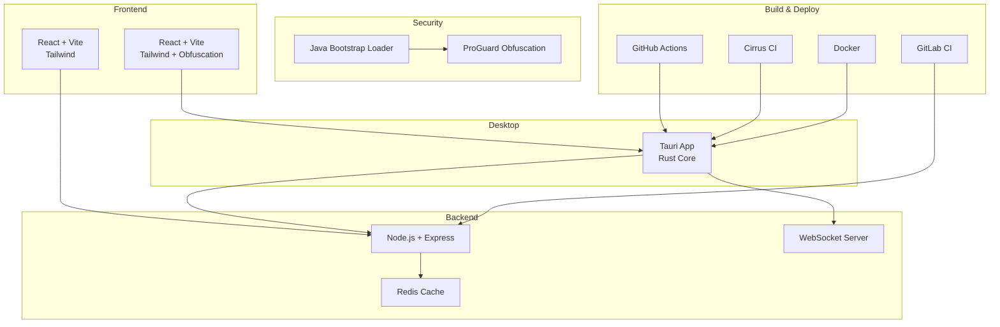
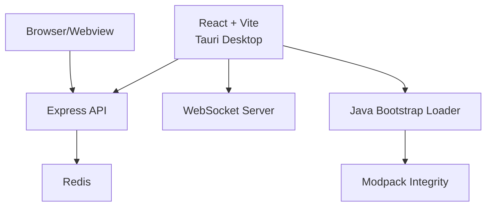
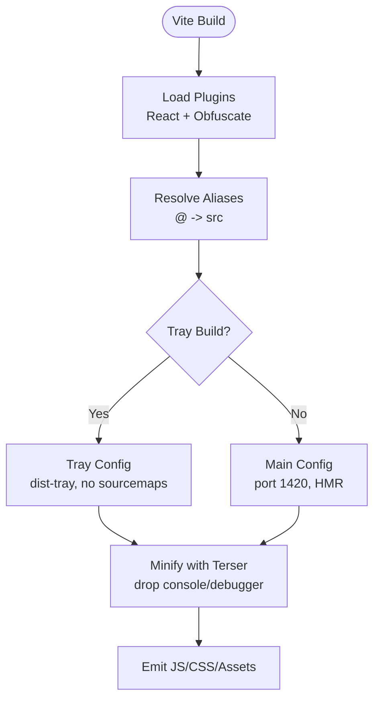
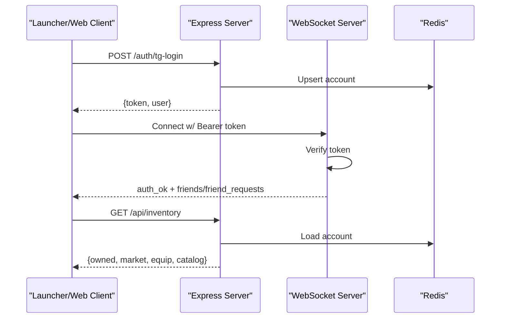
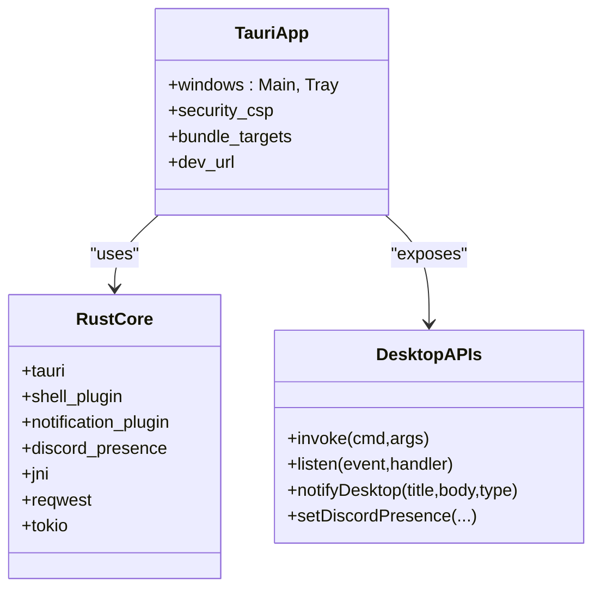
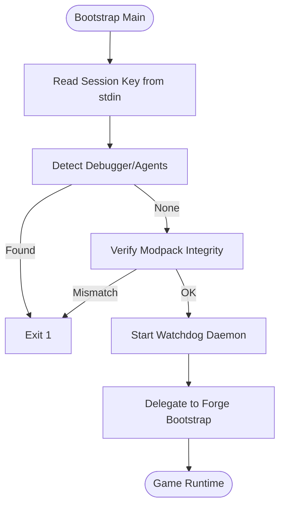
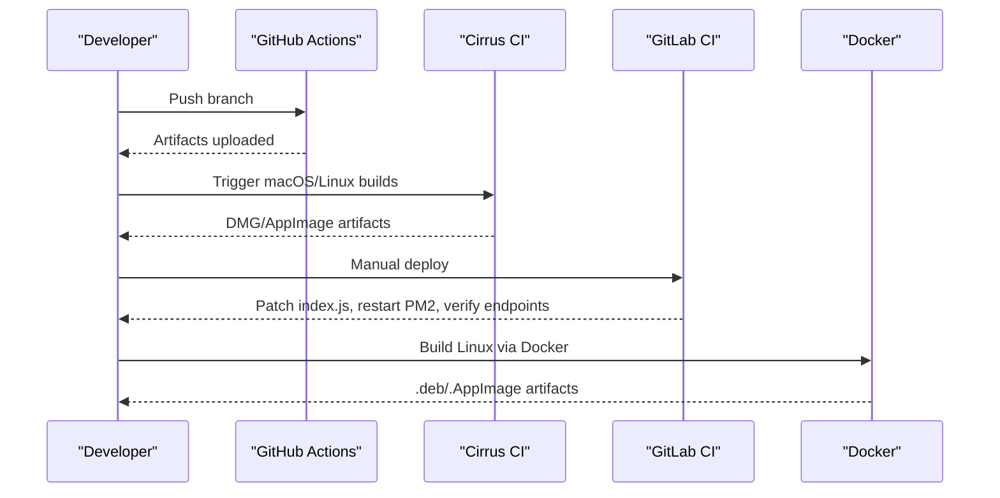
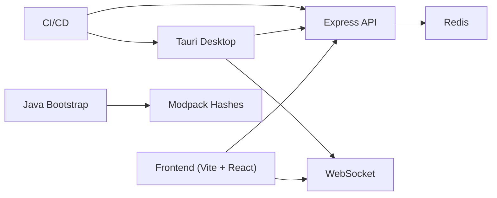

# Technology Stack

<cite>
**Referenced Files in This Document**
- [package.json](file://package.json)
- [vite.config.js](file://vite.config.js)
- [tailwind.config.js](file://tailwind.config.js)
- [server/package.json](file://server/package.json)
- [server/index.js](file://server/index.js)
- [src-tauri/Cargo.toml](file://src-tauri/Cargo.toml)
- [src-tauri/tauri.conf.json](file://src-tauri/tauri.conf.json)
- [src-java/com/sbgames/bootstrap/SBGBootstrap.java](file://src-java/com/sbgames/bootstrap/SBGBootstrap.java)
- [scratch/proguard.conf](file://scratch/proguard.conf)
- [scripts/Dockerfile.linux](file://scripts/Dockerfile.linux)
- [.github/workflows/build.yml](file://.github/workflows/build.yml)
- [.gitlab-ci.yml](file://.gitlab-ci.yml)
- [.cirrus.yml](file://.cirrus.yml)
- [BUILD.md](file://BUILD.md)
- [scripts/build-all.sh](file://scripts/build-all.sh)
- [website/vite.config.js](file://website/vite.config.js)
- [website/tailwind.config.js](file://website/tailwind.config.js)
- [src/lib/api.js](file://src/lib/api.js)
- [src/lib/tauri.js](file://src/lib/tauri.js)
</cite>

## Table of Contents
1. [Introduction](#introduction)
2. [Project Structure](#project-structure)
3. [Core Components](#core-components)
4. [Architecture Overview](#architecture-overview)
5. [Detailed Component Analysis](#detailed-component-analysis)
6. [Dependency Analysis](#dependency-analysis)
7. [Performance Considerations](#performance-considerations)
8. [Troubleshooting Guide](#troubleshooting-guide)
9. [Conclusion](#conclusion)
10. [Appendices](#appendices)

## Introduction
This document describes the comprehensive hybrid technology stack of SBGames, focusing on the frontend (React + Vite + Tailwind), desktop application (Tauri), backend (Node.js + Express + WebSocket + Redis), security layer (Java bootstrap loader with XOR encoding and integrity checks), and build/deployment pipeline (ProGuard, Docker, CI/CD). It explains why specific technologies were chosen, how they integrate, and provides version compatibility insights, upgrade paths, and performance expectations.

## Project Structure
The repository is organized into multiple coordinated parts:
- Frontend launcher (React + Vite + Tailwind) with obfuscation and dual build modes (main and tray)
- Website (React + Vite + Tailwind) with separate obfuscation configuration
- Backend server (Node.js + Express + WebSocket + Redis)
- Desktop launcher (Tauri with Rust core)
- Security layer (Java bootstrap with encoded constants and integrity verification)
- Build and deployment (Docker, GitHub Actions, GitLab CI, Cirrus CI)
- Scripts and configurations for cross-platform builds and packaging

**Diagram sources**
- [package.json:1-43](file://package.json#L1-L43)
- [website/package.json:1-29](file://website/package.json#L1-L29)
- [server/package.json:1-20](file://server/package.json#L1-L20)
- [src-tauri/Cargo.toml:1-57](file://src-tauri/Cargo.toml#L1-L57)
- [src-java/com/sbgames/bootstrap/SBGBootstrap.java:1-372](file://src-java/com/sbgames/bootstrap/SBGBootstrap.java#L1-L372)
- [.github/workflows/build.yml:1-95](file://.github/workflows/build.yml#L1-L95)
- [.gitlab-ci.yml:1-57](file://.gitlab-ci.yml#L1-L57)
- [.cirrus.yml:1-72](file://.cirrus.yml#L1-L72)
- [scripts/Dockerfile.linux:1-47](file://scripts/Dockerfile.linux#L1-L47)

**Section sources**
- [package.json:1-43](file://package.json#L1-L43)
- [website/package.json:1-29](file://website/package.json#L1-L29)
- [server/package.json:1-20](file://server/package.json#L1-L20)
- [src-tauri/Cargo.toml:1-57](file://src-tauri/Cargo.toml#L1-L57)
- [src-java/com/sbgames/bootstrap/SBGBootstrap.java:1-372](file://src-java/com/sbgames/bootstrap/SBGBootstrap.java#L1-L372)
- [.github/workflows/build.yml:1-95](file://.github/workflows/build.yml#L1-L95)
- [.gitlab-ci.yml:1-57](file://.gitlab-ci.yml#L1-L57)
- [.cirrus.yml:1-72](file://.cirrus.yml#L1-L72)
- [scripts/Dockerfile.linux:1-47](file://scripts/Dockerfile.linux#L1-L47)

## Core Components
- Frontend launcher: React 18 with Vite 5, Tailwind 3, and JavaScript obfuscation via javascript-obfuscator. Dual build targets: main app and tray window.
- Website: Separate React + Vite + Tailwind setup optimized for static hosting.
- Backend: Node.js server with Express, Helmet, CORS, rate limiting, JWT, sanitized HTML, Redis via ioredis, and WebSocket server (ws).
- Desktop: Tauri 2 with Rust core, shell/notification plugins, Discord Rich Presence, JNI for process control, and comprehensive CSP.
- Security: Java bootstrap loader with XOR-encoded constants, runtime debugger detection, SHA-256 integrity checks for modpack JARs, and ProGuard obfuscation.
- Build & Deploy: Multi-OS CI via GitHub Actions, GitLab CI for server deployments, Cirrus CI for macOS/Linux, Docker for reproducible Linux builds.

**Section sources**
- [package.json:1-43](file://package.json#L1-L43)
- [website/package.json:1-29](file://website/package.json#L1-L29)
- [server/package.json:1-20](file://server/package.json#L1-L20)
- [src-tauri/Cargo.toml:1-57](file://src-tauri/Cargo.toml#L1-L57)
- [src-java/com/sbgames/bootstrap/SBGBootstrap.java:1-372](file://src-java/com/sbgames/bootstrap/SBGBootstrap.java#L1-L372)
- [.github/workflows/build.yml:1-95](file://.github/workflows/build.yml#L1-L95)
- [.gitlab-ci.yml:1-57](file://.gitlab-ci.yml#L1-L57)
- [.cirrus.yml:1-72](file://.cirrus.yml#L1-L72)
- [scripts/Dockerfile.linux:1-47](file://scripts/Dockerfile.linux#L1-L47)

## Architecture Overview
The system integrates a React-based launcher packaged with Tauri, communicating with a Node.js backend over HTTPS and WebSocket. The launcher embeds a Java bootstrap loader responsible for integrity verification and secure delegation to the game runtime. Build automation ensures cross-platform releases and secure packaging.

**Diagram sources**
- [src/lib/api.js:1-30](file://src/lib/api.js#L1-L30)
- [src/lib/tauri.js:1-101](file://src/lib/tauri.js#L1-L101)
- [server/index.js:1-800](file://server/index.js#L1-L800)
- [src-tauri/tauri.conf.json:1-89](file://src-tauri/tauri.conf.json#L1-L89)
- [src-java/com/sbgames/bootstrap/SBGBootstrap.java:1-372](file://src-java/com/sbgames/bootstrap/SBGBootstrap.java#L1-L372)

## Detailed Component Analysis

### Frontend Stack (React + Vite + Tailwind)
- React 18 with React Router DOM and UI libraries (Phosphor Icons, Lucide, Framer Motion).
- Vite 5 with React plugin, TypeScript aliases, and dual build modes (main and tray).
- Tailwind 3 for utility-first styling with custom theme tokens and animations.
- JavaScript obfuscation using javascript-obfuscator with aggressive settings during build.
- Dev server with HMR and configurable host/port for Tauri development.

**Diagram sources**
- [vite.config.js:1-97](file://vite.config.js#L1-L97)
- [tailwind.config.js:1-62](file://tailwind.config.js#L1-L62)
- [package.json:1-43](file://package.json#L1-L43)

**Section sources**
- [package.json:1-43](file://package.json#L1-L43)
- [vite.config.js:1-97](file://vite.config.js#L1-L97)
- [tailwind.config.js:1-62](file://tailwind.config.js#L1-L62)

### Website Frontend (React + Vite + Tailwind)
- Standalone React + Vite + Tailwind site with distinct obfuscation policy and asset serving.
- Tailwind configured for minimal customization focused on fonts.

**Section sources**
- [website/package.json:1-29](file://website/package.json#L1-L29)
- [website/vite.config.js:1-94](file://website/vite.config.js#L1-L94)
- [website/tailwind.config.js:1-6](file://website/tailwind.config.js#L1-L6)

### Backend Stack (Node.js + Express + WebSocket + Redis)
- Express server with Helmet, CORS allowing Tauri and domain origins, JSON limits, and rate limiting.
- JWT-based authentication with token signing/verification and optional vs required auth middlewares.
- WebSocket server for real-time features with token-based client identification.
- Redis integration with lazy connection and in-memory fallback for accounts and caches.
- Comprehensive REST endpoints for authentication, inventory, marketplace, groups, support tickets, and activity tracking.

**Diagram sources**
- [server/index.js:1-800](file://server/index.js#L1-L800)
- [server/package.json:1-20](file://server/package.json#L1-L20)

**Section sources**
- [server/package.json:1-20](file://server/package.json#L1-L20)
- [server/index.js:1-800](file://server/index.js#L1-L800)

### Desktop Application (Tauri + Rust)
- Tauri 2 with multi-window support (main and tray), custom CSP, and bundling targets for Windows/macOS/Linux.
- Rust core dependencies include tauri, shell/notification plugins, serde, reqwest, tokio, JNI, zip, and Windows sys crates.
- Build configuration defines dev URLs, frontend dist path, and bundle metadata.
- Desktop APIs expose invoke/listen wrappers and desktop notifications with per-monitor positioning.

**Diagram sources**
- [src-tauri/tauri.conf.json:1-89](file://src-tauri/tauri.conf.json#L1-L89)
- [src-tauri/Cargo.toml:1-57](file://src-tauri/Cargo.toml#L1-L57)
- [src/lib/tauri.js:1-101](file://src/lib/tauri.js#L1-L101)

**Section sources**
- [src-tauri/Cargo.toml:1-57](file://src-tauri/Cargo.toml#L1-L57)
- [src-tauri/tauri.conf.json:1-89](file://src-tauri/tauri.conf.json#L1-L89)
- [src/lib/tauri.js:1-101](file://src/lib/tauri.js#L1-L101)

### Security Layer (Java Bootstrap Loader + Integrity Verification)
- Java bootstrap loader performs:
  - XOR-decoded constant resolution for class names and method signatures.
  - Environment and debugger detection via JVM arguments and environment variables.
  - SHA-256 integrity verification against expected hashes for modpack JARs.
  - Watchdog thread to continuously monitor for tampering.
- ProGuard obfuscation re-packages and obfuscates the bootstrap class with dictionary-based names and keeps public entry points.

**Diagram sources**
- [src-java/com/sbgames/bootstrap/SBGBootstrap.java:1-372](file://src-java/com/sbgames/bootstrap/SBGBootstrap.java#L1-L372)
- [scratch/proguard.conf:1-20](file://scratch/proguard.conf#L1-L20)

**Section sources**
- [src-java/com/sbgames/bootstrap/SBGBootstrap.java:1-372](file://src-java/com/sbgames/bootstrap/SBGBootstrap.java#L1-L372)
- [scratch/proguard.conf:1-20](file://scratch/proguard.conf#L1-L20)

### Build and Deployment Pipeline
- GitHub Actions: Matrix builds for Windows (.exe/.msi), macOS (.dmg), and Linux (.AppImage/.deb) with Node 20 and Rust stable toolchains.
- GitLab CI: Manual deployment job using SSH to patch and restart the Node service, with post-deploy verification.
- Cirrus CI: macOS and Linux builds with system dependencies and caching for node_modules and cargo.
- Docker: Linux build container with WebKit dependencies, Node 20, and Rust toolchain for reproducible builds.
- Scripts: Unified build-all.sh orchestrating platform-specific builds and ad-hoc signing for macOS.

**Diagram sources**
- [.github/workflows/build.yml:1-95](file://.github/workflows/build.yml#L1-L95)
- [.cirrus.yml:1-72](file://.cirrus.yml#L1-L72)
- [.gitlab-ci.yml:1-57](file://.gitlab-ci.yml#L1-L57)
- [scripts/Dockerfile.linux:1-47](file://scripts/Dockerfile.linux#L1-L47)
- [scripts/build-all.sh:1-130](file://scripts/build-all.sh#L1-L130)

**Section sources**
- [.github/workflows/build.yml:1-95](file://.github/workflows/build.yml#L1-L95)
- [.gitlab-ci.yml:1-57](file://.gitlab-ci.yml#L1-L57)
- [.cirrus.yml:1-72](file://.cirrus.yml#L1-L72)
- [scripts/Dockerfile.linux:1-47](file://scripts/Dockerfile.linux#L1-L47)
- [BUILD.md:1-61](file://BUILD.md#L1-L61)
- [scripts/build-all.sh:1-130](file://scripts/build-all.sh#L1-L130)

## Dependency Analysis
- Frontend depends on React ecosystem and Vite toolchain; Tailwind extends design tokens; obfuscation is applied post-bundle.
- Backend depends on Express, security middleware, rate limiting, JWT, sanitized HTML, Redis, and WebSocket; integrates with launcher via HTTPS/WS.
- Desktop depends on Tauri and Rust ecosystem; exposes native capabilities to the frontend; integrates with OS notifications and Discord presence.
- Security layer depends on Java runtime and ProGuard; integrity verification relies on local hash files and SHA-256 computation.
- Build pipeline depends on Node 20, Rust stable, OS-specific system packages, and CI providers.

**Diagram sources**
- [package.json:1-43](file://package.json#L1-L43)
- [server/package.json:1-20](file://server/package.json#L1-L20)
- [src-tauri/Cargo.toml:1-57](file://src-tauri/Cargo.toml#L1-L57)
- [src-java/com/sbgames/bootstrap/SBGBootstrap.java:1-372](file://src-java/com/sbgames/bootstrap/SBGBootstrap.java#L1-L372)
- [.github/workflows/build.yml:1-95](file://.github/workflows/build.yml#L1-L95)

**Section sources**
- [package.json:1-43](file://package.json#L1-L43)
- [server/package.json:1-20](file://server/package.json#L1-L20)
- [src-tauri/Cargo.toml:1-57](file://src-tauri/Cargo.toml#L1-L57)
- [src-java/com/sbgames/bootstrap/SBGBootstrap.java:1-372](file://src-java/com/sbgames/bootstrap/SBGBootstrap.java#L1-L372)
- [.github/workflows/build.yml:1-95](file://.github/workflows/build.yml#L1-L95)

## Performance Considerations
- Frontend obfuscation and minification reduce payload sizes; disabling sourcemaps improves production performance.
- Tauri avoids heavy web frameworks by leveraging native OS capabilities; tray window uses minimal resources.
- Backend uses Redis for fast caching and lazy connection fallback; WebSocket connections are authenticated and rate-limited.
- Build caching in CI reduces build times; Docker ensures reproducibility across environments.

[No sources needed since this section provides general guidance]

## Troubleshooting Guide
- Frontend build fails due to missing dependencies: ensure Node 20 and npm install are executed before Vite build.
- Tauri build errors on Linux: install WebKit and GTK system dependencies as per Dockerfile or CI scripts.
- macOS Gatekeeper issues: apply ad-hoc signature or follow user prompts to open the app.
- WebSocket authentication failures: verify JWT token presence and expiration; confirm backend CORS and origin allowances.
- Redis unavailable: backend falls back to in-memory maps; ensure Redis is reachable for persistence.
- CI build timeouts: enable caching for node_modules and cargo; pre-install system dependencies.

**Section sources**
- [scripts/Dockerfile.linux:1-47](file://scripts/Dockerfile.linux#L1-L47)
- [scripts/build-all.sh:1-130](file://scripts/build-all.sh#L1-L130)
- [src-tauri/tauri.conf.json:1-89](file://src-tauri/tauri.conf.json#L1-L89)
- [server/index.js:1-800](file://server/index.js#L1-L800)
- [.github/workflows/build.yml:1-95](file://.github/workflows/build.yml#L1-L95)

## Conclusion
SBGames employs a cohesive hybrid stack: a modern React/Vite/Tailwind frontend packaged with Tauri for desktop distribution, a robust Node.js backend with WebSocket and Redis for real-time features, a Java-based security layer with integrity verification, and a multi-platform CI/CD pipeline with Docker and cross-compilation. This combination balances developer productivity, user experience, security, and operational reliability.

[No sources needed since this section summarizes without analyzing specific files]

## Appendices

### Version Compatibility Matrix
- Node.js: 20.x (actions/setup-node, Dockerfile, scripts)
- Rust: stable toolchain (dtolnay/rust-toolchain, Cargo.toml profile.release)
- Vite: 5.x (launcher and website configs)
- React: 18.x (dependencies)
- Tailwind: 3.x (configs)
- Tauri: 2.x (Cargo.toml, tauri.conf.json)
- Express: 4.x (server/package.json)
- WebSocket: ws (server/package.json)
- Redis: ioredis (server/package.json)
- Java: JDK 17+ (ProGuard usage)
- Docker: Ubuntu 22.04 base (scripts/Dockerfile.linux)

**Section sources**
- [.github/workflows/build.yml:1-95](file://.github/workflows/build.yml#L1-L95)
- [scripts/Dockerfile.linux:1-47](file://scripts/Dockerfile.linux#L1-L47)
- [package.json:1-43](file://package.json#L1-L43)
- [website/package.json:1-29](file://website/package.json#L1-L29)
- [server/package.json:1-20](file://server/package.json#L1-L20)
- [src-tauri/Cargo.toml:1-57](file://src-tauri/Cargo.toml#L1-L57)
- [src-java/com/sbgames/bootstrap/SBGBootstrap.java:1-372](file://src-java/com/sbgames/bootstrap/SBGBootstrap.java#L1-L372)

### Upgrade Paths
- Frontend: Upgrade Vite and React together; keep Tailwind aligned with major versions; review obfuscator options after updates.
- Backend: Pin Express/ws/ioredis versions; migrate to newer Node LTS when tested; update Helmet and rate-limit configurations.
- Desktop: Keep Tauri 2.x updated; align Rust toolchain; review plugin versions (shell/notification).
- Security: Update ProGuard version and adjust obfuscation rules; refresh XOR keys and integrity hash lists.
- CI/CD: Align action versions; update system dependency versions in Dockerfiles and CI scripts.

[No sources needed since this section provides general guidance]