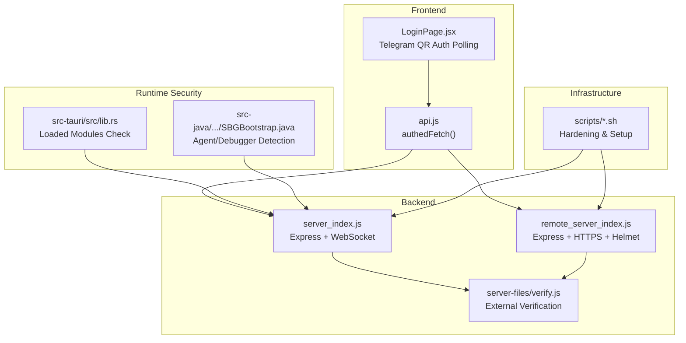
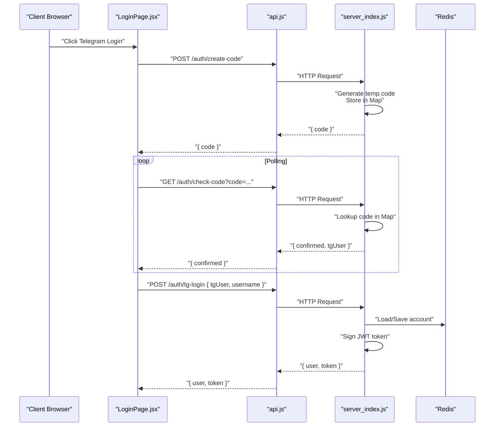
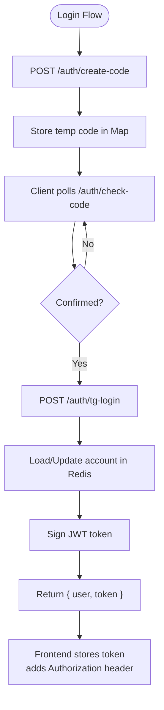
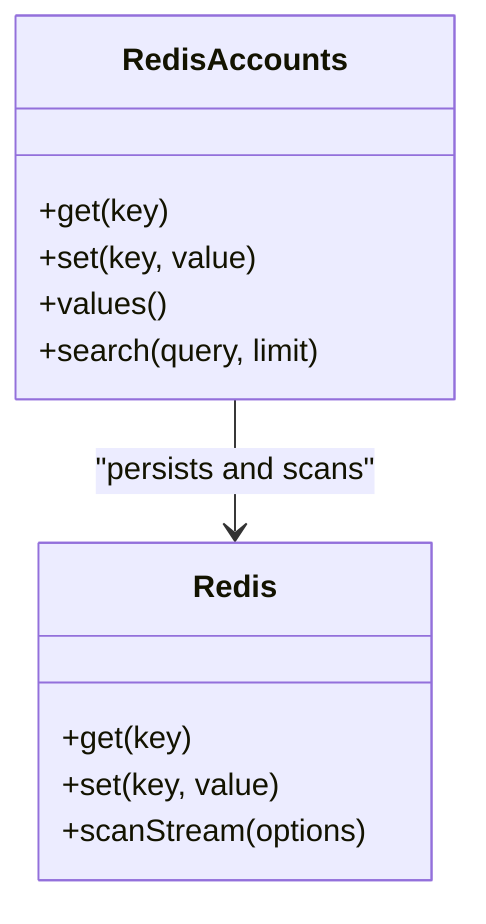
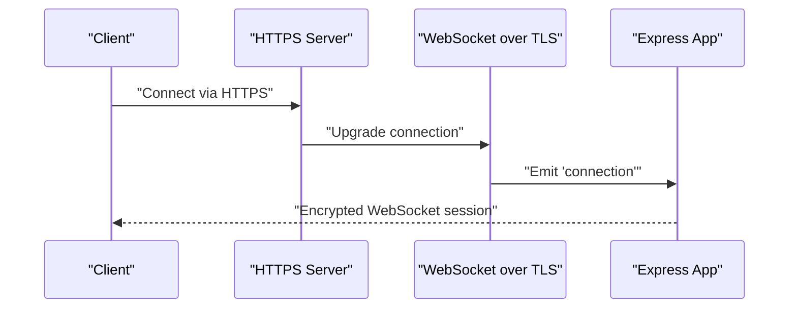
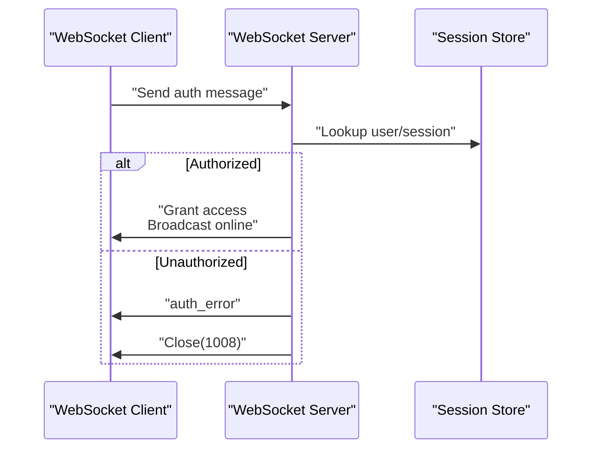
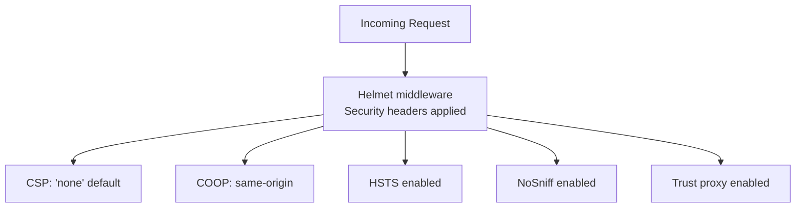
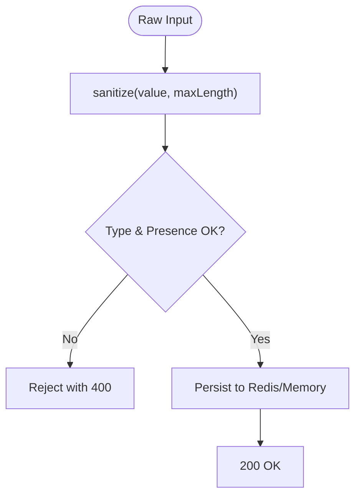
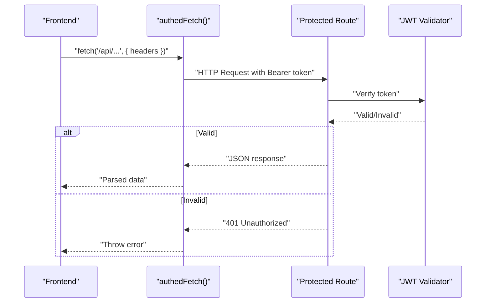
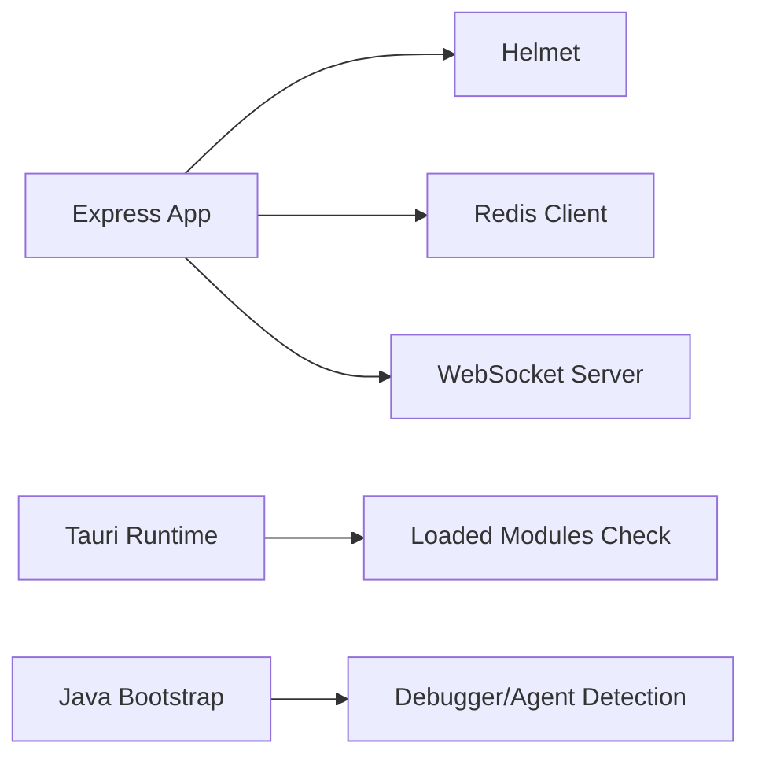

# Authentication & Data Security

<cite>
**Referenced Files in This Document**
- [server_index.js](file://server_index.js)
- [remote_server_index.js](file://scratch/remote_server_index.js)
- [server/index.js](file://server/index.js)
- [src/pages/LoginPage.jsx](file://src/pages/LoginPage.jsx)
- [src/lib/api.js](file://src/lib/api.js)
- [src-tauri/src/lib.rs](file://src-tauri/src/lib.rs)
- [src-java/com/sbgames/bootstrap/SBGBootstrap.java](file://src-java/com/sbgames/bootstrap/SBGBootstrap.java)
- [server-files/verify.js](file://server-files/verify.js)
- [scripts/server-hardening.sh](file://scripts/server-hardening.sh)
- [scripts/setup-server.sh](file://scripts/setup-server.sh)
</cite>

## Table of Contents
1. [Introduction](#introduction)
2. [Project Structure](#project-structure)
3. [Core Components](#core-components)
4. [Architecture Overview](#architecture-overview)
5. [Detailed Component Analysis](#detailed-component-analysis)
6. [Dependency Analysis](#dependency-analysis)
7. [Performance Considerations](#performance-considerations)
8. [Troubleshooting Guide](#troubleshooting-guide)
9. [Conclusion](#conclusion)
10. [Appendices](#appendices)

## Introduction
This document details the authentication and data security measures implemented in SBGames. It covers the JWT token-based authentication system, Redis-backed session and token storage, HTTPS/TLS enforcement, password hashing and salting mechanisms, WebSocket security, CORS and API security headers, SQL injection prevention and input validation, secure API endpoint examples, audit logging and monitoring, and guidance for additional security layers such as two-factor authentication and IP whitelisting.

## Project Structure
Security-relevant parts of the codebase span the backend server, frontend authentication flows, Tauri security checks, Java bootstrap protections, and supporting scripts for deployment hardening.

**Diagram sources**
- [server_index.js](file://server_index.js)
- [remote_server_index.js](file://scratch/remote_server_index.js)
- [src/pages/LoginPage.jsx](file://src/pages/LoginPage.jsx)
- [src/lib/api.js](file://src/lib/api.js)
- [server-files/verify.js](file://server-files/verify.js)
- [src-tauri/src/lib.rs](file://src-tauri/src/lib.rs)
- [src-java/com/sbgames/bootstrap/SBGBootstrap.java](file://src-java/com/sbgames/bootstrap/SBGBootstrap.java)
- [scripts/server-hardening.sh](file://scripts/server-hardening.sh)
- [scripts/setup-server.sh](file://scripts/setup-server.sh)

**Section sources**
- [server_index.js](file://server_index.js)
- [remote_server_index.js](file://scratch/remote_server_index.js)
- [src/pages/LoginPage.jsx](file://src/pages/LoginPage.jsx)
- [src/lib/api.js](file://src/lib/api.js)
- [server-files/verify.js](file://server-files/verify.js)
- [src-tauri/src/lib.rs](file://src-tauri/src/lib.rs)
- [src-java/com/sbgames/bootstrap/SBGBootstrap.java](file://src-java/com/sbgames/bootstrap/SBGBootstrap.java)
- [scripts/server-hardening.sh](file://scripts/server-hardening.sh)
- [scripts/setup-server.sh](file://scripts/setup-server.sh)

## Core Components
- JWT-based authentication with persistent secret storage via Redis and ephemeral fallback.
- Redis-backed user account storage with hybrid memory/Redis persistence and search.
- Telegram OAuth-style QR login with polling and temporary auth codes.
- HTTPS/TLS termination with WebSocket over TLS support.
- IP-based rate limiting and blocking with Redis availability fallback.
- Frontend token propagation and robust error handling for API responses.
- Tauri and Java bootstrap runtime protections against tampering and debugging.

**Section sources**
- [server_index.js](file://server_index.js)
- [remote_server_index.js](file://scratch/remote_server_index.js)
- [src/pages/LoginPage.jsx](file://src/pages/LoginPage.jsx)
- [src/lib/api.js](file://src/lib/api.js)
- [src-tauri/src/lib.rs](file://src-tauri/src/lib.rs)
- [src-java/com/sbgames/bootstrap/SBGBootstrap.java](file://src-java/com/sbgames/bootstrap/SBGBootstrap.java)

## Architecture Overview
The authentication and security architecture integrates frontend polling for Telegram QR login, backend JWT issuance, Redis-backed persistence, HTTPS/TLS enforcement, and runtime protections.

**Diagram sources**
- [src/pages/LoginPage.jsx](file://src/pages/LoginPage.jsx)
- [src/lib/api.js](file://src/lib/api.js)
- [server_index.js](file://server_index.js)

## Detailed Component Analysis

### JWT Token-Based Authentication
- Secret management: The JWT secret is persisted in Redis and regenerated if unavailable. An ephemeral secret is used as a fallback during Redis unavailability.
- Token issuance: On successful Telegram verification and account resolution, the server signs a JWT token and returns it to the client.
- Token usage: The frontend propagates the token in Authorization headers for protected endpoints.

**Diagram sources**
- [server_index.js](file://server_index.js)
- [src/lib/api.js](file://src/lib/api.js)

**Section sources**
- [server_index.js](file://server_index.js)
- [remote_server_index.js](file://scratch/remote_server_index.js)
- [src/lib/api.js](file://src/lib/api.js)

### Redis Caching Strategy for Session Management and Token Storage
- Hybrid persistence: Account data is stored in both an in-memory Map and Redis. Redis is preferred with a fallback to memory.
- Search capability: A hybrid search scans memory and Redis to find users by partial username matches.
- JWT secret persistence: Stored under a dedicated Redis key to survive restarts.
- External verification: A separate module reads sessions and ban lists from Redis for external services.

**Diagram sources**
- [server_index.js](file://server_index.js)
- [remote_server_index.js](file://scratch/remote_server_index.js)
- [server-files/verify.js](file://server-files/verify.js)

**Section sources**
- [server_index.js](file://server_index.js)
- [remote_server_index.js](file://scratch/remote_server_index.js)
- [server-files/verify.js](file://server-files/verify.js)

### HTTPS/TLS Implementation for Secure Communication
- HTTPS/TLS termination: HTTPS servers are created using server certificates and keys, with WebSocket servers bound to the same HTTPS server.
- Platform-specific handling: macOS ATS requires HTTPS; the server attempts to start HTTPS and falls back to warnings if certs are missing.
- WebSocket over TLS: WebSocket connections share the same HTTPS server, ensuring encrypted transport.

**Diagram sources**
- [remote_server_index.js](file://scratch/remote_server_index.js)
- [server/index.js](file://server/index.js)
- [server_index.js](file://server_index.js)

**Section sources**
- [remote_server_index.js](file://scratch/remote_server_index.js)
- [server/index.js](file://server/index.js)
- [server_index.js](file://server_index.js)

### Password Hashing and Salting Mechanisms
- Observed mechanism: The codebase does not reveal explicit password hashing or salting logic for user credentials. Authentication relies on Telegram identity verification and internal account management.
- Recommendation: Implement industry-standard password hashing (e.g., bcrypt, scrypt, or Argon2) with per-user salt and constant-time comparison to protect stored credentials.

[No sources needed since this section provides general guidance]

### WebSocket Security for Real-Time Communication
- Authentication handshake: Clients must authenticate within a timeout; otherwise the connection is closed with an unauthorized status.
- Role assignment: Admin status is derived from user ID, enabling privileged WebSocket channels.
- Transport security: WebSocket connections are served over HTTPS/TLS, preventing plaintext interception.

**Diagram sources**
- [server_index.js](file://server_index.js)

**Section sources**
- [server_index.js](file://server_index.js)

### CORS Policies and API Security Headers
- Helmet configuration: The server applies strict Content-Security-Policy, Cross-Origin-Embedder-Policy, Cross-Origin-Opener-Policy, referrer policy, HSTS, and other security headers.
- Proxy trust: Express is configured to trust the proxy (nginx) for accurate client IP detection.

**Diagram sources**
- [remote_server_index.js](file://scratch/remote_server_index.js)

**Section sources**
- [remote_server_index.js](file://scratch/remote_server_index.js)

### SQL Injection Prevention and Input Validation Strategies
- Input sanitization: The codebase includes a sanitize utility used to constrain lengths and filter input for specific fields.
- Validation patterns: Endpoints validate presence and types of request parameters and enforce length limits.
- Rate limiting and blocking: IP-based rate limiting with Redis availability fallback prevents brute-force attacks.

**Diagram sources**
- [server_index.js](file://server_index.js)

**Section sources**
- [server_index.js](file://server_index.js)

### Secure API Endpoint Examples and Authentication Flows
- Telegram QR login endpoints:
  - POST /auth/create-code: Generates a temporary code and stores it in memory with TTL cleanup.
  - GET /auth/check-code: Returns confirmation status and associated Telegram user.
  - POST /auth/tg-login: Finalizes login by verifying Telegram data, updating/creating account, and issuing JWT.
- Protected endpoints:
  - requireAuth middleware enforces JWT validation for API routes.
  - Frontend authedFetch adds Authorization header automatically and parses errors robustly.

**Diagram sources**
- [src/lib/api.js](file://src/lib/api.js)
- [server_index.js](file://server_index.js)

**Section sources**
- [src/lib/api.js](file://src/lib/api.js)
- [server_index.js](file://server_index.js)

### Audit Logging and Security Monitoring Systems
- Logging patterns: The codebase logs security events such as blocked IPs, health metrics, and WebSocket connection states.
- Monitoring endpoints: Health endpoints expose runtime metrics for tickets and WebSocket clients.
- Recommendations: Integrate structured audit logs for authentication events, failed attempts, and administrative actions; centralize logs for SIEM ingestion.

**Section sources**
- [server_index.js](file://server_index.js)
- [remote_server_index.js](file://scratch/remote_server_index.js)

## Dependency Analysis
The authentication and security stack depends on Express, Helmet, Redis, and WebSocket servers. Runtime protections depend on OS-level module scanning and agent detection.

**Diagram sources**
- [remote_server_index.js](file://scratch/remote_server_index.js)
- [server_index.js](file://server_index.js)
- [src-tauri/src/lib.rs](file://src-tauri/src/lib.rs)
- [src-java/com/sbgames/bootstrap/SBGBootstrap.java](file://src-java/com/sbgames/bootstrap/SBGBootstrap.java)

**Section sources**
- [remote_server_index.js](file://scratch/remote_server_index.js)
- [server_index.js](file://server_index.js)
- [src-tauri/src/lib.rs](file://src-tauri/src/lib.rs)
- [src-java/com/sbgames/bootstrap/SBGBootstrap.java](file://src-java/com/sbgames/bootstrap/SBGBootstrap.java)

## Performance Considerations
- Redis latency: Offload account lookups and JWT secret retrieval to Redis to minimize cold-start overhead.
- Rate limiting: Tune BLOCK_AFTER and BLOCK_TTL to balance security and usability.
- WebSocket scaling: Use a reverse proxy and horizontal scaling for WebSocket connections.

[No sources needed since this section provides general guidance]

## Troubleshooting Guide
- HTTPS not starting: Verify certificate and key paths; the server logs warnings when HTTPS fails to start.
- Redis unavailable: The system continues with in-memory storage; secrets and accounts persist only in memory.
- 429 Too Many Requests: The Telegram QR flow includes throttling to prevent spam; retry after cooldown.
- Unauthorized WebSocket: Ensure the client authenticates within the timeout; otherwise the connection is closed.

**Section sources**
- [remote_server_index.js](file://scratch/remote_server_index.js)
- [server_index.js](file://server_index.js)
- [src/pages/LoginPage.jsx](file://src/pages/LoginPage.jsx)

## Conclusion
SBGames implements a layered security model: Redis-backed persistence, strict API security headers, HTTPS/TLS with WebSocket encryption, IP-based rate limiting, and runtime protections. JWT-based authentication is centralized with persistent secret storage. Areas for enhancement include explicit password hashing, optional two-factor authentication, and IP whitelisting for sensitive endpoints.

[No sources needed since this section summarizes without analyzing specific files]

## Appendices

### Additional Security Layers Guidance
- Two-Factor Authentication (2FA):
  - Add TOTP/HOTP providers and enforce 2FA for privileged actions.
  - Store TOTP secrets hashed with a strong KDF and bind to user accounts.
- IP Whitelisting:
  - Maintain allowlists for administrative endpoints and enforce at the gateway/proxy level.
- Enhanced Logging:
  - Log authentication events, failed attempts, and administrative actions with structured JSON for SIEM correlation.

[No sources needed since this section provides general guidance]