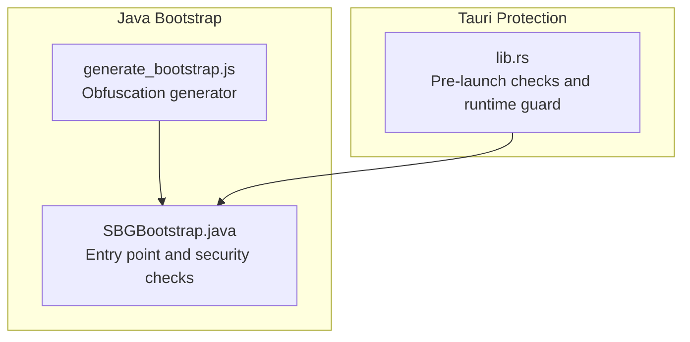
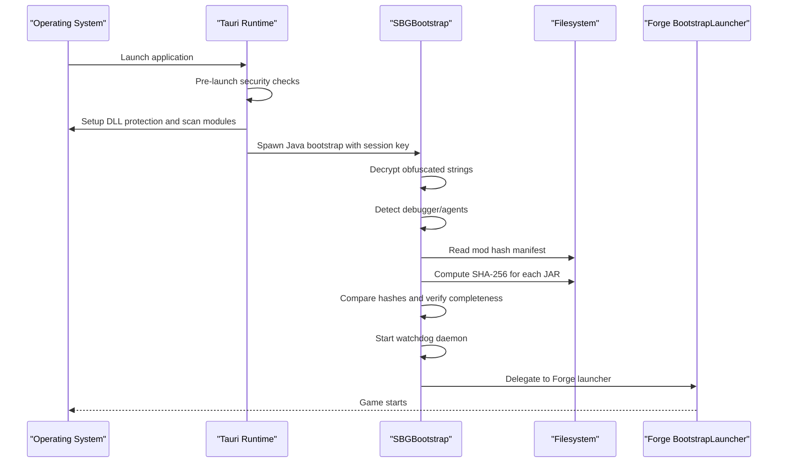
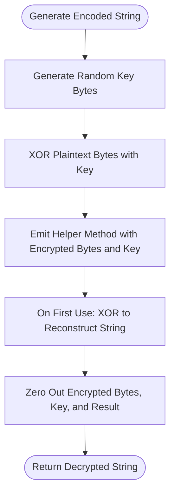
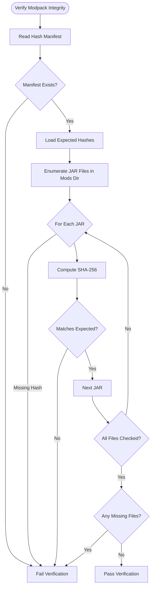
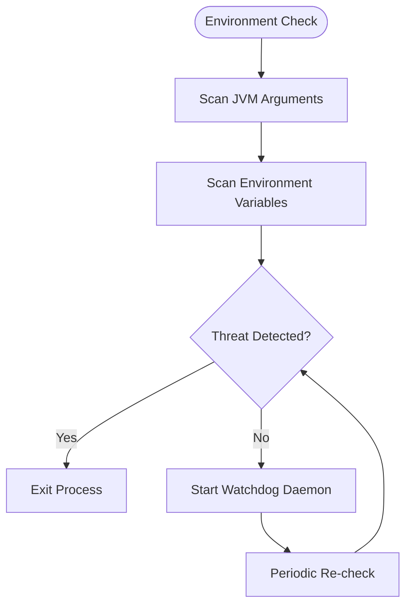
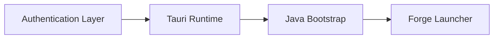
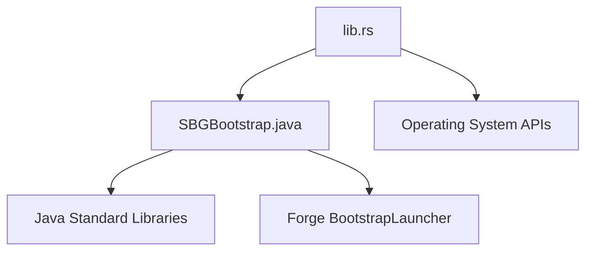

# Java Bootstrap Security

<cite>
**Referenced Files in This Document**
- [SBGBootstrap.java](file://src-java/com/sbgames/bootstrap/SBGBootstrap.java)
- [generate_bootstrap.js](file://scratch/generate_bootstrap.js)
- [lib.rs](file://src-tauri/src/lib.rs)
</cite>

## Table of Contents
1. [Introduction](#introduction)
2. [Project Structure](#project-structure)
3. [Core Components](#core-components)
4. [Architecture Overview](#architecture-overview)
5. [Detailed Component Analysis](#detailed-component-analysis)
6. [Dependency Analysis](#dependency-analysis)
7. [Performance Considerations](#performance-considerations)
8. [Troubleshooting Guide](#troubleshooting-guide)
9. [Conclusion](#conclusion)

## Introduction
This document describes the Java bootstrap security system used in SBGames to protect critical game launch files and modpacks. It explains the XOR-based encoding mechanism used to hide sensitive strings, the integrity verification process that validates file authenticity, and the anti-debugging and anti-analysis techniques employed in the bootstrap loader. It also documents the relationship between the bootstrap security and the overall authentication system, common attack vectors and their mitigations, and provides troubleshooting guidance for security-related issues.

## Project Structure
The security system spans two primary areas:
- Java bootstrap loader: responsible for environment checks, integrity verification, and delegation to the game launcher.
- Tauri-side protection: performs pre-launch security checks, DLL integrity scanning, and runtime monitoring.

**Diagram sources**
- [SBGBootstrap.java](file://src-java/com/sbgames/bootstrap/SBGBootstrap.java)
- [generate_bootstrap.js](file://scratch/generate_bootstrap.js)
- [lib.rs](file://src-tauri/src/lib.rs)

**Section sources**
- [SBGBootstrap.java](file://src-java/com/sbgames/bootstrap/SBGBootstrap.java)
- [generate_bootstrap.js](file://scratch/generate_bootstrap.js)
- [lib.rs](file://src-tauri/src/lib.rs)

## Core Components
- Obfuscated string storage: Sensitive strings (paths, filenames, agent indicators) are stored as XOR-encoded byte arrays and decrypted at runtime via dynamically named helper methods.
- Environment and debugger detection: Scans JVM arguments and environment variables for known debugging/agent indicators.
- Modpack integrity verification: Validates SHA-256 hashes of JAR files against a known-good manifest.
- Active watchdog: Runs a daemon thread to continuously monitor for tampering or debugging.
- Tauri pre-launch protection: Windows-specific DLL protection, trusted module scanning, and runtime guard thread.

**Section sources**
- [SBGBootstrap.java](file://src-java/com/sbgames/bootstrap/SBGBootstrap.java)
- [generate_bootstrap.js](file://scratch/generate_bootstrap.js)
- [lib.rs](file://src-tauri/src/lib.rs)

## Architecture Overview
The bootstrap security architecture consists of layered protections:

**Diagram sources**
- [SBGBootstrap.java](file://src-java/com/sbgames/bootstrap/SBGBootstrap.java)
- [generate_bootstrap.js](file://scratch/generate_bootstrap.js)
- [lib.rs](file://src-tauri/src/lib.rs)

## Detailed Component Analysis

### XOR Encoding Mechanism
The bootstrap uses a simple XOR cipher to encode sensitive strings. The generator script creates a random key for each target string, XORs each byte of the plaintext with the key, and emits a method that reconstructs the original string at runtime. After decryption, all temporary buffers are zeroed to minimize exposure.

Key characteristics:
- Each encoded string is placed behind a dynamically named helper method.
- The key length equals the plaintext length.
- Memory is explicitly wiped after use.

**Diagram sources**
- [generate_bootstrap.js](file://scratch/generate_bootstrap.js)

**Section sources**
- [generate_bootstrap.js](file://scratch/generate_bootstrap.js)
- [SBGBootstrap.java](file://src-java/com/sbgames/bootstrap/SBGBootstrap.java)

### Integrity Verification Process
The modpack integrity check reads a manifest file containing expected SHA-256 hashes and compares them against computed hashes of JAR files in the mods directory. It ensures:
- The manifest exists.
- Every JAR file present is covered by the manifest.
- No extra JAR files are present beyond the manifest.
- Each file’s computed SHA-256 matches the expected value.

**Diagram sources**
- [SBGBootstrap.java](file://src-java/com/sbgames/bootstrap/SBGBootstrap.java)

**Section sources**
- [SBGBootstrap.java](file://src-java/com/sbgames/bootstrap/SBGBootstrap.java)

### Anti-Debugging and Anti-Analysis Techniques
The bootstrap implements several anti-debugging measures:
- JVM argument and environment variable inspection for known debugging/agent indicators.
- Continuous runtime watchdog that re-checks conditions periodically and terminates if threats are detected.
- Tauri pre-launch checks on Windows:
  - DLL protection policy hardening.
  - Trusted module baseline collection and suspicious module detection.
  - Dedicated guard thread that monitors process health and timing anomalies.

**Diagram sources**
- [SBGBootstrap.java](file://src-java/com/sbgames/bootstrap/SBGBootstrap.java)
- [lib.rs](file://src-tauri/src/lib.rs)

**Section sources**
- [SBGBootstrap.java](file://src-java/com/sbgames/bootstrap/SBGBootstrap.java)
- [lib.rs](file://src-tauri/src/lib.rs)

### Relationship Between Bootstrap Security and Authentication System
- Session key requirement: The bootstrap expects a session key passed via stdin, ensuring only authorized launch sequences can proceed.
- Tauri pre-launch enforcement: The Tauri runtime enforces integrity checks and anti-analysis protections before spawning the Java bootstrap, forming a layered defense-in-depth.
- Delegation pattern: Upon successful checks, the bootstrap delegates to the Forge launcher, maintaining a clean separation of concerns between security gating and game launching.

**Diagram sources**
- [SBGBootstrap.java](file://src-java/com/sbgames/bootstrap/SBGBootstrap.java)
- [lib.rs](file://src-tauri/src/lib.rs)

**Section sources**
- [SBGBootstrap.java](file://src-java/com/sbgames/bootstrap/SBGBootstrap.java)
- [lib.rs](file://src-tauri/src/lib.rs)

## Dependency Analysis
The bootstrap depends on:
- Standard Java libraries for IO, reflection, and hashing.
- Tauri runtime for pre-launch security and process protection.
- Forge BootstrapLauncher for the actual game launch delegation.

**Diagram sources**
- [SBGBootstrap.java](file://src-java/com/sbgames/bootstrap/SBGBootstrap.java)
- [lib.rs](file://src-tauri/src/lib.rs)

**Section sources**
- [SBGBootstrap.java](file://src-java/com/sbgames/bootstrap/SBGBootstrap.java)
- [lib.rs](file://src-tauri/src/lib.rs)

## Performance Considerations
- Hash computation: SHA-256 streaming over JAR files is efficient but still I/O bound; keep manifests minimal and avoid unnecessary files.
- Watchdog frequency: The 1-second interval balances responsiveness with overhead; adjust based on platform constraints.
- Memory wiping: Frequent zeroing of buffers is safe but adds CPU overhead; acceptable given the security benefits.
- Pre-launch scans: DLL and module scans occur before Java spawn; ensure they complete quickly to avoid perceived latency.

## Troubleshooting Guide

Common issues and resolutions:
- Session key missing or invalid:
  - Ensure the session key is passed via stdin and meets minimum length requirements.
  - Verify upstream authentication pipeline supplies the key correctly.
- Debugger or agent detected:
  - Remove or rename JVM arguments and environment variables that match known debugging indicators.
  - Review Tauri pre-launch logs for blocked processes or injected DLLs.
- Integrity verification fails:
  - Confirm the mod hash manifest exists and is readable.
  - Verify all JAR files are present and unmodified; remove unexpected files.
  - Recompute and update the manifest if legitimate updates occurred.
- Watchdog termination:
  - Investigate recent process activity for debuggers or suspicious modules.
  - Temporarily disable overlays or tools that hook the process.
- Windows DLL protection:
  - Ensure the game directory and Java runtime paths are trusted.
  - Avoid placing DLLs outside standard system or application directories.

Verification checklist:
- Confirm session key is provided and valid.
- Run pre-launch diagnostics to check for debuggers and injected DLLs.
- Validate the presence and correctness of the mod hash manifest.
- Ensure all JAR files are present and pass SHA-256 comparison.
- Monitor watchdog logs for repeated termination events.

**Section sources**
- [SBGBootstrap.java](file://src-java/com/sbgames/bootstrap/SBGBootstrap.java)
- [lib.rs](file://src-tauri/src/lib.rs)

## Conclusion
The SBGames Java bootstrap security system combines obfuscated string storage, integrity verification, and robust anti-debugging mechanisms to protect game launch assets. Together with Tauri’s pre-launch and runtime protections, it establishes a layered defense that deters tampering and analysis. Proper deployment and maintenance of the mod manifest, along with strict enforcement of session keys and environment hygiene, are essential to sustaining the security posture.