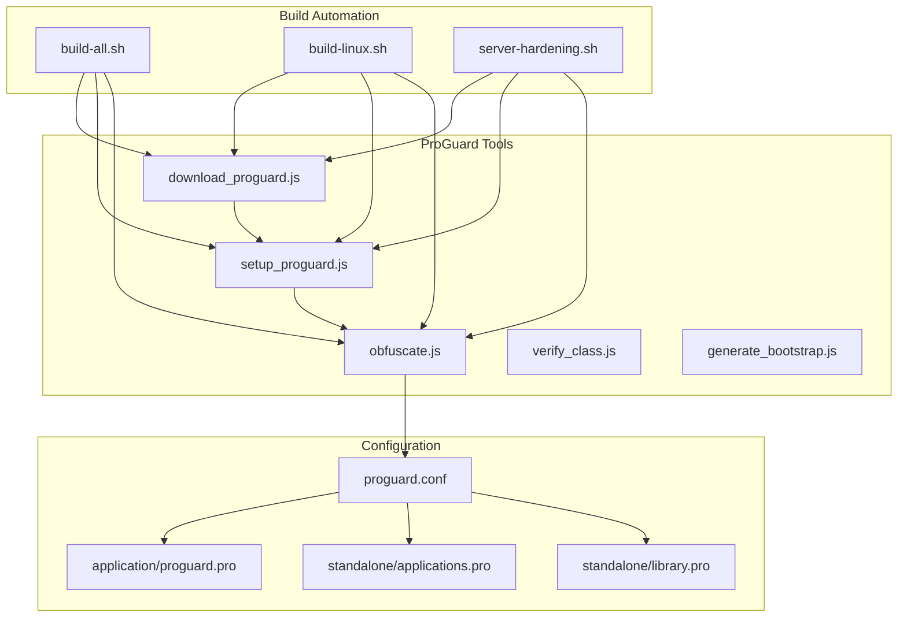
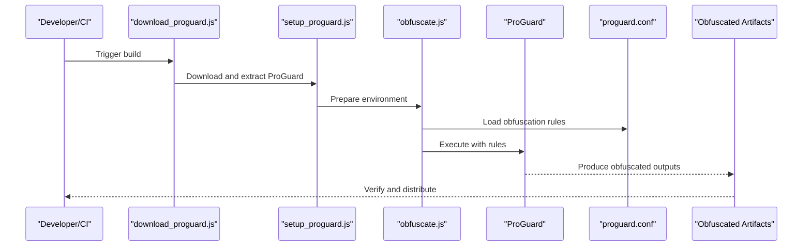
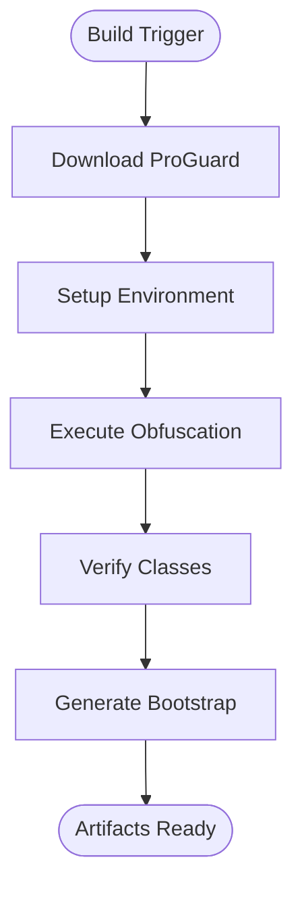
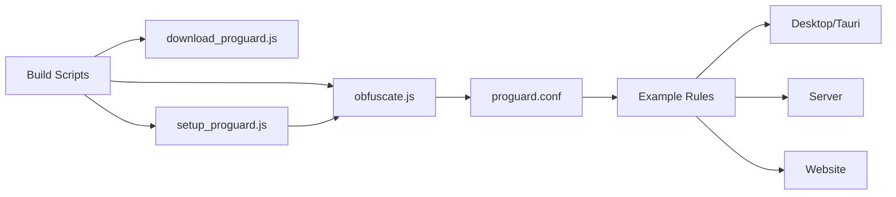

# ProGuard Obfuscation & Code Protection

<cite>
**Referenced Files in This Document**
- [proguard.conf](file://scratch/proguard.conf)
- [obfuscate.js](file://scratch/obfuscate.js)
- [setup_proguard.js](file://scratch/setup_proguard.js)
- [download_proguard.js](file://scratch/download_proguard.js)
- [generate_bootstrap.js](file://scratch/generate_bootstrap.js)
- [verify_class.js](file://scratch/verify_class.js)
- [proguard.pro](file://scratch/proguard/proguard-7.4.2/examples/application/proguard.pro)
- [applications.pro](file://scratch/proguard/proguard-7.4.2/examples/standalone/applications.pro)
- [library.pro](file://scratch/proguard/proguard-7.4.2/examples/standalone/library.pro)
- [build-all.sh](file://scripts/build-all.sh)
- [build-linux.sh](file://scripts/build-linux.sh)
- [server-hardening.sh](file://scripts/server-hardening.sh)
- [package.json](file://package.json)
- [vite.config.js](file://vite.config.js)
- [index.html](file://index.html)
- [src-tauri/main.rs](file://src-tauri/src/main.rs)
- [src-tauri/Cargo.toml](file://src-tauri/Cargo.toml)
- [src-tauri/tauri.conf.json](file://src-tauri/tauri.conf.json)
- [server/package.json](file://server/package.json)
- [server/index.js](file://server/index.js)
- [website/package.json](file://website/package.json)
- [website/vite.config.js](file://website/vite.config.js)
</cite>

## Table of Contents
1. [Introduction](#introduction)
2. [Project Structure](#project-structure)
3. [Core Components](#core-components)
4. [Architecture Overview](#architecture-overview)
5. [Detailed Component Analysis](#detailed-component-analysis)
6. [Dependency Analysis](#dependency-analysis)
7. [Performance Considerations](#performance-considerations)
8. [Troubleshooting Guide](#troubleshooting-guide)
9. [Conclusion](#conclusion)

## Introduction
This document explains the ProGuard-based obfuscation system used to protect SBGames code from reverse engineering. It covers obfuscation techniques (class/method renaming, string encryption), configuration files, build integration, optimization features, deobfuscation challenges, performance impact, and rule customization for desktop, server, and website components.

## Project Structure
SBGames integrates ProGuard through a combination of:
- A central configuration file for obfuscation rules
- JavaScript automation scripts for downloading, setting up, and invoking ProGuard
- Example ProGuard rule sets for applications and libraries
- Build scripts orchestrating the obfuscation process during CI/CD and local builds

**Diagram sources**
- [build-all.sh](file://scripts/build-all.sh)
- [build-linux.sh](file://scripts/build-linux.sh)
- [server-hardening.sh](file://scripts/server-hardening.sh)
- [download_proguard.js](file://scratch/download_proguard.js)
- [setup_proguard.js](file://scratch/setup_proguard.js)
- [obfuscate.js](file://scratch/obfuscate.js)
- [verify_class.js](file://scratch/verify_class.js)
- [generate_bootstrap.js](file://scratch/generate_bootstrap.js)
- [proguard.conf](file://scratch/proguard.conf)
- [proguard.pro](file://scratch/proguard/proguard-7.4.2/examples/application/proguard.pro)
- [applications.pro](file://scratch/proguard/proguard-7.4.2/examples/standalone/applications.pro)
- [library.pro](file://scratch/proguard/proguard-7.4.2/examples/standalone/library.pro)

**Section sources**
- [build-all.sh](file://scripts/build-all.sh)
- [build-linux.sh](file://scripts/build-linux.sh)
- [server-hardening.sh](file://scripts/server-hardening.sh)
- [proguard.conf](file://scratch/proguard.conf)

## Core Components
- Central obfuscation configuration: Defines renaming, string encryption, optimization, and keep rules for the entire project.
- Automation scripts:
  - download_proguard.js: Downloads the ProGuard distribution.
  - setup_proguard.js: Prepares the working environment and extracts ProGuard.
  - obfuscate.js: Executes ProGuard with the configured rules.
  - verify_class.js: Validates that specific classes remain intact after obfuscation.
  - generate_bootstrap.js: Generates bootstrap artifacts for runtime verification.
- Example rule sets: Reference configurations for applications and libraries to guide customization.

Key capabilities:
- Class and member renaming to obscure type and method names
- String encryption to hide sensitive literals
- Dead code elimination and constant folding to reduce size
- Keep rules to preserve entry points and reflection targets

**Section sources**
- [proguard.conf](file://scratch/proguard.conf)
- [obfuscate.js](file://scratch/obfuscate.js)
- [setup_proguard.js](file://scratch/setup_proguard.js)
- [download_proguard.js](file://scratch/download_proguard.js)
- [verify_class.js](file://scratch/verify_class.js)
- [generate_bootstrap.js](file://scratch/generate_bootstrap.js)

## Architecture Overview
The obfuscation pipeline integrates with the build system to transform compiled bytecode and resources into a protected form.

**Diagram sources**
- [download_proguard.js](file://scratch/download_proguard.js)
- [setup_proguard.js](file://scratch/setup_proguard.js)
- [obfuscate.js](file://scratch/obfuscate.js)
- [proguard.conf](file://scratch/proguard.conf)

## Detailed Component Analysis

### ProGuard Configuration and Rule Sets
The central configuration file defines:
- Keep rules for entry points (desktop Tauri main, web app entry, server entry)
- Renaming strategies for classes and members
- String encryption directives
- Optimization directives for code shrinking and tree shaking
- Custom keep rules for reflection and serialization compatibility

Example rule categories:
- Keep Tauri main entry and related handlers
- Keep web application entry and core modules
- Keep server entry and API routes
- Preserve annotation retention for reflection
- Encrypt sensitive strings and keep cryptographic keys

Rule customization guidance:
- Desktop: Add keep rules for Tauri APIs and event handlers
- Server: Add keep rules for Express routes and middleware
- Website: Add keep rules for Vite entry and dynamic imports

**Section sources**
- [proguard.conf](file://scratch/proguard.conf)
- [proguard.pro](file://scratch/proguard/proguard-7.4.2/examples/application/proguard.pro)
- [applications.pro](file://scratch/proguard/proguard-7.4.2/examples/standalone/applications.pro)
- [library.pro](file://scratch/proguard/proguard-7.4.2/examples/standalone/library.pro)

### Obfuscation Techniques
- Class and method renaming: Transforms internal identifiers into short, meaningless names to break static analysis.
- Field and parameter renaming: Applies similar transformations to reduce readability.
- String encryption: Encrypts sensitive strings at compile-time and decrypts at runtime via generated helpers.
- Dead code elimination: Removes unused classes, methods, and fields to shrink binary size.
- Constant folding and simplification: Optimizes arithmetic and string operations.

Deobfuscation challenges:
- String decryption requires runtime helpers; removing them breaks functionality.
- Reflection-based code needs explicit keep rules; otherwise, renaming breaks invocation.
- Resource bundling (web/desktop) complicates static analysis but enables dynamic loading.

**Section sources**
- [proguard.conf](file://scratch/proguard.conf)

### Build Integration and Automation
- download_proguard.js: Fetches the ProGuard distribution and verifies integrity.
- setup_proguard.js: Extracts and configures ProGuard for the current environment.
- obfuscate.js: Invokes ProGuard with the central configuration and validates outputs.
- verify_class.js: Ensures critical classes remain accessible post-obfuscation.
- generate_bootstrap.js: Produces bootstrap artifacts for runtime checks.

**Diagram sources**
- [download_proguard.js](file://scratch/download_proguard.js)
- [setup_proguard.js](file://scratch/setup_proguard.js)
- [obfuscate.js](file://scratch/obfuscate.js)
- [verify_class.js](file://scratch/verify_class.js)
- [generate_bootstrap.js](file://scratch/generate_bootstrap.js)

**Section sources**
- [download_proguard.js](file://scratch/download_proguard.js)
- [setup_proguard.js](file://scratch/setup_proguard.js)
- [obfuscate.js](file://scratch/obfuscate.js)
- [verify_class.js](file://scratch/verify_class.js)
- [generate_bootstrap.js](file://scratch/generate_bootstrap.js)

### Desktop Application Protection (Tauri)
Desktop protection focuses on:
- Keeping Tauri main entry and command handlers
- Preserving window and capability definitions
- Maintaining Rust-to-JavaScript bridges and event handlers
- Protecting embedded resources and assets

Customization tips:
- Add keep rules for any dynamically invoked commands
- Preserve asset loaders and resource paths
- Keep serialization classes for inter-process communication

**Section sources**
- [src-tauri/main.rs](file://src-tauri/src/main.rs)
- [src-tauri/tauri.conf.json](file://src-tauri/tauri.conf.json)
- [proguard.conf](file://scratch/proguard.conf)

### Server Code Protection
Server-side protection emphasizes:
- Keeping Express application entry and route handlers
- Preserving middleware and plugin initialization
- Maintaining API endpoint signatures for clients
- Protecting configuration and secrets loaded at runtime

Customization tips:
- Add keep rules for dynamic route builders
- Preserve error handlers and logging infrastructure
- Keep database connection and ORM models if used

**Section sources**
- [server/index.js](file://server/index.js)
- [server/package.json](file://server/package.json)
- [proguard.conf](file://scratch/proguard.conf)

### Website Platform Protection
Website protection includes:
- Keeping Vite application entry and core components
- Preserving routing and navigation logic
- Protecting API client code and authentication flows
- Maintaining service worker and PWA-related code

Customization tips:
- Add keep rules for dynamic imports and code-splitting boundaries
- Preserve hydration and SSR entry points if applicable
- Keep analytics and monitoring initialization

**Section sources**
- [vite.config.js](file://vite.config.js)
- [package.json](file://package.json)
- [index.html](file://index.html)
- [website/vite.config.js](file://website/vite.config.js)
- [website/package.json](file://website/package.json)
- [proguard.conf](file://scratch/proguard.conf)

## Dependency Analysis
The obfuscation system depends on:
- Build scripts for orchestration
- ProGuard distribution for bytecode transformation
- Configuration files for rule enforcement
- Component-specific entry points for keep rules

**Diagram sources**
- [build-all.sh](file://scripts/build-all.sh)
- [download_proguard.js](file://scratch/download_proguard.js)
- [setup_proguard.js](file://scratch/setup_proguard.js)
- [obfuscate.js](file://scratch/obfuscate.js)
- [proguard.conf](file://scratch/proguard.conf)
- [proguard.pro](file://scratch/proguard/proguard-7.4.2/examples/application/proguard.pro)

**Section sources**
- [build-all.sh](file://scripts/build-all.sh)
- [download_proguard.js](file://scratch/download_proguard.js)
- [setup_proguard.js](file://scratch/setup_proguard.js)
- [obfuscate.js](file://scratch/obfuscate.js)
- [proguard.conf](file://scratch/proguard.conf)

## Performance Considerations
- Obfuscation overhead: Adds build time due to bytecode rewriting and validation.
- Runtime overhead: Minimal; string decryption and reflection require small runtime helpers.
- Binary size reduction: Significant dead code elimination and constant folding.
- Compatibility: Keep rules must be carefully tuned to avoid breaking functionality.

Recommendations:
- Use incremental builds and cache ProGuard outputs where possible.
- Prefer selective keep rules to minimize runtime helpers.
- Monitor binary size and performance regressions after rule changes.

[No sources needed since this section provides general guidance]

## Troubleshooting Guide
Common issues and resolutions:
- ProGuard not found: Ensure download and setup scripts executed successfully.
- Missing entry points: Add or adjust keep rules for desktop, server, or website entries.
- String decryption failures: Verify string encryption rules and runtime helpers.
- Reflection errors: Add keep rules for annotated classes and dynamic invocation targets.
- Build script failures: Check environment variables and working directory permissions.

Validation steps:
- Run verify_class.js to confirm critical classes remain accessible.
- Compare pre/post obfuscation logs for unexpected removals.
- Test runtime behavior after obfuscation to catch missing keep rules.

**Section sources**
- [verify_class.js](file://scratch/verify_class.js)
- [proguard.conf](file://scratch/proguard.conf)

## Conclusion
SBGames employs a robust ProGuard-based obfuscation system integrated into its build pipeline. By combining centralized configuration, automation scripts, and component-specific keep rules, the system protects desktop, server, and website code while minimizing performance impact. Careful tuning of keep rules and continuous validation ensure both security and reliability.