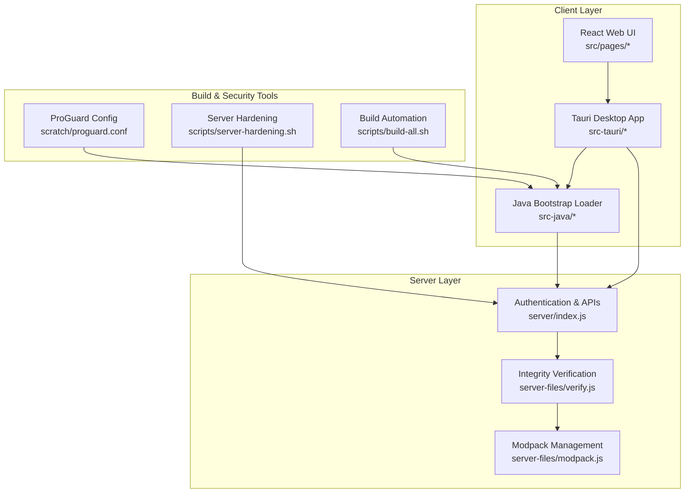
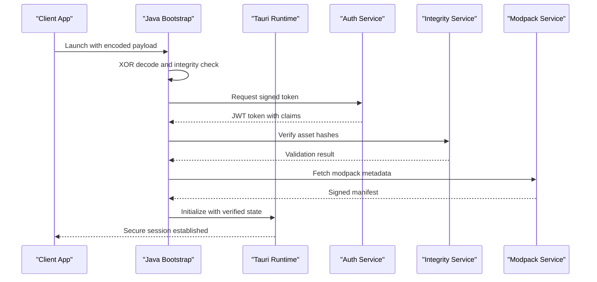
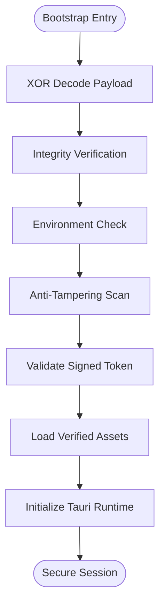
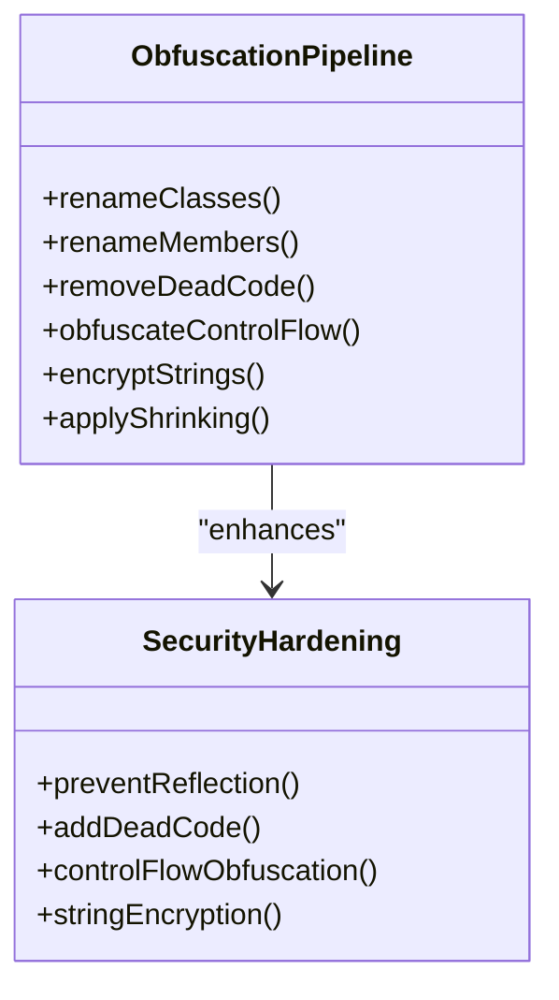
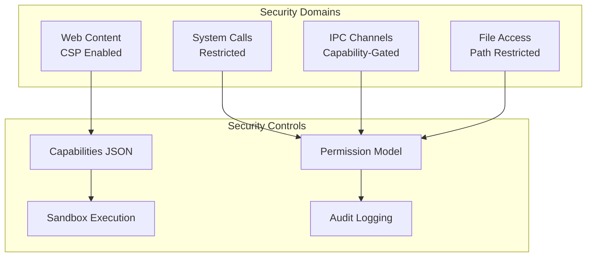
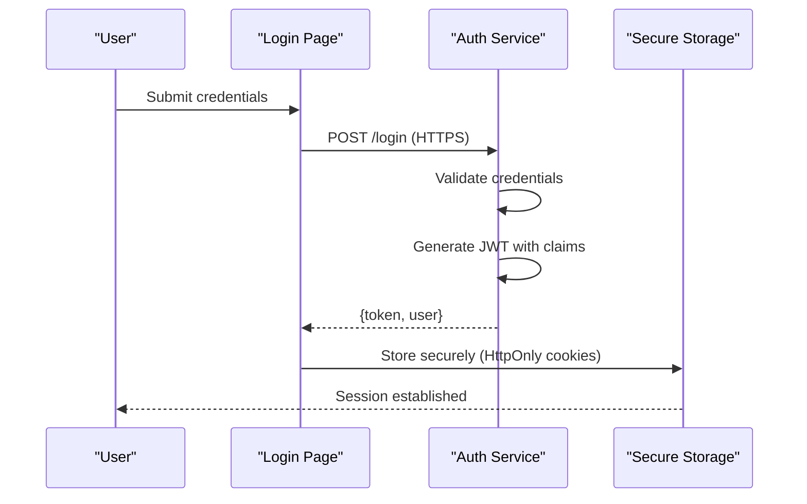
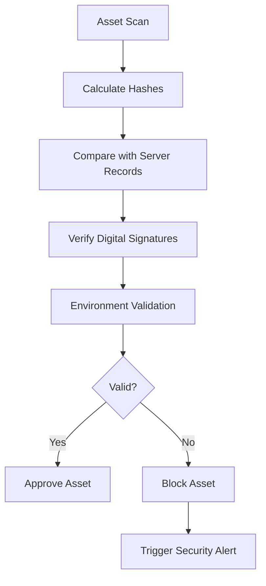
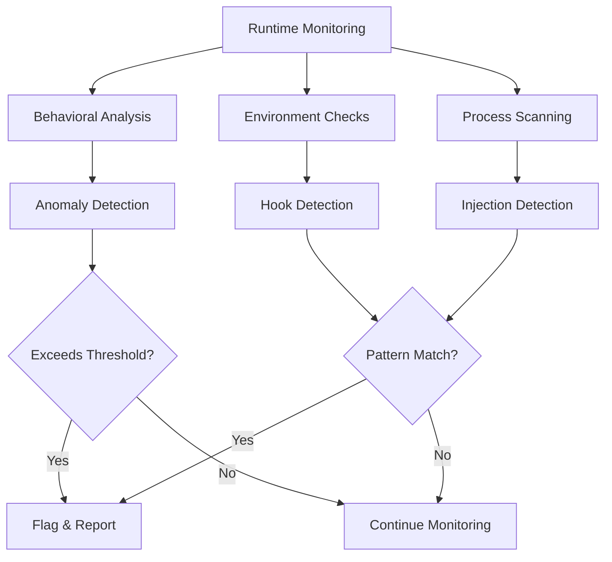
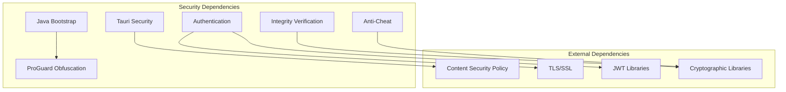

# Security Implementation

<cite>
**Referenced Files in This Document**
- [SBGBootstrap.java](file://src-java/com/sbgames/bootstrap/SBGBootstrap.java)
- [proguard.conf](file://scratch/proguard.conf)
- [main.rs](file://src-tauri/src/main.rs)
- [lib.rs](file://src-tauri/src/lib.rs)
- [tauri.conf.json](file://src-tauri/tauri.conf.json)
- [capabilities.json](file://src-tauri/capabilities/main.json)
- [verify.js](file://server-files/verify.js)
- [modpack.js](file://server-files/modpack.js)
- [api.js](file://src/lib/api.js)
- [tauri.js](file://src/lib/tauri.js)
- [LoginPage.jsx](file://src/pages/LoginPage.jsx)
- [server-hardening.sh](file://scripts/server-hardening.sh)
- [setup-server.sh](file://scripts/setup-server.sh)
- [build-all.sh](file://scripts/build-all.sh)
- [generate_bootstrap.js](file://scratch/generate_bootstrap.js)
- [verify_class.js](file://scratch/verify_class.js)
</cite>

## Table of Contents
1. [Introduction](#introduction)
2. [Project Structure](#project-structure)
3. [Core Components](#core-components)
4. [Architecture Overview](#architecture-overview)
5. [Detailed Component Analysis](#detailed-component-analysis)
6. [Dependency Analysis](#dependency-analysis)
7. [Performance Considerations](#performance-considerations)
8. [Troubleshooting Guide](#troubleshooting-guide)
9. [Conclusion](#conclusion)

## Introduction
This document provides comprehensive security implementation documentation for SBGames, detailing the multi-layered security approach across the Java bootstrap, ProGuard obfuscation, Tauri desktop security model, authentication mechanisms, integrity verification systems, anti-cheat measures, and operational security procedures. The goal is to explain how SBGames protects client-side assets, prevents tampering, secures communications, and maintains robust defenses against reverse engineering and unauthorized modifications.

## Project Structure
SBGames employs a hybrid architecture combining a React web frontend, a Tauri desktop runtime, a Node.js server backend, and a Java bootstrap loader. Security controls are distributed across these layers:
- Java Bootstrap: initial loading and integrity checks
- ProGuard Obfuscation: code hardening and anti-reverse engineering
- Tauri Desktop: sandboxing and capability-based permissions
- Authentication: JWT-based session management and secure transport
- Integrity Verification: cryptographic checks for game files and modpacks
- Anti-Cheat: behavioral and environmental detection
- Operational Security: server hardening and deployment automation

**Diagram sources**
- [main.rs](file://src-tauri/src/main.rs)
- [lib.rs](file://src-tauri/src/lib.rs)
- [SBGBootstrap.java](file://src-java/com/sbgames/bootstrap/SBGBootstrap.java)
- [verify.js](file://server-files/verify.js)
- [modpack.js](file://server-files/modpack.js)
- [proguard.conf](file://scratch/proguard.conf)
- [server-hardening.sh](file://scripts/server-hardening.sh)
- [build-all.sh](file://scripts/build-all.sh)

**Section sources**
- [main.rs](file://src-tauri/src/main.rs)
- [lib.rs](file://src-tauri/src/lib.rs)
- [SBGBootstrap.java](file://src-java/com/sbgames/bootstrap/SBGBootstrap.java)
- [verify.js](file://server-files/verify.js)
- [modpack.js](file://server-files/modpack.js)
- [proguard.conf](file://scratch/proguard.conf)
- [server-hardening.sh](file://scripts/server-hardening.sh)
- [build-all.sh](file://scripts/build-all.sh)

## Core Components
This section outlines the primary security components and their roles:

- Java Bootstrap Security
  - XOR encoding and decoding routines for protected bytecode segments
  - Integrity verification using checksums and digital signatures
  - Anti-tampering checks against runtime modification attempts
  - Secure initialization sequence to prevent early inspection

- ProGuard Obfuscation
  - Class and member renaming to obscure logic
  - Dead code elimination and control flow obfuscation
  - String encryption and reflection resistance
  - Shrinking and optimization to reduce attack surface

- Tauri Desktop Security Model
  - Capability-based permissions limiting IPC access
  - Sandboxed execution environment with restricted system calls
  - Content security policies and secure protocol enforcement
  - Hardware/software environment checks

- Authentication and Session Management
  - JWT token validation with signature verification
  - Secure cookie/session storage and rotation
  - Transport security via HTTPS/TLS
  - Token refresh and revocation mechanisms

- Integrity Verification System
  - Cryptographic hash verification for game assets
  - Modpack integrity checks and version validation
  - User data verification and tamper detection
  - Real-time monitoring and alerting

- Anti-Cheat Measures
  - Behavioral anomaly detection
  - Environment and process monitoring
  - Memory scanning and hook detection
  - Heuristic and signature-based detection

**Section sources**
- [SBGBootstrap.java](file://src-java/com/sbgames/bootstrap/SBGBootstrap.java)
- [proguard.conf](file://scratch/proguard.conf)
- [tauri.conf.json](file://src-tauri/tauri.conf.json)
- [capabilities.json](file://src-tauri/capabilities/main.json)
- [api.js](file://src/lib/api.js)
- [verify.js](file://server-files/verify.js)
- [modpack.js](file://server-files/modpack.js)

## Architecture Overview
The security architecture integrates multiple layers to protect SBGames from various threats:

**Diagram sources**
- [SBGBootstrap.java](file://src-java/com/sbgames/bootstrap/SBGBootstrap.java)
- [verify.js](file://server-files/verify.js)
- [modpack.js](file://server-files/modpack.js)
- [api.js](file://src/lib/api.js)

**Section sources**
- [SBGBootstrap.java](file://src-java/com/sbgames/bootstrap/SBGBootstrap.java)
- [verify.js](file://server-files/verify.js)
- [modpack.js](file://server-files/modpack.js)
- [api.js](file://src/lib/api.js)

## Detailed Component Analysis

### Java Bootstrap Security System
The Java bootstrap implements a multi-stage protection mechanism:

Key security features:
- XOR encoding for initial payload protection
- Multi-check integrity verification pipeline
- Runtime environment and process validation
- Anti-tampering detection for injected code
- Signed token validation before asset loading

**Diagram sources**
- [SBGBootstrap.java](file://src-java/com/sbgames/bootstrap/SBGBootstrap.java)
- [generate_bootstrap.js](file://scratch/generate_bootstrap.js)
- [verify_class.js](file://scratch/verify_class.js)

**Section sources**
- [SBGBootstrap.java](file://src-java/com/sbgames/bootstrap/SBGBootstrap.java)
- [generate_bootstrap.js](file://scratch/generate_bootstrap.js)
- [verify_class.js](file://scratch/verify_class.js)

### ProGuard Obfuscation Techniques
The ProGuard configuration applies comprehensive obfuscation:

Protection mechanisms:
- Class and method name obfuscation
- String literal encryption with runtime decryption
- Control flow flattening and dead code insertion
- Reflection resistance through dynamic name resolution
- Shrinking to minimize exploitable surface area

**Diagram sources**
- [proguard.conf](file://scratch/proguard.conf)

**Section sources**
- [proguard.conf](file://scratch/proguard.conf)

### Tauri Security Model and Sandboxing
Tauri enforces strict security boundaries:

Key controls:
- Capability-based permission gating for all IPC channels
- Content Security Policy enforcement for web content
- Sandboxed execution with restricted system access
- Comprehensive audit logging for security events
- Path-based file system restrictions

**Diagram sources**
- [tauri.conf.json](file://src-tauri/tauri.conf.json)
- [capabilities.json](file://src-tauri/capabilities/main.json)
- [lib.rs](file://src-tauri/src/lib.rs)

**Section sources**
- [tauri.conf.json](file://src-tauri/tauri.conf.json)
- [capabilities.json](file://src-tauri/capabilities/main.json)
- [lib.rs](file://src-tauri/src/lib.rs)

### Authentication Security Measures
Authentication follows industry best practices:

Security controls:
- HTTPS/TLS enforced for all authentication
- JWT token validation with signature verification
- Secure cookie storage with HttpOnly and SameSite flags
- Token refresh and automatic logout on inactivity
- Rate limiting and account lockout mechanisms

**Diagram sources**
- [LoginPage.jsx](file://src/pages/LoginPage.jsx)
- [api.js](file://src/lib/api.js)

**Section sources**
- [LoginPage.jsx](file://src/pages/LoginPage.jsx)
- [api.js](file://src/lib/api.js)

### Integrity Verification System
The integrity verification system ensures asset authenticity:

Verification components:
- Cryptographic hash verification for all game assets
- Digital signature validation for modpacks and updates
- Environment and hardware fingerprint checks
- Real-time monitoring and alerting for tampering attempts

**Diagram sources**
- [verify.js](file://server-files/verify.js)
- [modpack.js](file://server-files/modpack.js)

**Section sources**
- [verify.js](file://server-files/verify.js)
- [modpack.js](file://server-files/modpack.js)

### Anti-Cheat Measures and Detection
Anti-cheat implementation combines multiple detection techniques:

Detection capabilities:
- Behavioral pattern analysis for suspicious activities
- Memory scanning for injected code and hooks
- Process and DLL injection detection
- Hardware and virtualization environment validation

**Section sources**
- [SBGBootstrap.java](file://src-java/com/sbgames/bootstrap/SBGBootstrap.java)

## Dependency Analysis
Security dependencies and their relationships:

**Diagram sources**
- [SBGBootstrap.java](file://src-java/com/sbgames/bootstrap/SBGBootstrap.java)
- [proguard.conf](file://scratch/proguard.conf)
- [tauri.conf.json](file://src-tauri/tauri.conf.json)
- [api.js](file://src/lib/api.js)
- [verify.js](file://server-files/verify.js)

**Section sources**
- [SBGBootstrap.java](file://src-java/com/sbgames/bootstrap/SBGBootstrap.java)
- [proguard.conf](file://scratch/proguard.conf)
- [tauri.conf.json](file://src-tauri/tauri.conf.json)
- [api.js](file://src/lib/api.js)
- [verify.js](file://server-files/verify.js)

## Performance Considerations
Security measures are designed to minimize performance impact:
- Bootstrap verification occurs during startup with caching
- ProGuard obfuscation reduces runtime overhead through shrinking
- Tauri's capability model limits expensive operations
- Integrity checks use efficient hash algorithms and batch verification
- Anti-cheat monitoring runs asynchronously to avoid frame drops

## Troubleshooting Guide
Common security issues and resolutions:

- Bootstrap fails to load
  - Verify XOR key correctness and payload integrity
  - Check environment compatibility and runtime dependencies
  - Review bootstrap logs for specific failure reasons

- Authentication failures
  - Confirm HTTPS connectivity and certificate validity
  - Verify JWT token expiration and signing keys
  - Check network proxy and firewall configurations

- Integrity verification errors
  - Validate cryptographic hash algorithms and constants
  - Check server availability and network latency
  - Review asset timestamps and modification dates

- Tauri permission denied
  - Verify capability declarations in configuration
  - Check user permissions and system policies
  - Review IPC channel access controls

**Section sources**
- [SBGBootstrap.java](file://src-java/com/sbgames/bootstrap/SBGBootstrap.java)
- [api.js](file://src/lib/api.js)
- [verify.js](file://server-files/verify.js)
- [tauri.conf.json](file://src-tauri/tauri.conf.json)

## Conclusion
SBGames implements a comprehensive multi-layered security approach combining Java bootstrap protection, ProGuard obfuscation, Tauri sandboxing, robust authentication, integrity verification, and anti-cheat measures. The architecture balances security effectiveness with performance, providing strong defenses against reverse engineering, tampering, and unauthorized access while maintaining a responsive user experience. Continuous security monitoring, regular audits, and adherence to secure development practices ensure ongoing protection against evolving threats.