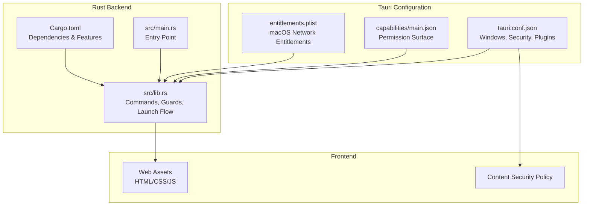
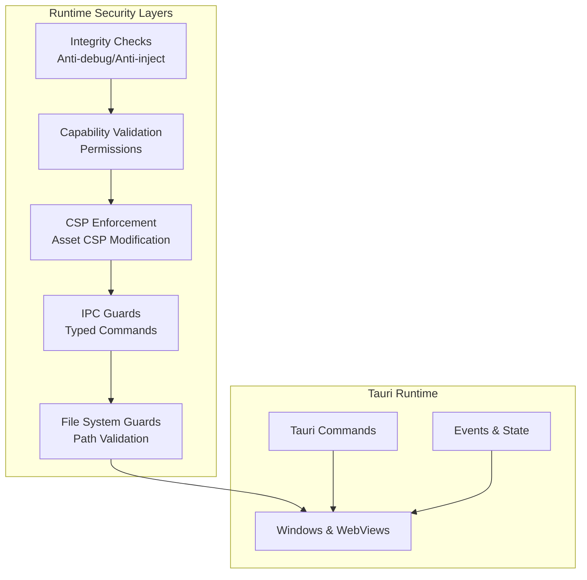
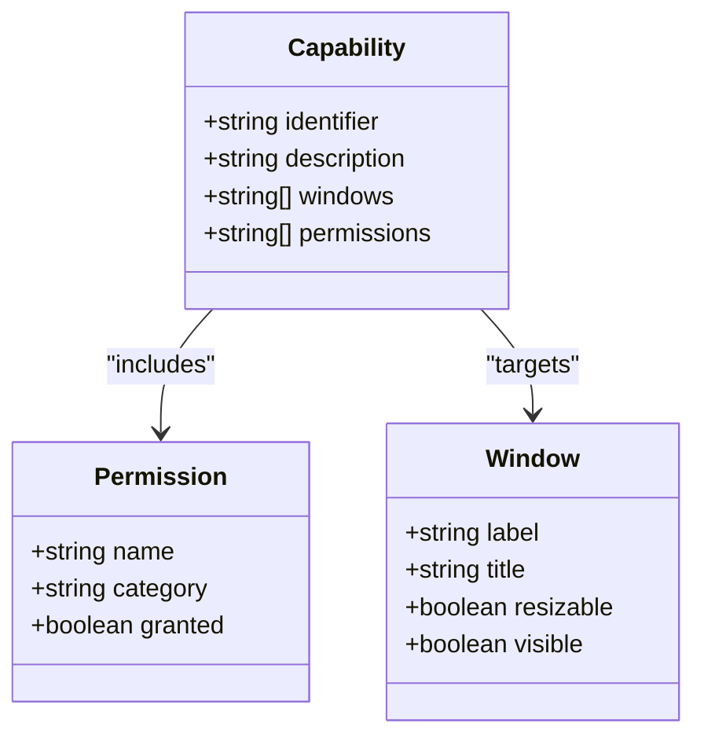
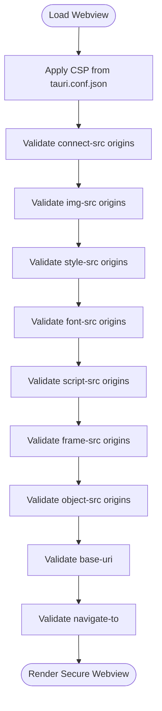
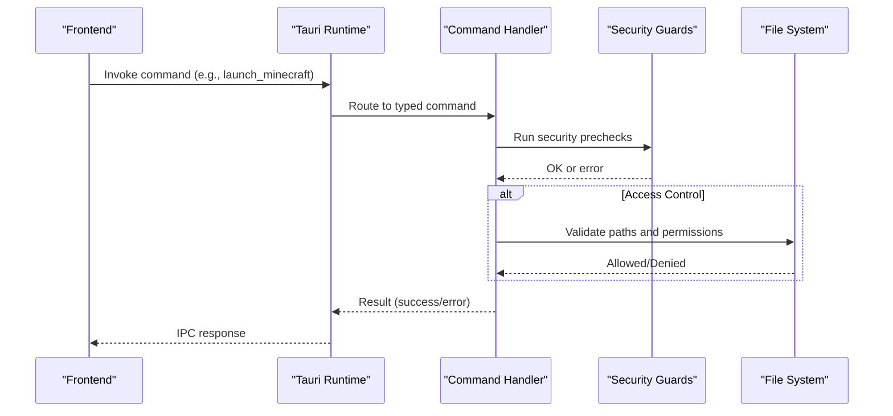
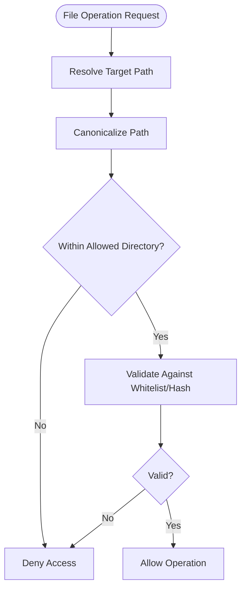
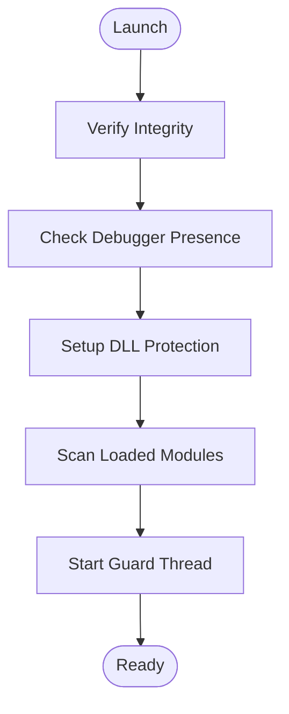
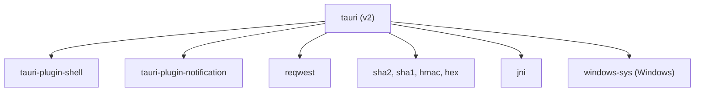

# Tauri Security Model & Sandboxing

<cite>
**Referenced Files in This Document**
- [Cargo.toml](file://src-tauri/Cargo.toml)
- [tauri.conf.json](file://src-tauri/tauri.conf.json)
- [lib.rs](file://src-tauri/src/lib.rs)
- [main.rs](file://src-tauri/src/main.rs)
- [main.json](file://src-tauri/capabilities/main.json)
- [capabilities.json](file://src-tauri/gen/schemas/capabilities.json)
- [entitlements.plist](file://src-tauri/entitlements.plist)
</cite>

## Table of Contents
1. [Introduction](#introduction)
2. [Project Structure](#project-structure)
3. [Core Components](#core-components)
4. [Architecture Overview](#architecture-overview)
5. [Detailed Component Analysis](#detailed-component-analysis)
6. [Dependency Analysis](#dependency-analysis)
7. [Performance Considerations](#performance-considerations)
8. [Troubleshooting Guide](#troubleshooting-guide)
9. [Conclusion](#conclusion)

## Introduction
This document explains the Tauri security model and sandboxing implementation in the SBGames desktop application. It covers the Rust-based security architecture, memory safety guarantees, capability-based permissions, window security policies, cross-origin resource sharing controls, content security policies, script injection prevention, IPC security measures, file system access restrictions, and the security implications of enabling/disabling Tauri features. It also provides secure coding practices, common pitfalls, and guidance for configuring security settings across deployment scenarios.

## Project Structure
The security model spans three primary areas:
- Tauri configuration and capabilities define the permission surface and window policies.
- Rust backend enforces runtime protections, validates integrity, and manages IPC-safe operations.
- Frontend assets are governed by Content Security Policy and asset CSP modification controls.

**Diagram sources**
- [tauri.conf.json:1-89](file://src-tauri/tauri.conf.json#L1-L89)
- [lib.rs:1-800](file://src-tauri/src/lib.rs#L1-L800)
- [main.rs:1-7](file://src-tauri/src/main.rs#L1-L7)
- [Cargo.toml:1-57](file://src-tauri/Cargo.toml#L1-L57)
- [main.json:1-25](file://src-tauri/capabilities/main.json#L1-L25)
- [entitlements.plist:1-11](file://src-tauri/entitlements.plist#L1-L11)

**Section sources**
- [tauri.conf.json:1-89](file://src-tauri/tauri.conf.json#L1-L89)
- [lib.rs:1-800](file://src-tauri/src/lib.rs#L1-L800)
- [main.rs:1-7](file://src-tauri/src/main.rs#L1-L7)
- [Cargo.toml:1-57](file://src-tauri/Cargo.toml#L1-L57)
- [main.json:1-25](file://src-tauri/capabilities/main.json#L1-L25)
- [entitlements.plist:1-11](file://src-tauri/entitlements.plist#L1-L11)

## Core Components
- Capability-based permissions: Explicitly grant only required webview/window shell actions to minimize attack surface.
- Window security policies: Define window properties and enforce CSP for isolation.
- Content Security Policy: Strict CSP prevents mixed-content, inline scripts, and unauthorized resource loads.
- IPC security: Commands are typed and scoped; sensitive operations are guarded by prechecks and runtime monitors.
- File system access: Paths are validated and restricted; modpack integrity enforced via SHA-256 and whitelist.
- Anti-debug and anti-injection: Runtime checks, DLL protection, and process safeguards.

**Section sources**
- [main.json:6-23](file://src-tauri/capabilities/main.json#L6-L23)
- [tauri.conf.json:46-49](file://src-tauri/tauri.conf.json#L46-L49)
- [lib.rs:140-181](file://src-tauri/src/lib.rs#L140-L181)
- [lib.rs:273-282](file://src-tauri/src/lib.rs#L273-L282)
- [lib.rs:1775-1826](file://src-tauri/src/lib.rs#L1775-L1826)

## Architecture Overview
The SBGames launcher uses Tauri v2 with a Rust backend and a web-based UI. Security is enforced through layered mechanisms:
- Compile-time: Cargo features and dependency selection.
- Build-time: Capability generation and schema validation.
- Runtime: Integrity checks, anti-debug/anti-injection, CSP enforcement, and IPC guards.

**Diagram sources**
- [lib.rs:2526-2599](file://src-tauri/src/lib.rs#L2526-L2599)
- [main.json:6-23](file://src-tauri/capabilities/main.json#L6-L23)
- [tauri.conf.json:46-49](file://src-tauri/tauri.conf.json#L46-L49)
- [lib.rs:140-181](file://src-tauri/src/lib.rs#L140-L181)
- [lib.rs:273-282](file://src-tauri/src/lib.rs#L273-L282)

## Detailed Component Analysis

### Capability-Based Permissions System
The capability system defines which actions are permitted for specific windows. The main capability grants:
- Core window operations: minimize, toggle maximize, close, drag, cursor visibility, hide/show, position/size, center, outer position, focus, visibility.
- Webview creation for the main window.
- Shell open action.

These permissions are compiled into a capability schema and enforced by Tauri’s runtime.

**Diagram sources**
- [main.json:1-25](file://src-tauri/capabilities/main.json#L1-L25)
- [capabilities.json:1](file://src-tauri/gen/schemas/capabilities.json#L1)

**Section sources**
- [main.json:1-25](file://src-tauri/capabilities/main.json#L1-L25)
- [capabilities.json:1](file://src-tauri/gen/schemas/capabilities.json#L1)

### Window Security Policies and CSP
Windows are defined with strict properties (size limits, decorations, transparency, shadow, visibility). The application-level CSP enforces:
- Default source self
- Connect-src limited to trusted APIs and WebSocket endpoints
- Image, style, font, script, frame, object, base-uri, and navigate-to sources
- Dangerous CSP asset modification disabled to maintain strictness

**Diagram sources**
- [tauri.conf.json:46-49](file://src-tauri/tauri.conf.json#L46-L49)

**Section sources**
- [tauri.conf.json:14-49](file://src-tauri/tauri.conf.json#L14-L49)
- [tauri.conf.json:46-49](file://src-tauri/tauri.conf.json#L46-L49)

### Content Security Policy and Script Injection Prevention
The CSP configuration prevents inline scripts, requires hashed or nonce sources for scripts, restricts frames and objects, and limits navigation. Asset CSP modification is not disabled, ensuring Tauri’s strict defaults remain intact.

Key CSP directives:
- default-src 'self'
- connect-src for trusted endpoints
- img-src for self, data, https, blob
- style-src for self, unsafe-inline, fonts.googleapis.com
- font-src for self, data, fonts.gstatic.com
- script-src for self
- frame-src 'none'
- object-src 'none'
- base-uri 'self'
- navigate-to for self and localhost dev URL

**Section sources**
- [tauri.conf.json:46-49](file://src-tauri/tauri.conf.json#L46-L49)

### IPC Security Measures and Message Validation
Tauri commands are declared and invoked through a typed handler. The backend enforces:
- Pre-launch security checks (anti-debug, anti-injection)
- Path validation for file operations
- Controlled environment variable scrubbing
- Process spawning with explicit classpaths and JVM arguments
- Runtime monitoring of launched processes for tampering

**Diagram sources**
- [lib.rs:140-181](file://src-tauri/src/lib.rs#L140-L181)
- [lib.rs:340-400](file://src-tauri/src/lib.rs#L340-L400)
- [lib.rs:2551-2574](file://src-tauri/src/lib.rs#L2551-L2574)

**Section sources**
- [lib.rs:140-181](file://src-tauri/src/lib.rs#L140-L181)
- [lib.rs:340-400](file://src-tauri/src/lib.rs#L340-L400)
- [lib.rs:2551-2574](file://src-tauri/src/lib.rs#L2551-L2574)

### File System Access Restrictions and Sandbox Boundaries
File operations are constrained:
- Screenshot reading validates canonicalized paths against a dedicated screenshots directory.
- Modpack synchronization enforces SHA-256 and whitelist checks; only allowed mods are retained.
- Minecraft directory is isolated under a custom path to avoid conflicts with standard installations.
- Windows-only: read-only attributes and Job Objects are used to harden the environment.

**Diagram sources**
- [lib.rs:273-282](file://src-tauri/src/lib.rs#L273-L282)
- [lib.rs:1614-1677](file://src-tauri/src/lib.rs#L1614-L1677)

**Section sources**
- [lib.rs:273-282](file://src-tauri/src/lib.rs#L273-L282)
- [lib.rs:1614-1677](file://src-tauri/src/lib.rs#L1614-L1677)
- [lib.rs:1888-1904](file://src-tauri/src/lib.rs#L1888-L1904)

### Anti-Debugging, Anti-Injection, and Runtime Protection
The backend implements:
- Anti-debug checks (Windows: IsDebuggerPresent, CheckRemoteDebuggerPresent)
- DLL protection (Windows: SetDllDirectoryW, SetSearchPathMode, mitigation policies)
- Module scanning for forbidden keywords and suspicious paths
- Runtime integrity verification and guard threads
- Process-level safeguards (Windows Job Objects, UI restrictions)

**Diagram sources**
- [lib.rs:12-138](file://src-tauri/src/lib.rs#L12-L138)
- [lib.rs:1775-1826](file://src-tauri/src/lib.rs#L1775-L1826)
- [lib.rs:2526-2544](file://src-tauri/src/lib.rs#L2526-L2544)

**Section sources**
- [lib.rs:12-138](file://src-tauri/src/lib.rs#L12-L138)
- [lib.rs:1775-1826](file://src-tauri/src/lib.rs#L1775-L1826)
- [lib.rs:2526-2544](file://src-tauri/src/lib.rs#L2526-L2544)

### Cross-Origin Resource Sharing Controls
- The CSP restricts connect-src to trusted domains and WebSocket endpoints.
- Asset CSP modification is not disabled, maintaining Tauri’s strict defaults.
- macOS entitlements enable network client/server capabilities for outbound connections.

**Section sources**
- [tauri.conf.json:46-49](file://src-tauri/tauri.conf.json#L46-L49)
- [entitlements.plist:4-10](file://src-tauri/entitlements.plist#L4-L10)

### Secure Coding Practices and Common Pitfalls
Secure coding practices demonstrated in the codebase:
- Validate and canonicalize all file paths before access.
- Enforce strict CSP and avoid disabling asset CSP modification.
- Use typed Tauri commands and centralize security checks.
- Scrub environment variables that could influence external processes.
- Employ runtime monitors for integrity and tamper detection.

Common pitfalls to avoid:
- Disabling dangerous CSP asset modification without understanding the risk.
- Allowing inline scripts or wildcard sources in CSP.
- Excessive permissions in capabilities; prefer least privilege.
- Unsafe path handling leading to directory traversal.
- Relying solely on frontend validation; always validate on the backend.

**Section sources**
- [lib.rs:273-282](file://src-tauri/src/lib.rs#L273-L282)
- [lib.rs:366-371](file://src-tauri/src/lib.rs#L366-L371)
- [lib.rs:1775-1826](file://src-tauri/src/lib.rs#L1775-L1826)
- [tauri.conf.json:46-49](file://src-tauri/tauri.conf.json#L46-L49)

### Configuring Security Settings for Different Deployment Scenarios
- Development vs Production:
  - Development CSP can be stricter than production if needed; ensure asset CSP modification remains controlled.
  - Release builds enable integrity checks, DLL protection, and guard threads.
- Enterprise environments:
  - Tighten CSP further by restricting connect-src to internal endpoints only.
  - Limit capabilities to minimal required actions.
- macOS distribution:
  - Ensure network entitlements align with intended connectivity.
- Containerized or hardened environments:
  - Combine CSP, capability restrictions, and runtime process safeguards for defense-in-depth.

**Section sources**
- [tauri.conf.json:46-49](file://src-tauri/tauri.conf.json#L46-L49)
- [lib.rs:2526-2544](file://src-tauri/src/lib.rs#L2526-L2544)
- [entitlements.plist:4-10](file://src-tauri/entitlements.plist#L4-L10)

## Dependency Analysis
The Rust backend depends on Tauri v2 and selected plugins. Dependencies include:
- tauri, tauri-plugin-shell, tauri-plugin-notification
- Security-related crates: reqwest (HTTP), sha-2 family (integrity), hex/base64 encoders
- Platform-specific Windows syscalls for process and DLL protection
- JNI for embedded JVM launching

**Diagram sources**
- [Cargo.toml:17-39](file://src-tauri/Cargo.toml#L17-L39)

**Section sources**
- [Cargo.toml:17-39](file://src-tauri/Cargo.toml#L17-L39)

## Performance Considerations
- CSP parsing and enforcement adds negligible overhead compared to the benefits.
- Runtime integrity checks occur once at startup and periodically poll for tampering; keep intervals reasonable.
- File hashing and modpack verification are I/O bound; cache whitelists and hashes where appropriate.
- Avoid excessive IPC emissions; batch progress updates as implemented.

[No sources needed since this section provides general guidance]

## Troubleshooting Guide
- If CSP blocks legitimate assets, review the CSP configuration and ensure only necessary sources are allowed.
- If commands fail due to permissions, verify the capability configuration for the target window.
- If integrity checks fail, confirm the binary is unmodified and environment variables are clean.
- If file operations are blocked, ensure paths resolve within allowed directories and pass whitelist/hash checks.

**Section sources**
- [tauri.conf.json:46-49](file://src-tauri/tauri.conf.json#L46-L49)
- [main.json:6-23](file://src-tauri/capabilities/main.json#L6-L23)
- [lib.rs:273-282](file://src-tauri/src/lib.rs#L273-L282)
- [lib.rs:12-138](file://src-tauri/src/lib.rs#L12-L138)

## Conclusion
SBGames leverages Tauri v2’s capability-based permissions, strict CSP, and a robust Rust backend to deliver a secure desktop launcher. Runtime protections, file system constraints, and IPC safeguards collectively reduce attack surfaces. By adhering to least-privilege capabilities, enforcing CSP, validating paths, and continuously monitoring integrity, the application maintains strong security posture across platforms and deployment scenarios.