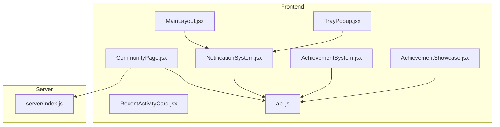
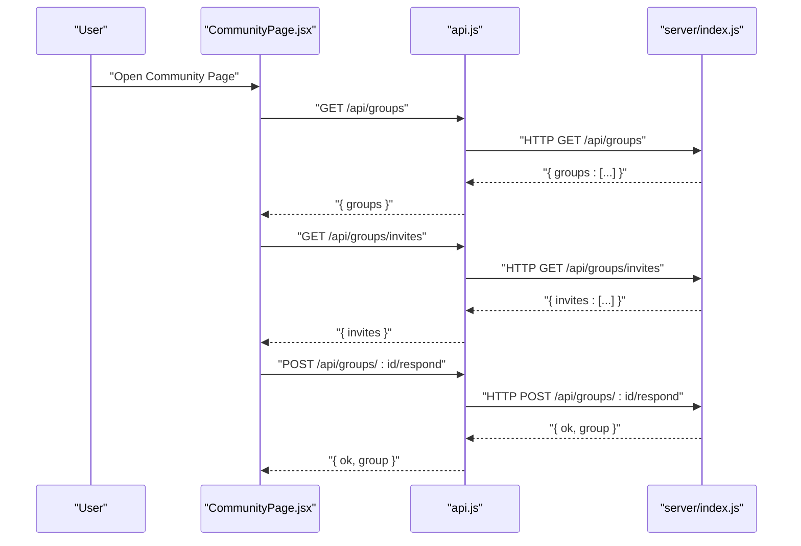
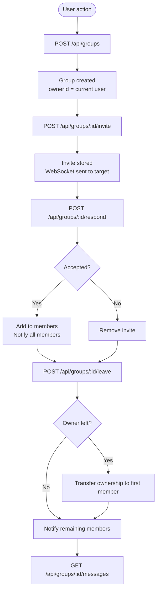
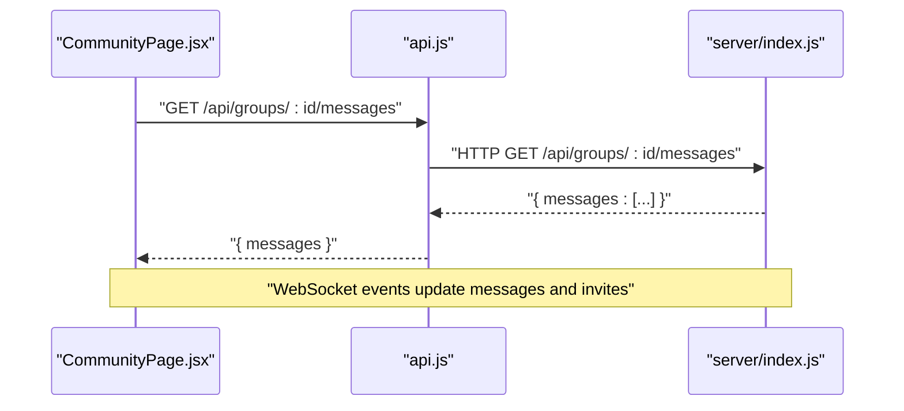
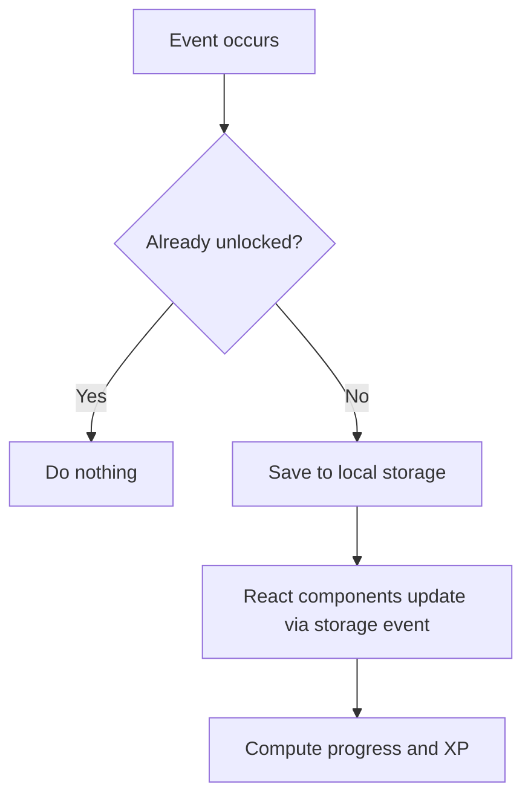
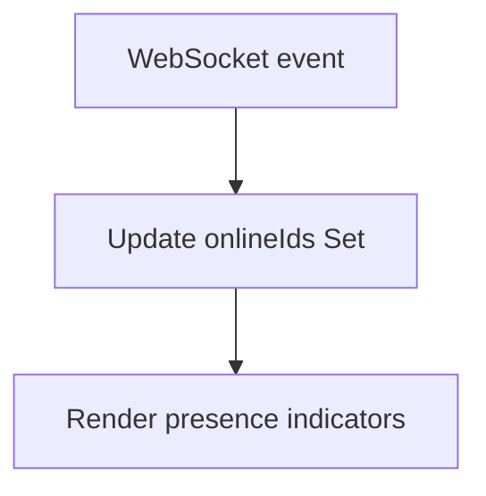
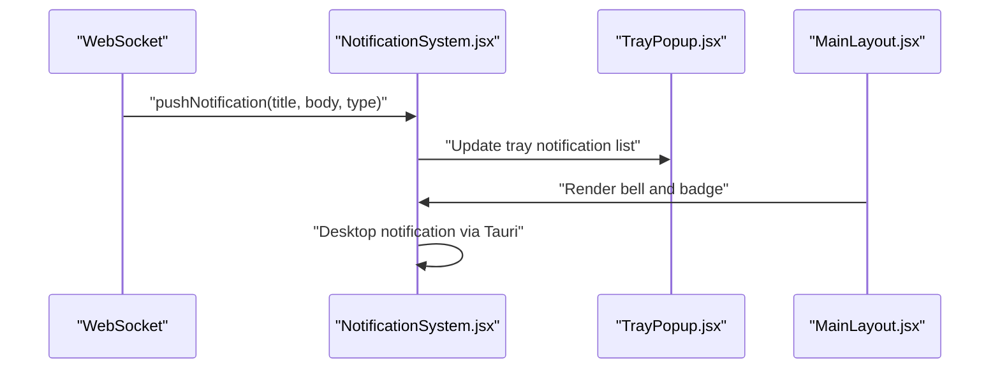
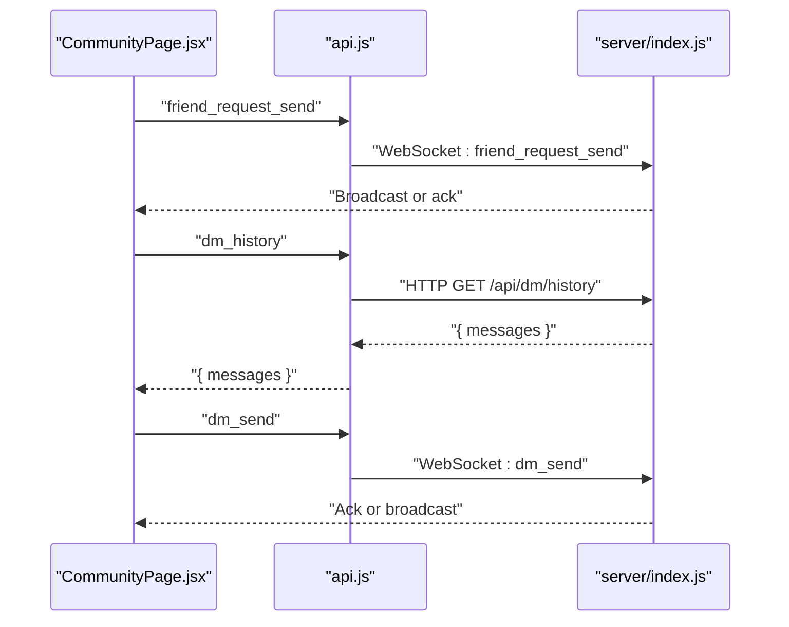
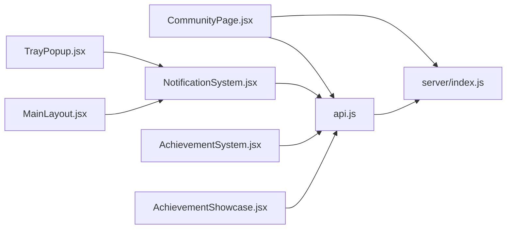

# Community Features & Activities

<cite>
**Referenced Files in This Document**
- [CommunityPage.jsx](file://src/pages/CommunityPage.jsx)
- [RecentActivityCard.jsx](file://src/components/RecentActivityCard.jsx)
- [NotificationSystem.jsx](file://src/components/NotificationSystem.jsx)
- [AchievementSystem.jsx](file://src/components/AchievementSystem.jsx)
- [AchievementShowcase.jsx](file://src/components/AchievementShowcase.jsx)
- [MainLayout.jsx](file://src/pages/MainLayout.jsx)
- [TrayPopup.jsx](file://src/pages/TrayPopup.jsx)
- [server_index.js](file://server/index.js)
- [api.js](file://src/lib/api.js)
</cite>

## Table of Contents
1. [Introduction](#introduction)
2. [Project Structure](#project-structure)
3. [Core Components](#core-components)
4. [Architecture Overview](#architecture-overview)
5. [Detailed Component Analysis](#detailed-component-analysis)
6. [Dependency Analysis](#dependency-analysis)
7. [Performance Considerations](#performance-considerations)
8. [Troubleshooting Guide](#troubleshooting-guide)
9. [Conclusion](#conclusion)

## Introduction
This document describes the community features and activities system, focusing on group management, activity feeds, social interactions, online presence, achievements, and notifications. It explains how users create and manage groups, how invitations work, how group messaging is handled, and how recent activity and achievements are surfaced. It also covers online user tracking, presence indicators, and the integration with the notification system for community events and activity alerts.

## Project Structure
The community features span frontend React components and pages, a notification system, achievement systems, and a backend server implementing group APIs and WebSocket events.

**Diagram sources**
- [CommunityPage.jsx](file://src/pages/CommunityPage.jsx)
- [RecentActivityCard.jsx](file://src/components/RecentActivityCard.jsx)
- [NotificationSystem.jsx](file://src/components/NotificationSystem.jsx)
- [AchievementSystem.jsx](file://src/components/AchievementSystem.jsx)
- [AchievementShowcase.jsx](file://src/components/AchievementShowcase.jsx)
- [MainLayout.jsx](file://src/pages/MainLayout.jsx)
- [TrayPopup.jsx](file://src/pages/TrayPopup.jsx)
- [api.js](file://src/lib/api.js)
- [server_index.js](file://server/index.js)

**Section sources**
- [CommunityPage.jsx](file://src/pages/CommunityPage.jsx)
- [NotificationSystem.jsx](file://src/components/NotificationSystem.jsx)
- [AchievementSystem.jsx](file://src/components/AchievementSystem.jsx)
- [AchievementShowcase.jsx](file://src/components/AchievementShowcase.jsx)
- [MainLayout.jsx](file://src/pages/MainLayout.jsx)
- [TrayPopup.jsx](file://src/pages/TrayPopup.jsx)
- [server_index.js](file://server/index.js)
- [api.js](file://src/lib/api.js)

## Core Components
- Group Management: Creation, invites, acceptance/decline, leaving, and member lists.
- Social Interactions: Friend requests, DM history retrieval, and live chat.
- Activity Feed: Recent activity cards and achievement tracking.
- Online Presence: Online user tracking and presence indicators.
- Notifications: In-app notification bell, tray popup, and desktop notifications.
- Achievements: Unlocking, progress tracking, and showcase.

**Section sources**
- [CommunityPage.jsx](file://src/pages/CommunityPage.jsx)
- [NotificationSystem.jsx](file://src/components/NotificationSystem.jsx)
- [AchievementSystem.jsx](file://src/components/AchievementSystem.jsx)
- [AchievementShowcase.jsx](file://src/components/AchievementShowcase.jsx)

## Architecture Overview
The frontend communicates with the backend via authenticated fetch calls and WebSocket events. Groups are managed through REST endpoints, and real-time updates are delivered via WebSocket messages. Notifications are rendered in-app and can trigger desktop notifications.

**Diagram sources**
- [CommunityPage.jsx](file://src/pages/CommunityPage.jsx)
- [server_index.js](file://server/index.js)
- [api.js](file://src/lib/api.js)

## Detailed Component Analysis

### Group Management System
- Creation: POST /api/groups creates a group owned by the current user.
- Invitations: POST /api/groups/:id/invite adds a pending invite; the invited user receives a WebSocket event.
- Accept/Decline: POST /api/groups/:id/respond removes the invite and either adds the user to the group or discards the invite.
- Leaving: POST /api/groups/:id/leave removes the user; ownership transfers if the owner leaves.
- Messages: GET /api/groups/:id/messages retrieves recent messages for group members.
- Invites listing: GET /api/groups/invites returns pending invites for the current user.

**Diagram sources**
- [server_index.js](file://server/index.js)

**Section sources**
- [server_index.js](file://server/index.js)
- [CommunityPage.jsx](file://src/pages/CommunityPage.jsx)

### Group Messaging Functionality
- Retrieving messages: GET /api/groups/:id/messages returns up to 100 recent messages for group members.
- Real-time delivery: WebSocket events include group_invite, group_update, and others that keep clients synchronized.

**Diagram sources**
- [CommunityPage.jsx](file://src/pages/CommunityPage.jsx)
- [server_index.js](file://server/index.js)

**Section sources**
- [CommunityPage.jsx](file://src/pages/CommunityPage.jsx)
- [server_index.js](file://server/index.js)

### Activity Feed and Achievements
- Achievement tracking: Local storage stores unlocked achievements and timestamps; components react to storage events.
- Achievement categories and XP: Achievements are categorized and award XP; total XP and progress are computed.
- Recent activity: Cards display recent user actions and milestones.

**Diagram sources**
- [AchievementSystem.jsx](file://src/components/AchievementSystem.jsx)
- [AchievementShowcase.jsx](file://src/components/AchievementShowcase.jsx)

**Section sources**
- [AchievementSystem.jsx](file://src/components/AchievementSystem.jsx)
- [AchievementShowcase.jsx](file://src/components/AchievementShowcase.jsx)
- [RecentActivityCard.jsx](file://src/components/RecentActivityCard.jsx)

### Online User Tracking and Presence Indicators
- Online tracking: The Community page maintains an onlineIds set and displays presence indicators for friends and group members.
- Presence rendering: Components use onlineIds to mark users as online.

**Diagram sources**
- [CommunityPage.jsx](file://src/pages/CommunityPage.jsx)

**Section sources**
- [CommunityPage.jsx](file://src/pages/CommunityPage.jsx)

### Notification System Integration
- In-app notifications: NotificationSystem renders a bell, inbox, and desktop notifications via Tauri.
- Tray popup: TrayPopup shows a compact notification list and badges.
- Layout integration: MainLayout places the notification bell and friend request badge.

**Diagram sources**
- [NotificationSystem.jsx](file://src/components/NotificationSystem.jsx)
- [TrayPopup.jsx](file://src/pages/TrayPopup.jsx)
- [MainLayout.jsx](file://src/pages/MainLayout.jsx)

**Section sources**
- [NotificationSystem.jsx](file://src/components/NotificationSystem.jsx)
- [TrayPopup.jsx](file://src/pages/TrayPopup.jsx)
- [MainLayout.jsx](file://src/pages/MainLayout.jsx)

### Social Interactions: Friends and DMs
- Friend requests: Send friend_request_send and friend_request_respond events; UI updates badges and friend lists.
- Direct messages: Open chat to load DM history and send new messages.

**Diagram sources**
- [CommunityPage.jsx](file://src/pages/CommunityPage.jsx)
- [server_index.js](file://server/index.js)
- [api.js](file://src/lib/api.js)

**Section sources**
- [CommunityPage.jsx](file://src/pages/CommunityPage.jsx)
- [server_index.js](file://server/index.js)
- [api.js](file://src/lib/api.js)

## Dependency Analysis
- Frontend depends on api.js for authenticated HTTP calls and on server-side WebSocket events for real-time updates.
- CommunityPage.jsx orchestrates group and social features, delegating notifications to NotificationSystem.jsx and rendering achievements via AchievementSystem.jsx and AchievementShowcase.jsx.
- MainLayout.jsx integrates the notification bell and badges; TrayPopup.jsx complements in-app notifications with a tray overlay.

**Diagram sources**
- [api.js](file://src/lib/api.js)
- [server_index.js](file://server/index.js)
- [CommunityPage.jsx](file://src/pages/CommunityPage.jsx)
- [NotificationSystem.jsx](file://src/components/NotificationSystem.jsx)
- [MainLayout.jsx](file://src/pages/MainLayout.jsx)
- [TrayPopup.jsx](file://src/pages/TrayPopup.jsx)
- [AchievementSystem.jsx](file://src/components/AchievementSystem.jsx)
- [AchievementShowcase.jsx](file://src/components/AchievementShowcase.jsx)

**Section sources**
- [api.js](file://src/lib/api.js)
- [server_index.js](file://server/index.js)
- [CommunityPage.jsx](file://src/pages/CommunityPage.jsx)
- [NotificationSystem.jsx](file://src/components/NotificationSystem.jsx)
- [MainLayout.jsx](file://src/pages/MainLayout.jsx)
- [TrayPopup.jsx](file://src/pages/TrayPopup.jsx)
- [AchievementSystem.jsx](file://src/components/AchievementSystem.jsx)
- [AchievementShowcase.jsx](file://src/components/AchievementShowcase.jsx)

## Performance Considerations
- Limit message history fetches to recent batches (e.g., last 100 messages).
- Debounce presence updates and avoid frequent re-renders by using Sets and memoization.
- Batch notification updates and limit DOM animations for large lists.
- Use efficient filtering and rendering for achievement lists and categories.

## Troubleshooting Guide
- Group invite not received:
  - Verify POST /api/groups/:id/invite returns success and WebSocket event is sent.
  - Check GET /api/groups/invites for pending invites.
- Cannot join group after accepting:
  - Confirm POST /api/groups/:id/respond accepts and broadcasts group_update.
- Leaving group behavior:
  - Ensure owner transfer logic runs and remaining members receive group_update.
- Notifications not appearing:
  - Confirm NotificationSystem.jsx is mounted and Desktop Notification permission is granted.
- Achievement progress not updating:
  - Ensure storage events are handled and components re-render on "storage" events.

**Section sources**
- [server_index.js](file://server/index.js)
- [NotificationSystem.jsx](file://src/components/NotificationSystem.jsx)
- [AchievementSystem.jsx](file://src/components/AchievementSystem.jsx)
- [AchievementShowcase.jsx](file://src/components/AchievementShowcase.jsx)

## Conclusion
The community features combine REST APIs and WebSocket events to support group management, invitations, messaging, online presence, achievements, and notifications. The frontend components coordinate these features with a clean UI, while the backend enforces access control and ensures real-time synchronization. Extending moderation tools, spam prevention, and guideline enforcement would involve adding server-side checks and admin controls to existing endpoints.