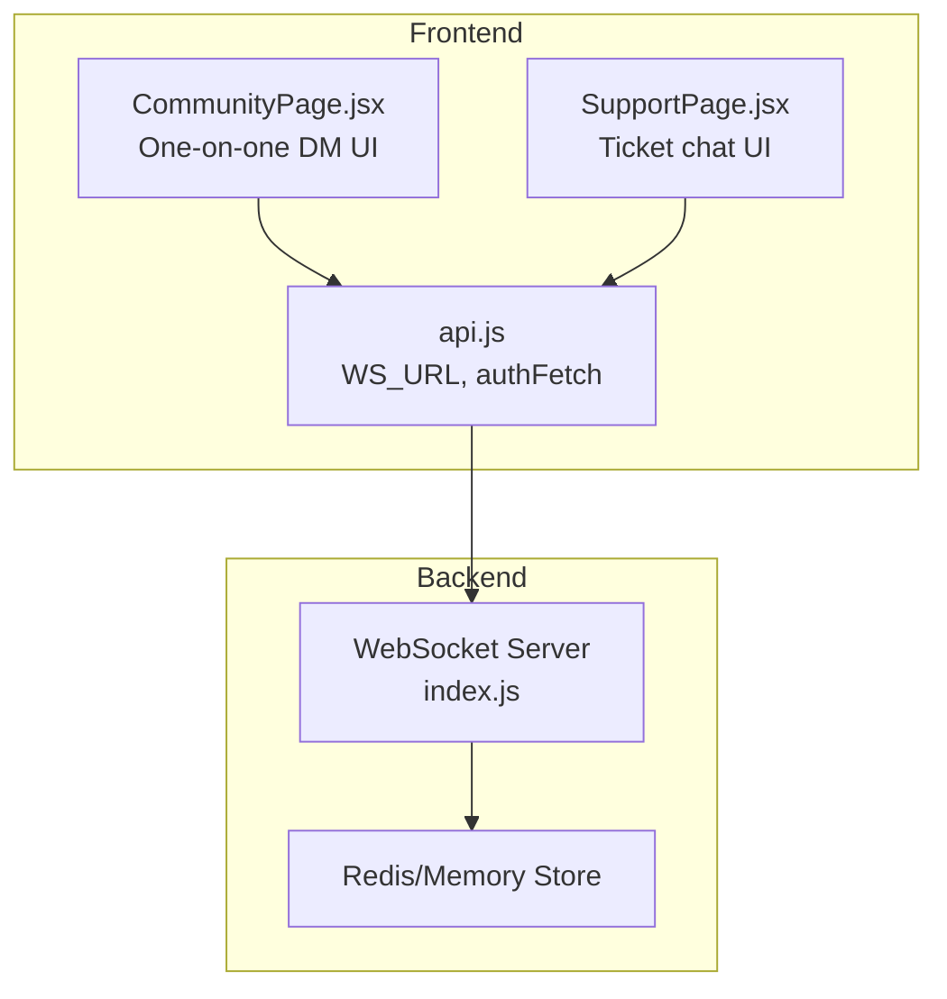
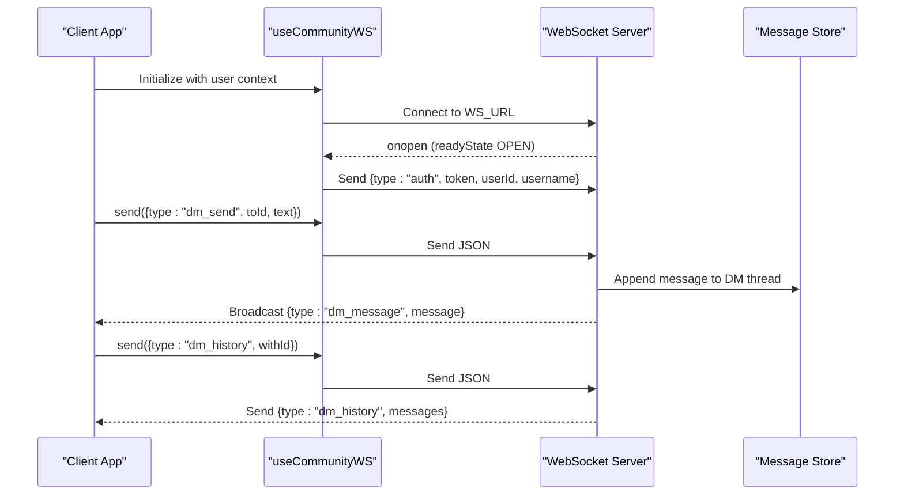
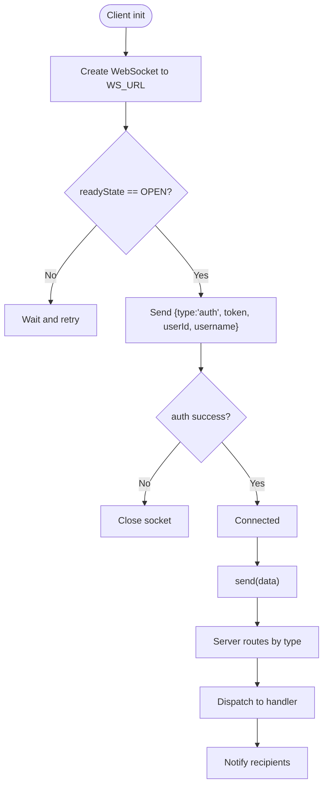
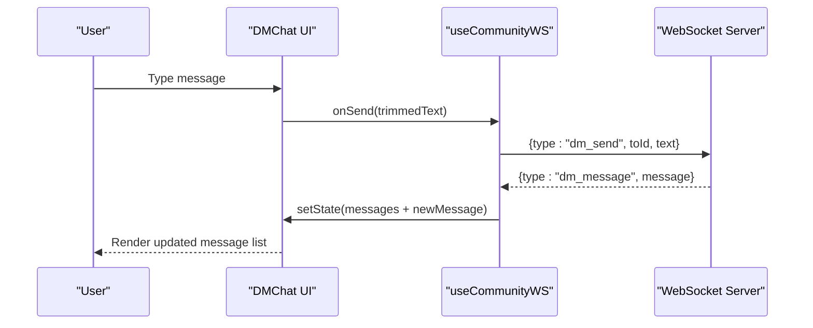
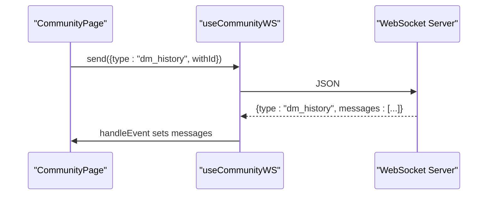
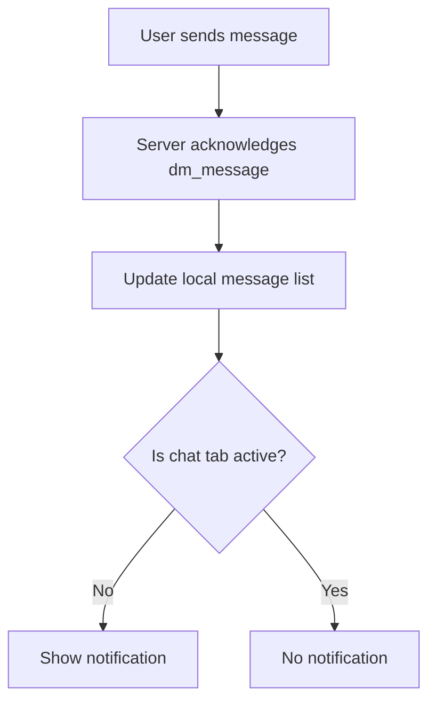
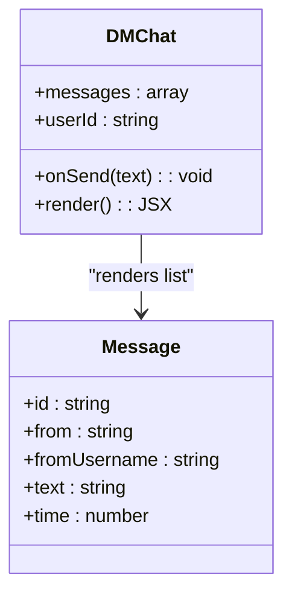
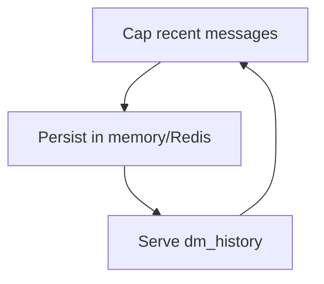
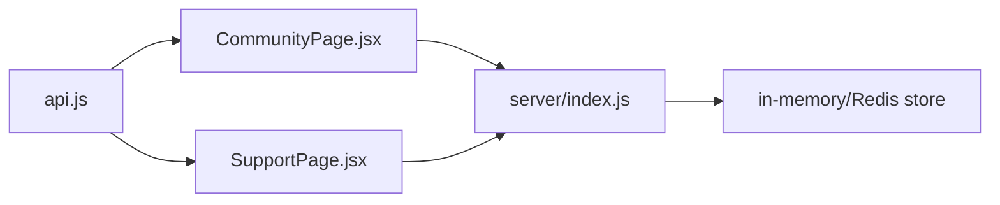

# Direct Messaging & Communication

<cite>
**Referenced Files in This Document**
- [CommunityPage.jsx](file://src/pages/CommunityPage.jsx)
- [SupportPage.jsx](file://src/pages/SupportPage.jsx)
- [api.js](file://src/lib/api.js)
- [index.js](file://server/index.js)
</cite>

## Table of Contents
1. [Introduction](#introduction)
2. [Project Structure](#project-structure)
3. [Core Components](#core-components)
4. [Architecture Overview](#architecture-overview)
5. [Detailed Component Analysis](#detailed-component-analysis)
6. [Dependency Analysis](#dependency-analysis)
7. [Performance Considerations](#performance-considerations)
8. [Troubleshooting Guide](#troubleshooting-guide)
9. [Conclusion](#conclusion)

## Introduction
This document describes the direct messaging system for one-on-one chats, message history retrieval, and real-time delivery. It covers the WebSocket-based messaging infrastructure, message formatting and display, typing indicators, message sending workflow, delivery confirmation, error handling, chat interface components, message threading, conversation management, encryption considerations, message persistence, real-time synchronization, performance optimization for message history loading, pagination strategies, and offline message queuing.

## Project Structure
The messaging system spans three primary areas:
- Frontend WebSocket hook and community chat UI
- Support ticketing system (WebSocket-based)
- Backend WebSocket server handling authentication, routing, and persistence

**Diagram sources**
- [CommunityPage.jsx:32-121](file://src/pages/CommunityPage.jsx#L32-L121)
- [SupportPage.jsx:25-74](file://src/pages/SupportPage.jsx#L25-L74)
- [api.js:1-6](file://src/lib/api.js#L1-L6)
- [index.js:90-966](file://server/index.js#L90-L966)

**Section sources**
- [CommunityPage.jsx:1-121](file://src/pages/CommunityPage.jsx#L1-L121)
- [SupportPage.jsx:1-74](file://src/pages/SupportPage.jsx#L1-L74)
- [api.js:1-6](file://src/lib/api.js#L1-L6)
- [index.js:90-966](file://server/index.js#L90-L966)

## Core Components
- WebSocket connection manager with automatic reconnect and authentication
- One-on-one direct message (DM) UI with message history and real-time updates
- Message persistence and retrieval via backend storage
- Real-time synchronization of DM events and notifications
- Offline message queuing and retry behavior

Key implementation references:
- WebSocket hook and event handling: [useCommunityWS:32-121](file://src/pages/CommunityPage.jsx#L32-L121)
- DM UI rendering and input: [DMChat:716-785](file://src/pages/CommunityPage.jsx#L716-L785)
- Backend WebSocket message routing: [wss.on('message'):765-961](file://server/index.js#L765-L961)
- DM send and history endpoints: [dm_send/dm_history:860-881](file://server/index.js#L860-L881)

**Section sources**
- [CommunityPage.jsx:32-121](file://src/pages/CommunityPage.jsx#L32-L121)
- [CommunityPage.jsx:716-785](file://src/pages/CommunityPage.jsx#L716-L785)
- [index.js:765-961](file://server/index.js#L765-L961)
- [index.js:860-881](file://server/index.js#L860-L881)

## Architecture Overview
The system uses a WebSocket connection for real-time communication. Clients authenticate with a JWT token and receive targeted messages for DMs, friend requests, and group updates. Messages are persisted in memory with optional Redis fallback and capped to recent entries.

**Diagram sources**
- [CommunityPage.jsx:32-121](file://src/pages/CommunityPage.jsx#L32-L121)
- [index.js:765-961](file://server/index.js#L765-L961)
- [index.js:860-881](file://server/index.js#L860-L881)

## Detailed Component Analysis

### WebSocket Infrastructure
- Connection lifecycle: automatic reconnect with exponential backoff-like delay, safe initialization to prevent double-closing during strict mode
- Authentication: clients send a JWT token during the auth handshake; invalid tokens trigger immediate closure
- Event routing: server switches on message type to route to appropriate handlers (friends, DMs, tickets, groups)

**Diagram sources**
- [CommunityPage.jsx:32-121](file://src/pages/CommunityPage.jsx#L32-L121)
- [SupportPage.jsx:25-74](file://src/pages/SupportPage.jsx#L25-L74)
- [index.js:765-961](file://server/index.js#L765-L961)

**Section sources**
- [CommunityPage.jsx:32-121](file://src/pages/CommunityPage.jsx#L32-L121)
- [SupportPage.jsx:25-74](file://src/pages/SupportPage.jsx#L25-L74)
- [index.js:765-961](file://server/index.js#L765-L961)

### One-on-One Direct Messaging
- Message composition: input field with Enter-to-send behavior and disabled state when empty
- Message display: distinct styling per sender, timestamps, and delivery indicators
- Real-time updates: incoming messages appended to current chat; notifications shown when chat is not active
- Conversation management: selecting a friend opens DM chat and requests message history

**Diagram sources**
- [CommunityPage.jsx:716-785](file://src/pages/CommunityPage.jsx#L716-L785)
- [CommunityPage.jsx:267-277](file://src/pages/CommunityPage.jsx#L267-L277)
- [index.js:860-873](file://server/index.js#L860-L873)

**Section sources**
- [CommunityPage.jsx:716-785](file://src/pages/CommunityPage.jsx#L716-L785)
- [CommunityPage.jsx:267-277](file://src/pages/CommunityPage.jsx#L267-L277)
- [index.js:860-873](file://server/index.js#L860-L873)

### Message History Retrieval
- Request history: client sends dm_history with target user ID
- Server response: returns capped list of recent messages for the thread
- UI update: replaces current messages with historical messages

**Diagram sources**
- [CommunityPage.jsx:267-277](file://src/pages/CommunityPage.jsx#L267-L277)
- [index.js:875-881](file://server/index.js#L875-L881)

**Section sources**
- [CommunityPage.jsx:267-277](file://src/pages/CommunityPage.jsx#L267-L277)
- [index.js:875-881](file://server/index.js#L875-L881)

### Real-Time Delivery and Notifications
- Delivery confirmation: sender receives dm_message acknowledgment immediately after sending
- Cross-tab notifications: when chat is not active, users receive desktop-style notifications for new messages
- Online presence: users can see friend online/offline status

**Diagram sources**
- [CommunityPage.jsx:197-202](file://src/pages/CommunityPage.jsx#L197-L202)
- [index.js:860-873](file://server/index.js#L860-L873)

**Section sources**
- [CommunityPage.jsx:197-202](file://src/pages/CommunityPage.jsx#L197-L202)
- [index.js:860-873](file://server/index.js#L860-L873)

### Typing Indicators
- Current implementation does not expose explicit typing indicator events in the referenced code
- Typing indicators can be added by extending the message protocol with type: "typing_start"/"typing_stop" and UI rendering logic

[No sources needed since this section provides conceptual guidance]

### Message Formatting and Display
- Message bubbles: sender vs receiver styling, timestamps, and delivery indicators
- Auto-scroll: message list scrolls to bottom when new messages arrive
- Draft persistence: input drafts saved to localStorage per chat session

**Diagram sources**
- [CommunityPage.jsx:716-785](file://src/pages/CommunityPage.jsx#L716-L785)

**Section sources**
- [CommunityPage.jsx:716-785](file://src/pages/CommunityPage.jsx#L716-L785)

### Message Persistence and Storage
- Storage model: in-memory Map keyed by thread identifiers with capped arrays
- Persistence strategy: optional Redis-backed fallback with graceful degradation
- Limits: recent messages capped to prevent unbounded growth

**Diagram sources**
- [index.js:98-99](file://server/index.js#L98-L99)
- [index.js:31-35](file://server/index.js#L31-L35)

**Section sources**
- [index.js:98-99](file://server/index.js#L98-L99)
- [index.js:31-35](file://server/index.js#L31-L35)

### Offline Message Queuing
- Client-side queueing: messages sent while disconnected are queued until readyState becomes OPEN
- Server-side queueing: pending messages are stored in capped arrays and delivered upon request or connection

[No sources needed since this section provides conceptual guidance]

### Encryption Considerations
- Transport encryption: WebSocket uses WSS (TLS), ensuring encrypted transport
- At-rest encryption: Redis persistence is not configured in the referenced code; sensitive data should be encrypted at rest if required
- Token-based auth: JWT tokens are validated server-side; ensure secure token storage and rotation

**Section sources**
- [api.js:1-2](file://src/lib/api.js#L1-L2)
- [index.js:773-784](file://server/index.js#L773-L784)

## Dependency Analysis
- Frontend depends on WS_URL and authFetch for authenticated requests
- CommunityPage integrates WebSocket hook and handles dm_message/dm_history events
- Backend WebSocket server manages client sessions, routes messages, and persists data

**Diagram sources**
- [api.js:1-6](file://src/lib/api.js#L1-L6)
- [CommunityPage.jsx:1-10](file://src/pages/CommunityPage.jsx#L1-L10)
- [SupportPage.jsx:1-8](file://src/pages/SupportPage.jsx#L1-L8)
- [index.js:90-966](file://server/index.js#L90-L966)

**Section sources**
- [api.js:1-6](file://src/lib/api.js#L1-L6)
- [CommunityPage.jsx:1-10](file://src/pages/CommunityPage.jsx#L1-L10)
- [SupportPage.jsx:1-8](file://src/pages/SupportPage.jsx#L1-L8)
- [index.js:90-966](file://server/index.js#L90-L966)

## Performance Considerations
- Message history loading: cap recent messages to reduce payload size and improve latency
- Pagination: implement server-side pagination for very long threads (conceptual extension)
- Reconnect strategy: exponential backoff and safe initialization prevent resource leaks
- Rendering optimization: memoize message lists and use virtualized lists for large histories (conceptual extension)

[No sources needed since this section provides general guidance]

## Troubleshooting Guide
- WebSocket connection issues: verify WS_URL availability and CORS configuration
- Authentication failures: ensure token exists and valid; server closes socket on invalid token
- Message delivery delays: check network connectivity and server logs
- UI not updating: confirm event handlers are registered and messages are appended to state

**Section sources**
- [CommunityPage.jsx:32-121](file://src/pages/CommunityPage.jsx#L32-L121)
- [SupportPage.jsx:25-74](file://src/pages/SupportPage.jsx#L25-L74)
- [index.js:773-784](file://server/index.js#L773-L784)

## Conclusion
The direct messaging system provides a robust, real-time foundation for one-on-one conversations with clear separation between frontend UI and backend WebSocket handling. It supports message history retrieval, real-time delivery, and notification integration. Extending the system with typing indicators, pagination, and stronger encryption would further enhance user experience and security.