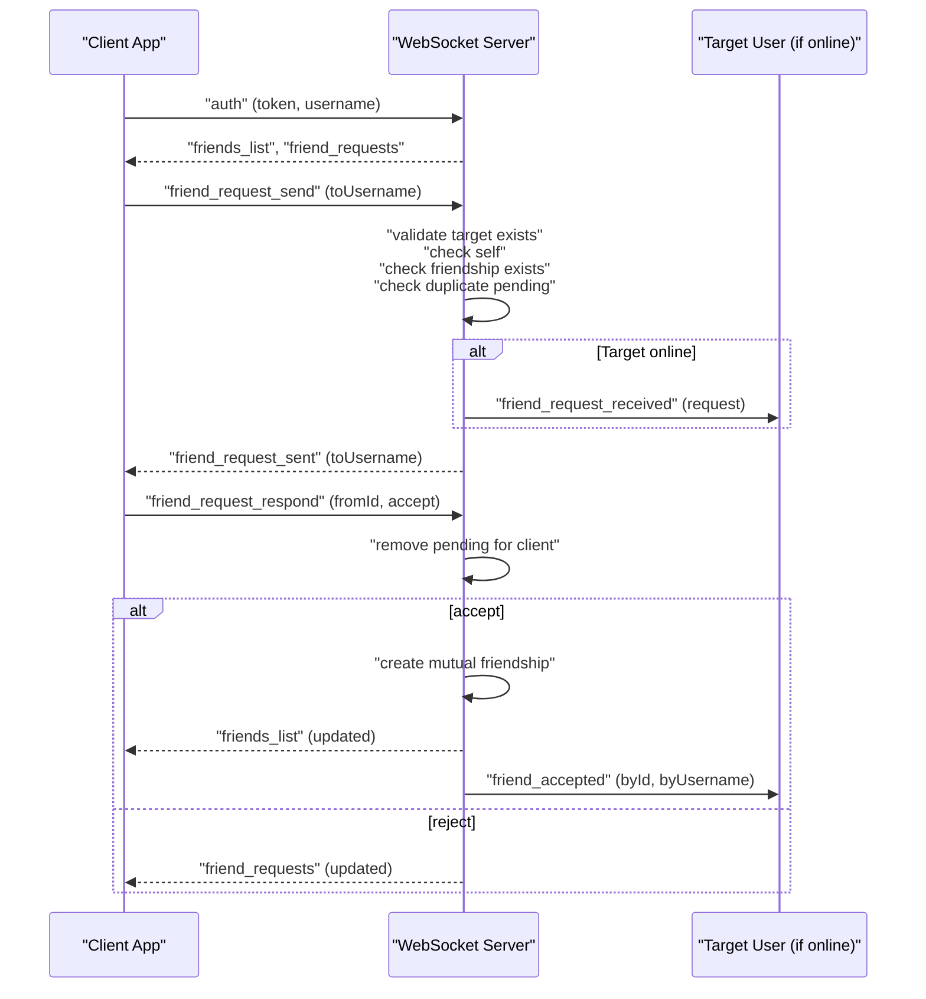
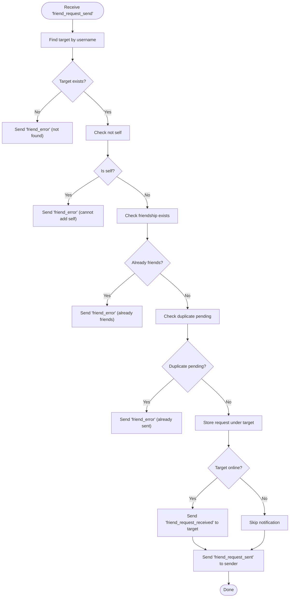
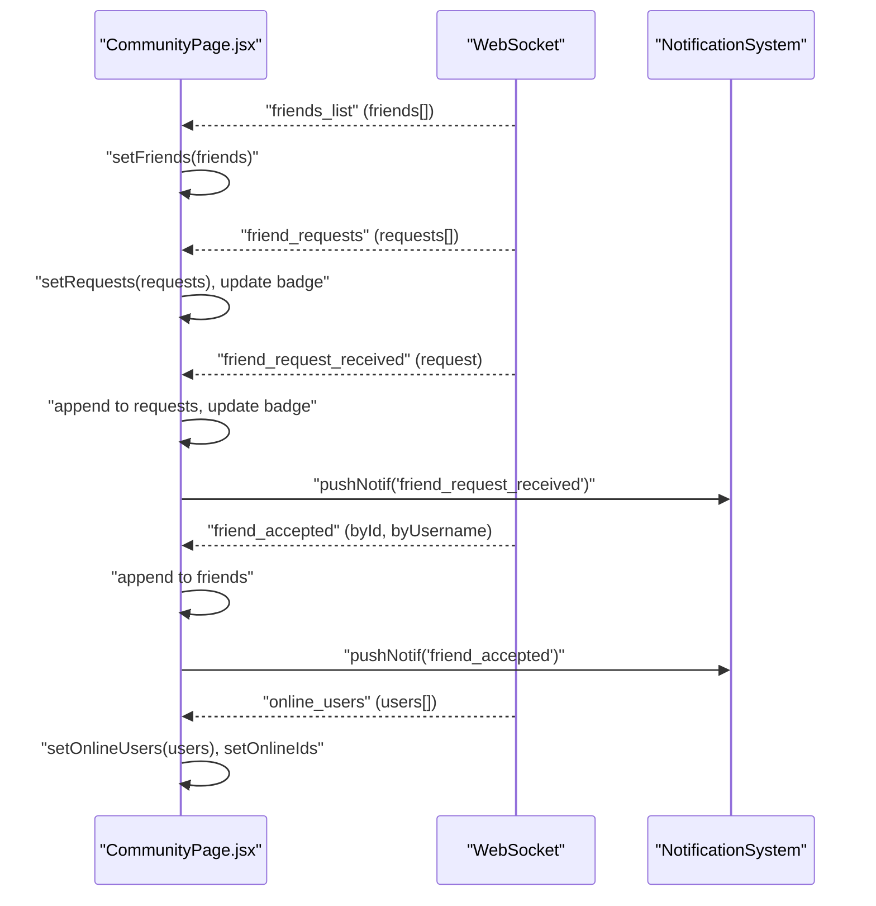
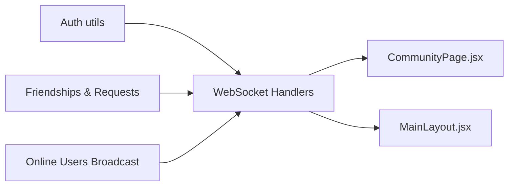

# Friend System & Relationships

<cite>
**Referenced Files in This Document**
- [server/index.js](file://server/index.js)
- [server_index.js](file://server_index.js)
- [remote_server_index.js](file://scratch/remote_server_index.js)
- [CommunityPage.jsx](file://src/pages/CommunityPage.jsx)
- [MainLayout.jsx](file://src/pages/MainLayout.jsx)
</cite>

## Table of Contents
1. [Introduction](#introduction)
2. [Project Structure](#project-structure)
3. [Core Components](#core-components)
4. [Architecture Overview](#architecture-overview)
5. [Detailed Component Analysis](#detailed-component-analysis)
6. [Dependency Analysis](#dependency-analysis)
7. [Performance Considerations](#performance-considerations)
8. [Troubleshooting Guide](#troubleshooting-guide)
9. [Conclusion](#conclusion)

## Introduction
This document describes the friend management system, covering friend requests, acceptance workflows, real-time notifications, friend list management, online status tracking, and WebSocket integration. It explains request lifecycle, state management, persistence, error handling for duplicates, privacy considerations, and performance optimization strategies for large friend lists and real-time synchronization.

## Project Structure
The friend system spans server-side WebSocket handlers and client-side UI components:
- Server-side logic handles authentication, friend request sending, acceptance, rejection, and broadcasting updates via WebSocket messages.
- Client-side components receive WebSocket events, update local state, show notifications, and manage UI interactions.

```mermaid
graph TB
subgraph "Client"
CP["CommunityPage.jsx<br/>Handles WS events, renders lists"]
ML["MainLayout.jsx<br/>Global WS connection, notifications"]
end
subgraph "Server"
SIDX["server/index.js<br/>WebSocket handlers"]
RSIDX["server_index.js<br/>WebSocket handlers (Redis variant)"]
RRSIDX["scratch/remote_server_index.js<br/>WebSocket handlers (Remote variant)"]
end
CP <- --> SIDX
CP <- --> RSIDX
CP <- --> RRSIDX
ML <- --> SIDX
ML <- --> RSIDX
ML <- --> RRSIDX
```

**Diagram sources**
- [server/index.js:765-845](file://server/index.js#L765-L845)
- [server_index.js:940-1007](file://server_index.js#L940-L1007)
- [remote_server_index.js:910-963](file://scratch/remote_server_index.js#L910-L963)
- [CommunityPage.jsx:164-196](file://src/pages/CommunityPage.jsx#L164-L196)
- [MainLayout.jsx:61-88](file://src/pages/MainLayout.jsx#L61-L88)

**Section sources**
- [server/index.js:765-845](file://server/index.js#L765-L845)
- [server_index.js:940-1007](file://server_index.js#L940-L1007)
- [remote_server_index.js:910-963](file://scratch/remote_server_index.js#L910-L963)
- [CommunityPage.jsx:164-196](file://src/pages/CommunityPage.jsx#L164-L196)
- [MainLayout.jsx:61-88](file://src/pages/MainLayout.jsx#L61-L88)

## Core Components
- WebSocket message types for friend management:
  - Authentication and initial sync: "auth", "friends_list", "friend_requests"
  - Request lifecycle: "friend_request_send", "friend_request_received", "friend_request_respond", "friend_accepted", "friend_error"
  - Online presence: "online_users"

- Server-side data structures:
  - Friendships: Map of user ID to set of friend IDs
  - Pending friend requests: Map of user ID to array of pending requests
  - Online users broadcast for UI updates

- Client-side event handling:
  - Updates friend list and incoming requests
  - Shows real-time notifications for incoming requests and accepted friendships
  - Manages badge counts for unread requests

**Section sources**
- [server/index.js:95-114](file://server/index.js#L95-L114)
- [server_index.js:940-975](file://server_index.js#L940-L975)
- [remote_server_index.js:217-229](file://scratch/remote_server_index.js#L217-L229)
- [CommunityPage.jsx:164-196](file://src/pages/CommunityPage.jsx#L164-L196)
- [MainLayout.jsx:61-88](file://src/pages/MainLayout.jsx#L61-L88)

## Architecture Overview
The system uses WebSocket connections for real-time updates. On authentication, the server sends the current friends list and pending requests. When a user sends a friend request, the server validates uniqueness, stores the pending request, notifies the target user if online, and confirms to the sender. Acceptance creates bidirectional friendship entries and broadcasts updated lists to both parties.



**Diagram sources**
- [server/index.js:765-845](file://server/index.js#L765-L845)
- [server_index.js:978-1007](file://server_index.js#L978-L1007)
- [remote_server_index.js:923-949](file://scratch/remote_server_index.js#L923-L949)

## Detailed Component Analysis

### Server-Side Friend Request Handling
- Authentication and initial sync:
  - On "auth", server sets client metadata, broadcasts online users, and sends "friends_list" and "friend_requests".
- Sending friend requests:
  - Validates target existence, prevents self-friendship, checks existing friendship, and duplicate pending requests.
  - Stores request under target's pending list and notifies target if online.
  - Confirms to sender with "friend_request_sent".
- Responding to requests:
  - Removes processed request from client's pending list.
  - On acceptance, creates mutual friendship entries and sends updated "friends_list" to both parties; also notifies the requester with "friend_accepted".
  - On rejection, sends updated "friend_requests" to the client.



**Diagram sources**
- [server/index.js:798-828](file://server/index.js#L798-L828)
- [server_index.js:978-989](file://server_index.js#L978-L989)
- [remote_server_index.js:923-934](file://scratch/remote_server_index.js#L923-L934)

**Section sources**
- [server/index.js:765-845](file://server/index.js#L765-L845)
- [server_index.js:940-1007](file://server_index.js#L940-L1007)
- [remote_server_index.js:910-949](file://scratch/remote_server_index.js#L910-L949)

### Client-Side Real-Time Updates and Notifications
- Community page:
  - Handles "friends_list", "friend_requests", "friend_request_received", "friend_accepted", "friend_request_sent", "friend_error", and "online_users".
  - Updates friend list and request list, manages badge counts, and triggers notifications for friend events.
- Main layout:
  - Manages global WebSocket connection, handles "friend_accepted" notifications, and desktop notifications.



**Diagram sources**
- [CommunityPage.jsx:164-196](file://src/pages/CommunityPage.jsx#L164-L196)
- [MainLayout.jsx:61-88](file://src/pages/MainLayout.jsx#L61-L88)

**Section sources**
- [CommunityPage.jsx:164-196](file://src/pages/CommunityPage.jsx#L164-L196)
- [MainLayout.jsx:61-88](file://src/pages/MainLayout.jsx#L61-L88)

### Online Status Tracking
- On successful authentication, the server broadcasts "online_users" to keep the UI synchronized with currently connected users.
- The client updates internal state for online users and maintains an online IDs set for quick checks.

**Section sources**
- [server/index.js:778-788](file://server/index.js#L778-L788)
- [server_index.js:916-920](file://server_index.js#L916-L920)
- [remote_server_index.js:916-920](file://scratch/remote_server_index.js#L916-L920)
- [CommunityPage.jsx:193-196](file://src/pages/CommunityPage.jsx#L193-L196)

### Global User Discovery and Search
- Friend request sending uses username lookup to resolve the target user. The server performs a case-insensitive match against stored accounts.
- Duplicate detection prevents redundant requests by checking existing pending requests for the same sender-target pair.

**Section sources**
- [server/index.js:798-828](file://server/index.js#L798-L828)
- [server_index.js:978-989](file://server_index.js#L978-L989)
- [remote_server_index.js:923-934](file://scratch/remote_server_index.js#L923-L934)

### WebSocket Integration and Real-Time Synchronization
- The server maintains a registry of WebSocket clients and supports targeted messaging to specific user IDs.
- Upon acceptance, both parties receive updated friend lists to maintain synchronization across sessions.

**Section sources**
- [server/index.js:765-788](file://server/index.js#L765-L788)
- [server_index.js:970-975](file://server_index.js#L970-L975)
- [remote_server_index.js:910-920](file://scratch/remote_server_index.js#L910-L920)

### Relationship Persistence
- Friendships are modeled as bidirectional sets keyed by user ID.
- Pending requests are arrays associated with the target user ID.
- After acceptance, both sides receive updated friend lists reflecting the new relationship.

**Section sources**
- [server/index.js:95-114](file://server/index.js#L95-L114)
- [server_index.js:994-997](file://server_index.js#L994-L997)
- [remote_server_index.js:217-229](file://scratch/remote_server_index.js#L217-L229)

## Dependency Analysis
- Server-side:
  - WebSocket handlers depend on:
    - Authentication utilities to validate tokens
    - Friendship and request storage structures
    - Online user broadcasting
- Client-side:
  - Community page depends on WebSocket message handling and notification APIs
  - Main layout manages global connection lifecycle and desktop notifications



**Diagram sources**
- [server/index.js:765-845](file://server/index.js#L765-L845)
- [server_index.js:940-1007](file://server_index.js#L940-L1007)
- [remote_server_index.js:910-949](file://scratch/remote_server_index.js#L910-L949)
- [CommunityPage.jsx:164-196](file://src/pages/CommunityPage.jsx#L164-L196)
- [MainLayout.jsx:61-88](file://src/pages/MainLayout.jsx#L61-L88)

**Section sources**
- [server/index.js:765-845](file://server/index.js#L765-L845)
- [server_index.js:940-1007](file://server_index.js#L940-L1007)
- [remote_server_index.js:910-949](file://scratch/remote_server_index.js#L910-L949)
- [CommunityPage.jsx:164-196](file://src/pages/CommunityPage.jsx#L164-L196)
- [MainLayout.jsx:61-88](file://src/pages/MainLayout.jsx#L61-L88)

## Performance Considerations
- Data structures:
  - Use Sets for friendships to enable O(1) membership checks for friend existence.
  - Use Maps for pending requests keyed by target user ID for efficient retrieval and updates.
- Message volume:
  - Batch updates: send "friends_list" and "friend_requests" after state changes to minimize redundant messages.
  - Avoid unnecessary recomputation by filtering and mapping only required fields.
- Scalability:
  - For large friend lists, consider pagination or virtualized rendering on the client.
  - Limit per-user pending requests to reduce memory overhead.
- Real-time synchronization:
  - Maintain minimal state deltas (only changed lists) and avoid full refreshes when possible.

[No sources needed since this section provides general guidance]

## Troubleshooting Guide
- Common errors and resolutions:
  - "User not found": Verify username spelling and case-insensitive matching logic.
  - "Cannot add self": Prevent sending requests to yourself.
  - "Already friends": Disable the send button or show a friendly message.
  - "Request already sent": Disable resend until the existing request is resolved.
- WebSocket connectivity:
  - Reconnection: The client attempts to reconnect on close; ensure retry intervals are reasonable.
  - Authentication failures: Close the socket and prompt the user to log in again.
- Notifications:
  - Ensure notification permissions are granted; fallback to in-app alerts if native notifications fail.

**Section sources**
- [server/index.js:798-828](file://server/index.js#L798-L828)
- [server_index.js:978-989](file://server_index.js#L978-L989)
- [remote_server_index.js:923-934](file://scratch/remote_server_index.js#L923-L934)
- [MainLayout.jsx:81-87](file://src/pages/MainLayout.jsx#L81-L87)

## Privacy Considerations
- Visibility:
  - Respect user privacy by limiting friend visibility to mutual friends only.
  - Do not expose private user details beyond usernames in friend lists.
- Consent:
  - Require explicit acceptance of friend requests before adding to friend lists.
- Data protection:
  - Sanitize and validate all inputs to prevent injection and abuse.
  - Limit request frequency to prevent spam.

[No sources needed since this section provides general guidance]

## Conclusion
The friend system integrates robust WebSocket-driven workflows for friend requests, real-time notifications, and synchronized friend lists. With efficient data structures and careful error handling, it scales to support large user bases while maintaining responsive real-time experiences. Privacy and performance best practices should be consistently applied to ensure a secure and scalable platform.