# Social Networking System

<cite>
**Referenced Files in This Document**
- [App.jsx](file://src/App.jsx)
- [main.jsx](file://src/main.jsx)
- [CommunityPage.jsx](file://src/pages/CommunityPage.jsx)
- [LeaderboardPage.jsx](file://src/pages/LeaderboardPage.jsx)
- [ProfilePage.jsx](file://src/pages/ProfilePage.jsx)
- [AchievementSystem.jsx](file://src/components/AchievementSystem.jsx)
- [AchievementShowcase.jsx](file://src/components/AchievementShowcase.jsx)
- [RecentActivityCard.jsx](file://src/components/RecentActivityCard.jsx)
- [NotificationSystem.jsx](file://src/components/NotificationSystem.jsx)
- [ProfileComments.jsx](file://src/components/ProfileComments.jsx)
- [api.js](file://src/lib/api.js)
- [tauri.js](file://src/lib/tauri.js)
- [window.js](file://src/lib/window.js)
- [index.js](file://server/index.js)
- [package.json](file://server/package.json)
- [tauri.conf.json](file://src-tauri/tauri.conf.json)
</cite>

## Table of Contents
1. [Introduction](#introduction)
2. [Project Structure](#project-structure)
3. [Core Components](#core-components)
4. [Architecture Overview](#architecture-overview)
5. [Detailed Component Analysis](#detailed-component-analysis)
6. [Dependency Analysis](#dependency-analysis)
7. [Performance Considerations](#performance-considerations)
8. [Troubleshooting Guide](#troubleshooting-guide)
9. [Conclusion](#conclusion)

## Introduction
This document describes the social networking system built with React and Tauri. It covers friend management, messaging, group functionality, activity tracking, user profiles with avatars and privacy controls, achievement systems, leaderboards, and integration with authentication and data validation. The system supports both web and desktop deployment via Tauri, with modular frontend components and backend services.

## Project Structure
The application follows a React-based frontend with Tauri for native capabilities and a Node.js server for backend services. Key areas:
- Frontend: React components under src/components and pages under src/pages
- Libraries: API client and Tauri integration under src/lib
- Backend: Node.js server under server/
- Desktop shell: Tauri configuration under src-tauri/

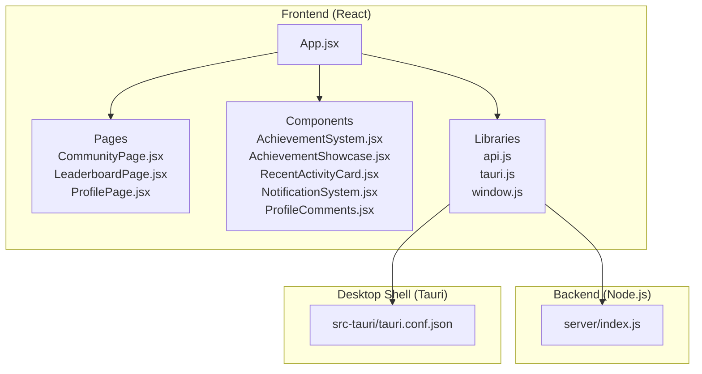

**Diagram sources**
- [App.jsx](file://src/App.jsx)
- [CommunityPage.jsx](file://src/pages/CommunityPage.jsx)
- [LeaderboardPage.jsx](file://src/pages/LeaderboardPage.jsx)
- [ProfilePage.jsx](file://src/pages/ProfilePage.jsx)
- [AchievementSystem.jsx](file://src/components/AchievementSystem.jsx)
- [AchievementShowcase.jsx](file://src/components/AchievementShowcase.jsx)
- [RecentActivityCard.jsx](file://src/components/RecentActivityCard.jsx)
- [NotificationSystem.jsx](file://src/components/NotificationSystem.jsx)
- [ProfileComments.jsx](file://src/components/ProfileComments.jsx)
- [api.js](file://src/lib/api.js)
- [tauri.js](file://src/lib/tauri.js)
- [window.js](file://src/lib/window.js)
- [index.js](file://server/index.js)
- [tauri.conf.json](file://src-tauri/tauri.conf.json)

**Section sources**
- [App.jsx](file://src/App.jsx)
- [main.jsx](file://src/main.jsx)
- [api.js](file://src/lib/api.js)
- [tauri.js](file://src/lib/tauri.js)
- [index.js](file://server/index.js)
- [tauri.conf.json](file://src-tauri/tauri.conf.json)

## Core Components
- Authentication and session management are integrated via Tauri APIs and the frontend routing. The login page and main layout coordinate user state and protected routes.
- Community and leaderboard pages provide social discovery and ranking features.
- Profile page centralizes user information, avatar management, comments, and privacy controls.
- Achievement system tracks milestones and showcases progress.
- Activity feed displays recent actions and social interactions.
- Notification system handles real-time updates and alerts.

**Section sources**
- [CommunityPage.jsx](file://src/pages/CommunityPage.jsx)
- [LeaderboardPage.jsx](file://src/pages/LeaderboardPage.jsx)
- [ProfilePage.jsx](file://src/pages/ProfilePage.jsx)
- [AchievementSystem.jsx](file://src/components/AchievementSystem.jsx)
- [AchievementShowcase.jsx](file://src/components/AchievementShowcase.jsx)
- [RecentActivityCard.jsx](file://src/components/RecentActivityCard.jsx)
- [NotificationSystem.jsx](file://src/components/NotificationSystem.jsx)
- [ProfileComments.jsx](file://src/components/ProfileComments.jsx)

## Architecture Overview
The system uses a layered architecture:
- Presentation layer: React components and pages
- Service layer: API client wrappers and Tauri integrations
- Domain layer: Social features (friends, groups, messaging, activities)
- Persistence layer: Backend server and local storage via Tauri

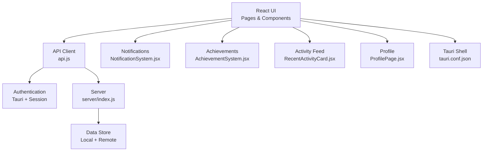

**Diagram sources**
- [App.jsx](file://src/App.jsx)
- [api.js](file://src/lib/api.js)
- [tauri.js](file://src/lib/tauri.js)
- [NotificationSystem.jsx](file://src/components/NotificationSystem.jsx)
- [AchievementSystem.jsx](file://src/components/AchievementSystem.jsx)
- [RecentActivityCard.jsx](file://src/components/RecentActivityCard.jsx)
- [ProfilePage.jsx](file://src/pages/ProfilePage.jsx)
- [index.js](file://server/index.js)
- [tauri.conf.json](file://src-tauri/tauri.conf.json)

## Detailed Component Analysis

### Friend Management System
Friend management includes friend requests, accept/reject workflows, and relationship status. The system coordinates:
- Request creation and sending
- Notification delivery for incoming requests
- Relationship persistence and updates
- Privacy-aware visibility of friend lists

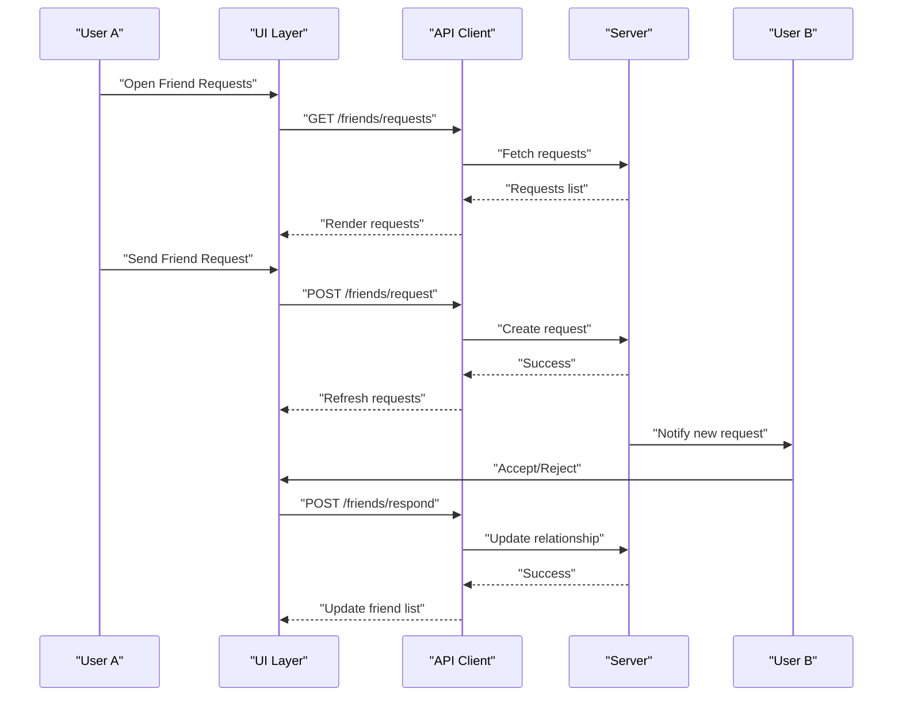

**Diagram sources**
- [api.js](file://src/lib/api.js)
- [index.js](file://server/index.js)

**Section sources**
- [api.js](file://src/lib/api.js)
- [index.js](file://server/index.js)

### Messaging System
Direct messaging and group chat support:
- Real-time notifications for new messages
- Message history retrieval
- Group chat rooms with member lists
- Typing indicators and read receipts

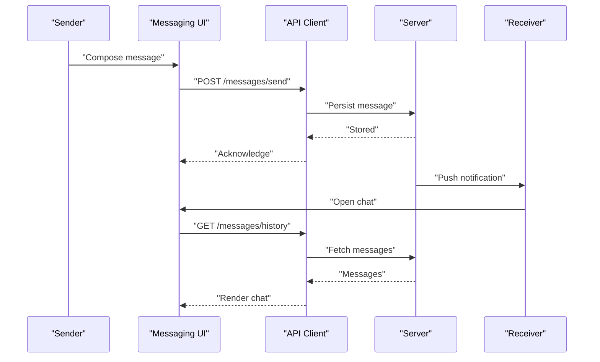

**Diagram sources**
- [api.js](file://src/lib/api.js)
- [index.js](file://server/index.js)
- [NotificationSystem.jsx](file://src/components/NotificationSystem.jsx)

**Section sources**
- [api.js](file://src/lib/api.js)
- [index.js](file://server/index.js)
- [NotificationSystem.jsx](file://src/components/NotificationSystem.jsx)

### Group Functionality
Group creation, membership management, and chat rooms:
- Create/join groups with permissions
- Member roles and moderation controls
- Group-specific chat with real-time updates

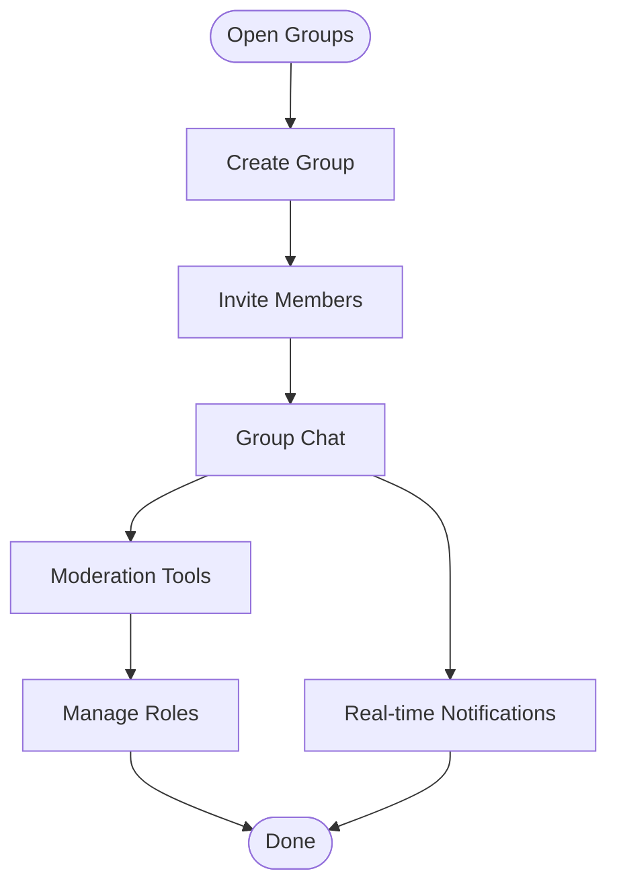

**Diagram sources**
- [api.js](file://src/lib/api.js)
- [index.js](file://server/index.js)
- [NotificationSystem.jsx](file://src/components/NotificationSystem.jsx)

**Section sources**
- [api.js](file://src/lib/api.js)
- [index.js](file://server/index.js)
- [NotificationSystem.jsx](file://src/components/NotificationSystem.jsx)

### Activity Tracking
Recent activity feed aggregates user actions:
- Action types: posts, likes, comments, achievements
- Timeline rendering with pagination
- Privacy filtering per user settings

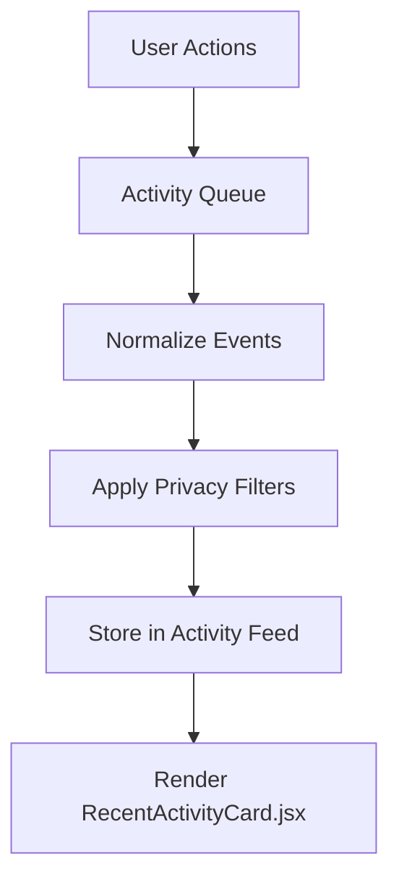

**Diagram sources**
- [RecentActivityCard.jsx](file://src/components/RecentActivityCard.jsx)
- [index.js](file://server/index.js)

**Section sources**
- [RecentActivityCard.jsx](file://src/components/RecentActivityCard.jsx)
- [index.js](file://server/index.js)

### User Profile System
Profile management includes avatar handling, personal info, and privacy controls:
- Avatar upload and preview
- Editable profile fields
- Privacy settings for visibility
- Comments and activity timeline

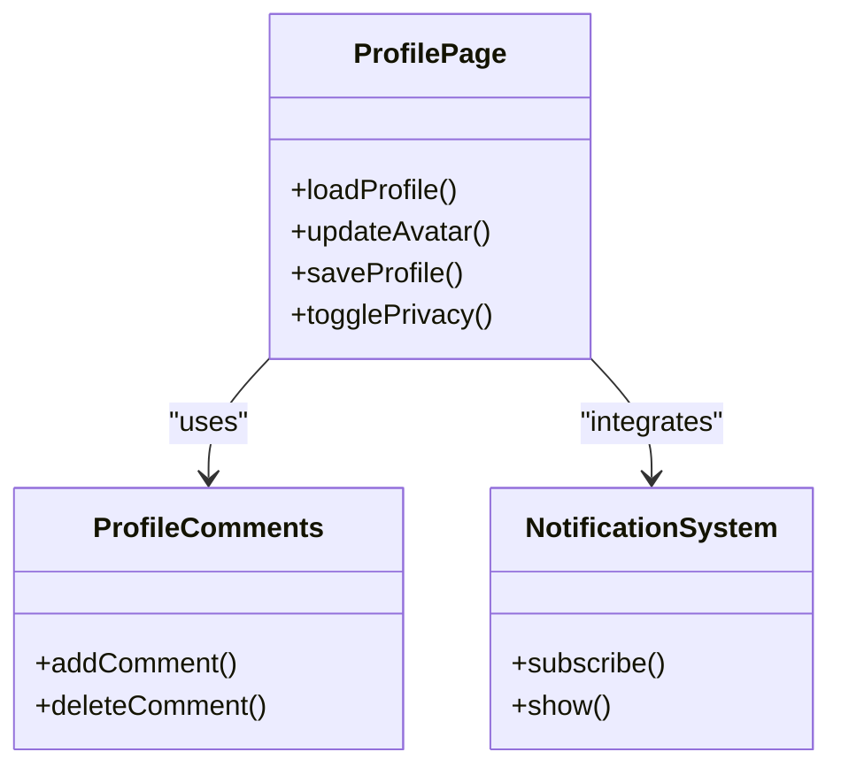

**Diagram sources**
- [ProfilePage.jsx](file://src/pages/ProfilePage.jsx)
- [ProfileComments.jsx](file://src/components/ProfileComments.jsx)
- [NotificationSystem.jsx](file://src/components/NotificationSystem.jsx)

**Section sources**
- [ProfilePage.jsx](file://src/pages/ProfilePage.jsx)
- [ProfileComments.jsx](file://src/components/ProfileComments.jsx)
- [NotificationSystem.jsx](file://src/components/NotificationSystem.jsx)

### Achievement System
Achievement tracking and showcase:
- Trigger conditions for unlocks
- Progress visualization
- Public showcase on profile

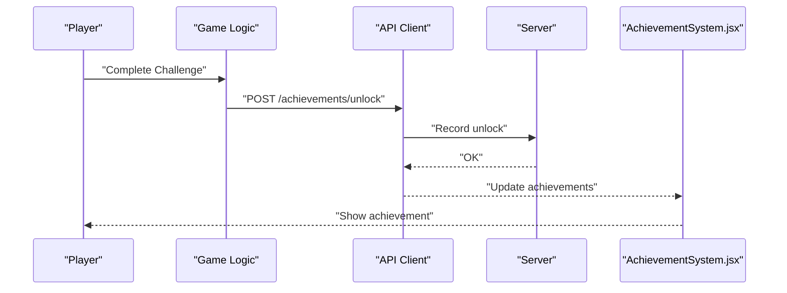

**Diagram sources**
- [AchievementSystem.jsx](file://src/components/AchievementSystem.jsx)
- [AchievementShowcase.jsx](file://src/components/AchievementShowcase.jsx)
- [api.js](file://src/lib/api.js)
- [index.js](file://server/index.js)

**Section sources**
- [AchievementSystem.jsx](file://src/components/AchievementSystem.jsx)
- [AchievementShowcase.jsx](file://src/components/AchievementShowcase.jsx)
- [api.js](file://src/lib/api.js)
- [index.js](file://server/index.js)

### Community Features: Forums, Leaderboards, User-Generated Content
- Forums: threaded discussions with moderation
- Leaderboards: rankings by score/achievements
- UGC: posts, screenshots, reviews with approval workflows

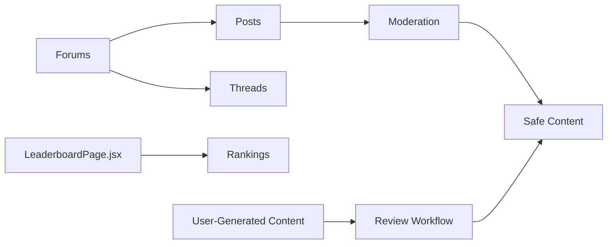

**Diagram sources**
- [CommunityPage.jsx](file://src/pages/CommunityPage.jsx)
- [LeaderboardPage.jsx](file://src/pages/LeaderboardPage.jsx)
- [index.js](file://server/index.js)

**Section sources**
- [CommunityPage.jsx](file://src/pages/CommunityPage.jsx)
- [LeaderboardPage.jsx](file://src/pages/LeaderboardPage.jsx)
- [index.js](file://server/index.js)

### Authentication Integration and Data Validation
- Authentication handled via Tauri APIs and session tokens
- API client wraps requests with headers and validation
- Input validation on client and server sides

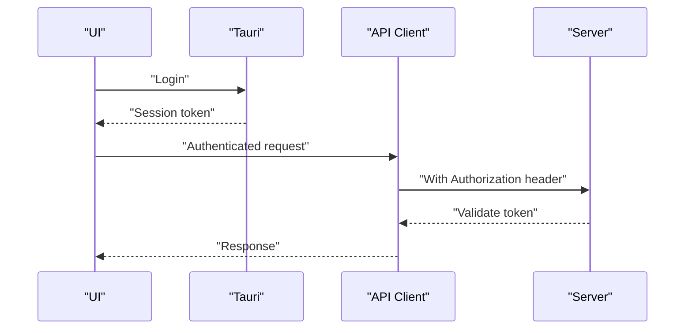

**Diagram sources**
- [tauri.js](file://src/lib/tauri.js)
- [api.js](file://src/lib/api.js)
- [index.js](file://server/index.js)

**Section sources**
- [tauri.js](file://src/lib/tauri.js)
- [api.js](file://src/lib/api.js)
- [index.js](file://server/index.js)

## Dependency Analysis
Key dependencies and relationships:
- Frontend depends on API client for network operations
- API client depends on Tauri for secure context and window management
- Server provides REST endpoints for social features
- Tauri configuration defines allowed capabilities and window behavior

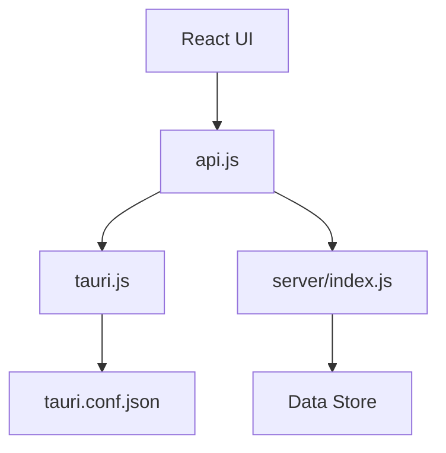

**Diagram sources**
- [api.js](file://src/lib/api.js)
- [tauri.js](file://src/lib/tauri.js)
- [index.js](file://server/index.js)
- [tauri.conf.json](file://src-tauri/tauri.conf.json)

**Section sources**
- [api.js](file://src/lib/api.js)
- [tauri.js](file://src/lib/tauri.js)
- [index.js](file://server/index.js)
- [tauri.conf.json](file://src-tauri/tauri.conf.json)

## Performance Considerations
- Lazy load heavy components (e.g., 3D skin viewer) to reduce initial bundle size
- Debounce real-time updates to minimize network overhead
- Paginate activity feeds and leaderboards
- Cache frequently accessed data locally via Tauri
- Optimize image uploads (avatars, screenshots) with compression and resizing

## Troubleshooting Guide
Common issues and resolutions:
- Authentication failures: Verify Tauri session token lifecycle and refresh logic
- Network errors: Check API client error handling and retry policies
- Real-time update delays: Confirm WebSocket connections and server push mechanisms
- Privacy violations: Audit privacy filters and user consent flows
- Desktop packaging issues: Validate Tauri capabilities and entitlements

**Section sources**
- [tauri.js](file://src/lib/tauri.js)
- [api.js](file://src/lib/api.js)
- [index.js](file://server/index.js)
- [NotificationSystem.jsx](file://src/components/NotificationSystem.jsx)

## Conclusion
The social networking system integrates React UI, Tauri desktop capabilities, and a Node.js backend to deliver a cohesive platform for friends, messaging, groups, activity tracking, and achievements. With robust authentication, privacy controls, and real-time updates, it provides a scalable foundation for community-driven features while maintaining performance and user safety.