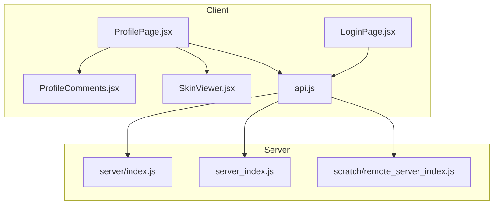
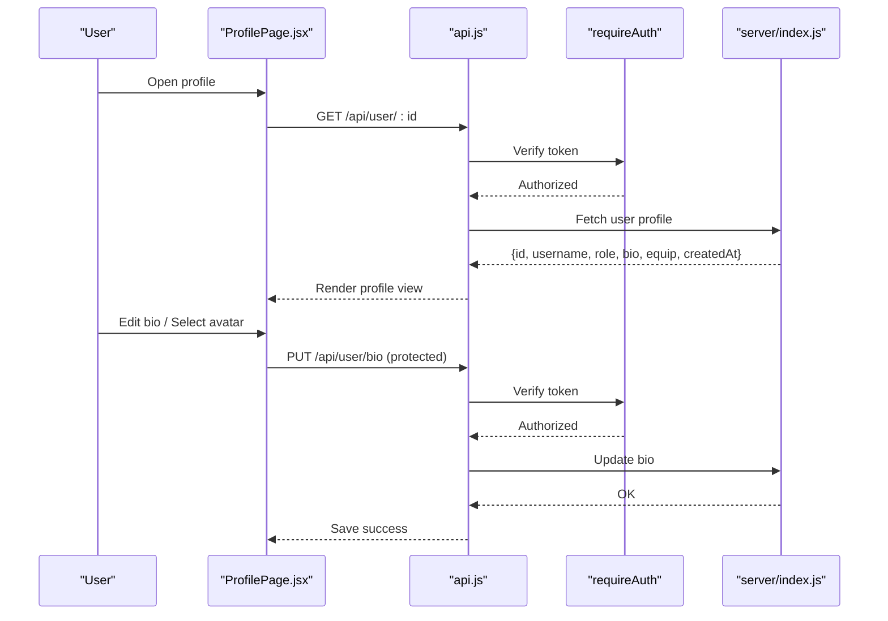
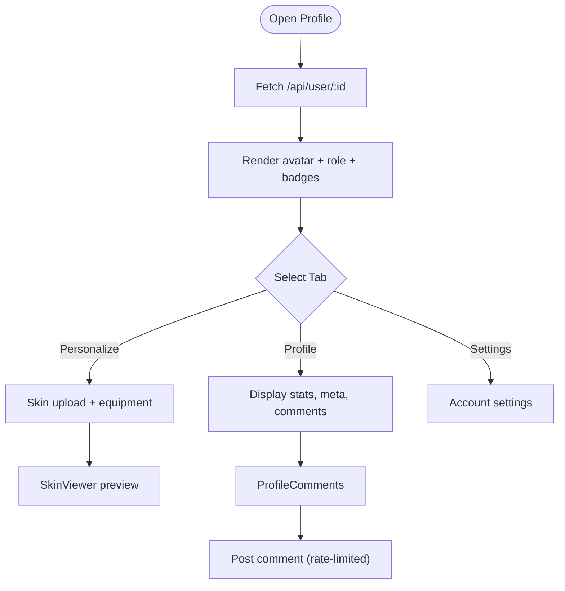
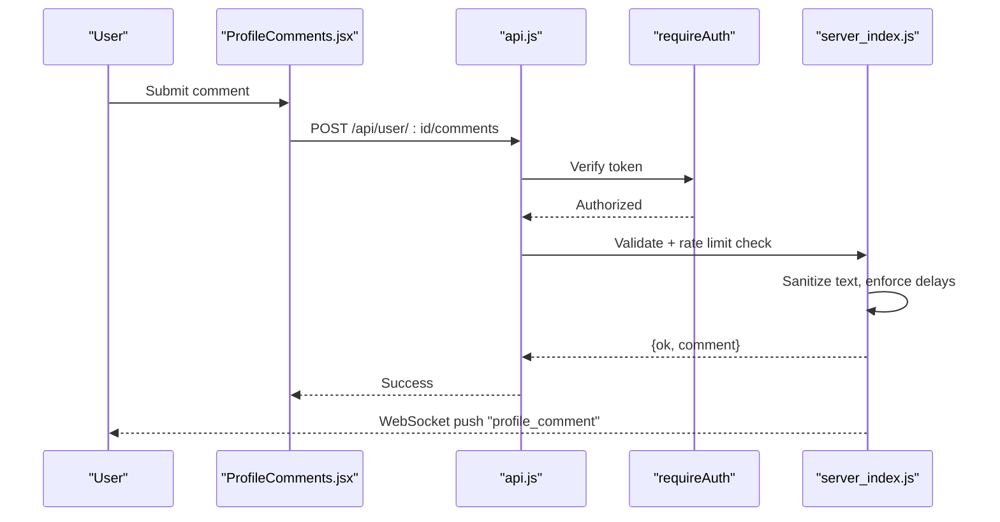
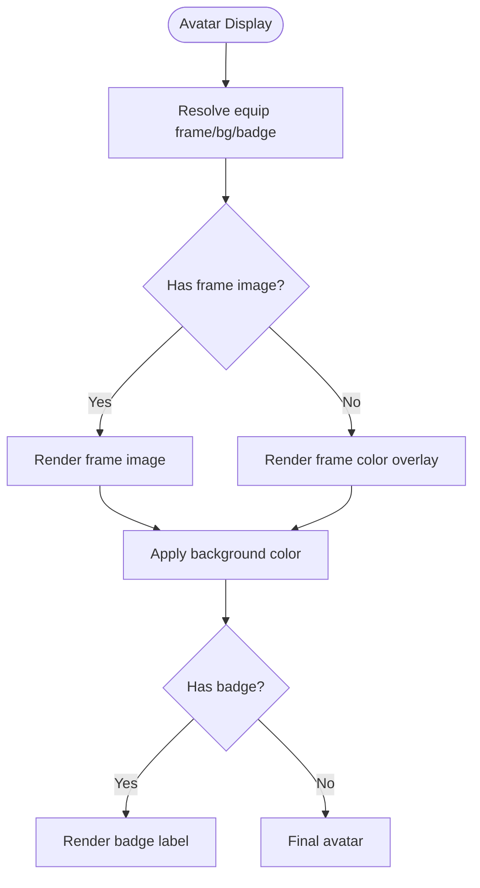
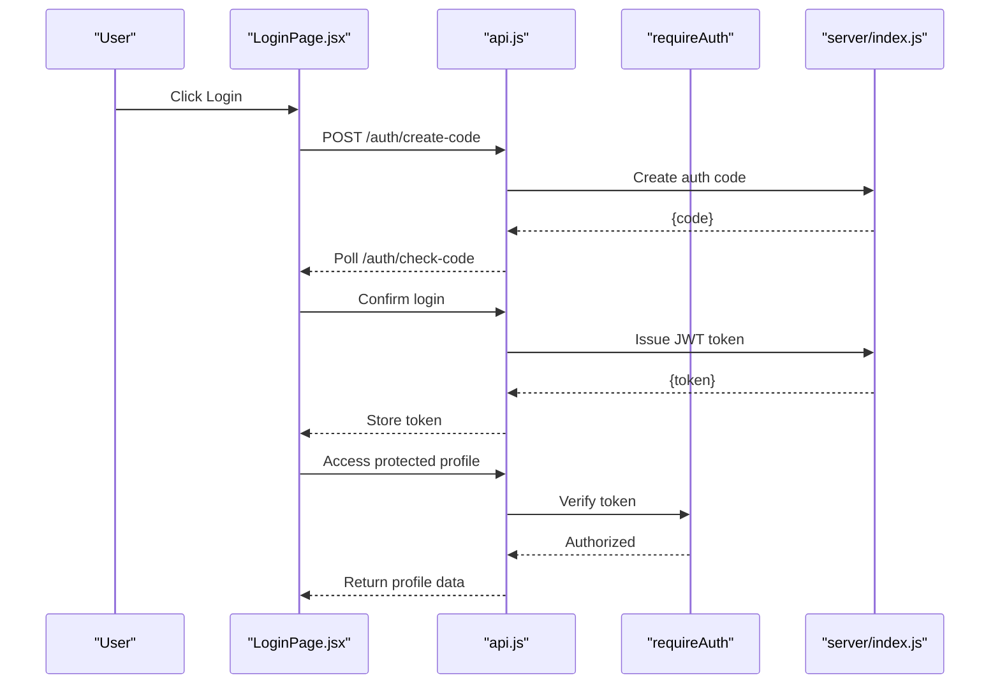
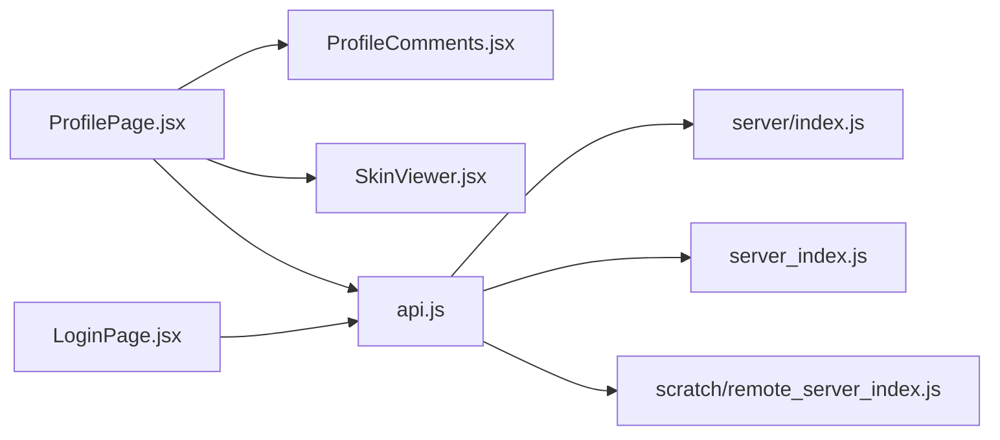

# User Profiles & Account Management

<cite>
**Referenced Files in This Document**
- [ProfilePage.jsx](file://src/pages/ProfilePage.jsx)
- [ProfileComments.jsx](file://src/components/ProfileComments.jsx)
- [SkinViewer.jsx](file://src/components/SkinViewer.jsx)
- [index.js](file://server/index.js)
- [server_index.js](file://server_index.js)
- [remote_server_index.js](file://scratch/remote_server_index.js)
- [LoginPage.jsx](file://src/pages/LoginPage.jsx)
- [api.js](file://src/lib/api.js)
</cite>

## Table of Contents
1. [Introduction](#introduction)
2. [Project Structure](#project-structure)
3. [Core Components](#core-components)
4. [Architecture Overview](#architecture-overview)
5. [Detailed Component Analysis](#detailed-component-analysis)
6. [Dependency Analysis](#dependency-analysis)
7. [Performance Considerations](#performance-considerations)
8. [Troubleshooting Guide](#troubleshooting-guide)
9. [Conclusion](#conclusion)

## Introduction
This document describes the user profile system covering profile viewing, editing, avatar management, personal information handling, and the integrated profile comment wall. It explains how the frontend profile page component is structured, how user data is fetched and cached, and how the profile comment system works. It also documents the integration with the authentication system for secure profile access, avatar upload and display functionality, profile privacy settings, role-based styling, and security considerations for profile modifications.

## Project Structure
The profile system spans React components in the client application and backend API endpoints in the server. Key areas:
- Frontend profile page and related UI components
- Authentication flow and protected routes
- Backend user profile APIs and rate-limited comment endpoints
- Avatar rendering and skin preview components

**Diagram sources**
- [ProfilePage.jsx](file://src/pages/ProfilePage.jsx)
- [ProfileComments.jsx](file://src/components/ProfileComments.jsx)
- [SkinViewer.jsx](file://src/components/SkinViewer.jsx)
- [LoginPage.jsx](file://src/pages/LoginPage.jsx)
- [api.js](file://src/lib/api.js)
- [index.js](file://server/index.js)
- [server_index.js](file://server_index.js)
- [remote_server_index.js](file://scratch/remote_server_index.js)

**Section sources**
- [ProfilePage.jsx](file://src/pages/ProfilePage.jsx)
- [index.js](file://server/index.js)
- [server_index.js](file://server_index.js)
- [remote_server_index.js](file://scratch/remote_server_index.js)

## Core Components
- ProfilePage: Hosts tabs for profile view, personalization, and settings; orchestrates avatar selection, bio editing, and equipment display.
- ProfileComments: Renders and posts comments to a user's profile wall with rate limiting and sanitization.
- SkinViewer: Renders a 3D skin preview for avatar customization.
- Authentication: QR-based login flow and token-based protected routes.
- Server APIs: Public profile retrieval, private bio endpoints, inventory/equipment, and profile comments.

Key responsibilities:
- Secure profile access via JWT middleware
- Rate-limited comment posting and retrieval
- Role-based styling and badges
- Equipment-based avatar framing and backgrounds

**Section sources**
- [ProfilePage.jsx](file://src/pages/ProfilePage.jsx)
- [ProfileComments.jsx](file://src/components/ProfileComments.jsx)
- [SkinViewer.jsx](file://src/components/SkinViewer.jsx)
- [LoginPage.jsx](file://src/pages/LoginPage.jsx)
- [index.js](file://server/index.js)
- [server_index.js](file://server_index.js)
- [remote_server_index.js](file://scratch/remote_server_index.js)

## Architecture Overview
The profile system integrates frontend UI with backend services through authenticated requests. The frontend fetches profile data, displays avatars and equipment, and allows edits. Comments are posted securely and delivered via WebSocket to the target user.

**Diagram sources**
- [ProfilePage.jsx](file://src/pages/ProfilePage.jsx)
- [api.js](file://src/lib/api.js)
- [index.js](file://server/index.js)

## Detailed Component Analysis

### Profile Page Component Structure
The profile page is organized as a tabbed interface:
- Profile tab: Displays avatar with optional frame/background/badge styling, online status, stats, and a comment wall.
- Personalize tab: Allows skin upload and preview, cape preset selection, and equipment management.
- Settings tab: Handles account settings and preferences.

**Diagram sources**
- [ProfilePage.jsx](file://src/pages/ProfilePage.jsx)
- [ProfileComments.jsx](file://src/components/ProfileComments.jsx)
- [SkinViewer.jsx](file://src/components/SkinViewer.jsx)

**Section sources**
- [ProfilePage.jsx](file://src/pages/ProfilePage.jsx)

### Profile Comment System
The comment system enforces rate limits and sanitizes content. Comments are stored per-user and capped in history. Posting requires authentication and prevents self-commenting.

**Diagram sources**
- [ProfileComments.jsx](file://src/components/ProfileComments.jsx)
- [server_index.js](file://server_index.js)

**Section sources**
- [ProfileComments.jsx](file://src/components/ProfileComments.jsx)
- [server_index.js](file://server_index.js)

### Avatar Management and Display
Avatar display supports:
- Equipment-based framing, background, and badge styling
- Skin upload and 3D preview rendering
- Minotar fallback for default avatars

**Diagram sources**
- [ProfilePage.jsx](file://src/pages/ProfilePage.jsx)

**Section sources**
- [ProfilePage.jsx](file://src/pages/ProfilePage.jsx)
- [SkinViewer.jsx](file://src/components/SkinViewer.jsx)

### Authentication Integration
Secure profile access relies on JWT tokens:
- QR-based login flow generates a temporary code and polls for confirmation
- Protected routes enforce token verification before accessing profile data or modifying bio
- Optional auth allows public endpoints while requiring auth for private operations

**Diagram sources**
- [LoginPage.jsx](file://src/pages/LoginPage.jsx)
- [index.js](file://server/index.js)

**Section sources**
- [LoginPage.jsx](file://src/pages/LoginPage.jsx)
- [index.js](file://server/index.js)

### Data Models and API Endpoints

#### User Profile Model
- Fields: id, username, role, bio, equip, inventory, createdAt, online, friendCount
- Used in public profile view and authenticated profile view

**Section sources**
- [index.js](file://server/index.js)
- [server_index.js](file://server_index.js)
- [remote_server_index.js](file://scratch/remote_server_index.js)

#### Profile Comment Model
- Fields: id, fromId, fromUsername, text, time
- Stored per-user and limited to recent entries

**Section sources**
- [server_index.js](file://server_index.js)
- [remote_server_index.js](file://scratch/remote_server_index.js)

#### API Endpoints
- GET /api/user/:id - Public profile info
- GET /api/user/:id/comments - Retrieve recent comments
- POST /api/user/:id/comments - Post a comment (authenticated)
- GET /api/user/bio - Get current user bio
- PUT /api/user/bio - Update current user bio (authenticated)

**Section sources**
- [remote_server_index.js](file://scratch/remote_server_index.js)
- [server_index.js](file://server_index.js)

### Privacy Settings and Role-Based Styling
- Public profile visibility: username, role, bio, equip, createdAt
- Private profile data: bio editing requires authentication
- Role-based styling: admin badge and styling applied when role equals admin
- Equipment-based styling: frame, background, and badge colors applied to avatar display

**Section sources**
- [ProfilePage.jsx](file://src/pages/ProfilePage.jsx)
- [index.js](file://server/index.js)

### Validation, Image Processing, and Security
- Input sanitization: comments are sanitized and length-checked
- Rate limiting: enforced per-user posting frequency and hourly caps
- Token verification: JWT required for protected endpoints
- Avatar fallback: Minotar service used if skin loading fails
- WebSocket notifications: real-time delivery of new comments to the profile owner

**Section sources**
- [server_index.js](file://server_index.js)
- [remote_server_index.js](file://scratch/remote_server_index.js)
- [SkinViewer.jsx](file://src/components/SkinViewer.jsx)

## Dependency Analysis
The profile system exhibits clear separation of concerns:
- Frontend depends on api.js for HTTP requests and on authentication state for protected routes
- Backend enforces auth via middleware and provides public/private endpoints
- Comment system couples frontend UI with server-side storage and WebSocket delivery

**Diagram sources**
- [ProfilePage.jsx](file://src/pages/ProfilePage.jsx)
- [ProfileComments.jsx](file://src/components/ProfileComments.jsx)
- [SkinViewer.jsx](file://src/components/SkinViewer.jsx)
- [LoginPage.jsx](file://src/pages/LoginPage.jsx)
- [api.js](file://src/lib/api.js)
- [index.js](file://server/index.js)
- [server_index.js](file://server_index.js)
- [remote_server_index.js](file://scratch/remote_server_index.js)

**Section sources**
- [ProfilePage.jsx](file://src/pages/ProfilePage.jsx)
- [ProfileComments.jsx](file://src/components/ProfileComments.jsx)
- [SkinViewer.jsx](file://src/components/SkinViewer.jsx)
- [LoginPage.jsx](file://src/pages/LoginPage.jsx)
- [api.js](file://src/lib/api.js)
- [index.js](file://server/index.js)
- [server_index.js](file://server_index.js)
- [remote_server_index.js](file://scratch/remote_server_index.js)

## Performance Considerations
- Comment history capped to reduce memory usage
- Skin preview throttled rendering to balance quality and GPU usage
- Avatar fallback minimizes failure impact
- Rate limiting reduces server load from spam

## Troubleshooting Guide
Common issues and resolutions:
- Authentication failures: Ensure token exists and is valid; verify requireAuth middleware
- Comment posting blocked: Check rate-limit thresholds and text sanitization
- Avatar not updating: Confirm skin upload success and equipment updates
- Profile not loading: Verify public endpoint accessibility and user existence

**Section sources**
- [server_index.js](file://server_index.js)
- [remote_server_index.js](file://scratch/remote_server_index.js)
- [ProfilePage.jsx](file://src/pages/ProfilePage.jsx)

## Conclusion
The profile system combines a modular React UI with robust backend APIs secured by JWT. It supports public profile viewing, private bio editing, avatar customization with equipment styling, and a rate-limited comment wall with real-time notifications. Role-based styling and equipment-driven visuals enhance user identity presentation. Security measures include input sanitization, rate limiting, and strict authentication for sensitive operations.