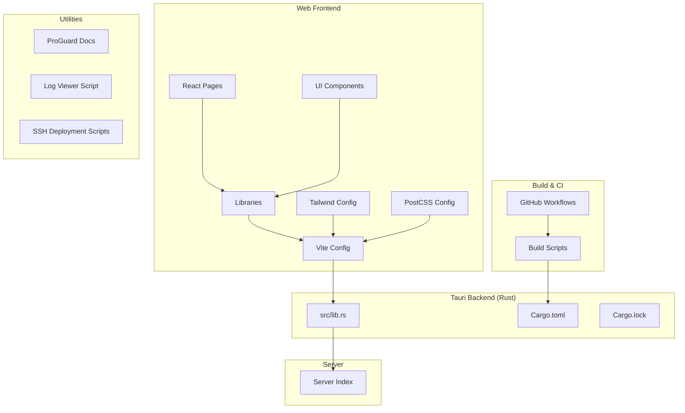
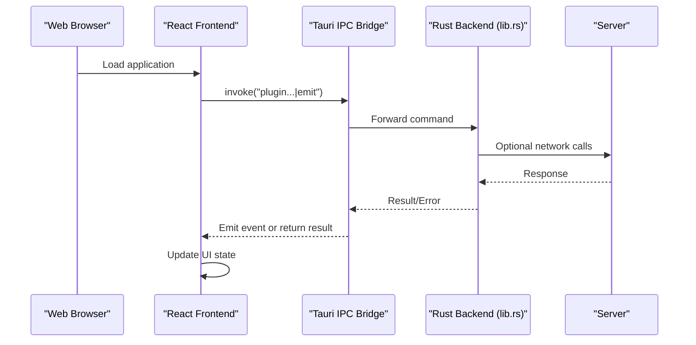
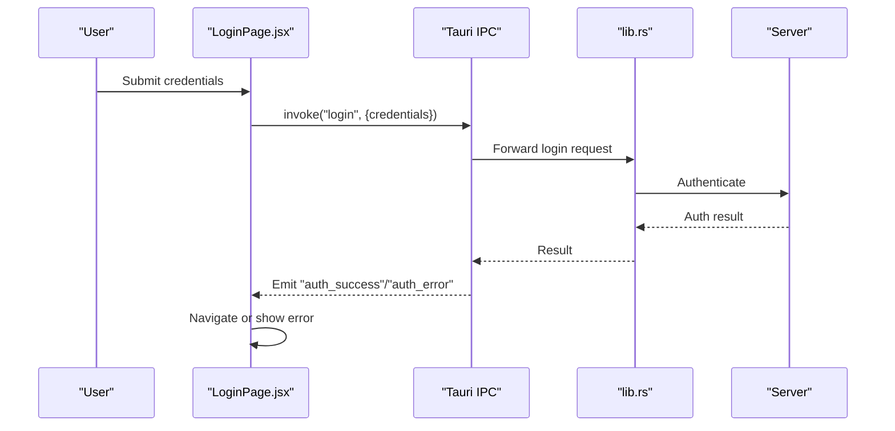
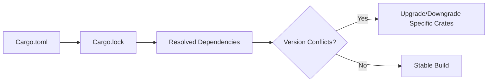

# Troubleshooting & FAQ

<cite>
**Referenced Files in This Document**
- [lib.rs](file://src-tauri/src/lib.rs)
- [Cargo.toml](file://src-tauri/Cargo.toml)
- [Cargo.lock](file://src-tauri/Cargo.lock)
- [event.js](file://dist/assets/event-Bb-ibbll.js)
- [core.js](file://dist/assets/core-BkNCNb-G.js)
- [view_logs.js](file://scratch/view_logs.js)
- [ssh_deploy.js](file://scratch/ssh_deploy.js)
- [ssh_upload_server.js](file://scratch/ssh_upload_server.js)
- [proguard troubleshooting.md](file://scratch/proguard/proguard-7.4.2/docs/manual/troubleshooting/troubleshooting.md)
- [proguard limitations.md](file://scratch/proguard/proguard-7.4.2/docs/manual/troubleshooting/limitations.md)
- [build.yml](file://.github/workflows/build.yml)
- [build-all.sh](file://scripts/build-all.sh)
- [build-linux.sh](file://scripts/build-linux.sh)
- [server-hardening.sh](file://scripts/server-hardening.sh)
- [setup-server.sh](file://scripts/setup-server.sh)
- [index.js](file://server/index.js)
- [package.json](file://package.json)
- [vite.config.js](file://vite.config.js)
- [tailwind.config.js](file://tailwind.config.js)
- [postcss.config.js](file://postcss.config.js)
- [LoginPage.jsx](file://src/pages/LoginPage.jsx)
- [SupportPage.jsx](file://src/pages/SupportPage.jsx)
- [TrayPopup.jsx](file://src/pages/TrayPopup.jsx)
- [NotificationSystem.jsx](file://src/components/NotificationSystem.jsx)
- [DownloadProgress.jsx](file://src/components/DownloadProgress.jsx)
- [api.js](file://src/lib/api.js)
- [tauri.js](file://src/lib/tauri.js)
- [window.js](file://src/lib/window.js)
</cite>

## Table of Contents
1. [Introduction](#introduction)
2. [Project Structure](#project-structure)
3. [Core Components](#core-components)
4. [Architecture Overview](#architecture-overview)
5. [Detailed Component Analysis](#detailed-component-analysis)
6. [Dependency Analysis](#dependency-analysis)
7. [Performance Considerations](#performance-considerations)
8. [Troubleshooting Guide](#troubleshooting-guide)
9. [FAQ](#faq)
10. [Conclusion](#conclusion)

## Introduction
This document provides comprehensive troubleshooting and FAQ guidance for SBGames users and developers. It covers installation issues, authentication problems, game launch failures, desktop integration, performance tuning, error code interpretation, log analysis, network connectivity, firewall and proxy configuration, recovery procedures for corrupted installations, and escalation paths. The content is grounded in the repository's codebase and build/test infrastructure.

## Project Structure
SBGames consists of:
- Frontend web application built with modern JavaScript tooling (Vite, TailwindCSS, PostCSS)
- Rust-based Tauri backend for native integrations and system-level operations
- Server-side components for hosting and distribution
- Build and CI/CD automation scripts
- Obfuscation and tooling utilities (ProGuard-related docs)

**Diagram sources**
- [vite.config.js](file://vite.config.js)
- [tailwind.config.js](file://tailwind.config.js)
- [postcss.config.js](file://postcss.config.js)
- [lib.rs](file://src-tauri/src/lib.rs)
- [Cargo.toml](file://src-tauri/Cargo.toml)
- [Cargo.lock](file://src-tauri/Cargo.lock)
- [index.js](file://server/index.js)
- [build.yml](file://.github/workflows/build.yml)
- [build-all.sh](file://scripts/build-all.sh)

**Section sources**
- [vite.config.js](file://vite.config.js)
- [tailwind.config.js](file://tailwind.config.js)
- [postcss.config.js](file://postcss.config.js)
- [lib.rs](file://src-tauri/src/lib.rs)
- [Cargo.toml](file://src-tauri/Cargo.toml)
- [Cargo.lock](file://src-tauri/Cargo.lock)
- [index.js](file://server/index.js)
- [build.yml](file://.github/workflows/build.yml)
- [build-all.sh](file://scripts/build-all.sh)

## Core Components
- Tauri event system and IPC bridge for frontend-backend communication
- Authentication and session management flows
- Game launch orchestration and logging
- Desktop tray integration and notifications
- Build pipeline and CI configuration

Key implementation references:
- Event system and IPC: [event.js](file://dist/assets/event-Bb-ibbll.js), [core.js](file://dist/assets/core-BkNCNb-G.js)
- Tauri backend: [lib.rs](file://src-tauri/src/lib.rs)
- Authentication page: [LoginPage.jsx](file://src/pages/LoginPage.jsx)
- Tray popup: [TrayPopup.jsx](file://src/pages/TrayPopup.jsx)
- Notifications: [NotificationSystem.jsx](file://src/components/NotificationSystem.jsx)
- API utilities: [api.js](file://src/lib/api.js), [tauri.js](file://src/lib/tauri.js), [window.js](file://src/lib/window.js)

**Section sources**
- [event.js](file://dist/assets/event-Bb-ibbll.js)
- [core.js](file://dist/assets/core-BkNCNb-G.js)
- [lib.rs](file://src-tauri/src/lib.rs)
- [LoginPage.jsx](file://src/pages/LoginPage.jsx)
- [TrayPopup.jsx](file://src/pages/TrayPopup.jsx)
- [NotificationSystem.jsx](file://src/components/NotificationSystem.jsx)
- [api.js](file://src/lib/api.js)
- [tauri.js](file://src/lib/tauri.js)
- [window.js](file://src/lib/window.js)

## Architecture Overview
The system integrates a web-based UI with a Rust Tauri backend. The frontend communicates with the backend via Tauri's invoke/listen mechanism and event system. Server-side components handle hosting and distribution.

**Diagram sources**
- [event.js](file://dist/assets/event-Bb-ibbll.js)
- [core.js](file://dist/assets/core-BkNCNb-G.js)
- [lib.rs](file://src-tauri/src/lib.rs)
- [index.js](file://server/index.js)

## Detailed Component Analysis

### Authentication Flow Troubleshooting
Common issues:
- Login failures due to invalid credentials or server errors
- Session persistence and logout inconsistencies
- Network timeouts during authentication

Recommended checks:
- Verify server availability and response codes
- Inspect Tauri event emissions for authentication events
- Confirm frontend redirects after successful login

**Diagram sources**
- [LoginPage.jsx](file://src/pages/LoginPage.jsx)
- [event.js](file://dist/assets/event-Bb-ibbll.js)
- [core.js](file://dist/assets/core-BkNCNb-G.js)
- [lib.rs](file://src-tauri/src/lib.rs)
- [index.js](file://server/index.js)

**Section sources**
- [LoginPage.jsx](file://src/pages/LoginPage.jsx)
- [event.js](file://dist/assets/event-Bb-ibbll.js)
- [core.js](file://dist/assets/core-BkNCNb-G.js)
- [lib.rs](file://src-tauri/src/lib.rs)
- [index.js](file://server/index.js)

### Game Launch and Logging
The backend manages game process execution and captures stdout/stderr logs. Issues often stem from Java runtime configuration, missing dependencies, or incorrect working directories.

Key references:
- Java logging configuration and file creation: [lib.rs](file://src-tauri/src/lib.rs)
- Tray logout invocation: [lib.rs](file://src-tauri/src/lib.rs)

Diagnostic steps:
- Check for java-stdout.log and java-stderr.log in the Minecraft directory
- Verify Forge logging level and console output redirection
- Confirm process spawn arguments and environment variables

**Section sources**
- [lib.rs](file://src-tauri/src/lib.rs)

### Desktop Integration (Tray and Notifications)
Issues commonly involve:
- Tray menu not responding
- Notifications not appearing
- Window lifecycle events not handled

References:
- Tray popup component: [TrayPopup.jsx](file://src/pages/TrayPopup.jsx)
- Notification system: [NotificationSystem.jsx](file://src/components/NotificationSystem.jsx)
- Tauri event constants and IPC: [event.js](file://dist/assets/event-Bb-ibbll.js), [core.js](file://dist/assets/core-BkNCNb-G.js)

**Section sources**
- [TrayPopup.jsx](file://src/pages/TrayPopup.jsx)
- [NotificationSystem.jsx](file://src/components/NotificationSystem.jsx)
- [event.js](file://dist/assets/event-Bb-ibbll.js)
- [core.js](file://dist/assets/core-BkNCNb-G.js)

### Build and CI Pipeline
Build failures can originate from:
- Dependency resolution conflicts
- Platform-specific compilation errors
- CI environment differences

References:
- GitHub Actions workflow: [build.yml](file://.github/workflows/build.yml)
- Build scripts: [build-all.sh](file://scripts/build-all.sh), [build-linux.sh](file://scripts/build-linux.sh)
- Hardening and setup scripts: [server-hardening.sh](file://scripts/server-hardening.sh), [setup-server.sh](file://scripts/setup-server.sh)
- Cargo configuration: [Cargo.toml](file://src-tauri/Cargo.toml), [Cargo.lock](file://src-tauri/Cargo.lock)

**Section sources**
- [build.yml](file://.github/workflows/build.yml)
- [build-all.sh](file://scripts/build-all.sh)
- [build-linux.sh](file://scripts/build-linux.sh)
- [server-hardening.sh](file://scripts/server-hardening.sh)
- [setup-server.sh](file://scripts/setup-server.sh)
- [Cargo.toml](file://src-tauri/Cargo.toml)
- [Cargo.lock](file://src-tauri/Cargo.lock)

## Dependency Analysis
Dependency conflicts and version mismatches can cause build or runtime issues. The lock file documents resolved versions.

**Diagram sources**
- [Cargo.toml](file://src-tauri/Cargo.toml)
- [Cargo.lock](file://src-tauri/Cargo.lock)

**Section sources**
- [Cargo.toml](file://src-tauri/Cargo.toml)
- [Cargo.lock](file://src-tauri/Cargo.lock)

## Performance Considerations
- Monitor memory usage during asset loading and game launch
- Minimize unnecessary re-renders in React components
- Optimize Tailwind/Tachyons usage to reduce CSS bundle size
- Use Vite's development server for fast iteration and hot reload
- Profile long-running tasks and offload heavy work to background threads

[No sources needed since this section provides general guidance]

## Troubleshooting Guide

### Installation Problems
- Dependency conflicts:
  - Review [Cargo.lock](file://src-tauri/Cargo.lock) for conflicting versions
  - Align versions in [Cargo.toml](file://src-tauri/Cargo.toml) and rebuild
- Build failures:
  - Check CI logs in [build.yml](file://.github/workflows/build.yml)
  - Run local builds using [build-all.sh](file://scripts/build-all.sh) or [build-linux.sh](file://scripts/build-linux.sh)
- Platform-specific issues:
  - Verify target platforms in CI workflow
  - Ensure proper toolchain installation (Rust, Node.js)

**Section sources**
- [Cargo.lock](file://src-tauri/Cargo.lock)
- [Cargo.toml](file://src-tauri/Cargo.toml)
- [build.yml](file://.github/workflows/build.yml)
- [build-all.sh](file://scripts/build-all.sh)
- [build-linux.sh](file://scripts/build-linux.sh)

### Authentication Problems
- Verify login endpoint and response handling in [LoginPage.jsx](file://src/pages/LoginPage.jsx)
- Inspect Tauri event emissions for auth-related events in [event.js](file://dist/assets/event-Bb-ibbll.js)
- Confirm server-side authentication logic in [index.js](file://server/index.js)

**Section sources**
- [LoginPage.jsx](file://src/pages/LoginPage.jsx)
- [event.js](file://dist/assets/event-Bb-ibbll.js)
- [index.js](file://server/index.js)

### Game Launch Failures
- Check Java logs in the Minecraft directory:
  - stdout: [lib.rs](file://src-tauri/src/lib.rs)
  - stderr: [lib.rs](file://src-tauri/src/lib.rs)
- Verify Forge logging configuration and console level:
  - Reference: [lib.rs](file://src-tauri/src/lib.rs)
- Confirm process arguments and working directory

**Section sources**
- [lib.rs](file://src-tauri/src/lib.rs)

### Desktop Integration Issues
- Tray menu not responding:
  - Validate tray event listeners in [TrayPopup.jsx](file://src/pages/TrayPopup.jsx)
  - Check Tauri IPC event handling in [event.js](file://dist/assets/event-Bb-ibbll.js)
- Notifications not appearing:
  - Review [NotificationSystem.jsx](file://src/components/NotificationSystem.jsx)
  - Ensure event emission and reception paths are intact

**Section sources**
- [TrayPopup.jsx](file://src/pages/TrayPopup.jsx)
- [NotificationSystem.jsx](file://src/components/NotificationSystem.jsx)
- [event.js](file://dist/assets/event-Bb-ibbll.js)

### Performance Problems and Memory Leaks
- Monitor memory usage during asset loading and game launch
- Reduce unnecessary re-renders in React components
- Optimize Tailwind/Tachyons usage to minimize CSS bundle size
- Use Vite's dev server for efficient development iteration

**Section sources**
- [vite.config.js](file://vite.config.js)
- [tailwind.config.js](file://tailwind.config.js)
- [postcss.config.js](file://postcss.config.js)

### Log Analysis and Diagnostics
- Locate and review logs:
  - Java logs: [lib.rs](file://src-tauri/src/lib.rs)
  - Utility scripts for viewing logs: [view_logs.js](file://scratch/view_logs.js)
- Use ProGuard-related troubleshooting docs for obfuscation issues:
  - [proguard troubleshooting.md](file://scratch/proguard/proguard-7.4.2/docs/manual/troubleshooting/troubleshooting.md)
  - [proguard limitations.md](file://scratch/proguard/proguard-7.4.2/docs/manual/troubleshooting/limitations.md)

**Section sources**
- [lib.rs](file://src-tauri/src/lib.rs)
- [view_logs.js](file://scratch/view_logs.js)
- [proguard troubleshooting.md](file://scratch/proguard/proguard-7.4.2/docs/manual/troubleshooting/troubleshooting.md)
- [proguard limitations.md](file://scratch/proguard/proguard-7.4.2/docs/manual/troubleshooting/limitations.md)

### Network Connectivity, Firewall, and Proxy
- Verify server accessibility and response codes in [index.js](file://server/index.js)
- Configure proxy settings in the build environment if applicable
- Ensure firewall allows outbound connections for authentication and updates

**Section sources**
- [index.js](file://server/index.js)

### Recovery Procedures and Data Restoration
- Corrupted installations:
  - Reinstall dependencies using build scripts: [build-all.sh](file://scripts/build-all.sh)
  - Clean caches and node_modules, then rebuild
- Data restoration:
  - Backup and restore Minecraft directory logs and configurations
  - Use utility scripts for deployment and upload: [ssh_deploy.js](file://scratch/ssh_deploy.js), [ssh_upload_server.js](file://scratch/ssh_upload_server.js)

**Section sources**
- [build-all.sh](file://scripts/build-all.sh)
- [ssh_deploy.js](file://scratch/ssh_deploy.js)
- [ssh_upload_server.js](file://scratch/ssh_upload_server.js)

### Escalation Procedures and Support Channels
- For complex issues:
  - Collect logs from [lib.rs](file://src-tauri/src/lib.rs) and frontend events from [event.js](file://dist/assets/event-Bb-ibbll.js)
  - Provide CI build logs from [build.yml](file://.github/workflows/build.yml)
  - Include dependency versions from [Cargo.lock](file://src-tauri/Cargo.lock)

**Section sources**
- [lib.rs](file://src-tauri/src/lib.rs)
- [event.js](file://dist/assets/event-Bb-ibbll.js)
- [build.yml](file://.github/workflows/build.yml)
- [Cargo.lock](file://src-tauri/Cargo.lock)

## FAQ

### Installation and Setup
- Q: Why does the build fail with dependency conflicts?
  - A: Check [Cargo.lock](file://src-tauri/Cargo.lock) for conflicting versions and align them in [Cargo.toml](file://src-tauri/Cargo.toml). Rebuild using [build-all.sh](file://scripts/build-all.sh).

- Q: How do I fix platform-specific build errors?
  - A: Ensure the correct toolchain is installed and verify CI configuration in [build.yml](file://.github/workflows/build.yml).

**Section sources**
- [Cargo.lock](file://src-tauri/Cargo.lock)
- [Cargo.toml](file://src-tauri/Cargo.toml)
- [build-all.sh](file://scripts/build-all.sh)
- [build.yml](file://.github/workflows/build.yml)

### Authentication and Account Management
- Q: Login fails intermittently.
  - A: Check server response codes in [index.js](file://server/index.js) and verify event emissions in [event.js](file://dist/assets/event-Bb-ibbll.js).

- Q: How do I log out properly?
  - A: Use the tray logout mechanism implemented in [lib.rs](file://src-tauri/src/lib.rs).

**Section sources**
- [index.js](file://server/index.js)
- [event.js](file://dist/assets/event-Bb-ibbll.js)
- [lib.rs](file://src-tauri/src/lib.rs)

### Game Launch and Desktop Integration
- Q: The game does not start.
  - A: Review Java logs in the Minecraft directory as configured in [lib.rs](file://src-tauri/src/lib.rs).

- Q: Tray menu does not respond.
  - A: Validate tray event listeners in [TrayPopup.jsx](file://src/pages/TrayPopup.jsx) and Tauri IPC in [event.js](file://dist/assets/event-Bb-ibbll.js).

**Section sources**
- [lib.rs](file://src-tauri/src/lib.rs)
- [TrayPopup.jsx](file://src/pages/TrayPopup.jsx)
- [event.js](file://dist/assets/event-Bb-ibbll.js)

### Performance and System Resources
- Q: The application becomes slow after extended use.
  - A: Minimize unnecessary re-renders, optimize CSS bundles, and monitor memory usage during asset loading.

**Section sources**
- [vite.config.js](file://vite.config.js)
- [tailwind.config.js](file://tailwind.config.js)
- [postcss.config.js](file://postcss.config.js)

### Network and Proxy Settings
- Q: Authentication fails behind a corporate firewall.
  - A: Configure proxy settings in the build environment and verify server accessibility in [index.js](file://server/index.js).

**Section sources**
- [index.js](file://server/index.js)

### Error Codes and Log Interpretation
- Q: How do I interpret error messages from the backend?
  - A: Review Java logs in the Minecraft directory and Tauri event logs in [event.js](file://dist/assets/event-Bb-ibbll.js).

**Section sources**
- [lib.rs](file://src-tauri/src/lib.rs)
- [event.js](file://dist/assets/event-Bb-ibbll.js)

### Recovery and Data Restoration
- Q: My installation is corrupted. How do I recover?
  - A: Reinstall dependencies using [build-all.sh](file://scripts/build-all.sh) and restore Minecraft logs/configurations.

**Section sources**
- [build-all.sh](file://scripts/build-all.sh)

### Support and Escalation
- Q: Where can I get help for complex issues?
  - A: Provide logs from [lib.rs](file://src-tauri/src/lib.rs), frontend events from [event.js](file://dist/assets/event-Bb-ibbll.js), and CI build logs from [build.yml](file://.github/workflows/build.yml).

**Section sources**
- [lib.rs](file://src-tauri/src/lib.rs)
- [event.js](file://dist/assets/event-Bb-ibbll.js)
- [build.yml](file://.github/workflows/build.yml)

## Conclusion
This guide consolidates practical troubleshooting steps, diagnostic procedures, and FAQs derived from the SBGames codebase. By leveraging the referenced files and scripts, users and developers can efficiently diagnose and resolve common issues across installation, authentication, game launch, desktop integration, performance, networking, and recovery scenarios.