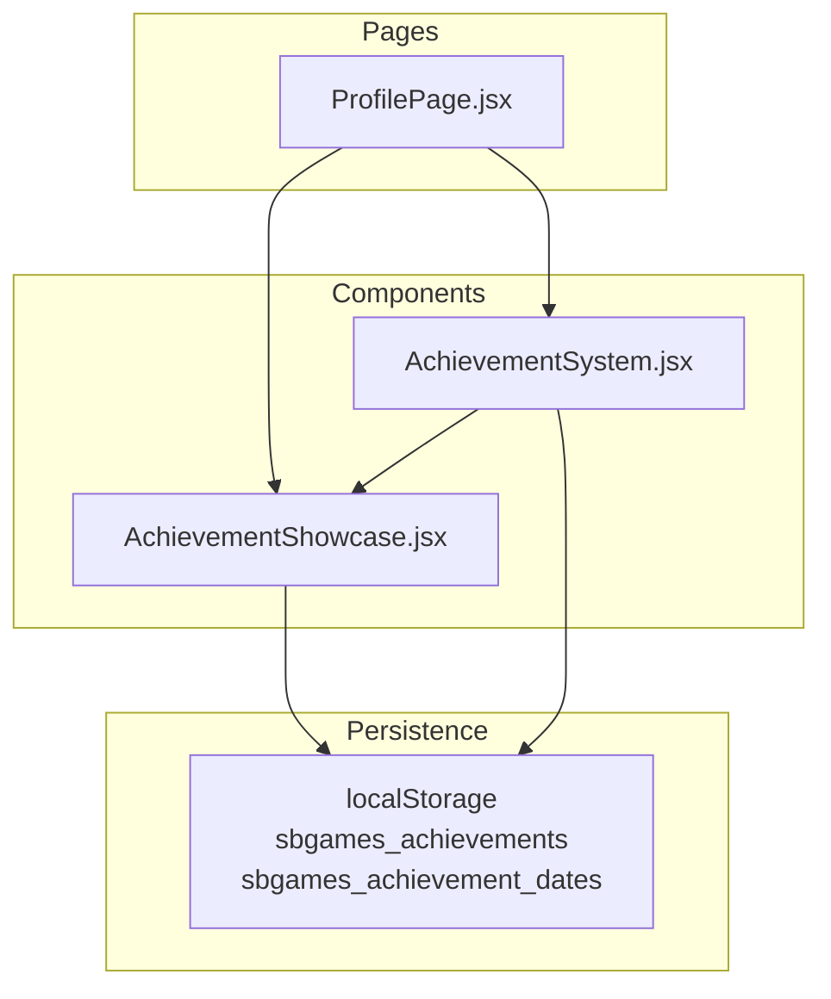
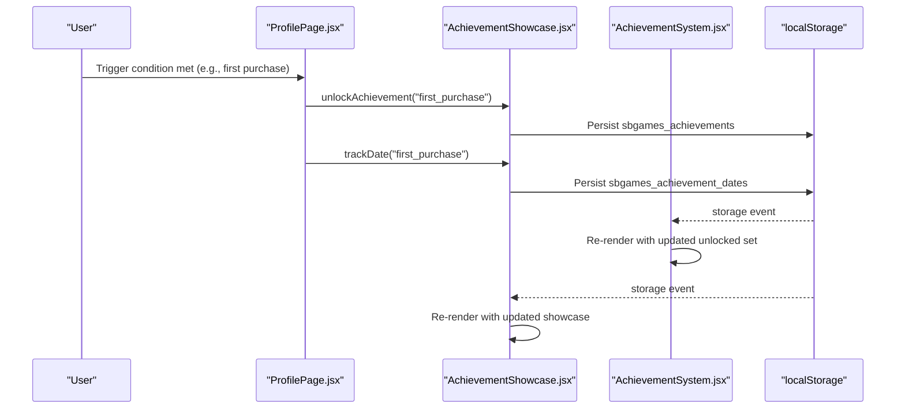
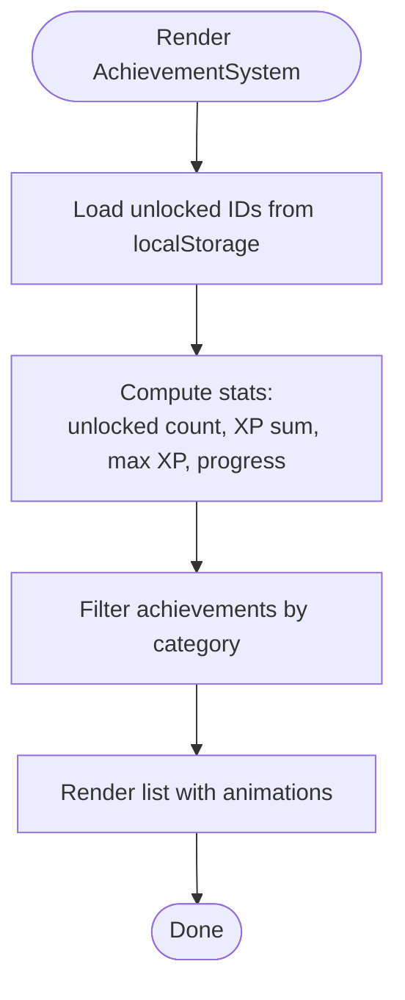
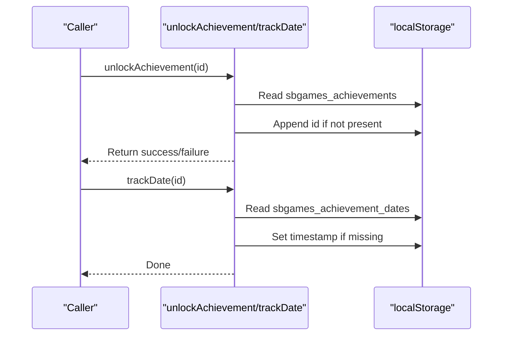
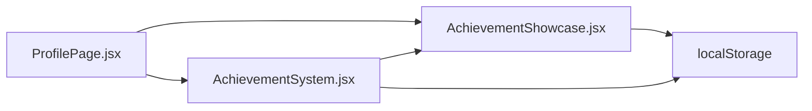

# Achievement System

<cite>
**Referenced Files in This Document**
- [AchievementSystem.jsx](file://src/components/AchievementSystem.jsx)
- [AchievementShowcase.jsx](file://src/components/AchievementShowcase.jsx)
- [ProfilePage.jsx](file://src/pages/ProfilePage.jsx)
</cite>

## Table of Contents
1. [Introduction](#introduction)
2. [Project Structure](#project-structure)
3. [Core Components](#core-components)
4. [Architecture Overview](#architecture-overview)
5. [Detailed Component Analysis](#detailed-component-analysis)
6. [Dependency Analysis](#dependency-analysis)
7. [Performance Considerations](#performance-considerations)
8. [Troubleshooting Guide](#troubleshooting-guide)
9. [Conclusion](#conclusion)

## Introduction
This document explains the achievement system used in the application, focusing on two primary components:
- AchievementSystem.jsx: A comprehensive achievement browser that displays all achievements, tracks progress, and shows XP totals.
- AchievementShowcase.jsx: A compact showcase that highlights unlocked achievements and provides a progress indicator.

It also documents the achievement data model, trigger mechanisms, reward distribution, integration with user profiles, and practical guidance for extending the system.

## Project Structure
The achievement system spans three files:
- AchievementSystem.jsx: Implements the achievement browser with filtering, progress calculation, and animations.
- AchievementShowcase.jsx: Provides a profile-focused showcase of achievements with local storage persistence.
- ProfilePage.jsx: Integrates the showcase into the user profile UI and triggers achievement unlocks and timestamps.

**Diagram sources**
- [AchievementSystem.jsx:1-200](file://src/components/AchievementSystem.jsx#L1-L200)
- [AchievementShowcase.jsx:1-120](file://src/components/AchievementShowcase.jsx#L1-L120)
- [ProfilePage.jsx:29-53](file://src/pages/ProfilePage.jsx#L29-L53)

**Section sources**
- [AchievementSystem.jsx:1-200](file://src/components/AchievementSystem.jsx#L1-L200)
- [AchievementShowcase.jsx:1-120](file://src/components/AchievementShowcase.jsx#L1-L120)
- [ProfilePage.jsx:29-53](file://src/pages/ProfilePage.jsx#L29-L53)

## Core Components
- AchievementSystem.jsx
  - Purpose: Browse and visualize all achievements, filter by categories, compute XP totals and percentage progress, and animate list transitions.
  - Key features:
    - Categories: All, General, Social, Servers, Store, Special.
    - Progress: Total unlocked count, total XP, maximum XP, and percentage.
    - Filtering: Active category filter applied via useMemo.
    - Persistence: Subscribes to localStorage changes for real-time updates.
    - UX: Smooth animations for list entries and progress bars.
  - Reward distribution: Each achievement carries an XP value; total XP is computed from unlocked achievements.

- AchievementShowcase.jsx
  - Purpose: Display a curated set of up to five achievements (unlocked first, then placeholders for locked ones) with a progress bar.
  - Key features:
    - Local storage-backed persistence for unlocked achievements and unlock dates.
    - Real-time synchronization via storage event listeners.
    - Utility functions: getUnlockedAchievements, unlockAchievement, trackDate.
  - Reward distribution: No XP shown here; focuses on visual progression.

- ProfilePage.jsx
  - Purpose: Integrates the showcase into the profile UI and triggers achievement unlocks and timestamps when appropriate events occur.

**Section sources**
- [AchievementSystem.jsx:5-62](file://src/components/AchievementSystem.jsx#L5-L62)
- [AchievementShowcase.jsx:3-51](file://src/components/AchievementShowcase.jsx#L3-L51)
- [ProfilePage.jsx:29-53](file://src/pages/ProfilePage.jsx#L29-L53)

## Architecture Overview
The system uses a simple, client-side architecture:
- Data model: Achievements are defined as static arrays with identifiers, labels, categories, symbols, colors, optional descriptions, and XP values.
- Triggers: Achievements are unlocked programmatically via utility functions and persisted to localStorage.
- Display: Two React components render the data differently—one for browsing, one for showcasing—both reading from localStorage.

**Diagram sources**
- [AchievementShowcase.jsx:18-36](file://src/components/AchievementShowcase.jsx#L18-L36)
- [AchievementSystem.jsx:44-50](file://src/components/AchievementSystem.jsx#L44-L50)
- [ProfilePage.jsx:29-53](file://src/pages/ProfilePage.jsx#L29-L53)

## Detailed Component Analysis

### AchievementSystem.jsx
- Data model
  - Achievement array defines each achievement with id, symbol, color, name, optional description, category, and XP value.
  - Categories include general, social, servers, store, and special.
- Tracking and progress
  - Unlocked achievements are loaded from localStorage.
  - Computes total unlocked count, total XP, maximum possible XP, and progress percentage.
  - Filters achievements by active category using useMemo for performance.
- Reward distribution
  - Each achievement contributes its XP value to the total when unlocked.
- Display and UX
  - Animated list with staggered entrance and exit.
  - Progress bar with gradient styling.
  - Hover effects and category tabs for navigation.

**Diagram sources**
- [AchievementSystem.jsx:40-62](file://src/components/AchievementSystem.jsx#L40-L62)
- [AchievementSystem.jsx:120-195](file://src/components/AchievementSystem.jsx#L120-L195)

**Section sources**
- [AchievementSystem.jsx:5-62](file://src/components/AchievementSystem.jsx#L5-L62)
- [AchievementSystem.jsx:120-195](file://src/components/AchievementSystem.jsx#L120-L195)

### AchievementShowcase.jsx
- Data model
  - Achievement array defines each achievement with id, symbol, color, name, and category.
- Persistence
  - Unlocked achievements stored under sbgames_achievements.
  - Unlock dates stored under sbgames_achievement_dates.
- Triggers and utilities
  - unlockAchievement(id): Prevents duplicates and persists the updated list.
  - trackDate(id): Records the first unlock timestamp if absent.
- Display
  - Curated 5-slot showcase: unlocked achievements first, then locked placeholders.
  - Progress bar shows percentage of unlocked achievements.

**Diagram sources**
- [AchievementShowcase.jsx:18-36](file://src/components/AchievementShowcase.jsx#L18-L36)

**Section sources**
- [AchievementShowcase.jsx:3-51](file://src/components/AchievementShowcase.jsx#L3-L51)
- [AchievementShowcase.jsx:18-36](file://src/components/AchievementShowcase.jsx#L18-L36)

### Achievement Types and Implementation Patterns
- Progress-based achievements
  - Example pattern: Accumulate playtime and unlock milestones (e.g., 10 hours, 50 hours, 100 hours).
  - Implementation pattern: Track cumulative time and call unlockAchievement when thresholds are reached.
- Milestone-based achievements
  - Example pattern: Reach specific counts (e.g., number of friends, items in inventory).
  - Implementation pattern: Increment counters and unlock when thresholds are met.
- Completion-based achievements
  - Example pattern: First-time actions (e.g., first friend, first item, first purchase).
  - Implementation pattern: Check action state and unlock upon first occurrence.

These patterns rely on the existing utility functions and localStorage persistence.

**Section sources**
- [AchievementSystem.jsx:14-30](file://src/components/AchievementSystem.jsx#L14-L30)
- [AchievementShowcase.jsx:3-16](file://src/components/AchievementShowcase.jsx#L3-L16)

### Integration with User Profiles and Real-time Notifications
- Integration points
  - ProfilePage.jsx imports AchievementShowcase and utility functions to trigger unlocks and timestamps.
- Real-time updates
  - Both components subscribe to the storage event to reflect changes made in other tabs or contexts.
- Reward distribution
  - AchievementSystem.jsx computes XP totals from unlocked achievements; AchievementShowcase.jsx does not display XP.

**Section sources**
- [ProfilePage.jsx:29-53](file://src/pages/ProfilePage.jsx#L29-L53)
- [AchievementSystem.jsx:44-50](file://src/components/AchievementSystem.jsx#L44-L50)
- [AchievementShowcase.jsx:41-47](file://src/components/AchievementShowcase.jsx#L41-L47)

## Dependency Analysis
- Internal dependencies
  - AchievementSystem.jsx imports getUnlockedAchievements from AchievementShowcase.jsx to share the unlocked set.
  - AchievementShowcase.jsx is imported by ProfilePage.jsx for profile integration.
- External dependencies
  - Uses localStorage for persistence.
  - Uses Framer Motion for animations.

**Diagram sources**
- [AchievementSystem.jsx:1-3](file://src/components/AchievementSystem.jsx#L1-L3)
- [AchievementShowcase.jsx:1-1](file://src/components/AchievementShowcase.jsx#L1-L1)
- [ProfilePage.jsx:29-31](file://src/pages/ProfilePage.jsx#L29-L31)

**Section sources**
- [AchievementSystem.jsx:1-3](file://src/components/AchievementSystem.jsx#L1-L3)
- [AchievementShowcase.jsx:1-1](file://src/components/AchievementShowcase.jsx#L1-L1)
- [ProfilePage.jsx:29-31](file://src/pages/ProfilePage.jsx#L29-L31)

## Performance Considerations
- Computation optimization
  - Use useMemo for category filtering to avoid recomputing the filtered list unnecessarily.
  - Use Set for unlocked IDs to speed up membership checks.
- Rendering optimization
  - AnimatePresence and layout animations are used; keep lists reasonably sized to minimize animation overhead.
  - Avoid unnecessary re-renders by subscribing to storage events only where needed.
- Persistence efficiency
  - Batch writes to localStorage when possible (e.g., append to list and write once).
  - Avoid parsing errors by wrapping localStorage reads in try/catch blocks.

[No sources needed since this section provides general guidance]

## Troubleshooting Guide
- Achievements not unlocking
  - Verify that unlockAchievement(id) is called and returns true.
  - Confirm that sbgames_achievements exists in localStorage and includes the id.
- Dates not tracked
  - Ensure trackDate(id) is invoked after unlocking.
  - Check that sbgames_achievement_dates contains the id with a timestamp.
- Real-time updates not reflected
  - Confirm that both components listen to the storage event for sbgames_achievements.
  - Ensure no other code removes or corrupts localStorage keys.
- Progress not updating
  - Verify that totalUnlocked and progress calculations use the current unlocked set.
  - Check that category filtering is applied correctly.

**Section sources**
- [AchievementShowcase.jsx:18-36](file://src/components/AchievementShowcase.jsx#L18-L36)
- [AchievementSystem.jsx:44-50](file://src/components/AchievementSystem.jsx#L44-L50)

## Conclusion
The achievement system combines a browsable achievement list with a focused showcase, both powered by localStorage persistence and real-time synchronization. The system supports XP-based rewards, category filtering, and smooth animations. Extending the system involves adding new achievements to the data arrays, triggering unlocks via utility functions, and leveraging the existing persistence and rendering patterns.

[No sources needed since this section summarizes without analyzing specific files]