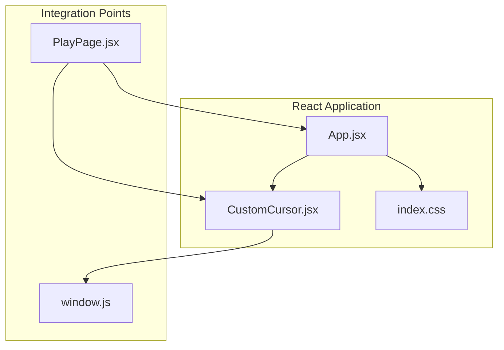
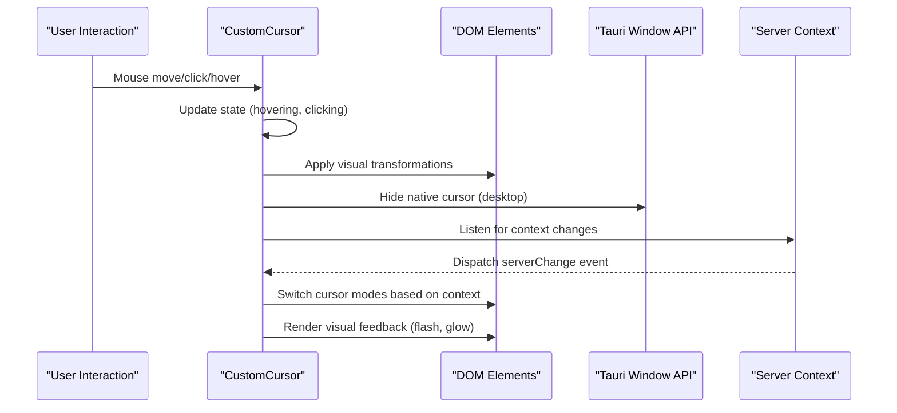
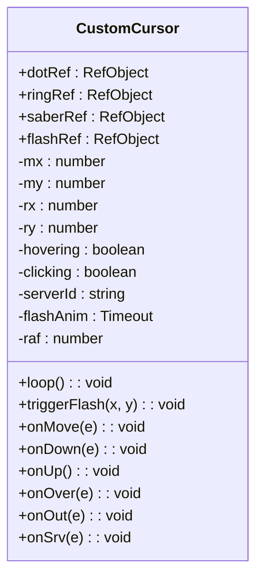
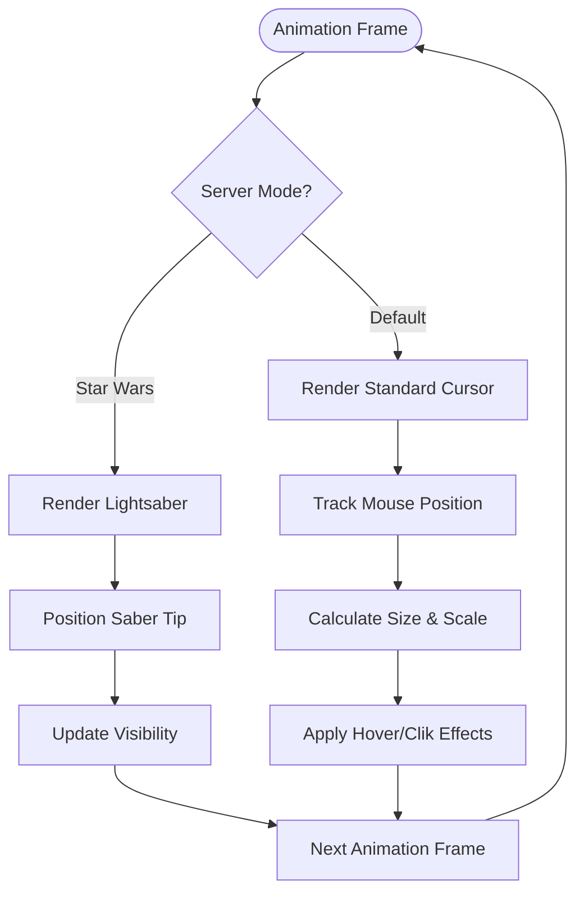
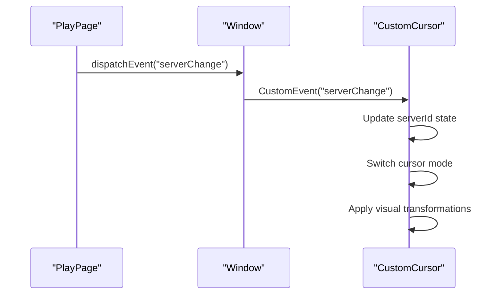
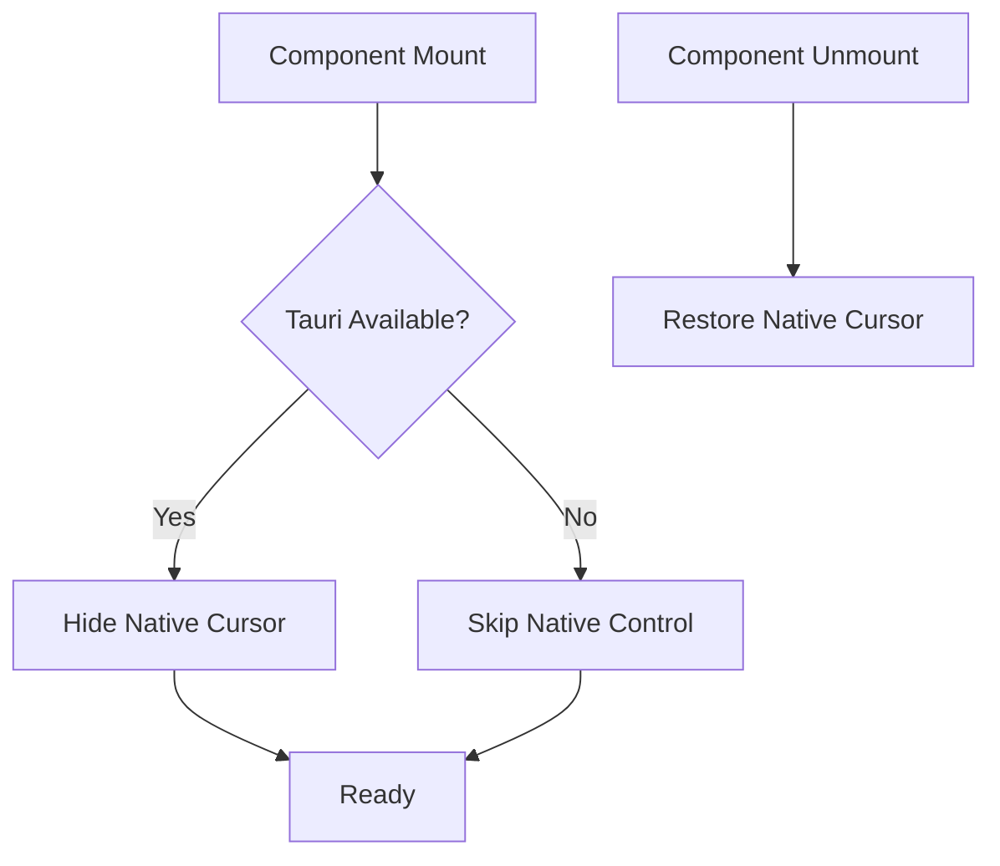
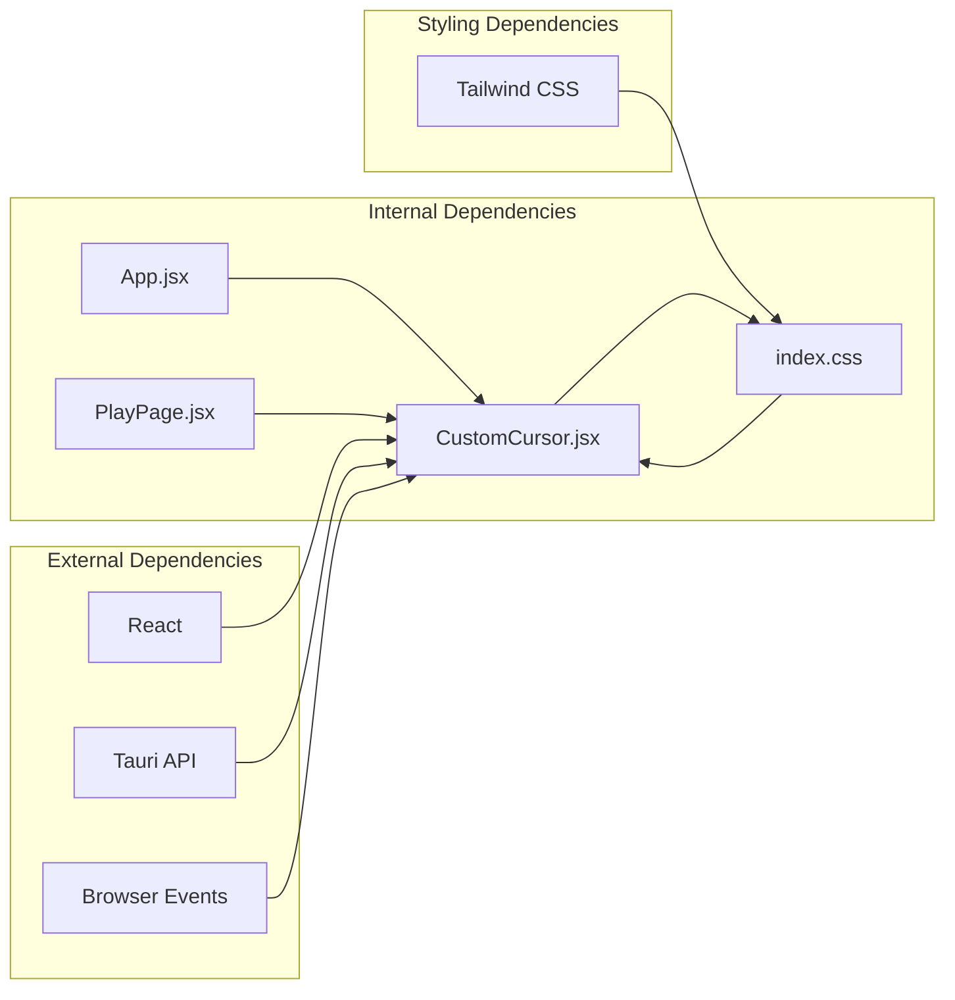

# Custom Cursor System

<cite>
**Referenced Files in This Document**
- [CustomCursor.jsx](file://src/components/CustomCursor.jsx)
- [index.css](file://src/index.css)
- [App.jsx](file://src/App.jsx)
- [PlayPage.jsx](file://src/pages/PlayPage.jsx)
- [window.js](file://src/lib/window.js)
</cite>

## Table of Contents
1. [Introduction](#introduction)
2. [Project Structure](#project-structure)
3. [Core Components](#core-components)
4. [Architecture Overview](#architecture-overview)
5. [Detailed Component Analysis](#detailed-component-analysis)
6. [Dependency Analysis](#dependency-analysis)
7. [Performance Considerations](#performance-considerations)
8. [Troubleshooting Guide](#troubleshooting-guide)
9. [Conclusion](#conclusion)
10. [Appendices](#appendices)

## Introduction
This document provides comprehensive documentation for the custom cursor system component used in the SBGames launcher application. The system replaces the native OS cursor with a custom-designed cursor that adapts its appearance based on user interactions and server context. It features two distinct visual modes: a default minimalist cursor and a lightsaber-themed cursor for specific server contexts, with sophisticated hover and click feedback mechanisms.

The cursor system is implemented as a React functional component that manages its own lifecycle, handles mouse events, and coordinates visual feedback through requestAnimationFrame-based animation loops. It integrates with the Tauri window system to hide the native cursor and provides server-aware customization through a custom event mechanism.

## Project Structure
The custom cursor system is organized within the React application structure as follows:



**Diagram sources**
- [App.jsx:1-41](file://src/App.jsx#L1-L41)
- [CustomCursor.jsx:1-266](file://src/components/CustomCursor.jsx#L1-L266)
- [index.css:1-36](file://src/index.css#L1-L36)
- [PlayPage.jsx:85-107](file://src/pages/PlayPage.jsx#L85-L107)
- [window.js:1-16](file://src/lib/window.js#L1-L16)

**Section sources**
- [App.jsx:1-41](file://src/App.jsx#L1-L41)
- [CustomCursor.jsx:1-266](file://src/components/CustomCursor.jsx#L1-L266)
- [index.css:1-36](file://src/index.css#L1-L36)

## Core Components
The custom cursor system consists of several interconnected components that work together to provide the enhanced cursor experience:

### Primary Components
- **CustomCursor Component**: Main cursor implementation managing state and rendering
- **CSS Styling Layer**: Global styles that disable native cursor and provide base styling
- **Server Integration**: Event-driven system for context-aware cursor customization
- **Tauri Window Integration**: Native cursor hiding for desktop environments

### Visual Elements
The system renders four primary visual elements:
- **Ring Cursor**: Outer circular boundary with configurable size and styling
- **Dot Cursor**: Central dot that provides contrast and hover feedback
- **Flash Effect**: Click feedback animation for specific contexts
- **Lightsaber Cursor**: Specialized cursor for specific server contexts

**Section sources**
- [CustomCursor.jsx:3-266](file://src/components/CustomCursor.jsx#L3-L266)
- [index.css:23-24](file://src/index.css#L23-L24)

## Architecture Overview
The cursor system employs a reactive architecture with real-time state management and efficient rendering:



**Diagram sources**
- [CustomCursor.jsx:9-114](file://src/components/CustomCursor.jsx#L9-L114)
- [CustomCursor.jsx:51-78](file://src/components/CustomCursor.jsx#L51-L78)
- [PlayPage.jsx:90-99](file://src/pages/PlayPage.jsx#L90-L99)

The architecture implements several key design patterns:
- **Observer Pattern**: Event listeners for mouse and server state changes
- **State Machine**: Context-dependent cursor mode switching
- **Animation Loop**: requestAnimationFrame-based rendering pipeline
- **Resource Management**: Proper cleanup of event listeners and animations

## Detailed Component Analysis

### CustomCursor Component Implementation
The CustomCursor component serves as the central orchestrator for cursor behavior and visual feedback.

#### State Management Architecture
The component maintains internal state through React refs and local variables:



**Diagram sources**
- [CustomCursor.jsx:4-32](file://src/components/CustomCursor.jsx#L4-L32)

#### Rendering Pipeline
The component implements a sophisticated rendering pipeline using requestAnimationFrame:



**Diagram sources**
- [CustomCursor.jsx:51-78](file://src/components/CustomCursor.jsx#L51-L78)
- [CustomCursor.jsx:64-74](file://src/components/CustomCursor.jsx#L64-L74)

#### Event Handling System
The component registers multiple event listeners for comprehensive interaction support:

| Event Type | Handler | Purpose |
|------------|---------|---------|
| `mousemove` | `onMove` | Track mouse position with passive listener |
| `mousedown` | `onDown` | Detect click state for visual feedback |
| `mouseup` | `onUp` | Release click state |
| `mouseover` | `onOver` | Detect hover over interactive elements |
| `mouseout` | `onOut` | Clear hover state |
| `serverChange` | `onSrv` | Respond to server context changes |

**Section sources**
- [CustomCursor.jsx:80-95](file://src/components/CustomCursor.jsx#L80-L95)
- [CustomCursor.jsx:97-114](file://src/components/CustomCursor.jsx#L97-L114)

### CSS Styling Approach
The cursor system relies on global CSS to disable native cursors and establish base styling:

#### Base Cursor Styling
The global stylesheet enforces custom cursor behavior across all elements:

```css
/* Disable native cursor globally */
* { cursor: none !important; }
```

#### Performance Optimizations
Critical performance enhancements include:
- `will-change: transform` for hardware-accelerated animations
- `pointer-events: none` for non-interactive cursor elements
- `transition: none` for smooth animation without CSS transitions

#### Visual Design Principles
The styling establishes a consistent visual language:
- Fixed positioning with high z-index values
- Circular shapes with precise border radii
- Transparent backgrounds for minimal visual impact
- Hardware acceleration through transform properties

**Section sources**
- [index.css:23-24](file://src/index.css#L23-L24)
- [index.css:120-126](file://src/index.css#L120-L126)
- [index.css:133-135](file://src/index.css#L133-L135)

### Server Integration System
The cursor system integrates with server context through a custom event mechanism:

#### Event-Driven Architecture


**Diagram sources**
- [PlayPage.jsx:90-99](file://src/pages/PlayPage.jsx#L90-L99)
- [CustomCursor.jsx:88](file://src/components/CustomCursor.jsx#L88)

#### Context-Aware Behavior
The system responds to different server contexts:
- **Default Mode**: Standard ring and dot cursors
- **Star Wars Mode**: Lightsaber cursor with specialized effects
- **Dynamic Switching**: Real-time mode changes based on server selection

**Section sources**
- [PlayPage.jsx:90-99](file://src/pages/PlayPage.jsx#L90-L99)
- [CustomCursor.jsx:52](file://src/components/CustomCursor.jsx#L52)

### Tauri Window Integration
The system integrates with the Tauri framework for native cursor control:

#### Desktop-Specific Features


**Diagram sources**
- [CustomCursor.jsx:10-18](file://src/components/CustomCursor.jsx#L10-L18)
- [CustomCursor.jsx:106-112](file://src/components/CustomCursor.jsx#L106-L112)

#### Platform Compatibility
The integration gracefully handles platform differences:
- **Desktop Environments**: Full native cursor control
- **Web Environments**: Graceful fallback to CSS-based cursor
- **Mobile Devices**: Automatic adaptation to touch interfaces

**Section sources**
- [CustomCursor.jsx:10-18](file://src/components/CustomCursor.jsx#L10-L18)
- [window.js:1-16](file://src/lib/window.js#L1-L16)

## Dependency Analysis
The cursor system has minimal external dependencies and maintains clean separation of concerns:



**Diagram sources**
- [App.jsx:5](file://src/App.jsx#L5)
- [CustomCursor.jsx:1](file://src/components/CustomCursor.jsx#L1)
- [PlayPage.jsx:90](file://src/pages/PlayPage.jsx#L90)

### Component Coupling
The system demonstrates low coupling through:
- **Event-Driven Communication**: Uses CustomEvent for inter-component communication
- **Minimal Props**: No props required, self-contained implementation
- **Global State Access**: Direct DOM manipulation for optimal performance
- **Graceful Degradation**: Functions without external dependencies

**Section sources**
- [CustomCursor.jsx:90-95](file://src/components/CustomCursor.jsx#L90-L95)
- [PlayPage.jsx:90-99](file://src/pages/PlayPage.jsx#L90-L99)

## Performance Considerations
The cursor system implements several performance optimizations for smooth animations:

### Animation Performance
- **requestAnimationFrame**: Uses browser-native animation loop for 60fps updates
- **Hardware Acceleration**: Leverages CSS transforms for GPU-accelerated rendering
- **Passive Event Listeners**: Mousemove events use passive option for improved scrolling performance
- **Transform Properties**: Animations target transform and opacity for optimal performance

### Memory Management
- **Proper Cleanup**: All event listeners and timeouts are removed on component unmount
- **Animation Frame Cancellation**: requestAnimationFrame loops are properly canceled
- **Resource Pooling**: Minimal DOM manipulation reduces layout thrashing

### Browser Compatibility
- **Modern APIs**: Uses contemporary JavaScript and CSS features
- **Graceful Fallbacks**: Falls back to native cursor behavior when unavailable
- **Performance Polyfills**: No heavy polyfills required for core functionality

**Section sources**
- [CustomCursor.jsx:76](file://src/components/CustomCursor.jsx#L76)
- [CustomCursor.jsx:90](file://src/components/CustomCursor.jsx#L90)
- [CustomCursor.jsx:97-114](file://src/components/CustomCursor.jsx#L97-L114)

## Troubleshooting Guide

### Common Issues and Solutions

#### Cursor Not Visible
**Problem**: Custom cursor appears invisible
**Causes**:
- CSS conflicts with cursor styles
- Component not mounted properly
- Tauri integration failures

**Solutions**:
- Verify `cursor: none !important` is applied globally
- Ensure component is rendered within App context
- Check Tauri API availability in development vs production

#### Performance Issues
**Problem**: Choppy cursor movement or animations
**Causes**:
- Excessive DOM manipulation
- Missing will-change properties
- Event listener memory leaks

**Solutions**:
- Verify `will-change: transform` is applied to animated elements
- Confirm proper cleanup in useEffect return function
- Monitor for duplicate event listeners

#### Server Context Not Working
**Problem**: Cursor mode doesn't change with server selection
**Causes**:
- Event listener not registered
- Event payload format incorrect
- Component not receiving events

**Solutions**:
- Verify `serverChange` event registration
- Check event detail structure matches expected format
- Ensure component remains mounted during server changes

**Section sources**
- [CustomCursor.jsx:106-112](file://src/components/CustomCursor.jsx#L106-L112)
- [PlayPage.jsx:90-99](file://src/pages/PlayPage.jsx#L90-L99)

### Debugging Techniques
1. **Console Logging**: Add temporary console.log statements in event handlers
2. **State Inspection**: Use browser dev tools to inspect cursor element properties
3. **Event Monitoring**: Monitor event listener registration and removal
4. **Performance Profiling**: Use browser performance tools to identify bottlenecks

## Conclusion
The custom cursor system represents a sophisticated implementation of interactive UI enhancement that balances visual appeal with performance efficiency. The system successfully abstracts complex cursor behavior into a reusable, self-contained React component that integrates seamlessly with the broader application architecture.

Key achievements include:
- **Performance-Optimized**: Utilizes modern web APIs for smooth 60fps animations
- **Context-Aware**: Adapts behavior based on server context and user interactions
- **Platform-Adaptive**: Provides graceful fallbacks for different environments
- **Maintainable**: Clean separation of concerns with minimal dependencies

The system serves as an excellent example of advanced React patterns, including custom hooks, event-driven architectures, and performance-conscious rendering techniques. Its modular design makes it suitable for extension and adaptation to other projects requiring custom cursor functionality.

## Appendices

### Extension Guidelines
To extend the cursor system with new states and visual effects:

#### Adding New Cursor States
1. Define state variables in component initialization
2. Add conditional rendering logic in the main loop
3. Implement state-specific visual transformations
4. Register appropriate event handlers for state transitions

#### Customizing Visual Effects
1. Create new CSS classes or inline styles for additional effects
2. Implement animation sequences using CSS keyframes or JavaScript
3. Integrate with existing requestAnimationFrame pipeline
4. Ensure performance optimizations are maintained

#### Server Context Extensions
1. Extend event payload structure to include new context data
2. Add new server ID constants for different contexts
3. Implement mode-specific visual transformations
4. Test cross-platform compatibility for new features

### Accessibility Considerations
While the custom cursor enhances visual appeal, accessibility should be considered:

#### Alternative Interaction Methods
- **Keyboard Navigation**: Ensure keyboard-only navigation remains functional
- **Focus Indicators**: Maintain visible focus states for interactive elements
- **Motion Sensitivity**: Consider reduced motion preferences
- **Visual Impairment**: Provide options for high contrast and larger cursor sizes

#### Implementation Recommendations
- Maintain focus-visible indicators for interactive elements
- Provide keyboard shortcuts for all mouse-based interactions
- Offer user controls to adjust cursor sensitivity and size
- Test with screen readers and assistive technologies