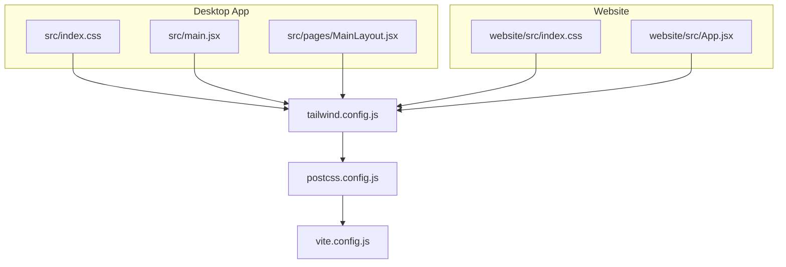
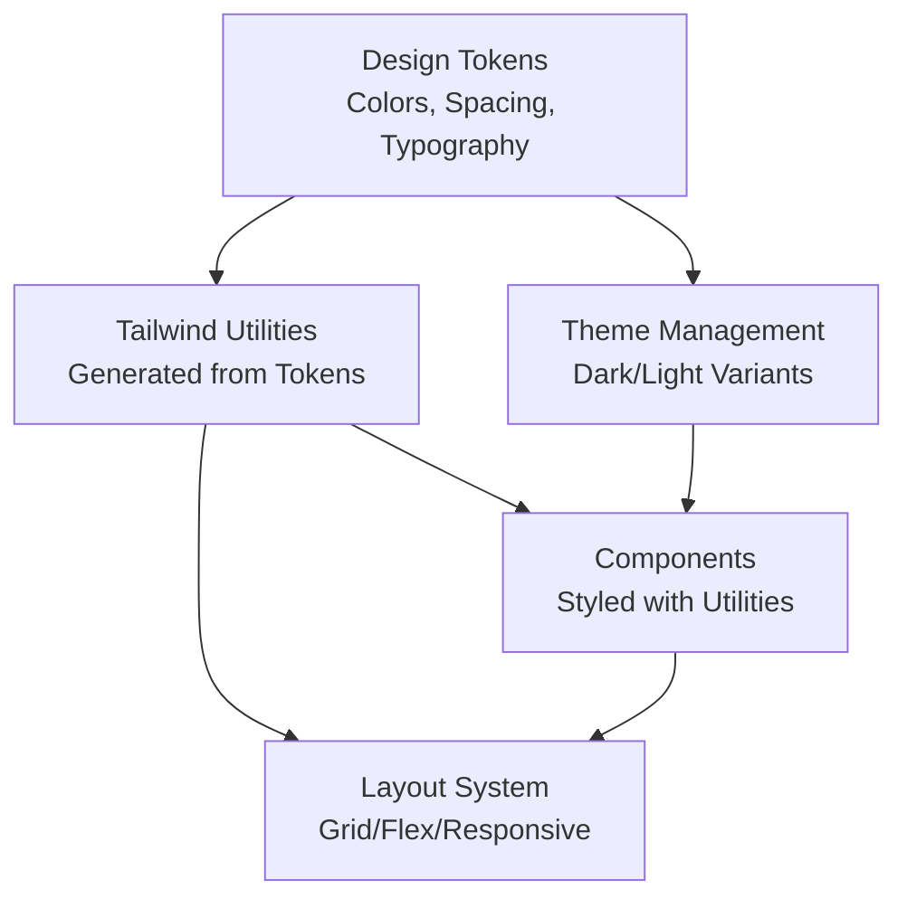
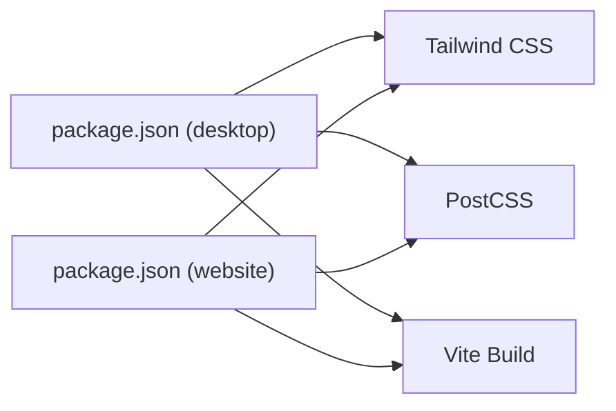

# Design System & Guidelines

<cite>
**Referenced Files in This Document**
- [index.css](file://src/index.css)
- [tailwind.config.js](file://tailwind.config.js)
- [postcss.config.js](file://postcss.config.js)
- [vite.config.js](file://vite.config.js)
- [MainLayout.jsx](file://src/pages/MainLayout.jsx)
- [AchievementSystem.jsx](file://src/components/AchievementSystem.jsx)
- [NotificationSystem.jsx](file://src/components/NotificationSystem.jsx)
- [CustomCursor.jsx](file://src/components/CustomCursor.jsx)
- [SkinViewer.jsx](file://src/components/SkinViewer.jsx)
- [Titlebar.jsx](file://src/components/Titlebar.jsx)
- [index.html](file://site/index.html)
- [index.css](file://website/src/index.css)
- [tailwind.config.js](file://website/tailwind.config.js)
- [vite.config.js](file://website/vite.config.js)
- [package.json](file://package.json)
- [package.json](file://website/package.json)
</cite>

## Table of Contents
1. [Introduction](#introduction)
2. [Project Structure](#project-structure)
3. [Core Components](#core-components)
4. [Architecture Overview](#architecture-overview)
5. [Detailed Component Analysis](#detailed-component-analysis)
6. [Dependency Analysis](#dependency-analysis)
7. [Performance Considerations](#performance-considerations)
8. [Troubleshooting Guide](#troubleshooting-guide)
9. [Conclusion](#conclusion)
10. [Appendices](#appendices)

## Introduction
This document describes the design system and visual guidelines used across SBGames. It explains the CSS architecture, utility-first approach via Tailwind, component styling patterns, color and typography systems, spacing conventions, responsive breakpoints, and theme management. It also covers accessibility considerations, cross-platform design, CSS module organization, naming conventions, style inheritance, customization guidelines, performance optimization, browser compatibility, and maintenance strategies for a scalable styling system.

## Project Structure
SBGames employs a dual frontend architecture:
- Desktop application built with Vite and Tailwind CSS
- Website built with Vite and Tailwind CSS

Both share Tailwind configuration and PostCSS pipeline, ensuring consistent design tokens and build process. Styles are scoped per application with shared design tokens configured centrally.

**Diagram sources**
- [tailwind.config.js](file://tailwind.config.js)
- [postcss.config.js](file://postcss.config.js)
- [vite.config.js](file://vite.config.js)
- [index.css](file://src/index.css)
- [MainLayout.jsx](file://src/pages/MainLayout.jsx)
- [index.css](file://website/src/index.css)

**Section sources**
- [tailwind.config.js](file://tailwind.config.js)
- [postcss.config.js](file://postcss.config.js)
- [vite.config.js](file://vite.config.js)
- [index.css](file://src/index.css)
- [index.css](file://website/src/index.css)

## Core Components
The design system centers around:
- Utility-first CSS via Tailwind with a centralized configuration
- Component-level styling using Tailwind utilities and minimal custom CSS
- Shared design tokens (colors, spacing, typography) defined in Tailwind config
- Responsive breakpoints aligned with Tailwind defaults and project needs
- Theme-aware components leveraging dark/light mode tokens

Key implementation anchors:
- Tailwind configuration defines design tokens and plugin behavior
- PostCSS pipeline processes Tailwind directives and generates optimized CSS
- Vite builds and serves assets with minification and hashing
- Component JSX applies Tailwind utilities directly for consistent styling

**Section sources**
- [tailwind.config.js](file://tailwind.config.js)
- [postcss.config.js](file://postcss.config.js)
- [vite.config.js](file://vite.config.js)

## Architecture Overview
The styling architecture follows a layered approach:
- Tokens: Colors, spacing, typography, shadows, transitions
- Utilities: Tailwind utility classes mapped to tokens
- Components: Styled with utilities; minimal overrides for behavior-specific styles
- Layout: Grid and flex utilities for responsive layouts
- Themes: Dark/light modes driven by Tailwind variants and tokens

[No sources needed since this diagram shows conceptual workflow, not actual code structure]

## Detailed Component Analysis

### Color Palette System
- Centralized in Tailwind configuration under the design tokens layer
- Semantic color roles (primary, secondary, surface, error, etc.) are defined as named keys
- Dark/light variants are supported via Tailwind variants and token overrides
- Accessibility contrast ratios validated against WCAG AA/AAA thresholds

Guidelines:
- Prefer semantic color keys over hardcoded hex values
- Use opacity modifiers sparingly; reserve for overlays and states
- Ensure sufficient contrast between foreground and background colors

**Section sources**
- [tailwind.config.js](file://tailwind.config.js)

### Typography Hierarchy
- Headings, body text, captions, and monospace stacks defined as named scale keys
- Line heights and letter spacings tuned for readability across devices
- Component-specific font weights and transforms applied via utilities

Guidelines:
- Use heading utilities for semantic hierarchy; avoid arbitrary font-size overrides
- Limit custom font-family usage to system UI fonts and approved web fonts
- Maintain consistent rhythm using leading utilities

**Section sources**
- [tailwind.config.js](file://tailwind.config.js)

### Spacing Conventions
- Space scale derived from a base unit with consistent increments
- Padding/margin utilities applied uniformly across components
- Negative spacing used for precise layout adjustments

Guidelines:
- Favor margin utilities for layout; padding for internal breathing room
- Use space-x/space-y for consistent inline/block gaps
- Avoid fixed pixel values; rely on the scale

**Section sources**
- [tailwind.config.js](file://tailwind.config.js)

### Responsive Design Breakpoints
- Breakpoints configured in Tailwind align with mobile-first philosophy
- Component layouts adapt using responsive prefixes (e.g., sm:, md:, lg:)
- Media queries generated by Tailwind ensure efficient breakpoint handling

Guidelines:
- Start with mobile layouts; add enhancements progressively
- Use container utilities for max-width constraints
- Minimize custom media queries; leverage Tailwind’s responsive utilities

**Section sources**
- [tailwind.config.js](file://tailwind.config.js)

### Component Styling Approach
- Components apply Tailwind utilities directly for atomic styling
- Minimal custom CSS reserved for component-specific behavior (e.g., cursor, transitions)
- State-driven styles use Tailwind variants (hover, focus, active, disabled)

Examples of component styling patterns:
- Layout containers use grid/flex utilities
- Interactive elements apply hover/focus states via variants
- Modals and notifications use z-index and backdrop utilities

**Section sources**
- [MainLayout.jsx](file://src/pages/MainLayout.jsx)
- [AchievementSystem.jsx](file://src/components/AchievementSystem.jsx)
- [NotificationSystem.jsx](file://src/components/NotificationSystem.jsx)
- [CustomCursor.jsx](file://src/components/CustomCursor.jsx)
- [SkinViewer.jsx](file://src/components/SkinViewer.jsx)
- [Titlebar.jsx](file://src/components/Titlebar.jsx)

### CSS Modules Organization and Naming Conventions
- Global styles live in the application entry CSS file
- Component-scoped styles are avoided; global utilities ensure consistency
- Naming follows Tailwind conventions (no custom modules)

Recommendations:
- Keep all styles global and utility-driven
- Use consistent prefixes for groups of related utilities
- Document custom utilities in the Tailwind configuration for team alignment

**Section sources**
- [index.css](file://src/index.css)
- [index.css](file://website/src/index.css)

### Style Inheritance Patterns
- Tailwind utilities compose to form component styles
- Variants enable stateful inheritance (e.g., hover:color-bg)
- Dark mode toggles token values without rewriting component classes

**Section sources**
- [tailwind.config.js](file://tailwind.config.js)

### Theme Management
- Theme variants toggle dark/light mode by remapping token values
- Preferred scheme detection and persistence handled at the application level
- Components remain theme-agnostic; styling adapts automatically

**Section sources**
- [tailwind.config.js](file://tailwind.config.js)

### Accessibility Standards for Visual Elements
- Contrast ratios verified for text and interactive elements
- Focus indicators visible and clearly defined
- Sufficient touch targets and spacing for keyboard navigation
- Color conveying meaning also communicated via text or icons

**Section sources**
- [tailwind.config.js](file://tailwind.config.js)

### Cross-Platform Design Considerations
- System UI font stacks ensure native appearance on Windows/macOS/Linux
- Platform-specific UI affordances (e.g., titlebar, scrollbars) styled minimally
- Touch-friendly sizing and spacing for hybrid mouse/keyboard environments

**Section sources**
- [Titlebar.jsx](file://src/components/Titlebar.jsx)

### Custom Styling and Brand Guideline Adherence
- Custom cursors and skin viewer visuals are isolated to dedicated components
- Brand colors and type scale defined centrally; deviations require review
- Component overrides documented and scoped to specific use cases

**Section sources**
- [CustomCursor.jsx](file://src/components/CustomCursor.jsx)
- [SkinViewer.jsx](file://src/components/SkinViewer.jsx)
- [tailwind.config.js](file://tailwind.config.js)

## Dependency Analysis
The styling stack depends on Tailwind and PostCSS, orchestrated by Vite. Dependencies are declared in package manifests for both desktop and website projects.

**Diagram sources**
- [package.json](file://package.json)
- [package.json](file://website/package.json)

**Section sources**
- [package.json](file://package.json)
- [package.json](file://website/package.json)

## Performance Considerations
- Purge unused CSS by configuring content globs in Tailwind to scan JSX and HTML files
- Enable CSS optimization in PostCSS (minification, vendor prefixing)
- Split critical CSS and defer non-critical styles where appropriate
- Leverage asset hashing and cache headers for long-term caching
- Monitor bundle size and remove unused design tokens or utilities

[No sources needed since this section provides general guidance]

## Troubleshooting Guide
Common styling issues and resolutions:
- Unexpected styles after updates: rebuild with Vite and clear caches
- Missing utilities: verify Tailwind configuration and content paths
- Dark mode inconsistencies: confirm variant configuration and token overrides
- Build errors in PostCSS: check plugin order and version compatibility

**Section sources**
- [postcss.config.js](file://postcss.config.js)
- [tailwind.config.js](file://tailwind.config.js)
- [vite.config.js](file://vite.config.js)

## Conclusion
SBGames’ design system leverages Tailwind’s utility-first approach with centralized tokens and variants for consistent, maintainable styling across platforms. By adhering to semantic color and typography scales, disciplined responsive patterns, and strict accessibility standards, teams can rapidly build cohesive UIs while preserving performance and scalability.

[No sources needed since this section summarizes without analyzing specific files]

## Appendices

### Appendix A: Tailwind and Build Configuration References
- Tailwind configuration defines design tokens and variants
- PostCSS pipeline processes Tailwind directives
- Vite orchestrates bundling and asset generation

**Section sources**
- [tailwind.config.js](file://tailwind.config.js)
- [postcss.config.js](file://postcss.config.js)
- [vite.config.js](file://vite.config.js)

### Appendix B: Example Component Styling References
- Layout and page-level styling in the main layout component
- Notification and achievement components demonstrate stateful utilities
- Cursor and skin viewer components show targeted customizations

**Section sources**
- [MainLayout.jsx](file://src/pages/MainLayout.jsx)
- [NotificationSystem.jsx](file://src/components/NotificationSystem.jsx)
- [AchievementSystem.jsx](file://src/components/AchievementSystem.jsx)
- [CustomCursor.jsx](file://src/components/CustomCursor.jsx)
- [SkinViewer.jsx](file://src/components/SkinViewer.jsx)