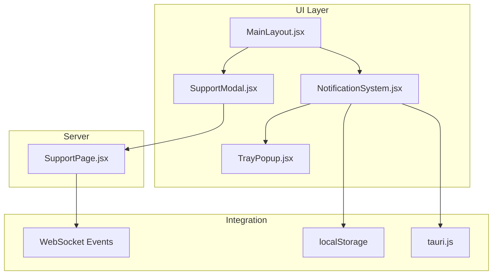
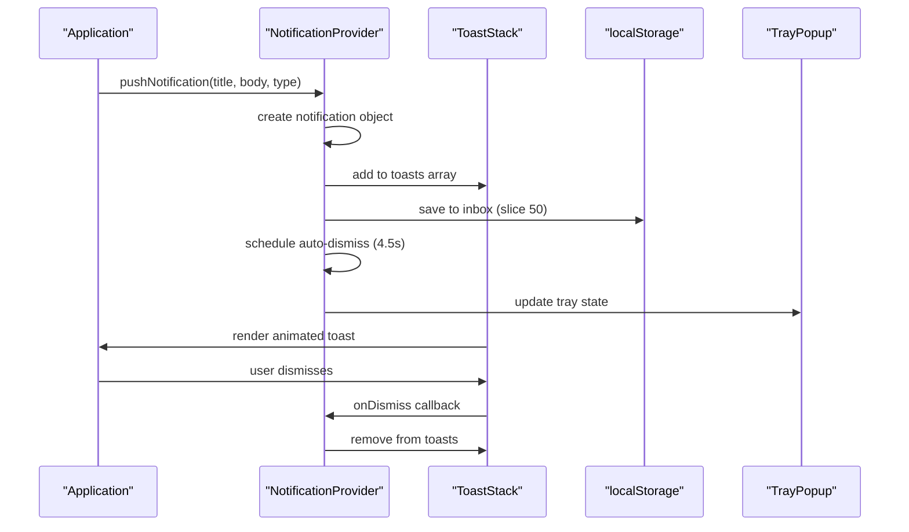
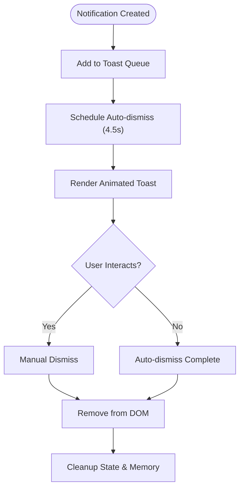
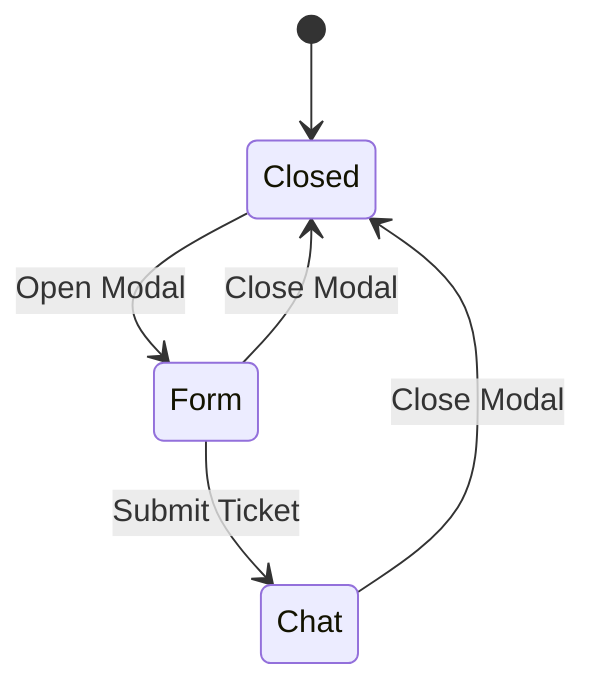
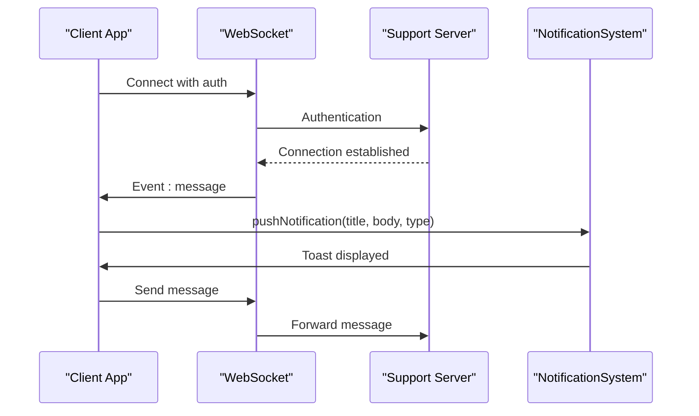
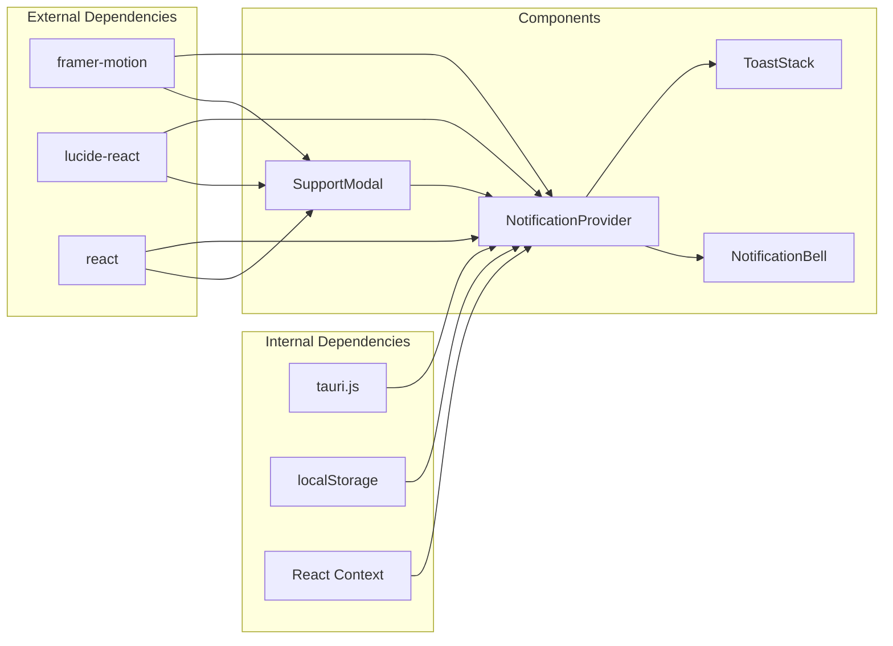

# Notification System

<cite>
**Referenced Files in This Document**
- [NotificationSystem.jsx](file://src/components/NotificationSystem.jsx)
- [SupportModal.jsx](file://src/pages/SupportModal.jsx)
- [MainLayout.jsx](file://src/pages/MainLayout.jsx)
- [TrayPopup.jsx](file://src/pages/TrayPopup.jsx)
- [tauri.js](file://src/lib/tauri.js)
- [SupportPage.jsx](file://src/pages/SupportPage.jsx)
</cite>

## Table of Contents
1. [Introduction](#introduction)
2. [Project Structure](#project-structure)
3. [Core Components](#core-components)
4. [Architecture Overview](#architecture-overview)
5. [Detailed Component Analysis](#detailed-component-analysis)
6. [Dependency Analysis](#dependency-analysis)
7. [Performance Considerations](#performance-considerations)
8. [Troubleshooting Guide](#troubleshooting-guide)
9. [Conclusion](#conclusion)

## Introduction
This document provides comprehensive documentation for the notification system and modal dialogs in the SBGames launcher application. It covers the NotificationSystem.jsx component for toast notifications and inbox management, the SupportModal.jsx component for customer service interfaces, and the integration with WebSocket events for real-time updates. The documentation explains notification types, positioning strategies, auto-dismiss functionality, user interaction handling, and modal lifecycle management. It also includes guidelines for notification prioritization, user preferences, accessibility compliance, and performance considerations.

## Project Structure
The notification system spans several modules:
- NotificationSystem.jsx: Provides the notification provider, toast stack, bell panel, and global push function
- SupportModal.jsx: Implements the customer support modal with ticket creation and chat interface
- MainLayout.jsx: Integrates the notification provider and demonstrates real-time notification triggers
- TrayPopup.jsx: Displays notifications in the system tray
- tauri.js: Desktop notification integration via Tauri
- SupportPage.jsx: Real-time support page with WebSocket integration

**Diagram sources**
- [NotificationSystem.jsx:24-82](file://src/components/NotificationSystem.jsx#L24-L82)
- [SupportModal.jsx:18-79](file://src/pages/SupportModal.jsx#L18-L79)
- [MainLayout.jsx:126-159](file://src/pages/MainLayout.jsx#L126-L159)
- [TrayPopup.jsx:163-238](file://src/pages/TrayPopup.jsx#L163-L238)
- [tauri.js:18-25](file://src/lib/tauri.js#L18-L25)
- [SupportPage.jsx:91-100](file://src/pages/SupportPage.jsx#L91-L100)

**Section sources**
- [NotificationSystem.jsx:1-382](file://src/components/NotificationSystem.jsx#L1-L382)
- [SupportModal.jsx:1-324](file://src/pages/SupportModal.jsx#L1-L324)
- [MainLayout.jsx:126-159](file://src/pages/MainLayout.jsx#L126-L159)
- [TrayPopup.jsx:163-238](file://src/pages/TrayPopup.jsx#L163-L238)
- [tauri.js:18-25](file://src/lib/tauri.js#L18-L25)
- [SupportPage.jsx:91-100](file://src/pages/SupportPage.jsx#L91-L100)

## Core Components
The notification system consists of three primary components:

### Notification Provider
The NotificationProvider manages the complete notification lifecycle:
- Maintains toast queue (max 5 concurrent toasts)
- Stores notification history (max 50 items) in localStorage
- Tracks unread count for bell badge
- Provides global push function for external components
- Handles dismissal and clearing operations

### Toast Stack
Implements a Steam-style notification display:
- Fixed position in top-right corner
- Spring animation for entrance and exit
- Progress bar showing remaining lifetime
- Dismiss button for manual removal
- Auto-dismiss after 4.5 seconds

### Bell Panel
Provides inbox access and management:
- Dropdown panel with notification list
- Unread badge indicator
- Mark all read functionality
- Clear all notifications
- Hover effects and animations

**Section sources**
- [NotificationSystem.jsx:24-82](file://src/components/NotificationSystem.jsx#L24-L82)
- [NotificationSystem.jsx:85-97](file://src/components/NotificationSystem.jsx#L85-L97)
- [NotificationSystem.jsx:184-373](file://src/components/NotificationSystem.jsx#L184-L373)

## Architecture Overview
The notification system follows a centralized architecture pattern:

**Diagram sources**
- [NotificationSystem.jsx:37-52](file://src/components/NotificationSystem.jsx#L37-L52)
- [NotificationSystem.jsx:76-81](file://src/components/NotificationSystem.jsx#L76-L81)
- [NotificationSystem.jsx:118-180](file://src/components/NotificationSystem.jsx#L118-L180)

## Detailed Component Analysis

### NotificationSystem.jsx Analysis
The NotificationSystem.jsx implements a comprehensive notification framework with the following key features:

#### Notification Types and Icons
The system supports five notification types with distinct visual treatments:
- friend: Blue gradient with user icon
- balance: Green gradient with coin icon  
- ticket: Amber gradient with message icon
- system: Purple gradient with info icon
- success: Green gradient with check circle icon

#### Queue Management
- Toast limit: 5 concurrent notifications
- History limit: 50 stored notifications
- Auto-dismiss: 4,500ms after appearance
- Memory cleanup: Automatic removal from DOM and state

#### Positioning Strategy
- Fixed positioning: top-4 right-4
- Z-index: 9,999 for overlay priority
- Width: 340px for optimal readability
- Gap: 8px spacing between stacked notifications

#### Auto-dismiss Implementation

**Diagram sources**
- [NotificationSystem.jsx:41-42](file://src/components/NotificationSystem.jsx#L41-L42)
- [NotificationSystem.jsx:104-115](file://src/components/NotificationSystem.jsx#L104-L115)

#### User Interaction Handling
- Click-to-dismiss on individual notifications
- Global bell panel for bulk actions
- Hover effects on interactive elements
- Keyboard navigation support
- Focus management for accessibility

**Section sources**
- [NotificationSystem.jsx:15-21](file://src/components/NotificationSystem.jsx#L15-L21)
- [NotificationSystem.jsx:37-52](file://src/components/NotificationSystem.jsx#L37-L52)
- [NotificationSystem.jsx:85-97](file://src/components/NotificationSystem.jsx#L85-L97)
- [NotificationSystem.jsx:184-373](file://src/components/NotificationSystem.jsx#L184-L373)

### SupportModal.jsx Analysis
The SupportModal.jsx implements a two-step customer support interface:

#### Modal Lifecycle

#### Ticket Creation Form
- Category selection dropdown with six predefined categories
- Text area for problem description (minimum 10 characters)
- Validation and submission handling
- Loading states and error fallbacks

#### Support Chat Interface
- Real-time message display with user/admin differentiation
- Online status indicator for administrators
- Smooth scrolling to latest messages
- Message timestamps and read receipts
- Mock administrator responses for demonstration

#### Integration Points
- Uses API_URL constant for backend communication
- Implements form validation and submission
- Manages modal state transitions
- Handles keyboard shortcuts (Enter to send)

**Section sources**
- [SupportModal.jsx:18-79](file://src/pages/SupportModal.jsx#L18-L79)
- [SupportModal.jsx:82-199](file://src/pages/SupportModal.jsx#L82-L199)
- [SupportModal.jsx:202-323](file://src/pages/SupportModal.jsx#L202-L323)

### Real-time Integration Analysis
The notification system integrates with WebSocket events for live updates:

#### WebSocket Event Handling

**Diagram sources**
- [SupportPage.jsx:91-100](file://src/pages/SupportPage.jsx#L91-L100)
- [MainLayout.jsx:66-74](file://src/pages/MainLayout.jsx#L66-L74)

**Section sources**
- [SupportPage.jsx:91-100](file://src/pages/SupportPage.jsx#L91-L100)
- [MainLayout.jsx:66-74](file://src/pages/MainLayout.jsx#L66-L74)

## Dependency Analysis
The notification system has the following key dependencies:

**Diagram sources**
- [NotificationSystem.jsx:1-4](file://src/components/NotificationSystem.jsx#L1-L4)
- [SupportModal.jsx:1-3](file://src/pages/SupportModal.jsx#L1-L3)
- [tauri.js:18-25](file://src/lib/tauri.js#L18-L25)

### Component Coupling
- NotificationSystem.jsx maintains loose coupling through React Context
- Global push function enables decoupled notification triggering
- SupportModal.jsx depends on NotificationSystem for user feedback
- TrayPopup.jsx consumes NotificationSystem state for system integration

**Section sources**
- [NotificationSystem.jsx:6-13](file://src/components/NotificationSystem.jsx#L6-L13)
- [SupportModal.jsx:18-79](file://src/pages/SupportModal.jsx#L18-L79)
- [TrayPopup.jsx:163-175](file://src/pages/TrayPopup.jsx#L163-L175)

## Performance Considerations
The notification system implements several performance optimizations:

### Rendering Optimizations
- **Virtualized lists**: Inbox displays only recent items (slice 20 for panel)
- **Conditional rendering**: Animations only when needed
- **Memory cleanup**: Automatic removal from DOM after dismissal
- **Debounced updates**: Unread count computed from inbox filter

### Storage Management
- **Size limits**: Inbox capped at 50 items, toast queue at 5 items
- **Efficient serialization**: JSON storage with try-catch error handling
- **Selective updates**: Only modified fields persisted

### Animation Performance
- **requestAnimationFrame**: Smooth progress bar updates
- **CSS transforms**: Hardware-accelerated animations
- **Layout animations**: Minimal DOM thrashing through AnimatePresence

### Memory Management
- **Automatic cleanup**: Toasts removed after 4.5s
- **Event listener cleanup**: Proper removal in useEffect return functions
- **Reference cleanup**: useRef for stable callbacks

**Section sources**
- [NotificationSystem.jsx:44-48](file://src/components/NotificationSystem.jsx#L44-L48)
- [NotificationSystem.jsx:104-115](file://src/components/NotificationSystem.jsx#L104-L115)
- [NotificationSystem.jsx:324-325](file://src/components/NotificationSystem.jsx#L324-L325)

## Troubleshooting Guide

### Common Issues and Solutions

#### Notifications Not Appearing
- Verify NotificationProvider wraps the application root
- Check browser notification permissions
- Ensure localStorage is accessible
- Confirm proper import of tauri.js

#### Toasts Not Auto-dismissing
- Verify setTimeout is executing properly
- Check for React strict mode double-invocation
- Ensure proper cleanup in useEffect return functions
- Validate animation frame cancellation

#### Bell Panel Not Updating
- Confirm useNotifications hook is used correctly
- Check unread count calculation from inbox
- Verify event listener cleanup
- Ensure proper state updates

#### Tray Integration Issues
- Verify Tauri tray_update_state command
- Check IPC communication between frontend and Rust
- Ensure proper badge calculation logic
- Validate notification object structure

**Section sources**
- [NotificationSystem.jsx:26-29](file://src/components/NotificationSystem.jsx#L26-L29)
- [NotificationSystem.jsx:54-57](file://src/components/NotificationSystem.jsx#L54-L57)
- [TrayPopup.jsx:163-175](file://src/pages/TrayPopup.jsx#L163-L175)

## Conclusion
The SBGames notification system provides a robust, performant solution for delivering user feedback and customer support communications. Its modular architecture enables easy integration across the application, while its real-time capabilities ensure timely delivery of important information. The system's attention to performance, accessibility, and user experience makes it suitable for production deployment in launcher environments.

Key strengths include:
- Comprehensive notification types with visual distinction
- Efficient queue management with automatic cleanup
- Real-time integration with WebSocket events
- Desktop notification support via Tauri
- Responsive design with smooth animations
- Persistent storage for notification history
- Accessible user interface with proper semantics

The system's design allows for easy extension and customization while maintaining performance and reliability standards appropriate for launcher applications.