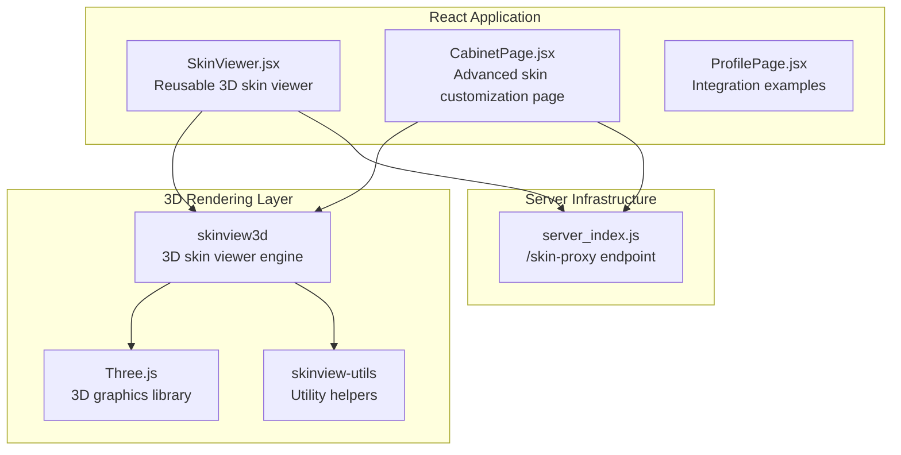
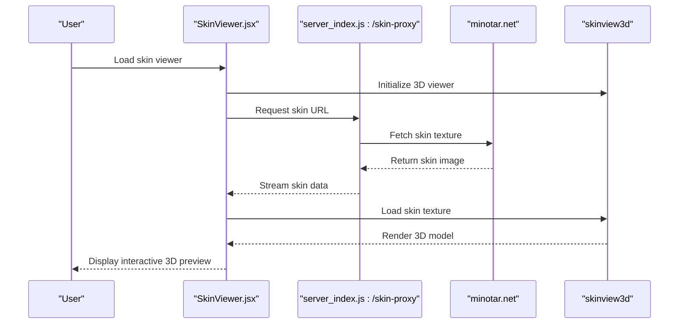
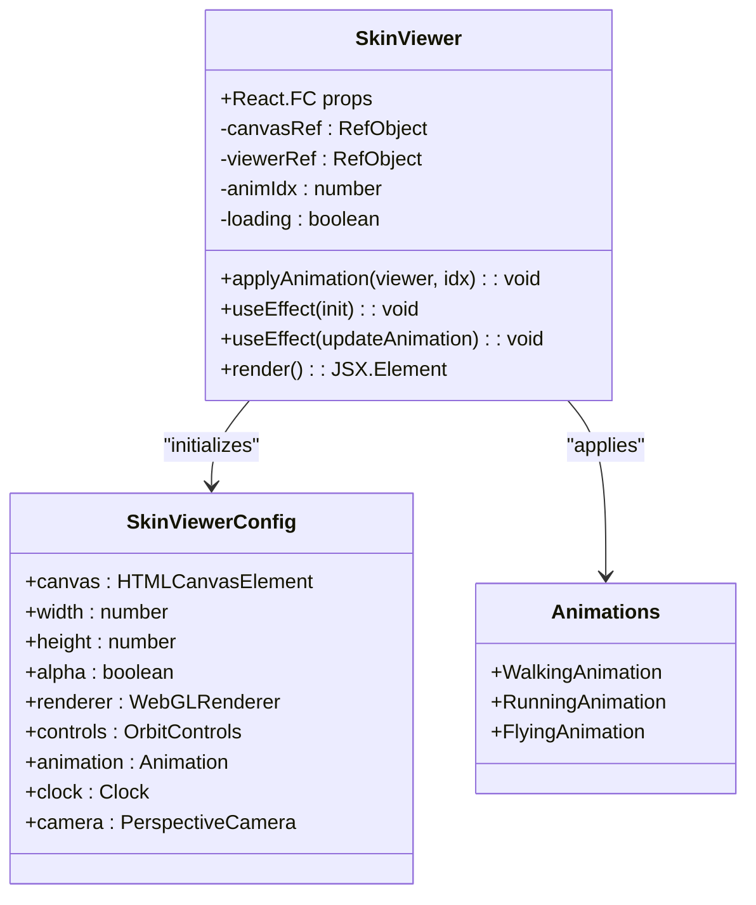
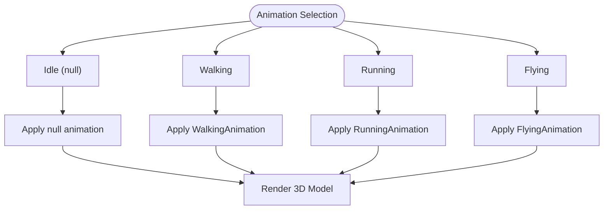
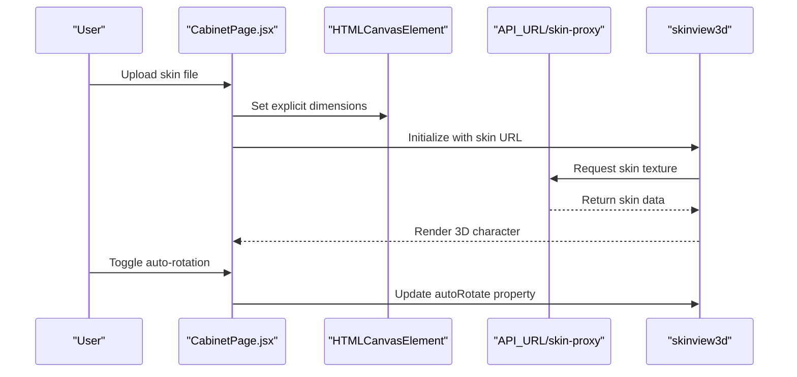
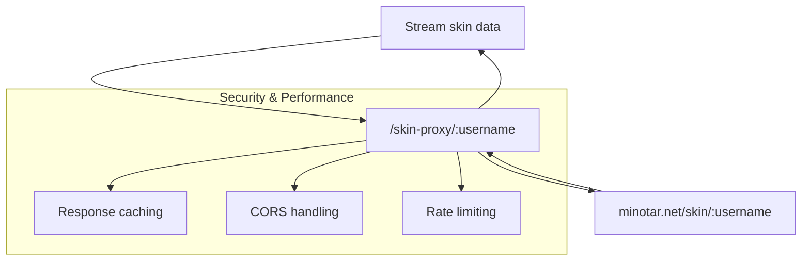
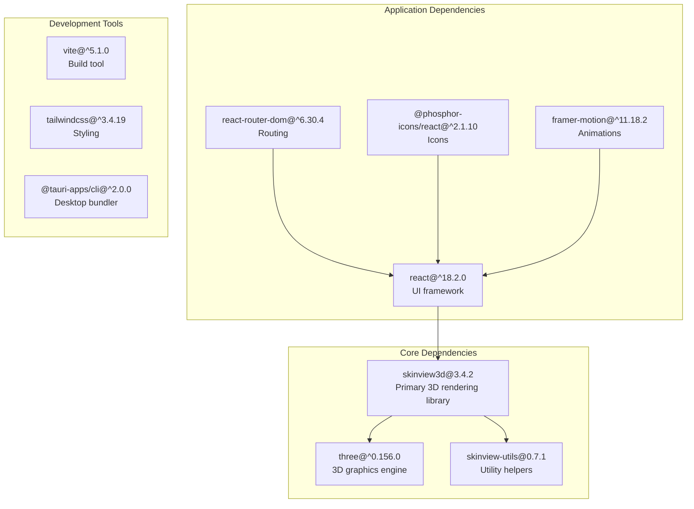

# Skin Viewer Component

<cite>
**Referenced Files in This Document**
- [SkinViewer.jsx](file://src/components/SkinViewer.jsx)
- [CabinetPage.jsx](file://website/src/pages/CabinetPage.jsx)
- [package.json](file://package.json)
- [package-lock.json](file://package-lock.json)
- [server_index.js](file://server_index.js)
- [ProfilePage.jsx](file://src/pages/ProfilePage.jsx)
</cite>

## Table of Contents
1. [Introduction](#introduction)
2. [Project Structure](#project-structure)
3. [Core Components](#core-components)
4. [Architecture Overview](#architecture-overview)
5. [Detailed Component Analysis](#detailed-component-analysis)
6. [Dependency Analysis](#dependency-analysis)
7. [Performance Considerations](#performance-considerations)
8. [Troubleshooting Guide](#troubleshooting-guide)
9. [Conclusion](#conclusion)

## Introduction
This document provides comprehensive technical documentation for the Minecraft skin viewer component used for character customization and preview functionality. The component integrates 3D rendering capabilities through the skinview3d library (built on Three.js) to display player skins with interactive controls, animations, and responsive viewport management. It supports both classic and slim skin formats, offers fallback mechanisms for invalid skin URLs, and includes performance optimizations for smooth rendering across devices.

## Project Structure
The skin viewer functionality spans multiple parts of the project:
- A reusable React component that encapsulates 3D rendering, animation controls, and viewport configuration
- A dedicated page implementation showcasing advanced controls like auto-rotation toggles and custom skin uploads
- Server-side proxy endpoint to handle skin fetching and bypass Content Security Policy restrictions
- Package dependencies specifying the 3D rendering library and related ecosystem packages

**Diagram sources**
- [SkinViewer.jsx:1-144](file://src/components/SkinViewer.jsx#L1-L144)
- [CabinetPage.jsx:1-174](file://website/src/pages/CabinetPage.jsx#L1-L174)
- [package.json:15-28](file://package.json#L15-L28)
- [package-lock.json:4582-4591](file://package-lock.json#L4582-L4591)
- [server_index.js:308-311](file://server_index.js#L308-L311)

**Section sources**
- [SkinViewer.jsx:1-144](file://src/components/SkinViewer.jsx#L1-L144)
- [CabinetPage.jsx:1-174](file://website/src/pages/CabinetPage.jsx#L1-L174)
- [package.json:15-28](file://package.json#L15-L28)
- [package-lock.json:4582-4591](file://package-lock.json#L4582-L4591)
- [server_index.js:308-311](file://server_index.js#L308-L311)

## Core Components
The skin viewer component is implemented as a React functional component that manages:
- Canvas initialization and lifecycle
- Skin texture loading from external or local sources
- Animation state management (idle, walk, run, fly)
- Viewport configuration (camera position, FOV, zoom)
- Interactive controls (rotation, auto-rotation)
- Performance optimizations (render throttling, intersection observer)

Key implementation patterns:
- Uses skinview3d.SkinViewer for 3D rendering and animation
- Implements controlled animation selection via internal state
- Applies performance optimizations to reduce GPU usage
- Provides fallback handling for invalid or inaccessible skin URLs

**Section sources**
- [SkinViewer.jsx:11-92](file://src/components/SkinViewer.jsx#L11-L92)

## Architecture Overview
The skin viewer architecture combines client-side React components with server-side proxy services and 3D rendering libraries:

**Diagram sources**
- [SkinViewer.jsx:24-88](file://src/components/SkinViewer.jsx#L24-L88)
- [server_index.js:308-311](file://server_index.js#L308-L311)

## Detailed Component Analysis

### SkinViewer Component Implementation
The primary skin viewer component provides a compact, reusable interface for displaying Minecraft skins in 3D:

**Diagram sources**
- [SkinViewer.jsx:11-92](file://src/components/SkinViewer.jsx#L11-L92)

Key configuration aspects:
- Canvas sizing: 180x200 pixels with alpha channel enabled
- Camera positioning: FOV 40, zoom 0.9, positioned at (0, 18, 60)
- Controls: Enable rotation, disable zoom, enable auto-rotation at speed 0.7
- Performance: Manual clock control with intersection observer for pause/resume

**Section sources**
- [SkinViewer.jsx:31-44](file://src/components/SkinViewer.jsx#L31-L44)
- [SkinViewer.jsx:66-79](file://src/components/SkinViewer.jsx#L66-L79)

### Animation Control System
The component supports four animation states with intuitive labeling:
- Idle (standing)
- Walking
- Running
- Flying

**Diagram sources**
- [SkinViewer.jsx:4-9](file://src/components/SkinViewer.jsx#L4-L9)
- [SkinViewer.jsx:17-22](file://src/components/SkinViewer.jsx#L17-L22)

**Section sources**
- [SkinViewer.jsx:4-9](file://src/components/SkinViewer.jsx#L4-L9)
- [SkinViewer.jsx:17-22](file://src/components/SkinViewer.jsx#L17-L22)

### Advanced Customization Page
The CabinetPage demonstrates advanced customization features including:
- Auto-rotation toggle control
- Custom skin upload functionality
- Dynamic canvas sizing based on container
- Error handling for failed skin loads

**Diagram sources**
- [CabinetPage.jsx:25-56](file://website/src/pages/CabinetPage.jsx#L25-L56)
- [CabinetPage.jsx:150-173](file://website/src/pages/CabinetPage.jsx#L150-L173)

**Section sources**
- [CabinetPage.jsx:14-56](file://website/src/pages/CabinetPage.jsx#L14-L56)
- [CabinetPage.jsx:150-173](file://website/src/pages/CabinetPage.jsx#L150-L173)

### Server-Side Skin Proxy
The server provides a proxy endpoint to handle skin fetching and bypass CSP restrictions:

**Diagram sources**
- [server_index.js:308-311](file://server_index.js#L308-L311)

**Section sources**
- [server_index.js:308-311](file://server_index.js#L308-L311)

## Dependency Analysis
The skin viewer relies on several key dependencies for 3D rendering and related functionality:

**Diagram sources**
- [package.json:15-28](file://package.json#L15-L28)
- [package-lock.json:4582-4591](file://package-lock.json#L4582-L4591)

**Section sources**
- [package.json:15-28](file://package.json#L15-L28)
- [package-lock.json:4582-4591](file://package-lock.json#L4582-L4591)

## Performance Considerations
The skin viewer implements several performance optimizations to ensure smooth 3D rendering:

### Render Loop Throttling
- Manual clock control prevents automatic animation loop startup
- Global RAF override technique limits rendering to approximately 30fps
- IntersectionObserver pauses rendering when the viewer is off-screen

### Memory Management
- Proper cleanup of Three.js resources via dispose() method
- Canvas element cleanup in useEffect return handlers
- Texture memory management through library internals

### GPU Optimization
- Alpha-enabled rendering with transparent backgrounds
- Reduced FOV (40) and optimized camera positioning
- Disabled zoom controls to minimize computational overhead

**Section sources**
- [SkinViewer.jsx:46-52](file://src/components/SkinViewer.jsx#L46-L52)
- [SkinViewer.jsx:66-79](file://src/components/SkinViewer.jsx#L66-L79)
- [SkinViewer.jsx:82-87](file://src/components/SkinViewer.jsx#L82-L87)

## Troubleshooting Guide

### Common Issues and Solutions

#### Invalid Skin URL Handling
The component includes robust fallback mechanisms:
- Primary URL: `https://minotar.net/skin/{username}`
- Fallback URL: `https://minotar.net/skin/MHF_Steve`
- Automatic fallback on load failure

#### Cross-Origin Resource Sharing (CORS)
- Server-side proxy endpoint handles external skin requests
- Bypasses browser CSP restrictions for skin textures
- Ensures reliable skin loading from external sources

#### Mobile Device Considerations
- Touch-based rotation controls via OrbitControls
- Responsive canvas sizing based on container dimensions
- Performance optimizations suitable for mobile GPUs

#### Export Functionality
While the current implementation focuses on preview functionality, the underlying skinview3d library supports:
- Screenshot capture capabilities
- Texture extraction for custom export workflows
- Integration with external export services

**Section sources**
- [SkinViewer.jsx:54-58](file://src/components/SkinViewer.jsx#L54-L58)
- [server_index.js:308-311](file://server_index.js#L308-L311)

## Conclusion
The skin viewer component provides a comprehensive solution for Minecraft character preview functionality within the SBGames ecosystem. Through careful integration of skinview3d, React, and server-side proxy services, it delivers smooth 3D rendering with robust performance optimizations. The component supports both basic and advanced use cases, from simple profile previews to sophisticated customization interfaces with real-time skin uploads and animation controls.

Key strengths include:
- Modular design enabling reuse across different application contexts
- Comprehensive animation system supporting multiple movement states
- Performance-conscious implementation suitable for production deployment
- Flexible integration patterns accommodating various UI requirements
- Robust error handling and fallback mechanisms ensuring reliability

The implementation demonstrates best practices for 3D web development, including proper resource management, responsive design considerations, and cross-platform compatibility.