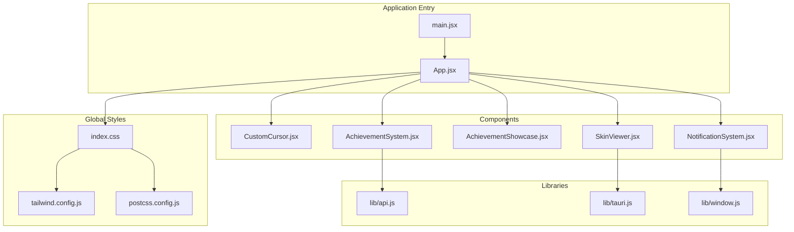
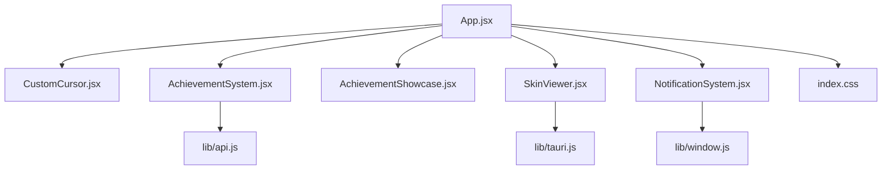
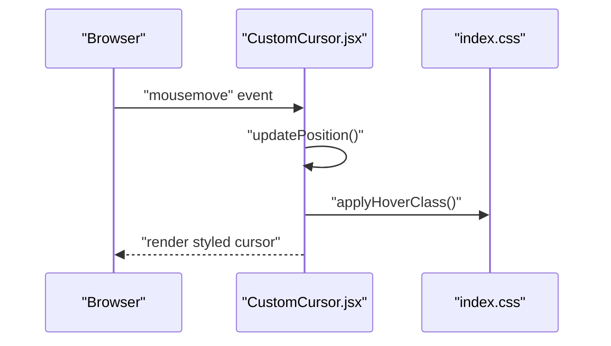
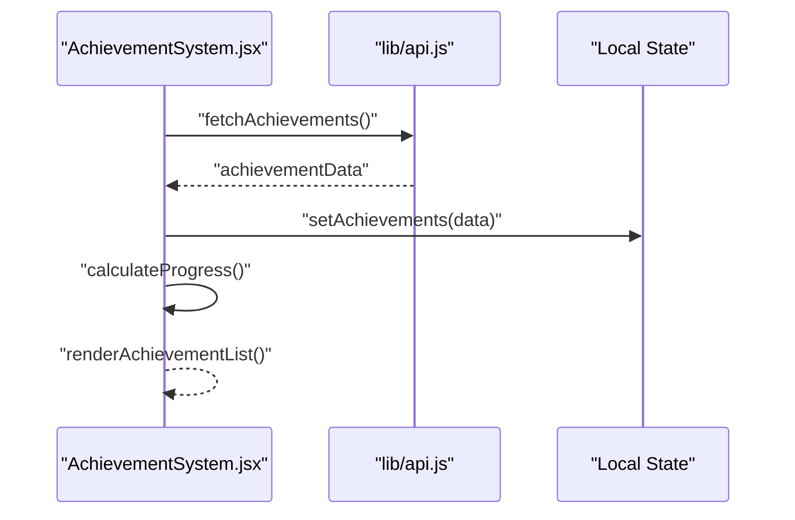
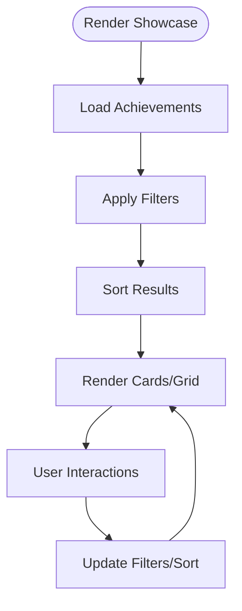
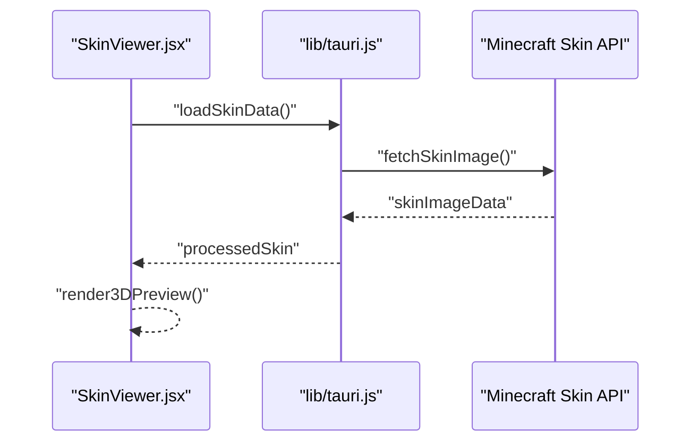
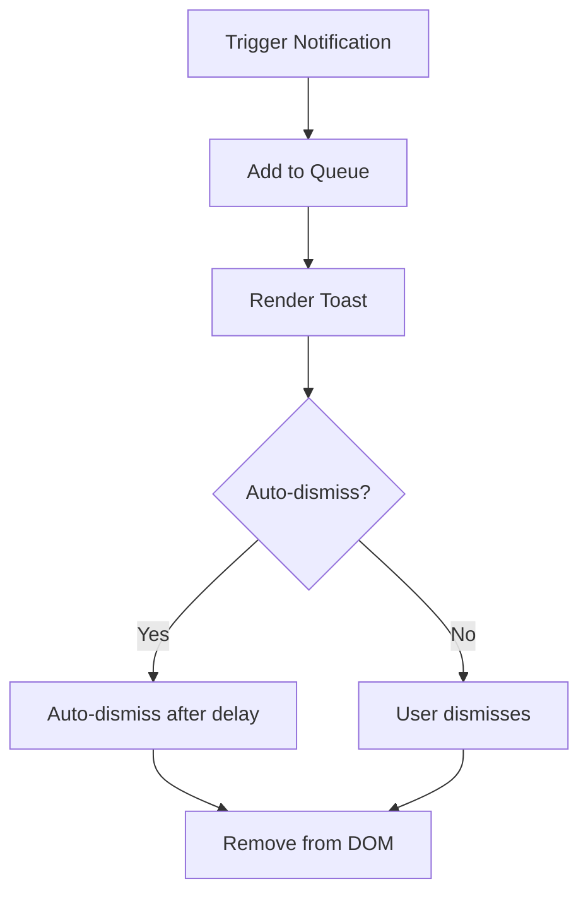

# UI Components & Design System

<cite>
**Referenced Files in This Document**
- [CustomCursor.jsx](file://src/components/CustomCursor.jsx)
- [AchievementSystem.jsx](file://src/components/AchievementSystem.jsx)
- [AchievementShowcase.jsx](file://src/components/AchievementShowcase.jsx)
- [SkinViewer.jsx](file://src/components/SkinViewer.jsx)
- [NotificationSystem.jsx](file://src/components/NotificationSystem.jsx)
- [index.css](file://src/index.css)
- [App.jsx](file://src/App.jsx)
- [main.jsx](file://src/main.jsx)
- [tailwind.config.js](file://tailwind.config.js)
- [postcss.config.js](file://postcss.config.js)
- [api.js](file://src/lib/api.js)
- [tauri.js](file://src/lib/tauri.js)
- [window.js](file://src/lib/window.js)
</cite>

## Table of Contents
1. [Introduction](#introduction)
2. [Project Structure](#project-structure)
3. [Core Components](#core-components)
4. [Architecture Overview](#architecture-overview)
5. [Detailed Component Analysis](#detailed-component-analysis)
6. [Design System](#design-system)
7. [Component Composition Patterns](#component-composition-patterns)
8. [State Management](#state-management)
9. [Accessibility & Compatibility](#accessibility--compatibility)
10. [Development Guidelines](#development-guidelines)
11. [Troubleshooting Guide](#troubleshooting-guide)
12. [Conclusion](#conclusion)

## Introduction
This document provides comprehensive documentation for the React UI component system and design patterns used throughout SBGames. It covers the custom cursor system, achievement system, skin viewer, notification system, design system principles, component composition patterns, state management approaches, accessibility considerations, and development guidelines. The goal is to enable developers to understand, extend, and maintain the UI consistently while delivering enhanced user experiences.

## Project Structure
The UI components are organized under the `src/components` directory, with supporting design system files (`index.css`, `tailwind.config.js`, `postcss.config.js`) and integration libraries (`src/lib`). The main application entry points (`main.jsx`, `App.jsx`) orchestrate component rendering and global styling.

**Diagram sources**
- [main.jsx](file://src/main.jsx)
- [App.jsx](file://src/App.jsx)
- [index.css](file://src/index.css)
- [tailwind.config.js](file://tailwind.config.js)
- [postcss.config.js](file://postcss.config.js)
- [CustomCursor.jsx](file://src/components/CustomCursor.jsx)
- [AchievementSystem.jsx](file://src/components/AchievementSystem.jsx)
- [AchievementShowcase.jsx](file://src/components/AchievementShowcase.jsx)
- [SkinViewer.jsx](file://src/components/SkinViewer.jsx)
- [NotificationSystem.jsx](file://src/components/NotificationSystem.jsx)
- [api.js](file://src/lib/api.js)
- [tauri.js](file://src/lib/tauri.js)
- [window.js](file://src/lib/window.js)

**Section sources**
- [main.jsx](file://src/main.jsx)
- [App.jsx](file://src/App.jsx)
- [index.css](file://src/index.css)
- [tailwind.config.js](file://tailwind.config.js)
- [postcss.config.js](file://postcss.config.js)

## Core Components
This section introduces the primary UI components and their roles:
- CustomCursor: Provides a stylized mouse cursor with hover effects and animations.
- AchievementSystem: Manages achievement data, progress tracking, and display logic.
- AchievementShowcase: Renders a gallery or list of achievements with filtering and sorting.
- SkinViewer: Visualizes Minecraft character skins with customizable previews.
- NotificationSystem: Handles real-time alerts, system messages, and user feedback notifications.

Each component follows React functional patterns with hooks for state and effects, and integrates with global design systems and libraries for consistent behavior.

**Section sources**
- [CustomCursor.jsx](file://src/components/CustomCursor.jsx)
- [AchievementSystem.jsx](file://src/components/AchievementSystem.jsx)
- [AchievementShowcase.jsx](file://src/components/AchievementShowcase.jsx)
- [SkinViewer.jsx](file://src/components/SkinViewer.jsx)
- [NotificationSystem.jsx](file://src/components/NotificationSystem.jsx)

## Architecture Overview
The UI architecture centers on the main application shell (`App.jsx`) that renders global components and page layouts. Global styles are applied via `index.css`, configured through Tailwind CSS and PostCSS. Components communicate with external systems through libraries:
- API integration for achievement and profile data
- Tauri bindings for native window and system interactions
- Window utilities for cross-platform UI behaviors

**Diagram sources**
- [App.jsx](file://src/App.jsx)
- [CustomCursor.jsx](file://src/components/CustomCursor.jsx)
- [AchievementSystem.jsx](file://src/components/AchievementSystem.jsx)
- [AchievementShowcase.jsx](file://src/components/AchievementShowcase.jsx)
- [SkinViewer.jsx](file://src/components/SkinViewer.jsx)
- [NotificationSystem.jsx](file://src/components/NotificationSystem.jsx)
- [index.css](file://src/index.css)
- [api.js](file://src/lib/api.js)
- [tauri.js](file://src/lib/tauri.js)
- [window.js](file://src/lib/window.js)

## Detailed Component Analysis

### Custom Cursor System
The custom cursor enhances user experience by replacing the default pointer with a styled element that responds to hover states and movement. It integrates with the global styles and is rendered at the application root level.

Key behaviors:
- Mouse tracking for position updates
- Hover detection for interactive elements
- Smooth transitions and visual feedback
- Cross-browser compatibility considerations

**Diagram sources**
- [CustomCursor.jsx](file://src/components/CustomCursor.jsx)
- [index.css](file://src/index.css)

**Section sources**
- [CustomCursor.jsx](file://src/components/CustomCursor.jsx)
- [index.css](file://src/index.css)

### Achievement System
The achievement system manages achievement data, progress tracking, and display. It fetches data from the API, maintains local state, and renders both detailed views and showcases.

Core responsibilities:
- Fetching and caching achievement metadata
- Tracking user progress and completion states
- Rendering progress bars, badges, and unlock animations
- Filtering and sorting achievements for display

**Diagram sources**
- [AchievementSystem.jsx](file://src/components/AchievementSystem.jsx)
- [api.js](file://src/lib/api.js)

**Section sources**
- [AchievementSystem.jsx](file://src/components/AchievementSystem.jsx)
- [api.js](file://src/lib/api.js)

### Achievement Showcase
The showcase component presents achievements in a gallery or list format with optional filtering and sorting. It consumes data from the achievement system and provides interactive controls for user engagement.

Features:
- Grid/list toggle modes
- Category and status filters
- Sorting by date, progress, or name
- Responsive layout adjustments

**Diagram sources**
- [AchievementShowcase.jsx](file://src/components/AchievementShowcase.jsx)
- [AchievementSystem.jsx](file://src/components/AchievementSystem.jsx)

**Section sources**
- [AchievementShowcase.jsx](file://src/components/AchievementShowcase.jsx)
- [AchievementSystem.jsx](file://src/components/AchievementSystem.jsx)

### Skin Viewer
The skin viewer component renders Minecraft character skins with preview functionality. It integrates with Tauri for native interactions and supports customization options such as pose selection and background themes.

Capabilities:
- Skin image loading and display
- Pose and animation controls
- Background and lighting adjustments
- Responsive scaling and aspect ratios

**Diagram sources**
- [SkinViewer.jsx](file://src/components/SkinViewer.jsx)
- [tauri.js](file://src/lib/tauri.js)

**Section sources**
- [SkinViewer.jsx](file://src/components/SkinViewer.jsx)
- [tauri.js](file://src/lib/tauri.js)

### Notification System
The notification system handles real-time alerts, system messages, and user feedback. It manages queues, timing, and dismissal behaviors while integrating with window utilities for cross-platform support.

Functions:
- Message queuing and prioritization
- Auto-dismiss timers and manual dismissal
- Toast-style overlays with animations
- Accessibility-compliant announcements

**Diagram sources**
- [NotificationSystem.jsx](file://src/components/NotificationSystem.jsx)
- [window.js](file://src/lib/window.js)

**Section sources**
- [NotificationSystem.jsx](file://src/components/NotificationSystem.jsx)
- [window.js](file://src/lib/window.js)

## Design System
The design system is built on Tailwind CSS with custom configurations and global styles. It defines color palettes, typography scales, spacing units, and responsive breakpoints to ensure consistency across components.

Color scheme:
- Primary palette for branding and accents
- Neutral tones for backgrounds and surfaces
- Status colors for success, warning, and error states
- Accessibility-compliant contrast ratios

Typography:
- Hierarchical font stacks for headings and body text
- Line heights optimized for readability
- Responsive font sizing for various screen sizes

Spacing and layout:
- Consistent margin and padding scales
- Grid and flex utilities for responsive layouts
- Max-width constraints for optimal reading widths

Responsive design:
- Mobile-first breakpoints
- Flexible grid systems
- Adaptive component sizing

**Section sources**
- [index.css](file://src/index.css)
- [tailwind.config.js](file://tailwind.config.js)
- [postcss.config.js](file://postcss.config.js)

## Component Composition Patterns
Components follow consistent composition patterns:
- Props-driven rendering with strict interfaces
- Controlled and uncontrolled component hybrids
- Higher-order components for cross-cutting concerns (e.g., notifications)
- Render props and children composition for flexible layouts
- Context providers for shared state (e.g., theme, locale)

State management:
- Local component state for UI interactions
- Shared state via React Context for theme and preferences
- Persistent storage for user preferences and progress
- Event-driven updates with debounced handlers for performance

Integration patterns:
- API clients encapsulated in dedicated modules
- Platform-specific integrations via Tauri
- Utility libraries for window and system interactions

**Section sources**
- [AchievementSystem.jsx](file://src/components/AchievementSystem.jsx)
- [NotificationSystem.jsx](file://src/components/NotificationSystem.jsx)
- [api.js](file://src/lib/api.js)
- [tauri.js](file://src/lib/tauri.js)
- [window.js](file://src/lib/window.js)

## State Management
State management across the UI system employs a hybrid approach:
- React hooks for local component state
- Context for global preferences and theme
- Local storage for persistence of user settings
- Event-driven updates for real-time components (notifications)

Patterns:
- Centralized configuration via context providers
- Decoupled state updates through action creators
- Memoization for expensive computations
- Effect cleanup to prevent memory leaks

**Section sources**
- [AchievementSystem.jsx](file://src/components/AchievementSystem.jsx)
- [NotificationSystem.jsx](file://src/components/NotificationSystem.jsx)
- [App.jsx](file://src/App.jsx)

## Accessibility & Compatibility
Accessibility considerations:
- Semantic HTML and ARIA attributes for interactive elements
- Keyboard navigation support for all controls
- Screen reader compatibility for dynamic content
- Focus management and visible focus indicators
- Color contrast compliance across themes

Cross-browser compatibility:
- Polyfills for modern JavaScript APIs where necessary
- CSS fallbacks for advanced layout features
- Feature detection for graceful degradation
- Testing across supported browsers and devices

Performance:
- Lazy loading for heavy components (e.g., 3D skin viewer)
- Virtualization for long lists (achievements, notifications)
- Debouncing and throttling for frequent events
- Efficient re-renders with memoization

**Section sources**
- [CustomCursor.jsx](file://src/components/CustomCursor.jsx)
- [AchievementSystem.jsx](file://src/components/AchievementSystem.jsx)
- [SkinViewer.jsx](file://src/components/SkinViewer.jsx)
- [NotificationSystem.jsx](file://src/components/NotificationSystem.jsx)

## Development Guidelines
Guidelines for creating new components:
- Follow established naming and file organization conventions
- Define clear prop interfaces with defaults and validation
- Use consistent styling via Tailwind utilities and custom CSS
- Implement proper accessibility attributes and keyboard support
- Write component tests covering key interactions and edge cases
- Document component usage, props, and customization options

Best practices:
- Keep components single-purpose and reusable
- Prefer composition over inheritance
- Use TypeScript interfaces for type safety (recommended)
- Optimize for performance with memoization and lazy loading
- Maintain backward compatibility when updating existing components

**Section sources**
- [index.css](file://src/index.css)
- [tailwind.config.js](file://tailwind.config.js)

## Troubleshooting Guide
Common issues and resolutions:
- Cursor not responding: Verify event listeners and z-index stacking
- Achievements not loading: Check API connectivity and error boundaries
- Skin viewer errors: Confirm Tauri permissions and image URLs
- Notifications not appearing: Review queue logic and window integration
- Style inconsistencies: Validate Tailwind configuration and CSS overrides

Debugging tips:
- Use React DevTools to inspect component props and state
- Enable browser developer tools to monitor network requests
- Check console logs for runtime errors and warnings
- Validate accessibility attributes with automated testing tools

**Section sources**
- [CustomCursor.jsx](file://src/components/CustomCursor.jsx)
- [AchievementSystem.jsx](file://src/components/AchievementSystem.jsx)
- [SkinViewer.jsx](file://src/components/SkinViewer.jsx)
- [NotificationSystem.jsx](file://src/components/NotificationSystem.jsx)
- [api.js](file://src/lib/api.js)
- [tauri.js](file://src/lib/tauri.js)
- [window.js](file://src/lib/window.js)

## Conclusion
The SBGames UI component system combines modern React patterns with a robust design system to deliver a cohesive and accessible user experience. The custom cursor, achievement system, skin viewer, and notification system exemplify thoughtful component design, state management, and integration with platform-specific capabilities. By following the documented patterns, guidelines, and best practices, developers can extend the system while maintaining design consistency and performance across diverse environments.