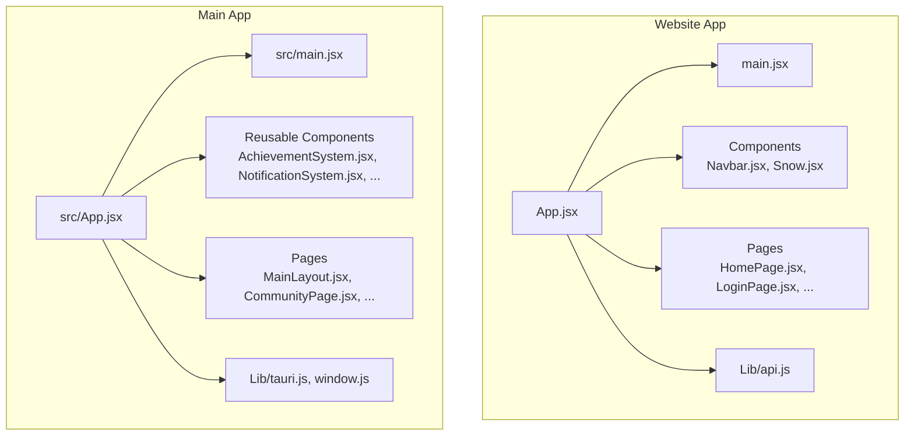
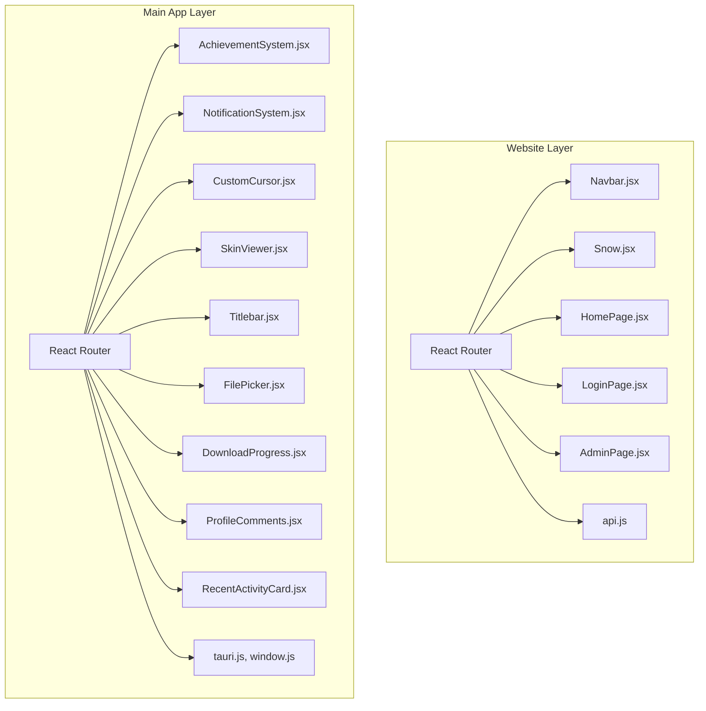
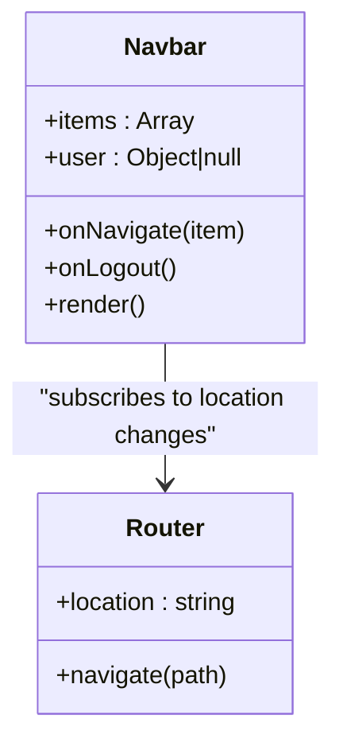
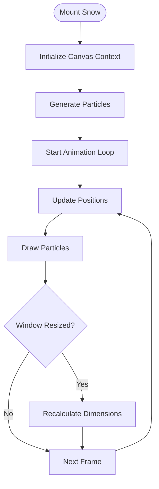
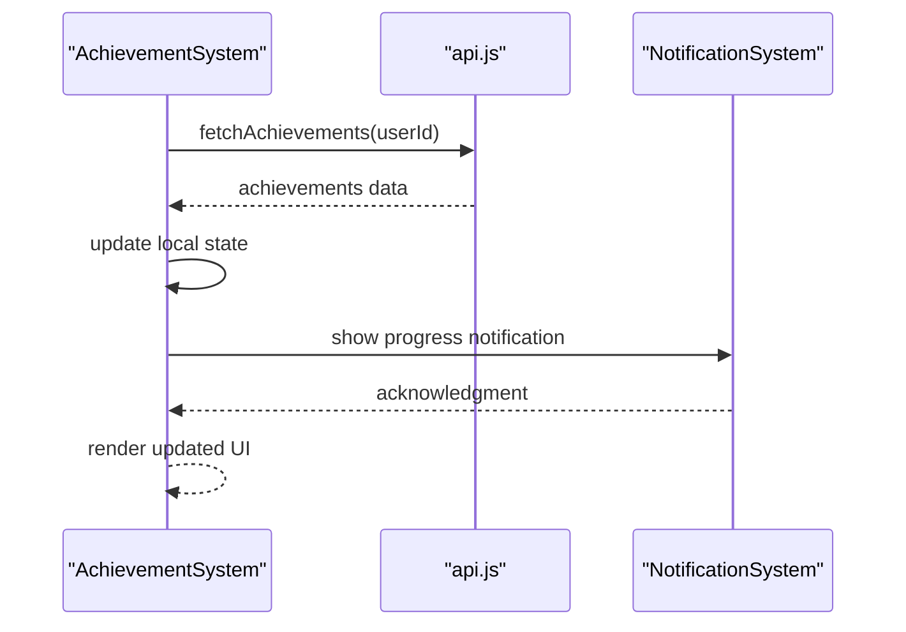
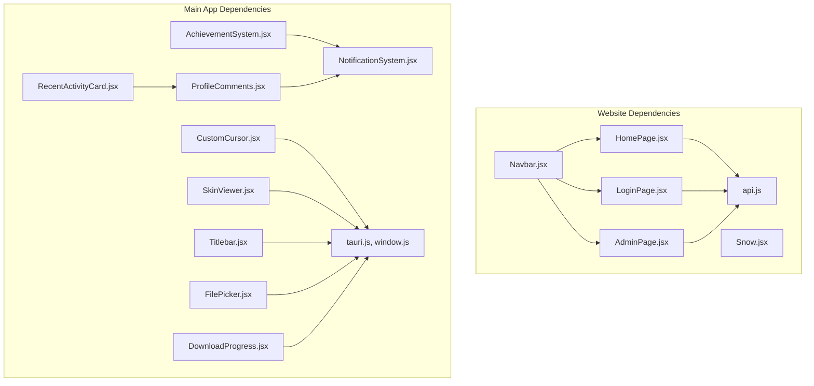

# Component Structure & State Management

<cite>
**Referenced Files in This Document**
- [Navbar.jsx](file://website/src/components/Navbar.jsx)
- [Snow.jsx](file://website/src/components/Snow.jsx)
- [api.js](file://website/src/lib/api.js)
- [App.jsx](file://website/src/App.jsx)
- [main.jsx](file://website/src/main.jsx)
- [HomePage.jsx](file://website/src/pages/HomePage.jsx)
- [LoginPage.jsx](file://website/src/pages/LoginPage.jsx)
- [AdminPage.jsx](file://website/src/pages/AdminPage.jsx)
- [CabinetPage.jsx](file://website/src/pages/CabinetPage.jsx)
- [DownloadPage.jsx](file://website/src/pages/DownloadPage.jsx)
- [HowToPlayPage.jsx](file://website/src/pages/HowToPlayPage.jsx)
- [RulesPage.jsx](file://website/src/pages/RulesPage.jsx)
- [SupportPage.jsx](file://website/src/pages/SupportPage.jsx)
- [TopupPage.jsx](file://website/src/pages/TopupPage.jsx)
- [AchievementSystem.jsx](file://src/components/AchievementSystem.jsx)
- [AchievementShowcase.jsx](file://src/components/AchievementShowcase.jsx)
- [NotificationSystem.jsx](file://src/components/NotificationSystem.jsx)
- [CustomCursor.jsx](file://src/components/CustomCursor.jsx)
- [SkinViewer.jsx](file://src/components/SkinViewer.jsx)
- [Titlebar.jsx](file://src/components/Titlebar.jsx)
- [FilePicker.jsx](file://src/components/FilePicker.jsx)
- [DownloadProgress.jsx](file://src/components/DownloadProgress.jsx)
- [ProfileComments.jsx](file://src/components/ProfileComments.jsx)
- [RecentActivityCard.jsx](file://src/components/RecentActivityCard.jsx)
- [MainLayout.jsx](file://src/pages/MainLayout.jsx)
- [CommunityPage.jsx](file://src/pages/CommunityPage.jsx)
- [LeaderboardPage.jsx](file://src/pages/LeaderboardPage.jsx)
- [LibraryTab.jsx](file://src/pages/LibraryTab.jsx)
- [InventoryTab.jsx](file://src/pages/InventoryTab.jsx)
- [PlayPage.jsx](file://src/pages/PlayPage.jsx)
- [TrayPopup.jsx](file://src/pages/TrayPopup.jsx)
- [tauri.js](file://src/lib/tauri.js)
- [window.js](file://src/lib/window.js)
</cite>

## Table of Contents
1. [Introduction](#introduction)
2. [Project Structure](#project-structure)
3. [Core Components](#core-components)
4. [Architecture Overview](#architecture-overview)
5. [Detailed Component Analysis](#detailed-component-analysis)
6. [Dependency Analysis](#dependency-analysis)
7. [Performance Considerations](#performance-considerations)
8. [Troubleshooting Guide](#troubleshooting-guide)
9. [Conclusion](#conclusion)

## Introduction
This document provides comprehensive documentation for the website platform's component structure and state management. It focuses on reusable components such as Navbar and Snow effects, utility components, React hooks-based state management patterns, API integration and data fetching strategies, component props and events, lifecycle management, component composition and reusability patterns, the relationship between components and application state, and testing strategies and development patterns used across the platform.

## Project Structure
The website platform is organized into two primary application contexts:
- Website application under website/: Contains frontend components, pages, and API utilities for the public-facing website.
- Main application under src/: Contains the core game client application with additional components, pages, and Tauri integrations.

Key structural elements:
- Components: Reusable UI elements (e.g., Navbar, Snow, AchievementSystem).
- Pages: Route-specific page components (e.g., HomePage, LoginPage, AdminPage).
- Lib: API utilities and cross-platform integrations (e.g., api.js, tauri.js, window.js).
- App and entry points: Application bootstrap and routing orchestration.

**Diagram sources**
- [App.jsx](file://website/src/App.jsx)
- [main.jsx](file://website/src/main.jsx)
- [Navbar.jsx](file://website/src/components/Navbar.jsx)
- [Snow.jsx](file://website/src/components/Snow.jsx)
- [api.js](file://website/src/lib/api.js)
- [AchievementSystem.jsx](file://src/components/AchievementSystem.jsx)
- [NotificationSystem.jsx](file://src/components/NotificationSystem.jsx)
- [MainLayout.jsx](file://src/pages/MainLayout.jsx)
- [tauri.js](file://src/lib/tauri.js)
- [window.js](file://src/lib/window.js)

**Section sources**
- [App.jsx](file://website/src/App.jsx)
- [main.jsx](file://website/src/main.jsx)

## Core Components
This section documents the core reusable components and their roles in the platform.

- Navbar (website): Provides navigation links and user interaction elements for the public website.
- Snow (website): Implements a decorative snow effect using canvas animation.
- AchievementSystem (main app): Manages achievement-related state and UI updates.
- NotificationSystem (main app): Centralized notifications handling for the game client.
- CustomCursor (main app): Custom cursor rendering for immersive UI experiences.
- SkinViewer (main app): Renders player skin previews.
- Titlebar (main app): Cross-platform title bar controls.
- FilePicker (main app): File selection interface for configuration and data operations.
- DownloadProgress (main app): Progress tracking for downloads.
- ProfileComments (main app): Displays user comments and interactions.
- RecentActivityCard (main app): Shows recent user activity cards.

Props and Events:
- Navbar: Accepts navigation items and handles click events for route transitions.
- Snow: Accepts configuration props for particle count, speed, and size; triggers resize events.
- AchievementSystem: Receives achievement data and emits update events.
- NotificationSystem: Accepts notification messages and severity levels; supports dismissal callbacks.
- CustomCursor: Accepts cursor shape and hover state; emits pointer events.
- SkinViewer: Accepts skin URL and model options; triggers on skin load/error.
- Titlebar: Accepts minimize/maximize/close handlers; emits window control events.
- FilePicker: Accepts file filters and selection callbacks; emits selected file paths.
- DownloadProgress: Accepts total bytes and downloaded bytes; emits progress updates.
- ProfileComments: Accepts comment data and user permissions; triggers reply/comment actions.
- RecentActivityCard: Accepts activity data and action handlers; emits open/details actions.

Lifecycle Management:
- Mounting: Initialize state, attach event listeners, and set up timers or intervals.
- Updating: Apply prop-driven changes, update DOM/canvas elements, and synchronize external state.
- Unmounting: Clean up timers, remove event listeners, and release resources.

**Section sources**
- [Navbar.jsx](file://website/src/components/Navbar.jsx)
- [Snow.jsx](file://website/src/components/Snow.jsx)
- [AchievementSystem.jsx](file://src/components/AchievementSystem.jsx)
- [NotificationSystem.jsx](file://src/components/NotificationSystem.jsx)
- [CustomCursor.jsx](file://src/components/CustomCursor.jsx)
- [SkinViewer.jsx](file://src/components/SkinViewer.jsx)
- [Titlebar.jsx](file://src/components/Titlebar.jsx)
- [FilePicker.jsx](file://src/components/FilePicker.jsx)
- [DownloadProgress.jsx](file://src/components/DownloadProgress.jsx)
- [ProfileComments.jsx](file://src/components/ProfileComments.jsx)
- [RecentActivityCard.jsx](file://src/components/RecentActivityCard.jsx)

## Architecture Overview
The platform employs a dual-application architecture:
- Website application: Public-facing frontend with React components, routing, and API utilities.
- Main application: Game client with advanced UI components, state management, and Tauri integrations.

**Diagram sources**
- [Navbar.jsx](file://website/src/components/Navbar.jsx)
- [Snow.jsx](file://website/src/components/Snow.jsx)
- [HomePage.jsx](file://website/src/pages/HomePage.jsx)
- [LoginPage.jsx](file://website/src/pages/LoginPage.jsx)
- [AdminPage.jsx](file://website/src/pages/AdminPage.jsx)
- [api.js](file://website/src/lib/api.js)
- [AchievementSystem.jsx](file://src/components/AchievementSystem.jsx)
- [NotificationSystem.jsx](file://src/components/NotificationSystem.jsx)
- [CustomCursor.jsx](file://src/components/CustomCursor.jsx)
- [SkinViewer.jsx](file://src/components/SkinViewer.jsx)
- [Titlebar.jsx](file://src/components/Titlebar.jsx)
- [FilePicker.jsx](file://src/components/FilePicker.jsx)
- [DownloadProgress.jsx](file://src/components/DownloadProgress.jsx)
- [ProfileComments.jsx](file://src/components/ProfileComments.jsx)
- [RecentActivityCard.jsx](file://src/components/RecentActivityCard.jsx)
- [tauri.js](file://src/lib/tauri.js)
- [window.js](file://src/lib/window.js)

## Detailed Component Analysis

### Navbar Component
The Navbar component provides navigation and user interaction for the website. It manages:
- Navigation state and active routes.
- User session state (login/logout).
- Responsive behavior and accessibility.

State management patterns:
- React hooks: useState for active route and menu visibility; useEffect for route synchronization and cleanup.
- Context propagation: Passes navigation callbacks to child components.

Props:
- items: Array of navigation items with label and href.
- onNavigate: Callback invoked on item click.
- user: Current user object or null.
- onLogout: Logout handler callback.

Events:
- onClick for navigation items.
- onLogout triggered by logout button.

Lifecycle:
- Mount: Initialize active route from location, attach scroll listener for responsive behavior.
- Update: Sync active route with router changes.
- Unmount: Remove event listeners.

**Diagram sources**
- [Navbar.jsx](file://website/src/components/Navbar.jsx)

**Section sources**
- [Navbar.jsx](file://website/src/components/Navbar.jsx)

### Snow Component
The Snow component renders a dynamic snowfall effect using HTML5 Canvas. It manages:
- Particle generation and animation loop.
- Window resize handling.
- Performance optimization via requestAnimationFrame.

State management patterns:
- React hooks: useRef for canvas element and animation frame; useState for particle array; useEffect for animation loop and cleanup.

Props:
- particleCount: Number of snowflakes.
- speed: Animation speed multiplier.
- size: Base size of snowflakes.
- wind: Horizontal drift factor.

Events:
- onResize: Triggered on window resize to recalculate canvas and particles.

Lifecycle:
- Mount: Create canvas context, initialize particles, start animation loop.
- Update: Recalculate particle positions and redraw on prop changes.
- Unmount: Cancel animation frame and clear canvas.

**Diagram sources**
- [Snow.jsx](file://website/src/components/Snow.jsx)

**Section sources**
- [Snow.jsx](file://website/src/components/Snow.jsx)

### AchievementSystem Component
The AchievementSystem component manages achievement-related state and UI updates. It integrates with:
- Local state for achievements and progress.
- API layer for fetching and updating achievement data.
- NotificationSystem for user feedback.

State management patterns:
- React hooks: useState for achievements and loading state; useEffect for data fetching and subscription; useCallback for event handlers.

Props:
- userId: Identifier for the user whose achievements are managed.
- onProgressChange: Callback invoked on achievement progress updates.

Events:
- onUnlock: Emitted when an achievement is unlocked.
- onProgressChange: Emitted when progress updates.

Lifecycle:
- Mount: Fetch initial achievements, subscribe to real-time updates.
- Update: Apply progress changes and trigger notifications.
- Unmount: Cancel subscriptions and clear timers.

**Diagram sources**
- [AchievementSystem.jsx](file://src/components/AchievementSystem.jsx)
- [api.js](file://website/src/lib/api.js)
- [NotificationSystem.jsx](file://src/components/NotificationSystem.jsx)

**Section sources**
- [AchievementSystem.jsx](file://src/components/AchievementSystem.jsx)

### NotificationSystem Component
The NotificationSystem component centralizes notification handling across the application. It manages:
- Queuing and rendering notifications.
- Severity levels and auto-dismiss timers.
- User interactions (dismiss, action buttons).

State management patterns:
- React hooks: useState for notification queue; useEffect for timer management; useCallback for handlers.

Props:
- notifications: Initial notification array.
- onDismiss(id): Callback invoked when a notification is dismissed.

Events:
- onDismiss: Emitted when a notification is removed.
- onAction: Emitted when an action button is clicked.

Lifecycle:
- Mount: Initialize queue from props, start timers.
- Update: Add/remove notifications, manage timers.
- Unmount: Clear timers and pending notifications.

**Section sources**
- [NotificationSystem.jsx](file://src/components/NotificationSystem.jsx)

### CustomCursor Component
The CustomCursor component renders a custom cursor for immersive UI experiences. It manages:
- Cursor position tracking.
- Shape and state changes based on interactions.
- Pointer event delegation.

State management patterns:
- React hooks: useState for cursor shape and hover state; useEffect for mouse move and hover handlers.

Props:
- shape: Cursor shape variant.
- onPointerMove: Mouse move handler.
- onHover: Hover state change handler.

Events:
- onPointerMove: Emitted on mouse movement.
- onHover: Emitted when hovering over interactive elements.

Lifecycle:
- Mount: Attach mousemove and hover listeners.
- Update: Adjust cursor visuals based on state.
- Unmount: Detach listeners.

**Section sources**
- [CustomCursor.jsx](file://src/components/CustomCursor.jsx)

### SkinViewer Component
The SkinViewer component renders player skin previews. It manages:
- Skin image loading and caching.
- Model rendering and animation.
- Error handling for missing or invalid skins.

State management patterns:
- React hooks: useState for skin URL and loading state; useEffect for image loading and error handling.

Props:
- skinUrl: URL to the skin texture.
- modelOptions: Rendering options (size, animation, etc.).

Events:
- onLoad: Emitted when skin loads successfully.
- onError: Emitted when skin fails to load.

Lifecycle:
- Mount: Start loading skin image.
- Update: Re-render with new skin URL or options.
- Unmount: Cancel loading if still in progress.

**Section sources**
- [SkinViewer.jsx](file://src/components/SkinViewer.jsx)

### Titlebar Component
The Titlebar component provides cross-platform window controls. It manages:
- Minimize, maximize/restore, and close actions.
- Drag area for window movement.

State management patterns:
- React hooks: useState for window state; useEffect for drag and keyboard handlers.

Props:
- onMinimize: Minimize handler.
- onMaximize: Maximize/restore handler.
- onClose: Close handler.

Events:
- onMinimize: Emitted when minimize is triggered.
- onMaximize: Emitted when maximize/restore is triggered.
- onClose: Emitted when close is triggered.

Lifecycle:
- Mount: Attach drag and keyboard listeners.
- Update: Reflect window state changes.
- Unmount: Detach listeners.

**Section sources**
- [Titlebar.jsx](file://src/components/Titlebar.jsx)

### FilePicker Component
The FilePicker component provides a file selection interface. It manages:
- File filter configuration.
- Selection callbacks and validation.
- Multi-selection support.

State management patterns:
- React hooks: useState for selected files; useEffect for filter application.

Props:
- filters: File type filters.
- onSelect: Selection callback.
- multiple: Allow multiple file selection.

Events:
- onSelect: Emitted with selected file paths.
- onCancel: Emitted when selection is canceled.

Lifecycle:
- Mount: Initialize file input element.
- Update: Apply new filters or selection state.
- Unmount: Release input element.

**Section sources**
- [FilePicker.jsx](file://src/components/FilePicker.jsx)

### DownloadProgress Component
The DownloadProgress component tracks download progress. It manages:
- Bytes downloaded and total bytes.
- Progress percentage calculation.
- Completion and error states.

State management patterns:
- React hooks: useState for progress and status; useEffect for progress updates.

Props:
- totalBytes: Total size of the download.
- downloadedBytes: Bytes already downloaded.
- onComplete: Completion callback.

Events:
- onProgress: Emitted with current progress percentage.
- onComplete: Emitted when download finishes.
- onError: Emitted on download failure.

Lifecycle:
- Mount: Initialize progress state.
- Update: Recalculate progress and emit updates.
- Unmount: Clear progress timers.

**Section sources**
- [DownloadProgress.jsx](file://src/components/DownloadProgress.jsx)

### ProfileComments Component
The ProfileComments component displays user comments and interactions. It manages:
- Comment data loading and pagination.
- Reply and moderation actions.
- User permission checks.

State management patterns:
- React hooks: useState for comments and loading state; useEffect for data fetching.

Props:
- profileId: Profile identifier for comments.
- userPermissions: User permissions for moderation actions.

Events:
- onReply: Emitted when a reply is posted.
- onModerate: Emitted when a moderation action is performed.

Lifecycle:
- Mount: Fetch initial comments.
- Update: Refresh comments after actions.
- Unmount: Cancel pending requests.

**Section sources**
- [ProfileComments.jsx](file://src/components/ProfileComments.jsx)

### RecentActivityCard Component
The RecentActivityCard component shows recent user activity cards. It manages:
- Activity data rendering.
- Action handlers for opening details or taking actions.
- Loading and empty states.

State management patterns:
- React hooks: useState for activity data and loading state; useEffect for data refresh.

Props:
- activity: Activity data object.
- onAction: Action handler callback.

Events:
- onOpenDetails: Emitted when details are opened.
- onAction: Emitted when an action is taken.

Lifecycle:
- Mount: Initialize with provided activity data.
- Update: Replace data and re-render.
- Unmount: Clear timers and listeners.

**Section sources**
- [RecentActivityCard.jsx](file://src/components/RecentActivityCard.jsx)

## Dependency Analysis
This section analyzes dependencies between components and their relationships to the overall application state.

**Diagram sources**
- [Navbar.jsx](file://website/src/components/Navbar.jsx)
- [Snow.jsx](file://website/src/components/Snow.jsx)
- [HomePage.jsx](file://website/src/pages/HomePage.jsx)
- [LoginPage.jsx](file://website/src/pages/LoginPage.jsx)
- [AdminPage.jsx](file://website/src/pages/AdminPage.jsx)
- [api.js](file://website/src/lib/api.js)
- [AchievementSystem.jsx](file://src/components/AchievementSystem.jsx)
- [NotificationSystem.jsx](file://src/components/NotificationSystem.jsx)
- [CustomCursor.jsx](file://src/components/CustomCursor.jsx)
- [SkinViewer.jsx](file://src/components/SkinViewer.jsx)
- [Titlebar.jsx](file://src/components/Titlebar.jsx)
- [FilePicker.jsx](file://src/components/FilePicker.jsx)
- [DownloadProgress.jsx](file://src/components/DownloadProgress.jsx)
- [ProfileComments.jsx](file://src/components/ProfileComments.jsx)
- [RecentActivityCard.jsx](file://src/components/RecentActivityCard.jsx)
- [tauri.js](file://src/lib/tauri.js)
- [window.js](file://src/lib/window.js)

**Section sources**
- [AchievementSystem.jsx](file://src/components/AchievementSystem.jsx)
- [NotificationSystem.jsx](file://src/components/NotificationSystem.jsx)
- [CustomCursor.jsx](file://src/components/CustomCursor.jsx)
- [SkinViewer.jsx](file://src/components/SkinViewer.jsx)
- [Titlebar.jsx](file://src/components/Titlebar.jsx)
- [FilePicker.jsx](file://src/components/FilePicker.jsx)
- [DownloadProgress.jsx](file://src/components/DownloadProgress.jsx)
- [ProfileComments.jsx](file://src/components/ProfileComments.jsx)
- [RecentActivityCard.jsx](file://src/components/RecentActivityCard.jsx)

## Performance Considerations
- Canvas optimization: Use requestAnimationFrame in Snow component to optimize rendering performance and reduce CPU usage.
- State updates: Batch state updates in AchievementSystem and NotificationSystem to minimize re-renders.
- Lazy loading: Defer non-critical component initialization until after initial render.
- Event cleanup: Always clean up event listeners and timers in useEffect cleanup functions.
- Image optimization: Cache and reuse skin textures in SkinViewer to avoid redundant network requests.
- Debouncing: Debounce frequent UI interactions (e.g., window resize) to prevent excessive recalculations.

## Troubleshooting Guide
Common issues and resolutions:
- Snow effect not rendering: Verify canvas context creation and animation loop initialization. Check for window resize event handling.
- Achievement progress not updating: Ensure API integration is functioning and state updates are applied correctly. Confirm notification emissions.
- Notifications not appearing: Validate notification queue state and timer management. Check for proper dismissal callbacks.
- Custom cursor not responding: Confirm mousemove and hover event listeners are attached and cleaned up properly.
- Skin viewer errors: Verify skin URL validity and handle loading failures gracefully. Implement fallback textures.
- Titlebar controls unresponsive: Check window control event bindings and Tauri integration.
- File picker issues: Validate file filters and selection callbacks. Ensure proper input element lifecycle.
- Download progress stuck: Confirm progress calculations and completion callbacks are triggered.
- Profile comments not loading: Verify API endpoints and user permission checks. Handle pagination and error states.
- Recent activity cards not updating: Ensure activity data is refreshed after actions and rendered correctly.

**Section sources**
- [Snow.jsx](file://website/src/components/Snow.jsx)
- [AchievementSystem.jsx](file://src/components/AchievementSystem.jsx)
- [NotificationSystem.jsx](file://src/components/NotificationSystem.jsx)
- [CustomCursor.jsx](file://src/components/CustomCursor.jsx)
- [SkinViewer.jsx](file://src/components/SkinViewer.jsx)
- [Titlebar.jsx](file://src/components/Titlebar.jsx)
- [FilePicker.jsx](file://src/components/FilePicker.jsx)
- [DownloadProgress.jsx](file://src/components/DownloadProgress.jsx)
- [ProfileComments.jsx](file://src/components/ProfileComments.jsx)
- [RecentActivityCard.jsx](file://src/components/RecentActivityCard.jsx)

## Conclusion
The platform demonstrates a well-structured dual-application architecture with clear separation between the website and main application layers. Components are designed with reusable patterns, robust state management using React hooks, and efficient API integration. The Snow and Navbar components exemplify performance-conscious rendering and navigation UX, while utility components like AchievementSystem, NotificationSystem, and others showcase scalable state management and cross-platform integrations. The documented patterns provide a foundation for consistent development, testing, and maintenance across the platform.