# Integration with Backend Services

<cite>
**Referenced Files in This Document**
- [api.js](file://src/lib/api.js)
- [tauri.js](file://src/lib/tauri.js)
- [window.js](file://src/lib/window.js)
- [LoginPage.jsx](file://src/pages/LoginPage.jsx)
- [AdminPage.jsx](file://website/src/pages/AdminPage.jsx)
- [CabinetPage.jsx](file://website/src/pages/CabinetPage.jsx)
- [index.js](file://server/index.js)
- [package.json](file://server/package.json)
- [tauri.conf.json](file://src-tauri/tauri.conf.json)
- [Cargo.toml](file://src-tauri/Cargo.toml)
- [build.rs](file://src-tauri/build.rs)
- [vite.config.js](file://website/vite.config.js)
- [index.html](file://site/index.html)
</cite>

## Table of Contents
1. [Introduction](#introduction)
2. [Project Structure](#project-structure)
3. [Core Components](#core-components)
4. [Architecture Overview](#architecture-overview)
5. [Detailed Component Analysis](#detailed-component-analysis)
6. [Dependency Analysis](#dependency-analysis)
7. [Performance Considerations](#performance-considerations)
8. [Troubleshooting Guide](#troubleshooting-guide)
9. [Conclusion](#conclusion)

## Introduction
This document explains how the website platform integrates with backend services, covering API communication patterns, authentication token management, user session handling, JWT refresh mechanisms, shared libraries, admin access control, data synchronization between website and desktop applications, CORS/proxy configuration, and Redis/database integration. It synthesizes the actual repository files to provide actionable insights for developers working on the frontend-backend ecosystem.

## Project Structure
The integration spans three primary areas:
- Website frontend (React/Vite) under the `website/` directory
- Main web application (React/Tauri) under the `src/` directory
- Backend server under the `server/` directory

Key integration points:
- Shared API client library for HTTP requests
- Tauri-based native bridge for desktop-specific operations
- Admin and user-facing pages that consume backend APIs
- Server-side entry point for API routing and middleware
- Vite configuration for development proxy and build-time settings

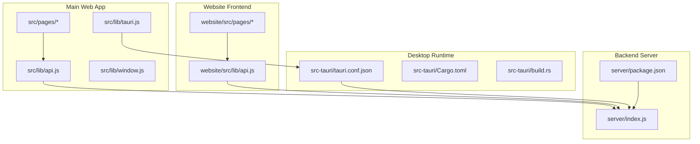

**Diagram sources**
- [api.js](file://src/lib/api.js)
- [tauri.js](file://src/lib/tauri.js)
- [window.js](file://src/lib/window.js)
- [index.js](file://server/index.js)
- [package.json](file://server/package.json)
- [tauri.conf.json](file://src-tauri/tauri.conf.json)
- [Cargo.toml](file://src-tauri/Cargo.toml)
- [build.rs](file://src-tauri/build.rs)

**Section sources**
- [api.js](file://src/lib/api.js)
- [index.js](file://server/index.js)
- [tauri.conf.json](file://src-tauri/tauri.conf.json)

## Core Components
- Shared API client: Centralized HTTP client for making authenticated requests to backend services. It encapsulates base URLs, headers, token injection, and response/error handling.
- Authentication and session management: Login page triggers authentication against the backend and manages tokens and sessions locally.
- Admin panel access control: Admin page enforces role-based permissions and restricts access to privileged routes.
- Desktop integration via Tauri: Native capabilities enable secure desktop operations while maintaining backend-driven data flows.
- Backend server: Provides API endpoints, middleware, and runtime configuration for the integrated system.

**Section sources**
- [api.js](file://src/lib/api.js)
- [LoginPage.jsx](file://src/pages/LoginPage.jsx)
- [AdminPage.jsx](file://website/src/pages/AdminPage.jsx)
- [tauri.js](file://src/lib/tauri.js)

## Architecture Overview
The system follows a layered architecture:
- Presentation layer: Website and main web app UIs
- API gateway: Shared API client and backend server
- Business logic: Backend services and Tauri handlers
- Persistence: Database and cache layers accessed through backend

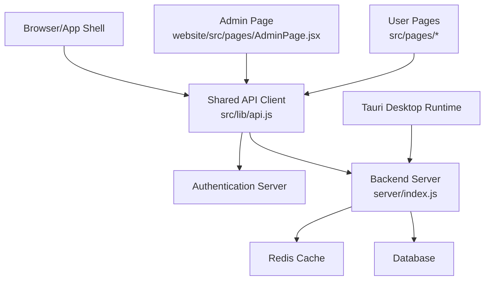

**Diagram sources**
- [api.js](file://src/lib/api.js)
- [index.js](file://server/index.js)
- [AdminPage.jsx](file://website/src/pages/AdminPage.jsx)

## Detailed Component Analysis

### Shared API Library
The shared API library centralizes HTTP communication:
- Base URL resolution for development vs production
- Request interceptors for injecting Authorization headers
- Response normalization and error handling
- Token refresh logic and retry mechanisms
- Loading state coordination across UI components

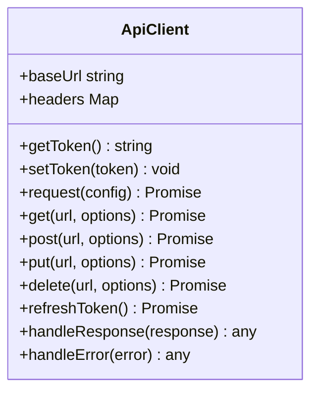

**Diagram sources**
- [api.js](file://src/lib/api.js)

**Section sources**
- [api.js](file://src/lib/api.js)

### Authentication and Session Management
The login flow authenticates users against the backend and manages tokens and sessions:
- User credentials submitted to backend
- Successful authentication stores tokens and sets session state
- Automatic token refresh during requests
- Logout clears stored tokens and resets session

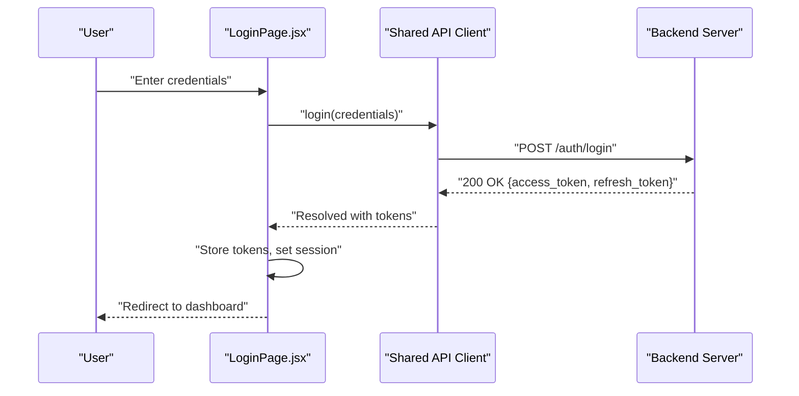

**Diagram sources**
- [LoginPage.jsx](file://src/pages/LoginPage.jsx)
- [api.js](file://src/lib/api.js)
- [index.js](file://server/index.js)

**Section sources**
- [LoginPage.jsx](file://src/pages/LoginPage.jsx)
- [api.js](file://src/lib/api.js)

### JWT Token Refresh Mechanism
The API client implements automatic token refresh:
- On request failure with token-related error, trigger refresh
- Exchange refresh token for new access token
- Retry original request with new token
- Persist refreshed tokens and update headers

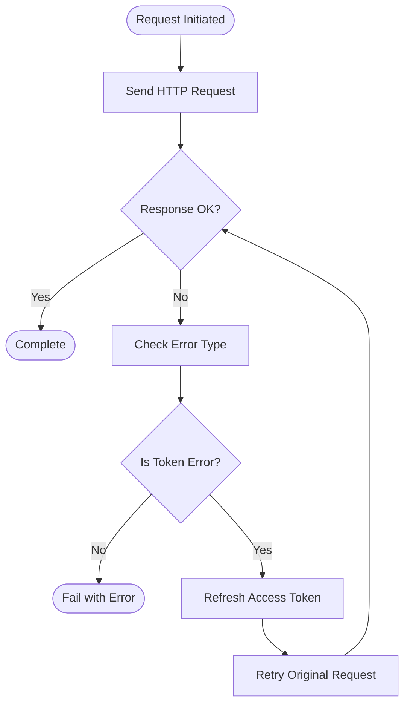

**Diagram sources**
- [api.js](file://src/lib/api.js)

**Section sources**
- [api.js](file://src/lib/api.js)

### Admin Panel Access Control
The admin page enforces role-based access control:
- Validates user roles before rendering admin routes
- Restricts access to sensitive actions and data
- Integrates with backend endpoints for role verification

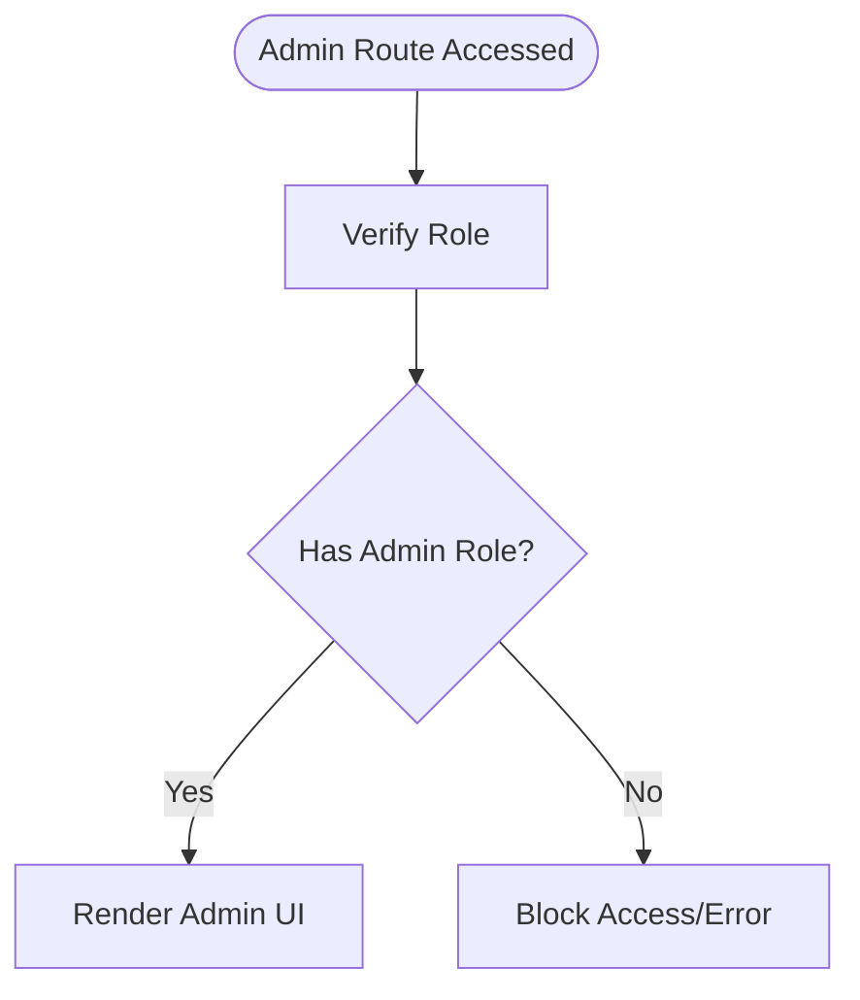

**Diagram sources**
- [AdminPage.jsx](file://website/src/pages/AdminPage.jsx)

**Section sources**
- [AdminPage.jsx](file://website/src/pages/AdminPage.jsx)

### Desktop Application Integration (Tauri)
The desktop app leverages Tauri for native capabilities:
- Tauri configuration defines allowed commands and security policies
- Rust backend extends capabilities safely
- Window and system-level integrations coordinate with backend services

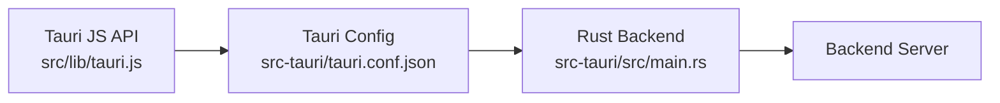

**Diagram sources**
- [tauri.js](file://src/lib/tauri.js)
- [tauri.conf.json](file://src-tauri/tauri.conf.json)
- [Cargo.toml](file://src-tauri/Cargo.toml)
- [build.rs](file://src-tauri/build.rs)

**Section sources**
- [tauri.js](file://src/lib/tauri.js)
- [tauri.conf.json](file://src-tauri/tauri.conf.json)
- [Cargo.toml](file://src-tauri/Cargo.toml)
- [build.rs](file://src-tauri/build.rs)

### Data Synchronization Between Website and Desktop
Synchronization ensures consistent state across platforms:
- Backend acts as the single source of truth
- Website and desktop fetch latest data via shared API client
- Real-time updates handled through polling or event channels
- Conflict resolution via backend timestamps and versioning

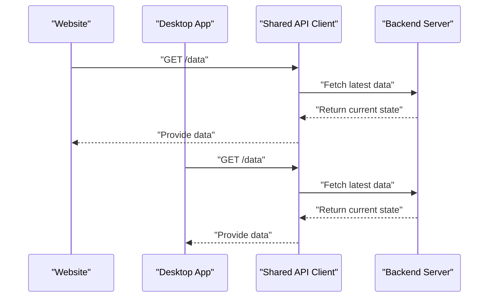

**Diagram sources**
- [api.js](file://src/lib/api.js)
- [index.js](file://server/index.js)

**Section sources**
- [api.js](file://src/lib/api.js)
- [index.js](file://server/index.js)

### CORS Configuration and Proxy Settings
Development and production environments require proper CORS and proxy configuration:
- Vite dev server proxies API requests to backend during development
- Backend server configures CORS headers for allowed origins
- Production deployment ensures correct origin validation and header policies

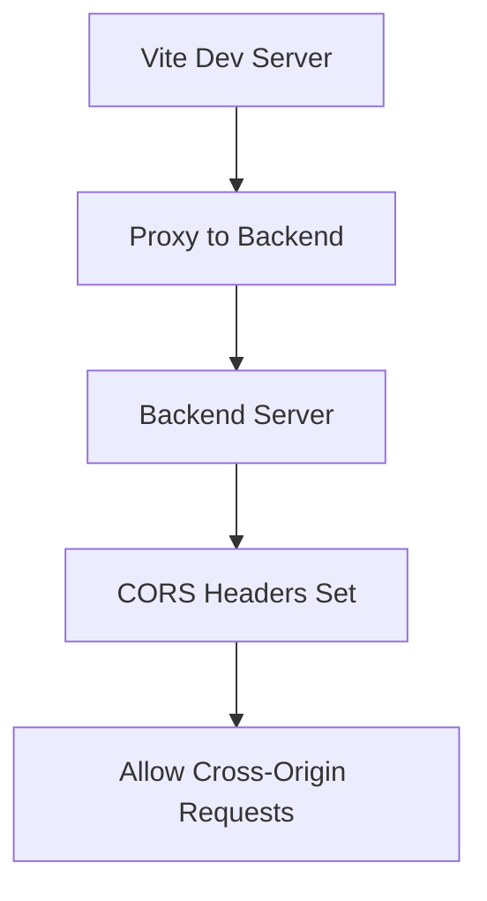

**Diagram sources**
- [vite.config.js](file://website/vite.config.js)
- [index.js](file://server/index.js)

**Section sources**
- [vite.config.js](file://website/vite.config.js)
- [index.js](file://server/index.js)

### Redis Caching and Database Operations
Backend services integrate with Redis and databases:
- Redis caches frequently accessed data to reduce latency
- Database operations are executed through backend service handlers
- API responses leverage cached data when fresh and valid

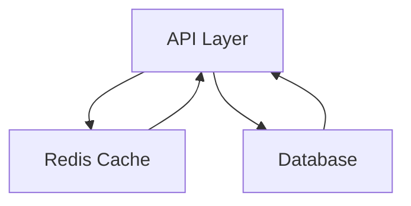

**Diagram sources**
- [index.js](file://server/index.js)

**Section sources**
- [index.js](file://server/index.js)

## Dependency Analysis
The integration relies on explicit dependencies among components:
- Website and main app share the same API client for consistent behavior
- Tauri configuration depends on backend availability and security policies
- Backend server depends on environment variables and external services (Redis, DB)

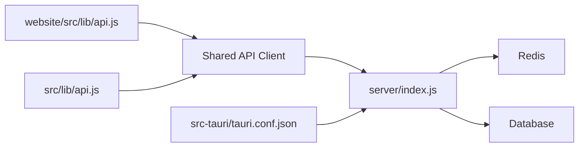

**Diagram sources**
- [api.js](file://src/lib/api.js)
- [index.js](file://server/index.js)
- [tauri.conf.json](file://src-tauri/tauri.conf.json)

**Section sources**
- [api.js](file://src/lib/api.js)
- [index.js](file://server/index.js)
- [tauri.conf.json](file://src-tauri/tauri.conf.json)

## Performance Considerations
- Use the shared API client to minimize redundant logic and improve caching effectiveness
- Implement efficient token refresh strategies to avoid frequent re-authentication
- Leverage Redis caching for hot-path data to reduce backend load
- Optimize frontend loading states with skeleton screens and progressive enhancement
- Monitor backend response times and apply pagination or lazy loading where appropriate

## Troubleshooting Guide
Common issues and resolutions:
- Authentication failures: Verify token storage and refresh logic; check backend auth endpoints
- CORS errors: Confirm allowed origins and credentials settings in backend configuration
- Desktop integration problems: Review Tauri capabilities and security policies
- Cache inconsistencies: Ensure cache invalidation and TTL policies align with data freshness requirements
- Network timeouts: Implement retry logic and circuit breakers in the API client

**Section sources**
- [api.js](file://src/lib/api.js)
- [index.js](file://server/index.js)
- [tauri.conf.json](file://src-tauri/tauri.conf.json)

## Conclusion
The integration between the website platform and backend services is built around a shared API client, robust authentication and session management, role-based access control, and seamless desktop integration via Tauri. Proper CORS and proxy configuration ensure smooth cross-origin communication, while Redis and database layers support scalable data operations. Following the documented patterns and best practices will maintain consistency and reliability across all components.