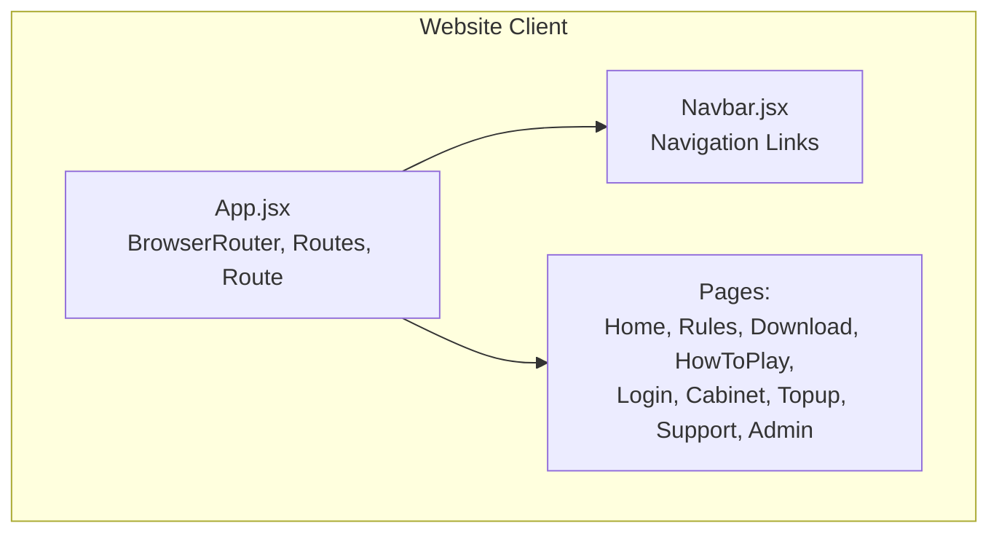
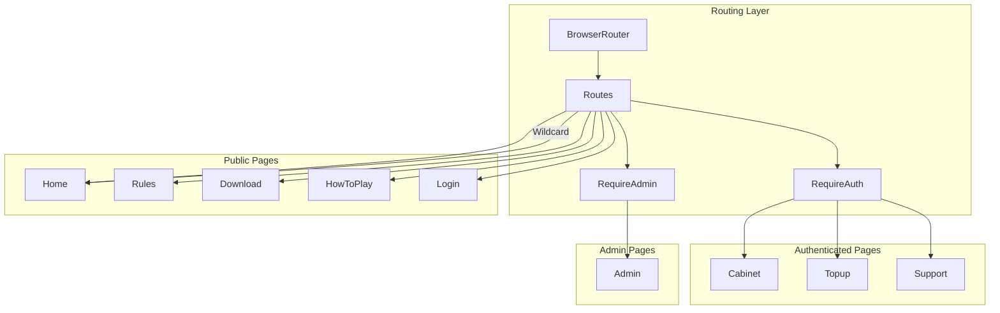
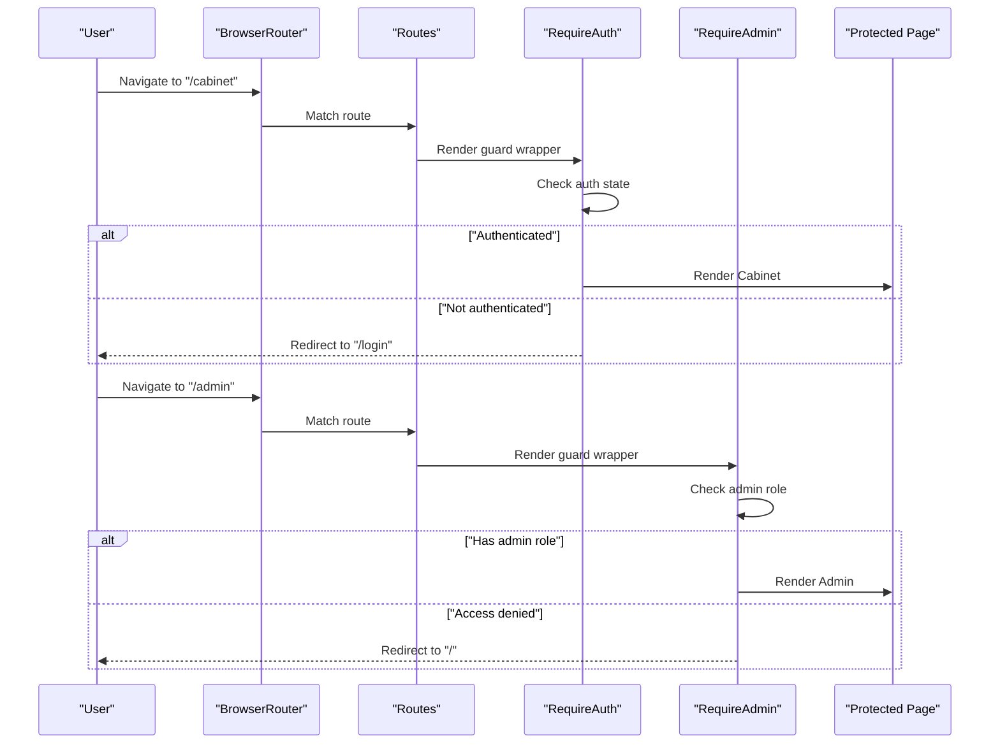
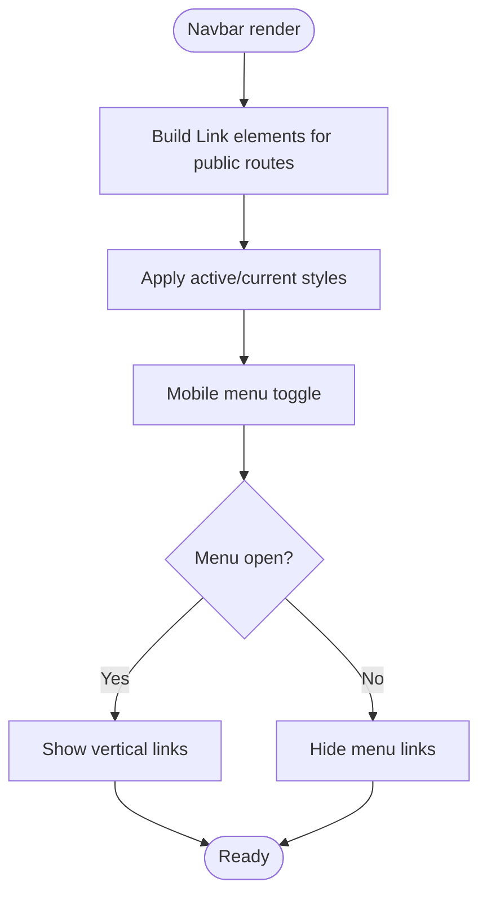
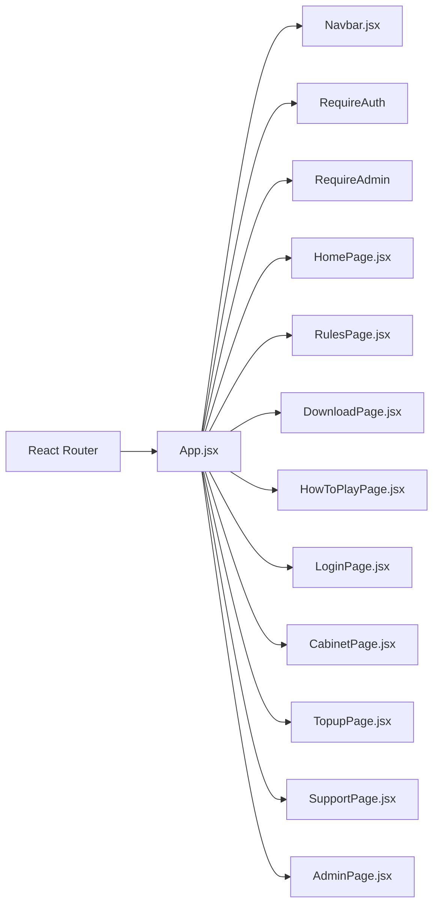

# Page Routing & Navigation

<cite>
**Referenced Files in This Document**
- [App.jsx](file://website/src/App.jsx)
- [Navbar.jsx](file://website/src/components/Navbar.jsx)
- [HomePage.jsx](file://website/src/pages/HomePage.jsx)
- [RulesPage.jsx](file://website/src/pages/RulesPage.jsx)
- [DownloadPage.jsx](file://website/src/pages/DownloadPage.jsx)
- [HowToPlayPage.jsx](file://website/src/pages/HowToPlayPage.jsx)
- [LoginPage.jsx](file://website/src/pages/LoginPage.jsx)
- [CabinetPage.jsx](file://website/src/pages/CabinetPage.jsx)
- [TopupPage.jsx](file://website/src/pages/TopupPage.jsx)
- [SupportPage.jsx](file://website/src/pages/SupportPage.jsx)
- [AdminPage.jsx](file://website/src/pages/AdminPage.jsx)
</cite>

## Table of Contents
1. [Introduction](#introduction)
2. [Project Structure](#project-structure)
3. [Core Components](#core-components)
4. [Architecture Overview](#architecture-overview)
5. [Detailed Component Analysis](#detailed-component-analysis)
6. [Dependency Analysis](#dependency-analysis)
7. [Performance Considerations](#performance-considerations)
8. [Troubleshooting Guide](#troubleshooting-guide)
9. [Conclusion](#conclusion)

## Introduction
This document describes the page routing and navigation system for the website platform. It covers all routes (public, authenticated, and administrative), route protection mechanisms using custom guards, navigation patterns, responsive navbar and mobile menu behavior, programmatic navigation examples, fallback route handling, SEO considerations, and meta tag management.

## Project Structure
The routing system is implemented in the website client application using React Router. The main application component defines routes, wraps protected pages with guards, and renders a shared navigation bar.

**Diagram sources**
- [App.jsx:40-59](file://website/src/App.jsx#L40-L59)
- [Navbar.jsx:1-60](file://website/src/components/Navbar.jsx#L1-L60)

**Section sources**
- [App.jsx:1-59](file://website/src/App.jsx#L1-L59)

## Core Components
- App routing and guards:
  - BrowserRouter provides routing context.
  - Routes define all public and protected paths.
  - RequireAuth and RequireAdmin are custom guards wrapping authenticated/admin routes.
  - A catch-all wildcard route redirects unhandled paths to the home page.
- Navigation bar:
  - Provides links to public pages.
  - Uses React Router Link for declarative navigation.

Key implementation references:
- Router setup and routes: [App.jsx:40-59](file://website/src/App.jsx#L40-L59)
- Authentication guard: [App.jsx:14-23](file://website/src/App.jsx#L14-L23)
- Admin guard: [App.jsx:20-23](file://website/src/App.jsx#L20-L23)
- Navbar links: [Navbar.jsx:28-50](file://website/src/components/Navbar.jsx#L28-L50)

**Section sources**
- [App.jsx:14-59](file://website/src/App.jsx#L14-L59)
- [Navbar.jsx:1-60](file://website/src/components/Navbar.jsx#L1-L60)

## Architecture Overview
The routing architecture separates concerns into:
- Public pages: Home, Rules, Download, HowToPlay, Login
- Authenticated pages: Cabinet, Topup, Support
- Administrative pages: Admin
- Guards: RequireAuth and RequireAdmin enforce access policies
- Fallback: Wildcard route navigates to home

**Diagram sources**
- [App.jsx:40-59](file://website/src/App.jsx#L40-L59)

## Detailed Component Analysis

### Route Definitions and Protection
- Public routes:
  - "/" → Home
  - "/login" → Login
  - "/rules" → Rules
  - "/download" → Download
  - "/howtoplay" → HowToPlay
- Protected routes:
  - "/cabinet" → Requires authentication
  - "/topup" → Requires authentication
  - "/support" → Requires authentication
- Administrative route:
  - "/admin" → Requires admin role
- Fallback:
  - "*" → Redirects to "/"
- Guards:
  - RequireAuth: Wraps authenticated pages
  - RequireAdmin: Wraps admin page

Programmatic navigation examples:
- Internal navigation via Link:
  - Example usage appears in [CabinetPage.jsx:100-106](file://website/src/pages/CabinetPage.jsx#L100-L106) and [CabinetPage.jsx:225-230](file://website/src/pages/CabinetPage.jsx#L225-L230)
- Redirect after login:
  - LoginPage passes an onLogin handler to the route definition in [App.jsx:45-47](file://website/src/App.jsx#L45-L47)

Route protection flow:

**Diagram sources**
- [App.jsx:14-23](file://website/src/App.jsx#L14-L23)
- [App.jsx:49-53](file://website/src/App.jsx#L49-L53)

**Section sources**
- [App.jsx:40-59](file://website/src/App.jsx#L40-L59)

### Navigation Bar and Mobile Menu
- The navigation bar uses React Router Link for internal navigation.
- It renders links to public pages and integrates with the current location.
- Mobile responsiveness and menu behavior are handled within the Navbar component.

References:
- Navbar link rendering: [Navbar.jsx:28-50](file://website/src/components/Navbar.jsx#L28-L50)

**Diagram sources**
- [Navbar.jsx:1-60](file://website/src/components/Navbar.jsx#L1-L60)

**Section sources**
- [Navbar.jsx:1-60](file://website/src/components/Navbar.jsx#L1-L60)

### Programmatic Navigation and Route Parameters
- Declarative navigation:
  - Use Link components inside pages to navigate internally (see examples in [CabinetPage.jsx:100-106](file://website/src/pages/CabinetPage.jsx#L100-L106) and [CabinetPage.jsx:225-230](file://website/src/pages/CabinetPage.jsx#L225-L230)).
- Redirect after login:
  - LoginPage supplies an onLogin callback used in the route definition for "/login" in [App.jsx:45-47](file://website/src/App.jsx#L45-L47).
- Route parameters:
  - No parameterized routes are defined in the current routing table. Parameter handling would be implemented using React Router’s parameter syntax and matching logic if needed.

**Section sources**
- [App.jsx:45-47](file://website/src/App.jsx#L45-L47)
- [CabinetPage.jsx:100-106](file://website/src/pages/CabinetPage.jsx#L100-L106)
- [CabinetPage.jsx:225-230](file://website/src/pages/CabinetPage.jsx#L225-L230)

### Fallback Route and 404 Behavior
- A wildcard route "*" is defined and redirects to "/" using Navigate.
- This ensures unknown paths resolve to the home page rather than displaying a blank screen.

Reference:
- Wildcard redirect: [App.jsx:53-54](file://website/src/App.jsx#L53-L54)

**Section sources**
- [App.jsx:53-54](file://website/src/App.jsx#L53-L54)

### SEO Considerations and Meta Tag Management
- The website includes static SEO assets under the website/public directory:
  - robots.txt
  - sitemap.xml
  - manifest.json
  - browserconfig.xml
- Meta tag management:
  - For dynamic page metadata (title, description), integrate a solution like react-helmet or use head management utilities.
  - Each page component should set appropriate meta tags based on the route and content.
  - Canonical URLs and Open Graph tags should be configured per page to improve search visibility.

Note: The current routing setup does not include explicit meta tag injection. Implementing page-specific meta tags is recommended for improved SEO.

**Section sources**
- [App.jsx:40-59](file://website/src/App.jsx#L40-L59)

## Dependency Analysis
The routing system depends on:
- React Router for routing primitives (BrowserRouter, Routes, Route, Link, Navigate)
- Custom guards (RequireAuth, RequireAdmin) for access control
- Navbar component for navigation UI
- Individual page components for route elements

**Diagram sources**
- [App.jsx:1-59](file://website/src/App.jsx#L1-L59)
- [Navbar.jsx:1-60](file://website/src/components/Navbar.jsx#L1-L60)

**Section sources**
- [App.jsx:1-59](file://website/src/App.jsx#L1-L59)

## Performance Considerations
- Keep route components lightweight; defer heavy computations to lazy-loaded chunks if needed.
- Avoid unnecessary re-renders by memoizing navigation lists and computed values in the Navbar.
- Use React Router’s built-in performance features (e.g., lazy loading) for large applications.

## Troubleshooting Guide
- Users stuck on login loop:
  - Verify RequireAuth logic and session state handling.
  - Confirm that the onLogin callback in LoginPage properly updates application state and triggers navigation.
- Admin access issues:
  - Ensure RequireAdmin checks the user’s role and grants/denies access accordingly.
- Broken links:
  - Validate Link destinations match defined routes in App.jsx.
- Unexpected 404 behavior:
  - Confirm wildcard route "*" exists and redirects to "/" as intended.

**Section sources**
- [App.jsx:14-23](file://website/src/App.jsx#L14-L23)
- [App.jsx:49-54](file://website/src/App.jsx#L49-L54)

## Conclusion
The website’s routing and navigation system uses React Router with clear separation between public, authenticated, and administrative routes. Custom guards enforce access control, while a responsive navbar provides intuitive navigation. Implementing page-specific meta tags and considering lazy loading will further enhance SEO and performance.