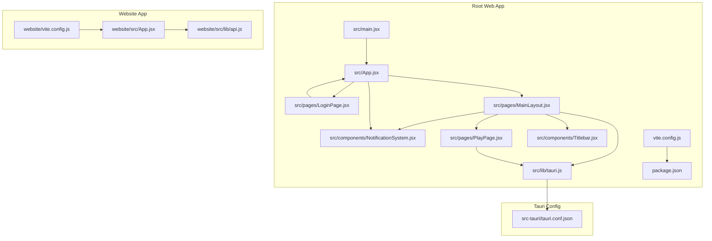
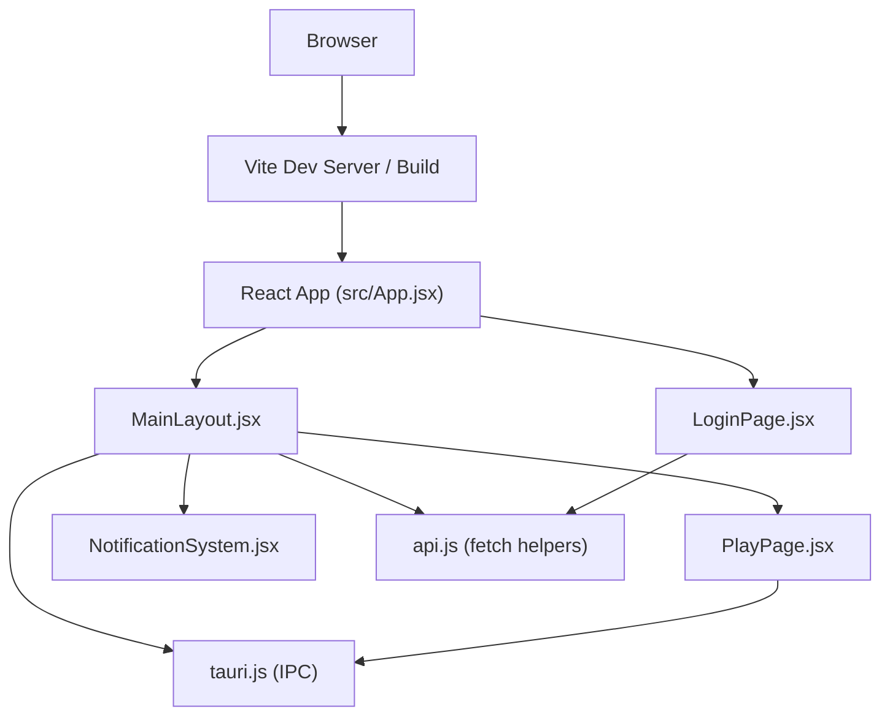
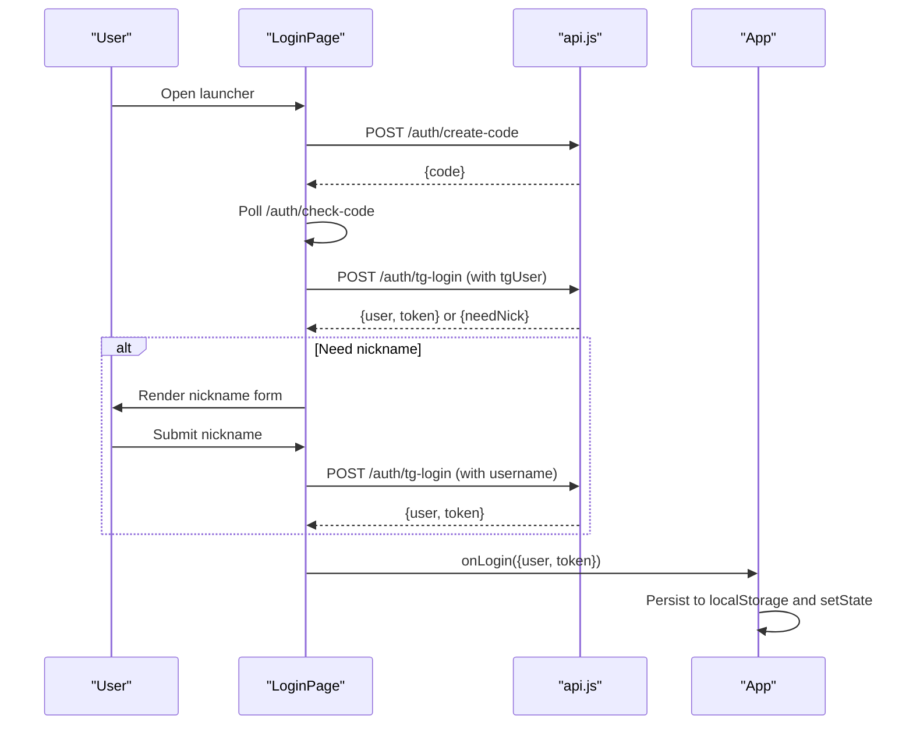
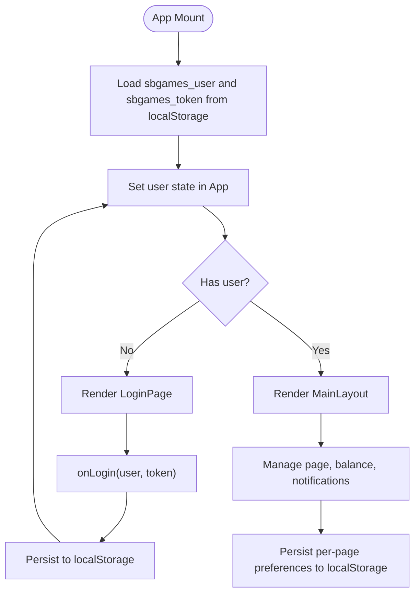
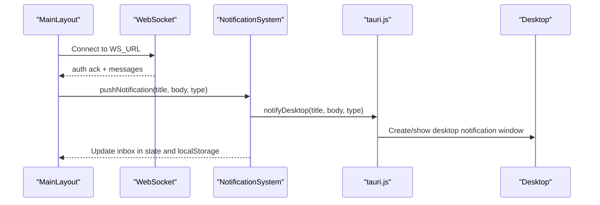
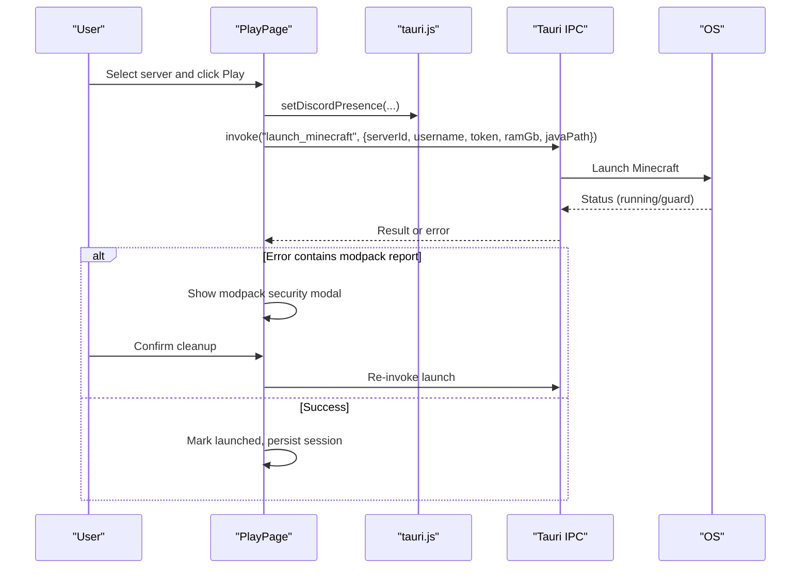
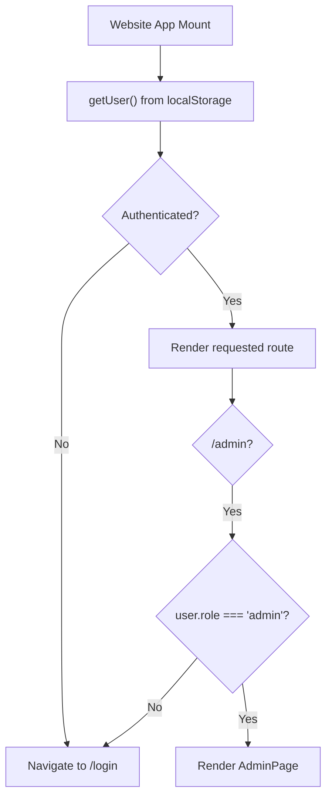
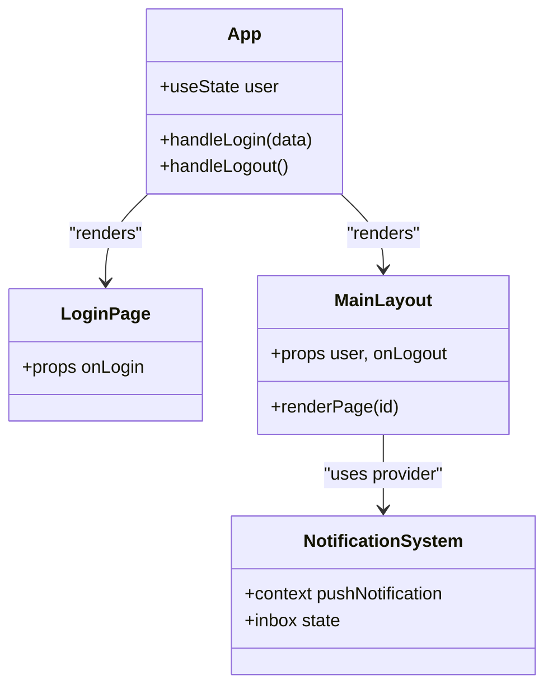
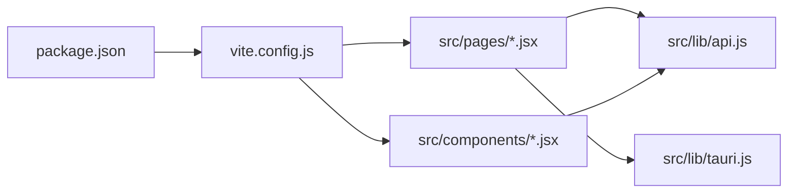

# Web Application Architecture

<cite>
**Referenced Files in This Document**
- [package.json](file://package.json)
- [vite.config.js](file://vite.config.js)
- [src/main.jsx](file://src/main.jsx)
- [src/App.jsx](file://src/App.jsx)
- [src/pages/MainLayout.jsx](file://src/pages/MainLayout.jsx)
- [src/pages/LoginPage.jsx](file://src/pages/LoginPage.jsx)
- [src/lib/api.js](file://src/lib/api.js)
- [src/components/NotificationSystem.jsx](file://src/components/NotificationSystem.jsx)
- [src/lib/tauri.js](file://src/lib/tauri.js)
- [src/pages/PlayPage.jsx](file://src/pages/PlayPage.jsx)
- [src-tauri/tauri.conf.json](file://src-tauri/tauri.conf.json)
- [website/src/App.jsx](file://website/src/App.jsx)
- [website/vite.config.js](file://website/vite.config.js)
- [website/src/lib/api.js](file://website/src/lib/api.js)
- [src/components/Titlebar.jsx](file://src/components/Titlebar.jsx)
</cite>

## Table of Contents
1. [Introduction](#introduction)
2. [Project Structure](#project-structure)
3. [Core Components](#core-components)
4. [Architecture Overview](#architecture-overview)
5. [Detailed Component Analysis](#detailed-component-analysis)
6. [Dependency Analysis](#dependency-analysis)
7. [Performance Considerations](#performance-considerations)
8. [Troubleshooting Guide](#troubleshooting-guide)
9. [Conclusion](#conclusion)
10. [Appendices](#appendices)

## Introduction
This document describes the web application architecture of the SBGames website platform. The frontend is a React application built with Vite, featuring a modern UI with animations, real-time notifications, and deep integration with a Tauri-based desktop launcher. It includes a custom authentication flow using a Telegram bot, a notification system with desktop integration, and a modular page layout. The document also compares the web architecture with the desktop Tauri application, highlights state management patterns, and provides guidance on performance and build optimization.

## Project Structure
The repository contains two primary frontends:
- Web launcher (React + Vite): located under the repository root
- Website (React + Vite): located under website/

Key directories and files:
- Root web app: src/main.jsx, src/App.jsx, src/pages/*.jsx, src/components/*.jsx, src/lib/*.js
- Build and tooling: vite.config.js, package.json
- Desktop integration: src/lib/tauri.js, src-tauri/tauri.conf.json
- Website app: website/src/App.jsx, website/src/lib/api.js, website/vite.config.js

**Diagram sources**
- [src/main.jsx:1-11](file://src/main.jsx#L1-L11)
- [src/App.jsx:1-41](file://src/App.jsx#L1-L41)
- [src/pages/LoginPage.jsx:1-453](file://src/pages/LoginPage.jsx#L1-L453)
- [src/pages/MainLayout.jsx:1-310](file://src/pages/MainLayout.jsx#L1-L310)
- [src/components/NotificationSystem.jsx:1-382](file://src/components/NotificationSystem.jsx#L1-L382)
- [src/lib/tauri.js:1-101](file://src/lib/tauri.js#L1-L101)
- [src/pages/PlayPage.jsx:1-746](file://src/pages/PlayPage.jsx#L1-L746)
- [src/components/Titlebar.jsx:1-55](file://src/components/Titlebar.jsx#L1-L55)
- [vite.config.js:1-97](file://vite.config.js#L1-L97)
- [package.json:1-43](file://package.json#L1-L43)
- [website/src/App.jsx:1-60](file://website/src/App.jsx#L1-L60)
- [website/src/lib/api.js:1-33](file://website/src/lib/api.js#L1-L33)
- [website/vite.config.js:1-94](file://website/vite.config.js#L1-L94)
- [src-tauri/tauri.conf.json:1-89](file://src-tauri/tauri.conf.json#L1-L89)

**Section sources**
- [package.json:1-43](file://package.json#L1-L43)
- [vite.config.js:1-97](file://vite.config.js#L1-L97)
- [src/main.jsx:1-11](file://src/main.jsx#L1-L11)
- [website/vite.config.js:1-94](file://website/vite.config.js#L1-L94)

## Core Components
- Application bootstrap: mounts the root React app and enables strict mode.
- Authentication flow: Telegram-based login with QR/code polling and optional nickname registration.
- Layout and navigation: centralized header with navigation items and a content area switching between pages.
- Real-time notifications: toast stack and persistent inbox with desktop notifications.
- Tauri integration: IPC invocations for launching games, Discord presence, and tray state synchronization.
- Play page: server selection, launch settings, anti-cheat modpack security modal, and game session tracking.

**Section sources**
- [src/main.jsx:1-11](file://src/main.jsx#L1-L11)
- [src/App.jsx:1-41](file://src/App.jsx#L1-L41)
- [src/pages/LoginPage.jsx:1-453](file://src/pages/LoginPage.jsx#L1-L453)
- [src/pages/MainLayout.jsx:1-310](file://src/pages/MainLayout.jsx#L1-L310)
- [src/components/NotificationSystem.jsx:1-382](file://src/components/NotificationSystem.jsx#L1-L382)
- [src/lib/tauri.js:1-101](file://src/lib/tauri.js#L1-L101)
- [src/pages/PlayPage.jsx:1-746](file://src/pages/PlayPage.jsx#L1-L746)

## Architecture Overview
The web application follows a React + Vite architecture with:
- Single-page application behavior driven by component composition and local state.
- Authentication state persisted in localStorage and propagated down via props and context.
- Real-time updates via WebSocket connections for balance, friends, and tickets.
- Desktop integration through Tauri IPC for native actions and notifications.

**Diagram sources**
- [src/App.jsx:1-41](file://src/App.jsx#L1-L41)
- [src/pages/LoginPage.jsx:1-453](file://src/pages/LoginPage.jsx#L1-L453)
- [src/pages/MainLayout.jsx:1-310](file://src/pages/MainLayout.jsx#L1-L310)
- [src/pages/PlayPage.jsx:1-746](file://src/pages/PlayPage.jsx#L1-L746)
- [src/components/NotificationSystem.jsx:1-382](file://src/components/NotificationSystem.jsx#L1-L382)
- [src/lib/api.js:1-30](file://src/lib/api.js#L1-L30)
- [src/lib/tauri.js:1-101](file://src/lib/tauri.js#L1-L101)

## Detailed Component Analysis

### Authentication and Routing
- Root app initializes user state from localStorage and exposes login/logout handlers.
- LoginPage implements Telegram-based authentication with QR/code modes, polling, and nickname submission.
- MainLayout orchestrates navigation, real-time notifications, and desktop integrations.

**Diagram sources**
- [src/pages/LoginPage.jsx:1-453](file://src/pages/LoginPage.jsx#L1-L453)
- [src/lib/api.js:1-30](file://src/lib/api.js#L1-L30)
- [src/App.jsx:1-41](file://src/App.jsx#L1-L41)

**Section sources**
- [src/App.jsx:1-41](file://src/App.jsx#L1-L41)
- [src/pages/LoginPage.jsx:1-453](file://src/pages/LoginPage.jsx#L1-L453)
- [src/lib/api.js:1-30](file://src/lib/api.js#L1-L30)

### State Management and Local Storage
- Authentication state: user and token stored in localStorage and synchronized in App state.
- UI state: MainLayout manages page selection, community visibility, friend badge, and balance.
- Page-specific preferences: PlayPage persists RAM, Java path, and modpack/security modal preferences in localStorage.
- Notification inbox: NotificationSystem maintains toasts and persistent inbox in state and localStorage.

**Diagram sources**
- [src/App.jsx:1-41](file://src/App.jsx#L1-L41)
- [src/pages/MainLayout.jsx:1-310](file://src/pages/MainLayout.jsx#L1-L310)
- [src/pages/PlayPage.jsx:1-746](file://src/pages/PlayPage.jsx#L1-L746)
- [src/components/NotificationSystem.jsx:1-382](file://src/components/NotificationSystem.jsx#L1-L382)

**Section sources**
- [src/App.jsx:1-41](file://src/App.jsx#L1-L41)
- [src/pages/MainLayout.jsx:1-310](file://src/pages/MainLayout.jsx#L1-L310)
- [src/pages/PlayPage.jsx:1-746](file://src/pages/PlayPage.jsx#L1-L746)
- [src/components/NotificationSystem.jsx:1-382](file://src/components/NotificationSystem.jsx#L1-L382)

### Real-Time Notifications and Desktop Integration
- WebSocket connection in MainLayout receives balance, friend, and ticket updates.
- NotificationSystem provides a toast stack and persistent inbox with desktop notifications via Tauri.
- Desktop notification window is managed dynamically with positioning and lifecycle control.

**Diagram sources**
- [src/pages/MainLayout.jsx:1-310](file://src/pages/MainLayout.jsx#L1-L310)
- [src/components/NotificationSystem.jsx:1-382](file://src/components/NotificationSystem.jsx#L1-L382)
- [src/lib/tauri.js:1-101](file://src/lib/tauri.js#L1-L101)

**Section sources**
- [src/pages/MainLayout.jsx:1-310](file://src/pages/MainLayout.jsx#L1-L310)
- [src/components/NotificationSystem.jsx:1-382](file://src/components/NotificationSystem.jsx#L1-L382)
- [src/lib/tauri.js:1-101](file://src/lib/tauri.js#L1-L101)

### Play Page and Game Launch
- PlayPage manages server selection, launch settings, and anti-cheat modpack security modal.
- Launch invokes Tauri commands to start Minecraft, tracks session, and handles errors with modpack reports.

**Diagram sources**
- [src/pages/PlayPage.jsx:1-746](file://src/pages/PlayPage.jsx#L1-L746)
- [src/lib/tauri.js:1-101](file://src/lib/tauri.js#L1-L101)

**Section sources**
- [src/pages/PlayPage.jsx:1-746](file://src/pages/PlayPage.jsx#L1-L746)
- [src/lib/tauri.js:1-101](file://src/lib/tauri.js#L1-L101)

### Website vs Web Launcher: Routing and Guards
- Website app uses React Router DOM with route guards:
  - RequireAuth redirects unauthenticated users to login.
  - RequireAdmin enforces admin role.
- Web launcher does not use React Router DOM; it relies on component composition and App-level state to switch between LoginPage and MainLayout.

**Diagram sources**
- [website/src/App.jsx:1-60](file://website/src/App.jsx#L1-L60)
- [website/src/lib/api.js:1-33](file://website/src/lib/api.js#L1-L33)

**Section sources**
- [website/src/App.jsx:1-60](file://website/src/App.jsx#L1-L60)
- [website/src/lib/api.js:1-33](file://website/src/lib/api.js#L1-L33)

### Component Composition and Prop Drilling
- App passes onLogin and onLogout to LoginPage and MainLayout respectively.
- MainLayout passes user, onLogout, and callbacks to child pages and components.
- NotificationSystem uses a context provider to distribute pushNotification and inbox state to consumers.

**Diagram sources**
- [src/App.jsx:1-41](file://src/App.jsx#L1-L41)
- [src/pages/LoginPage.jsx:1-453](file://src/pages/LoginPage.jsx#L1-L453)
- [src/pages/MainLayout.jsx:1-310](file://src/pages/MainLayout.jsx#L1-L310)
- [src/components/NotificationSystem.jsx:1-382](file://src/components/NotificationSystem.jsx#L1-L382)

**Section sources**
- [src/App.jsx:1-41](file://src/App.jsx#L1-L41)
- [src/pages/MainLayout.jsx:1-310](file://src/pages/MainLayout.jsx#L1-L310)
- [src/components/NotificationSystem.jsx:1-382](file://src/components/NotificationSystem.jsx#L1-L382)

## Dependency Analysis
- Build pipeline: Vite with React plugin, custom obfuscation plugin, Terser minification, and sourcemap toggles.
- Runtime dependencies: React, React Router DOM, Framer Motion, Phosphor Icons, Lucide, axios, skinview3d, ssh2.
- Dev dependencies: Tauri CLI, Tailwind, PostCSS, javascript-obfuscator, terser.

**Diagram sources**
- [package.json:1-43](file://package.json#L1-L43)
- [vite.config.js:1-97](file://vite.config.js#L1-L97)
- [src/lib/tauri.js:1-101](file://src/lib/tauri.js#L1-L101)
- [src/lib/api.js:1-30](file://src/lib/api.js#L1-L30)
- [src/pages/MainLayout.jsx:1-310](file://src/pages/MainLayout.jsx#L1-L310)

**Section sources**
- [package.json:1-43](file://package.json#L1-L43)
- [vite.config.js:1-97](file://vite.config.js#L1-L97)

## Performance Considerations
- Minification and obfuscation: Terser minification and a custom obfuscation plugin reduce payload size and hinder reverse engineering.
- Conditional builds: Separate Vite configs for main and tray builds enable optimized outputs.
- Animation and rendering: Framer Motion animations are used selectively; consider lazy-loading heavy components.
- Network requests: Centralized fetch helpers (authFetch, authedFetch) streamline request handling and error propagation.
- Local storage usage: Prefer lightweight JSON serialization and avoid frequent writes to improve responsiveness.

[No sources needed since this section provides general guidance]

## Troubleshooting Guide
- Authentication issues:
  - Verify localStorage entries for sbgames_user and sbgames_token.
  - Check API endpoints for code creation and login flow.
- WebSocket notifications:
  - Inspect WS_URL and token retrieval via getToken().
  - Ensure proper reconnect logic and message parsing.
- Desktop notifications:
  - Confirm notifyDesktop behavior and window lifecycle.
  - Validate CSP settings in tauri.conf.json for notification.html access.
- Build and dev server:
  - Review Vite config for port, host, and HMR settings.
  - Ensure TRAY_BUILD and environment variables are set correctly during builds.

**Section sources**
- [src/lib/api.js:1-30](file://src/lib/api.js#L1-L30)
- [src/pages/MainLayout.jsx:1-310](file://src/pages/MainLayout.jsx#L1-L310)
- [src/lib/tauri.js:1-101](file://src/lib/tauri.js#L1-L101)
- [src-tauri/tauri.conf.json:1-89](file://src-tauri/tauri.conf.json#L1-L89)
- [vite.config.js:1-97](file://vite.config.js#L1-L97)

## Conclusion
The SBGames web application combines a React-based UI with Vite tooling, robust authentication, real-time notifications, and deep Tauri integration. While the web launcher eschews React Router DOM in favor of component composition, the website app demonstrates route guards and centralized auth helpers. The architecture emphasizes local state persistence, IPC-driven desktop features, and performance-conscious build configurations.

[No sources needed since this section summarizes without analyzing specific files]

## Appendices

### Build and Development Workflow
- Scripts:
  - dev: starts Vite dev server
  - build: generates Java assets, builds main app, builds tray app, merges outputs
  - build:main and build:tray: separate targets for main and tray outputs
  - preview: serves built assets locally
  - tauri: launches Tauri CLI
- Vite configuration:
  - Plugins: React, custom obfuscation
  - Server: port 1420, optional host-based HMR
  - Resolve alias: @ -> ./src
  - Build: Terser minification, console/debugger stripping, optional sourcemaps

**Section sources**
- [package.json:1-43](file://package.json#L1-L43)
- [vite.config.js:1-97](file://vite.config.js#L1-L97)

### Tauri Configuration Highlights
- Windows: main and tray windows with transparency and top-most flags
- CSP: strict policies for secure resource loading
- Bundle: multi-target packaging and platform-specific settings
- Plugins: shell open enabled

**Section sources**
- [src-tauri/tauri.conf.json:1-89](file://src-tauri/tauri.conf.json#L1-L89)