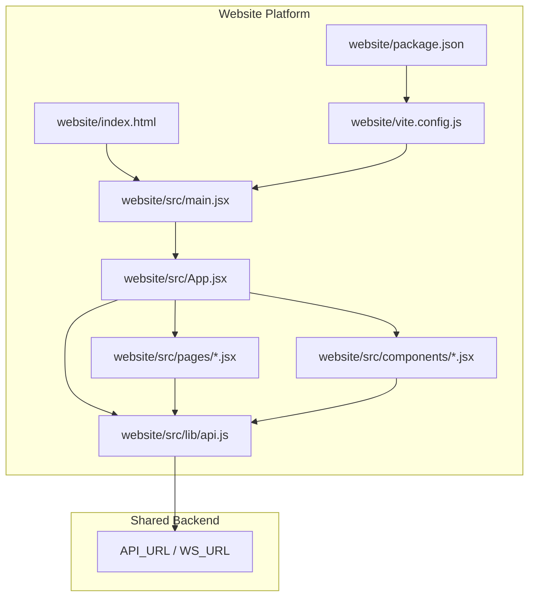
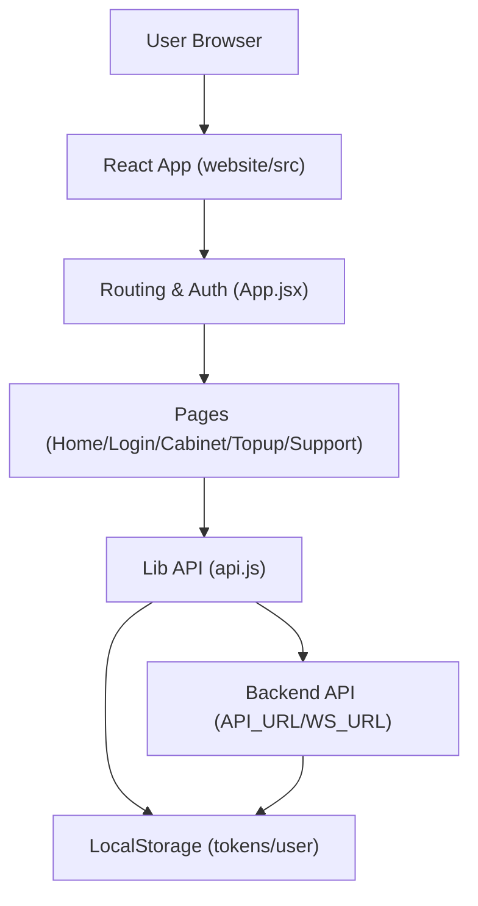
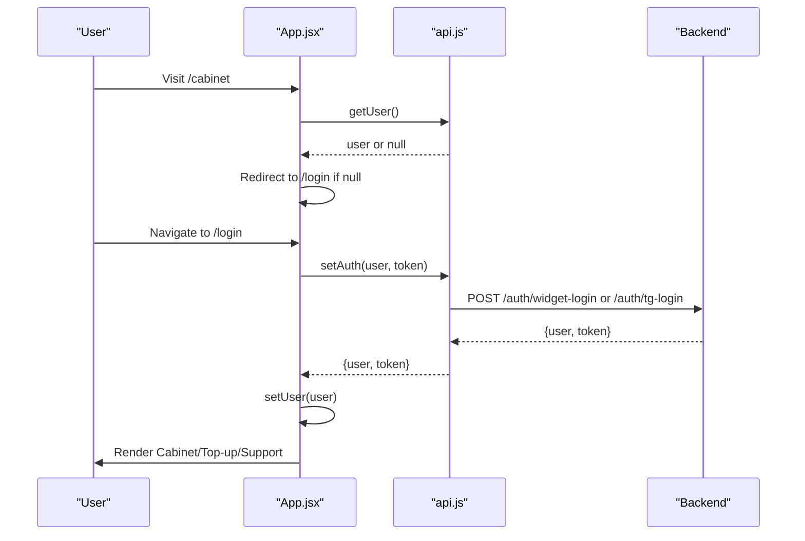
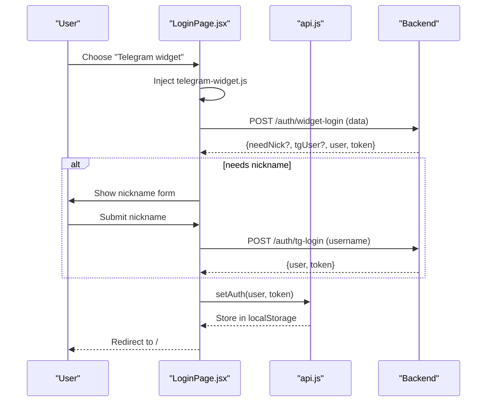
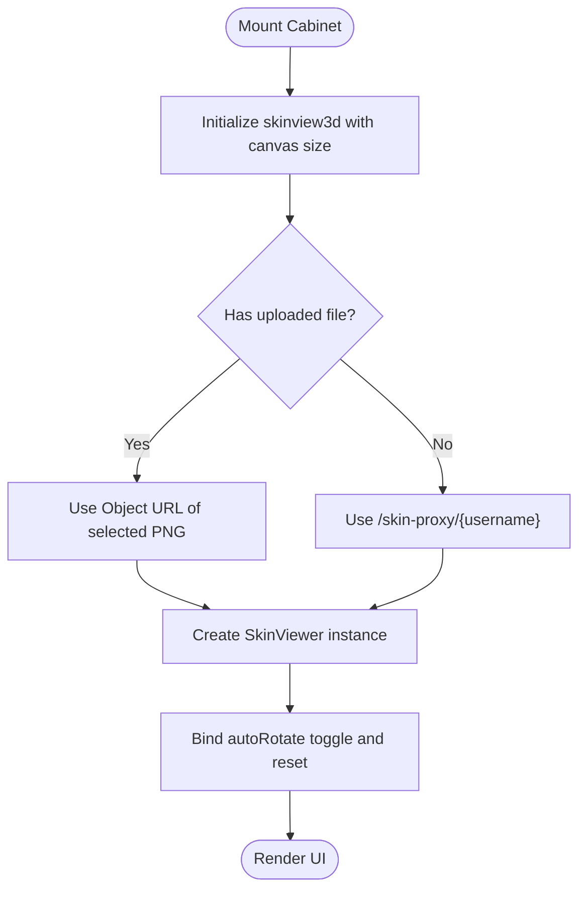
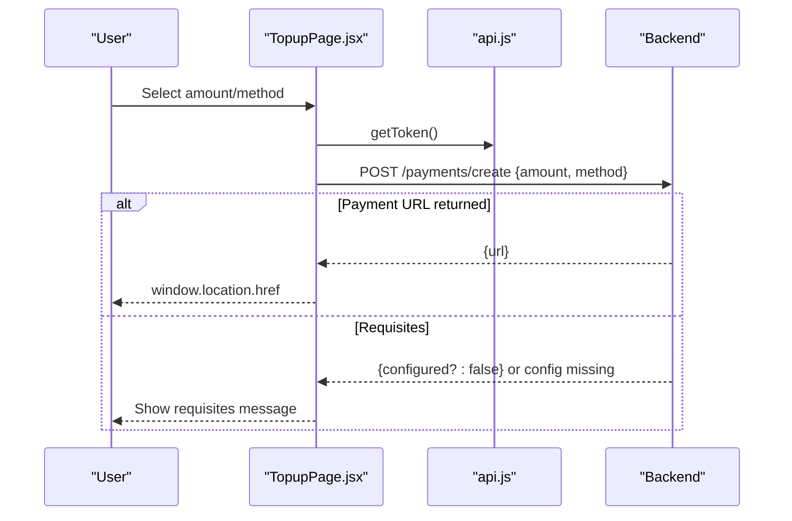
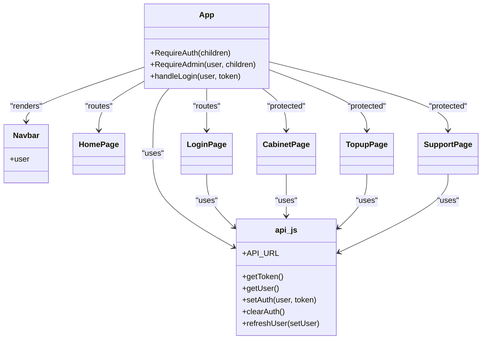
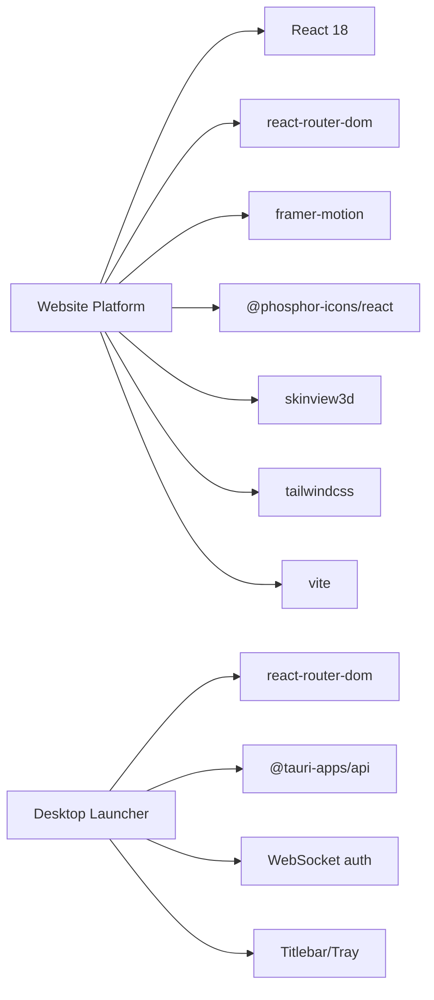

# Website Platform

<cite>
**Referenced Files in This Document**
- [website/package.json](file://website/package.json)
- [website/vite.config.js](file://website/vite.config.js)
- [website/src/App.jsx](file://website/src/App.jsx)
- [website/src/main.jsx](file://website/src/main.jsx)
- [website/src/lib/api.js](file://website/src/lib/api.js)
- [website/src/pages/HomePage.jsx](file://website/src/pages/HomePage.jsx)
- [website/src/components/Navbar.jsx](file://website/src/components/Navbar.jsx)
- [website/src/pages/LoginPage.jsx](file://website/src/pages/LoginPage.jsx)
- [website/src/pages/CabinetPage.jsx](file://website/src/pages/CabinetPage.jsx)
- [website/src/pages/TopupPage.jsx](file://website/src/pages/TopupPage.jsx)
- [website/src/pages/SupportPage.jsx](file://website/src/pages/SupportPage.jsx)
- [website/index.html](file://website/index.html)
- [website/tailwind.config.js](file://website/tailwind.config.js)
- [src/pages/MainLayout.jsx](file://src/pages/MainLayout.jsx)
- [src/lib/api.js](file://src/lib/api.js)
- [src-tauri/src/main.rs](file://src-tauri/src/main.rs)
- [package.json](file://package.json)
- [site/index.html](file://site/index.html)
</cite>

## Table of Contents
1. [Introduction](#introduction)
2. [Project Structure](#project-structure)
3. [Core Components](#core-components)
4. [Architecture Overview](#architecture-overview)
5. [Detailed Component Analysis](#detailed-component-analysis)
6. [Dependency Analysis](#dependency-analysis)
7. [Performance Considerations](#performance-considerations)
8. [Troubleshooting Guide](#troubleshooting-guide)
9. [Conclusion](#conclusion)
10. [Appendices](#appendices)

## Introduction
This document describes the separate website platform that provides web-based access to SBGames features. Built with React and Vite, the website offers a browser-first experience for authentication, account management, payments, support, and promotional content. It shares the same backend APIs and authentication tokens with the desktop launcher application, ensuring synchronized user sessions and data. The platform emphasizes responsive design, mobile compatibility, robust SEO, and secure build-time hardening.

## Project Structure
The website platform resides under the website/ directory and is organized around React components, pages, and shared libraries. Key areas:
- website/src: React application source (components, pages, main entry)
- website/public: Static assets served at runtime
- website/index.html: HTML template with SEO metadata and preloads
- website/vite.config.js: Build configuration with obfuscation and asset serving
- website/package.json: Dependencies and scripts for development/build

**Diagram sources**
- [website/src/main.jsx:1-9](file://website/src/main.jsx#L1-L9)
- [website/src/App.jsx:1-60](file://website/src/App.jsx#L1-L60)
- [website/src/lib/api.js:1-33](file://website/src/lib/api.js#L1-L33)
- [website/index.html:1-132](file://website/index.html#L1-L132)
- [website/vite.config.js:1-94](file://website/vite.config.js#L1-L94)
- [website/package.json:1-29](file://website/package.json#L1-L29)

**Section sources**
- [website/package.json:1-29](file://website/package.json#L1-L29)
- [website/vite.config.js:1-94](file://website/vite.config.js#L1-L94)
- [website/src/main.jsx:1-9](file://website/src/main.jsx#L1-L9)
- [website/src/App.jsx:1-60](file://website/src/App.jsx#L1-L60)
- [website/src/lib/api.js:1-33](file://website/src/lib/api.js#L1-L33)
- [website/index.html:1-132](file://website/index.html#L1-L132)

## Core Components
- Routing and layout: BrowserRouter, Routes, and RequireAuth/RequireAdmin wrappers manage navigation and protected routes.
- Authentication: Local storage-backed tokens and user state, with periodic server sync via refreshUser.
- Pages: Home, Login, Cabinet, Top-up, Support, Rules, Download, How-to-play, and Admin.
- Shared API: Centralized API_URL and token helpers for consistent backend communication.
- Navigation: Sticky Navbar with dynamic visibility for admin-only links.

Key implementation references:
- App routing and auth wrappers: [website/src/App.jsx:15-59](file://website/src/App.jsx#L15-L59)
- API constants and token helpers: [website/src/lib/api.js:1-33](file://website/src/lib/api.js#L1-L33)
- Main entry rendering: [website/src/main.jsx:1-9](file://website/src/main.jsx#L1-L9)
- Navbar with conditional admin links: [website/src/components/Navbar.jsx:1-58](file://website/src/components/Navbar.jsx#L1-L58)

**Section sources**
- [website/src/App.jsx:1-60](file://website/src/App.jsx#L1-L60)
- [website/src/lib/api.js:1-33](file://website/src/lib/api.js#L1-L33)
- [website/src/main.jsx:1-9](file://website/src/main.jsx#L1-L9)
- [website/src/components/Navbar.jsx:1-58](file://website/src/components/Navbar.jsx#L1-L58)

## Architecture Overview
The website integrates tightly with the shared backend:
- Authentication: Login pages communicate with backend endpoints to obtain tokens and user info, stored in localStorage.
- Real-time updates: Support page uses WebSocket connections for live ticket/message updates.
- Asset delivery: Hero image served locally during dev and copied to dist for production builds.
- Build-time protection: JavaScript obfuscation plugin applied during Vite build.

**Diagram sources**
- [website/src/App.jsx:1-60](file://website/src/App.jsx#L1-L60)
- [website/src/lib/api.js:1-33](file://website/src/lib/api.js#L1-L33)
- [website/src/pages/LoginPage.jsx:1-355](file://website/src/pages/LoginPage.jsx#L1-L355)
- [website/src/pages/SupportPage.jsx:1-327](file://website/src/pages/SupportPage.jsx#L1-L327)

## Detailed Component Analysis

### Routing and Authentication Flow
The App component sets up routing and guards:
- Public routes: Home, Rules, Download, How-to-play, Login
- Protected routes: Cabinet, Top-up, Support
- Admin-only route: Admin
- Auth guard: RequireAuth checks local user presence
- Role guard: RequireAdmin checks role field
- Token refresh: On mount, refreshUser synchronizes role/token with backend

**Diagram sources**
- [website/src/App.jsx:15-59](file://website/src/App.jsx#L15-L59)
- [website/src/lib/api.js:7-14](file://website/src/lib/api.js#L7-L14)
- [website/src/pages/LoginPage.jsx:23-45](file://website/src/pages/LoginPage.jsx#L23-L45)

**Section sources**
- [website/src/App.jsx:15-59](file://website/src/App.jsx#L15-L59)
- [website/src/lib/api.js:16-32](file://website/src/lib/api.js#L16-L32)

### Login Page Workflow
The Login page supports two flows:
- Telegram widget login: Dynamically injects Telegram widget script, handles onTelegramAuth callback, posts widget payload to backend, and transitions to success.
- Code-based login: Generates a login code via backend endpoint, displays it, and opens Telegram bot with start parameter.

**Diagram sources**
- [website/src/pages/LoginPage.jsx:18-113](file://website/src/pages/LoginPage.jsx#L18-L113)
- [website/src/lib/api.js:7-14](file://website/src/lib/api.js#L7-L14)

**Section sources**
- [website/src/pages/LoginPage.jsx:1-355](file://website/src/pages/LoginPage.jsx#L1-L355)
- [website/src/lib/api.js:1-33](file://website/src/lib/api.js#L1-L33)

### Cabinet Page Features
Cabinet displays user profile, balance, and skin customization:
- 3D skin viewer powered by skinview3d, initialized with canvas sizing and animation.
- Auto-rotate toggle and reset controls.
- Conditional upload availability based on balance threshold.
- Dynamic skin URL from proxy endpoint or uploaded file.

**Diagram sources**
- [website/src/pages/CabinetPage.jsx:24-60](file://website/src/pages/CabinetPage.jsx#L24-L60)

**Section sources**
- [website/src/pages/CabinetPage.jsx:1-258](file://website/src/pages/CabinetPage.jsx#L1-L258)

### Payment and Support Workflows
- Top-up page: Allows selecting amounts, entering custom amounts, choosing payment method, and initiating payment via backend. Supports redirect to external payment URL or internal requisites flow.
- Support page: Lists user tickets, subscribes to WebSocket updates, sends messages, and reflects real-time status changes.

**Diagram sources**
- [website/src/pages/TopupPage.jsx:34-57](file://website/src/pages/TopupPage.jsx#L34-L57)
- [website/src/lib/api.js:4-5](file://website/src/lib/api.js#L4-L5)

**Section sources**
- [website/src/pages/TopupPage.jsx:1-250](file://website/src/pages/TopupPage.jsx#L1-L250)
- [website/src/pages/SupportPage.jsx:1-327](file://website/src/pages/SupportPage.jsx#L1-L327)

### Component Relationships

**Diagram sources**
- [website/src/App.jsx:1-60](file://website/src/App.jsx#L1-L60)
- [website/src/components/Navbar.jsx:1-58](file://website/src/components/Navbar.jsx#L1-L58)
- [website/src/pages/HomePage.jsx:1-192](file://website/src/pages/HomePage.jsx#L1-L192)
- [website/src/pages/LoginPage.jsx:1-355](file://website/src/pages/LoginPage.jsx#L1-L355)
- [website/src/pages/CabinetPage.jsx:1-258](file://website/src/pages/CabinetPage.jsx#L1-L258)
- [website/src/pages/TopupPage.jsx:1-250](file://website/src/pages/TopupPage.jsx#L1-L250)
- [website/src/pages/SupportPage.jsx:1-327](file://website/src/pages/SupportPage.jsx#L1-L327)
- [website/src/lib/api.js:1-33](file://website/src/lib/api.js#L1-L33)

## Dependency Analysis
- Frontend stack: React 18, React Router DOM, Framer Motion, Phosphor Icons, Tailwind CSS, skinview3d.
- Build toolchain: Vite, PostCSS, autoprefixer, Terser, Tailwind, with a custom obfuscation plugin.
- Desktop vs Website: Both share API_URL/WS_URL and localStorage tokens; desktop additionally uses Tauri for native integrations and WebSocket auth.

**Diagram sources**
- [website/package.json:10-27](file://website/package.json#L10-L27)
- [package.json:15-42](file://package.json#L15-L42)
- [src/lib/api.js:1-30](file://src/lib/api.js#L1-L30)
- [src/pages/MainLayout.jsx:40-99](file://src/pages/MainLayout.jsx#L40-L99)

**Section sources**
- [website/package.json:1-29](file://website/package.json#L1-L29)
- [package.json:1-43](file://package.json#L1-L43)
- [src/lib/api.js:1-30](file://src/lib/api.js#L1-L30)
- [src/pages/MainLayout.jsx:1-313](file://src/pages/MainLayout.jsx#L1-L313)

## Performance Considerations
- Build-time optimizations:
  - Minification with Terser and console/debugger stripping.
  - JavaScript obfuscation plugin applied post-build to generated chunks.
  - Source maps disabled for production builds.
- Runtime optimizations:
  - Tailwind CSS configured to scan only website/src templates for purging.
  - Preload hints for hero images and API domain in HTML.
  - Canvas sizing computed from container width for skin viewer responsiveness.
- Network:
  - Token-based auth avoids repeated credential prompts.
  - WebSocket used for real-time support updates.

Recommendations:
- Lazy-load heavy components (e.g., skin viewer initialization) when idle.
- Implement skeleton loaders for dashboard-like pages.
- Add service worker caching for static assets if hosting model allows.

**Section sources**
- [website/vite.config.js:85-93](file://website/vite.config.js#L85-L93)
- [website/tailwind.config.js:1-6](file://website/tailwind.config.js#L1-L6)
- [website/index.html:93-96](file://website/index.html#L93-L96)
- [website/src/pages/CabinetPage.jsx:28-33](file://website/src/pages/CabinetPage.jsx#L28-L33)

## Troubleshooting Guide
Common issues and remedies:
- Authentication failures:
  - 401 response clears local auth; ensure token validity and re-authenticate.
  - Verify API_URL and network connectivity.
- Login widget errors:
  - Widget load failure indicates network/script issues; retry later.
  - Nickname validation enforces 3–16 alphanumeric characters and underscore.
- WebSocket support:
  - Ensure token and user ID are present; re-subscribe after reconnect.
- Build artifacts:
  - Obfuscation plugin requires javascript-obfuscator; confirm installation.
  - Hero image served via middleware; verify file presence and permissions.

**Section sources**
- [website/src/lib/api.js:16-32](file://website/src/lib/api.js#L16-L32)
- [website/src/pages/LoginPage.jsx:47-58](file://website/src/pages/LoginPage.jsx#L47-L58)
- [website/src/pages/SupportPage.jsx:36-56](file://website/src/pages/SupportPage.jsx#L36-L56)
- [website/vite.config.js:39-57](file://website/vite.config.js#L39-L57)

## Conclusion
The website platform delivers a modern, responsive web experience for SBGames users, sharing backend infrastructure and authentication with the desktop launcher. Its architecture emphasizes simplicity, security (via obfuscation and token-based auth), and real-time interactions. With careful attention to SEO, accessibility, and performance, it serves as a robust front-end entry point while maintaining parity with the desktop application’s capabilities.

## Appendices

### Responsive Design and Mobile Compatibility
- Layout uses CSS Grid and Flexbox with relative units and constrained widths.
- Navbar adapts to small screens with sticky positioning and minimal overlap.
- Tailwind utilities enable consistent spacing and typography scaling.
- Preload directives improve Largest Contentful Paint (LCP) for hero assets.

**Section sources**
- [website/src/pages/HomePage.jsx:34-188](file://website/src/pages/HomePage.jsx#L34-L188)
- [website/src/components/Navbar.jsx:21-55](file://website/src/components/Navbar.jsx#L21-L55)
- [website/index.html:93-111](file://website/index.html#L93-L111)

### Build Process and Deployment Strategy
- Scripts:
  - dev: Vite dev server
  - build: Vite build with Terser minification and obfuscation
  - preview: Preview built assets
- Build pipeline:
  - Custom plugin obfuscates JS chunks post-build.
  - Hero image copied to dist during build lifecycle.
  - Source maps disabled for production.
- Deployment:
  - Host static assets behind HTTPS with CDN-friendly cache headers.
  - Serve index.html with proper meta tags and structured data.
  - Ensure API_URL/WS_URL endpoints are reachable from origin.

**Section sources**
- [website/package.json:5-9](file://website/package.json#L5-L9)
- [website/vite.config.js:39-93](file://website/vite.config.js#L39-L93)
- [website/index.html:1-132](file://website/index.html#L1-L132)

### Relationship Between Website and Desktop Applications
- Shared backend: Both platforms use identical API_URL and WS_URL.
- Shared tokens: Tokens and user objects are stored in localStorage and synchronized via refreshUser.
- Desktop extras: Tauri-based native integrations, WebSocket auth, tray notifications, and a full-screen launcher layout.
- Website focus: Browser-first UX, simplified navigation, and web-native features.

**Section sources**
- [website/src/lib/api.js:1-33](file://website/src/lib/api.js#L1-L33)
- [src/lib/api.js:1-30](file://src/lib/api.js#L1-L30)
- [src/pages/MainLayout.jsx:40-99](file://src/pages/MainLayout.jsx#L40-L99)
- [src-tauri/src/main.rs:1-7](file://src-tauri/src/main.rs#L1-L7)

### SEO and Accessibility Notes
- Comprehensive meta tags, Open Graph, Twitter Cards, and schema.org JSON-LD markup.
- Preload and prefetch hints for critical assets.
- Fallback content for non-JS environments.
- Semantic HTML and ARIA-friendly interactive elements.

**Section sources**
- [website/index.html:20-91](file://website/index.html#L20-L91)
- [site/index.html:21-181](file://site/index.html#L21-L181)